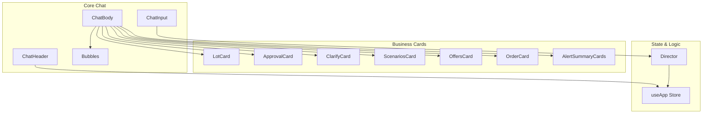
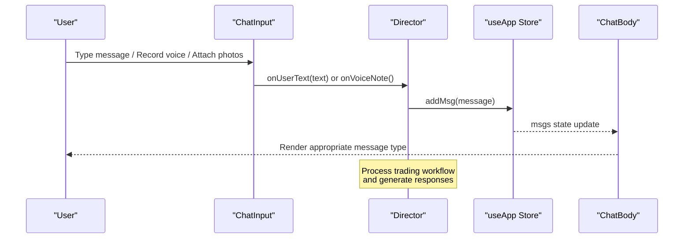
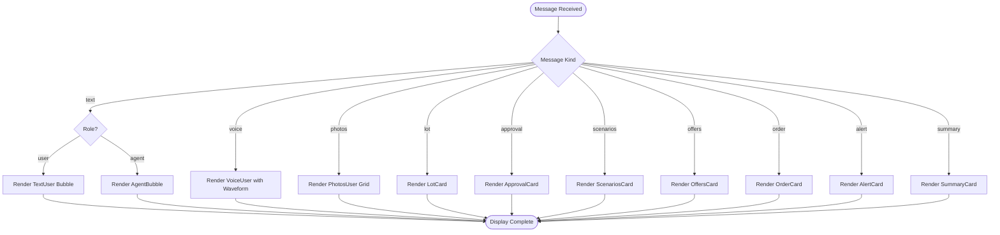
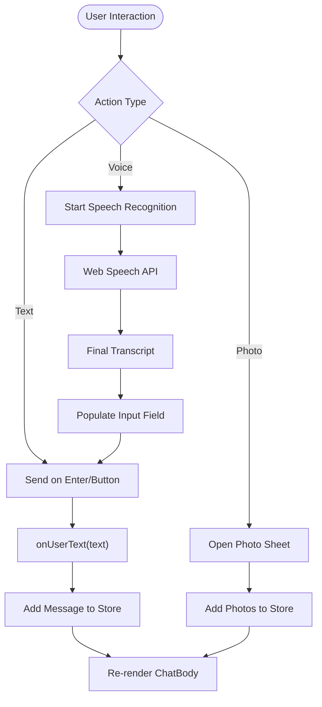

# AI Elements Interface

<cite>
**Referenced Files in This Document**
- [ChatBody.tsx](file://freshroute/src/components/ChatBody.tsx)
- [ChatInput.tsx](file://freshroute/src/components/ChatInput.tsx)
- [ChatHeader.tsx](file://freshroute/src/components/ChatHeader.tsx)
- [Bubbles.tsx](file://freshroute/src/components/Bubbles.tsx)
- [LotCard.tsx](file://freshroute/src/components/cards/LotCard.tsx)
- [ApprovalCard.tsx](file://freshroute/src/components/cards/ApprovalCard.tsx)
- [ClarifyCard.tsx](file://freshroute/src/components/cards/ClarifyCard.tsx)
- [ScenariosCard.tsx](file://freshroute/src/components/cards/ScenariosCard.tsx)
- [OffersCard.tsx](file://freshroute/src/components/cards/OffersCard.tsx)
- [OrderCard.tsx](file://freshroute/src/components/cards/OrderCard.tsx)
- [AlertSummaryCards.tsx](file://freshroute/src/components/cards/AlertSummaryCards.tsx)
- [director.ts](file://freshroute/src/store/director.ts)
- [useApp.ts](file://freshroute/src/store/useApp.ts)
</cite>

## Update Summary
**Changes Made**
- **Complete Removal**: All 48 AI elements components have been completely removed from the codebase (agent.tsx, artifact.tsx, attachments.tsx, audio-player.tsx, canvas.tsx, chain-of-thought.tsx, checkpoint.tsx, code-block.tsx, commit.tsx, confirmation.tsx, connection.tsx, context.tsx, controls.tsx, conversation.tsx, edge.tsx, environment-variables.tsx, file-tree.tsx, image.tsx, inline-citation.tsx, jsx-preview.tsx, message.tsx, mic-selector.tsx, model-selector.tsx, node.tsx, open-in-chat.tsx, package-info.tsx, panel.tsx, persona.tsx, plan.tsx, prompt-input.tsx, queue.tsx, reasoning.tsx, sandbox.tsx, schema-display.tsx, shimmer.tsx, snippet.tsx, sources.tsx, speech-input.tsx, stack-trace.tsx, suggestion.tsx, task.tsx, terminal.tsx, test-results.tsx, tool.tsx, toolbar.tsx, transcription.tsx, voice-selector.tsx, web-preview.tsx)
- **Simplified Architecture**: Replaced complex AI elements interface with streamlined chat components focused on produce trading functionality
- **Current State Documentation**: Updated to reflect the actual implementation using basic chat components and business-specific cards
- **Removed Advanced Features**: Eliminated references to terminal interfaces, web previews, chain-of-thought reasoning, checkpoint management, environment variables, sandboxed code execution, and other advanced AI features

## Table of Contents
1. [Introduction](#introduction)
2. [Project Structure](#project-structure)
3. [Core Components](#core-components)
4. [Architecture Overview](#architecture-overview)
5. [Detailed Component Analysis](#detailed-component-analysis)
6. [Business Logic Integration](#business-logic-integration)
7. [State Management](#state-management)
8. [Performance Considerations](#performance-considerations)
9. [Troubleshooting Guide](#troubleshooting-guide)
10. [Conclusion](#conclusion)

## Introduction
This document describes the current chat interface implementation used by the FreshRoute application for produce trading assistance. The system has undergone significant simplification, removing all 48 advanced AI elements components in favor of a streamlined chat interface focused on core trading workflows. The current implementation provides essential chat functionality including text messaging, voice notes, photo sharing, and specialized business cards for lot management, approvals, scenarios, offers, orders, alerts, and summaries. It focuses on the simplified component library under src/components, explaining how the chat flow, input handling, and business-specific UI elements work together to create an efficient trading assistant experience.

## Project Structure
The current FreshRoute chat interface is organized as a focused set of React components that provide essential trading assistance functionality:

**Diagram sources**
- [ChatBody.tsx:32-84](file://freshroute/src/components/ChatBody.tsx#L32-L84)
- [ChatInput.tsx:18-199](file://freshroute/src/components/ChatInput.tsx#L18-L199)
- [ChatHeader.tsx:6-59](file://freshroute/src/components/ChatHeader.tsx#L6-L59)
- [Bubbles.tsx:11-137](file://freshroute/src/components/Bubbles.tsx#L11-L137)

**Section sources**
- [ChatBody.tsx:32-84](file://freshroute/src/components/ChatBody.tsx#L32-L84)
- [ChatInput.tsx:18-199](file://freshroute/src/components/ChatInput.tsx#L18-L199)
- [ChatHeader.tsx:6-59](file://freshroute/src/components/ChatHeader.tsx#L6-L59)

## Core Components
The current FreshRoute chat interface provides essential trading assistance through simplified components:

### Core Chat Components
- **ChatBody**: Scrollable message container that renders different message types based on message kind (text, voice, photos, lot, clarify, scenarios, approval, offers, order, alert, summary)
- **ChatInput**: Text input with integrated voice recording using Web Speech API, photo attachment support, and send functionality
- **ChatHeader**: Application header with language toggle (English/Urdu), audit log access, and settings integration
- **Bubbles**: Message bubble components including AgentBubble for AI responses, UserBubble for user messages, TextUser for text messages, VoiceUser for voice notes, and PhotosUser for photo attachments

### Business-Specific Card Components
- **LotCard**: Displays produce lot details with vision analysis results
- **ApprovalCard**: Provides approve/reject action buttons for workflow approvals
- **ClarifyCard**: Handles follow-up question forms for clarification
- **ScenariosCard**: Shows ranked market comparison scenarios
- **OffersCard**: Displays buyer offers with transport options
- **OrderCard**: Manages order confirmation and tracking steps
- **AlertSummaryCards**: Contains alert and completion summary cards

**Section sources**
- [ChatBody.tsx:32-84](file://freshroute/src/components/ChatBody.tsx#L32-L84)
- [ChatInput.tsx:18-199](file://freshroute/src/components/ChatInput.tsx#L18-L199)
- [ChatHeader.tsx:6-59](file://freshroute/src/components/ChatHeader.tsx#L6-L59)
- [Bubbles.tsx:11-137](file://freshroute/src/components/Bubbles.tsx#L11-L137)

## Architecture Overview
The current FreshRoute chat interface follows a straightforward architecture with clear separation between UI components and business logic:

**Diagram sources**
- [ChatInput.tsx:27-32](file://freshroute/src/components/ChatInput.tsx#L27-L32)
- [director.ts:175-233](file://freshroute/src/store/director.ts#L175-L233)
- [useApp.ts:128-134](file://freshroute/src/store/useApp.ts#L128-L134)
- [ChatBody.tsx:47-78](file://freshroute/src/components/ChatBody.tsx#L47-L78)

## Detailed Component Analysis

### Chat Body and Message Rendering
- **ChatBody**: Implements scroll-aware message rendering with automatic scrolling to latest messages, supports multiple message types through switch-based rendering, includes typing indicator for loading states
- **Message Types**: Supports text messages (user/agent), voice notes with waveform visualization, photo attachments with grid layout, and various business-specific cards

**Diagram sources**
- [ChatBody.tsx:47-78](file://freshroute/src/components/ChatBody.tsx#L47-L78)

**Section sources**
- [ChatBody.tsx:32-84](file://freshroute/src/components/ChatBody.tsx#L32-L84)
- [Bubbles.tsx:11-137](file://freshroute/src/components/Bubbles.tsx#L11-L137)

### Input System with Voice Recognition
- **ChatInput**: Comprehensive input handling with text entry, integrated voice recording using Web Speech API, photo attachment via bottom sheet, and send functionality
- **Voice Recording**: Implements real-time speech recognition with interim results, error handling for microphone permissions, and fallback to demo voice when unsupported
- **Error Handling**: Provides user-friendly error messages for speech recognition issues, microphone access problems, and browser compatibility

**Diagram sources**
- [ChatInput.tsx:27-32](file://freshroute/src/components/ChatInput.tsx#L27-L32)
- [ChatInput.tsx:38-105](file://freshroute/src/components/ChatInput.tsx#L38-L105)

**Section sources**
- [ChatInput.tsx:18-199](file://freshroute/src/components/ChatInput.tsx#L18-L199)

### Header and Application Controls
- **ChatHeader**: Application header with branding, language toggle between English and Urdu, audit log access, and settings integration
- **Language Support**: Real-time language switching affecting placeholder text and UI labels throughout the application
- **Navigation**: Integrated access to audit drawer and settings sheet for user preferences and action logging

**Section sources**
- [ChatHeader.tsx:6-59](file://freshroute/src/components/ChatHeader.tsx#L6-L59)

## Business Logic Integration
The chat interface integrates with the director state machine for trading workflows:

### Director State Machine
- **Conversation Flow**: Orchestrates the entire trading workflow from initial greeting through order completion
- **Message Processing**: Routes user inputs through appropriate flows (intakeFlow, chatFlow) based on conversation stage
- **AI Integration**: For authenticated users, routes through ADK agent for intelligent responses and approval workflows

### Message Types and Business Cards
- **Text Messages**: Basic text communication between user and agent
- **Voice Notes**: Audio message support with waveform visualization
- **Photo Attachments**: Image sharing for produce inspection and documentation
- **Business Cards**: Specialized components for lot management, approvals, scenarios, offers, orders, alerts, and summaries

**Section sources**
- [director.ts:175-233](file://freshroute/src/store/director.ts#L175-L233)
- [useApp.ts:128-134](file://freshroute/src/store/useApp.ts#L128-L134)

## State Management
The application uses Zustand for global state management:

### Store Structure
- **Messages**: Array of message objects with unique IDs, roles, kinds, and content
- **UI State**: Language preference, active sheets, drawer visibility, typing indicators
- **Session Data**: User authentication status, profile information, and role assignments
- **Business State**: Current conversation stage, approval statuses, order information

### Message Creation Functions
- **agentText**: Creates agent response messages with timestamp
- **userText**: Creates user input messages with timestamp
- **addAudit**: Logs actions for audit trail purposes

**Section sources**
- [useApp.ts:87-134](file://freshroute/src/store/useApp.ts#L87-L134)

## Performance Considerations
The current implementation focuses on performance optimization for chat functionality:

### Efficient Rendering
- **Conditional Rendering**: Switch-based message rendering prevents unnecessary component creation
- **Scroll Optimization**: Smooth scrolling to latest messages without full re-renders
- **Image Loading**: Lazy loading for photo attachments to improve initial load time

### Memory Management
- **Component Cleanup**: Proper cleanup of speech recognition instances on unmount
- **Event Listeners**: Careful management of Web Speech API event handlers
- **State Updates**: Minimal state updates to prevent excessive re-renders

## Troubleshooting Guide
Common issues and resolutions for the current chat interface:

### Voice Recognition Issues
- **Speech Recognition Not Supported**: Check browser compatibility (Chrome/Edge recommended); falls back to demo voice mode
- **Microphone Access Denied**: Guide users to browser settings to grant microphone permissions
- **No Speech Detected**: Provide clear feedback and retry instructions

### Message Display Problems
- **Messages Not Appearing**: Verify store state updates and ChatBody re-rendering
- **Incorrect Message Type**: Check message kind property and switch statement logic
- **Scroll Position Issues**: Ensure endRef is properly attached and scrollIntoView is called

### Photo Attachment Issues
- **Photo Sheet Not Opening**: Verify setSheet function calls and sheet state management
- **Image Loading Failures**: Check image URLs and lazy loading implementation

**Section sources**
- [ChatInput.tsx:38-105](file://freshroute/src/components/ChatInput.tsx#L38-L105)
- [ChatBody.tsx:37-39](file://freshroute/src/components/ChatBody.tsx#L37-L39)

## Conclusion
The current FreshRoute chat interface provides a streamlined, focused solution for produce trading assistance. While the advanced AI elements components have been removed, the simplified architecture delivers essential functionality including text messaging, voice notes, photo sharing, and specialized business cards for trading workflows. The implementation prioritizes usability, performance, and maintainability while supporting both English and Urdu languages. The integration with the director state machine enables sophisticated trading workflows, making it an effective tool for agricultural marketplace operations.