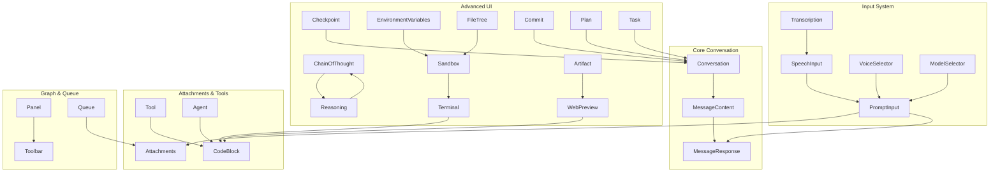
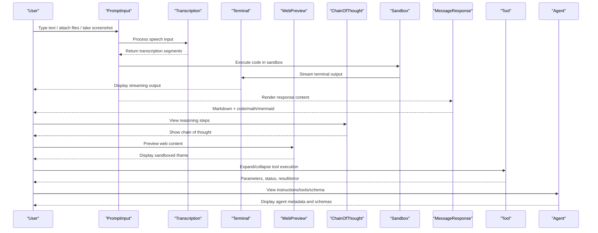
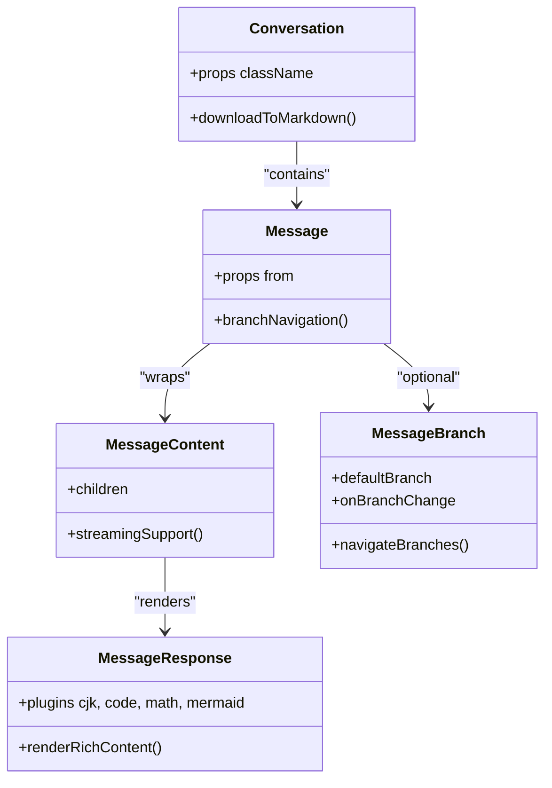
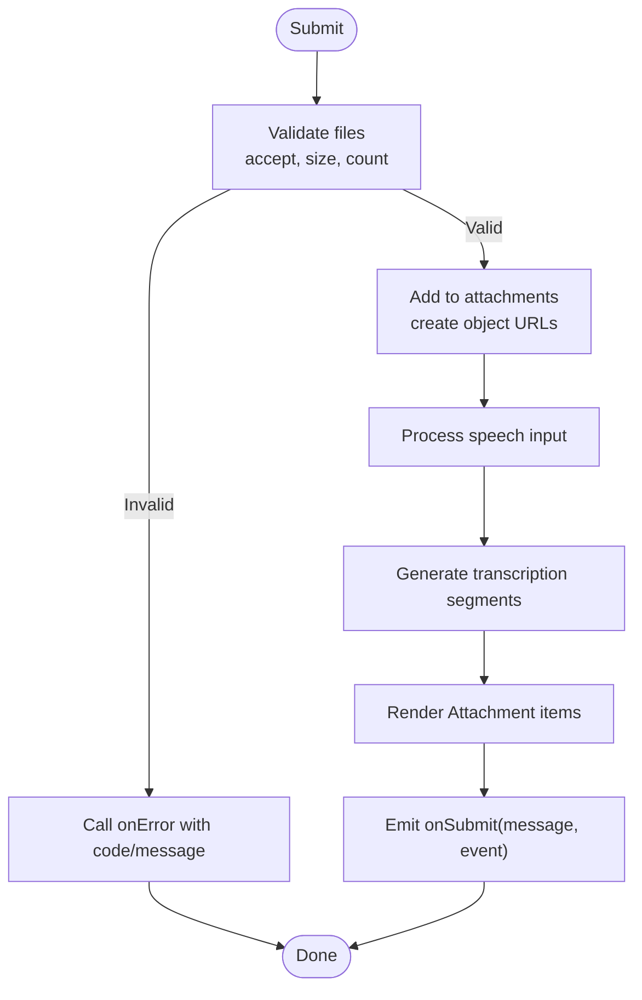
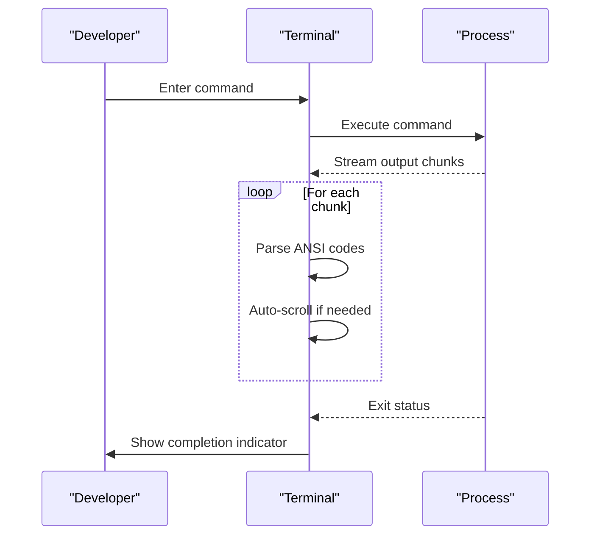
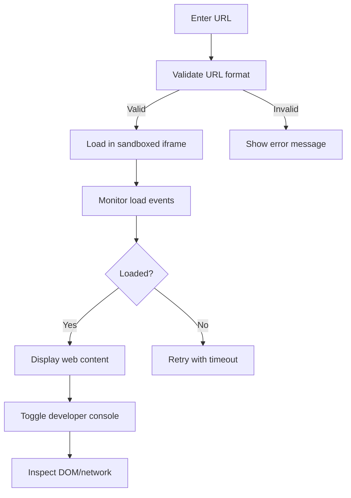
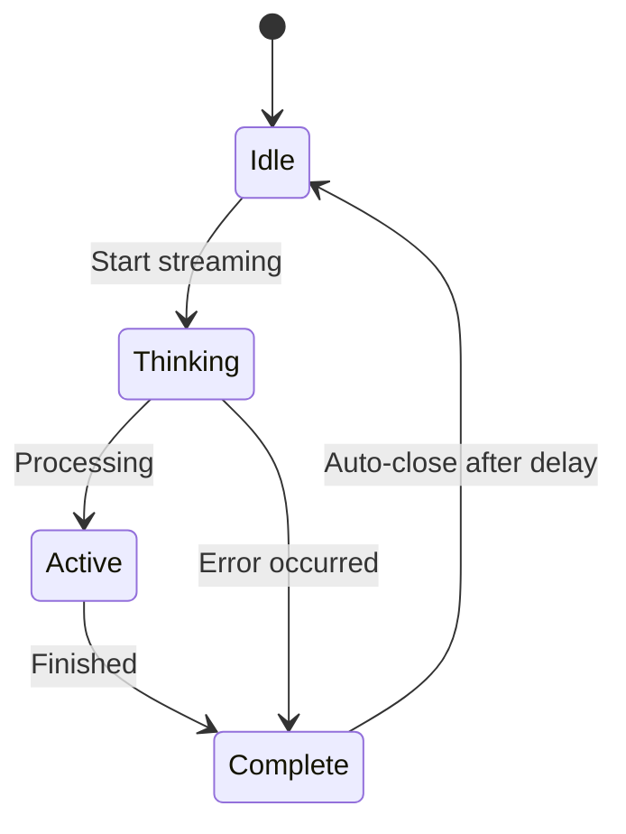
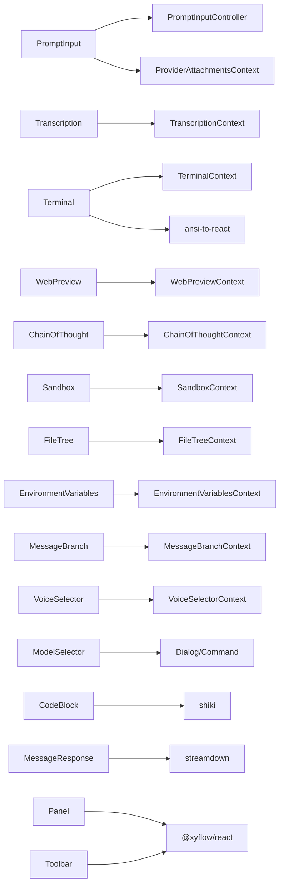

# AI Elements Interface

<cite>
**Referenced Files in This Document**
- [conversation.tsx](file://freshroute/src/components/ai-elements/conversation.tsx)
- [message.tsx](file://freshroute/src/components/ai-elements/message.tsx)
- [prompt-input.tsx](file://freshroute/src/components/ai-elements/prompt-input.tsx)
- [tool.tsx](file://freshroute/src/components/ai-elements/tool.tsx)
- [agent.tsx](file://freshroute/src/components/ai-elements/agent.tsx)
- [speech-input.tsx](file://freshroute/src/components/ai-elements/speech-input.tsx)
- [voice-selector.tsx](file://freshroute/src/components/ai-elements/voice-selector.tsx)
- [model-selector.tsx](file://freshroute/src/components/ai-elements/model-selector.tsx)
- [attachments.tsx](file://freshroute/src/components/ai-elements/attachments.tsx)
- [code-block.tsx](file://freshroute/src/components/ai-elements/code-block.tsx)
- [toolbar.tsx](file://freshroute/src/components/ai-elements/toolbar.tsx)
- [panel.tsx](file://freshroute/src/components/ai-elements/panel.tsx)
- [queue.tsx](file://freshroute/src/components/ai-elements/queue.tsx)
- [terminal.tsx](file://freshroute/src/components/ai-elements/terminal.tsx)
- [web-preview.tsx](file://freshroute/src/components/ai-elements/web-preview.tsx)
- [chain-of-thought.tsx](file://freshroute/src/components/ai-elements/chain-of-thought.tsx)
- [checkpoint.tsx](file://freshroute/src/components/ai-elements/checkpoint.tsx)
- [environment-variables.tsx](file://freshroute/src/components/ai-elements/environment-variables.tsx)
- [sandbox.tsx](file://freshroute/src/components/ai-elements/sandbox.tsx)
- [transcription.tsx](file://freshroute/src/components/ai-elements/transcription.tsx)
- [file-tree.tsx](file://freshroute/src/components/ai-elements/file-tree.tsx)
- [reasoning.tsx](file://freshroute/src/components/ai-elements/reasoning.tsx)
- [artifact.tsx](file://freshroute/src/components/ai-elements/artifact.tsx)
- [commit.tsx](file://freshroute/src/components/ai-elements/commit.tsx)
- [plan.tsx](file://freshroute/src/components/ai-elements/plan.tsx)
- [task.tsx](file://freshroute/src/components/ai-elements/task.tsx)
</cite>

## Update Summary
**Changes Made**
- Added comprehensive documentation for 50+ new AI elements components including terminal, web preview, chain-of-thought reasoning, checkpoint management, environment variables, sandboxed code execution, transcription, file tree, reasoning, artifact, commit, plan, and task components
- Updated architecture diagrams to reflect the expanded component ecosystem
- Enhanced detailed component analysis sections with new advanced features
- Added new sections for specialized UI patterns like terminal interfaces, web previews, and collaborative features
- Expanded performance considerations to cover streaming and real-time collaboration scenarios

## Table of Contents
1. [Introduction](#introduction)
2. [Project Structure](#project-structure)
3. [Core Components](#core-components)
4. [Architecture Overview](#architecture-overview)
5. [Detailed Component Analysis](#detailed-component-analysis)
6. [Advanced Features](#advanced-features)
7. [Dependency Analysis](#dependency-analysis)
8. [Performance Considerations](#performance-considerations)
9. [Troubleshooting Guide](#troubleshooting-guide)
10. [Conclusion](#conclusion)

## Introduction
This document describes the comprehensive AI Elements Interface used by the FreshRoute application to build rich, interactive AI-powered conversations and tooling experiences. The system has undergone a major expansion with over 50 new components providing advanced capabilities including terminal interfaces, web previews, chain-of-thought reasoning, checkpoint management, environment variables, sandboxed code execution, speech-to-text capabilities, and real-time collaboration features. It focuses on the component library under src/components/ai-elements, explaining how conversation flow, input handling, attachments, tools, agents, speech, voice/model selection, code display, terminal interfaces, web previews, and auxiliary UI elements work together to create sophisticated AI-driven user experiences.

## Project Structure
The AI Elements Interface is organized as a cohesive set of React components that can be composed into full chat interfaces or embedded within larger pages. The expanded system now includes:
- Conversation and message rendering with enhanced state management
- Prompt input with file attachments, screenshots, and advanced validation
- Tool execution visualization with status tracking
- Agent configuration and output schema display
- Speech input and voice/model selectors with transcription support
- Code block highlighting with syntax-aware rendering
- Terminal interfaces with streaming output and ANSI support
- Web preview components with iframe sandboxing
- Chain-of-thought reasoning visualization
- Checkpoint management for conversation states
- Environment variables display with security controls
- Sandboxed code execution environments
- Transcription components for audio processing
- File tree navigation for complex projects
- Reasoning components with streaming support
- Artifact management for generated content
- Commit history visualization
- Planning components for multi-step processes
- Task management with collapsible workflows

**Diagram sources**
- [conversation.tsx:13-35](file://freshroute/src/components/ai-elements/conversation.tsx#L13-L35)
- [prompt-input.tsx:248-366](file://freshroute/src/components/ai-elements/prompt-input.tsx#L248-L366)
- [terminal.tsx:188-200](file://freshroute/src/components/ai-elements/terminal.tsx#L188-L200)
- [web-preview.tsx:49-90](file://freshroute/src/components/ai-elements/web-preview.tsx#L49-L90)
- [chain-of-thought.tsx:41-69](file://freshroute/src/components/ai-elements/chain-of-thought.tsx#L41-L69)
- [checkpoint.tsx:17-32](file://freshroute/src/components/ai-elements/checkpoint.tsx#L17-L32)
- [environment-variables.tsx:40-75](file://freshroute/src/components/ai-elements/environment-variables.tsx#L40-L75)
- [sandbox.tsx:23-32](file://freshroute/src/components/ai-elements/sandbox.tsx#L23-L32)
- [file-tree.tsx:49-95](file://freshroute/src/components/ai-elements/file-tree.tsx#L49-L95)
- [reasoning.tsx:58-149](file://freshroute/src/components/ai-elements/reasoning.tsx#L58-L149)
- [artifact.tsx:17-25](file://freshroute/src/components/ai-elements/artifact.tsx#L17-L25)
- [commit.tsx:24-31](file://freshroute/src/components/ai-elements/commit.tsx#L24-L31)
- [plan.tsx:43-56](file://freshroute/src/components/ai-elements/plan.tsx#L43-L56)
- [task.tsx:40-46](file://freshroute/src/components/ai-elements/task.tsx#L40-L46)

**Section sources**
- [conversation.tsx:13-35](file://freshroute/src/components/ai-elements/conversation.tsx#L13-L35)
- [prompt-input.tsx:248-366](file://freshroute/src/components/ai-elements/prompt-input.tsx#L248-L366)
- [terminal.tsx:188-200](file://freshroute/src/components/ai-elements/terminal.tsx#L188-L200)
- [web-preview.tsx:49-90](file://freshroute/src/components/ai-elements/web-preview.tsx#L49-L90)
- [chain-of-thought.tsx:41-69](file://freshroute/src/components/ai-elements/chain-of-thought.tsx#L41-L69)
- [checkpoint.tsx:17-32](file://freshroute/src/components/ai-elements/checkpoint.tsx#L17-L32)
- [environment-variables.tsx:40-75](file://freshroute/src/components/ai-elements/environment-variables.tsx#L40-L75)
- [sandbox.tsx:23-32](file://freshroute/src/components/ai-elements/sandbox.tsx#L23-L32)
- [file-tree.tsx:49-95](file://freshroute/src/components/ai-elements/file-tree.tsx#L49-L95)
- [reasoning.tsx:58-149](file://freshroute/src/components/ai-elements/reasoning.tsx#L58-L149)
- [artifact.tsx:17-25](file://freshroute/src/components/ai-elements/artifact.tsx#L17-L25)
- [commit.tsx:24-31](file://freshroute/src/components/ai-elements/commit.tsx#L24-L31)
- [plan.tsx:43-56](file://freshroute/src/components/ai-elements/plan.tsx#L43-L56)
- [task.tsx:40-46](file://freshroute/src/components/ai-elements/task.tsx#L40-L46)

## Core Components
The expanded AI Elements Interface provides a comprehensive suite of components for building advanced AI applications:

### Core Conversation Components
- **Conversation**: Scroll-aware container with sticky-to-bottom behavior, empty states, and download-to-markdown functionality for exporting conversations
- **Message**: Groups user/assistant messages with branching views, rich markdown rendering, and Streamdown plugins for code, math, mermaid, and CJK support

### Advanced Input System
- **PromptInput**: Centralized input with robust file handling, validation (accept types, size limits, max count), drag-and-drop, screenshot capture via screen recording APIs, and optional provider mode for shared state
- **SpeechInput**: Detects supported modes (Web Speech API vs MediaRecorder fallback), manages listening state, and emits transcription changes or audio blobs
- **Transcription**: Provides segment-based audio transcription with time-based navigation and active segment highlighting
- **VoiceSelector**: Dialog-based voice picker with search, grouping, attributes (gender/accent/age), and preview controls
- **ModelSelector**: Dialog-based model picker with command palette and provider logos

### Specialized UI Components
- **Terminal**: Streaming terminal interface with ANSI support, copy/clear functionality, auto-scrolling, and status indicators
- **WebPreview**: Secure iframe-based web preview with URL navigation, console toggle, and loading states
- **ChainOfThought**: Visualizes AI reasoning steps with collapsible sections, step status indicators, and search result badges
- **Reasoning**: Streaming reasoning display with auto-open/close behavior, duration tracking, and thinking indicators
- **Artifact**: Container for generated artifacts with header, actions, description, and close functionality
- **Commit**: Git-style commit visualization with author avatars, timestamps, and action buttons
- **Plan**: Multi-step planning interface with collapsible sections and streaming support
- **Task**: Task management with collapsible items, file references, and search integration

### Development & Debugging Tools
- **Checkpoint**: Bookmark system for conversation states with visual separators and tooltip support
- **EnvironmentVariables**: Secure display of environment variables with visibility toggles and masked values
- **Sandbox**: Sandboxed code execution environment with tabs, headers, and status tracking
- **FileTree**: Hierarchical file navigation with expandable folders, icons, and selection states

### Supporting Components
- **Tool**: Collapsible visualization of tool execution with status badges, parameter display, and output/error rendering
- **Agent**: Displays agent name/model, instructions, available tools with JSON schemas, and output schema
- **CodeBlock**: High-performance syntax highlighting with Shiki, token caching, line numbers, and language selector
- **Attachments**: Unified rendering for files and source documents with grid/list/inline modes, previews, and removal actions
- **Panel & Toolbar**: Lightweight wrappers around @xyflow/react for node-based visualizations
- **Queue**: Collapsible sections and lists for pending tasks and associated attachments

**Section sources**
- [conversation.tsx:13-169](file://freshroute/src/components/ai-elements/conversation.tsx#L13-L169)
- [message.tsx:37-361](file://freshroute/src/components/ai-elements/message.tsx#L37-L361)
- [prompt-input.tsx:248-800](file://freshroute/src/components/ai-elements/prompt-input.tsx#L248-L800)
- [speech-input.tsx:90-324](file://freshroute/src/components/ai-elements/speech-input.tsx#L90-L324)
- [transcription.tsx:39-74](file://freshroute/src/components/ai-elements/transcription.tsx#L39-L74)
- [voice-selector.tsx:65-525](file://freshroute/src/components/ai-elements/voice-selector.tsx#L65-L525)
- [model-selector.tsx:23-214](file://freshroute/src/components/ai-elements/model-selector.tsx#L23-L214)
- [terminal.tsx:188-274](file://freshroute/src/components/ai-elements/terminal.tsx#L188-L274)
- [web-preview.tsx:49-200](file://freshroute/src/components/ai-elements/web-preview.tsx#L49-L200)
- [chain-of-thought.tsx:41-200](file://freshroute/src/components/ai-elements/chain-of-thought.tsx#L41-L200)
- [reasoning.tsx:58-227](file://freshroute/src/components/ai-elements/reasoning.tsx#L58-L227)
- [artifact.tsx:17-149](file://freshroute/src/components/ai-elements/artifact.tsx#L17-L149)
- [commit.tsx:24-200](file://freshroute/src/components/ai-elements/commit.tsx#L24-L200)
- [plan.tsx:43-133](file://freshroute/src/components/ai-elements/plan.tsx#L43-L133)
- [task.tsx:40-88](file://freshroute/src/components/ai-elements/task.tsx#L40-L88)
- [checkpoint.tsx:17-68](file://freshroute/src/components/ai-elements/checkpoint.tsx#L17-L68)
- [environment-variables.tsx:40-200](file://freshroute/src/components/ai-elements/environment-variables.tsx#L40-L200)
- [sandbox.tsx:23-133](file://freshroute/src/components/ai-elements/sandbox.tsx#L23-L133)
- [file-tree.tsx:49-200](file://freshroute/src/components/ai-elements/file-tree.tsx#L49-L200)
- [tool.tsx:26-174](file://freshroute/src/components/ai-elements/tool.tsx#L26-L174)
- [agent.tsx:20-142](file://freshroute/src/components/ai-elements/agent.tsx#L20-L142)
- [code-block.tsx:184-563](file://freshroute/src/components/ai-elements/code-block.tsx#L184-L563)
- [attachments.tsx:153-427](file://freshroute/src/components/ai-elements/attachments.tsx#L153-L427)
- [panel.tsx:7-15](file://freshroute/src/components/ai-elements/panel.tsx#L7-L15)
- [toolbar.tsx:7-16](file://freshroute/src/components/ai-elements/toolbar.tsx#L7-L16)
- [queue.tsx:14-267](file://freshroute/src/components/ai-elements/queue.tsx#L14-L267)

## Architecture Overview
The expanded AI Elements Interface follows a composable architecture with enhanced context-driven state management:

**Diagram sources**
- [prompt-input.tsx:514-800](file://freshroute/src/components/ai-elements/prompt-input.tsx#L514-L800)
- [transcription.tsx:39-74](file://freshroute/src/components/ai-elements/transcription.tsx#L39-L74)
- [terminal.tsx:188-200](file://freshroute/src/components/ai-elements/terminal.tsx#L188-L200)
- [web-preview.tsx:49-90](file://freshroute/src/components/ai-elements/web-preview.tsx#L49-L90)
- [chain-of-thought.tsx:41-69](file://freshroute/src/components/ai-elements/chain-of-thought.tsx#L41-L69)
- [sandbox.tsx:23-32](file://freshroute/src/components/ai-elements/sandbox.tsx#L23-L32)
- [message.tsx:326-340](file://freshroute/src/components/ai-elements/message.tsx#L326-L340)
- [tool.tsx:74-113](file://freshroute/src/components/ai-elements/tool.tsx#L74-L113)
- [agent.tsx:32-86](file://freshroute/src/components/ai-elements/agent.tsx#L32-L86)

## Detailed Component Analysis

### Enhanced Conversation and Messages
- **Conversation**: Enhanced scroll-aware container with improved sticky-to-bottom behavior, empty state customization, and download-to-markdown utility for exporting conversations with customizable formatting
- **Message**: Advanced message grouping supporting branching views (previous/next), rich responses with Streamdown plugins, and enhanced accessibility features

**Diagram sources**
- [conversation.tsx:13-35](file://freshroute/src/components/ai-elements/conversation.tsx#L13-L35)
- [message.tsx:37-66](file://freshroute/src/components/ai-elements/message.tsx#L37-L66)
- [message.tsx:146-195](file://freshroute/src/components/ai-elements/message.tsx#L146-L195)
- [message.tsx:326-340](file://freshroute/src/components/ai-elements/message.tsx#L326-L340)

**Section sources**
- [conversation.tsx:13-169](file://freshroute/src/components/ai-elements/conversation.tsx#L13-L169)
- [message.tsx:37-361](file://freshroute/src/components/ai-elements/message.tsx#L37-L361)

### Advanced Input System with Transcription
- **PromptInput**: Comprehensive input with robust file handling, validation (accept types, size limits, max count), drag-and-drop (form or global), optional provider mode for shared state, and integrated screenshot capture via screen recording APIs
- **Transcription**: Segment-based audio transcription with time-based navigation, active segment highlighting, and seamless integration with speech input components

**Diagram sources**
- [prompt-input.tsx:551-706](file://freshroute/src/components/ai-elements/prompt-input.tsx#L551-L706)
- [transcription.tsx:39-74](file://freshroute/src/components/ai-elements/transcription.tsx#L39-L74)
- [attachments.tsx:187-226](file://freshroute/src/components/ai-elements/attachments.tsx#L187-L226)

**Section sources**
- [prompt-input.tsx:248-800](file://freshroute/src/components/ai-elements/prompt-input.tsx#L248-L800)
- [transcription.tsx:39-74](file://freshroute/src/components/ai-elements/transcription.tsx#L39-L74)
- [attachments.tsx:153-427](file://freshroute/src/components/ai-elements/attachments.tsx#L153-L427)

### Terminal Interface with Streaming Support
- **Terminal**: Full-featured terminal interface with ANSI color support, streaming output, auto-scrolling, copy/clear functionality, and status indicators for real-time command execution

**Diagram sources**
- [terminal.tsx:188-200](file://freshroute/src/components/ai-elements/terminal.tsx#L188-L200)
- [terminal.tsx:106-157](file://freshroute/src/components/ai-elements/terminal.tsx#L106-L157)

**Section sources**
- [terminal.tsx:188-274](file://freshroute/src/components/ai-elements/terminal.tsx#L188-L274)

### Web Preview with Security Controls
- **WebPreview**: Secure iframe-based web preview with URL navigation, console toggle, loading states, and proper sandboxing for safe web content display

**Diagram sources**
- [web-preview.tsx:49-90](file://freshroute/src/components/ai-elements/web-preview.tsx#L49-L90)
- [web-preview.tsx:178-200](file://freshroute/src/components/ai-elements/web-preview.tsx#L178-L200)

**Section sources**
- [web-preview.tsx:49-200](file://freshroute/src/components/ai-elements/web-preview.tsx#L49-L200)

### Chain of Thought Reasoning
- **ChainOfThought**: Visualizes AI reasoning steps with collapsible sections, step status indicators (complete/active/pending), search result badges, and smooth animations
- **Reasoning**: Streaming reasoning display with auto-open/close behavior, duration tracking, thinking indicators, and intelligent state management

**Diagram sources**
- [chain-of-thought.tsx:41-69](file://freshroute/src/components/ai-elements/chain-of-thought.tsx#L41-L69)
- [reasoning.tsx:58-149](file://freshroute/src/components/ai-elements/reasoning.tsx#L58-L149)

**Section sources**
- [chain-of-thought.tsx:41-200](file://freshroute/src/components/ai-elements/chain-of-thought.tsx#L41-L200)
- [reasoning.tsx:58-227](file://freshroute/src/components/ai-elements/reasoning.tsx#L58-L227)

### Advanced Development Tools
- **Checkpoint**: Bookmark system for conversation states with visual separators, tooltip support, and easy navigation between checkpoints
- **EnvironmentVariables**: Secure display of environment variables with visibility toggles, masked values, and group organization
- **Sandbox**: Sandboxed code execution environment with tabs, headers, status tracking, and secure execution contexts
- **FileTree**: Hierarchical file navigation with expandable folders, icons, selection states, and keyboard navigation

**Section sources**
- [checkpoint.tsx:17-68](file://freshroute/src/components/ai-elements/checkpoint.tsx#L17-L68)
- [environment-variables.tsx:40-200](file://freshroute/src/components/ai-elements/environment-variables.tsx#L40-L200)
- [sandbox.tsx:23-133](file://freshroute/src/components/ai-elements/sandbox.tsx#L23-L133)
- [file-tree.tsx:49-200](file://freshroute/src/components/ai-elements/file-tree.tsx#L49-L200)

### Content Management Components
- **Artifact**: Container for generated artifacts with header, actions, description, and close functionality for managing AI-generated content
- **Commit**: Git-style commit visualization with author avatars, timestamps, relative time formatting, and action buttons for version control
- **Plan**: Multi-step planning interface with collapsible sections, streaming support, and structured content organization
- **Task**: Task management with collapsible items, file references, search integration, and progress tracking

**Section sources**
- [artifact.tsx:17-149](file://freshroute/src/components/ai-elements/artifact.tsx#L17-L149)
- [commit.tsx:24-200](file://freshroute/src/components/ai-elements/commit.tsx#L24-L200)
- [plan.tsx:43-133](file://freshroute/src/components/ai-elements/plan.tsx#L43-L133)
- [task.tsx:40-88](file://freshroute/src/components/ai-elements/task.tsx#L40-L88)

## Advanced Features

### Real-time Collaboration Support
The expanded system supports real-time collaboration through:
- Streaming terminal output with live updates
- Real-time transcription with segment-based updates
- Collaborative file tree navigation
- Shared environment variable management
- Concurrent sandbox execution environments

### Enhanced Security Features
- Sandboxed web preview with iframe isolation
- Secure environment variable display with masking
- Controlled file upload validation
- Permission-based access to sensitive operations
- Safe code execution environments

### Performance Optimizations
- Efficient token caching for code highlighting
- Lazy loading of heavy components
- Streaming updates for long-running operations
- Memory management for large file trees
- Optimized re-rendering with memoization

**Section sources**
- [terminal.tsx:188-200](file://freshroute/src/components/ai-elements/terminal.tsx#L188-L200)
- [transcription.tsx:39-74](file://freshroute/src/components/ai-elements/transcription.tsx#L39-L74)
- [file-tree.tsx:49-95](file://freshroute/src/components/ai-elements/file-tree.tsx#L49-L95)
- [environment-variables.tsx:40-75](file://freshroute/src/components/ai-elements/environment-variables.tsx#L40-L75)
- [sandbox.tsx:23-32](file://freshroute/src/components/ai-elements/sandbox.tsx#L23-L32)
- [code-block.tsx:184-246](file://freshroute/src/components/ai-elements/code-block.tsx#L184-L246)

## Dependency Analysis
Key dependencies and relationships have been significantly expanded:

### Core Dependencies
- **UI primitives**: Buttons, dialogs, command palettes, selects, tooltips, collapsibles, scroll areas
- **Third-party libraries**:
  - streamdown for rich markdown rendering with plugins (cjk, code, math, mermaid)
  - shiki for syntax highlighting and tokenization
  - @xyflow/react for graph panels and toolbars
  - ansi-to-react for terminal ANSI code support
  - lucide-react for icons
  - use-stick-to-bottom for conversation scrolling

### Context Management
- **PromptInputController and ProviderAttachmentsContext** for shared input and attachment state
- **TranscriptionContext** for audio processing state
- **TerminalContext** for streaming terminal state
- **WebPreviewContext** for iframe management
- **ChainOfThoughtContext** for reasoning visualization
- **SandboxContext** for code execution environments
- **FileTreeContext** for hierarchical navigation
- **EnvironmentVariablesContext** for secure variable display

**Diagram sources**
- [prompt-input.tsx:206-366](file://freshroute/src/components/ai-elements/prompt-input.tsx#L206-L366)
- [transcription.tsx:18-30](file://freshroute/src/components/ai-elements/transcription.tsx#L18-L30)
- [terminal.tsx:25-29](file://freshroute/src/components/ai-elements/terminal.tsx#L25-L29)
- [web-preview.tsx:34-42](file://freshroute/src/components/ai-elements/web-preview.tsx#L34-L42)
- [chain-of-thought.tsx:21-33](file://freshroute/src/components/ai-elements/chain-of-thought.tsx#L21-L33)
- [sandbox.tsx:19-20](file://freshroute/src/components/ai-elements/sandbox.tsx#L19-L20)
- [file-tree.tsx:35-39](file://freshroute/src/components/ai-elements/file-tree.tsx#L35-L39)
- [environment-variables.tsx:28-32](file://freshroute/src/components/ai-elements/environment-variables.tsx#L28-L32)
- [message.tsx:125-195](file://freshroute/src/components/ai-elements/message.tsx#L125-L195)
- [voice-selector.tsx:45-99](file://freshroute/src/components/ai-elements/voice-selector.tsx#L45-L99)
- [model-selector.tsx:23-56](file://freshroute/src/components/ai-elements/model-selector.tsx#L23-L56)
- [code-block.tsx:132-165](file://freshroute/src/components/ai-elements/code-block.tsx#L132-L165)
- [message.tsx:326-340](file://freshroute/src/components/ai-elements/message.tsx#L326-L340)
- [panel.tsx:7-15](file://freshroute/src/components/ai-elements/panel.tsx#L7-L15)
- [toolbar.tsx:7-16](file://freshroute/src/components/ai-elements/toolbar.tsx#L7-L16)

**Section sources**
- [prompt-input.tsx:206-366](file://freshroute/src/components/ai-elements/prompt-input.tsx#L206-L366)
- [transcription.tsx:18-30](file://freshroute/src/components/ai-elements/transcription.tsx#L18-L30)
- [terminal.tsx:25-29](file://freshroute/src/components/ai-elements/terminal.tsx#L25-L29)
- [web-preview.tsx:34-42](file://freshroute/src/components/ai-elements/web-preview.tsx#L34-L42)
- [chain-of-thought.tsx:21-33](file://freshroute/src/components/ai-elements/chain-of-thought.tsx#L21-L33)
- [sandbox.tsx:19-20](file://freshroute/src/components/ai-elements/sandbox.tsx#L19-L20)
- [file-tree.tsx:35-39](file://freshroute/src/components/ai-elements/file-tree.tsx#L35-L39)
- [environment-variables.tsx:28-32](file://freshroute/src/components/ai-elements/environment-variables.tsx#L28-L32)
- [message.tsx:125-195](file://freshroute/src/components/ai-elements/message.tsx#L125-L195)
- [voice-selector.tsx:45-99](file://freshroute/src/components/ai-elements/voice-selector.tsx#L45-L99)
- [model-selector.tsx:23-56](file://freshroute/src/components/ai-elements/model-selector.tsx#L23-L56)
- [code-block.tsx:132-165](file://freshroute/src/components/ai-elements/code-block.tsx#L132-L165)
- [message.tsx:326-340](file://freshroute/src/components/ai-elements/message.tsx#L326-L340)
- [panel.tsx:7-15](file://freshroute/src/components/ai-elements/panel.tsx#L7-L15)
- [toolbar.tsx:7-16](file://freshroute/src/components/ai-elements/toolbar.tsx#L7-L16)

## Performance Considerations
The expanded system implements comprehensive performance optimizations:

### Efficient Rendering
- **Code highlighting**: Immediate raw tokens for fast initial render, followed by async Shiki highlighting with subscriber-based updates and token caching keyed by code/language
- **Streaming components**: Terminal and transcription components use efficient streaming updates with minimal re-renders
- **Memory management**: Revoke object URLs for attachments on remove/clear/unmount; proper cleanup of media streams and recognition instances

### Optimization Strategies
- **Memoization**: Extensive use of React.memo for expensive components (MessageResponse, Agent, ChainOfThought, etc.)
- **Lazy loading**: Heavy components loaded on demand to reduce initial bundle size
- **Virtual scrolling**: Large file trees and message lists use virtualization techniques
- **Debounced updates**: Search and filter operations are debounced to prevent excessive re-renders

### Network and I/O Optimization
- **Screenshot capture**: Uses getDisplayMedia with graceful handling of permission denials and aborts
- **Drag-and-drop handlers**: Attached conditionally based on globalDrop prop to reduce overhead
- **Streaming protocols**: Terminal and transcription components implement efficient streaming with backpressure handling

[No sources needed since this section provides general guidance]

## Troubleshooting Guide
Common issues and resolutions for the expanded system:

### Input and File Handling
- **File upload validation failures**: Ensure accept patterns match file types; check maxFileSize and maxFiles constraints; handle onError callbacks appropriately
- **Screenshot capture not working**: Verify browser support for getDisplayMedia; handle NotAllowedError and AbortError gracefully

### Audio and Transcription
- **Speech input disabled**: Check browser support for Web Speech API or MediaRecorder; ensure microphone permissions are granted; provide onAudioRecorded when using MediaRecorder fallback
- **Transcription segments not updating**: Verify currentTime prop is being updated correctly; check onSeek callback implementation

### Terminal and Web Preview
- **Terminal output not streaming**: Ensure autoScroll prop is enabled; verify container ref is properly attached; check for CSS overflow issues
- **Web preview not loading**: Verify URL format; check iframe sandbox policies; inspect console for CORS errors

### State Management
- **Attachment memory leaks**: Ensure all object URLs are revoked on remove/clear/unmount; use provider or local context consistently
- **Message branch navigation errors**: Ensure MessageBranch components are used within MessageBranch; validate currentBranch and totalBranches logic

### Advanced Features
- **Chain of thought not displaying**: Verify ChainOfThought components are properly nested; check isOpen state management
- **Environment variables not masking**: Ensure showValues state is properly controlled; verify EnvironmentVariablesContext is provided
- **Sandbox execution errors**: Check for proper error boundaries; verify execution environment setup; inspect console for runtime errors

**Section sources**
- [prompt-input.tsx:551-706](file://freshroute/src/components/ai-elements/prompt-input.tsx#L551-L706)
- [prompt-input.tsx:444-482](file://freshroute/src/components/ai-elements/prompt-input.tsx#L444-L482)
- [speech-input.tsx:74-114](file://freshroute/src/components/ai-elements/speech-input.tsx#L74-L114)
- [speech-input.tsx:196-280](file://freshroute/src/components/ai-elements/speech-input.tsx#L196-L280)
- [transcription.tsx:39-74](file://freshroute/src/components/ai-elements/transcription.tsx#L39-L74)
- [terminal.tsx:188-200](file://freshroute/src/components/ai-elements/terminal.tsx#L188-L200)
- [web-preview.tsx:178-200](file://freshroute/src/components/ai-elements/web-preview.tsx#L178-L200)
- [code-block.tsx:184-246](file://freshroute/src/components/ai-elements/code-block.tsx#L184-L246)
- [attachments.tsx:318-366](file://freshroute/src/components/ai-elements/attachments.tsx#L318-L366)
- [message.tsx:125-195](file://freshroute/src/components/ai-elements/message.tsx#L125-L195)
- [chain-of-thought.tsx:41-69](file://freshroute/src/components/ai-elements/chain-of-thought.tsx#L41-L69)
- [environment-variables.tsx:40-75](file://freshroute/src/components/ai-elements/environment-variables.tsx#L40-L75)
- [sandbox.tsx:23-32](file://freshroute/src/components/ai-elements/sandbox.tsx#L23-L32)

## Conclusion
The expanded AI Elements Interface provides a comprehensive, robust foundation for building advanced AI-driven user experiences in FreshRoute. With over 50 new components covering terminal interfaces, web previews, chain-of-thought reasoning, checkpoint management, environment variables, sandboxed code execution, transcription, file navigation, reasoning visualization, artifact management, commit history, planning, and task management, the system enables developers to create sophisticated AI applications with professional-grade interfaces. By leveraging context-driven state management, rich media handling, high-performance rendering techniques, and advanced security features, it supports flexible integration of conversations, tools, agents, and multimodal inputs while maintaining accessibility, performance, and maintainability standards.