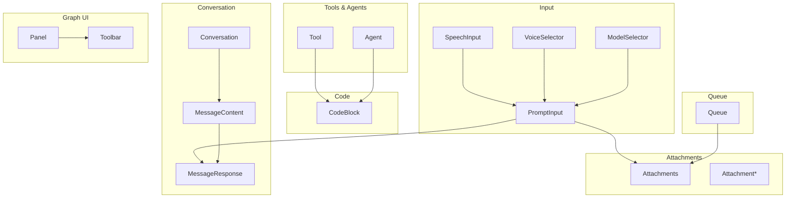
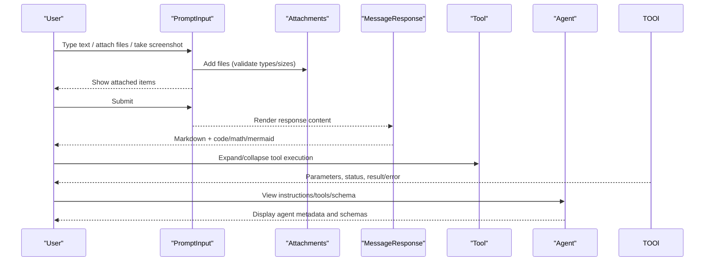
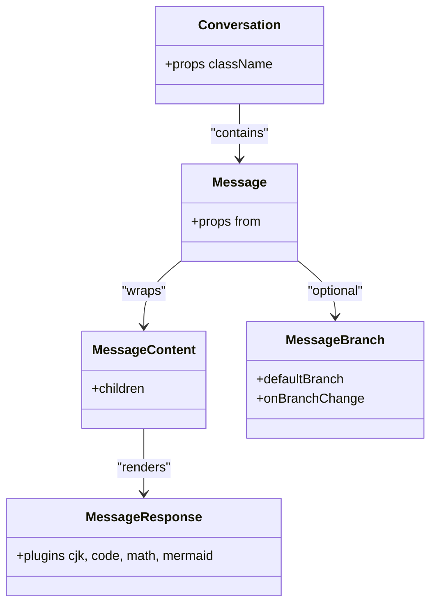
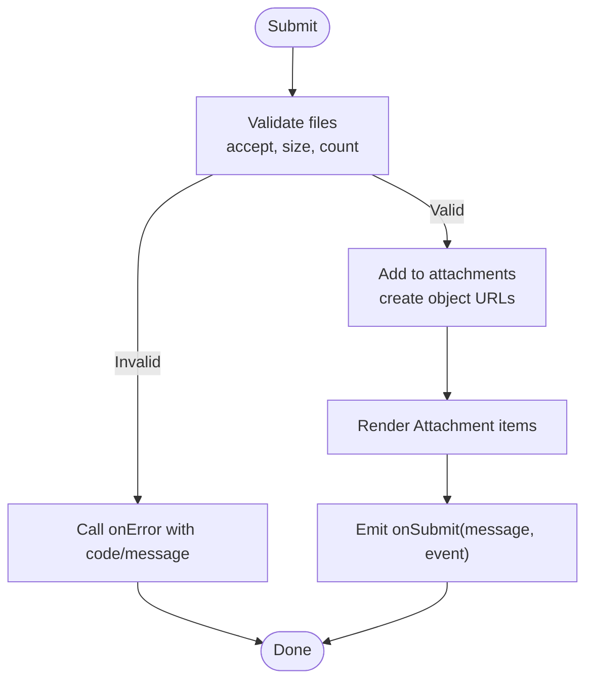
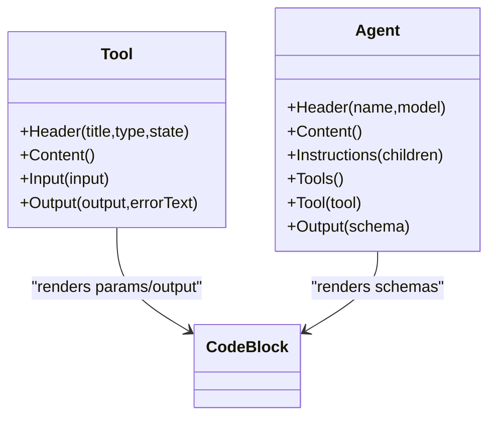
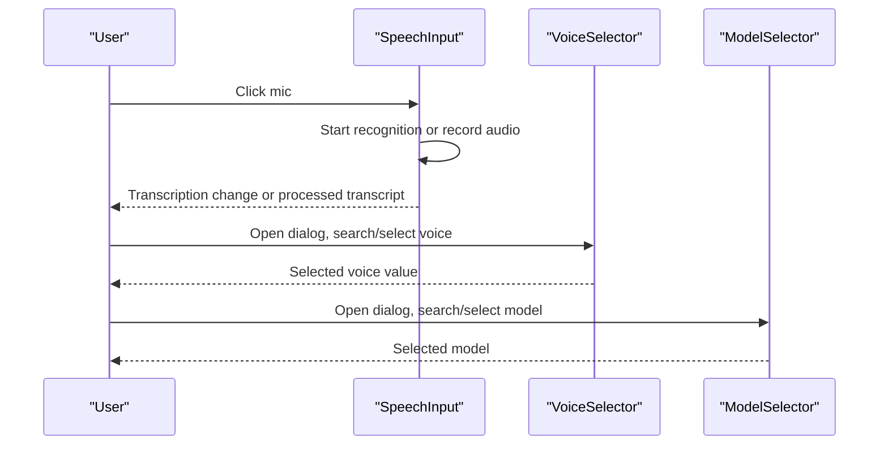
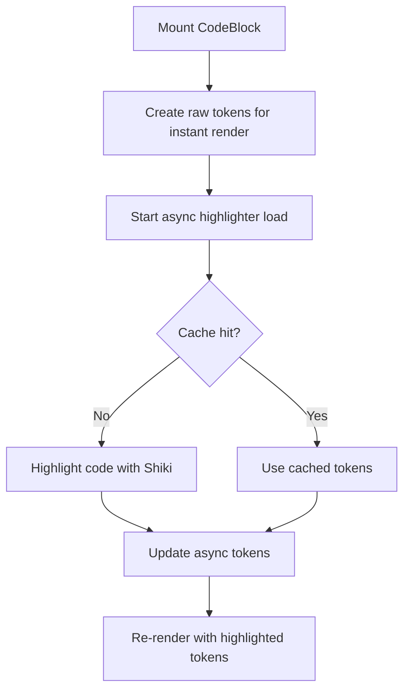
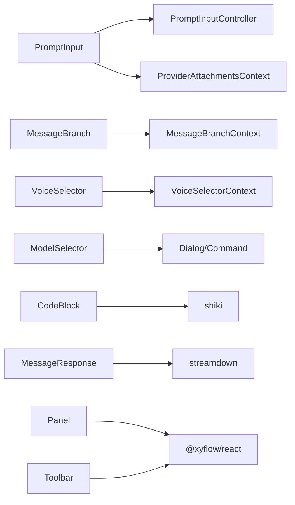

# AI Elements Interface

<cite>
**Referenced Files in This Document**
- [conversation.tsx](file://freshroute/src/components/ai-elements/conversation.tsx)
- [message.tsx](file://freshroute/src/components/ai-elements/message.tsx)
- [prompt-input.tsx](file://freshroute/src/components/ai-elements/prompt-input.tsx)
- [tool.tsx](file://freshroute/src/components/ai-elements/tool.tsx)
- [agent.tsx](file://freshroute/src/components/ai-elements/agent.tsx)
- [speech-input.tsx](file://freshroute/src/components/ai-elements/speech-input.tsx)
- [voice-selector.tsx](file://freshroute/src/components/ai-elements/voice-selector.tsx)
- [model-selector.tsx](file://freshroute/src/components/ai-elements/model-selector.tsx)
- [attachments.tsx](file://freshroute/src/components/ai-elements/attachments.tsx)
- [code-block.tsx](file://freshroute/src/components/ai-elements/code-block.tsx)
- [toolbar.tsx](file://freshroute/src/components/ai-elements/toolbar.tsx)
- [panel.tsx](file://freshroute/src/components/ai-elements/panel.tsx)
- [queue.tsx](file://freshroute/src/components/ai-elements/queue.tsx)
</cite>

## Table of Contents
1. [Introduction](#introduction)
2. [Project Structure](#project-structure)
3. [Core Components](#core-components)
4. [Architecture Overview](#architecture-overview)
5. [Detailed Component Analysis](#detailed-component-analysis)
6. [Dependency Analysis](#dependency-analysis)
7. [Performance Considerations](#performance-considerations)
8. [Troubleshooting Guide](#troubleshooting-guide)
9. [Conclusion](#conclusion)

## Introduction
This document describes the AI Elements Interface used by the FreshRoute application to build rich, interactive AI-powered conversations and tooling experiences. It focuses on the component library under src/components/ai-elements, explaining how conversation flow, input handling, attachments, tools, agents, speech, voice/model selection, code display, and auxiliary UI elements work together. The goal is to help developers integrate and customize these components effectively while understanding data flows, state management patterns, and performance considerations.

## Project Structure
The AI Elements Interface is organized as a cohesive set of React components that can be composed into full chat interfaces or embedded within larger pages. Key areas include:
- Conversation and message rendering
- Prompt input with file attachments and screenshot capture
- Tool execution visualization
- Agent configuration and output schema display
- Speech input and voice/model selectors
- Code block highlighting and copying
- Graph-related panels and toolbars for node-based workflows
- Queue UI for pending tasks and attachments

**Diagram sources**
- [conversation.tsx:13-35](file://freshroute/src/components/ai-elements/conversation.tsx#L13-L35)
- [message.tsx:37-66](file://freshroute/src/components/ai-elements/message.tsx#L37-L66)
- [prompt-input.tsx:248-366](file://freshroute/src/components/ai-elements/prompt-input.tsx#L248-L366)
- [speech-input.tsx:90-114](file://freshroute/src/components/ai-elements/speech-input.tsx#L90-L114)
- [voice-selector.tsx:65-99](file://freshroute/src/components/ai-elements/voice-selector.tsx#L65-L99)
- [model-selector.tsx:23-56](file://freshroute/src/components/ai-elements/model-selector.tsx#L23-L56)
- [attachments.tsx:153-176](file://freshroute/src/components/ai-elements/attachments.tsx#L153-L176)
- [tool.tsx:26-31](file://freshroute/src/components/ai-elements/tool.tsx#L26-L31)
- [agent.tsx:20-25](file://freshroute/src/components/ai-elements/agent.tsx#L20-L25)
- [code-block.tsx:428-450](file://freshroute/src/components/ai-elements/code-block.tsx#L428-L450)
- [panel.tsx:7-15](file://freshroute/src/components/ai-elements/panel.tsx#L7-L15)
- [toolbar.tsx:7-16](file://freshroute/src/components/ai-elements/toolbar.tsx#L7-L16)
- [queue.tsx:258-266](file://freshroute/src/components/ai-elements/queue.tsx#L258-L266)

**Section sources**
- [conversation.tsx:13-35](file://freshroute/src/components/ai-elements/conversation.tsx#L13-L35)
- [prompt-input.tsx:248-366](file://freshroute/src/components/ai-elements/prompt-input.tsx#L248-L366)
- [attachments.tsx:153-176](file://freshroute/src/components/ai-elements/attachments.tsx#L153-L176)
- [tool.tsx:26-31](file://freshroute/src/components/ai-elements/tool.tsx#L26-L31)
- [agent.tsx:20-25](file://freshroute/src/components/ai-elements/agent.tsx#L20-L25)
- [code-block.tsx:428-450](file://freshroute/src/components/ai-elements/code-block.tsx#L428-L450)
- [panel.tsx:7-15](file://freshroute/src/components/ai-elements/panel.tsx#L7-L15)
- [toolbar.tsx:7-16](file://freshroute/src/components/ai-elements/toolbar.tsx#L7-L16)
- [queue.tsx:258-266](file://freshroute/src/components/ai-elements/queue.tsx#L258-L266)

## Core Components
- Conversation and Message: Provide scrollable conversation containers, message grouping, branching views, and rich markdown rendering with plugins for code, math, mermaid, and CJK support. Includes download-to-markdown functionality.
- Prompt Input: A comprehensive input form supporting text, file attachments (with validation), screenshots, drag-and-drop, and optional global providers for shared state across multiple inputs.
- Tools and Agents: Visualize tool execution states, parameters, outputs, errors, and agent instructions/tools/output schemas.
- Speech and Voice/Model Selection: Enable voice input via Web Speech API or MediaRecorder fallback; provide dialogs to select voices and models with search and preview capabilities.
- Attachments: Unified rendering for files and source documents in grid, list, or inline modes with previews and removal actions.
- Code Block: Syntax-highlighted code blocks with copy-to-clipboard, line numbers, language selector, and efficient token caching.
- Graph UI: Lightweight wrappers around @xyflow/react Panel and NodeToolbar for node-based visualizations.
- Queue: Collapsible sections and lists for pending tasks and associated attachments.

**Section sources**
- [conversation.tsx:13-169](file://freshroute/src/components/ai-elements/conversation.tsx#L13-L169)
- [message.tsx:37-361](file://freshroute/src/components/ai-elements/message.tsx#L37-L361)
- [prompt-input.tsx:248-800](file://freshroute/src/components/ai-elements/prompt-input.tsx#L248-L800)
- [tool.tsx:26-174](file://freshroute/src/components/ai-elements/tool.tsx#L26-L174)
- [agent.tsx:20-142](file://freshroute/src/components/ai-elements/agent.tsx#L20-L142)
- [speech-input.tsx:90-324](file://freshroute/src/components/ai-elements/speech-input.tsx#L90-L324)
- [voice-selector.tsx:65-525](file://freshroute/src/components/ai-elements/voice-selector.tsx#L65-L525)
- [model-selector.tsx:23-214](file://freshroute/src/components/ai-elements/model-selector.tsx#L23-L214)
- [attachments.tsx:153-427](file://freshroute/src/components/ai-elements/attachments.tsx#L153-L427)
- [code-block.tsx:184-563](file://freshroute/src/components/ai-elements/code-block.tsx#L184-L563)
- [panel.tsx:7-15](file://freshroute/src/components/ai-elements/panel.tsx#L7-L15)
- [toolbar.tsx:7-16](file://freshroute/src/components/ai-elements/toolbar.tsx#L7-L16)
- [queue.tsx:14-267](file://freshroute/src/components/ai-elements/queue.tsx#L14-L267)

## Architecture Overview
The AI Elements Interface follows a composable architecture:
- Stateful contexts manage input and attachment lifecycles (e.g., PromptInputProvider).
- Presentation components render messages, tools, agents, and queues using shared UI primitives.
- Rich media and code are handled by specialized components (Attachments, CodeBlock).
- Optional providers enable cross-component sharing of input state and attachments.

**Diagram sources**
- [prompt-input.tsx:514-800](file://freshroute/src/components/ai-elements/prompt-input.tsx#L514-L800)
- [attachments.tsx:187-226](file://freshroute/src/components/ai-elements/attachments.tsx#L187-L226)
- [message.tsx:326-340](file://freshroute/src/components/ai-elements/message.tsx#L326-L340)
- [tool.tsx:74-113](file://freshroute/src/components/ai-elements/tool.tsx#L74-L113)
- [agent.tsx:32-86](file://freshroute/src/components/ai-elements/agent.tsx#L32-L86)

## Detailed Component Analysis

### Conversation and Messages
- Conversation: Scroll-aware container with sticky-to-bottom behavior and empty state. Provides download-to-markdown utility for exporting conversations.
- Message: Groups user/assistant messages, supports branching views (previous/next), and renders rich responses with Streamdown plugins.
- Actions: Accessible action buttons with tooltips for message-level operations.

**Diagram sources**
- [conversation.tsx:13-35](file://freshroute/src/components/ai-elements/conversation.tsx#L13-L35)
- [message.tsx:37-66](file://freshroute/src/components/ai-elements/message.tsx#L37-L66)
- [message.tsx:146-195](file://freshroute/src/components/ai-elements/message.tsx#L146-L195)
- [message.tsx:326-340](file://freshroute/src/components/ai-elements/message.tsx#L326-L340)

**Section sources**
- [conversation.tsx:13-169](file://freshroute/src/components/ai-elements/conversation.tsx#L13-L169)
- [message.tsx:37-361](file://freshroute/src/components/ai-elements/message.tsx#L37-L361)

### Prompt Input and Attachments
- PromptInput: Centralized input with robust file handling, validation (accept types, size limits, max count), drag-and-drop (form or global), and optional provider mode for shared state. Integrates screenshot capture via screen recording APIs.
- Attachments: Unified rendering for files and source documents with variants (grid/list/inline), previews, labels, and removal actions.

**Diagram sources**
- [prompt-input.tsx:551-706](file://freshroute/src/components/ai-elements/prompt-input.tsx#L551-L706)
- [attachments.tsx:54-86](file://freshroute/src/components/ai-elements/attachments.tsx#L54-L86)
- [attachments.tsx:187-226](file://freshroute/src/components/ai-elements/attachments.tsx#L187-L226)

**Section sources**
- [prompt-input.tsx:248-800](file://freshroute/src/components/ai-elements/prompt-input.tsx#L248-L800)
- [attachments.tsx:153-427](file://freshroute/src/components/ai-elements/attachments.tsx#L153-L427)

### Tools and Agents
- Tool: Collapsible visualization of tool execution with status badges, parameter display, and output/error rendering. Supports both static and dynamic tool parts.
- Agent: Displays agent name/model, instructions, available tools with JSON schemas, and output schema.

**Diagram sources**
- [tool.tsx:26-174](file://freshroute/src/components/ai-elements/tool.tsx#L26-L174)
- [agent.tsx:20-142](file://freshroute/src/components/ai-elements/agent.tsx#L20-L142)
- [code-block.tsx:428-450](file://freshroute/src/components/ai-elements/code-block.tsx#L428-L450)

**Section sources**
- [tool.tsx:26-174](file://freshroute/src/components/ai-elements/tool.tsx#L26-L174)
- [agent.tsx:20-142](file://freshroute/src/components/ai-elements/agent.tsx#L20-L142)

### Speech Input and Voice/Model Selection
- SpeechInput: Detects supported mode (Web Speech API vs MediaRecorder fallback), manages listening state, and emits transcription changes or audio blobs for external processing.
- VoiceSelector: Dialog-based voice picker with search, grouping, attributes (gender/accent/age), and preview controls.
- ModelSelector: Dialog-based model picker with command palette and provider logos.

**Diagram sources**
- [speech-input.tsx:74-114](file://freshroute/src/components/ai-elements/speech-input.tsx#L74-L114)
- [speech-input.tsx:196-280](file://freshroute/src/components/ai-elements/speech-input.tsx#L196-L280)
- [voice-selector.tsx:65-99](file://freshroute/src/components/ai-elements/voice-selector.tsx#L65-L99)
- [model-selector.tsx:23-56](file://freshroute/src/components/ai-elements/model-selector.tsx#L23-L56)

**Section sources**
- [speech-input.tsx:90-324](file://freshroute/src/components/ai-elements/speech-input.tsx#L90-L324)
- [voice-selector.tsx:65-525](file://freshroute/src/components/ai-elements/voice-selector.tsx#L65-L525)
- [model-selector.tsx:23-214](file://freshroute/src/components/ai-elements/model-selector.tsx#L23-L214)

### Code Block
- CodeBlock: High-performance syntax highlighting with Shiki, token caching, immediate raw tokens for fast initial render, async highlight updates, copy-to-clipboard, line numbers, and language selector.

**Diagram sources**
- [code-block.tsx:184-246](file://freshroute/src/components/ai-elements/code-block.tsx#L184-L246)
- [code-block.tsx:383-426](file://freshroute/src/components/ai-elements/code-block.tsx#L383-L426)

**Section sources**
- [code-block.tsx:184-563](file://freshroute/src/components/ai-elements/code-block.tsx#L184-L563)

### Graph UI Panels and Toolbars
- Panel: Wrapper around @xyflow/react Panel for consistent styling and spacing.
- Toolbar: Wrapper around @xyflow/react NodeToolbar positioned at the bottom for node actions.

**Section sources**
- [panel.tsx:7-15](file://freshroute/src/components/ai-elements/panel.tsx#L7-L15)
- [toolbar.tsx:7-16](file://freshroute/src/components/ai-elements/toolbar.tsx#L7-L16)

### Queue
- Queue: Collapsible sections and lists for pending tasks, with indicators, descriptions, actions, and attachment previews.

**Section sources**
- [queue.tsx:14-267](file://freshroute/src/components/ai-elements/queue.tsx#L14-L267)

## Dependency Analysis
Key dependencies and relationships:
- UI primitives: Buttons, dialogs, command palettes, selects, tooltips, collapsibles, scroll areas.
- Third-party libraries:
  - streamdown for rich markdown rendering with plugins (cjk, code, math, mermaid).
  - shiki for syntax highlighting and tokenization.
  - @xyflow/react for graph panels and toolbars.
  - lucide-react for icons.
  - use-stick-to-bottom for conversation scrolling.
- Contexts:
  - PromptInputController and ProviderAttachmentsContext for shared input and attachment state.
  - Local contexts for attachments and referenced sources within PromptInput.
  - MessageBranch context for branching message views.
  - VoiceSelector and ModelSelector contexts for controlled dialogs.

**Diagram sources**
- [prompt-input.tsx:206-366](file://freshroute/src/components/ai-elements/prompt-input.tsx#L206-L366)
- [message.tsx:125-195](file://freshroute/src/components/ai-elements/message.tsx#L125-L195)
- [voice-selector.tsx:45-99](file://freshroute/src/components/ai-elements/voice-selector.tsx#L45-L99)
- [model-selector.tsx:23-56](file://freshroute/src/components/ai-elements/model-selector.tsx#L23-L56)
- [code-block.tsx:132-165](file://freshroute/src/components/ai-elements/code-block.tsx#L132-L165)
- [message.tsx:326-340](file://freshroute/src/components/ai-elements/message.tsx#L326-L340)
- [panel.tsx:7-15](file://freshroute/src/components/ai-elements/panel.tsx#L7-L15)
- [toolbar.tsx:7-16](file://freshroute/src/components/ai-elements/toolbar.tsx#L7-L16)

**Section sources**
- [prompt-input.tsx:206-366](file://freshroute/src/components/ai-elements/prompt-input.tsx#L206-L366)
- [message.tsx:125-195](file://freshroute/src/components/ai-elements/message.tsx#L125-L195)
- [voice-selector.tsx:45-99](file://freshroute/src/components/ai-elements/voice-selector.tsx#L45-L99)
- [model-selector.tsx:23-56](file://freshroute/src/components/ai-elements/model-selector.tsx#L23-L56)
- [code-block.tsx:132-165](file://freshroute/src/components/ai-elements/code-block.tsx#L132-L165)
- [message.tsx:326-340](file://freshroute/src/components/ai-elements/message.tsx#L326-L340)
- [panel.tsx:7-15](file://freshroute/src/components/ai-elements/panel.tsx#L7-L15)
- [toolbar.tsx:7-16](file://freshroute/src/components/ai-elements/toolbar.tsx#L7-L16)

## Performance Considerations
- Efficient code highlighting:
  - Immediate raw tokens for fast initial render, followed by async Shiki highlighting with subscriber-based updates.
  - Token cache keyed by code/language to avoid redundant work.
  - Highlighter cache per language to reuse initialization.
- Memory management:
  - Revoke object URLs for attachments on remove/clear/unmount to prevent leaks.
  - Proper cleanup of media streams and recognition instances in SpeechInput.
- Rendering optimization:
  - Memoized components (e.g., MessageResponse, Agent components) to minimize re-renders.
  - Branching navigation avoids unnecessary DOM updates.
- I/O and network:
  - Screenshot capture uses getDisplayMedia; ensure graceful handling of permission denials and aborts.
  - Drag-and-drop handlers are attached conditionally based on globalDrop prop to reduce overhead.

[No sources needed since this section provides general guidance]

## Troubleshooting Guide
Common issues and resolutions:
- File upload validation failures:
  - Ensure accept patterns match file types; check maxFileSize and maxFiles constraints; handle onError callbacks appropriately.
- Screenshot capture not working:
  - Verify browser support for getDisplayMedia; handle NotAllowedError and AbortError gracefully.
- Speech input disabled:
  - Check browser support for Web Speech API or MediaRecorder; ensure microphone permissions are granted; provide onAudioRecorded when using MediaRecorder fallback.
- Code block not highlighting:
  - Confirm language is supported by Shiki; verify highlighter loading; check console for errors during async highlighting.
- Attachment memory leaks:
  - Ensure all object URLs are revoked on remove/clear/unmount; use provider or local context consistently.
- Message branch navigation errors:
  - Ensure MessageBranch components are used within MessageBranch; validate currentBranch and totalBranches logic.

**Section sources**
- [prompt-input.tsx:551-706](file://freshroute/src/components/ai-elements/prompt-input.tsx#L551-L706)
- [prompt-input.tsx:444-482](file://freshroute/src/components/ai-elements/prompt-input.tsx#L444-L482)
- [speech-input.tsx:74-114](file://freshroute/src/components/ai-elements/speech-input.tsx#L74-L114)
- [speech-input.tsx:196-280](file://freshroute/src/components/ai-elements/speech-input.tsx#L196-L280)
- [code-block.tsx:184-246](file://freshroute/src/components/ai-elements/code-block.tsx#L184-L246)
- [attachments.tsx:318-366](file://freshroute/src/components/ai-elements/attachments.tsx#L318-L366)
- [message.tsx:125-195](file://freshroute/src/components/ai-elements/message.tsx#L125-L195)

## Conclusion
The AI Elements Interface provides a robust, composable foundation for building advanced AI-driven user experiences in FreshRoute. By leveraging context-driven state management, rich media handling, and high-performance rendering techniques, it enables flexible integration of conversations, tools, agents, and multimodal inputs. Developers can extend and customize these components to meet diverse product needs while maintaining accessibility, performance, and maintainability.

[No sources needed since this section summarizes without analyzing specific files]