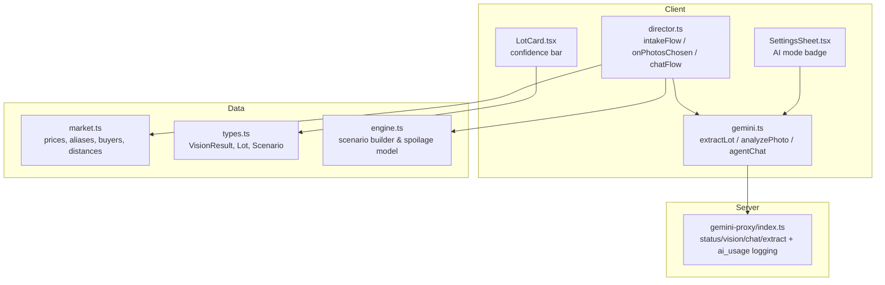
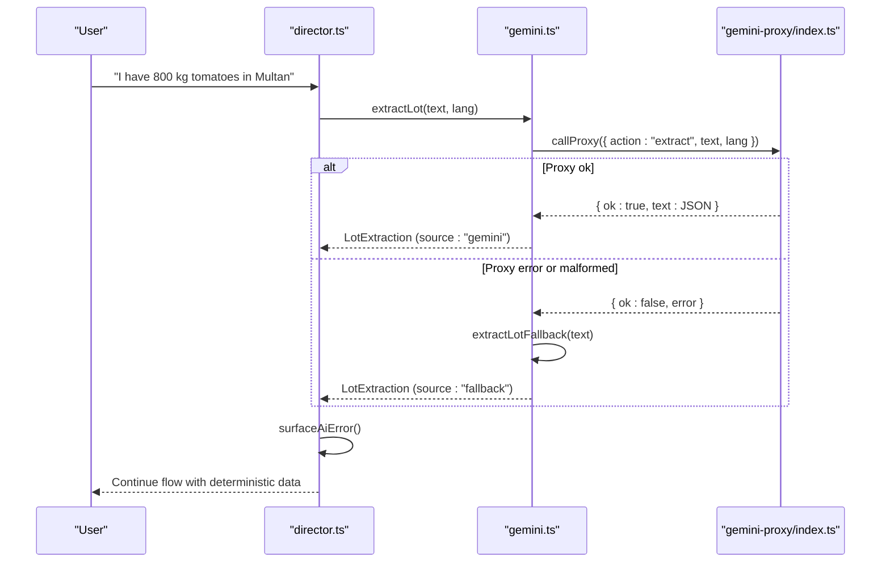
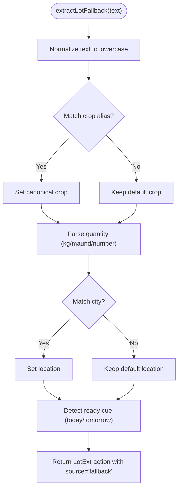
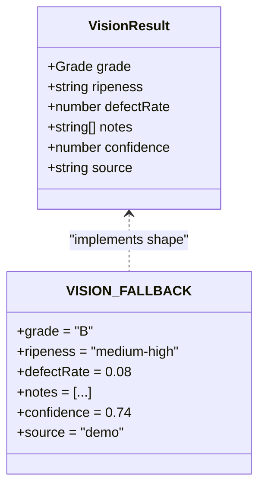
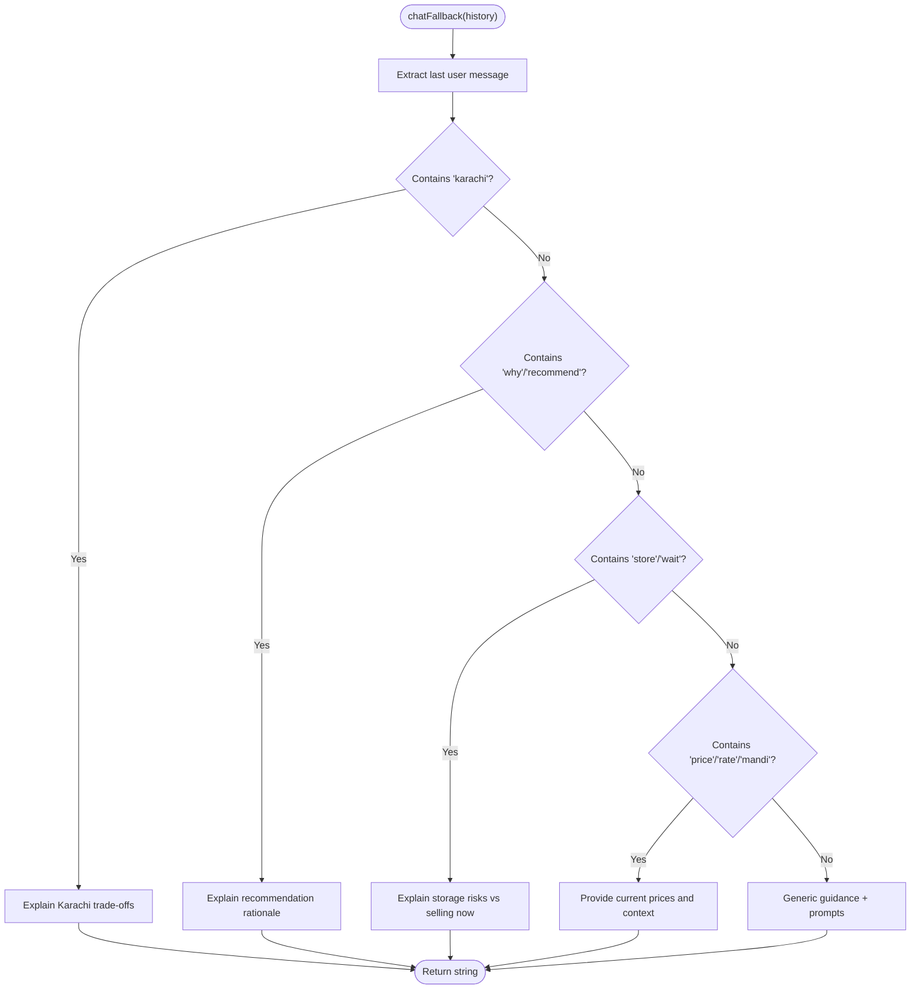
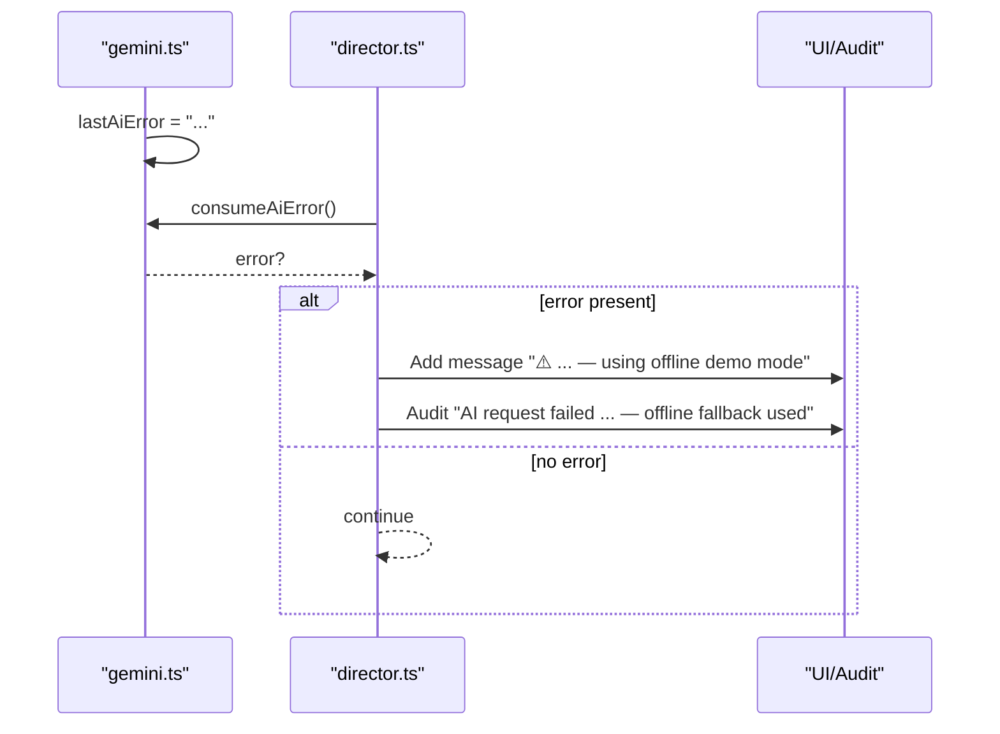
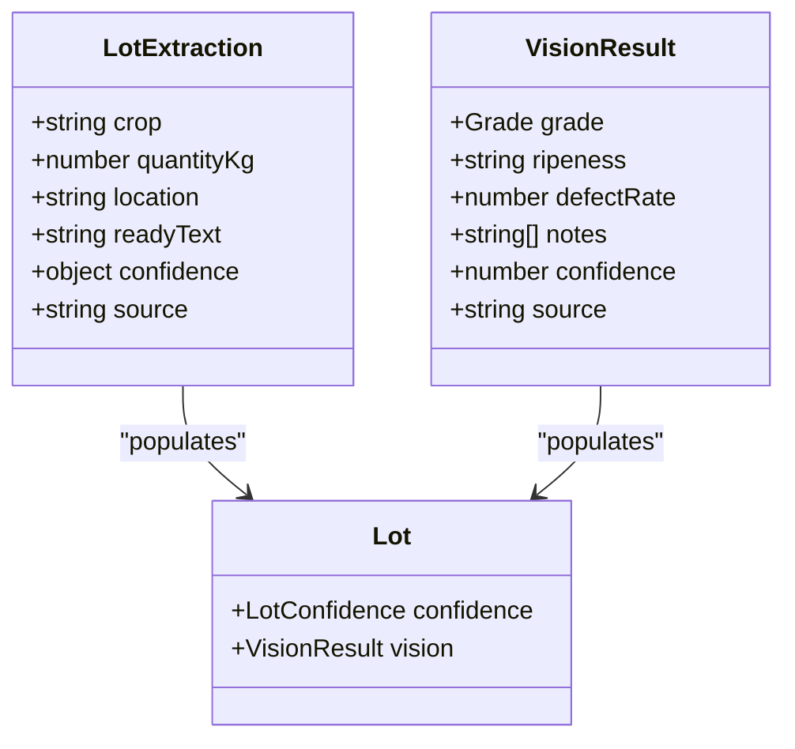
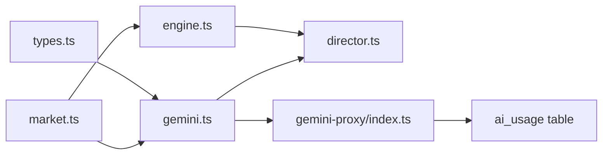

# AI Fallback Mechanisms

<cite>
**Referenced Files in This Document**
- [gemini.ts](file://freshroute/src/lib/gemini.ts)
- [engine.ts](file://freshroute/src/lib/engine.ts)
- [market.ts](file://freshroute/src/data/market.ts)
- [types.ts](file://freshroute/src/types.ts)
- [director.ts](file://freshroute/src/store/director.ts)
- [SettingsSheet.tsx](file://freshroute/src/components/SettingsSheet.tsx)
- [LotCard.tsx](file://freshroute/src/components/cards/LotCard.tsx)
- [gemini-proxy/index.ts](file://freshroute/supabase/functions/gemini-proxy/index.ts)
</cite>

## Table of Contents
1. Introduction
2. Project Structure
3. Core Components
4. Architecture Overview
5. Detailed Component Analysis
6. Dependency Analysis
7. Performance Considerations
8. Troubleshooting Guide
9. Conclusion
10. Appendices

## Introduction
This document explains the comprehensive fallback system that keeps FreshRoute reliable when AI services are unavailable or degraded. It focuses on:
- Deterministic crop extraction via extractLotFallback
- Predefined quality assessments via VISION_FALLBACK
- Contextual chat responses via chatFallback
- Error tracking and user-facing surfacing via consumeAiError and surfaceAiError
- Confidence scoring that distinguishes AI vs fallback sources
- Testing strategies and monitoring approaches for fallback usage

## Project Structure
The fallback logic spans client libraries, UI state management, and a server-side proxy that logs usage and errors.

**Diagram sources**
- [gemini.ts:28-42](file://freshroute/src/lib/gemini.ts#L28-L42)
- [gemini.ts:91-116](file://freshroute/src/lib/gemini.ts#L91-L116)
- [gemini.ts:131-161](file://freshroute/src/lib/gemini.ts#L131-L161)
- [gemini.ts:169-182](file://freshroute/src/lib/gemini.ts#L169-L182)
- [director.ts:110-143](file://freshroute/src/store/director.ts#L110-L143)
- [director.ts:175-217](file://freshroute/src/store/director.ts#L175-L217)
- [director.ts:601-625](file://freshroute/src/store/director.ts#L601-L625)
- [gemini-proxy/index.ts:87-101](file://freshroute/supabase/functions/gemini-proxy/index.ts#L87-L101)
- [market.ts:14-24](file://freshroute/src/data/market.ts#L14-L24)
- [types.ts:25-32](file://freshroute/src/types.ts#L25-L32)
- [engine.ts:47-235](file://freshroute/src/lib/engine.ts#L47-L235)

**Section sources**
- [gemini.ts:1-42](file://freshroute/src/lib/gemini.ts#L1-L42)
- [director.ts:60-74](file://freshroute/src/store/director.ts#L60-L74)
- [gemini-proxy/index.ts:87-101](file://freshroute/supabase/functions/gemini-proxy/index.ts#L87-L101)

## Core Components
- Deterministic extraction fallback: extractLotFallback provides stable results using pattern matching for crops, quantities (kg/maund), locations, and readiness cues.
- Vision fallback: VISION_FALLBACK supplies a safe default grade, ripeness, defect rate, notes, and confidence when image analysis is unavailable or malformed.
- Chat fallback: chatFallback generates contextual replies based on conversation history patterns (market comparisons, pricing, recommendations).
- Error tracking: consumeAiError captures the last AI failure; surfaceAiError surfaces it once to the user and audits it.
- Confidence and source tagging: All outputs carry explicit source fields (“gemini”, “fallback”, “demo”) and numeric confidence values to distinguish AI vs deterministic behavior.

**Section sources**
- [gemini.ts:55-89](file://freshroute/src/lib/gemini.ts#L55-L89)
- [gemini.ts:118-129](file://freshroute/src/lib/gemini.ts#L118-L129)
- [gemini.ts:184-199](file://freshroute/src/lib/gemini.ts#L184-L199)
- [gemini.ts:18-24](file://freshroute/src/lib/gemini.ts#L18-L24)
- [director.ts:60-74](file://freshroute/src/store/director.ts#L60-L74)
- [types.ts:25-32](file://freshroute/src/types.ts#L25-L32)

## Architecture Overview
The application attempts live AI calls through a Supabase Edge Function. On any failure or malformed response, it falls back deterministically while preserving user experience continuity. Errors are surfaced once per step and logged server-side for monitoring.

**Diagram sources**
- [director.ts:110-143](file://freshroute/src/store/director.ts#L110-L143)
- [gemini.ts:28-42](file://freshroute/src/lib/gemini.ts#L28-L42)
- [gemini.ts:91-116](file://freshroute/src/lib/gemini.ts#L91-L116)
- [gemini.ts:55-89](file://freshroute/src/lib/gemini.ts#L55-L89)
- [gemini-proxy/index.ts:87-101](file://freshroute/supabase/functions/gemini-proxy/index.ts#L87-L101)

## Detailed Component Analysis

### Deterministic Crop Extraction: extractLotFallback
- Purpose: Provide stable lot extraction without AI when the proxy fails or returns invalid data.
- Behavior:
  - Crop detection via alias map from market data.
  - Quantity parsing supports kg/kilo/kgs and maund/man/من conversions; defaults to a sensible baseline if none found.
  - Location detection against known cities; defaults to a primary city.
  - Readiness cue detection for today/tomorrow across languages.
  - Returns structured LotExtraction with per-field confidence and source set to "fallback".
- Integration: Called by extractLot when AI extraction fails or returns malformed JSON.

**Diagram sources**
- [gemini.ts:55-89](file://freshroute/src/lib/gemini.ts#L55-L89)
- [market.ts:26-58](file://freshroute/src/data/market.ts#L26-L58)

**Section sources**
- [gemini.ts:55-89](file://freshroute/src/lib/gemini.ts#L55-L89)
- [gemini.ts:91-116](file://freshroute/src/lib/gemini.ts#L91-L116)
- [market.ts:26-58](file://freshroute/src/data/market.ts#L26-L58)

### Vision Quality Assessment: VISION_FALLBACK
- Purpose: Ensure consistent visual grading when image analysis is unavailable or malformed.
- Behavior:
  - Supplies a default grade, ripeness, defect rate, concise notes, and moderate confidence.
  - Marked as demo source to avoid implying live AI analysis.
  - Used by analyzePhoto when the proxy fails, input is invalid, or response cannot be parsed.

**Diagram sources**
- [types.ts:25-32](file://freshroute/src/types.ts#L25-L32)
- [gemini.ts:118-129](file://freshroute/src/lib/gemini.ts#L118-L129)

**Section sources**
- [gemini.ts:118-129](file://freshroute/src/lib/gemini.ts#L118-L129)
- [gemini.ts:131-161](file://freshroute/src/lib/gemini.ts#L131-L161)
- [types.ts:25-32](file://freshroute/src/types.ts#L25-L32)

### Contextual Chat Responses: chatFallback
- Purpose: Maintain conversational continuity when chat AI is down or returns empty content.
- Behavior:
  - Inspects the last user message for keywords to generate relevant answers about markets, pricing, storage, and recommendations.
  - Provides explanations grounded in market data and transport realities.
  - Used by agentChat as a precomputed fallback before attempting the proxy call; also used when the proxy fails or returns blank text.

**Diagram sources**
- [gemini.ts:184-199](file://freshroute/src/lib/gemini.ts#L184-L199)

**Section sources**
- [gemini.ts:169-182](file://freshroute/src/lib/gemini.ts#L169-L182)
- [gemini.ts:184-199](file://freshroute/src/lib/gemini.ts#L184-L199)

### Error Tracking and User Surfacing: consumeAiError and surfaceAiError
- consumeAiError: Captures the most recent AI error and clears it so it can be shown once.
- surfaceAiError: After each AI step, reads and displays the error to the user and records an audit entry.
- Where used:
  - After extraction, photo analysis, and chat flows to ensure transparency.
  - Settings sheet shows AI mode and error details when applicable.

**Diagram sources**
- [gemini.ts:18-24](file://freshroute/src/lib/gemini.ts#L18-L24)
- [director.ts:60-74](file://freshroute/src/store/director.ts#L60-L74)
- [director.ts:110-143](file://freshroute/src/store/director.ts#L110-L143)
- [director.ts:175-217](file://freshroute/src/store/director.ts#L175-L217)
- [director.ts:601-625](file://freshroute/src/store/director.ts#L601-L625)

**Section sources**
- [gemini.ts:18-24](file://freshroute/src/lib/gemini.ts#L18-L24)
- [director.ts:60-74](file://freshroute/src/store/director.ts#L60-L74)
- [SettingsSheet.tsx:34-72](file://freshroute/src/components/SettingsSheet.tsx#L34-L72)

### Confidence Scoring and Source Tagging
- Source fields:
  - LotExtraction.source: "gemini" | "fallback"
  - VisionResult.source: "gemini" | "demo"
- Confidence:
  - Per-field confidence for extraction (crop, quantity, location).
  - Overall confidence computed from extraction confidences.
  - Vision confidence indicates reliability of image-based assessment.
- UI:
  - LotCard renders a confidence progress bar reflecting vision confidence.

**Diagram sources**
- [gemini.ts:44-51](file://freshroute/src/lib/gemini.ts#L44-L51)
- [types.ts:18-23](file://freshroute/src/types.ts#L18-L23)
- [types.ts:25-32](file://freshroute/src/types.ts#L25-L32)
- [types.ts:34-45](file://freshroute/src/types.ts#L34-L45)
- [LotCard.tsx:100-105](file://freshroute/src/components/cards/LotCard.tsx#L100-L105)

**Section sources**
- [gemini.ts:44-51](file://freshroute/src/lib/gemini.ts#L44-L51)
- [gemini.ts:91-116](file://freshroute/src/lib/gemini.ts#L91-L116)
- [gemini.ts:131-161](file://freshroute/src/lib/gemini.ts#L131-L161)
- [types.ts:18-45](file://freshroute/src/types.ts#L18-L45)
- [LotCard.tsx:74-105](file://freshroute/src/components/cards/LotCard.tsx#L74-L105)

## Dependency Analysis
- Client library gemini.ts depends on:
  - market.ts for crop aliases and price tables
  - types.ts for shared interfaces
  - supabase functions for proxy calls
- director.ts orchestrates flows and uses gemini.ts and engine.ts
- engine.ts depends on market.ts for prices, distances, buyers, and transporters
- Server proxy logs all actions and errors to ai_usage for monitoring

**Diagram sources**
- [gemini.ts:1-3](file://freshroute/src/lib/gemini.ts#L1-L3)
- [gemini.ts:28-42](file://freshroute/src/lib/gemini.ts#L28-L42)
- [engine.ts:1-8](file://freshroute/src/lib/engine.ts#L1-L8)
- [gemini-proxy/index.ts:87-101](file://freshroute/supabase/functions/gemini-proxy/index.ts#L87-L101)

**Section sources**
- [gemini.ts:1-42](file://freshroute/src/lib/gemini.ts#L1-L42)
- [engine.ts:1-8](file://freshroute/src/lib/engine.ts#L1-L8)
- [gemini-proxy/index.ts:87-101](file://freshroute/supabase/functions/gemini-proxy/index.ts#L87-L101)

## Performance Considerations
- Fallbacks are deterministic and lightweight, avoiding network latency when AI is down.
- Pattern matching for extraction runs in O(n) over small constant datasets (aliases, cities).
- Vision fallback avoids expensive image processing when proxy fails.
- Chat fallback computes responses locally, minimizing round-trips.
- Server-side logging adds minimal overhead but enables monitoring and alerting.

[No sources needed since this section provides general guidance]

## Troubleshooting Guide
Common triggers and how the app responds:
- No image data provided:
  - Sets lastAiError and returns VISION_FALLBACK.
  - User sees a warning message after the next AI step.
- Proxy unreachable or invalid response:
  - Falls back to deterministic extraction, vision, or chat responses.
  - Error surfaced once; audit entry created.
- Malformed AI output:
  - Caught and treated as failure; fallback used.
- Demo vs live mode:
  - Settings sheet shows current AI mode and error details when applicable.

Operational checks:
- Use Settings sheet to re-check AI status and see errors.
- Review audit entries for fallback usage.
- Monitor ai_usage table for error rates and latency.

**Section sources**
- [gemini.ts:131-161](file://freshroute/src/lib/gemini.ts#L131-L161)
- [gemini.ts:91-116](file://freshroute/src/lib/gemini.ts#L91-L116)
- [gemini.ts:169-182](file://freshroute/src/lib/gemini.ts#L169-L182)
- [director.ts:60-74](file://freshroute/src/store/director.ts#L60-L74)
- [SettingsSheet.tsx:34-72](file://freshroute/src/components/SettingsSheet.tsx#L34-L72)
- [gemini-proxy/index.ts:87-101](file://freshroute/supabase/functions/gemini-proxy/index.ts#L87-L101)

## Conclusion
FreshRoute’s fallback system ensures continuous operation and transparent user experiences even when AI services fail. Deterministic extraction, predefined vision assessments, and contextual chat responses keep workflows moving. Explicit confidence scores and source tags help users understand whether results come from live AI or robust fallbacks. Centralized error surfacing and server-side logging support both debugging and long-term monitoring.

[No sources needed since this section summarizes without analyzing specific files]

## Appendices

### When Fallbacks Are Triggered (Examples)
- Extraction fallback:
  - Proxy call fails or returns non-JSON → extractLotFallback used.
- Vision fallback:
  - Missing image data, proxy error, or malformed JSON → VISION_FALLBACK returned.
- Chat fallback:
  - Proxy error or empty text → chatFallback used.

**Section sources**
- [gemini.ts:91-116](file://freshroute/src/lib/gemini.ts#L91-L116)
- [gemini.ts:131-161](file://freshroute/src/lib/gemini.ts#L131-L161)
- [gemini.ts:169-182](file://freshroute/src/lib/gemini.ts#L169-L182)

### Monitoring Fallback Usage Patterns
- Server-side ai_usage log includes action, status, error, and latency for every proxy call.
- Client-side audit entries record when fallbacks are used.
- UI shows AI mode and errors in Settings sheet.

**Section sources**
- [gemini-proxy/index.ts:87-101](file://freshroute/supabase/functions/gemini-proxy/index.ts#L87-L101)
- [director.ts:60-74](file://freshroute/src/store/director.ts#L60-L74)
- [SettingsSheet.tsx:34-72](file://freshroute/src/components/SettingsSheet.tsx#L34-L72)

### Testing Strategies for Fallback Scenarios
- Unit tests for extractLotFallback:
  - Validate crop alias mapping, quantity parsing (kg/maund), city detection, and readiness cues.
- Mock proxy failures:
  - Simulate network errors and malformed JSON to verify fallback paths in extractLot, analyzePhoto, and agentChat.
- Vision fallback validation:
  - Confirm VISION_FALLBACK fields and that analyzePhoto returns it under error conditions.
- Chat fallback coverage:
  - Test keyword-triggered responses for market comparisons, pricing, and recommendations.
- End-to-end flows:
  - Intake, photo analysis, and chat flows should proceed smoothly with fallback messages and audit entries.

[No sources needed since this section provides general guidance]