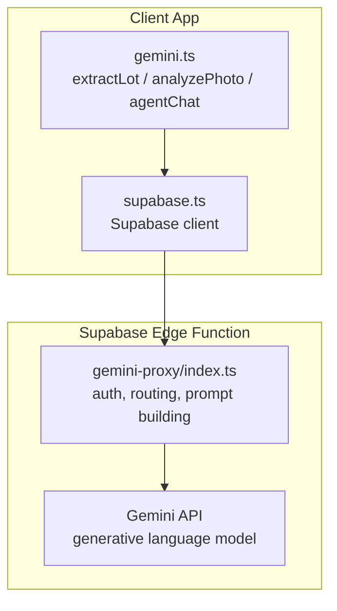
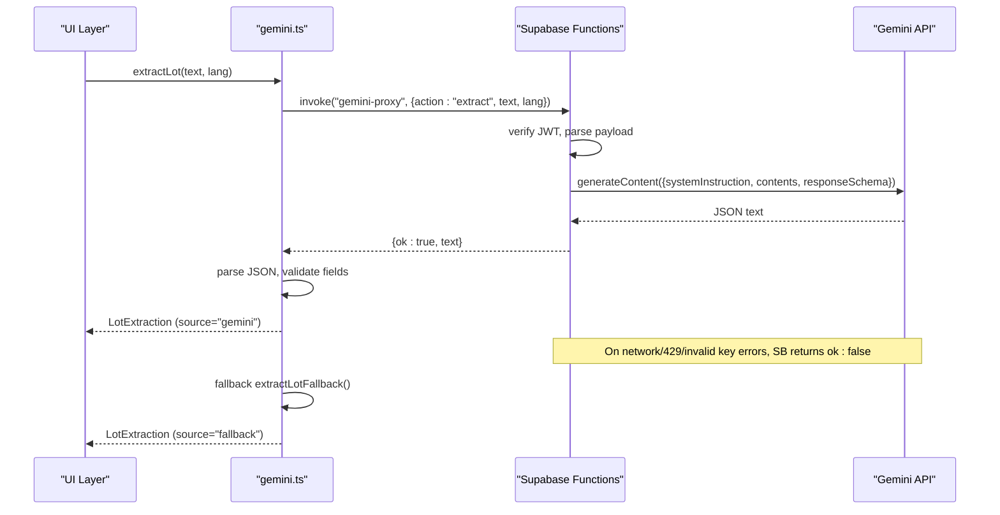
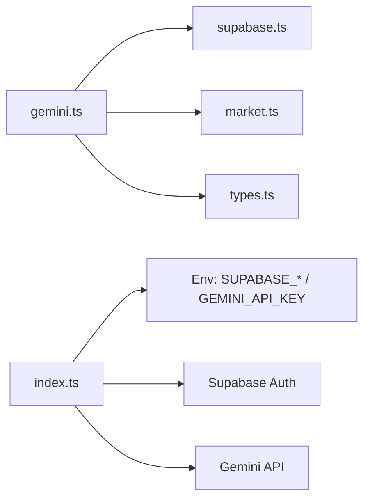

# AI Integration

<cite>
**Referenced Files in This Document**
- [gemini.ts](file://freshroute/src/lib/gemini.ts)
- [index.ts](file://freshroute/supabase/functions/gemini-proxy/index.ts)
- [engine.ts](file://freshroute/src/lib/engine.ts)
- [types.ts](file://freshroute/src/types.ts)
- [market.ts](file://freshroute/src/data/market.ts)
- [supabase.ts](file://freshroute/src/lib/supabase.ts)
</cite>

## Table of Contents
1. [Introduction](#introduction)
2. [Project Structure](#project-structure)
3. [Core Components](#core-components)
4. [Architecture Overview](#architecture-overview)
5. [Detailed Component Analysis](#detailed-component-analysis)
6. [Dependency Analysis](#dependency-analysis)
7. [Performance Considerations](#performance-considerations)
8. [Troubleshooting Guide](#troubleshooting-guide)
9. [Conclusion](#conclusion)
10. [Appendices](#appendices)

## Introduction
This document explains FreshRoute’s AI integration layer built on Google Gemini. It covers the client-side abstraction that calls a secure Supabase Edge Function proxy, prompt engineering for crop analysis and natural language processing, image recognition capabilities, fallback mechanisms (including demo mode), error handling, rate limiting considerations, and performance optimization strategies.

## Project Structure
The AI integration spans two layers:
- Client library: gemini.ts provides typed functions to extract lot data from farmer messages, analyze photos, and power conversational assistance. It routes all requests through Supabase Functions.
- Server proxy: The Supabase Edge Function index.ts holds the Gemini API key securely, authenticates callers via JWT, enforces input constraints, constructs prompts with schemas, and returns structured JSON responses.

**Diagram sources**
- [gemini.ts:28-42](file://freshroute/src/lib/gemini.ts#L28-L42)
- [index.ts:61-140](file://freshroute/supabase/functions/gemini-proxy/index.ts#L61-L140)
- [supabase.ts:9-19](file://freshroute/src/lib/supabase.ts#L9-L19)

**Section sources**
- [gemini.ts:1-42](file://freshroute/src/lib/gemini.ts#L1-L42)
- [index.ts:1-140](file://freshroute/supabase/functions/gemini-proxy/index.ts#L1-L140)
- [supabase.ts:1-20](file://freshroute/src/lib/supabase.ts#L1-L20)

## Core Components
- AI client abstraction (gemini.ts):
  - Status check to detect live/demo/error modes.
  - Lot extraction from text with deterministic fallback.
  - Photo quality analysis with vision fallback.
  - Conversational assistant with context injection and fallback replies.
- Supabase Edge Function proxy (index.ts):
  - Securely stores Gemini API key in environment secrets.
  - Validates caller identity using Supabase JWT.
  - Routes actions: status, extract, vision, chat.
  - Enforces input limits and response schemas.
  - Logs usage and latency to ai_usage table.

Key responsibilities:
- Prompt construction and schema enforcement on the server side.
- Robust client-side fallbacks when AI is unavailable or returns malformed results.
- Clear separation of concerns: client orchestrates flow; server handles sensitive keys and model calls.

**Section sources**
- [gemini.ts:10-116](file://freshroute/src/lib/gemini.ts#L10-L116)
- [index.ts:103-281](file://freshroute/supabase/functions/gemini-proxy/index.ts#L103-L281)

## Architecture Overview
The system uses a secure proxy pattern:
- The client never sends the Gemini API key. All calls go through Supabase Functions.
- The Edge Function validates the user session, builds prompts with strict schemas, calls Gemini, and returns normalized JSON.
- If the server lacks a configured key or the model call fails, the client falls back to deterministic logic to keep the app usable.

**Diagram sources**
- [gemini.ts:91-116](file://freshroute/src/lib/gemini.ts#L91-L116)
- [index.ts:142-188](file://freshroute/supabase/functions/gemini-proxy/index.ts#L142-L188)

## Detailed Component Analysis

### AI Client Abstraction (gemini.ts)
Responsibilities:
- Route all AI calls through Supabase Functions.
- Detect AI availability and mode (live/demo/error).
- Extract structured lot data from farmer messages with robust fallbacks.
- Analyze produce photos for grade, ripeness, defect rate, and notes.
- Provide conversational assistance with context and deterministic fallbacks.

Key behaviors:
- Status detection:
  - Calls a status action to determine if the server has a valid Gemini key.
  - Returns mode: live, demo, or error with optional model name.
- Lot extraction:
  - Sends text to the proxy with an extract action.
  - Parses returned JSON into a typed LotExtraction.
  - Normalizes crop names via aliases and maps locations to known cities.
  - Falls back to deterministic extraction if the proxy fails or returns malformed JSON.
- Vision analysis:
  - Accepts base64 image data URLs, extracts MIME type, and forwards to the proxy.
  - Parses structured result and caps notes to a safe length.
  - Returns a deterministic demo result on failure or invalid input.
- Chat assistant:
  - Sends conversation history and contextual summaries to the proxy.
  - Uses a deterministic fallback for common questions when the proxy is unavailable.

Error handling:
- Maintains a last-error singleton surfaced once by the consumer.
- Ensures UI remains functional even when AI services are down.

Performance considerations:
- Truncates large inputs where appropriate (e.g., message text).
- Limits history length in chat to reduce token usage.
- Avoids unnecessary retries; relies on deterministic fallbacks.

**Section sources**
- [gemini.ts:10-42](file://freshroute/src/lib/gemini.ts#L10-L42)
- [gemini.ts:44-116](file://freshroute/src/lib/gemini.ts#L44-L116)
- [gemini.ts:118-161](file://freshroute/src/lib/gemini.ts#L118-L161)
- [gemini.ts:163-199](file://freshroute/src/lib/gemini.ts#L163-L199)

### Supabase Edge Function Proxy (index.ts)
Responsibilities:
- Securely store and use the Gemini API key from environment secrets.
- Authenticate callers using Supabase JWT.
- Implement four actions: status, extract, vision, chat.
- Build prompts with system instructions and enforce response schemas.
- Log usage and latency to ai_usage for observability.

Security and access control:
- Requires Authorization header with a valid Supabase JWT.
- Rejects anonymous or expired sessions.
- Never exposes the API key to the client.

Prompt engineering highlights:
- Extract:
  - System instruction instructs JSON-only output with canonical English crop/city values.
  - User prompt includes supported crops, cities, and unit conversion rules (maund to kg).
  - Response schema defines required fields and confidence object.
- Vision:
  - Inline image data plus a short prompt asking for visible quality estimation.
  - Response schema enforces grade, ripeness, defectRate, notes, and confidence.
- Chat:
  - Injects context blocks for lot summary, scenarios, and prices.
  - Constrains tone, word count, and forbids inventing prices.
  - Supports Urdu responses while keeping numbers Western digits.

Input validation and safety:
- Enforces maximum lengths for text and images.
- Caps chat history to recent messages to limit tokens.
- Sanitizes language selection to “ur” or “en”.

Error handling and rate limiting:
- Maps HTTP status codes from Gemini to user-friendly messages.
- Handles 429 rate limits with explicit messaging.
- Always returns HTTP 200 with {ok:false,...} so the client can handle failures gracefully.

Observability:
- Logs each request with user_id, action, model, status, error, and latency_ms.

**Section sources**
- [index.ts:1-59](file://freshroute/supabase/functions/gemini-proxy/index.ts#L1-L59)
- [index.ts:61-140](file://freshroute/supabase/functions/gemini-proxy/index.ts#L61-L140)
- [index.ts:142-188](file://freshroute/supabase/functions/gemini-proxy/index.ts#L142-L188)
- [index.ts:190-233](file://freshroute/supabase/functions/gemini-proxy/index.ts#L190-L233)
- [index.ts:235-281](file://freshroute/supabase/functions/gemini-proxy/index.ts#L235-L281)

### Deterministic Fallbacks and Demo Mode
When AI services are unavailable or return malformed data:
- Lot extraction falls back to rule-based parsing:
  - Recognizes crop aliases and major cities.
  - Parses quantities in kg or maund and converts units.
  - Infers readiness (“today” vs “tomorrow”) from keywords.
  - Marks source as “fallback” to avoid misrepresenting AI output.
- Vision analysis falls back to a predefined demo result with conservative estimates.
- Chat falls back to curated answers for common questions about markets, pricing, and recommendations.

These fallbacks ensure continuity of service and transparency about the source of information.

**Section sources**
- [gemini.ts:53-89](file://freshroute/src/lib/gemini.ts#L53-L89)
- [gemini.ts:118-161](file://freshroute/src/lib/gemini.ts#L118-L161)
- [gemini.ts:184-199](file://freshroute/src/lib/gemini.ts#L184-L199)

### Data Models and Types
Shared types define the contract between client and server outputs:
- VisionResult: grade, ripeness, defectRate, notes, confidence, source.
- LotExtraction: crop, quantityKg, location, readyText, confidence, source.
- Scenario and related structures used downstream for market analysis and transport options.

These types ensure consistent parsing and display across the application.

**Section sources**
- [types.ts:15-45](file://freshroute/src/types.ts#L15-L45)
- [types.ts:94-112](file://freshroute/src/types.ts#L94-L112)

### Market Context and Engine Integration
The AI layer integrates with market data and scenario engine:
- Crop aliases map diverse farmer inputs to canonical crop names.
- Prices, distances, buyer profiles, and transporters inform scenario generation.
- The engine computes net earnings, spoilage, risk, and ranks scenarios.

This ensures AI-assisted decisions are grounded in realistic market conditions.

**Section sources**
- [market.ts:26-71](file://freshroute/src/data/market.ts#L26-L71)
- [market.ts:73-161](file://freshroute/src/data/market.ts#L73-L161)
- [engine.ts:29-235](file://freshroute/src/lib/engine.ts#L29-L235)

## Dependency Analysis
High-level dependencies:
- gemini.ts depends on:
  - supabase.ts for invoking Edge Functions.
  - market.ts for crop aliases and city lists.
  - types.ts for shared interfaces.
- index.ts depends on:
  - Environment variables for Supabase and Gemini credentials.
  - Supabase auth to validate callers.
  - Gemini API for model inference.

Coupling and cohesion:
- Strong separation between client orchestration and server-side model invocation.
- Cohesive modules: gemini.ts focuses on AI flows; index.ts focuses on security and prompt execution.

Potential circular dependencies:
- None observed; client and server communicate via well-defined payloads.

External integrations:
- Supabase Auth and Functions.
- Google Gemini generative language API.

**Diagram sources**
- [gemini.ts:1-4](file://freshroute/src/lib/gemini.ts#L1-L4)
- [index.ts:8-11](file://freshroute/supabase/functions/gemini-proxy/index.ts#L8-L11)

**Section sources**
- [gemini.ts:1-42](file://freshroute/src/lib/gemini.ts#L1-L42)
- [index.ts:8-11](file://freshroute/supabase/functions/gemini-proxy/index.ts#L8-L11)

## Performance Considerations
- Token budgeting:
  - Chat history is truncated to recent messages to reduce token usage.
  - Farmer messages are capped before sending to the model.
- Input size limits:
  - Images are limited to a reasonable size to prevent oversized payloads.
- Deterministic fallbacks:
  - Immediate fallback avoids long waits during outages.
- Observability:
  - Latency logging enables monitoring and tuning of slow paths.
- Model configuration:
  - Temperature set for chat to balance creativity and consistency.
  - Response schemas minimize post-processing and improve reliability.

[No sources needed since this section provides general guidance]

## Troubleshooting Guide
Common issues and resolutions:
- Missing or invalid API key:
  - The proxy detects missing keys and returns demo mode.
  - Ensure GEMINI_API_KEY is set in Supabase secrets.
- Authentication failures:
  - Verify Authorization header contains a valid Supabase JWT.
  - Check session expiration and refresh behavior.
- Rate limiting:
  - 429 responses indicate rate limits; retry after a short delay.
  - Consider batching non-critical requests and reducing frequency.
- Malformed AI responses:
  - Client parses JSON and falls back to deterministic results.
  - Inspect logs in ai_usage for error details and latency.
- Large images:
  - Ensure images are under the enforced size limit.
  - Compress or resize before sending base64 data.

Operational checks:
- Use the status action to confirm server configuration and model availability.
- Monitor ai_usage entries for error rates and latency spikes.

**Section sources**
- [index.ts:103-140](file://freshroute/supabase/functions/gemini-proxy/index.ts#L103-L140)
- [gemini.ts:36-42](file://freshroute/src/lib/gemini.ts#L36-L42)
- [gemini.ts:91-116](file://freshroute/src/lib/gemini.ts#L91-L116)

## Conclusion
FreshRoute’s AI integration leverages a secure proxy pattern to abstract Gemini calls, ensuring sensitive keys remain server-side while providing robust client functionality. Prompt engineering with strict schemas yields reliable structured outputs for lot extraction, photo analysis, and conversational assistance. Comprehensive fallbacks maintain usability during outages, and observability supports ongoing performance tuning.

[No sources needed since this section summarizes without analyzing specific files]

## Appendices

### Example Prompts and Schemas

- Lot extraction prompt (server-side):
  - System instruction: Return only JSON matching the schema; canonical crop and city values stay in English.
  - User prompt: Extract produce lot from farmer message (supports Urdu, Roman Urdu, English); list supported crops and cities; convert maund to kg.
  - Response schema: object with crop, quantityKg, location, readyText, and confidence object.

- Vision analysis prompt (server-side):
  - System instruction: Language note based on selected language.
  - User prompt: Describe visible quality of the provided photo for produce sale; emphasize visual estimate only; respond in JSON.
  - Response schema: object with grade, ripeness, defectRate, notes array, and confidence.

- Chat assistant prompt (server-side):
  - System instruction: Role as FreshRoute Agent; concise, warm, practical; do not invent prices; distinguish facts from estimates; end with helpful next step; support Urdu.
  - Context injection: Lot summary, scenarios summary, prices summary.
  - History: Recent messages truncated to limit tokens.

These prompts and schemas are implemented in the Edge Function and consumed by the client to produce structured, reliable outputs.

**Section sources**
- [index.ts:142-188](file://freshroute/supabase/functions/gemini-proxy/index.ts#L142-L188)
- [index.ts:190-233](file://freshroute/supabase/functions/gemini-proxy/index.ts#L190-L233)
- [index.ts:235-281](file://freshroute/supabase/functions/gemini-proxy/index.ts#L235-L281)