# Assistant UI Components

<cite>
**Referenced Files in This Document**
- [AssistantProvider.tsx](file://freshroute/src/components/assistant-ui/AssistantProvider.tsx)
- [thread.aui.tsx](file://freshroute/src/components/assistant-ui/elements/thread.aui.tsx)
- [markdown-text.tsx](file://freshroute/src/components/assistant-ui/elements/markdown-text.tsx)
- [reasoning.aui.tsx](file://freshroute/src/components/assistant-ui/elements/reasoning.aui.tsx)
- [tool-group.aui.tsx](file://freshroute/src/components/assistant-ui/elements/tool-group.aui.tsx)
- [tool-fallback.aui.tsx](file://freshroute/src/components/assistant-ui/elements/tool-fallback.aui.tsx)
- [attachment.aui.tsx](file://freshroute/src/components/assistant-ui/elements/attachment.aui.tsx)
- [follow-up-suggestions.aui.tsx](file://freshroute/src/components/assistant-ui/elements/follow-up-suggestions.aui.tsx)
- [assistant-adapter.ts](file://freshroute/src/lib/assistant-adapter.ts)
- [gemini.ts](file://freshroute/src/lib/gemini.ts)
- [adkAgent.ts](file://freshroute/src/lib/orchestrator/adkAgent.ts)
- [tools.ts](file://freshroute/src/lib/orchestrator/tools.ts)
- [ChatPage.tsx](file://freshroute/src/pages/ChatPage.tsx)
- [ChatBody.tsx](file://freshroute/src/components/ChatBody.tsx)
- [ChatInput.tsx](file://freshroute/src/components/ChatInput.tsx)
</cite>

## Update Summary
**Changes Made**
- Enhanced assistant integration with comprehensive AI elements system including advanced tool fallback mechanisms
- Improved assistant adapter connecting frontend components to Google ADK via orchestrator/adkAgent.ts
- Expanded element capabilities including thread management, markdown rendering, tool fallbacks, and reasoning visualization
- Added sophisticated approval workflows for write operations and enhanced user interaction patterns
- Integrated follow-up suggestions system for improved conversational flow

## Table of Contents
1. Introduction
2. Project Structure
3. Core Components
4. Architecture Overview
5. Detailed Component Analysis
6. Dependency Analysis
7. Performance Considerations
8. Troubleshooting Guide
9. Conclusion

## Introduction
This document explains the enhanced Assistant UI components that power the conversational experience in FreshRoute. The system now features a comprehensive AI elements framework with sophisticated tool handling, approval workflows, and seamless integration with Google ADK through the orchestrator layer. It covers how the assistant runtime is provided, how messages are rendered and composed, how attachments and reasoning blocks are handled, and how the UI integrates with the Gemini proxy via an improved chat adapter. The goal is to make the system understandable for both developers and non-technical readers.

## Project Structure
The enhanced assistant UI is organized around a provider that sets up the runtime, a sophisticated thread component that renders conversations with advanced state management, and specialized elements for text, reasoning, tool calls, attachments, and follow-up suggestions. Input handling lives in dedicated input components, while the chat page orchestrates state persistence and lifecycle hooks with improved error handling.

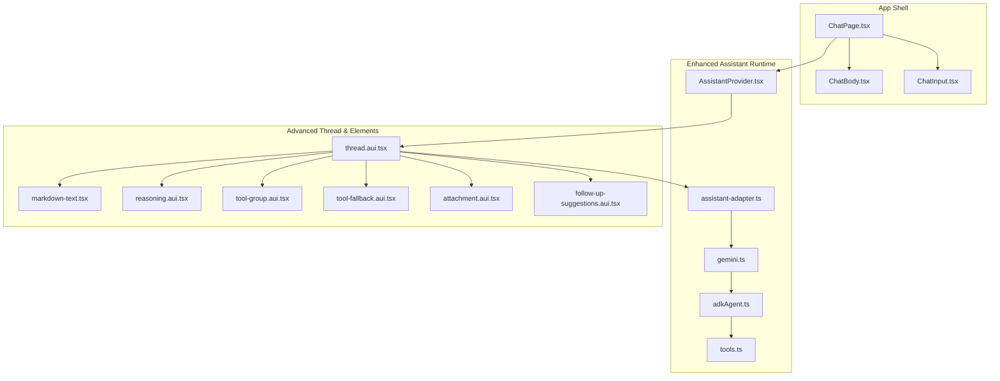

**Diagram sources**
- [ChatPage.tsx:15-88](file://freshroute/src/pages/ChatPage.tsx#L15-L88)
- [AssistantProvider.tsx:10-18](file://freshroute/src/components/assistant-ui/AssistantProvider.tsx#L10-L18)
- [thread.aui.tsx:133-207](file://freshroute/src/components/assistant-ui/elements/thread.aui.tsx#L133-L207)
- [assistant-adapter.ts:42-66](file://freshroute/src/lib/assistant-adapter.ts#L42-L66)
- [gemini.ts:233-246](file://freshroute/src/lib/gemini.ts#L233-L246)
- [adkAgent.ts:186-192](file://freshroute/src/lib/orchestrator/adkAgent.ts#L186-L192)

**Section sources**
- [ChatPage.tsx:15-88](file://freshroute/src/pages/ChatPage.tsx#L15-L88)
- [AssistantProvider.tsx:10-18](file://freshroute/src/components/assistant-ui/AssistantProvider.tsx#L10-L18)

## Core Components
- **AssistantProvider**: Wraps the application with the enhanced assistant runtime using a local runtime backed by an improved chat adapter with ADK integration.
- **Thread**: Renders the conversation viewport with advanced state management, composer, suggestions, message groups, action bars, and follow-up suggestions.
- **MarkdownText**: Renders rich markdown content with GFM support, styled headings, lists, tables, code blocks with copy-to-clipboard support, and deferred rendering for performance.
- **Reasoning**: Collapsible reasoning blocks with streaming-aware animations, scroll locking, and sophisticated state management for real-time updates.
- **ToolGroup**: Collapsible grouping for tool calls with animated transitions, accessibility features, and enhanced user feedback.
- **ToolFallback**: Comprehensive tool execution interface with approval workflows, status tracking, duration display, error handling, and result presentation.
- **Attachment**: Handles file/image attachments in composer and messages, including previews, progress indicators, and error states.
- **FollowUpSuggestions**: Dynamic suggestion system with horizontal scrolling, fade effects, and contextual prompts based on conversation context.
- **AssistantAdapter**: Converts assistant-ui messages into the format expected by the Gemini proxy with enhanced error handling and ADK integration.
- **Gemini Client**: Calls the Supabase Edge Function proxy with circuit breaker, fallbacks, sanitization, and comprehensive logging; includes ADK agent support.
- **ADK Agent**: Centralized agent configuration with tool schemas, instruction definitions, and domain boundaries for the FreshRoute AI assistant.
- **ChatPage**: Orchestrates initialization, visibility-based refresh, debounced persistence of chat state with enhanced error handling.
- **ChatBody**: Renders messages from app state with typing indicators, auto-scroll, and improved message type handling.
- **ChatInput**: Provides text input, voice recording with Web Speech API, attachment triggers, and enhanced user feedback.

**Section sources**
- [AssistantProvider.tsx:10-18](file://freshroute/src/components/assistant-ui/AssistantProvider.tsx#L10-L18)
- [thread.aui.tsx:133-207](file://freshroute/src/components/assistant-ui/elements/thread.aui.tsx#L133-L207)
- [markdown-text.tsx:40-60](file://freshroute/src/components/assistant-ui/elements/markdown-text.tsx#L40-L60)
- [reasoning.aui.tsx:24-57](file://freshroute/src/components/assistant-ui/elements/reasoning.aui.tsx#L24-L57)
- [tool-group.aui.tsx:44-93](file://freshroute/src/components/assistant-ui/elements/tool-group.aui.tsx#L44-L93)
- [tool-fallback.aui.tsx:547-595](file://freshroute/src/components/assistant-ui/elements/tool-fallback.aui.tsx#L547-L595)
- [attachment.aui.tsx:108-209](file://freshroute/src/components/assistant-ui/elements/attachment.aui.tsx#L108-L209)
- [follow-up-suggestions.aui.tsx:73-84](file://freshroute/src/components/assistant-ui/elements/follow-up-suggestions.aui.tsx#L73-L84)
- [assistant-adapter.ts:42-66](file://freshroute/src/lib/assistant-adapter.ts#L42-L66)
- [gemini.ts:50-98](file://freshroute/src/lib/gemini.ts#L50-L98)
- [adkAgent.ts:186-192](file://freshroute/src/lib/orchestrator/adkAgent.ts#L186-L192)
- [ChatPage.tsx:15-88](file://freshroute/src/pages/ChatPage.tsx#L15-L88)
- [ChatBody.tsx:32-84](file://freshroute/src/components/ChatBody.tsx#L32-L84)
- [ChatInput.tsx:18-199](file://freshroute/src/components/ChatInput.tsx#L18-L199)

## Architecture Overview
The enhanced assistant UI uses a provider-driven architecture where the runtime supplies state and primitives for composing messages. The thread component composes user and assistant messages, handles attachments, reasoning blocks, tool call groups, and follow-up suggestions. A sophisticated chat adapter bridges assistant-ui's message model to the Gemini proxy via a Supabase Edge Function, with robust fallbacks, circuit breaking, and ADK agent integration.

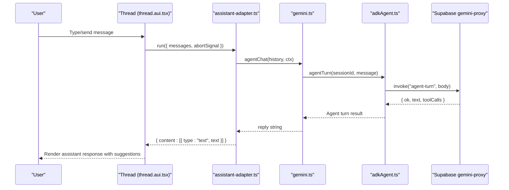

**Diagram sources**
- [thread.aui.tsx:254-291](file://freshroute/src/components/assistant-ui/elements/thread.aui.tsx#L254-L291)
- [assistant-adapter.ts:42-66](file://freshroute/src/lib/assistant-adapter.ts#L42-L66)
- [gemini.ts:297-319](file://freshroute/src/lib/gemini.ts#L297-L319)
- [adkAgent.ts:186-192](file://freshroute/src/lib/orchestrator/adkAgent.ts#L186-L192)

## Detailed Component Analysis

### AssistantProvider
- Purpose: Initializes the enhanced assistant runtime with a local runtime bound to the improved Gemini chat adapter with ADK integration.
- Behavior: Creates a runtime using useLocalRuntime and wraps children with AssistantRuntimeProvider.
- Integration: Depends on assistant-adapter for message flow, rendering, and ADK agent communication.

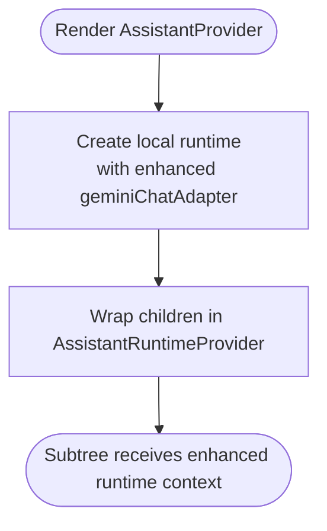

**Diagram sources**
- [AssistantProvider.tsx:10-18](file://freshroute/src/components/assistant-ui/AssistantProvider.tsx#L10-L18)

**Section sources**
- [AssistantProvider.tsx:10-18](file://freshroute/src/components/assistant-ui/AssistantProvider.tsx#L10-L18)

### Thread
- Purpose: Main conversation container with enhanced state management; manages viewport, composer, suggestions, and message rendering.
- Key features:
  - Welcome view when empty; skeleton when loading history.
  - Grouped parts for reasoning, tool calls, and text with sophisticated categorization.
  - Composer with dictation, send/cancel actions, and attachments.
  - Action bars for copy, reload, export, edit, and branch navigation.
  - Follow-up suggestions with horizontal scrolling and fade effects.
  - Advanced message grouping and status tracking.
- Extensibility: Supports custom AssistantMessage, ToolGroup, ReasoningGroup, and ToolFallback overrides via context.

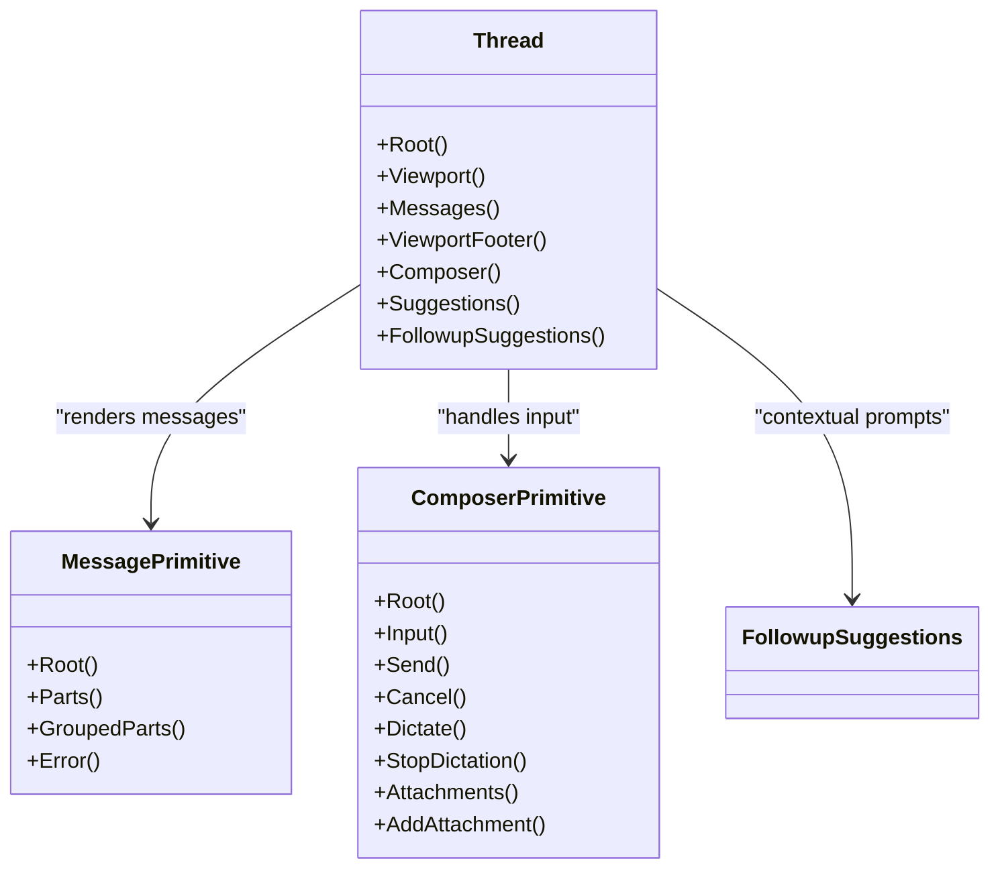

**Diagram sources**
- [thread.aui.tsx:133-207](file://freshroute/src/components/assistant-ui/elements/thread.aui.tsx#L133-L207)
- [thread.aui.tsx:254-291](file://freshroute/src/components/assistant-ui/elements/thread.aui.tsx#L254-L291)
- [thread.aui.tsx:303-410](file://freshroute/src/components/assistant-ui/elements/thread.aui.tsx#L303-L410)

**Section sources**
- [thread.aui.tsx:133-207](file://freshroute/src/components/assistant-ui/elements/thread.aui.tsx#L133-L207)
- [thread.aui.tsx:254-291](file://freshroute/src/components/assistant-ui/elements/thread.aui.tsx#L254-L291)
- [thread.aui.tsx:303-410](file://freshroute/src/components/assistant-ui/elements/thread.aui.tsx#L303-L410)

### MarkdownText
- Purpose: Renders markdown content with GFM support, styled headings, lists, tables, and code blocks.
- Features:
  - Memoized components for performance optimization.
  - Code block headers with copy-to-clipboard feedback and language detection.
  - Deferred rendering for large content to improve initial paint performance.
  - Custom styling for all markdown elements with consistent theming.

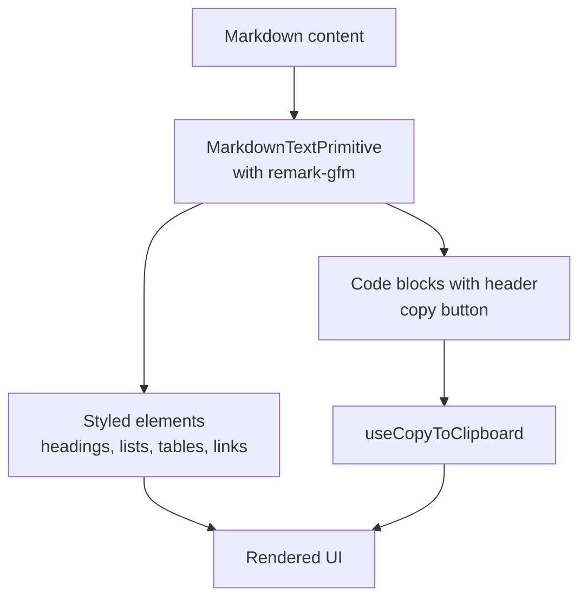

**Diagram sources**
- [markdown-text.tsx:40-60](file://freshroute/src/components/assistant-ui/elements/markdown-text.tsx#L40-L60)
- [markdown-text.tsx:62-84](file://freshroute/src/components/assistant-ui/elements/markdown-text.tsx#L62-L84)

**Section sources**
- [markdown-text.tsx:40-60](file://freshroute/src/components/assistant-ui/elements/markdown-text.tsx#L40-L60)
- [markdown-text.tsx:62-84](file://freshroute/src/components/assistant-ui/elements/markdown-text.tsx#L62-L84)

### Reasoning
- Purpose: Presents collapsible reasoning sections with streaming-aware behavior and scroll locking during animations.
- Features:
  - Root wrapper locks scroll during open/close transitions to prevent layout shifts.
  - Trigger shows active state when streaming with visual feedback.
  - Content renders reasoning text via MarkdownText with proper formatting.
  - Sophisticated state management for real-time streaming updates.

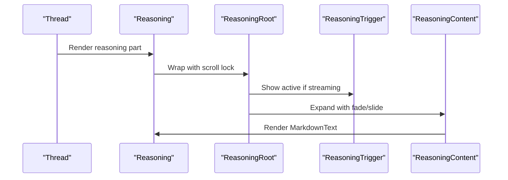

**Diagram sources**
- [reasoning.aui.tsx:24-57](file://freshroute/src/components/assistant-ui/elements/reasoning.aui.tsx#L24-L57)
- [reasoning.aui.tsx:61-82](file://freshroute/src/components/assistant-ui/elements/reasoning.aui.tsx#L61-L82)

**Section sources**
- [reasoning.aui.tsx:24-57](file://freshroute/src/components/assistant-ui/elements/reasoning.aui.tsx#L24-L57)
- [reasoning.aui.tsx:61-82](file://freshroute/src/components/assistant-ui/elements/reasoning.aui.tsx#L61-L82)

### ToolFallback
- Purpose: Comprehensive tool execution interface with approval workflows, status tracking, and result presentation.
- Features:
  - Collapsible interface with smooth animations and scroll locking.
  - Real-time status indicators for running, complete, incomplete, and requires-action states.
  - Duration tracking with formatted time display.
  - Approval workflow with customizable options and confirmation dialogs.
  - Error handling with detailed error messages and cancellation support.
  - Result presentation with JSON formatting and argument display.

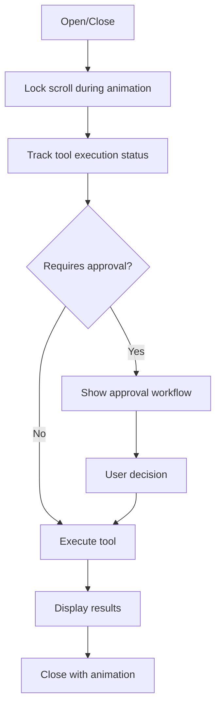

**Diagram sources**
- [tool-fallback.aui.tsx:547-595](file://freshroute/src/components/assistant-ui/elements/tool-fallback.aui.tsx#L547-L595)
- [tool-fallback.aui.tsx:337-445](file://freshroute/src/components/assistant-ui/elements/tool-fallback.aui.tsx#L337-L445)

**Section sources**
- [tool-fallback.aui.tsx:547-595](file://freshroute/src/components/assistant-ui/elements/tool-fallback.aui.tsx#L547-L595)
- [tool-fallback.aui.tsx:337-445](file://freshroute/src/components/assistant-ui/elements/tool-fallback.aui.tsx#L337-L445)

### FollowUpSuggestions
- Purpose: Dynamic suggestion system with horizontal scrolling and contextual prompts based on conversation context.
- Features:
  - Horizontal scrolling with fade effects at edges for better UX.
  - RTL (Right-to-Left) language support with proper direction handling.
  - Contextual suggestions based on conversation state and user interactions.
  - Auto-send functionality for seamless user experience.
  - Responsive design with proper spacing and touch-friendly targets.

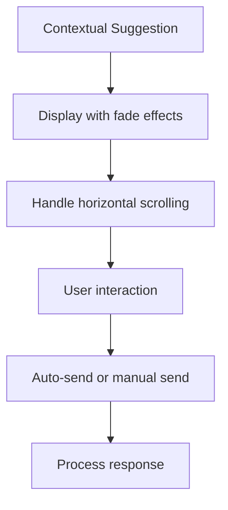

**Diagram sources**
- [follow-up-suggestions.aui.tsx:73-84](file://freshroute/src/components/assistant-ui/elements/follow-up-suggestions.aui.tsx#L73-L84)
- [follow-up-suggestions.aui.tsx:6-71](file://freshroute/src/components/assistant-ui/elements/follow-up-suggestions.aui.tsx#L6-L71)

**Section sources**
- [follow-up-suggestions.aui.tsx:73-84](file://freshroute/src/components/assistant-ui/elements/follow-up-suggestions.aui.tsx#L73-L84)
- [follow-up-suggestions.aui.tsx:6-71](file://freshroute/src/components/assistant-ui/elements/follow-up-suggestions.aui.tsx#L6-L71)

### AssistantAdapter
- Purpose: Bridges assistant-ui messages to the Gemini proxy chat endpoint with enhanced error handling and ADK integration.
- Behavior:
  - Converts ThreadMessage[] to proxy history shape with improved filtering.
  - Builds minimal ChatContext with placeholder data for future enrichment.
  - Returns text content or error fallback with user-friendly messaging.
  - Handles abort signals properly for cancellation scenarios.

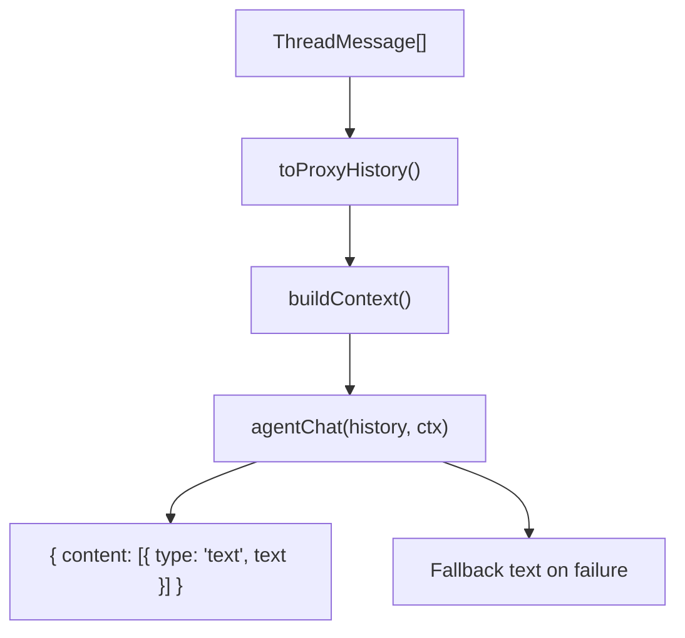

**Diagram sources**
- [assistant-adapter.ts:16-27](file://freshroute/src/lib/assistant-adapter.ts#L16-L27)
- [assistant-adapter.ts:34-40](file://freshroute/src/lib/assistant-adapter.ts#L34-L40)
- [assistant-adapter.ts:42-66](file://freshroute/src/lib/assistant-adapter.ts#L42-L66)

**Section sources**
- [assistant-adapter.ts:16-27](file://freshroute/src/lib/assistant-adapter.ts#L16-L27)
- [assistant-adapter.ts:34-40](file://freshroute/src/lib/assistant-adapter.ts#L34-L40)
- [assistant-adapter.ts:42-66](file://freshroute/src/lib/assistant-adapter.ts#L42-L66)

### Gemini Client
- Purpose: Encapsulates all AI interactions through the Supabase Edge Function proxy with circuit breaker, fallbacks, and ADK agent support.
- Features:
  - Sanitizes user inputs to prevent prompt injection attacks.
  - Logs usage metrics to Firestore for analytics and monitoring.
  - Provides deterministic fallbacks for extraction, vision, and chat operations.
  - Exposes status checking and mode detection for UI state management.
  - ADK agent integration with session management and tool execution.

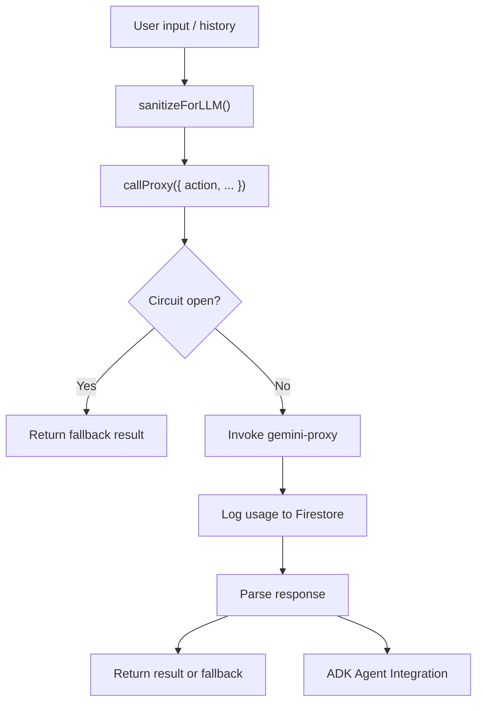

**Diagram sources**
- [gemini.ts:35-48](file://freshroute/src/lib/gemini.ts#L35-L48)
- [gemini.ts:50-98](file://freshroute/src/lib/gemini.ts#L50-L98)
- [gemini.ts:297-319](file://freshroute/src/lib/gemini.ts#L297-L319)

**Section sources**
- [gemini.ts:35-48](file://freshroute/src/lib/gemini.ts#L35-L48)
- [gemini.ts:50-98](file://freshroute/src/lib/gemini.ts#L50-L98)
- [gemini.ts:297-319](file://freshroute/src/lib/gemini.ts#L297-L319)

### ADK Agent
- Purpose: Centralized agent configuration and tool definitions for the FreshRoute AI assistant.
- Features:
  - Comprehensive tool schemas with parameter validation and descriptions.
  - Domain boundary enforcement for focused assistance.
  - Multi-language support with Urdu and English defaults.
  - Write action approval requirements for safety and user control.
  - Agent configuration with model selection and instruction templates.

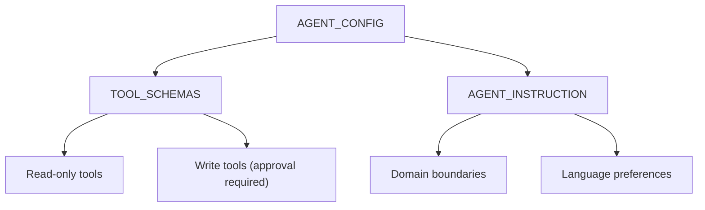

**Diagram sources**
- [adkAgent.ts:186-192](file://freshroute/src/lib/orchestrator/adkAgent.ts#L186-L192)
- [adkAgent.ts:47-178](file://freshroute/src/lib/orchestrator/adkAgent.ts#L47-L178)
- [adkAgent.ts:12-35](file://freshroute/src/lib/orchestrator/adkAgent.ts#L12-L35)

**Section sources**
- [adkAgent.ts:186-192](file://freshroute/src/lib/orchestrator/adkAgent.ts#L186-L192)
- [adkAgent.ts:47-178](file://freshroute/src/lib/orchestrator/adkAgent.ts#L47-L178)
- [adkAgent.ts:12-35](file://freshroute/src/lib/orchestrator/adkAgent.ts#L12-L35)

### ChatPage
- Purpose: Entry point for the chat interface; initializes app state, refreshes AI mode on visibility changes, and persists chat state.
- Behavior:
  - Boots director and refreshes AI mode on mount with enhanced error handling.
  - Subscribes to visibility changes to refresh AI mode automatically.
  - Loads saved chat state for logged-in users with fallback handling.
  - Debounces saving stage, lot, scenarios, and quick replies for performance.

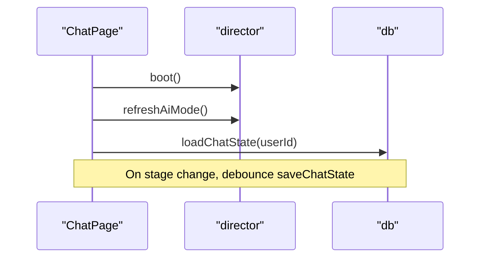

**Diagram sources**
- [ChatPage.tsx:18-43](file://freshroute/src/pages/ChatPage.tsx#L18-L43)
- [ChatPage.tsx:45-69](file://freshroute/src/pages/ChatPage.tsx#L45-L69)

**Section sources**
- [ChatPage.tsx:18-43](file://freshroute/src/pages/ChatPage.tsx#L18-L43)
- [ChatPage.tsx:45-69](file://freshroute/src/pages/ChatPage.tsx#L45-L69)

### ChatBody
- Purpose: Renders messages from app state with typing indicators and auto-scroll.
- Behavior:
  - Maps message kinds to specific card or bubble components with enhanced type handling.
  - Shows typing bubble when assistant is processing with visual feedback.
  - Scrolls to bottom on new messages or typing updates with smooth animations.

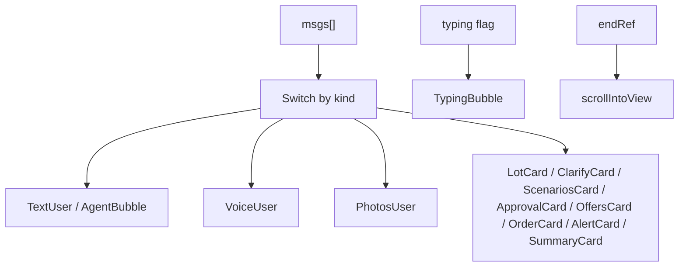

**Diagram sources**
- [ChatBody.tsx:32-84](file://freshroute/src/components/ChatBody.tsx#L32-L84)

**Section sources**
- [ChatBody.tsx:32-84](file://freshroute/src/components/ChatBody.tsx#L32-L84)

### ChatInput
- Purpose: Provides text input, voice recording with Web Speech API, and attachment triggers.
- Behavior:
  - Sends text via onUserText with validation and sanitization.
  - Starts/stops speech recognition with language selection and error handling.
  - Displays real-time transcript and localized error messages.
  - Opens photo sheet for attachments with preview capabilities.

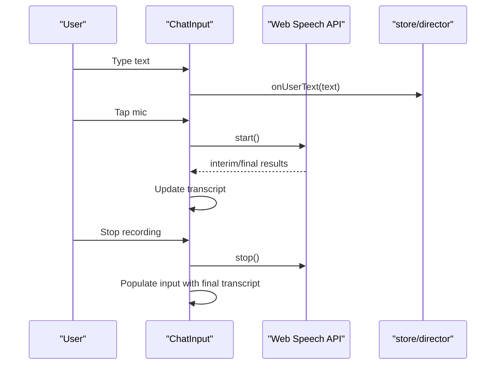

**Diagram sources**
- [ChatInput.tsx:18-199](file://freshroute/src/components/ChatInput.tsx#L18-L199)

**Section sources**
- [ChatInput.tsx:18-199](file://freshroute/src/components/ChatInput.tsx#L18-L199)

## Dependency Analysis
The enhanced assistant UI has clear separation between presentation (thread and elements), runtime (provider), and integration (adapter, gemini client, and ADK agent). Coupling is minimized through well-defined interfaces, context providers, and modular architecture.

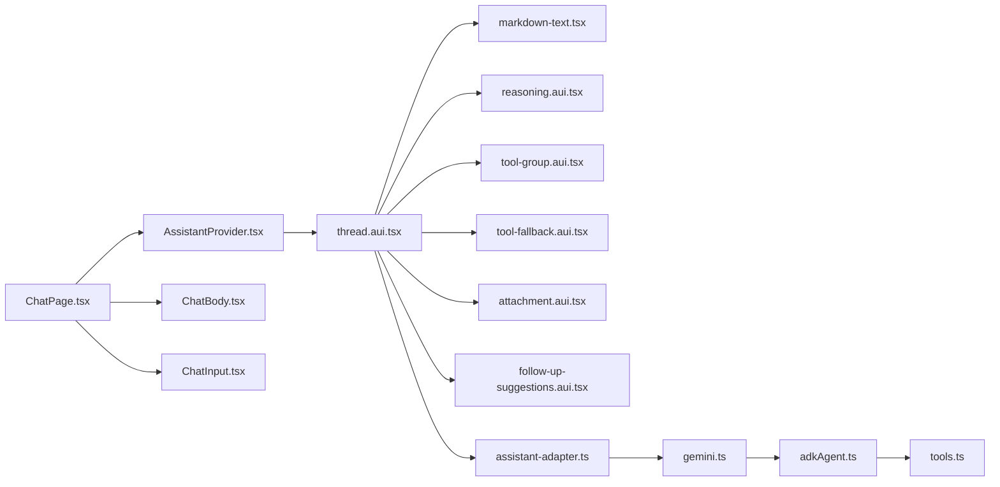

**Diagram sources**
- [AssistantProvider.tsx:10-18](file://freshroute/src/components/assistant-ui/AssistantProvider.tsx#L10-L18)
- [thread.aui.tsx:133-207](file://freshroute/src/components/assistant-ui/elements/thread.aui.tsx#L133-L207)
- [assistant-adapter.ts:42-66](file://freshroute/src/lib/assistant-adapter.ts#L42-L66)
- [gemini.ts:297-319](file://freshroute/src/lib/gemini.ts#L297-L319)
- [adkAgent.ts:186-192](file://freshroute/src/lib/orchestrator/adkAgent.ts#L186-L192)
- [ChatPage.tsx:15-88](file://freshroute/src/pages/ChatPage.tsx#L15-L88)

**Section sources**
- [AssistantProvider.tsx:10-18](file://freshroute/src/components/assistant-ui/AssistantProvider.tsx#L10-L18)
- [thread.aui.tsx:133-207](file://freshroute/src/components/assistant-ui/elements/thread.aui.tsx#L133-L207)
- [assistant-adapter.ts:42-66](file://freshroute/src/lib/assistant-adapter.ts#L42-L66)
- [gemini.ts:297-319](file://freshroute/src/lib/gemini.ts#L297-L319)
- [adkAgent.ts:186-192](file://freshroute/src/lib/orchestrator/adkAgent.ts#L186-L192)
- [ChatPage.tsx:15-88](file://freshroute/src/pages/ChatPage.tsx#L15-L88)

## Performance Considerations
- Use memoization for markdown components to avoid unnecessary re-renders and optimize rendering performance.
- Defer markdown rendering for large content to improve initial paint and reduce memory usage.
- Employ scroll locking during collapsible animations to prevent layout shifts and maintain smooth user experience.
- Debounce state persistence to reduce write frequency and improve database performance.
- Leverage circuit breaker to protect against cascading failures and provide fast fallbacks.
- Optimize attachment previews with lazy loading and conditional rendering for better memory management.
- Implement efficient state management for follow-up suggestions to minimize re-renders.
- Use proper cleanup and disposal of event listeners and observers to prevent memory leaks.

## Troubleshooting Guide
- Network or proxy errors: The adapter returns a friendly fallback message when the Gemini proxy is unreachable. Check the gemini client's circuit breaker and fallback paths for ADK integration issues.
- Speech recognition issues: ChatInput displays localized error messages for microphone permissions, no-speech, and service availability. Ensure browser support and permissions are properly configured.
- Markdown rendering problems: Verify remark-gfm plugins and component overrides; check console for parsing errors and ensure proper styling is applied.
- Collapsible animations: If scroll jumps occur, ensure scroll locking is applied to root refs during open/close transitions for all collapsible components.
- State persistence: Confirm user session exists before saving/loading chat state; handle errors gracefully with proper fallbacks.
- Tool execution failures: ToolFallback provides comprehensive error handling with user-friendly messages and retry options. Check approval workflows and permission settings.
- ADK agent issues: Monitor agent configuration and tool schemas; verify domain boundaries and language settings are properly configured.

**Section sources**
- [assistant-adapter.ts:52-64](file://freshroute/src/lib/assistant-adapter.ts#L52-L64)
- [gemini.ts:50-98](file://freshroute/src/lib/gemini.ts#L50-L98)
- [ChatInput.tsx:75-105](file://freshroute/src/components/ChatInput.tsx#L75-L105)
- [markdown-text.tsx:40-60](file://freshroute/src/components/assistant-ui/elements/markdown-text.tsx#L40-L60)
- [reasoning.aui.tsx:24-57](file://freshroute/src/components/assistant-ui/elements/reasoning.aui.tsx#L24-L57)
- [tool-fallback.aui.tsx:267-302](file://freshroute/src/components/assistant-ui/elements/tool-fallback.aui.tsx#L267-L302)
- [ChatPage.tsx:34-69](file://freshroute/src/pages/ChatPage.tsx#L34-L69)

## Conclusion
The enhanced Assistant UI components in FreshRoute provide a robust, extensible, and user-friendly conversational interface with comprehensive AI capabilities. The provider-driven runtime, modular elements for text, reasoning, tools, attachments, and follow-up suggestions, and a resilient adapter layer with ADK integration ensure reliable communication with the Gemini proxy. With thoughtful performance optimizations, sophisticated error handling, and advanced user interaction patterns, the system delivers a smooth experience across devices and network conditions while maintaining high standards for security and user control.