# Assistant UI Components

<cite>
**Referenced Files in This Document**
- [AssistantProvider.tsx](file://freshroute/src/components/assistant-ui/AssistantProvider.tsx)
- [thread.aui.tsx](file://freshroute/src/components/assistant-ui/elements/thread.aui.tsx)
- [markdown-text.tsx](file://freshroute/src/components/assistant-ui/elements/markdown-text.tsx)
- [reasoning.aui.tsx](file://freshroute/src/components/assistant-ui/elements/reasoning.aui.tsx)
- [tool-group.aui.tsx](file://freshroute/src/components/assistant-ui/elements/tool-group.aui.tsx)
- [attachment.aui.tsx](file://freshroute/src/components/assistant-ui/elements/attachment.aui.tsx)
- [assistant-adapter.ts](file://freshroute/src/lib/assistant-adapter.ts)
- [gemini.ts](file://freshroute/src/lib/gemini.ts)
- [ChatPage.tsx](file://freshroute/src/pages/ChatPage.tsx)
- [ChatBody.tsx](file://freshroute/src/components/ChatBody.tsx)
- [ChatInput.tsx](file://freshroute/src/components/ChatInput.tsx)
</cite>

## Table of Contents
1. Introduction
2. Project Structure
3. Core Components
4. Architecture Overview
5. Detailed Component Analysis
6. Dependency Analysis
7. Performance Considerations
8. Troubleshooting Guide
9. Conclusion

## Introduction
This document explains the Assistant UI components that power the conversational experience in FreshRoute. It covers how the assistant runtime is provided, how messages are rendered and composed, how attachments and reasoning blocks are handled, and how the UI integrates with the Gemini proxy via a chat adapter. The goal is to make the system understandable for both developers and non-technical readers.

## Project Structure
The assistant UI is organized around a provider that sets up the runtime, a thread component that renders conversations, and specialized elements for text, reasoning, tool calls, and attachments. Input handling lives in dedicated input components, while the chat page orchestrates state persistence and lifecycle hooks.

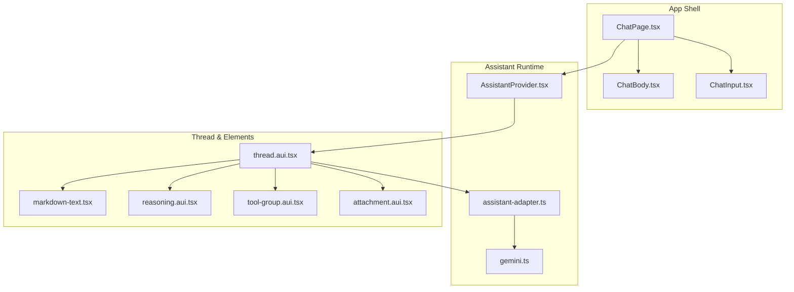

**Diagram sources**
- [ChatPage.tsx:15-88](file://freshroute/src/pages/ChatPage.tsx#L15-L88)
- [AssistantProvider.tsx:10-18](file://freshroute/src/components/assistant-ui/AssistantProvider.tsx#L10-L18)
- [thread.aui.tsx:133-207](file://freshroute/src/components/assistant-ui/elements/thread.aui.tsx#L133-L207)
- [assistant-adapter.ts:42-66](file://freshroute/src/lib/assistant-adapter.ts#L42-L66)
- [gemini.ts:233-246](file://freshroute/src/lib/gemini.ts#L233-L246)

**Section sources**
- [ChatPage.tsx:15-88](file://freshroute/src/pages/ChatPage.tsx#L15-L88)
- [AssistantProvider.tsx:10-18](file://freshroute/src/components/assistant-ui/AssistantProvider.tsx#L10-L18)

## Core Components
- AssistantProvider: Wraps the application with the assistant runtime using a local runtime backed by a chat adapter.
- Thread: Renders the conversation viewport, composer, suggestions, message groups, and action bars.
- MarkdownText: Renders rich markdown content with code blocks and copy-to-clipboard support.
- Reasoning: Collapsible reasoning blocks with streaming-aware animations and scroll locking.
- ToolGroup: Collapsible grouping for tool calls with animated transitions and accessibility.
- Attachment: Handles file/image attachments in composer and messages, including previews and error states.
- AssistantAdapter: Converts assistant-ui messages into the format expected by the Gemini proxy and returns responses.
- Gemini Client: Calls the Supabase Edge Function proxy with circuit breaker and fallbacks; includes sanitization and fallback logic.
- ChatPage: Orchestrates initialization, visibility-based refresh, and debounced persistence of chat state.
- ChatBody: Renders messages from app state with typing indicators and auto-scroll.
- ChatInput: Provides text input, voice recording with Web Speech API, and attachment triggers.

**Section sources**
- [AssistantProvider.tsx:10-18](file://freshroute/src/components/assistant-ui/AssistantProvider.tsx#L10-L18)
- [thread.aui.tsx:133-207](file://freshroute/src/components/assistant-ui/elements/thread.aui.tsx#L133-L207)
- [markdown-text.tsx:40-60](file://freshroute/src/components/assistant-ui/elements/markdown-text.tsx#L40-L60)
- [reasoning.aui.tsx:24-57](file://freshroute/src/components/assistant-ui/elements/reasoning.aui.tsx#L24-L57)
- [tool-group.aui.tsx:44-93](file://freshroute/src/components/assistant-ui/elements/tool-group.aui.tsx#L44-L93)
- [attachment.aui.tsx:108-209](file://freshroute/src/components/assistant-ui/elements/attachment.aui.tsx#L108-L209)
- [assistant-adapter.ts:42-66](file://freshroute/src/lib/assistant-adapter.ts#L42-L66)
- [gemini.ts:50-98](file://freshroute/src/lib/gemini.ts#L50-L98)
- [ChatPage.tsx:15-88](file://freshroute/src/pages/ChatPage.tsx#L15-L88)
- [ChatBody.tsx:32-84](file://freshroute/src/components/ChatBody.tsx#L32-L84)
- [ChatInput.tsx:18-199](file://freshroute/src/components/ChatInput.tsx#L18-L199)

## Architecture Overview
The assistant UI uses a provider-driven architecture where the runtime supplies state and primitives for composing messages. The thread component composes user and assistant messages, handles attachments, reasoning blocks, and tool call groups. A chat adapter bridges assistant-ui’s message model to the Gemini proxy via a Supabase Edge Function, with robust fallbacks and circuit breaking.

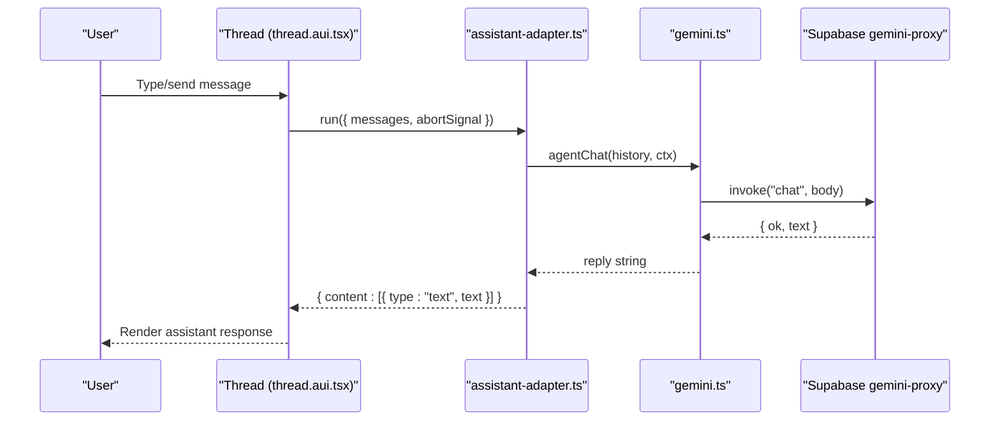

**Diagram sources**
- [thread.aui.tsx:254-291](file://freshroute/src/components/assistant-ui/elements/thread.aui.tsx#L254-L291)
- [assistant-adapter.ts:42-66](file://freshroute/src/lib/assistant-adapter.ts#L42-L66)
- [gemini.ts:233-246](file://freshroute/src/lib/gemini.ts#L233-L246)

## Detailed Component Analysis

### AssistantProvider
- Purpose: Initializes the assistant runtime with a local runtime bound to the Gemini chat adapter.
- Behavior: Creates a runtime using useLocalRuntime and wraps children with AssistantRuntimeProvider.
- Integration: Depends on assistant-adapter for message flow and rendering.

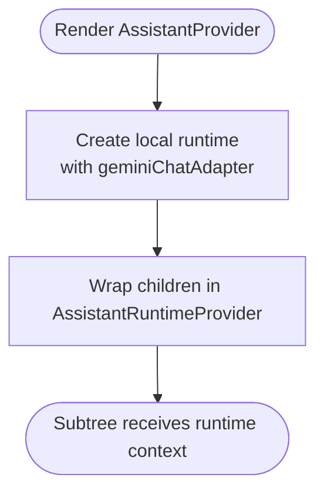

**Diagram sources**
- [AssistantProvider.tsx:10-18](file://freshroute/src/components/assistant-ui/AssistantProvider.tsx#L10-L18)

**Section sources**
- [AssistantProvider.tsx:10-18](file://freshroute/src/components/assistant-ui/AssistantProvider.tsx#L10-L18)

### Thread
- Purpose: Main conversation container; manages viewport, composer, suggestions, and message rendering.
- Key features:
  - Welcome view when empty; skeleton when loading history.
  - Grouped parts for reasoning, tool calls, and text.
  - Composer with dictation, send/cancel actions, and attachments.
  - Action bars for copy, reload, export, edit, and branch navigation.
- Extensibility: Supports custom AssistantMessage, ToolGroup, and ReasoningGroup overrides via context.

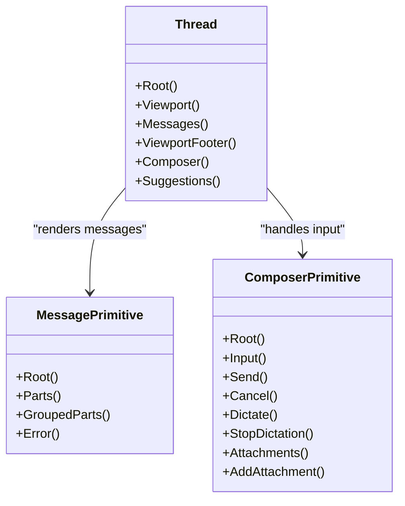

**Diagram sources**
- [thread.aui.tsx:133-207](file://freshroute/src/components/assistant-ui/elements/thread.aui.tsx#L133-L207)
- [thread.aui.tsx:254-291](file://freshroute/src/components/assistant-ui/elements/thread.aui.tsx#L254-L291)
- [thread.aui.tsx:303-410](file://freshroute/src/components/assistant-ui/elements/thread.aui.tsx#L303-L410)

**Section sources**
- [thread.aui.tsx:133-207](file://freshroute/src/components/assistant-ui/elements/thread.aui.tsx#L133-L207)
- [thread.aui.tsx:254-291](file://freshroute/src/components/assistant-ui/elements/thread.aui.tsx#L254-L291)
- [thread.aui.tsx:303-410](file://freshroute/src/components/assistant-ui/elements/thread.aui.tsx#L303-L410)

### MarkdownText
- Purpose: Renders markdown content with GFM support, styled headings, lists, tables, and code blocks.
- Features:
  - Memoized components for performance.
  - Code block headers with copy-to-clipboard feedback.
  - Deferred rendering for large content.

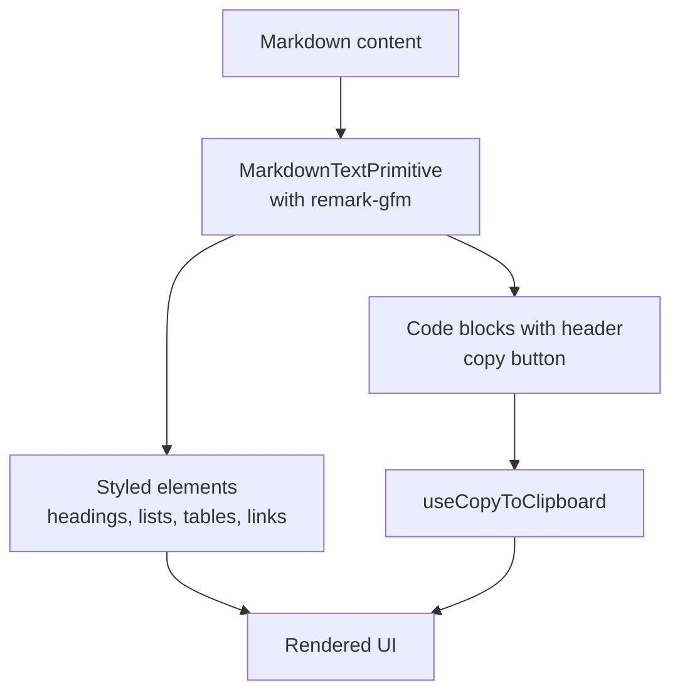

**Diagram sources**
- [markdown-text.tsx:40-60](file://freshroute/src/components/assistant-ui/elements/markdown-text.tsx#L40-L60)
- [markdown-text.tsx:62-84](file://freshroute/src/components/assistant-ui/elements/markdown-text.tsx#L62-L84)

**Section sources**
- [markdown-text.tsx:40-60](file://freshroute/src/components/assistant-ui/elements/markdown-text.tsx#L40-L60)
- [markdown-text.tsx:62-84](file://freshroute/src/components/assistant-ui/elements/markdown-text.tsx#L62-L84)

### Reasoning
- Purpose: Presents collapsible reasoning sections with streaming-aware behavior and scroll locking during animations.
- Features:
  - Root wrapper locks scroll during open/close transitions.
  - Trigger shows active state when streaming.
  - Content renders reasoning text via MarkdownText.

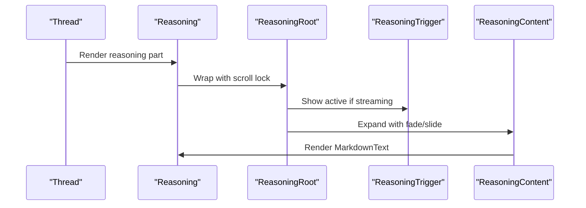

**Diagram sources**
- [reasoning.aui.tsx:24-57](file://freshroute/src/components/assistant-ui/elements/reasoning.aui.tsx#L24-L57)
- [reasoning.aui.tsx:61-82](file://freshroute/src/components/assistant-ui/elements/reasoning.aui.tsx#L61-L82)

**Section sources**
- [reasoning.aui.tsx:24-57](file://freshroute/src/components/assistant-ui/elements/reasoning.aui.tsx#L24-L57)
- [reasoning.aui.tsx:61-82](file://freshroute/src/components/assistant-ui/elements/reasoning.aui.tsx#L61-L82)

### ToolGroup
- Purpose: Groups multiple tool calls into a collapsible section with animated transitions and accessibility.
- Features:
  - Controlled or uncontrolled open state.
  - Animated chevron and loader indicator when active.
  - Staggered child animations for smooth reveal.

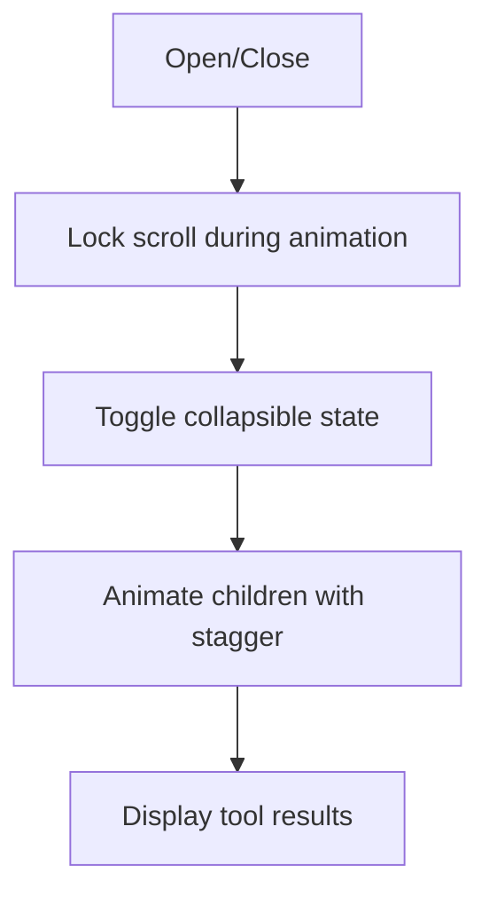

**Diagram sources**
- [tool-group.aui.tsx:44-93](file://freshroute/src/components/assistant-ui/elements/tool-group.aui.tsx#L44-L93)
- [tool-group.aui.tsx:95-148](file://freshroute/src/components/assistant-ui/elements/tool-group.aui.tsx#L95-L148)
- [tool-group.aui.tsx:150-187](file://freshroute/src/components/assistant-ui/elements/tool-group.aui.tsx#L150-L187)

**Section sources**
- [tool-group.aui.tsx:44-93](file://freshroute/src/components/assistant-ui/elements/tool-group.aui.tsx#L44-L93)
- [tool-group.aui.tsx:95-148](file://freshroute/src/components/assistant-ui/elements/tool-group.aui.tsx#L95-L148)
- [tool-group.aui.tsx:150-187](file://freshroute/src/components/assistant-ui/elements/tool-group.aui.tsx#L150-L187)

### Attachment
- Purpose: Manages file and image attachments in both composer and messages.
- Features:
  - Preview dialog for images with lazy load.
  - Avatar thumbnails with fallback icons.
  - Upload progress and error overlays.
  - Remove action for composer attachments.

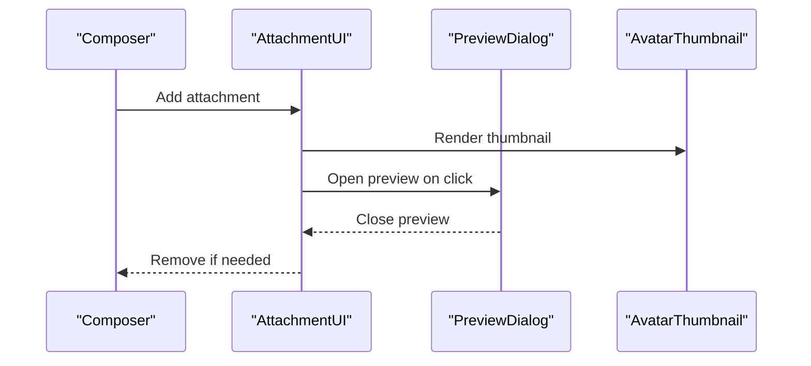

**Diagram sources**
- [attachment.aui.tsx:108-209](file://freshroute/src/components/assistant-ui/elements/attachment.aui.tsx#L108-L209)
- [attachment.aui.tsx:227-265](file://freshroute/src/components/assistant-ui/elements/attachment.aui.tsx#L227-L265)

**Section sources**
- [attachment.aui.tsx:108-209](file://freshroute/src/components/assistant-ui/elements/attachment.aui.tsx#L108-L209)
- [attachment.aui.tsx:227-265](file://freshroute/src/components/assistant-ui/elements/attachment.aui.tsx#L227-L265)

### AssistantAdapter
- Purpose: Bridges assistant-ui messages to the Gemini proxy chat endpoint.
- Behavior:
  - Converts ThreadMessage[] to proxy history shape.
  - Builds minimal ChatContext.
  - Returns text content or error fallback.

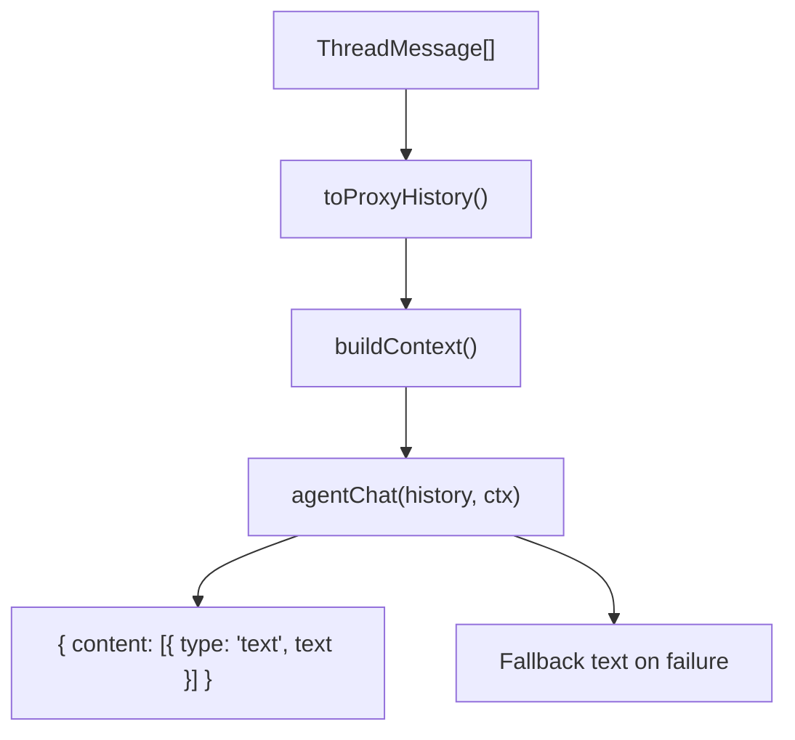

**Diagram sources**
- [assistant-adapter.ts:16-27](file://freshroute/src/lib/assistant-adapter.ts#L16-L27)
- [assistant-adapter.ts:34-40](file://freshroute/src/lib/assistant-adapter.ts#L34-L40)
- [assistant-adapter.ts:42-66](file://freshroute/src/lib/assistant-adapter.ts#L42-L66)

**Section sources**
- [assistant-adapter.ts:16-27](file://freshroute/src/lib/assistant-adapter.ts#L16-L27)
- [assistant-adapter.ts:34-40](file://freshroute/src/lib/assistant-adapter.ts#L34-L40)
- [assistant-adapter.ts:42-66](file://freshroute/src/lib/assistant-adapter.ts#L42-L66)

### Gemini Client
- Purpose: Encapsulates all AI interactions through the Supabase Edge Function proxy with circuit breaker and fallbacks.
- Features:
  - Sanitizes user inputs to prevent prompt injection.
  - Logs usage metrics to Firestore.
  - Provides deterministic fallbacks for extraction, vision, and chat.
  - Exposes status checking and mode detection.

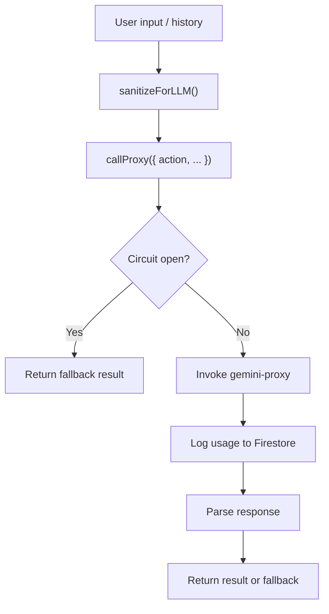

**Diagram sources**
- [gemini.ts:35-48](file://freshroute/src/lib/gemini.ts#L35-L48)
- [gemini.ts:50-98](file://freshroute/src/lib/gemini.ts#L50-L98)
- [gemini.ts:233-246](file://freshroute/src/lib/gemini.ts#L233-L246)

**Section sources**
- [gemini.ts:35-48](file://freshroute/src/lib/gemini.ts#L35-L48)
- [gemini.ts:50-98](file://freshroute/src/lib/gemini.ts#L50-L98)
- [gemini.ts:233-246](file://freshroute/src/lib/gemini.ts#L233-L246)

### ChatPage
- Purpose: Entry point for the chat interface; initializes app state, refreshes AI mode on visibility changes, and persists chat state.
- Behavior:
  - Boots director and refreshes AI mode on mount.
  - Subscribes to visibility changes to refresh AI mode.
  - Loads saved chat state for logged-in users.
  - Debounces saving stage, lot, scenarios, and quick replies.

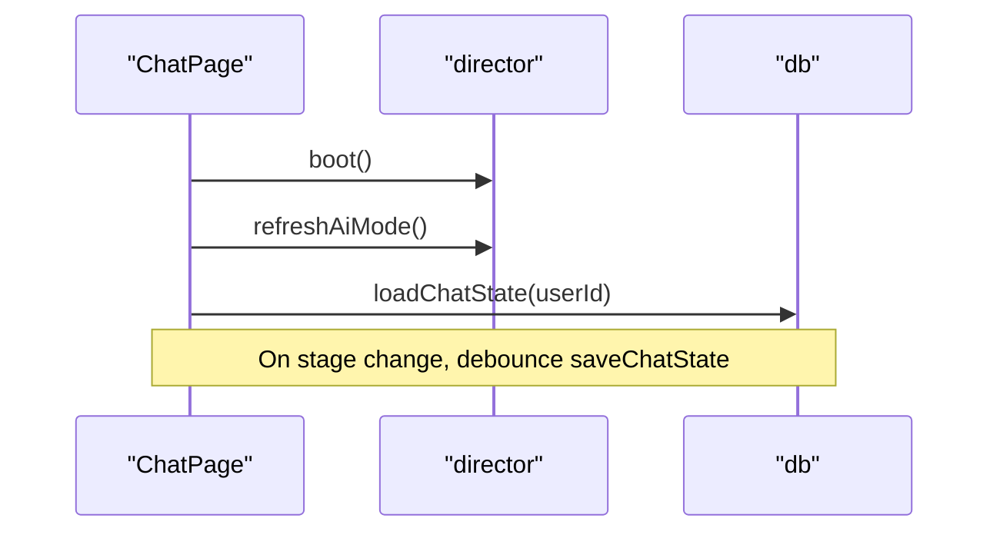

**Diagram sources**
- [ChatPage.tsx:18-43](file://freshroute/src/pages/ChatPage.tsx#L18-L43)
- [ChatPage.tsx:45-69](file://freshroute/src/pages/ChatPage.tsx#L45-L69)

**Section sources**
- [ChatPage.tsx:18-43](file://freshroute/src/pages/ChatPage.tsx#L18-L43)
- [ChatPage.tsx:45-69](file://freshroute/src/pages/ChatPage.tsx#L45-L69)

### ChatBody
- Purpose: Renders messages from app state with typing indicators and auto-scroll.
- Behavior:
  - Maps message kinds to specific card or bubble components.
  - Shows typing bubble when assistant is processing.
  - Scrolls to bottom on new messages or typing updates.

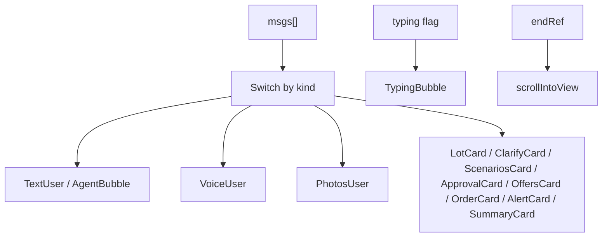

**Diagram sources**
- [ChatBody.tsx:32-84](file://freshroute/src/components/ChatBody.tsx#L32-L84)

**Section sources**
- [ChatBody.tsx:32-84](file://freshroute/src/components/ChatBody.tsx#L32-L84)

### ChatInput
- Purpose: Provides text input, voice recording with Web Speech API, and attachment triggers.
- Behavior:
  - Sends text via onUserText.
  - Starts/stops speech recognition with language selection.
  - Displays real-time transcript and errors.
  - Opens photo sheet for attachments.

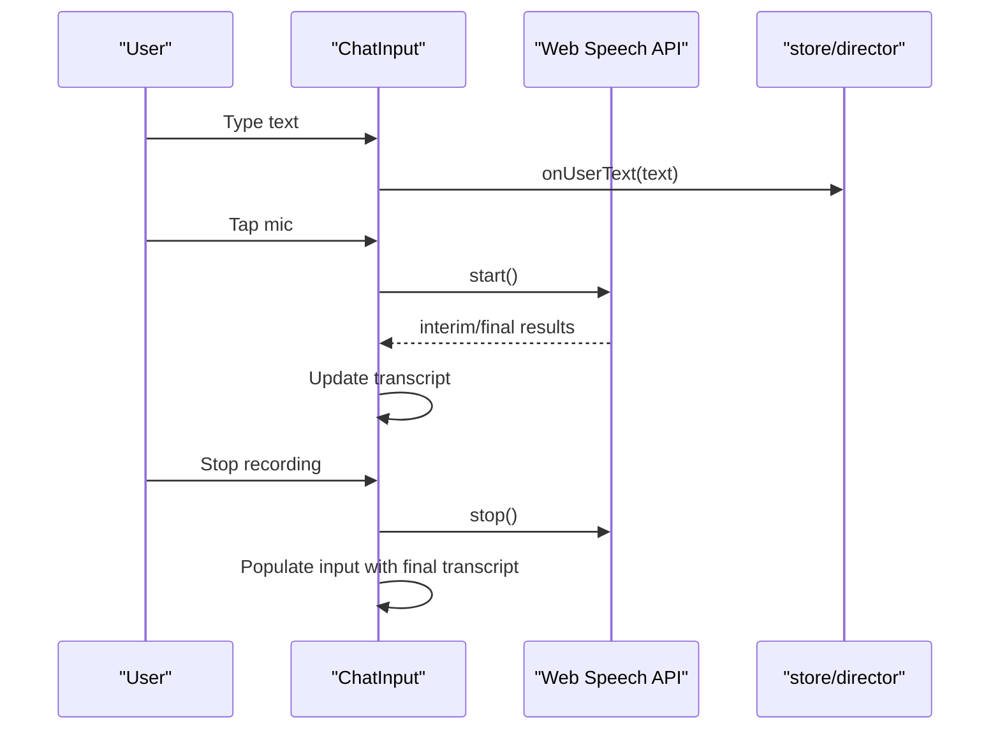

**Diagram sources**
- [ChatInput.tsx:18-199](file://freshroute/src/components/ChatInput.tsx#L18-L199)

**Section sources**
- [ChatInput.tsx:18-199](file://freshroute/src/components/ChatInput.tsx#L18-L199)

## Dependency Analysis
The assistant UI has clear separation between presentation (thread and elements), runtime (provider), and integration (adapter and gemini client). Coupling is minimized through well-defined interfaces and context providers.

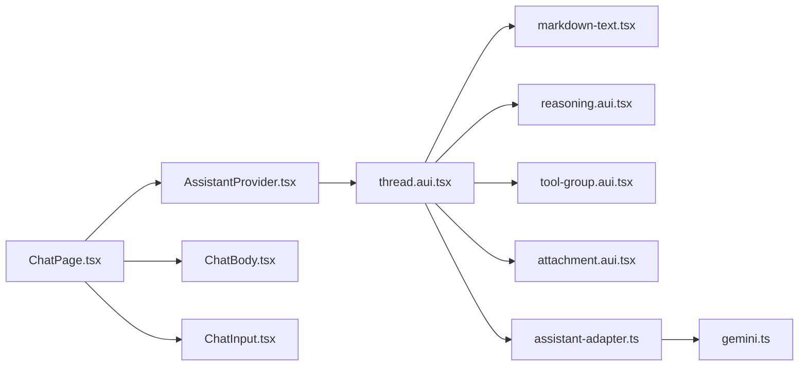

**Diagram sources**
- [AssistantProvider.tsx:10-18](file://freshroute/src/components/assistant-ui/AssistantProvider.tsx#L10-L18)
- [thread.aui.tsx:133-207](file://freshroute/src/components/assistant-ui/elements/thread.aui.tsx#L133-L207)
- [assistant-adapter.ts:42-66](file://freshroute/src/lib/assistant-adapter.ts#L42-L66)
- [gemini.ts:233-246](file://freshroute/src/lib/gemini.ts#L233-L246)
- [ChatPage.tsx:15-88](file://freshroute/src/pages/ChatPage.tsx#L15-L88)

**Section sources**
- [AssistantProvider.tsx:10-18](file://freshroute/src/components/assistant-ui/AssistantProvider.tsx#L10-L18)
- [thread.aui.tsx:133-207](file://freshroute/src/components/assistant-ui/elements/thread.aui.tsx#L133-L207)
- [assistant-adapter.ts:42-66](file://freshroute/src/lib/assistant-adapter.ts#L42-L66)
- [gemini.ts:233-246](file://freshroute/src/lib/gemini.ts#L233-L246)
- [ChatPage.tsx:15-88](file://freshroute/src/pages/ChatPage.tsx#L15-L88)

## Performance Considerations
- Use memoization for markdown components to avoid unnecessary re-renders.
- Defer markdown rendering for large content to improve initial paint.
- Employ scroll locking during collapsible animations to prevent layout shifts.
- Debounce state persistence to reduce write frequency.
- Leverage circuit breaker to protect against cascading failures and provide fast fallbacks.
- Optimize attachment previews with lazy loading and conditional rendering.

[No sources needed since this section provides general guidance]

## Troubleshooting Guide
- Network or proxy errors: The adapter returns a friendly fallback message when the Gemini proxy is unreachable. Check the gemini client’s circuit breaker and fallback paths.
- Speech recognition issues: ChatInput displays localized error messages for microphone permissions, no-speech, and service availability. Ensure browser support and permissions.
- Markdown rendering problems: Verify remark-gfm plugins and component overrides; check console for parsing errors.
- Collapsible animations: If scroll jumps occur, ensure scroll locking is applied to root refs during open/close transitions.
- State persistence: Confirm user session exists before saving/loading chat state; handle errors gracefully.

**Section sources**
- [assistant-adapter.ts:52-64](file://freshroute/src/lib/assistant-adapter.ts#L52-L64)
- [gemini.ts:50-98](file://freshroute/src/lib/gemini.ts#L50-L98)
- [ChatInput.tsx:75-105](file://freshroute/src/components/ChatInput.tsx#L75-L105)
- [markdown-text.tsx:40-60](file://freshroute/src/components/assistant-ui/elements/markdown-text.tsx#L40-L60)
- [reasoning.aui.tsx:24-57](file://freshroute/src/components/assistant-ui/elements/reasoning.aui.tsx#L24-L57)
- [ChatPage.tsx:34-69](file://freshroute/src/pages/ChatPage.tsx#L34-L69)

## Conclusion
The Assistant UI components in FreshRoute provide a robust, extensible, and user-friendly conversational interface. The provider-driven runtime, modular elements for text, reasoning, tools, and attachments, and a resilient adapter layer ensure reliable communication with the Gemini proxy. With thoughtful performance optimizations and comprehensive error handling, the system delivers a smooth experience across devices and network conditions.

[No sources needed since this section summarizes without analyzing specific files]