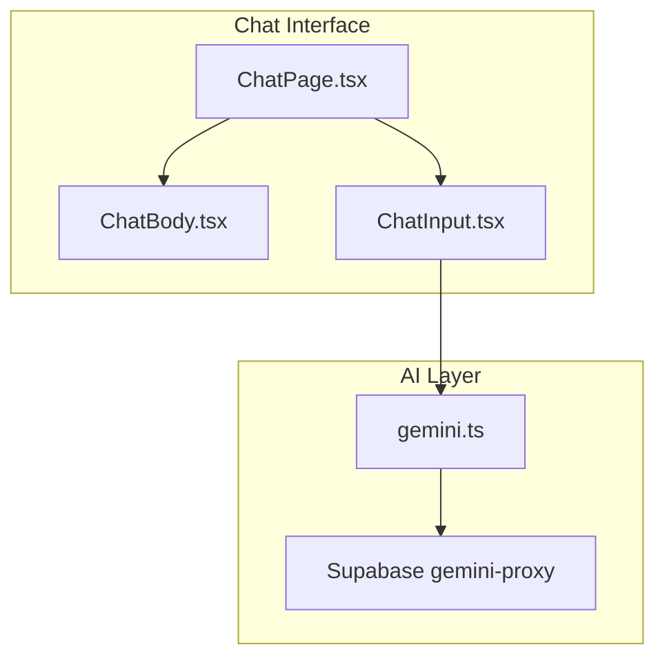

# Assistant UI Components

<cite>
**Referenced Files in This Document**
- [ChatPage.tsx](file://freshroute/src/pages/ChatPage.tsx)
- [ChatBody.tsx](file://freshroute/src/components/ChatBody.tsx)
- [ChatInput.tsx](file://freshroute/src/components/ChatInput.tsx)
- [gemini.ts](file://freshroute/src/lib/gemini.ts)
</cite>

## Update Summary
**Changes Made**
- **Removed**: All assistant-ui components (AssistantProvider.tsx, thread.aui.tsx, markdown-text.tsx, reasoning.aui.tsx, tool-group.aui.tsx, tool-fallback.aui.tsx, attachment.aui.tsx, follow-up-suggestions.aui.tsx, image.tsx, file.tsx, tooltip-icon-button.tsx)
- **Removed**: Assistant adapter layer (assistant-adapter.ts)
- **Simplified**: Replaced sophisticated conversational interface with basic chat components
- **Maintained**: Core AI functionality through gemini.ts with fallback mechanisms
- **Updated**: Documentation to reflect current simplified architecture

## Table of Contents
1. Introduction
2. Current Architecture
3. Core Components
4. AI Integration
5. Performance Considerations
6. Troubleshooting Guide
7. Conclusion

## Introduction
The FreshRoute application has transitioned from a sophisticated assistant-ui based conversational interface to a streamlined chat system. While the advanced assistant components have been removed, the core AI capabilities remain intact through direct integration with the Gemini proxy. The current implementation focuses on essential chat functionality with voice support, photo sharing, and business-specific card components for produce trading workflows.

## Current Architecture
The simplified architecture consists of three main components: ChatPage as the entry point, ChatBody for message rendering, and ChatInput for user interaction. The AI integration is handled directly through the gemini.ts module without an intermediate adapter layer.

**Diagram sources**
- [ChatPage.tsx:15-89](file://freshroute/src/pages/ChatPage.tsx#L15-L89)
- [ChatBody.tsx:32-85](file://freshroute/src/components/ChatBody.tsx#L32-L85)
- [ChatInput.tsx:18-199](file://freshroute/src/components/ChatInput.tsx#L18-L199)
- [gemini.ts:233-246](file://freshroute/src/lib/gemini.ts#L233-L246)

## Core Components

### ChatPage
- **Purpose**: Main entry point for the chat interface; manages initialization, state persistence, and component composition
- **Key Features**: 
  - Boots the director and refreshes AI mode on mount
  - Handles visibility changes to automatically refresh AI status
  - Loads and saves chat state with debounced persistence
  - Composes the complete chat interface with header, body, input, and utility sheets

**Section sources**
- [ChatPage.tsx:15-89](file://freshroute/src/pages/ChatPage.tsx#L15-L89)

### ChatBody
- **Purpose**: Renders conversation messages with typing indicators and auto-scroll functionality
- **Key Features**:
  - Maps different message types to appropriate visual components (text, voice, photos, business cards)
  - Shows animated typing bubble when assistant is processing
  - Auto-scrolls to latest messages with smooth animations
  - Supports various business-specific card components for produce trading scenarios

**Section sources**
- [ChatBody.tsx:32-85](file://freshroute/src/components/ChatBody.tsx#L32-L85)

### ChatInput
- **Purpose**: Provides text input, voice recording with Web Speech API, and attachment triggers
- **Key Features**:
  - Text input with send functionality
  - Voice recording with real-time transcription using Web Speech API
  - Photo attachment support via photo sheet
  - Error handling for speech recognition issues with localized messages
  - Responsive design with touch-friendly controls

**Section sources**
- [ChatInput.tsx:18-199](file://freshroute/src/components/ChatInput.tsx#L18-L199)

## AI Integration
The application maintains direct AI integration through the gemini.ts module, which provides comprehensive fallback mechanisms and error handling.

### Gemini Client
- **Purpose**: Encapsulates all AI interactions through the Supabase Edge Function proxy
- **Key Features**:
  - Circuit breaker pattern for resilience against service failures
  - Deterministic fallback responses for extraction, vision, and chat operations
  - Input sanitization to prevent prompt injection attacks
  - Usage logging to Firestore for analytics and monitoring
  - Multi-language support with Urdu and English defaults

**Section sources**
- [gemini.ts:50-98](file://freshroute/src/lib/gemini.ts#L50-L98)
- [gemini.ts:233-246](file://freshroute/src/lib/gemini.ts#L233-L246)

## Performance Considerations
- **Debounced State Persistence**: Chat state is saved with a 2-second debounce to reduce database write frequency
- **Efficient Message Rendering**: ChatBody uses React's key prop for optimal list rendering
- **Lazy Loading**: Voice recognition only initializes when user attempts to record
- **Error Handling**: Graceful degradation with fallback responses when AI services are unavailable
- **Memory Management**: Proper cleanup of speech recognition instances and event listeners

## Troubleshooting Guide
- **Speech Recognition Issues**: Check browser compatibility and microphone permissions; the app provides localized error messages for common issues
- **Network Errors**: The circuit breaker pattern ensures the app remains functional even when AI services are down
- **State Persistence**: Verify user session exists before attempting to save/load chat state
- **Message Rendering**: Ensure proper message type mapping in ChatBody switch statement
- **Voice Recording**: Confirm browser supports Web Speech API and microphone access is granted

## Conclusion
While the sophisticated assistant-ui components have been removed, FreshRoute maintains its core AI capabilities through a streamlined architecture focused on essential chat functionality. The current implementation provides reliable voice support, photo sharing, and business-specific interactions while maintaining robust error handling and performance optimizations. The simplified approach reduces complexity while preserving the essential features needed for produce trading workflows.