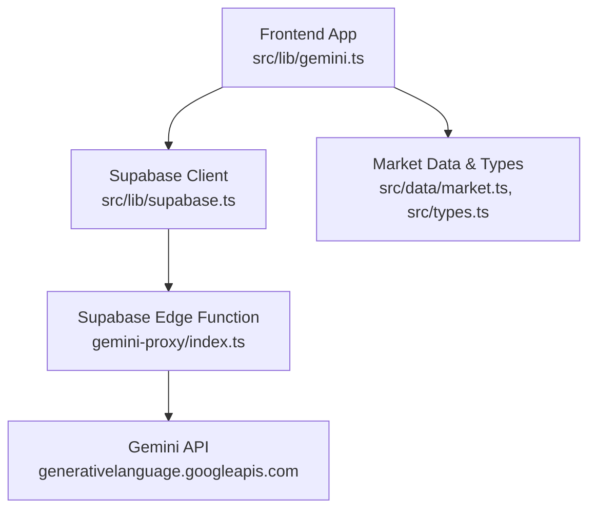
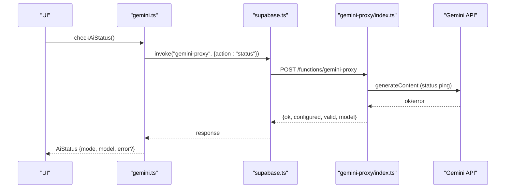
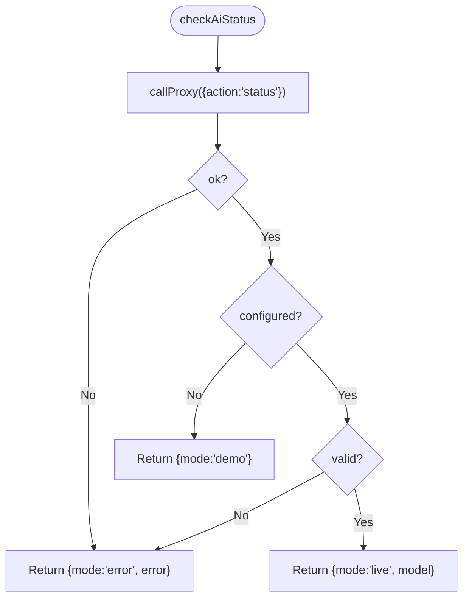
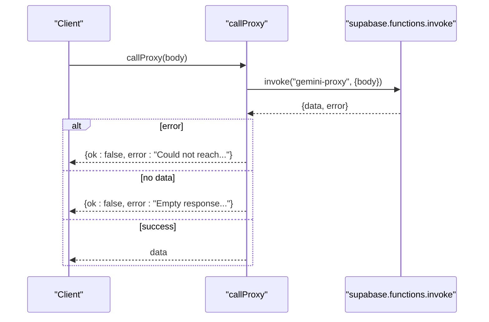
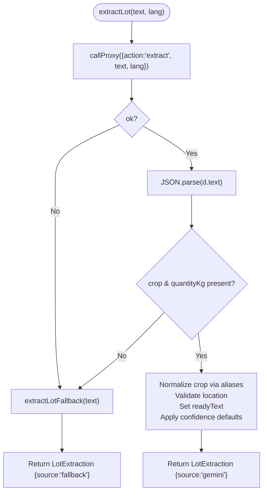
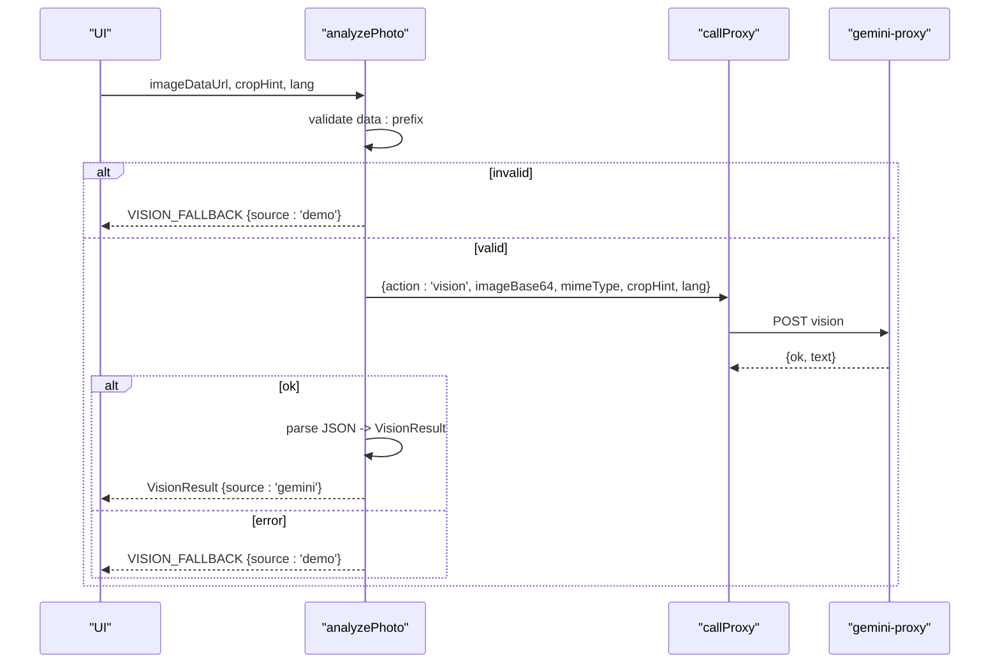
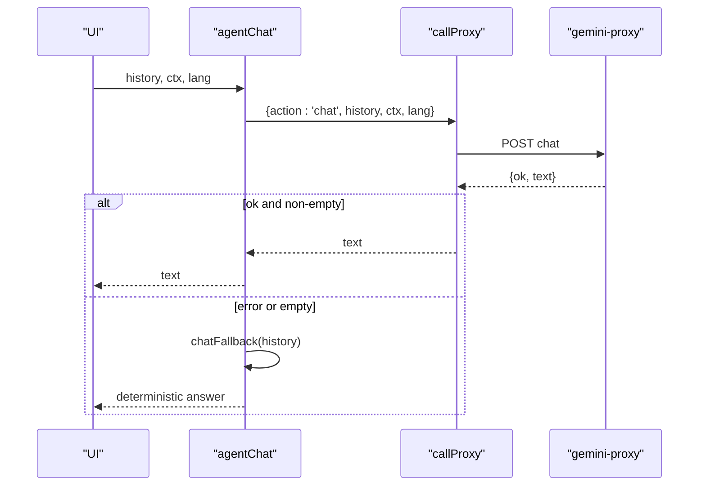
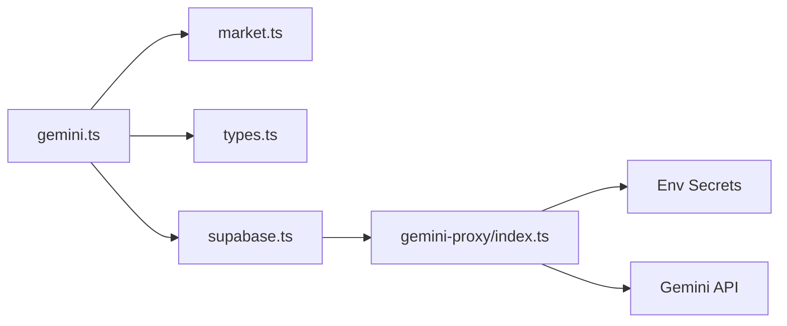

# Gemini Client Abstraction

<cite>
**Referenced Files in This Document**
- [gemini.ts](file://freshroute/src/lib/gemini.ts)
- [index.ts](file://freshroute/supabase/functions/gemini-proxy/index.ts)
- [market.ts](file://freshroute/src/data/market.ts)
- [types.ts](file://freshroute/src/types.ts)
- [supabase.ts](file://freshroute/src/lib/supabase.ts)
</cite>

## Table of Contents
1. [Introduction](#introduction)
2. [Project Structure](#project-structure)
3. [Core Components](#core-components)
4. [Architecture Overview](#architecture-overview)
5. [Detailed Component Analysis](#detailed-component-analysis)
6. [Dependency Analysis](#dependency-analysis)
7. [Performance Considerations](#performance-considerations)
8. [Troubleshooting Guide](#troubleshooting-guide)
9. [Conclusion](#conclusion)

## Introduction
This document explains the Gemini client abstraction layer that powers AI features for FreshRoute. It covers how the frontend safely communicates with a Supabase Edge Function proxy to call Gemini, how it manages operational modes and status, and how it processes natural language inputs and images. It also documents fallback mechanisms that keep the app functional when AI services are unavailable.

## Project Structure
The Gemini integration is split between:
- Frontend client in src/lib/gemini.ts: exposes typed APIs for status checks, lot extraction, image analysis, and chat.
- Server-side proxy in supabase/functions/gemini-proxy/index.ts: validates requests, calls Gemini, and returns structured JSON responses.
- Shared data and types in src/data/market.ts and src/types.ts.
- Supabase client configuration in src/lib/supabase.ts.

**Diagram sources**
- [gemini.ts:1-34](file://freshroute/src/lib/gemini.ts#L1-L34)
- [index.ts:1-10](file://freshroute/supabase/functions/gemini-proxy/index.ts#L1-L10)
- [supabase.ts:1-20](file://freshroute/src/lib/supabase.ts#L1-L20)
- [market.ts:1-58](file://freshroute/src/data/market.ts#L1-L58)
- [types.ts:15-32](file://freshroute/src/types.ts#L15-L32)

**Section sources**
- [gemini.ts:1-34](file://freshroute/src/lib/gemini.ts#L1-L34)
- [index.ts:1-10](file://freshroute/supabase/functions/gemini-proxy/index.ts#L1-L10)
- [supabase.ts:1-20](file://freshroute/src/lib/supabase.ts#L1-L20)
- [market.ts:1-58](file://freshroute/src/data/market.ts#L1-L58)
- [types.ts:15-32](file://freshroute/src/types.ts#L15-L32)

## Core Components
- AiMode and AiStatus: describe the current state of AI capabilities (checking, live, demo, error).
- callProxy: centralizes all communication with the Supabase Edge Function proxy, normalizing errors and responses.
- extractLot: parses farmer messages into structured lot data with confidence scores; falls back to deterministic logic when needed.
- analyzePhoto: analyzes produce photos via base64 image payloads and vision results; includes robust MIME handling and fallbacks.
- agentChat: conversational assistant with context injection and deterministic fallbacks.

**Section sources**
- [gemini.ts:10-16](file://freshroute/src/lib/gemini.ts#L10-L16)
- [gemini.ts:26-42](file://freshroute/src/lib/gemini.ts#L26-L42)
- [gemini.ts:44-116](file://freshroute/src/lib/gemini.ts#L44-L116)
- [gemini.ts:118-161](file://freshroute/src/lib/gemini.ts#L118-L161)
- [gemini.ts:163-199](file://freshroute/src/lib/gemini.ts#L163-L199)

## Architecture Overview
The system uses a secure proxy pattern:
- The browser never holds the Gemini API key.
- All AI calls go through a Supabase Edge Function that authenticates the caller and forwards requests to Gemini.
- Responses are strictly typed and parsed on the client side, with deterministic fallbacks ensuring resilience.

**Diagram sources**
- [gemini.ts:36-42](file://freshroute/src/lib/gemini.ts#L36-L42)
- [index.ts:103-128](file://freshroute/supabase/functions/gemini-proxy/index.ts#L103-L128)
- [supabase.ts:9-19](file://freshroute/src/lib/supabase.ts#L9-L19)

## Detailed Component Analysis

### AiMode and AiStatus
- AiMode enumerates operational states:
  - checking: probing service availability
  - live: server key configured and validated
  - demo: running without a configured key
  - error: key invalid or service unreachable
- AiStatus carries mode plus optional model name and error message.
- checkAiStatus invokes the proxy’s status action and maps server signals to frontend modes.

**Diagram sources**
- [gemini.ts:36-42](file://freshroute/src/lib/gemini.ts#L36-L42)
- [index.ts:103-128](file://freshroute/supabase/functions/gemini-proxy/index.ts#L103-L128)

**Section sources**
- [gemini.ts:10-16](file://freshroute/src/lib/gemini.ts#L10-L16)
- [gemini.ts:36-42](file://freshroute/src/lib/gemini.ts#L36-L42)

### callProxy: Unified Proxy Communication
- Sends any action payload to the gemini-proxy function via Supabase.
- Normalizes network errors into a consistent shape with ok=false and a human-readable error.
- Ensures empty responses are treated as failures.

**Diagram sources**
- [gemini.ts:26-34](file://freshroute/src/lib/gemini.ts#L26-L34)

**Section sources**
- [gemini.ts:26-34](file://freshroute/src/lib/gemini.ts#L26-L34)

### extractLot: Natural Language Processing of Farmer Inputs
- Calls the proxy’s extract action with text and language preference.
- Parses JSON from the server, normalizes crop names using CROP_ALIASES, validates cities against a known list, and sets readyText defaults.
- Computes per-field confidence values; if parsing fails or the proxy reports an error, falls back to deterministic extraction labeled as fallback.

Key behaviors:
- Crop alias mapping: canonicalizes user input to supported crops.
- Quantity extraction: supports kg/kilo/kgs and maund/man/من formats; converts maund to kg using a constant factor.
- Location detection: matches against a predefined city list; defaults to Multan if none found.
- Readiness detection: infers “today” or “tomorrow” based on keywords.
- Confidence scoring: provides per-field confidence numbers; defaults applied when missing.

**Diagram sources**
- [gemini.ts:91-116](file://freshroute/src/lib/gemini.ts#L91-L116)
- [gemini.ts:55-89](file://freshroute/src/lib/gemini.ts#L55-L89)
- [market.ts:26-58](file://freshroute/src/data/market.ts#L26-L58)

**Section sources**
- [gemini.ts:44-116](file://freshroute/src/lib/gemini.ts#L44-L116)
- [market.ts:26-58](file://freshroute/src/data/market.ts#L26-L58)

### analyzePhoto: Image Recognition Capabilities
- Validates that the input is a data URL; otherwise returns a demo result.
- Extracts MIME type from the data URL header and passes base64 image data to the proxy’s vision action.
- Parses the returned JSON into VisionResult, constraining grade to allowed values and limiting notes length.
- On any failure (network, parse, or malformed response), returns a deterministic demo result marked as source: demo.

**Diagram sources**
- [gemini.ts:118-161](file://freshroute/src/lib/gemini.ts#L118-L161)
- [index.ts:190-233](file://freshroute/supabase/functions/gemini-proxy/index.ts#L190-L233)
- [types.ts:25-32](file://freshroute/src/types.ts#L25-L32)

**Section sources**
- [gemini.ts:118-161](file://freshroute/src/lib/gemini.ts#L118-L161)
- [types.ts:25-32](file://freshroute/src/types.ts#L25-L32)

### agentChat: Conversational AI with Context Management
- Sends conversation history and contextual summaries (lot, scenarios, prices) to the proxy’s chat action.
- If the proxy fails or returns empty text, returns a deterministic fallback tailored to common questions (e.g., market comparisons, recommendations, storage advice).
- Maintains concise, practical guidance suitable for farmers with basic literacy.

**Diagram sources**
- [gemini.ts:163-199](file://freshroute/src/lib/gemini.ts#L163-L199)
- [index.ts:235-278](file://freshroute/supabase/functions/gemini-proxy/index.ts#L235-L278)

**Section sources**
- [gemini.ts:163-199](file://freshroute/src/lib/gemini.ts#L163-L199)

### Error Handling and Last AI Error
- A module-level variable stores the last AI error surfaced once by the chat director.
- consumeAiError retrieves and clears this value for one-time display.
- Each public function sets lastAiError on failures before returning fallbacks.

**Section sources**
- [gemini.ts:18-24](file://freshroute/src/lib/gemini.ts#L18-L24)
- [gemini.ts:91-116](file://freshroute/src/lib/gemini.ts#L91-L116)
- [gemini.ts:131-161](file://freshroute/src/lib/gemini.ts#L131-L161)
- [gemini.ts:169-182](file://freshroute/src/lib/gemini.ts#L169-L182)

## Dependency Analysis
- Frontend dependencies:
  - gemini.ts depends on market data for crop aliases and constants, and on types for shared interfaces.
  - Uses supabase.ts to invoke functions with authenticated sessions.
- Server dependencies:
  - gemini-proxy/index.ts depends on environment secrets (GEMINI_API_KEY, SUPABASE_URL, keys) and calls the Gemini API directly.
  - Logs usage to ai_usage table via a service role client.

**Diagram sources**
- [gemini.ts:1-3](file://freshroute/src/lib/gemini.ts#L1-L3)
- [supabase.ts:1-20](file://freshroute/src/lib/supabase.ts#L1-L20)
- [index.ts:8-11](file://freshroute/supabase/functions/gemini-proxy/index.ts#L8-L11)

**Section sources**
- [gemini.ts:1-3](file://freshroute/src/lib/gemini.ts#L1-L3)
- [supabase.ts:1-20](file://freshroute/src/lib/supabase.ts#L1-L20)
- [index.ts:8-11](file://freshroute/supabase/functions/gemini-proxy/index.ts#L8-L11)

## Performance Considerations
- Network latency: All AI calls traverse the Supabase Edge Function; consider batching or caching where appropriate.
- Image size: The proxy enforces a maximum image size; ensure clients compress images before sending base64 payloads.
- Token limits: Chat history is truncated to recent messages to control payload size.
- Deterministic fallbacks: Provide instant UX when AI is slow or down, reducing perceived latency.

[No sources needed since this section provides general guidance]

## Troubleshooting Guide
Common issues and resolutions:
- Missing or invalid API key:
  - Status check returns demo or error mode; verify GEMINI_API_KEY in Supabase secrets.
- Network errors:
  - callProxy wraps transport errors; check Supabase function logs and network connectivity.
- Malformed responses:
  - Parsing failures trigger fallbacks; inspect proxy logs for schema mismatches.
- Large images:
  - Vision action rejects oversized images; compress or resize before calling analyzePhoto.
- Session/auth issues:
  - Ensure Supabase auth session is active; the proxy requires a valid JWT.

**Section sources**
- [index.ts:25-59](file://freshroute/supabase/functions/gemini-proxy/index.ts#L25-L59)
- [index.ts:61-85](file://freshroute/supabase/functions/gemini-proxy/index.ts#L61-L85)
- [gemini.ts:26-34](file://freshroute/src/lib/gemini.ts#L26-L34)
- [gemini.ts:131-161](file://freshroute/src/lib/gemini.ts#L131-L161)

## Conclusion
The Gemini client abstraction provides a resilient, secure interface to AI capabilities for FreshRoute. It centralizes communication through a Supabase Edge Function, enforces strict typing and validation, and offers robust fallbacks to maintain functionality when AI services are unavailable. By separating concerns across frontend, proxy, and data layers, it ensures scalability, security, and a smooth user experience even under adverse conditions.