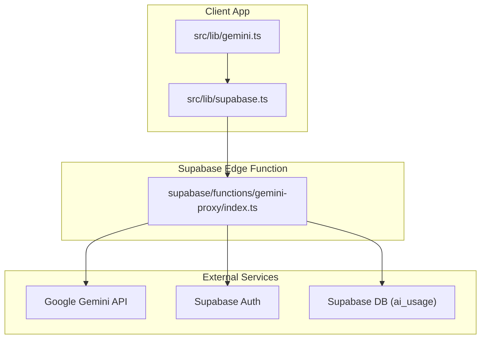
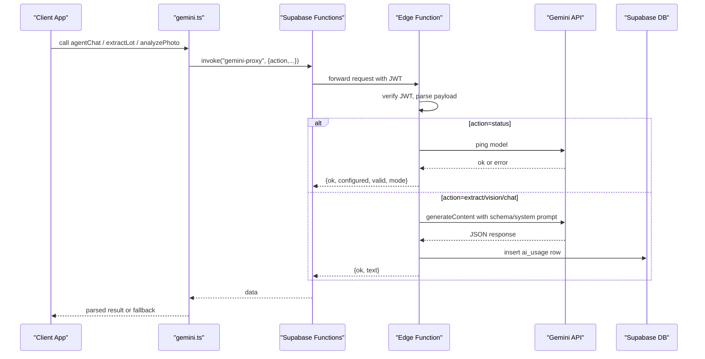
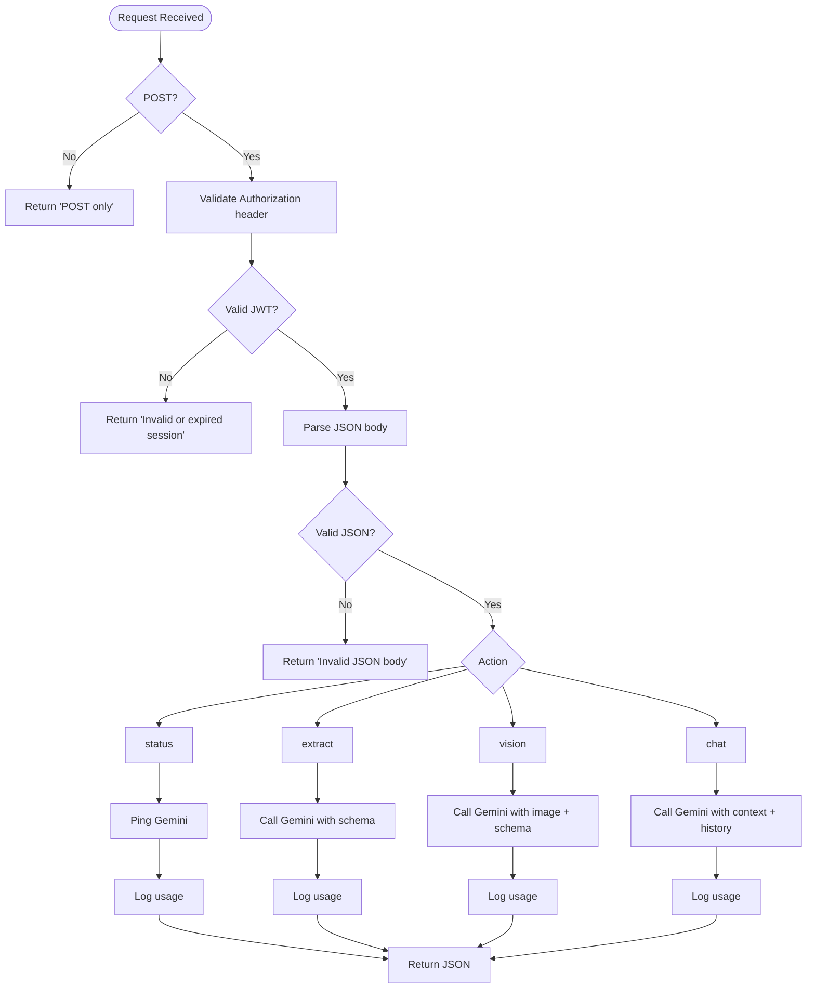
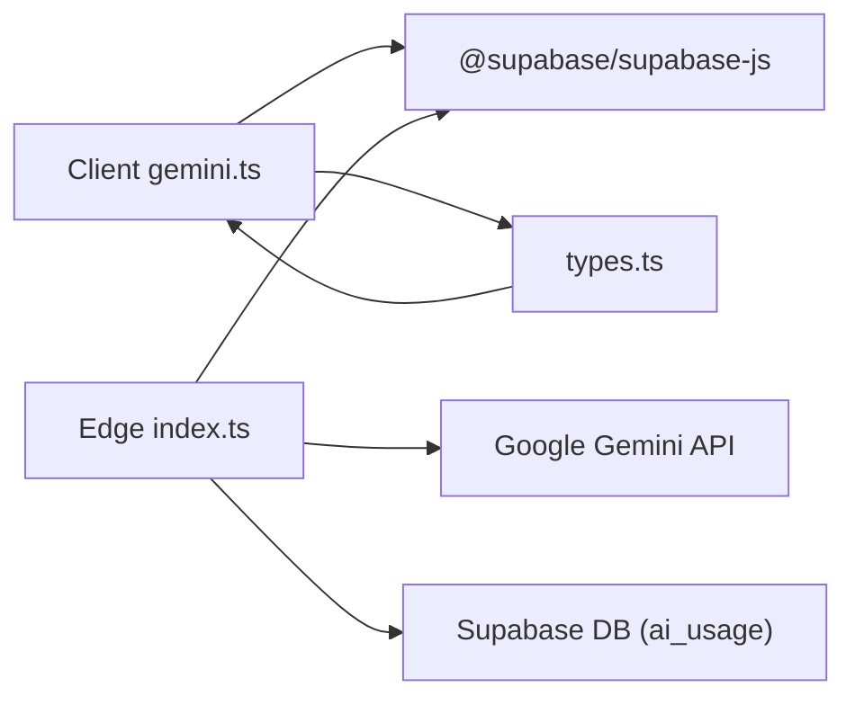

# Supabase Edge Function Proxy

<cite>
**Referenced Files in This Document**
- [index.ts](file://freshroute/supabase/functions/gemini-proxy/index.ts)
- [gemini.ts](file://freshroute/src/lib/gemini.ts)
- [supabase.ts](file://freshroute/src/lib/supabase.ts)
- [types.ts](file://freshroute/src/types.ts)
- [market.ts](file://freshroute/src/data/market.ts)
- [package.json](file://freshroute/package.json)
</cite>

## Table of Contents
1. [Introduction](#introduction)
2. [Project Structure](#project-structure)
3. [Core Components](#core-components)
4. [Architecture Overview](#architecture-overview)
5. [Detailed Component Analysis](#detailed-component-analysis)
6. [Dependency Analysis](#dependency-analysis)
7. [Performance Considerations](#performance-considerations)
8. [Troubleshooting Guide](#troubleshooting-guide)
9. [Conclusion](#conclusion)
10. [Appendices](#appendices)

## Introduction
This document explains the Supabase Edge Function proxy that securely integrates Google Gemini for text extraction, image analysis, and chat conversations. The proxy is the only place where the Gemini API key exists at runtime. It validates requests, enforces authentication via Supabase JWTs, routes actions to Gemini, formats responses, and logs usage metrics. The client-side library calls the proxy through Supabase Functions, keeping secrets out of the browser bundle.

## Project Structure
The implementation spans two layers:
- Server layer (Supabase Edge Function): authenticates callers, validates payloads, calls Gemini with a server-only API key, and returns structured JSON.
- Client layer (React app): invokes the proxy via Supabase Functions, handles fallbacks when Gemini is unavailable, and surfaces results to UI components.

**Diagram sources**
- [index.ts:1-282](file://freshroute/supabase/functions/gemini-proxy/index.ts#L1-L282)
- [gemini.ts:1-200](file://freshroute/src/lib/gemini.ts#L1-L200)
- [supabase.ts:1-19](file://freshroute/src/lib/supabase.ts#L1-L19)

**Section sources**
- [index.ts:1-282](file://freshroute/supabase/functions/gemini-proxy/index.ts#L1-L282)
- [gemini.ts:1-200](file://freshroute/src/lib/gemini.ts#L1-L200)
- [supabase.ts:1-19](file://freshroute/src/lib/supabase.ts#L1-L19)

## Core Components
- Edge Function handler: single POST endpoint that validates auth, parses action, routes to Gemini, and logs usage.
- Client library: functions to check status, extract lots from text, analyze images, and run chat conversations with fallbacks.
- Data models: shared types for vision results, messages, scenarios, and other domain objects used by the app.

Key responsibilities:
- Security: keep Gemini API key in environment variables; validate Supabase JWT; sanitize inputs.
- Routing: dispatch based on action values: status, extract, vision, chat.
- Response formatting: enforce JSON schemas for structured outputs.
- Observability: log per-request usage and latency to a database table.

**Section sources**
- [index.ts:10-101](file://freshroute/supabase/functions/gemini-proxy/index.ts#L10-L101)
- [gemini.ts:28-42](file://freshroute/src/lib/gemini.ts#L28-L42)
- [types.ts:25-45](file://freshroute/src/types.ts#L25-L45)

## Architecture Overview
The proxy centralizes all Gemini calls behind authenticated Supabase Edge Functions. The client never sees the API key. Each request is validated, routed, and logged. Errors are normalized into a consistent JSON shape.

**Diagram sources**
- [index.ts:61-101](file://freshroute/supabase/functions/gemini-proxy/index.ts#L61-L101)
- [index.ts:103-281](file://freshroute/supabase/functions/gemini-proxy/index.ts#L103-L281)
- [gemini.ts:28-42](file://freshroute/src/lib/gemini.ts#L28-L42)
- [gemini.ts:91-182](file://freshroute/src/lib/gemini.ts#L91-L182)

## Detailed Component Analysis

### Edge Function Handler
Responsibilities:
- Enforce HTTPS-only POST and CORS preflight handling.
- Validate Authorization header and verify caller identity using Supabase Auth.
- Parse and validate JSON body; normalize language preference.
- Route to one of four actions: status, extract, vision, chat.
- Call Gemini with system instructions and JSON response schemas.
- Log usage and latency to the ai_usage table using a service role client.

Security measures:
- API key loaded from environment variable; never exposed to clients.
- JWT verification via Supabase client before any business logic.
- Input sanitization: truncating long strings, limiting history length, validating image size.

Error handling:
- Normalized JSON errors with ok=false and human-readable messages.
- Specific mapping for common Gemini errors (invalid key, model not available, rate limit).

Rate limiting:
- No built-in rate limiter in this function; relies on Gemini’s own limits and application-level retries/backoff.

Logging:
- Every request writes an ai_usage row including user_id, action, model, status, optional error, and latency_ms.

**Diagram sources**
- [index.ts:61-101](file://freshroute/supabase/functions/gemini-proxy/index.ts#L61-L101)
- [index.ts:103-281](file://freshroute/supabase/functions/gemini-proxy/index.ts#L103-L281)

**Section sources**
- [index.ts:10-101](file://freshroute/supabase/functions/gemini-proxy/index.ts#L10-L101)
- [index.ts:103-281](file://freshroute/supabase/functions/gemini-proxy/index.ts#L103-L281)

### Client Library (gemini.ts)
Responsibilities:
- Invoke the proxy via Supabase Functions with appropriate payloads.
- Handle fallbacks when Gemini is unavailable or returns malformed data.
- Normalize responses into typed structures consumed by the UI.

Actions:
- checkAiStatus: determines if the proxy is reachable and whether the server key is configured and valid.
- extractLot: sends text to the proxy; falls back to deterministic offline extraction if needed.
- analyzePhoto: sends base64 image to the proxy; falls back to a demo result if needed.
- agentChat: sends conversation history and context; falls back to canned responses if needed.

Caching strategy:
- No in-memory caching in this module; each call goes to the proxy.

Error propagation:
- Last AI error is stored and can be consumed once by the UI to surface meaningful feedback.

**Section sources**
- [gemini.ts:28-42](file://freshroute/src/lib/gemini.ts#L28-L42)
- [gemini.ts:91-116](file://freshroute/src/lib/gemini.ts#L91-L116)
- [gemini.ts:131-161](file://freshroute/src/lib/gemini.ts#L131-L161)
- [gemini.ts:169-182](file://freshroute/src/lib/gemini.ts#L169-L182)

### Data Models and Market Context
Shared types define the structure of vision results, messages, scenarios, and more. Market data includes crop prices, distances, buyers, transporters, and storage facilities used by the application logic.

**Section sources**
- [types.ts:25-45](file://freshroute/src/types.ts#L25-L45)
- [types.ts:187-199](file://freshroute/src/types.ts#L187-L199)
- [market.ts:13-24](file://freshroute/src/data/market.ts#L13-L24)
- [market.ts:73-134](file://freshroute/src/data/market.ts#L73-L134)

## Dependency Analysis
- The client depends on Supabase JS SDK to call Edge Functions and manage sessions.
- The Edge Function depends on Supabase JS SDK for auth verification and admin writes, and fetches directly from Gemini.
- Shared types ensure consistency between client and server expectations.

**Diagram sources**
- [gemini.ts:1-4](file://freshroute/src/lib/gemini.ts#L1-L4)
- [index.ts:8-11](file://freshroute/supabase/functions/gemini-proxy/index.ts#L8-L11)
- [package.json:12-22](file://freshroute/package.json#L12-L22)

**Section sources**
- [package.json:12-22](file://freshroute/package.json#L12-L22)
- [gemini.ts:1-4](file://freshroute/src/lib/gemini.ts#L1-L4)
- [index.ts:8-11](file://freshroute/supabase/functions/gemini-proxy/index.ts#L8-L11)

## Performance Considerations
- Request size limits: text input truncated to a safe length; image payloads limited to ~7 MB to avoid large network transfers.
- History trimming: chat history is sliced to the last 10 messages to control token usage and latency.
- Schema enforcement: Gemini response schemas reduce parsing overhead and improve reliability.
- Latency tracking: every request logs latency_ms for monitoring and alerting.
- Fallbacks: client-side fallbacks prevent UI stalls when Gemini is down.

Recommendations for production:
- Add application-level retry with exponential backoff for transient errors.
- Implement rate limiting at the proxy or API gateway to protect against bursts.
- Cache frequent read-only results (e.g., market summaries) at the edge or CDN.
- Monitor Gemini quota and set alerts for 429 responses.

[No sources needed since this section provides general guidance]

## Troubleshooting Guide
Common issues and resolutions:
- Missing or invalid Authorization header: ensure the client attaches a valid Supabase JWT.
- Invalid or expired session: re-authenticate the user to refresh the token.
- Invalid JSON body: validate payload shape before calling the proxy.
- Model not available or invalid API key: check server secrets and project configuration.
- Rate limit reached: wait and retry; consider adding backoff and queueing.
- Malformed Gemini response: client falls back to deterministic or demo results; inspect logs for details.

Observability:
- Inspect ai_usage rows for failed requests, errors, and latency outliers.
- Use the last AI error consumer to display actionable messages to users.

**Section sources**
- [index.ts:61-101](file://freshroute/supabase/functions/gemini-proxy/index.ts#L61-L101)
- [index.ts:103-281](file://freshroute/supabase/functions/gemini-proxy/index.ts#L103-L281)
- [gemini.ts:18-24](file://freshroute/src/lib/gemini.ts#L18-L24)

## Conclusion
The Supabase Edge Function proxy centralizes Gemini integration with strong security, clear routing, and robust logging. By keeping the API key server-side, validating JWTs, enforcing schemas, and providing fallbacks, it delivers a resilient experience for text extraction, image analysis, and chat. For production, add rate limiting, retries, and enhanced monitoring to ensure stability under load.

[No sources needed since this section summarizes without analyzing specific files]

## Appendices

### Action Reference and Payloads

- status
  - Purpose: Verify server configuration and connectivity to Gemini.
  - Request: { action: "status" }
  - Response: { ok: true, configured: boolean, valid: boolean, mode: "live" | "error" | "demo", model?: string, error?: string }

- extract
  - Purpose: Extract structured lot information from farmer messages.
  - Request: { action: "extract", text: string, lang?: "en" | "ur" }
  - Response: { ok: true, text: string } where text is JSON matching the defined schema (crop, quantityKg, location, readyText, confidence).

- vision
  - Purpose: Analyze produce photos to estimate quality grade and defect rate.
  - Request: { action: "vision", imageBase64: string, mimeType?: string, cropHint?: string, lang?: "en" | "ur" }
  - Response: { ok: true, text: string } where text is JSON matching the defined schema (grade, ripeness, defectRate, notes, confidence).

- chat
  - Purpose: Free-form assistant conversation with context and history.
  - Request: { action: "chat", history: Array<{role:"user"|"agent", text:string}>, ctx?: {lotSummary?, scenariosSummary?, pricesSummary?}, lang?: "en" | "ur" }
  - Response: { ok: true, text: string }

Authentication:
- All requests must include a valid Supabase JWT in the Authorization header as a Bearer token.

Configuration options:
- Language: pass lang="ur" to respond in Urdu; otherwise defaults to English.
- Image constraints: base64 image must be under ~7 MB; default MIME type is image/jpeg.

Environment variables (server-side):
- GEMINI_API_KEY: Required for live mode.
- SUPABASE_URL: Supabase project URL.
- SUPABASE_ANON_KEY: Used to verify caller JWT.
- SUPABASE_SERVICE_ROLE_KEY: Used to write ai_usage logs bypassing RLS.

**Section sources**
- [index.ts:103-281](file://freshroute/supabase/functions/gemini-proxy/index.ts#L103-L281)
- [gemini.ts:36-42](file://freshroute/src/lib/gemini.ts#L36-L42)
- [gemini.ts:91-116](file://freshroute/src/lib/gemini.ts#L91-L116)
- [gemini.ts:131-161](file://freshroute/src/lib/gemini.ts#L131-L161)
- [gemini.ts:169-182](file://freshroute/src/lib/gemini.ts#L169-L182)

### Monitoring and Logging
- Usage table: ai_usage stores user_id, action, model, status, error, and latency_ms for every request.
- Error capture: last AI error is surfaced once to the UI via a consumer function.
- Metrics to track:
  - Success vs error rates per action.
  - P95/P99 latency.
  - Rate limit events (429) and retry counts.
  - Fallback usage frequency.

**Section sources**
- [index.ts:87-101](file://freshroute/supabase/functions/gemini-proxy/index.ts#L87-L101)
- [gemini.ts:18-24](file://freshroute/src/lib/gemini.ts#L18-L24)

### Security Best Practices
- Never expose GEMINI_API_KEY to the client.
- Always require a valid Supabase JWT for proxy access.
- Sanitize inputs: truncate long texts, limit image sizes, and restrict history length.
- Use least privilege: service role key only for writing audit logs.

**Section sources**
- [index.ts:10-11](file://freshroute/supabase/functions/gemini-proxy/index.ts#L10-L11)
- [index.ts:61-75](file://freshroute/supabase/functions/gemini-proxy/index.ts#L61-L75)
- [index.ts:142-145](file://freshroute/supabase/functions/gemini-proxy/index.ts#L142-L145)
- [index.ts:191-196](file://freshroute/supabase/functions/gemini-proxy/index.ts#L191-L196)