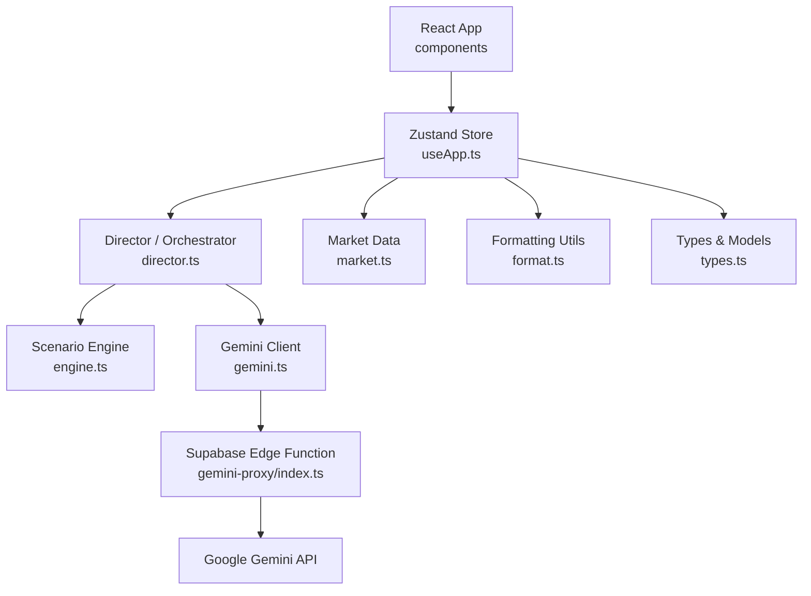
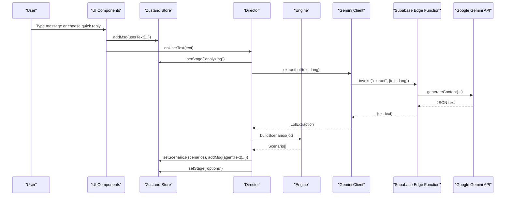
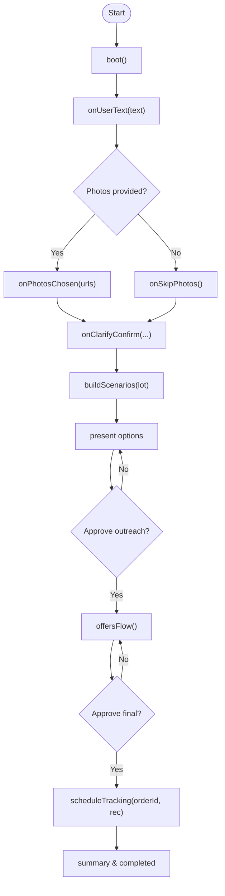
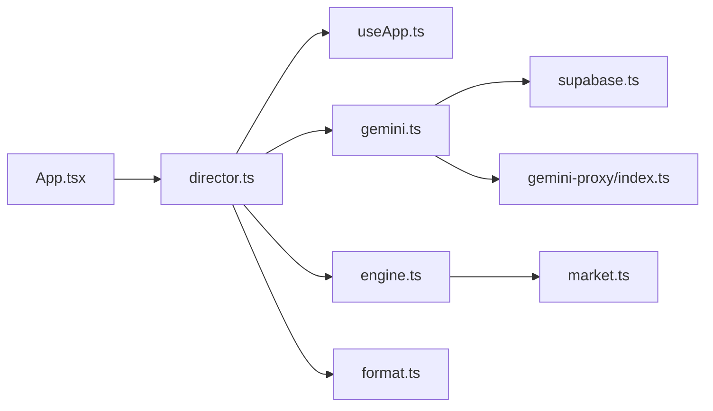

# API Reference

<cite>
**Referenced Files in This Document**
- [types.ts](file://freshroute/src/types.ts)
- [useApp.ts](file://freshroute/src/store/useApp.ts)
- [director.ts](file://freshroute/src/store/director.ts)
- [gemini.ts](file://freshroute/src/lib/gemini.ts)
- [engine.ts](file://freshroute/src/lib/engine.ts)
- [format.ts](file://freshroute/src/lib/format.ts)
- [market.ts](file://freshroute/src/data/market.ts)
- [supabase.ts](file://freshroute/src/lib/supabase.ts)
- [index.ts](file://freshroute/supabase/functions/gemini-proxy/index.ts)
- [App.tsx](file://freshroute/src/App.tsx)
</cite>

## Table of Contents
1. [Introduction](#introduction)
2. [Project Structure](#project-structure)
3. [Core Components](#core-components)
4. [Architecture Overview](#architecture-overview)
5. [Detailed Component Analysis](#detailed-component-analysis)
6. [Dependency Analysis](#dependency-analysis)
7. [Performance Considerations](#performance-considerations)
8. [Troubleshooting Guide](#troubleshooting-guide)
9. [Conclusion](#conclusion)
10. [Appendices](#appendices)

## Introduction
This document provides a comprehensive API reference for FreshRoute’s public interfaces and internal APIs. It covers:
- Zustand store API (actions, state, selectors)
- TypeScript models and types used across the app
- Utility functions for formatting, validation, and business calculations
- Gemini integration API with method signatures, error handling patterns, and response formats
- Code examples demonstrating usage and extension patterns

The goal is to help developers understand how data flows through the system, how to interact with the AI-powered agent, and how to extend functionality safely.

## Project Structure
FreshRoute is a React + TypeScript application using Zustand for global state, Supabase Edge Functions as a secure proxy to Google Gemini, and a rule-based scenario engine for market analysis.

**Diagram sources**
- [App.tsx:14-33](file://freshroute/src/App.tsx#L14-L33)
- [useApp.ts:20-54](file://freshroute/src/store/useApp.ts#L20-L54)
- [director.ts:1-23](file://freshroute/src/store/director.ts#L1-L23)
- [engine.ts:1-15](file://freshroute/src/lib/engine.ts#L1-L15)
- [gemini.ts:1-10](file://freshroute/src/lib/gemini.ts#L1-L10)
- [index.ts:1-11](file://freshroute/supabase/functions/gemini-proxy/index.ts#L1-L11)
- [market.ts:1-24](file://freshroute/src/data/market.ts#L1-L24)
- [format.ts:1-21](file://freshroute/src/lib/format.ts#L1-L21)
- [types.ts:1-229](file://freshroute/src/types.ts#L1-L229)

**Section sources**
- [App.tsx:14-33](file://freshroute/src/App.tsx#L14-L33)
- [useApp.ts:20-54](file://freshroute/src/store/useApp.ts#L20-L54)
- [director.ts:1-23](file://freshroute/src/store/director.ts#L1-L23)
- [engine.ts:1-15](file://freshroute/src/lib/engine.ts#L1-L15)
- [gemini.ts:1-10](file://freshroute/src/lib/gemini.ts#L1-L10)
- [index.ts:1-11](file://freshroute/supabase/functions/gemini-proxy/index.ts#L1-L11)
- [market.ts:1-24](file://freshroute/src/data/market.ts#L1-L24)
- [format.ts:1-21](file://freshroute/src/lib/format.ts#L1-L21)
- [types.ts:1-229](file://freshroute/src/types.ts#L1-L229)

## Core Components
- Types and Models: Centralized domain models including Lot, Scenario, Order, Msg, AuditEntry, and related structures.
- Zustand Store: Global state management with actions to update messages, stages, approvals, orders, and more.
- Director: Orchestrates user interactions, AI calls, scenario generation, outreach approvals, transport booking, and tracking.
- Engine: Rule-based scenario builder calculating gross/net values, spoilage, transport costs, and ranking scenarios.
- Gemini Integration: Secure client that calls Supabase Edge Function to access Gemini for extraction, vision, and chat.
- Utilities: Formatting helpers for currency, time, IDs, and unit conversions.

**Section sources**
- [types.ts:1-229](file://freshroute/src/types.ts#L1-L229)
- [useApp.ts:20-118](file://freshroute/src/store/useApp.ts#L20-L118)
- [director.ts:84-750](file://freshroute/src/store/director.ts#L84-L750)
- [engine.ts:10-258](file://freshroute/src/lib/engine.ts#L10-L258)
- [gemini.ts:10-200](file://freshroute/src/lib/gemini.ts#L10-L200)
- [format.ts:1-21](file://freshroute/src/lib/format.ts#L1-L21)

## Architecture Overview
The application follows a layered architecture:
- UI layer renders chat, quick replies, photos, settings, and audit views.
- State layer (Zustand) holds session state, messages, lot details, scenarios, and audit logs.
- Director coordinates flows: intake → photo analysis → scenario generation → outreach approval → offers → order creation → tracking → completion.
- Engine computes scenarios based on market prices, distances, spoilage, transport options, and buyer constraints.
- Gemini client proxies all AI requests via Supabase Edge Function to protect API keys and enforce auth.

**Diagram sources**
- [director.ts:145-156](file://freshroute/src/store/director.ts#L145-L156)
- [director.ts:110-143](file://freshroute/src/store/director.ts#L110-L143)
- [gemini.ts:91-116](file://freshroute/src/lib/gemini.ts#L91-L116)
- [index.ts:142-188](file://freshroute/supabase/functions/gemini-proxy/index.ts#L142-L188)
- [engine.ts:47-236](file://freshroute/src/lib/engine.ts#L47-L236)
- [useApp.ts:75-85](file://freshroute/src/store/useApp.ts#L75-L85)

## Detailed Component Analysis

### Zustand Store API
The Zustand store exposes state and actions for managing the application lifecycle, messaging, approvals, orders, and AI mode.

State fields:
- stage: Current flow stage (welcome, awaiting-intake, analyzing, options, tracking, completed, etc.)
- msgs: Message history array
- typing: Whether the agent is currently “typing”
- typingLabel: Label shown while typing (e.g., “extracting”, “vision model · grading produce”)
- quickReplies: Quick action suggestions
- lot: Current lot being processed
- scenarios: Generated sale scenarios
- audit: Audit log entries
- lang: Language code ("en" | "ur")
- sheet: Active sheet ("none" | "photos" | "settings")
- drawerAudit: Audit drawer visibility
- ticker: Price ticker data
- booted: Session boot flag
- aiMode: AI mode ("checking" | "live" | "demo" | "error")
- aiError: Error message from AI proxy
- session: Supabase session
- profile: User profile

Actions:
- addMsg(m): Append a message to history
- setStage(s): Update current stage
- setTyping(on, label?): Toggle typing indicator and label
- setQuick(q[]): Set quick replies
- setLot(l): Set current lot
- setScenarios(s[]): Set generated scenarios
- addAudit(actor, action, approved?): Add an audit entry
- setLang(l): Set language
- setSheet(s): Open/close sheets
- setDrawer(b): Toggle audit drawer
- updateApproval(id, status): Approve/reject outreach approval
- updateOrder(fn): Mutate last order message via function
- boot(): Initialize session once
- setAiMode(mode, error?): Set AI mode and optional error
- setAuth(session, profile): Set Supabase session and profile

Selectors:
- Use standard Zustand selectors to subscribe to specific state slices (e.g., s.stage, s.msgs, s.lot).

Usage example paths:
- Adding a user message and setting stage during intake: [onUserText:145-156](file://freshroute/src/store/director.ts#L145-L156)
- Updating approval status: [updateApproval:91-98](file://freshroute/src/store/useApp.ts#L91-L98)
- Mutating last order: [updateOrder:100-109](file://freshroute/src/store/useApp.ts#L100-L109)

**Section sources**
- [useApp.ts:20-118](file://freshroute/src/store/useApp.ts#L20-L118)
- [director.ts:145-156](file://freshroute/src/store/director.ts#L145-L156)

### Director API (Orchestrator)
The director manages end-to-end flows:
- Boot: Start session, greet user, show quick replies, set stage to awaiting-intake
- Intake: Extract lot info from text, check supported crops, prompt for photos
- Photos/Vision: Analyze photos to estimate grade/ripeness/defects; create lot; ask clarifying questions
- Clarify: Confirm packaging/storage/departure preferences; run scenario engine; present options
- Outreach Approval: Draft message to buyer/commission agent; await user approval
- Offers: Compute transport options, platform fees, mandi commission, storage costs; present expected net
- Final Approval: Book transport; create order; schedule tracking updates
- Tracking: Simulate pickup, transit delays, auction/delivery completion; emit alerts and summary
- Chat: Free-form conversation with context injection (lot, scenarios, prices)
- Quick Replies: Handle predefined actions (prices, numbers, why buyer, truck status, feedback, new lot)

Key exported methods:
- boot()
- onUserText(text)
- onVoiceNote()
- onPhotosChosen(urls)
- onSkipPhotos()
- onClarifyConfirm(packaging, storageAvailable, departEarly)
- proceedFromOptions()
- proceedWith(scenarioId)
- onApproveOutreach(approvalId, ok)
- onApproveFinal(transporterId)
- showPrices()
- showNumbers()
- whyBuyer()
- truckStatus()
- feedbackGreat()
- newLot()
- onQuickReply(id)
- geminiLive(): boolean
- refreshAiMode()

Flow diagram:

**Diagram sources**
- [director.ts:84-106](file://freshroute/src/store/director.ts#L84-L106)
- [director.ts:110-143](file://freshroute/src/store/director.ts#L110-L143)
- [director.ts:175-217](file://freshroute/src/store/director.ts#L175-L217)
- [director.ts:258-290](file://freshroute/src/store/director.ts#L258-L290)
- [director.ts:294-374](file://freshroute/src/store/director.ts#L294-L374)
- [director.ts:376-438](file://freshroute/src/store/director.ts#L376-L438)
- [director.ts:440-597](file://freshroute/src/store/director.ts#L440-L597)

**Section sources**
- [director.ts:84-750](file://freshroute/src/store/director.ts#L84-L750)

### Gemini Integration API
All Gemini calls go through a Supabase Edge Function to keep the API key server-side and enforce authentication.

Client methods:
- checkAiStatus(): Returns AiStatus { mode, model?, error? }
- extractLot(text, lang): Returns LotExtraction { crop, quantityKg, location, readyText, confidence, source }
- analyzePhoto(imageDataUrl, cropHint, lang): Returns VisionResult { grade, ripeness, defectRate, notes, confidence, source }
- agentChat(history, ctx, lang): Returns string response

Edge Function endpoints (POST to Supabase Functions):
- action: "status" — checks if Gemini key is configured and valid
- action: "extract" — extracts structured lot from farmer message
- action: "vision" — analyzes image to estimate quality grade and defects
- action: "chat" — free-form assistant conversation with injected context

Error handling pattern:
- The proxy returns { ok: false, error } for failures; client sets lastAiError and falls back to deterministic demo responses when needed.
- Errors are surfaced to users via agent messages and audit entries.

Response format:
- Success: { ok: true, text: string }
- Failure: { ok: false, error: string }

Usage example paths:
- Status check and mode update: [checkAiStatus:36-42](file://freshroute/src/lib/gemini.ts#L36-L42), [refreshAiMode:744-749](file://freshroute/src/store/director.ts#L744-L749)
- Extraction with fallback: [extractLot:91-116](file://freshroute/src/lib/gemini.ts#L91-L116)
- Vision with fallback: [analyzePhoto:131-161](file://freshroute/src/lib/gemini.ts#L131-L161)
- Chat with context: [agentChat:169-182](file://freshroute/src/lib/gemini.ts#L169-L182)

**Section sources**
- [gemini.ts:10-200](file://freshroute/src/lib/gemini.ts#L10-L200)
- [index.ts:103-281](file://freshroute/supabase/functions/gemini-proxy/index.ts#L103-L281)
- [director.ts:62-74](file://freshroute/src/store/director.ts#L62-L74)

### Engine API (Business Calculations)
The engine builds scenarios based on market prices, distances, spoilage, transport costs, and buyer constraints.

Exports:
- MANDI_COMMISSION_RATE: 0.06
- PLATFORM_FEE_RATE: 0.015
- LOADING_COST: 800
- LOCAL_CARTAGE: 1200
- COLD_STORAGE_PER_KG_DAY: 3.5
- gradePriceFactor(grade): Adjusts price by grade (A=1, B≈0.875, C=0.75)
- buildScenarios(lot): Returns Scenario[] with gross, acceptedKg, deductions, net, spoilagePct, risk, paymentTerms, why, recommended, score
- transportOptions(lot, destCity): Returns TransportOption[] with cost, pickup, eta, recommended, note

Algorithm highlights:
- Local mandi scenario: applies mandi commission and local cartage; estimates spoilage based on exposure and packaging.
- Direct buyer scenarios: filters buyers by city, grade, quantity range; calculates transport cost, platform fee, loading; estimates rejection and spoilage.
- Cold storage scenario: adds storage cost; reduces spoilage but does not guarantee higher price.
- Premium buyer scenario: requires refrigerated transport; accounts for stricter inspection and potential rejection.
- Ranking: weighted score considering net value, acceptance rate, and risk penalty; marks top scenario as recommended.

Usage example paths:
- Build scenarios after clarification: [onClarifyConfirm:258-290](file://freshroute/src/store/director.ts#L258-L290)
- Calculate transport options for offers: [offersFlow:376-438](file://freshroute/src/store/director.ts#L376-L438)

**Section sources**
- [engine.ts:10-258](file://freshroute/src/lib/engine.ts#L10-L258)
- [director.ts:258-290](file://freshroute/src/store/director.ts#L258-L290)
- [director.ts:376-438](file://freshroute/src/store/director.ts#L376-L438)

### Utility Functions
Formatting and helper utilities:
- pkr(n): Formats number as PKR with locale-aware thousands separators
- pkrShort(n): Shortens large amounts to “lac” notation
- clock(t): Converts timestamp to 12-hour clock string with AM/PM
- uid(): Generates random ID strings
- maund(kg): Converts kilograms to maund

Usage example paths:
- Currency formatting in messages and summaries: [pkr:1-7](file://freshroute/src/lib/format.ts#L1-L7)
- Unit conversion in intake and summaries: [maund:20-21](file://freshroute/src/lib/format.ts#L20-L21)

**Section sources**
- [format.ts:1-21](file://freshroute/src/lib/format.ts#L1-L21)

### TypeScript Interfaces and Types
Core models:
- Role: "agent" | "user" | "system"
- Profile: id, fullName, email, phone, city, address, role, customerCode, createdAt
- Packaging: "crates" | "sacks" | "loose"
- Grade: "A" | "B" | "C"
- LotConfidence: crop, quantity, location, overall
- VisionResult: grade, ripeness, defectRate, notes, confidence, source
- Lot: crop, quantityKg, location, readyDate, packaging, storageAvailable, departEarly, photos, vision, confidence
- Buyer: id, name, city, category, grade, premiumPct, acceptanceRate, rejectionPct, paymentTerms, minKg, maxKg, verified, responseTime
- Transporter: id, name, vehicle, refrigerated, costPerKm, onTimePct
- StorageFacility: id, name, city, tempC, perKgPerDay, verified
- PricePoint: city, pricePerKg, trend, freshnessMin, confidence
- Deduction: label, amount
- Scenario: id, title, market, destCity, buyerName, gross, acceptedKg, deductions, net, spoilagePct, risk, paymentTerms, why, recommended, score
- ApprovalAction: label, detail
- ApprovalRequest: id, title, subtitle, actions, messageDraft, recipient, status, decidedAt
- TransportOption: transporter, cost, pickup, eta, recommended, note
- OfferSet: buyerName, buyerLine, acceptedPricePerKg, acceptedKg, transport, expectedNet, netNote, buyerAcceptance, buyerResponse
- TrackStep: label, time, state, detail
- Order: id, buyerName, transporterName, vehicle, destination, quantityKg, pricePerKg, gross, net, steps
- AlertInfo: kind, title, body
- SummaryInfo: title, gross, net, upliftVsLocal, upliftNote, acceptedPct, lines
- Msg: discriminated union covering user/agent messages (text, voice, photos, lot, clarify, scenarios, approval, offers, order, alert, summary)
- AuditEntry: id, time, actor, action, approved
- Stage: workflow stages (welcome, awaiting-intake, awaiting-photos, awaiting-clarify, analyzing, options, outreach-approval, outreach, offers, final-approval, tracking, completed)
- QuickReply: id, label, emoji?, primary?

Usage example paths:
- Message creation helpers: [agentText, userText:122-128](file://freshroute/src/store/useApp.ts#L122-L128)
- Scenario generation and ranking: [buildScenarios:47-236](file://freshroute/src/lib/engine.ts#L47-L236)
- Vision result usage: [analyzePhoto:131-161](file://freshroute/src/lib/gemini.ts#L131-L161)

**Section sources**
- [types.ts:1-229](file://freshroute/src/types.ts#L1-L229)
- [useApp.ts:122-128](file://freshroute/src/store/useApp.ts#L122-L128)
- [engine.ts:47-236](file://freshroute/src/lib/engine.ts#L47-L236)
- [gemini.ts:131-161](file://freshroute/src/lib/gemini.ts#L131-L161)

## Dependency Analysis
Component relationships and coupling:
- App initializes the director boot sequence on mount.
- Director depends on useApp for state mutations, gemini for AI calls, engine for scenario building, and format for utilities.
- Engine depends on market data (prices, distances, volatility, buyers, transporters).
- Gemini client depends on supabase client to call Edge Function.
- Edge Function depends on environment secrets and Supabase admin client for usage logging.

**Diagram sources**
- [App.tsx:14-33](file://freshroute/src/App.tsx#L14-L33)
- [director.ts:1-23](file://freshroute/src/store/director.ts#L1-L23)
- [gemini.ts:1-10](file://freshroute/src/lib/gemini.ts#L1-L10)
- [engine.ts:1-15](file://freshroute/src/lib/engine.ts#L1-L15)
- [format.ts:1-21](file://freshroute/src/lib/format.ts#L1-L21)
- [supabase.ts:1-20](file://freshroute/src/lib/supabase.ts#L1-L20)
- [index.ts:1-11](file://freshroute/supabase/functions/gemini-proxy/index.ts#L1-L11)
- [market.ts:1-24](file://freshroute/src/data/market.ts#L1-L24)

**Section sources**
- [App.tsx:14-33](file://freshroute/src/App.tsx#L14-L33)
- [director.ts:1-23](file://freshroute/src/store/director.ts#L1-L23)
- [gemini.ts:1-10](file://freshroute/src/lib/gemini.ts#L1-L10)
- [engine.ts:1-15](file://freshroute/src/lib/engine.ts#L1-L15)
- [format.ts:1-21](file://freshroute/src/lib/format.ts#L1-L21)
- [supabase.ts:1-20](file://freshroute/src/lib/supabase.ts#L1-L20)
- [index.ts:1-11](file://freshroute/supabase/functions/gemini-proxy/index.ts#L1-L11)
- [market.ts:1-24](file://freshroute/src/data/market.ts#L1-L24)

## Performance Considerations
- Avoid unnecessary re-renders by selecting only required state slices in components.
- Batch state updates where possible (e.g., multiple msg additions within a single tick).
- Limit message history length passed to Gemini chat to reduce payload size and latency.
- Use fallback modes gracefully to maintain responsiveness when AI services are unavailable.
- Optimize image handling: convert URLs to data URLs efficiently and validate sizes before sending to vision endpoint.

[No sources needed since this section provides general guidance]

## Troubleshooting Guide
Common issues and resolutions:
- AI proxy unreachable: Check network connectivity and Supabase project configuration; verify VITE_SUPABASE_URL and VITE_SUPABASE_ANON_KEY.
- Invalid or expired session: Ensure Supabase auth token is present; Edge Function validates JWT.
- Gemini key rejected: Verify GEMINI_API_KEY is set in Supabase secrets; check edge function logs for errors.
- Malformed AI response: Client falls back to deterministic demo responses; inspect lastAiError and surface to user.
- Large images: Vision endpoint enforces size limits; compress or resize images before calling analyzePhoto.

Diagnostic utilities:
- consumeAiError(): Retrieve and clear the last AI error for display.
- refreshAiMode(): Re-check AI status and update mode badge.
- surfaceAiError(): Display AI failure message and audit entry during director flows.

**Section sources**
- [gemini.ts:18-24](file://freshroute/src/lib/gemini.ts#L18-L24)
- [gemini.ts:36-42](file://freshroute/src/lib/gemini.ts#L36-L42)
- [director.ts:62-74](file://freshroute/src/store/director.ts#L62-L74)
- [index.ts:25-59](file://freshroute/supabase/functions/gemini-proxy/index.ts#L25-L59)

## Conclusion
FreshRoute’s API surface centers around a robust Zustand store, a director orchestrating multi-step workflows, a rule-based scenario engine, and a secure Gemini integration via Supabase Edge Functions. Developers can extend functionality by adding new quick replies, integrating additional market data, or enhancing the AI prompts and fallback logic while maintaining clear separation of concerns and safe error handling.

[No sources needed since this section summarizes without analyzing specific files]

## Appendices

### Example Usage Patterns

- Starting a new lot:
  - Call boot() on app mount to initialize session and greet user.
  - Handle user input via onUserText(text) to begin intake.
  - Paths: [boot:84-106](file://freshroute/src/store/director.ts#L84-L106), [onUserText:145-156](file://freshroute/src/store/director.ts#L145-L156)

- Processing photos and generating scenarios:
  - Use onPhotosChosen(urls) to analyze images and create lot.
  - Confirm details with onClarifyConfirm(packaging, storageAvailable, departEarly).
  - Present scenarios and allow selection via proceedWith(scenarioId).
  - Paths: [onPhotosChosen:175-217](file://freshroute/src/store/director.ts#L175-L217), [onClarifyConfirm:258-290](file://freshroute/src/store/director.ts#L258-L290), [proceedWith:299-343](file://freshroute/src/store/director.ts#L299-L343)

- Managing approvals and orders:
  - Show outreach approval via updateApproval(id, status).
  - After approval, compute offers and finalize with onApproveFinal(transporterId).
  - Paths: [updateApproval:91-98](file://freshroute/src/store/useApp.ts#L91-L98), [onApproveFinal:440-497](file://freshroute/src/store/director.ts#L440-L497)

- Integrating Gemini:
  - Check status with checkAiStatus() and update mode via setAiMode().
  - Extract lot info with extractLot(text, lang); handle fallbacks.
  - Analyze photos with analyzePhoto(imageDataUrl, cropHint, lang).
  - Chat with agentChat(history, ctx, lang).
  - Paths: [checkAiStatus:36-42](file://freshroute/src/lib/gemini.ts#L36-L42), [extractLot:91-116](file://freshroute/src/lib/gemini.ts#L91-L116), [analyzePhoto:131-161](file://freshroute/src/lib/gemini.ts#L131-L161), [agentChat:169-182](file://freshroute/src/lib/gemini.ts#L169-L182)

- Formatting and utilities:
  - Format currency with pkr(n) and short form with pkrShort(n).
  - Convert units with maund(kg).
  - Generate IDs with uid() and timestamps with now().
  - Paths: [format.ts:1-21](file://freshroute/src/lib/format.ts#L1-L21), [now:120-120](file://freshroute/src/store/useApp.ts#L120-L120)

**Section sources**
- [director.ts:84-106](file://freshroute/src/store/director.ts#L84-L106)
- [director.ts:145-156](file://freshroute/src/store/director.ts#L145-L156)
- [director.ts:175-217](file://freshroute/src/store/director.ts#L175-L217)
- [director.ts:258-290](file://freshroute/src/store/director.ts#L258-L290)
- [director.ts:299-343](file://freshroute/src/store/director.ts#L299-L343)
- [director.ts:440-497](file://freshroute/src/store/director.ts#L440-L497)
- [useApp.ts:91-98](file://freshroute/src/store/useApp.ts#L91-L98)
- [gemini.ts:36-42](file://freshroute/src/lib/gemini.ts#L36-L42)
- [gemini.ts:91-116](file://freshroute/src/lib/gemini.ts#L91-L116)
- [gemini.ts:131-161](file://freshroute/src/lib/gemini.ts#L131-L161)
- [gemini.ts:169-182](file://freshroute/src/lib/gemini.ts#L169-L182)
- [format.ts:1-21](file://freshroute/src/lib/format.ts#L1-L21)
- [useApp.ts:120-120](file://freshroute/src/store/useApp.ts#L120-L120)