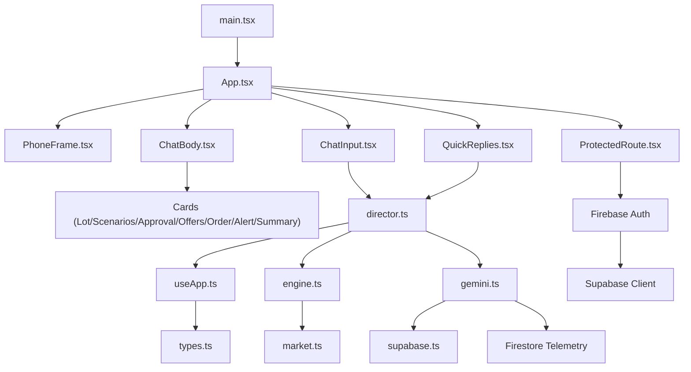
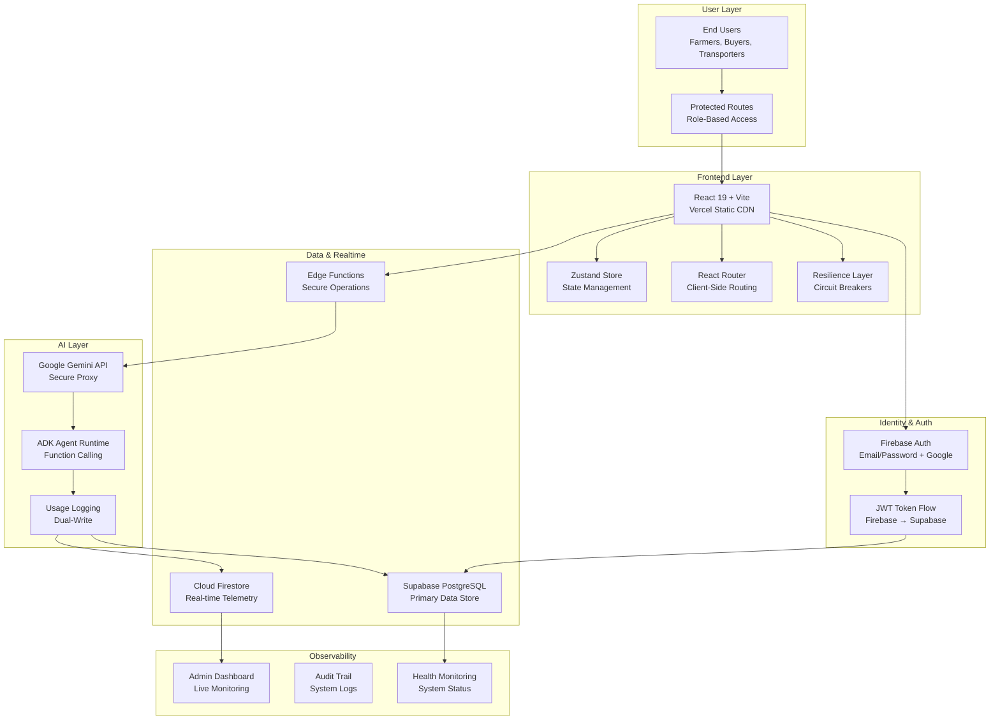
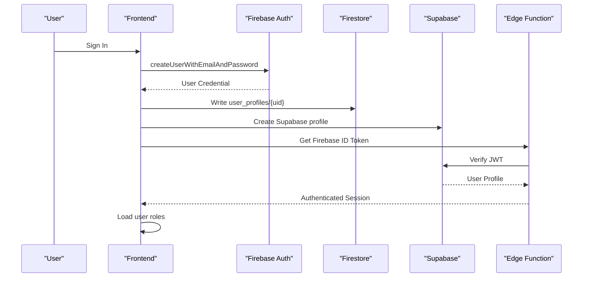
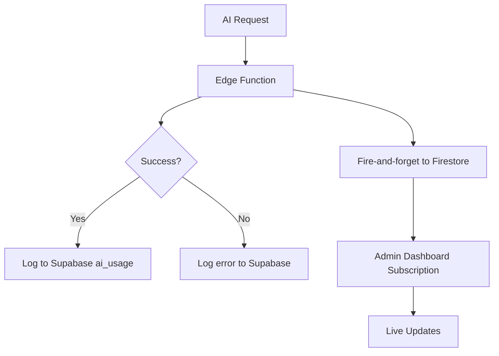
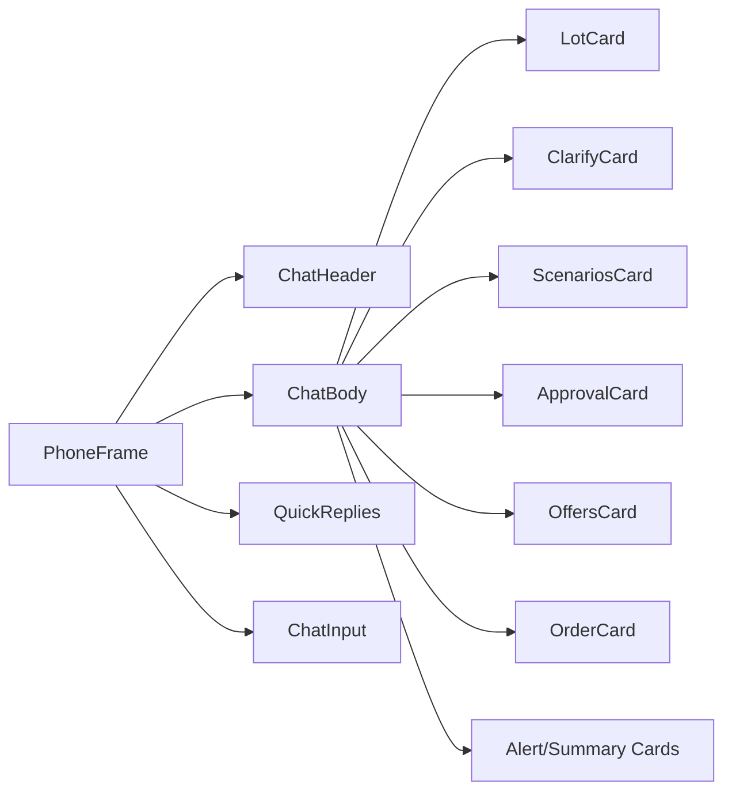
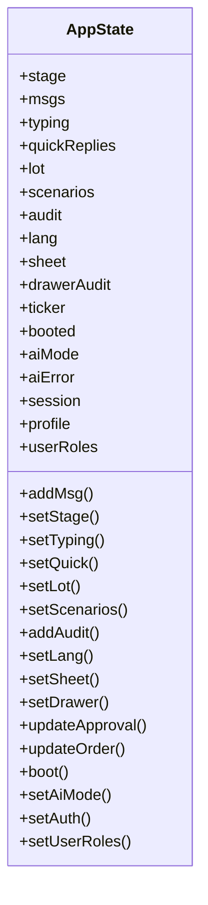
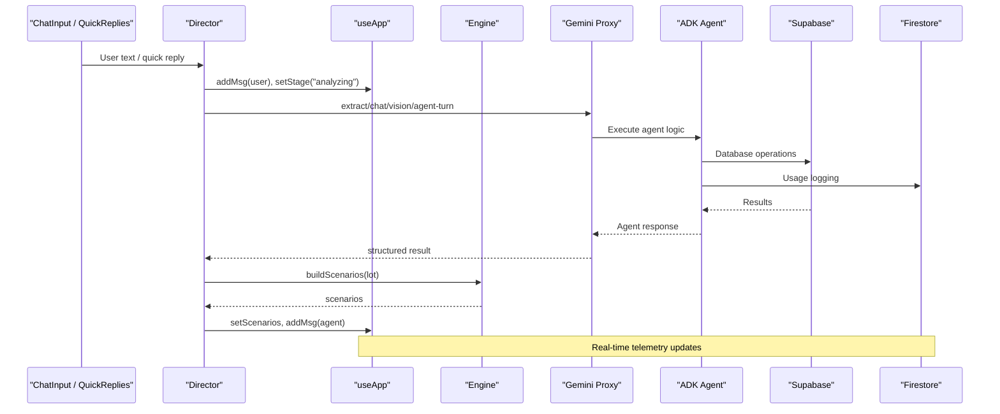
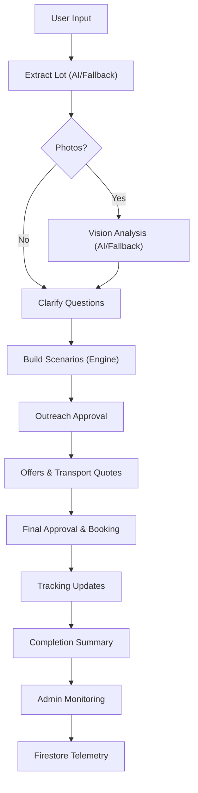
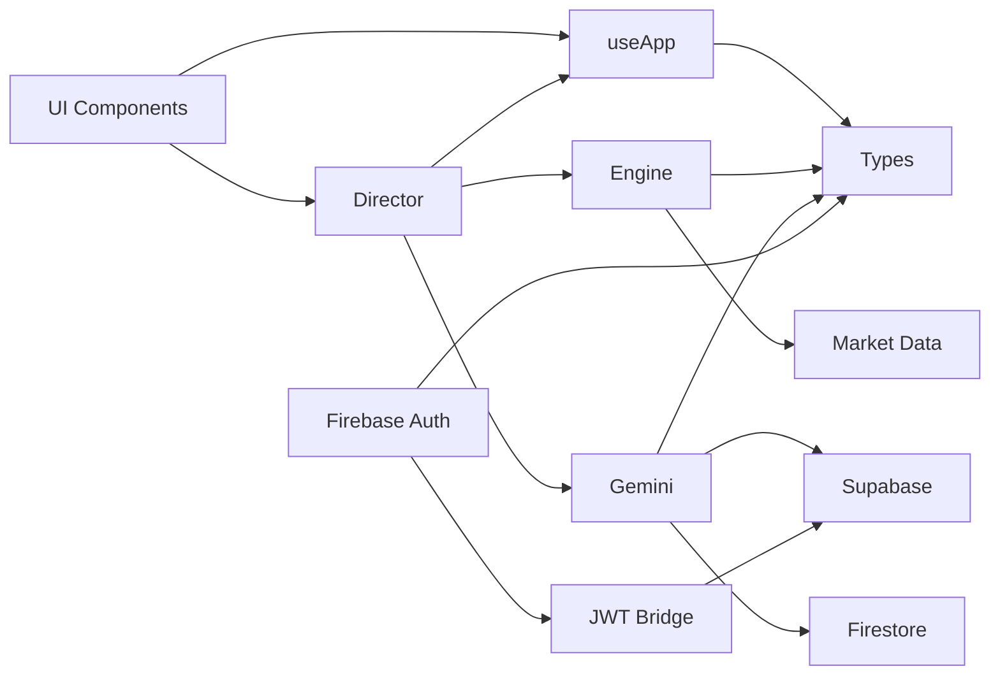

# Architecture Overview

<cite>
**Referenced Files in This Document**
- [main.tsx](file://freshroute/src/main.tsx)
- [App.tsx](file://freshroute/src/App.tsx)
- [PhoneFrame.tsx](file://freshroute/src/components/PhoneFrame.tsx)
- [ChatBody.tsx](file://freshroute/src/components/ChatBody.tsx)
- [ChatInput.tsx](file://freshroute/src/components/ChatInput.tsx)
- [QuickReplies.tsx](file://freshroute/src/components/QuickReplies.tsx)
- [useApp.ts](file://freshroute/src/store/useApp.ts)
- [director.ts](file://freshroute/src/store/director.ts)
- [engine.ts](file://freshroute/src/lib/engine.ts)
- [gemini.ts](file://freshroute/src/lib/gemini.ts)
- [supabase.ts](file://freshroute/src/lib/supabase.ts)
- [firebaseAuth.ts](file://freshroute/src/lib/firebaseAuth.ts)
- [firestore.ts](file://freshroute/src/lib/firestore.ts)
- [ProtectedRoute.tsx](file://freshroute/src/components/auth/ProtectedRoute.tsx)
- [auth.ts](file://freshroute/src/lib/auth.ts)
- [market.ts](file://freshroute/src/data/market.ts)
- [types.ts](file://freshroute/src/types.ts)
- [package.json](file://freshroute/package.json)
- [architecture-diagram.html](file://freshroute/architecture-diagram.html)
</cite>

## Update Summary
**Changes Made**
- Enhanced with comprehensive interactive architecture diagram showing browser frontend, Supabase services, Gemini AI proxy, and Firebase authentication relationships
- Updated authentication flow to include dual Firebase Auth and Supabase integration
- Added real-time telemetry system using Firestore for admin dashboard monitoring
- Expanded AI layer documentation with ADK agent runtime and function calling capabilities
- Enhanced observability section with admin analytics and audit trail components

## Table of Contents
1. Introduction
2. Project Structure
3. Core Components
4. Architecture Overview
5. Detailed Component Analysis
6. Dependency Analysis
7. Performance Considerations
8. Troubleshooting Guide
9. Conclusion

## Introduction
FreshRoute is a mobile-first React application that guides farmers from a simple message to a completed sale with AI-assisted lot grading, market analysis, buyer outreach, transport booking, and live tracking. The system implements a sophisticated multi-tier architecture with:

- **User Layer**: Browser-based interface supporting multiple roles (farmer, buyer, transporter, storage provider, admin)
- **Frontend Layer**: Vite + React 19 SPA with Zustand state management and responsive UI
- **Identity & Auth Layer**: Firebase Auth for user identity with Supabase JWT verification
- **Data & Realtime Layer**: Supabase PostgreSQL for persistent data with Cloud Firestore for real-time telemetry
- **AI Layer**: Google Gemini API via secure Edge Function proxy with ADK agent runtime
- **Observability Layer**: Admin dashboard with live monitoring and audit trails

The app boots into a conversational flow where user input triggers AI extraction, vision analysis, scenario computation, approval workflows, and order tracking with real-time feedback.

## Project Structure
At a high level:
- Entry point renders App inside StrictMode with protected routing
- App composes PhoneFrame with chat UI and conditional sheets/drawers
- Store (Zustand) holds messages, stage, quick replies, lot/scenarios, audit log, auth/session
- Director orchestrates flows: intake → photos/vision → clarify → scenarios → outreach approval → offers → final approval → tracking → summary
- Engine computes scenarios, spoilage, transport costs, and rankings
- Gemini integration goes through a Supabase Edge Function proxy; fallbacks ensure resilience
- Market data provides prices, buyers, distances, transporters, and storage facilities
- Firebase Auth manages user identity while Supabase handles data persistence
- Firestore provides real-time telemetry for admin monitoring

**Diagram sources**
- [main.tsx:1-11](file://freshroute/src/main.tsx#L1-L11)
- [App.tsx:1-37](file://freshroute/src/App.tsx#L1-L37)
- [PhoneFrame.tsx:1-56](file://freshroute/src/components/PhoneFrame.tsx#L1-L56)
- [ChatBody.tsx:1-85](file://freshroute/src/components/ChatBody.tsx#L1-L85)
- [ChatInput.tsx:1-87](file://freshroute/src/components/ChatInput.tsx#L1-L87)
- [QuickReplies.tsx:1-30](file://freshroute/src/components/QuickReplies.tsx#L1-L30)
- [director.ts:1-750](file://freshroute/src/store/director.ts#L1-L750)
- [useApp.ts:1-129](file://freshroute/src/store/useApp.ts#L1-L129)
- [engine.ts:1-258](file://freshroute/src/lib/engine.ts#L1-L258)
- [gemini.ts:1-345](file://freshroute/src/lib/gemini.ts#L1-L345)
- [supabase.ts:1-20](file://freshroute/src/lib/supabase.ts#L1-L20)
- [firebaseAuth.ts:1-104](file://freshroute/src/lib/firebaseAuth.ts#L1-L104)
- [firestore.ts:1-91](file://freshroute/src/lib/firestore.ts#L1-L91)
- [ProtectedRoute.tsx:1-78](file://freshroute/src/components/auth/ProtectedRoute.tsx#L1-L78)
- [market.ts:1-189](file://freshroute/src/data/market.ts#L1-L189)
- [types.ts:1-229](file://freshroute/src/types.ts#L1-L229)

**Section sources**
- [main.tsx:1-11](file://freshroute/src/main.tsx#L1-L11)
- [App.tsx:1-37](file://freshroute/src/App.tsx#L1-L37)
- [package.json:1-38](file://freshroute/package.json#L1-L38)

## Core Components
- **PhoneFrame**: Mobile-first container with responsive framing and desktop sidebar context
- **ChatBody**: Renders message bubbles and domain-specific cards based on message kind
- **ChatInput**: Text entry, voice note simulation, and photo attachment trigger
- **QuickReplies**: Contextual suggestion chips driven by director state
- **Store (useApp)**: Centralized state for messages, stage, typing indicators, quick replies, lot/scenarios, audit log, language, sheets, auth session
- **Director**: Orchestrates the end-to-end flow, integrates AI, engine, and updates store
- **Engine**: Generates scenarios, calculates spoilage, transport costs, and ranks options
- **Gemini Integration**: Proxy calls to Supabase Edge Function with robust fallbacks
- **Market Data**: Prices, buyers, distances, transporters, storage facilities
- **Firebase Auth**: User identity management with email/password and Google sign-in
- **Firestore Telemetry**: Real-time AI usage logging for admin monitoring
- **ProtectedRoute**: Authentication guard with role-based access control

**Section sources**
- [PhoneFrame.tsx:1-56](file://freshroute/src/components/PhoneFrame.tsx#L1-L56)
- [ChatBody.tsx:1-85](file://freshroute/src/components/ChatBody.tsx#L1-L85)
- [ChatInput.tsx:1-87](file://freshroute/src/components/ChatInput.tsx#L1-L87)
- [QuickReplies.tsx:1-30](file://freshroute/src/components/QuickReplies.tsx#L1-L30)
- [useApp.ts:1-129](file://freshroute/src/store/useApp.ts#L1-L129)
- [director.ts:1-750](file://freshroute/src/store/director.ts#L1-L750)
- [engine.ts:1-258](file://freshroute/src/lib/engine.ts#L1-L258)
- [gemini.ts:1-345](file://freshroute/src/lib/gemini.ts#L1-L345)
- [market.ts:1-189](file://freshroute/src/data/market.ts#L1-L189)
- [firebaseAuth.ts:1-104](file://freshroute/src/lib/firebaseAuth.ts#L1-L104)
- [firestore.ts:1-91](file://freshroute/src/lib/firestore.ts#L1-L91)
- [ProtectedRoute.tsx:1-78](file://freshroute/src/components/auth/ProtectedRoute.tsx#L1-L78)

## Architecture Overview
The system follows a comprehensive six-tier architecture with clear separation of concerns:

### Tier 1: User Layer
- End users including Pakistani farmers, buyers, transporters, and storage providers
- Multi-role support with different permissions and interfaces
- Bilingual interface supporting English and Urdu (Noto Nastaliq font)
- PWA-capable with lazy-loaded routes via React.lazy()

### Tier 2: Frontend Layer
- Vite + React 19 + TypeScript SPA hosted on Vercel Static CDN
- Zustand 5 state management with centralized store
- React Router DOM 7 for client-side routing with protected routes
- Resilience layer with circuit breakers and rate limiting
- Tailwind CSS with custom design tokens and dark mode support

### Tier 3: Identity & Authentication Layer
- Firebase Auth for user identity management (email/password, Google OAuth)
- JWT token flow bridging Firebase Auth to Supabase
- ProtectedRoute component with role-based access control
- Multi-role authentication supporting farmer, buyer, transporter, storage_provider, admin

### Tier 4: Data & Realtime Layer
- Supabase PostgreSQL as primary data store with 8 migration files
- Cloud Firestore for real-time telemetry and admin dashboard updates
- Edge Functions for secure server-side operations
- Real-time subscriptions for live updates

### Tier 5: AI Layer
- Google Gemini API accessed exclusively through secure Edge Function proxy
- ADK Agent Runtime with 12+ FunctionTools for automated workflows
- Dual-write logging to both Supabase and Firestore for comprehensive monitoring
- Session management for multi-turn conversations

### Tier 6: Observability Layer
- Admin Settings Page with live AI usage monitoring
- Admin Analytics dashboard with Recharts visualizations
- Audit Trail system with client-side and server-side logging
- Health monitoring and system status reporting

**Diagram sources**
- [architecture-diagram.html:247-466](file://freshroute/architecture-diagram.html#L247-L466)
- [ProtectedRoute.tsx:1-78](file://freshroute/src/components/auth/ProtectedRoute.tsx#L1-L78)
- [firebaseAuth.ts:1-104](file://freshroute/src/lib/firebaseAuth.ts#L1-L104)
- [firestore.ts:1-91](file://freshroute/src/lib/firestore.ts#L1-L91)
- [gemini.ts:1-345](file://freshroute/src/lib/gemini.ts#L1-L345)
- [supabase.ts:1-20](file://freshroute/src/lib/supabase.ts#L1-L20)

## Detailed Component Analysis

### Enhanced Authentication Flow
The system implements a dual-authentication approach combining Firebase Auth for identity management with Supabase for data persistence:

1. **User Registration/Login**: Firebase Auth handles email/password and Google sign-in
2. **Profile Synchronization**: On successful authentication, user profiles are written to both Firestore and Supabase
3. **JWT Bridge**: Firebase ID tokens are used to authenticate with Supabase services
4. **Role Management**: Multi-role access control with user_roles table for permissions
5. **Protected Routes**: Route guards verify authentication and role-based access

**Diagram sources**
- [auth.ts:1-331](file://freshroute/src/lib/auth.ts#L1-L331)
- [firebaseAuth.ts:1-104](file://freshroute/src/lib/firebaseAuth.ts#L1-L104)
- [ProtectedRoute.tsx:1-78](file://freshroute/src/components/auth/ProtectedRoute.tsx#L1-L78)

### Real-Time Telemetry System
The system implements comprehensive monitoring through dual-write logging:

- **Supabase ai_usage table**: Durable source of truth for AI usage metrics
- **Firestore ai_usage collection**: Real-time channel for live admin dashboard updates
- **Non-blocking writes**: Firestore writes don't block main application flow
- **Live subscriptions**: Admin dashboard uses onSnapshot for real-time updates

**Diagram sources**
- [firestore.ts:1-91](file://freshroute/src/lib/firestore.ts#L1-L91)
- [gemini.ts:71-98](file://freshroute/src/lib/gemini.ts#L71-L98)

### ADK Agent Runtime with Function Calling
The AI layer has evolved to include a sophisticated agent runtime with automated workflows:

- **12+ FunctionTools**: Automated tasks like buyer search, transport quotes, storage bookings
- **Approval Gates**: Critical write operations require explicit user consent
- **Session Management**: Multi-turn conversations with state persistence
- **Domain Guardrails**: Prevent off-topic requests and ensure safety

**Section sources**
- [gemini-proxy/index.ts:283-378](file://freshroute/supabase/functions/gemini-proxy/index.ts#L283-L378)
- [gemini-proxy/index.ts:386-571](file://freshroute/supabase/functions/gemini-proxy/index.ts#L386-L571)

### UI Component Hierarchy and Responsibilities
- **PhoneFrame**: Wraps the app with a mobile viewport and contextual info on larger screens
- **ChatBody**: Maps message kinds to specialized card components:
  - LotCard for lot details and vision results
  - ClarifyCard for packaging/storage/departure questions
  - ScenariosCard for ranked market options
  - ApprovalCard for outbound messaging approvals
  - OffersCard for accepted offers and transport quotes
  - OrderCard for order confirmation and tracking steps
  - AlertSummaryCards for alerts and completion summaries
- **ChatInput**: Handles text, voice note simulation, and photo sheet trigger
- **QuickReplies**: Displays actionable suggestions controlled by director

**Diagram sources**
- [App.tsx:1-37](file://freshroute/src/App.tsx#L1-L37)
- [PhoneFrame.tsx:1-56](file://freshroute/src/components/PhoneFrame.tsx#L1-L56)
- [ChatBody.tsx:1-85](file://freshroute/src/components/ChatBody.tsx#L1-L85)
- [ChatInput.tsx:1-87](file://freshroute/src/components/ChatInput.tsx#L1-L87)
- [QuickReplies.tsx:1-30](file://freshroute/src/components/QuickReplies.tsx#L1-L30)

**Section sources**
- [App.tsx:1-37](file://freshroute/src/App.tsx#L1-L37)
- [PhoneFrame.tsx:1-56](file://freshroute/src/components/PhoneFrame.tsx#L1-L56)
- [ChatBody.tsx:1-85](file://freshroute/src/components/ChatBody.tsx#L1-L85)
- [ChatInput.tsx:1-87](file://freshroute/src/components/ChatInput.tsx#L1-L87)
- [QuickReplies.tsx:1-30](file://freshroute/src/components/QuickReplies.tsx#L1-L30)

### State Management (Zustand)
- Global state includes stage, messages, typing indicator, quick replies, lot, scenarios, audit log, language, sheet visibility, ticker, boot flag, AI mode, session, profile
- Actions update messages immutably, manage stages, handle approvals and orders, and provide utility functions for creating agent/user messages
- Ticker prices are derived from market data
- Enhanced with user roles and multi-role support

**Diagram sources**
- [useApp.ts:1-129](file://freshroute/src/store/useApp.ts#L1-L129)
- [types.ts:1-229](file://freshroute/src/types.ts#L1-L229)

**Section sources**
- [useApp.ts:1-129](file://freshroute/src/store/useApp.ts#L1-L129)
- [types.ts:1-229](file://freshroute/src/types.ts#L1-L229)

### Business Logic Engine
- Computes scenarios for local mandi sale, direct buyer sales, cold storage then sell, and premium buyer opportunities
- Applies spoilage model based on crop volatility, packaging, ripeness, refrigeration
- Calculates transport costs, platform fees, mandi commissions, loading costs, and net earnings
- Ranks scenarios using a weighted score incorporating net revenue, acceptance rate, and risk penalties
- Provides transport options with ETA and recommendations

**Diagram sources**
- [engine.ts:1-258](file://freshroute/src/lib/engine.ts#L1-L258)
- [market.ts:1-189](file://freshroute/src/data/market.ts#L1-L189)

**Section sources**
- [engine.ts:1-258](file://freshroute/src/lib/engine.ts#L1-L258)
- [market.ts:1-189](file://freshroute/src/data/market.ts#L1-L189)

### Enhanced AI Integration and Real-Time Communication Strategy
- All AI requests go through a Supabase Edge Function proxy to keep API keys server-side
- Modes: checking, live, demo, error; status checked at runtime
- Fallbacks: deterministic offline extraction and chat responses if proxy fails or returns malformed data
- Vision analysis uses base64 image payloads with MIME type detection; fallbacks ensure continuity
- Real-time-like UX: typing indicators, staged delays, and progressive updates simulate responsiveness while awaiting AI/engine results
- ADK Agent Runtime with function calling for automated workflows
- Session management for multi-turn conversations
- Approval gates for critical write operations

**Diagram sources**
- [director.ts:1-750](file://freshroute/src/store/director.ts#L1-L750)
- [gemini.ts:1-345](file://freshroute/src/lib/gemini.ts#L1-L345)
- [supabase.ts:1-20](file://freshroute/src/lib/supabase.ts#L1-L20)
- [firestore.ts:1-91](file://freshroute/src/lib/firestore.ts#L1-L91)
- [engine.ts:1-258](file://freshroute/src/lib/engine.ts#L1-L258)
- [useApp.ts:1-129](file://freshroute/src/store/useApp.ts#L1-L129)

**Section sources**
- [gemini.ts:1-345](file://freshroute/src/lib/gemini.ts#L1-L345)
- [supabase.ts:1-20](file://freshroute/src/lib/supabase.ts#L1-L20)
- [firestore.ts:1-91](file://freshroute/src/lib/firestore.ts#L1-L91)
- [director.ts:1-750](file://freshroute/src/store/director.ts#L1-L750)

### Data Flow: From User Input to Order Completion
- Intake: User text or voice note triggers extraction of crop, quantity, location, readiness
- Photos/Vision: Optional photos enhance grade estimation; fallbacks used when unavailable
- Clarify: Packaging, storage availability, departure timing refine scenario accuracy
- Scenarios: Engine generates ranked options with net earnings and risk
- Outreach Approval: Draft message to buyer or commission agent requires explicit user approval
- Offers: Accepted offer and transport quotes computed; user selects transporter
- Tracking: Simulated real-time updates with exceptions and notifications
- Summary: Final net, acceptance rate, and payment details presented
- Real-time monitoring: Admin dashboard shows live system status and AI usage

**Diagram sources**
- [director.ts:1-750](file://freshroute/src/store/director.ts#L1-L750)
- [engine.ts:1-258](file://freshroute/src/lib/engine.ts#L1-L258)
- [gemini.ts:1-345](file://freshroute/src/lib/gemini.ts#L1-L345)
- [firestore.ts:1-91](file://freshroute/src/lib/firestore.ts#L1-L91)

**Section sources**
- [director.ts:1-750](file://freshroute/src/store/director.ts#L1-L750)

## Dependency Analysis
- UI depends on store for rendering messages and controls
- Director depends on store, engine, and gemini integration
- Engine depends on market data for prices, buyers, distances, transporters
- Gemini integration depends on Supabase client to call Edge Functions
- Authentication depends on Firebase Auth with Supabase JWT verification
- Telemetry depends on Firestore for real-time admin updates
- Types define shared contracts across layers ensuring consistency

**Diagram sources**
- [App.tsx:1-37](file://freshroute/src/App.tsx#L1-L37)
- [ChatBody.tsx:1-85](file://freshroute/src/components/ChatBody.tsx#L1-L85)
- [ChatInput.tsx:1-87](file://freshroute/src/components/ChatInput.tsx#L1-L87)
- [QuickReplies.tsx:1-30](file://freshroute/src/components/QuickReplies.tsx#L1-L30)
- [useApp.ts:1-129](file://freshroute/src/store/useApp.ts#L1-L129)
- [director.ts:1-750](file://freshroute/src/store/director.ts#L1-L750)
- [engine.ts:1-258](file://freshroute/src/lib/engine.ts#L1-L258)
- [gemini.ts:1-345](file://freshroute/src/lib/gemini.ts#L1-L345)
- [supabase.ts:1-20](file://freshroute/src/lib/supabase.ts#L1-L20)
- [firestore.ts:1-91](file://freshroute/src/lib/firestore.ts#L1-L91)
- [firebaseAuth.ts:1-104](file://freshroute/src/lib/firebaseAuth.ts#L1-L104)
- [market.ts:1-189](file://freshroute/src/data/market.ts#L1-L189)
- [types.ts:1-229](file://freshroute/src/types.ts#L1-L229)

**Section sources**
- [package.json:1-38](file://freshroute/package.json#L1-L38)
- [types.ts:1-229](file://freshroute/src/types.ts#L1-L229)

## Performance Considerations
- Minimize re-renders by selecting only needed state slices in components (e.g., msgs, typing, quickReplies)
- Use memoization for expensive computations like scenario building; consider debouncing inputs during typing
- Prefer streaming or incremental updates for long-running AI calls to improve perceived performance
- Cache market data and transport options locally to avoid redundant calculations
- Limit image payload sizes before sending to AI proxy to reduce network overhead
- Use efficient list rendering strategies for chat history to maintain smooth scrolling
- Implement circuit breakers to prevent cascading failures in AI service calls
- Use non-blocking Firestore writes for telemetry to avoid impacting main application flow
- Leverage Vercel's static edge hosting for fast frontend delivery and caching

## Troubleshooting Guide
- AI proxy unreachable: Check environment variables for Supabase URL and anon key; verify Edge Function configuration
- Malformed AI responses: Inspect returned JSON structures; fallbacks will be used automatically
- Missing images: Ensure base64 conversion succeeds; otherwise fallback vision results apply
- Session/auth issues: Confirm Firebase Auth settings, JWT token refresh behavior, and Supabase auth configuration
- Stage stuck: Verify director transitions and quick reply handlers; reset state via new lot flow
- Firestore connection errors: Check Firebase configuration and network connectivity
- Admin dashboard not updating: Verify Firestore subscription and real-time listeners
- Role-based access issues: Check user_roles table and permission mappings

**Section sources**
- [gemini.ts:1-345](file://freshroute/src/lib/gemini.ts#L1-L345)
- [supabase.ts:1-20](file://freshroute/src/lib/supabase.ts#L1-L20)
- [firestore.ts:1-91](file://freshroute/src/lib/firestore.ts#L1-L91)
- [firebaseAuth.ts:1-104](file://freshroute/src/lib/firebaseAuth.ts#L1-L104)
- [ProtectedRoute.tsx:1-78](file://freshroute/src/components/auth/ProtectedRoute.tsx#L1-L78)
- [director.ts:1-750](file://freshroute/src/store/director.ts#L1-L750)

## Conclusion
FreshRoute's enhanced architecture cleanly separates UI, state, business logic, authentication, external integrations, and observability concerns. The React frontend delivers a mobile-first chat experience with component-based cards and responsive design. Zustand centralizes state and enables predictable updates. The director orchestrates complex workflows, leveraging an engine for transparent, explainable market analysis and a resilient AI layer via Supabase Edge Functions with ADK agent capabilities.

The dual-authentication approach with Firebase Auth and Supabase provides robust identity management while maintaining data integrity. The real-time telemetry system using Firestore enables comprehensive monitoring and admin oversight. The six-tier architecture ensures scalability, maintainability, and a smooth user journey from intake to completed sale with real-time-like feedback, robust fallbacks, and comprehensive observability.

This design supports enterprise-grade requirements including security, performance, monitoring, and extensibility while maintaining developer productivity and user experience excellence.