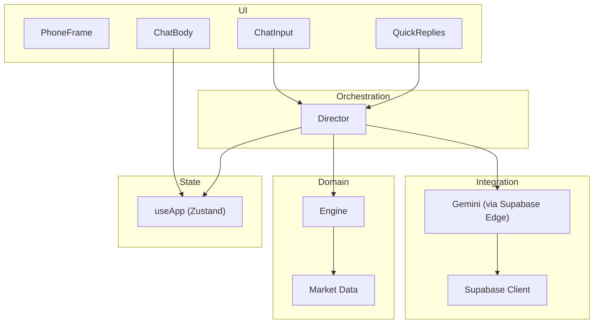
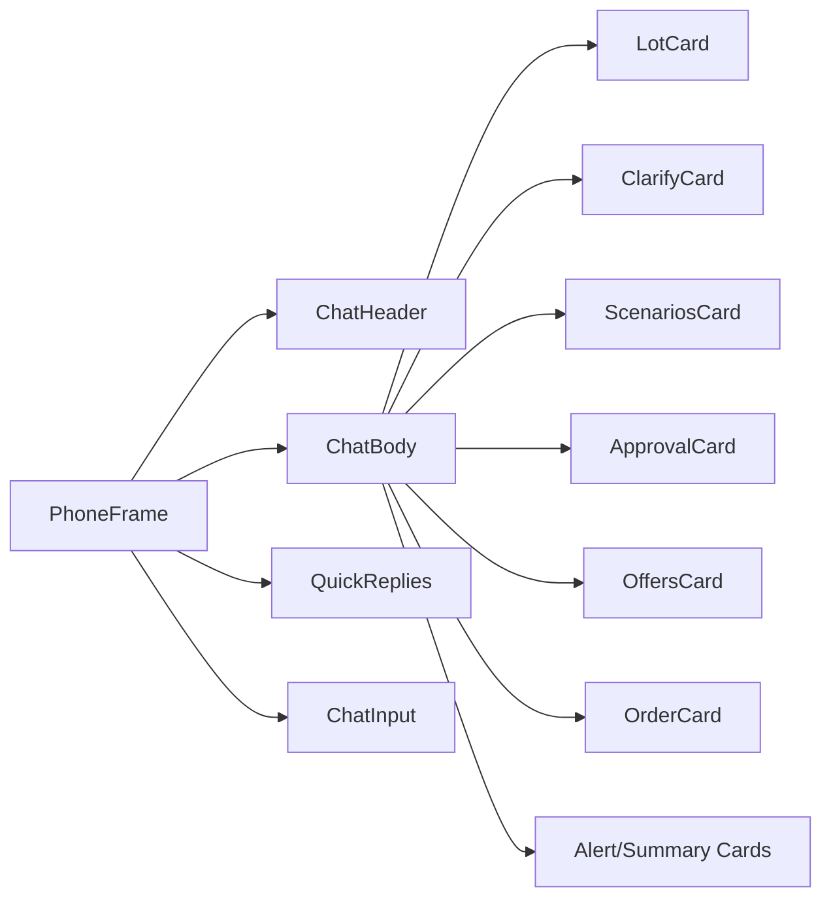
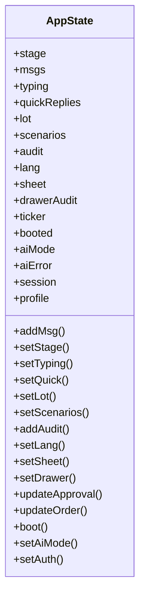
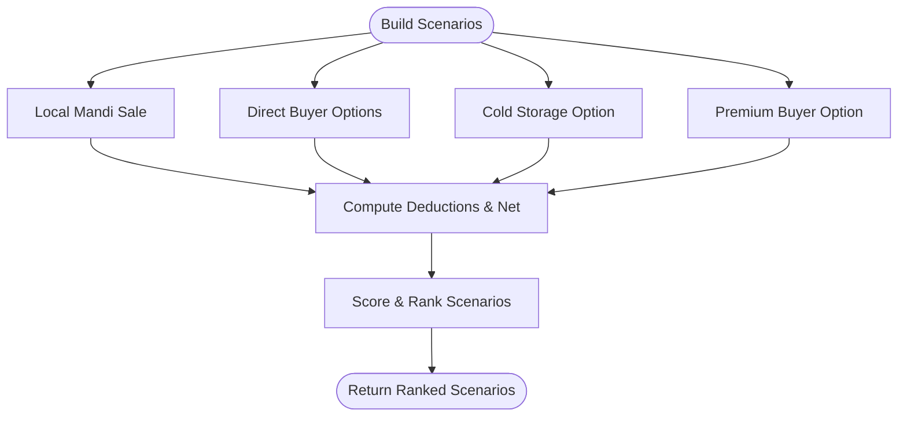
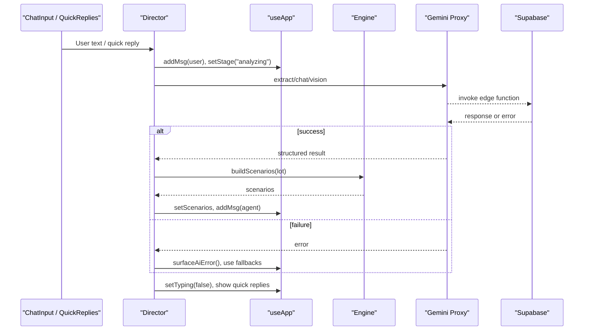
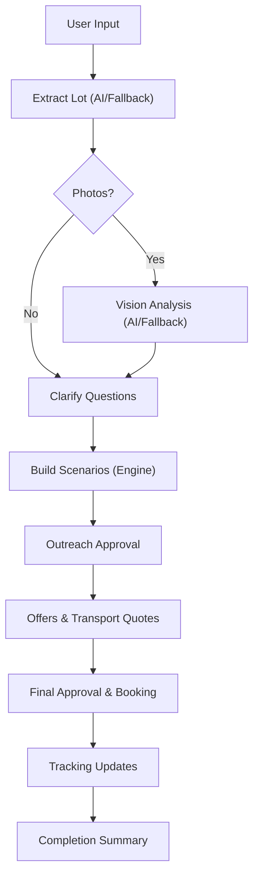
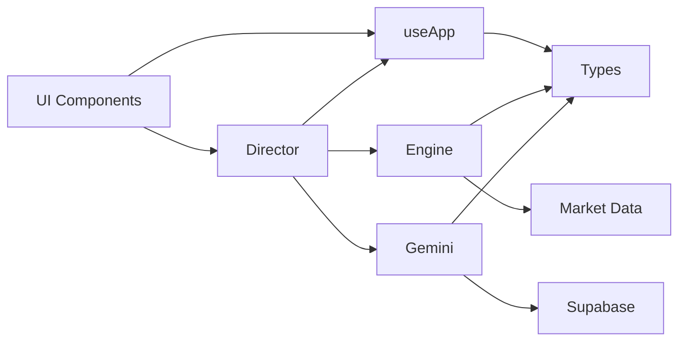

# Architecture Overview

<cite>
**Referenced Files in This Document**
- [main.tsx](file://freshroute/src/main.tsx)
- [App.tsx](file://freshroute/src/App.tsx)
- [PhoneFrame.tsx](file://freshroute/src/components/PhoneFrame.tsx)
- [ChatBody.tsx](file://freshroute/src/components/ChatBody.tsx)
- [ChatInput.tsx](file://freshroute/src/components/ChatInput.tsx)
- [QuickReplies.tsx](file://freshroute/src/components/QuickReplies.tsx)
- [useApp.ts](file://freshroute/src/store/useApp.ts)
- [director.ts](file://freshroute/src/store/director.ts)
- [engine.ts](file://freshroute/src/lib/engine.ts)
- [gemini.ts](file://freshroute/src/lib/gemini.ts)
- [supabase.ts](file://freshroute/src/lib/supabase.ts)
- [market.ts](file://freshroute/src/data/market.ts)
- [types.ts](file://freshroute/src/types.ts)
- [package.json](file://freshroute/package.json)
</cite>

## Table of Contents
1. Introduction
2. Project Structure
3. Core Components
4. Architecture Overview
5. Detailed Component Analysis
6. Dependency Analysis
7. Performance Considerations
8. Troubleshooting Guide
9. Conclusion

## Introduction
FreshRoute is a mobile-first React application that guides farmers from a simple message to a completed sale with AI-assisted lot grading, market analysis, buyer outreach, transport booking, and live tracking. The system separates concerns across:
- UI components (React) for chat, cards, and phone frame layout
- Zustand store for global state and message history
- Business logic engine for scenario generation, pricing, and transport options
- External services via Supabase Edge Functions for Gemini AI and optional backend persistence

The app boots into a conversational flow where user input triggers AI extraction, vision analysis, scenario computation, approval workflows, and order tracking.

## Project Structure
At a high level:
- Entry point renders App inside StrictMode
- App composes PhoneFrame with chat UI and conditional sheets/drawers
- Store (Zustand) holds messages, stage, quick replies, lot/scenarios, audit log, auth/session
- Director orchestrates flows: intake → photos/vision → clarify → scenarios → outreach approval → offers → final approval → tracking → summary
- Engine computes scenarios, spoilage, transport costs, and rankings
- Gemini integration goes through a Supabase Edge Function proxy; fallbacks ensure resilience
- Market data provides prices, buyers, distances, transporters, and storage facilities

```mermaid
graph TB
A["main.tsx"] --> B["App.tsx"]
B --> C["PhoneFrame.tsx"]
B --> D["ChatBody.tsx"]
B --> E["ChatInput.tsx"]
B --> F["QuickReplies.tsx"]
D --> G["Cards (Lot/Scenarios/Approval/Offers/Order/Alert/Summary)"]
E --> H["director.ts"]
F --> H
H --> I["useApp.ts"]
H --> J["engine.ts"]
H --> K["gemini.ts"]
K --> L["supabase.ts"]
J --> M["market.ts"]
I --> N["types.ts"]
```

**Diagram sources**
- [main.tsx:1-11](file://freshroute/src/main.tsx#L1-L11)
- [App.tsx:1-37](file://freshroute/src/App.tsx#L1-L37)
- [PhoneFrame.tsx:1-56](file://freshroute/src/components/PhoneFrame.tsx#L1-L56)
- [ChatBody.tsx:1-85](file://freshroute/src/components/ChatBody.tsx#L1-L85)
- [ChatInput.tsx:1-87](file://freshroute/src/components/ChatInput.tsx#L1-L87)
- [QuickReplies.tsx:1-30](file://freshroute/src/components/QuickReplies.tsx#L1-L30)
- [director.ts:1-750](file://freshroute/src/store/director.ts#L1-L750)
- [useApp.ts:1-129](file://freshroute/src/store/useApp.ts#L1-L129)
- [engine.ts:1-258](file://freshroute/src/lib/engine.ts#L1-L258)
- [gemini.ts:1-200](file://freshroute/src/lib/gemini.ts#L1-L200)
- [supabase.ts:1-20](file://freshroute/src/lib/supabase.ts#L1-L20)
- [market.ts:1-189](file://freshroute/src/data/market.ts#L1-L189)
- [types.ts:1-229](file://freshroute/src/types.ts#L1-L229)

**Section sources**
- [main.tsx:1-11](file://freshroute/src/main.tsx#L1-L11)
- [App.tsx:1-37](file://freshroute/src/App.tsx#L1-L37)
- [package.json:1-38](file://freshroute/package.json#L1-L38)

## Core Components
- PhoneFrame: Mobile-first container with responsive framing and desktop sidebar context
- ChatBody: Renders message bubbles and domain-specific cards based on message kind
- ChatInput: Text entry, voice note simulation, and photo attachment trigger
- QuickReplies: Contextual suggestion chips driven by director state
- Store (useApp): Centralized state for messages, stage, typing indicators, quick replies, lot/scenarios, audit log, language, sheets, auth session
- Director: Orchestrates the end-to-end flow, integrates AI, engine, and updates store
- Engine: Generates scenarios, calculates spoilage, transport costs, and ranks options
- Gemini Integration: Proxy calls to Supabase Edge Function with robust fallbacks
- Market Data: Prices, buyers, distances, transporters, storage facilities

**Section sources**
- [PhoneFrame.tsx:1-56](file://freshroute/src/components/PhoneFrame.tsx#L1-L56)
- [ChatBody.tsx:1-85](file://freshroute/src/components/ChatBody.tsx#L1-L85)
- [ChatInput.tsx:1-87](file://freshroute/src/components/ChatInput.tsx#L1-L87)
- [QuickReplies.tsx:1-30](file://freshroute/src/components/QuickReplies.tsx#L1-L30)
- [useApp.ts:1-129](file://freshroute/src/store/useApp.ts#L1-L129)
- [director.ts:1-750](file://freshroute/src/store/director.ts#L1-L750)
- [engine.ts:1-258](file://freshroute/src/lib/engine.ts#L1-L258)
- [gemini.ts:1-200](file://freshroute/src/lib/gemini.ts#L1-L200)
- [market.ts:1-189](file://freshroute/src/data/market.ts#L1-L189)

## Architecture Overview
The system follows a layered architecture:
- Presentation Layer: React components render chat and cards within a phone frame
- State Layer: Zustand store manages conversation, stage, and business entities
- Orchestration Layer: Director coordinates user actions, AI calls, and engine computations
- Domain Layer: Engine encapsulates pricing, spoilage, transport, and scenario ranking
- Integration Layer: Supabase Edge Functions proxy Gemini AI; optional Supabase client for auth/persistence

**Diagram sources**
- [App.tsx:1-37](file://freshroute/src/App.tsx#L1-L37)
- [PhoneFrame.tsx:1-56](file://freshroute/src/components/PhoneFrame.tsx#L1-L56)
- [ChatBody.tsx:1-85](file://freshroute/src/components/ChatBody.tsx#L1-L85)
- [ChatInput.tsx:1-87](file://freshroute/src/components/ChatInput.tsx#L1-L87)
- [QuickReplies.tsx:1-30](file://freshroute/src/components/QuickReplies.tsx#L1-L30)
- [useApp.ts:1-129](file://freshroute/src/store/useApp.ts#L1-L129)
- [director.ts:1-750](file://freshroute/src/store/director.ts#L1-L750)
- [engine.ts:1-258](file://freshroute/src/lib/engine.ts#L1-L258)
- [gemini.ts:1-200](file://freshroute/src/lib/gemini.ts#L1-L200)
- [supabase.ts:1-20](file://freshroute/src/lib/supabase.ts#L1-L20)
- [market.ts:1-189](file://freshroute/src/data/market.ts#L1-L189)

## Detailed Component Analysis

### UI Component Hierarchy and Responsibilities
- PhoneFrame wraps the app with a mobile viewport and contextual info on larger screens
- ChatBody maps message kinds to specialized card components:
  - LotCard for lot details and vision results
  - ClarifyCard for packaging/storage/departure questions
  - ScenariosCard for ranked market options
  - ApprovalCard for outbound messaging approvals
  - OffersCard for accepted offers and transport quotes
  - OrderCard for order confirmation and tracking steps
  - AlertSummaryCards for alerts and completion summaries
- ChatInput handles text, voice note simulation, and photo sheet trigger
- QuickReplies displays actionable suggestions controlled by director

**Diagram sources**
- [App.tsx:1-37](file://freshroute/src/App.tsx#L1-L37)
- [PhoneFrame.tsx:1-56](file://freshroute/src/components/PhoneFrame.tsx#L1-L56)
- [ChatBody.tsx:1-85](file://freshroute/src/components/ChatBody.tsx#L1-L85)
- [ChatInput.tsx:1-87](file://freshroute/src/components/ChatInput.tsx#L1-L87)
- [QuickReplies.tsx:1-30](file://freshroute/src/components/QuickReplies.tsx#L1-L30)

**Section sources**
- [App.tsx:1-37](file://freshroute/src/App.tsx#L1-L37)
- [PhoneFrame.tsx:1-56](file://freshroute/src/components/PhoneFrame.tsx#L1-L56)
- [ChatBody.tsx:1-85](file://freshroute/src/components/ChatBody.tsx#L1-L85)
- [ChatInput.tsx:1-87](file://freshroute/src/components/ChatInput.tsx#L1-L87)
- [QuickReplies.tsx:1-30](file://freshroute/src/components/QuickReplies.tsx#L1-L30)

### State Management (Zustand)
- Global state includes stage, messages, typing indicator, quick replies, lot, scenarios, audit log, language, sheet visibility, ticker, boot flag, AI mode, session, profile
- Actions update messages immutably, manage stages, handle approvals and orders, and provide utility functions for creating agent/user messages
- Ticker prices are derived from market data

**Diagram sources**
- [useApp.ts:1-129](file://freshroute/src/store/useApp.ts#L1-L129)
- [types.ts:1-229](file://freshroute/src/types.ts#L1-L229)

**Section sources**
- [useApp.ts:1-129](file://freshroute/src/store/useApp.ts#L1-L129)
- [types.ts:1-229](file://freshroute/src/types.ts#L1-L229)

### Business Logic Engine
- Computes scenarios for local mandi sale, direct buyer sales, cold storage then sell, and premium buyer opportunities
- Applies spoilage model based on crop volatility, packaging, ripeness, refrigeration
- Calculates transport costs, platform fees, mandi commissions, loading costs, and net earnings
- Ranks scenarios using a weighted score incorporating net revenue, acceptance rate, and risk penalties
- Provides transport options with ETA and recommendations

**Diagram sources**
- [engine.ts:1-258](file://freshroute/src/lib/engine.ts#L1-L258)
- [market.ts:1-189](file://freshroute/src/data/market.ts#L1-L189)

**Section sources**
- [engine.ts:1-258](file://freshroute/src/lib/engine.ts#L1-L258)
- [market.ts:1-189](file://freshroute/src/data/market.ts#L1-L189)

### AI Integration and Real-Time Communication Strategy
- All AI requests go through a Supabase Edge Function proxy to keep API keys server-side
- Modes: checking, live, demo, error; status checked at runtime
- Fallbacks: deterministic offline extraction and chat responses if proxy fails or returns malformed data
- Vision analysis uses base64 image payloads with MIME type detection; fallbacks ensure continuity
- Real-time-like UX: typing indicators, staged delays, and progressive updates simulate responsiveness while awaiting AI/engine results

**Diagram sources**
- [director.ts:1-750](file://freshroute/src/store/director.ts#L1-L750)
- [gemini.ts:1-200](file://freshroute/src/lib/gemini.ts#L1-L200)
- [supabase.ts:1-20](file://freshroute/src/lib/supabase.ts#L1-L20)
- [engine.ts:1-258](file://freshroute/src/lib/engine.ts#L1-L258)
- [useApp.ts:1-129](file://freshroute/src/store/useApp.ts#L1-L129)

**Section sources**
- [gemini.ts:1-200](file://freshroute/src/lib/gemini.ts#L1-L200)
- [supabase.ts:1-20](file://freshroute/src/lib/supabase.ts#L1-L20)
- [director.ts:1-750](file://freshroute/src/store/director.ts#L1-L750)

### Data Flow: From User Input to Order Completion
- Intake: User text or voice note triggers extraction of crop, quantity, location, readiness
- Photos/Vision: Optional photos enhance grade estimation; fallbacks used when unavailable
- Clarify: Packaging, storage availability, departure timing refine scenario accuracy
- Scenarios: Engine generates ranked options with net earnings and risk
- Outreach Approval: Draft message to buyer or commission agent requires explicit user approval
- Offers: Accepted offer and transport quotes computed; user selects transporter
- Tracking: Simulated real-time updates with exceptions and notifications
- Summary: Final net, acceptance rate, and payment details presented

**Diagram sources**
- [director.ts:1-750](file://freshroute/src/store/director.ts#L1-L750)
- [engine.ts:1-258](file://freshroute/src/lib/engine.ts#L1-L258)
- [gemini.ts:1-200](file://freshroute/src/lib/gemini.ts#L1-L200)

**Section sources**
- [director.ts:1-750](file://freshroute/src/store/director.ts#L1-L750)

## Dependency Analysis
- UI depends on store for rendering messages and controls
- Director depends on store, engine, and gemini integration
- Engine depends on market data for prices, buyers, distances, transporters
- Gemini integration depends on Supabase client to call Edge Functions
- Types define shared contracts across layers ensuring consistency

**Diagram sources**
- [App.tsx:1-37](file://freshroute/src/App.tsx#L1-L37)
- [ChatBody.tsx:1-85](file://freshroute/src/components/ChatBody.tsx#L1-L85)
- [ChatInput.tsx:1-87](file://freshroute/src/components/ChatInput.tsx#L1-L87)
- [QuickReplies.tsx:1-30](file://freshroute/src/components/QuickReplies.tsx#L1-L30)
- [useApp.ts:1-129](file://freshroute/src/store/useApp.ts#L1-L129)
- [director.ts:1-750](file://freshroute/src/store/director.ts#L1-L750)
- [engine.ts:1-258](file://freshroute/src/lib/engine.ts#L1-L258)
- [gemini.ts:1-200](file://freshroute/src/lib/gemini.ts#L1-L200)
- [supabase.ts:1-20](file://freshroute/src/lib/supabase.ts#L1-L20)
- [market.ts:1-189](file://freshroute/src/data/market.ts#L1-L189)
- [types.ts:1-229](file://freshroute/src/types.ts#L1-L229)

**Section sources**
- [package.json:1-38](file://freshroute/package.json#L1-L38)
- [types.ts:1-229](file://freshroute/src/types.ts#L1-L229)

## Performance Considerations
- Minimize re-renders by selecting only needed state slices in components (e.g., msgs, typing, quickReplies)
- Use memoization for expensive computations like scenario building; consider debouncing inputs during typing
- Prefer streaming or incremental updates for long-running AI calls to improve perceived performance
- Cache market data and transport options locally to avoid redundant calculations
- Limit image payload sizes before sending to AI proxy to reduce network overhead
- Use efficient list rendering strategies for chat history to maintain smooth scrolling

[No sources needed since this section provides general guidance]

## Troubleshooting Guide
- AI proxy unreachable: Check environment variables for Supabase URL and anon key; verify Edge Function configuration
- Malformed AI responses: Inspect returned JSON structures; fallbacks will be used automatically
- Missing images: Ensure base64 conversion succeeds; otherwise fallback vision results apply
- Session/auth issues: Confirm Supabase auth settings and token refresh behavior
- Stage stuck: Verify director transitions and quick reply handlers; reset state via new lot flow

**Section sources**
- [gemini.ts:1-200](file://freshroute/src/lib/gemini.ts#L1-L200)
- [supabase.ts:1-20](file://freshroute/src/lib/supabase.ts#L1-L20)
- [director.ts:1-750](file://freshroute/src/store/director.ts#L1-L750)

## Conclusion
FreshRoute’s architecture cleanly separates UI, state, business logic, and external integrations. The React frontend delivers a mobile-first chat experience with component-based cards. Zustand centralizes state and enables predictable updates. The director orchestrates complex workflows, leveraging an engine for transparent, explainable market analysis and a resilient AI layer via Supabase Edge Functions. This design supports scalability, maintainability, and a smooth user journey from intake to completed sale with real-time-like feedback and robust fallbacks.

[No sources needed since this section summarizes without analyzing specific files]