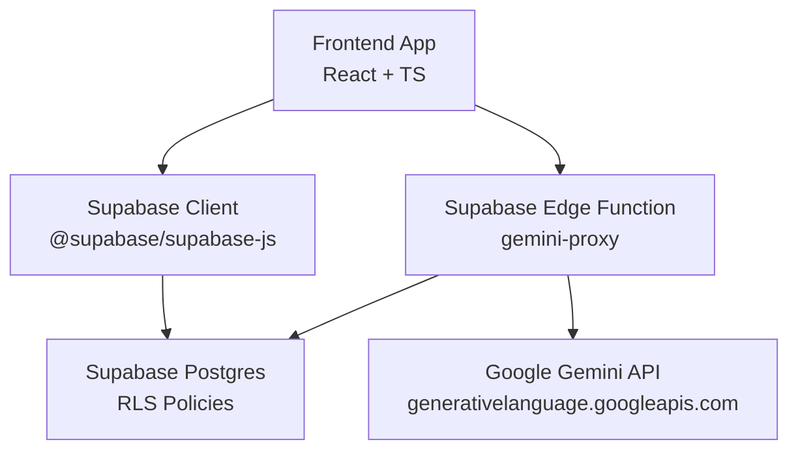
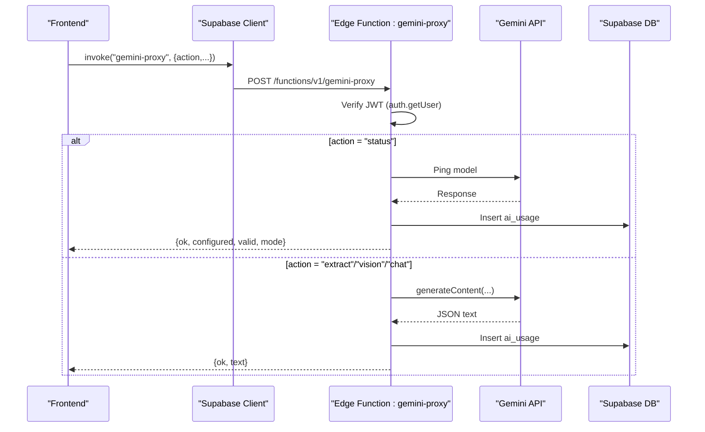

# Backend Integration

<cite>
**Referenced Files in This Document**
- [gemini-proxy/index.ts](file://freshroute/supabase/functions/gemini-proxy/index.ts)
- [gemini.ts](file://freshroute/src/lib/gemini.ts)
- [supabase.ts](file://freshroute/src/lib/supabase.ts)
- [engine.ts](file://freshroute/src/lib/engine.ts)
- [types.ts](file://freshroute/src/types.ts)
- [0001_init.sql](file://freshroute/supabase/migrations/0001_init.sql)
- [0002_seed.sql](file://freshroute/supabase/migrations/0002_seed.sql)
- [package.json](file://freshroute/package.json)
</cite>

## Table of Contents
1. Introduction
2. Project Structure
3. Core Components
4. Architecture Overview
5. Detailed Component Analysis
6. Dependency Analysis
7. Performance Considerations
8. Troubleshooting Guide
9. Conclusion

## Introduction
This document explains FreshRoute’s backend integration architecture with a focus on:
- Supabase Edge Functions as a secure proxy for Google Gemini AI calls
- Google Gemini integration with robust fallback mechanisms
- Authentication and authorization flows using Supabase JWTs
- Data synchronization between the frontend and backend services
- Configuration options, security considerations, and performance optimizations

The system is designed to keep sensitive credentials server-side, enforce authentication at the edge, and provide resilient behavior when external AI services are unavailable or misconfigured.

## Project Structure
At a high level:
- Frontend (React + TypeScript) uses Supabase client libraries to call Edge Functions and persist data via RLS policies.
- Supabase Edge Function gemini-proxy centralizes all Gemini API calls, validates requests, enforces auth, and logs usage.
- Database schema defines users, orders, chat state, image analyses, and audit/usage tables with Row Level Security.

**Diagram sources**
- [gemini-proxy/index.ts:1-282](file://freshroute/supabase/functions/gemini-proxy/index.ts#L1-L282)
- [supabase.ts:1-20](file://freshroute/src/lib/supabase.ts#L1-L20)
- [0001_init.sql:258-276](file://freshroute/supabase/migrations/0001_init.sql#L258-L276)

**Section sources**
- [gemini-proxy/index.ts:1-282](file://freshroute/supabase/functions/gemini-proxy/index.ts#L1-L282)
- [supabase.ts:1-20](file://freshroute/src/lib/supabase.ts#L1-L20)
- [0001_init.sql:258-276](file://freshroute/supabase/migrations/0001_init.sql#L258-L276)

## Core Components
- Supabase Edge Function gemini-proxy: Authenticates callers via JWT, proxies requests to Gemini, handles errors, and logs usage metrics.
- Frontend AI client (gemini.ts): Calls the Edge Function, parses structured JSON responses, and falls back to deterministic logic if needed.
- Supabase client configuration: Initializes the client with environment variables and session management.
- Business engine (engine.ts): Computes scenarios, transport options, spoilage, and scoring based on market data and vision results.
- Database schema: Defines tables for profiles, orders, chat messages/state, image analyses, and ai_usage with RLS policies.

**Section sources**
- [gemini-proxy/index.ts:1-282](file://freshroute/supabase/functions/gemini-proxy/index.ts#L1-L282)
- [gemini.ts:1-200](file://freshroute/src/lib/gemini.ts#L1-L200)
- [supabase.ts:1-20](file://freshroute/src/lib/supabase.ts#L1-L20)
- [engine.ts:1-258](file://freshroute/src/lib/engine.ts#L1-L258)
- [0001_init.sql:258-276](file://freshroute/supabase/migrations/0001_init.sql#L258-L276)

## Architecture Overview
FreshRoute uses a proxy pattern to isolate Gemini API access behind a Supabase Edge Function. The frontend never holds the Gemini API key. All AI calls go through the Edge Function, which:
- Validates the caller’s Supabase JWT
- Enforces allowed actions (extract, vision, chat, status)
- Calls Gemini with appropriate prompts and schemas
- Logs usage and latency to ai_usage
- Returns consistent JSON responses with ok/error semantics

**Diagram sources**
- [gemini-proxy/index.ts:61-127](file://freshroute/supabase/functions/gemini-proxy/index.ts#L61-L127)
- [gemini-proxy/index.ts:142-277](file://freshroute/supabase/functions/gemini-proxy/index.ts#L142-L277)
- [gemini.ts:28-42](file://freshroute/src/lib/gemini.ts#L28-L42)
- [0001_init.sql:258-276](file://freshroute/supabase/migrations/0001_init.sql#L258-L276)

## Detailed Component Analysis

### Supabase Edge Function: gemini-proxy
Responsibilities:
- CORS handling and request validation
- JWT verification using Supabase client with the caller’s Authorization header
- Action routing: status, extract, vision, chat
- Secure Gemini calls with server-only API key from Deno secrets
- Structured error handling returning HTTP 200 with parsed JSON for function.invoke compatibility
- Usage logging to ai_usage table using service role client

Key behaviors:
- Status endpoint checks whether the Gemini key is configured and reachable; returns demo/live/error modes.
- Extract action parses farmer messages into structured lot fields with confidence scores.
- Vision action analyzes base64 images to estimate grade, ripeness, defect rate, and notes.
- Chat action provides contextual assistant responses with history and context summaries.

Error handling strategy:
- Network or API errors return user-friendly messages and log errors.
- Invalid JSON or missing fields return explicit errors.
- Missing or invalid JWT returns an error response.

Security:
- Only authenticated users can call the function; anonymous access is rejected.
- Gemini API key is stored in Deno secrets and never exposed to the browser.
- Service role client used only for writing ai_usage, bypassing RLS intentionally for auditability.

Performance:
- Limits input sizes (e.g., imageBase64 length).
- Truncates message history to reduce payload size.
- Uses minimal generation config to balance speed and quality.

**Section sources**
- [gemini-proxy/index.ts:13-28](file://freshroute/supabase/functions/gemini-proxy/index.ts#L13-L28)
- [gemini-proxy/index.ts:30-59](file://freshroute/supabase/functions/gemini-proxy/index.ts#L30-L59)
- [gemini-proxy/index.ts:61-127](file://freshroute/supabase/functions/gemini-proxy/index.ts#L61-L127)
- [gemini-proxy/index.ts:142-277](file://freshroute/supabase/functions/gemini-proxy/index.ts#L142-L277)

### Frontend AI Client: gemini.ts
Responsibilities:
- Call the Edge Function via supabase.functions.invoke
- Parse structured JSON responses for extraction and vision
- Provide deterministic fallbacks when AI is unavailable or returns malformed data
- Expose status checking to inform UI about live/demo/error modes
- Maintain last AI error for one-time display by the chat director

Fallback mechanisms:
- Lot extraction fallback uses keyword matching and unit conversion rules to produce a plausible lot structure labeled as fallback.
- Vision fallback returns a conservative default result labeled as demo.
- Chat fallback provides rule-based answers for common questions.

Data flow:
- checkAiStatus queries the Edge Function to determine operational mode.
- extractLot attempts AI extraction; on failure, uses fallback and records source.
- analyzePhoto sends image data to the Edge Function; on failure, returns demo result.
- agentChat sends conversation history and context; on failure, returns rule-based answer.

**Section sources**
- [gemini.ts:28-42](file://freshroute/src/lib/gemini.ts#L28-L42)
- [gemini.ts:55-116](file://freshroute/src/lib/gemini.ts#L55-L116)
- [gemini.ts:118-161](file://freshroute/src/lib/gemini.ts#L118-L161)
- [gemini.ts:169-199](file://freshroute/src/lib/gemini.ts#L169-L199)

### Supabase Client Configuration: supabase.ts
Responsibilities:
- Initialize Supabase client with environment variables
- Enable session persistence, auto-refresh, and URL-based session detection
- Expose backendConfigured flag based on presence of project credentials

Configuration options:
- VITE_SUPABASE_URL and VITE_SUPABASE_ANON_KEY must be set for production use.
- Placeholder values allow local development without a real Supabase project.

Security considerations:
- Anon key should have minimal permissions; sensitive operations occur in Edge Functions.
- Session persistence ensures smooth UX across page reloads.

**Section sources**
- [supabase.ts:1-20](file://freshroute/src/lib/supabase.ts#L1-L20)

### Business Engine: engine.ts
Responsibilities:
- Build selling scenarios: local mandi sale, direct wholesale buyers, cold storage then sell, premium buyer
- Compute spoilage percentages based on crop volatility, packaging, ripeness, refrigeration
- Calculate deductions: transport, platform fees, loading costs, storage costs
- Score and rank scenarios using net revenue, acceptance rates, and risk penalties
- Generate transport options with cost, ETA, and recommendations

Algorithm highlights:
- Spoilage model adjusts daily exposure by crop volatility, packaging factor, ripeness, and refrigeration.
- Scenario scoring balances net value, buyer acceptance, and risk penalties.
- Transport options consider distance, vehicle type, and refrigeration needs.

Performance:
- Purely deterministic computations with no network calls; suitable for frequent re-renders.

**Section sources**
- [engine.ts:17-45](file://freshroute/src/lib/engine.ts#L17-L45)
- [engine.ts:47-235](file://freshroute/src/lib/engine.ts#L47-L235)
- [engine.ts:238-257](file://freshroute/src/lib/engine.ts#L238-L257)

### Database Schema and RLS: 0001_init.sql
Key tables:
- profiles: user identity and roles
- orders: transaction records with steps and status
- reviews: feedback per order
- notifications: user alerts
- audit_log: action tracking
- chat_messages and chat_state: persistent conversation and state
- image_analyses: persisted vision results with source tagging
- ai_usage: Edge Function usage metrics written by service role

Row Level Security:
- Most tables restrict access to the current user or admins
- ai_usage allows admin read and user-scoped write/read
- Storage bucket lot-photos allows public read and authenticated upload

Seed data:
- 0002_seed.sql populates demo customers, orders, and reviews with realistic distributions

**Section sources**
- [0001_init.sql:26-224](file://freshroute/supabase/migrations/0001_init.sql#L26-L224)
- [0001_init.sql:228-276](file://freshroute/supabase/migrations/0001_init.sql#L228-L276)
- [0002_seed.sql:10-151](file://freshroute/supabase/migrations/0002_seed.sql#L10-L151)

## Dependency Analysis
External dependencies:
- @supabase/supabase-js: Client library for Supabase Auth, Realtime, and Edge Functions
- @google/genai: Present in package.json but not directly imported in analyzed files; Gemini calls are made via HTTP fetch in the Edge Function

Internal dependencies:
- Frontend gemini.ts depends on supabase.ts for function invocation and types.ts for shared interfaces
- Engine.ts depends on market data constants and types.ts for scenario modeling
- Edge Function depends on Deno runtime and Supabase JS client for JWT verification and DB writes

Coupling and cohesion:
- Strong separation: frontend does not call Gemini directly; all AI logic is encapsulated in the Edge Function
- Cohesive modules: gemini.ts focuses on AI orchestration and fallbacks; engine.ts focuses on business calculations
- Clear boundaries: database schema enforces data integrity and access control

Potential circular dependencies:
- None observed; imports are unidirectional from frontend to shared libs and DB schema

**Section sources**
- [package.json:12-23](file://freshroute/package.json#L12-L23)
- [gemini.ts:1-3](file://freshroute/src/lib/gemini.ts#L1-L3)
- [engine.ts:1-8](file://freshroute/src/lib/engine.ts#L1-L8)
- [gemini-proxy/index.ts:8-11](file://freshroute/supabase/functions/gemini-proxy/index.ts#L8-L11)

## Performance Considerations
- Input size limits: Image payloads are capped to prevent excessive bandwidth usage
- Message truncation: Chat history is limited to recent messages to reduce payload size
- Deterministic fallbacks: Ensure responsiveness when AI services are slow or unavailable
- Minimal generation config: Use concise prompts and schemas to reduce token usage and latency
- Caching strategies: Consider caching repeated extractions or chat contexts at the application layer if needed
- Database indexing: Existing indexes on created_at and user_id support efficient querying for recent data

[No sources needed since this section provides general guidance]

## Troubleshooting Guide
Common issues and resolutions:
- Missing or invalid JWT: Ensure the user is authenticated and the Authorization header is present when calling the Edge Function
- Unreachable AI proxy: Check network connectivity and Supabase project configuration; verify VITE_SUPABASE_URL and VITE_SUPABASE_ANON_KEY
- Gemini key not configured: The status endpoint will indicate demo mode; configure GEMINI_API_KEY in Supabase secrets
- Malformed AI responses: The frontend will fall back to deterministic logic; inspect ai_usage logs for error details
- Rate limiting: Retry after a short delay when encountering rate limit errors from Gemini

Diagnostic steps:
- Use the status endpoint to verify AI service availability
- Review ai_usage table entries for error messages and latency metrics
- Validate JSON parsing in the frontend to ensure expected schema compliance

**Section sources**
- [gemini-proxy/index.ts:25-28](file://freshroute/supabase/functions/gemini-proxy/index.ts#L25-L28)
- [gemini-proxy/index.ts:103-140](file://freshroute/supabase/functions/gemini-proxy/index.ts#L103-L140)
- [gemini.ts:91-116](file://freshroute/src/lib/gemini.ts#L91-L116)
- [gemini.ts:131-161](file://freshroute/src/lib/gemini.ts#L131-L161)
- [0001_init.sql:258-276](file://freshroute/supabase/migrations/0001_init.sql#L258-L276)

## Conclusion
FreshRoute’s backend integration architecture centers around a secure Supabase Edge Function that proxies all Gemini AI calls, ensuring credentials remain server-side while providing robust authentication, error handling, and usage logging. The frontend implements intelligent fallback mechanisms to maintain functionality during outages or misconfigurations. The database schema enforces data integrity and access control through Row Level Security, while the business engine delivers transparent, explainable scenario analysis. This design balances security, resilience, and performance to deliver a reliable AI-powered experience for farmers and traders.

[No sources needed since this section summarizes without analyzing specific files]