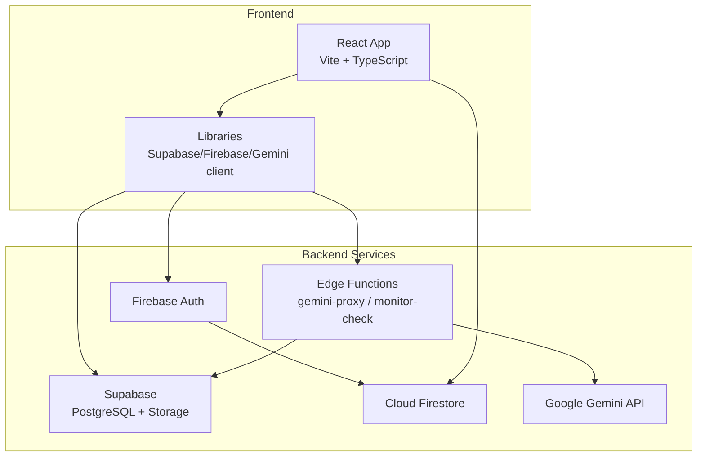
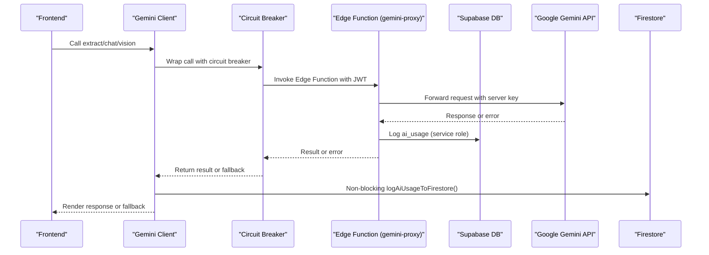
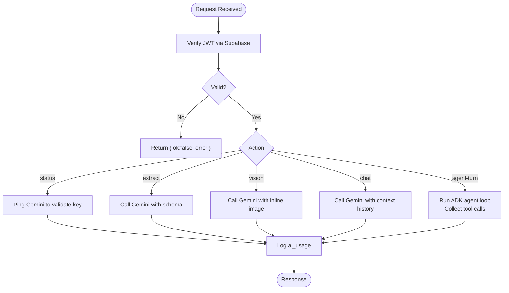
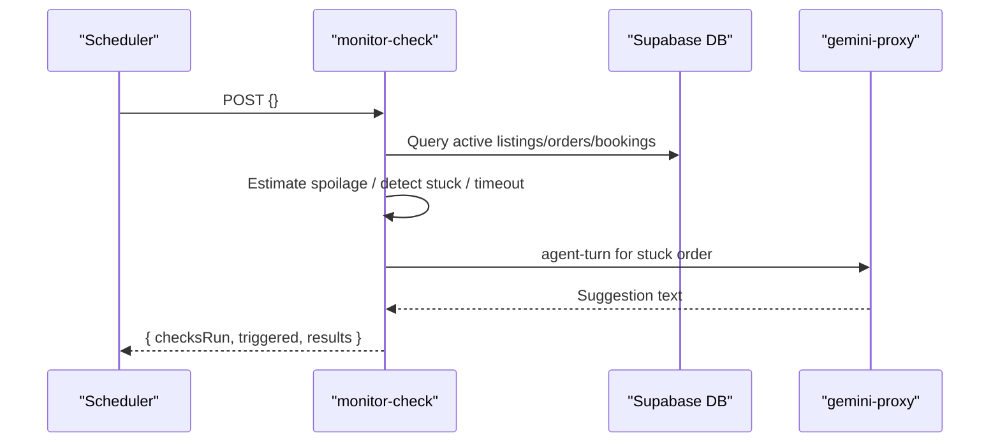
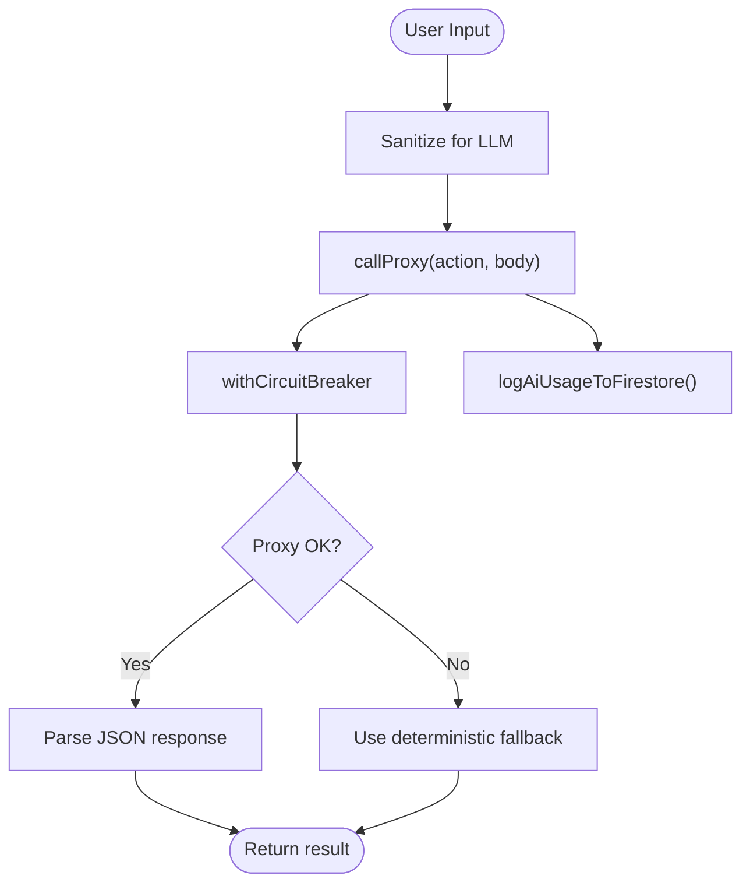
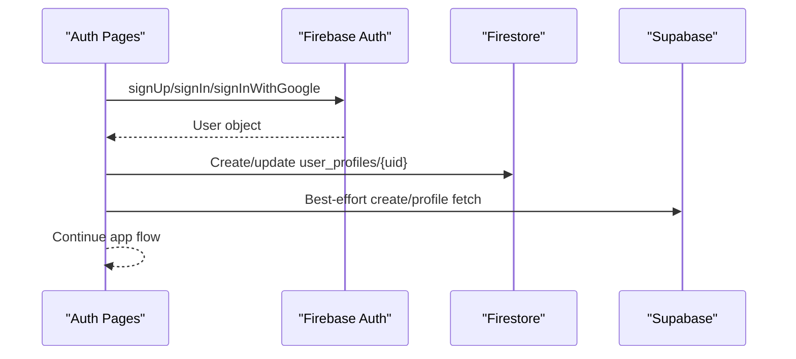
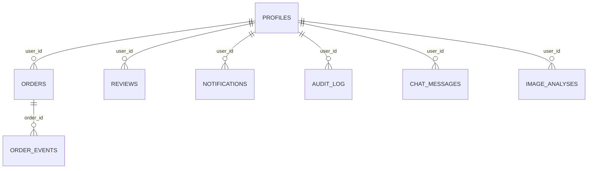
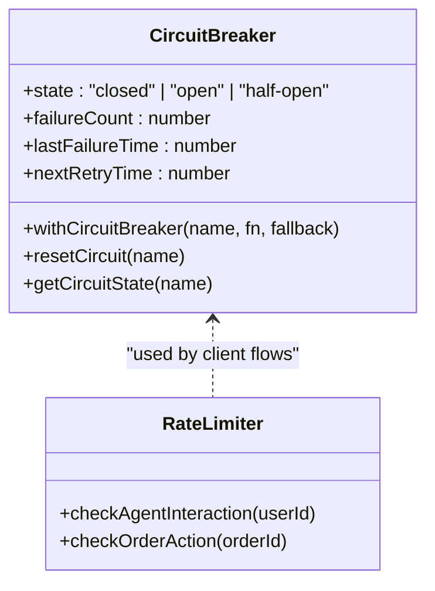
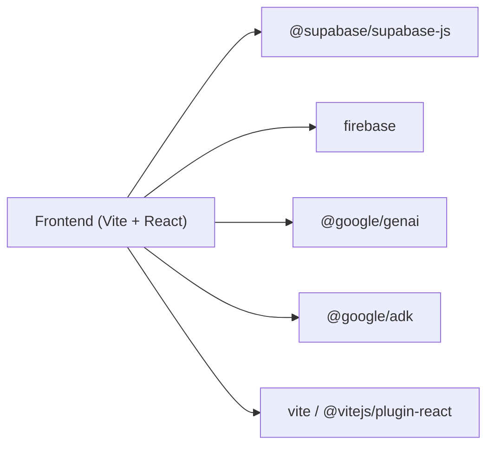

# Infrastructure & Backend Enhancements

<cite>
**Referenced Files in This Document**
- [README.md](file://README.md)
- [package.json](file://freshroute/package.json)
- [vite.config.ts](file://freshroute/vite.config.ts)
- [gemini-proxy/index.ts](file://freshroute/supabase/functions/gemini-proxy/index.ts)
- [monitor-check/index.ts](file://freshroute/supabase/functions/monitor-check/index.ts)
- [firebase.ts](file://freshroute/src/lib/firebase.ts)
- [firestore.ts](file://freshroute/src/lib/firestore.ts)
- [supabase.ts](file://freshroute/src/lib/supabase.ts)
- [gemini.ts](file://freshroute/src/lib/gemini.ts)
- [auth.ts](file://freshroute/src/lib/auth.ts)
- [circuitBreaker.ts](file://freshroute/src/lib/circuitBreaker.ts)
- [rateLimiter.ts](file://freshroute/src/lib/rateLimiter.ts)
- [0001_init.sql](file://freshroute/supabase/migrations/0001_init.sql)
</cite>

## Table of Contents
1. Introduction
2. Project Structure
3. Core Components
4. Architecture Overview
5. Detailed Component Analysis
6. Dependency Analysis
7. Performance Considerations
8. Troubleshooting Guide
9. Conclusion

## Introduction
This document explains the infrastructure and backend enhancements that power FreshRoute’s AI-driven produce trading assistant. It focuses on how the frontend integrates with Supabase, Firebase Auth, Cloud Firestore, and a server-side Gemini proxy via Supabase Edge Functions. It also covers resilience patterns (circuit breaker, rate limiting), monitoring, and database security through Row Level Security.

## Project Structure
The project is a Vite + React 19 frontend with TypeScript, using:
- Supabase for PostgreSQL, storage, and Edge Functions
- Firebase Auth for identity and Firestore for real-time telemetry
- A Deno-based Gemini proxy edge function to keep API keys server-side
- Migrations defining secure tables, policies, and views

**Diagram sources**
- [gemini-proxy/index.ts:1-583](file://freshroute/supabase/functions/gemini-proxy/index.ts#L1-L583)
- [monitor-check/index.ts:1-144](file://freshroute/supabase/functions/monitor-check/index.ts#L1-L144)
- [firebase.ts:1-27](file://freshroute/src/lib/firebase.ts#L1-L27)
- [firestore.ts:1-91](file://freshroute/src/lib/firestore.ts#L1-L91)
- [supabase.ts:1-20](file://freshroute/src/lib/supabase.ts#L1-L20)
- [gemini.ts:1-345](file://freshroute/src/lib/gemini.ts#L1-L345)

**Section sources**
- [README.md:181-227](file://README.md#L181-L227)
- [package.json:1-73](file://freshroute/package.json#L1-L73)
- [vite.config.ts:1-13](file://freshroute/vite.config.ts#L1-L13)

## Core Components
- Gemini Proxy Edge Function: Centralizes Gemini calls, validates JWTs, logs usage, and enforces approval flows for write tools.
- Monitor Check Edge Function: Background health checks for spoilage thresholds, stuck orders, and provider timeouts; can trigger agent replanning.
- Firebase Integration: Initializes Firebase services and provides Auth and Firestore clients.
- Firestore Helpers: Real-time AI usage logging and subscriptions for admin dashboards.
- Supabase Client: Configures the Supabase client with session persistence and URL handling.
- Gemini Client Abstraction: Orchestrates extract, vision, chat, and ADK agent turns with circuit breaking and fallbacks.
- Authentication Service: Manages sign-up/sign-in/password reset across Firebase and syncs profiles to Supabase when available.
- Resilience Utilities: Circuit breaker and rate limiter to protect against cascading failures and abuse.
- Database Schema and RLS: Secure tables, triggers, views, and storage policies.

**Section sources**
- [gemini-proxy/index.ts:1-583](file://freshroute/supabase/functions/gemini-proxy/index.ts#L1-L583)
- [monitor-check/index.ts:1-144](file://freshroute/supabase/functions/monitor-check/index.ts#L1-L144)
- [firebase.ts:1-27](file://freshroute/src/lib/firebase.ts#L1-L27)
- [firestore.ts:1-91](file://freshroute/src/lib/firestore.ts#L1-L91)
- [supabase.ts:1-20](file://freshroute/src/lib/supabase.ts#L1-L20)
- [gemini.ts:1-345](file://freshroute/src/lib/gemini.ts#L1-L345)
- [auth.ts:1-332](file://freshroute/src/lib/auth.ts#L1-L332)
- [circuitBreaker.ts:1-88](file://freshroute/src/lib/circuitBreaker.ts#L1-L88)
- [rateLimiter.ts:1-72](file://freshroute/src/lib/rateLimiter.ts#L1-L72)
- [0001_init.sql:1-321](file://freshroute/supabase/migrations/0001_init.sql#L1-L321)

## Architecture Overview
The system routes all AI traffic through a server-side proxy to protect secrets, while the frontend uses resilient patterns to handle outages gracefully.

**Diagram sources**
- [gemini.ts:50-98](file://freshroute/src/lib/gemini.ts#L50-L98)
- [gemini-proxy/index.ts:64-143](file://freshroute/supabase/functions/gemini-proxy/index.ts#L64-L143)
- [firestore.ts:39-55](file://freshroute/src/lib/firestore.ts#L39-L55)

## Detailed Component Analysis

### Gemini Proxy Edge Function
- Purpose: Single source of truth for Gemini access; verifies caller JWT, reads secret key, proxies requests, and logs usage.
- Actions: status, extract, vision, chat, agent-turn.
- Security: Uses service role key only on server side; returns structured JSON even on errors to avoid leaking stack traces.
- Approval Flow: For agent-turn, write tools are flagged for explicit user approval before execution.

**Diagram sources**
- [gemini-proxy/index.ts:64-143](file://freshroute/supabase/functions/gemini-proxy/index.ts#L64-L143)
- [gemini-proxy/index.ts:145-381](file://freshroute/supabase/functions/gemini-proxy/index.ts#L145-L381)

**Section sources**
- [gemini-proxy/index.ts:1-583](file://freshroute/supabase/functions/gemini-proxy/index.ts#L1-L583)

### Monitor Check Edge Function
- Purpose: Periodic background checks for spoilage thresholds, stuck orders, and provider timeouts.
- Behavior: For stuck orders, invokes the ADK agent via gemini-proxy to suggest next steps.
- Output: Aggregated results with triggered flags and actions.

**Diagram sources**
- [monitor-check/index.ts:33-143](file://freshroute/supabase/functions/monitor-check/index.ts#L33-L143)

**Section sources**
- [monitor-check/index.ts:1-144](file://freshroute/supabase/functions/monitor-check/index.ts#L1-L144)

### Frontend AI Client and Fallbacks
- Purpose: Encapsulates all Gemini interactions, applies sanitization, circuit breaking, and deterministic fallbacks when the proxy is unavailable.
- Features:
  - Sanitization to mitigate prompt injection
  - Circuit breaker to prevent cascading failures
  - Deterministic fallbacks for extract, vision, and chat
  - Non-blocking Firestore logging for live telemetry

**Diagram sources**
- [gemini.ts:31-98](file://freshroute/src/lib/gemini.ts#L31-L98)
- [gemini.ts:119-180](file://freshroute/src/lib/gemini.ts#L119-L180)
- [gemini.ts:195-246](file://freshroute/src/lib/gemini.ts#L195-L246)
- [firestore.ts:39-55](file://freshroute/src/lib/firestore.ts#L39-L55)

**Section sources**
- [gemini.ts:1-345](file://freshroute/src/lib/gemini.ts#L1-L345)

### Authentication and Profile Sync
- Purpose: Manage identity via Firebase Auth and synchronize user profiles to Firestore and Supabase.
- Capabilities: Email/password and Google sign-in, password reset, profile creation/fetch, best-effort Supabase sync.

**Diagram sources**
- [auth.ts:95-224](file://freshroute/src/lib/auth.ts#L95-L224)
- [auth.ts:273-322](file://freshroute/src/lib/auth.ts#L273-L322)

**Section sources**
- [auth.ts:1-332](file://freshroute/src/lib/auth.ts#L1-L332)
- [firebase.ts:1-27](file://freshroute/src/lib/firebase.ts#L1-L27)

### Database Schema and Security
- Purpose: Define secure data model with Row Level Security, auto-profile creation, transparent scoring view, and storage policies.
- Highlights:
  - Profiles, Orders, Reviews, Notifications, Audit Log, Chat Messages/State, Image Analyses, AI Usage
  - Materialized customer metrics view for transparency
  - Storage bucket for lot photos with public read and authenticated upload

**Diagram sources**
- [0001_init.sql:26-321](file://freshroute/supabase/migrations/0001_init.sql#L26-L321)

**Section sources**
- [0001_init.sql:1-321](file://freshroute/supabase/migrations/0001_init.sql#L1-L321)

### Resilience and Rate Limiting
- Circuit Breaker: Protects against repeated failures by opening the circuit after consecutive errors and returning a fallback.
- Rate Limiter: Token-bucket based limits for agent interactions and outbound actions per order, persisted in localStorage for MVP.

**Diagram sources**
- [circuitBreaker.ts:1-88](file://freshroute/src/lib/circuitBreaker.ts#L1-L88)
- [rateLimiter.ts:1-72](file://freshroute/src/lib/rateLimiter.ts#L1-L72)

**Section sources**
- [circuitBreaker.ts:1-88](file://freshroute/src/lib/circuitBreaker.ts#L1-L88)
- [rateLimiter.ts:1-72](file://freshroute/src/lib/rateLimiter.ts#L1-L72)

## Dependency Analysis
Key runtime dependencies include Supabase JS SDK, Firebase, Google Gemini packages, and build tooling.

**Diagram sources**
- [package.json:12-57](file://freshroute/package.json#L12-L57)
- [vite.config.ts:1-13](file://freshroute/vite.config.ts#L1-L13)

**Section sources**
- [package.json:1-73](file://freshroute/package.json#L1-L73)
- [vite.config.ts:1-13](file://freshroute/vite.config.ts#L1-L13)

## Performance Considerations
- Use Edge Functions to minimize latency and keep secrets server-side.
- Apply circuit breaking to avoid thundering herds during Gemini outages.
- Prefer deterministic fallbacks to maintain UX under degraded conditions.
- Leverage Firestore real-time subscriptions for lightweight admin telemetry without polling.
- Index frequently queried columns (e.g., created_at, user_id, status) as defined in migrations.

[No sources needed since this section provides general guidance]

## Troubleshooting Guide
Common issues and resolutions:
- Missing Supabase credentials: Ensure .env.local contains VITE_SUPABASE_URL and VITE_SUPABASE_ANON_KEY.
- Firebase configuration not found: Enable required providers in Firebase Console and deploy Firestore rules.
- AI mode shows ERROR: Verify Edge Function deployment and set GEMINI_API_KEY secret; check status endpoint behavior.
- Firestore writes permission denied: Deploy Firestore security rules allowing user_profiles and ai_usage as documented.
- Voice input not working: Requires Web Speech API support (Chrome/Edge).

**Section sources**
- [README.md:692-704](file://README.md#L692-L704)
- [gemini-proxy/index.ts:106-143](file://freshroute/supabase/functions/gemini-proxy/index.ts#L106-L143)
- [firestore.ts:39-55](file://freshroute/src/lib/firestore.ts#L39-L55)

## Conclusion
FreshRoute’s infrastructure combines a secure Gemini proxy, robust authentication, real-time telemetry, and resilient client patterns to deliver a reliable AI-powered trading assistant. The design emphasizes safety (approval-first), observability (usage logs), and graceful degradation (fallbacks and circuit breaking), enabling consistent performance even under partial outages.

[No sources needed since this section summarizes without analyzing specific files]