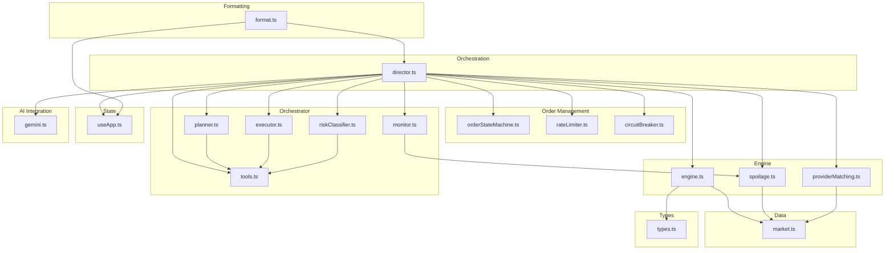
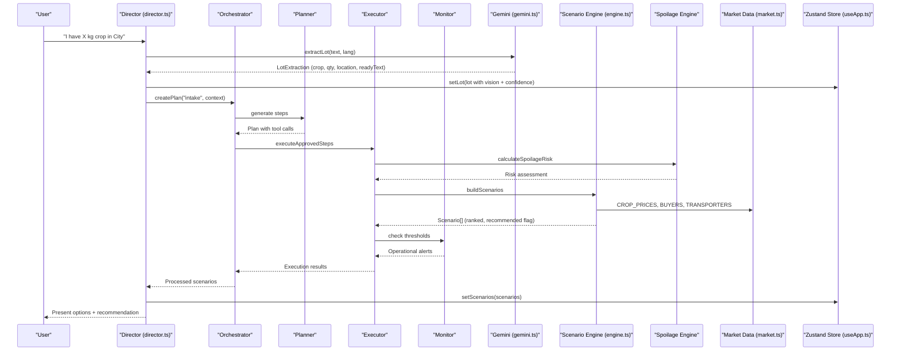
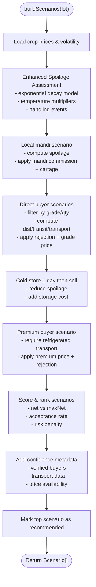
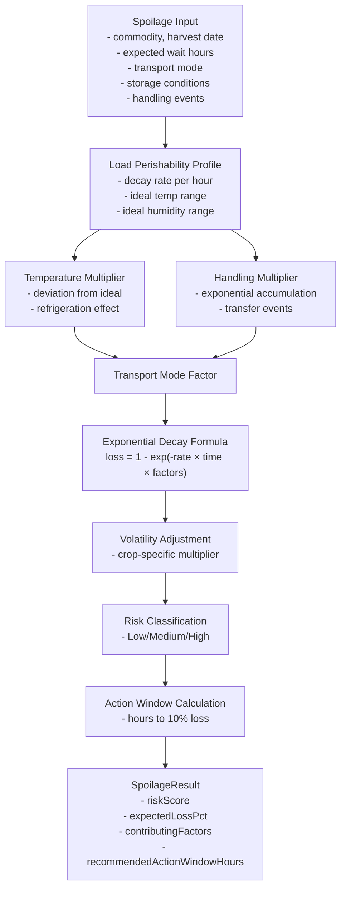
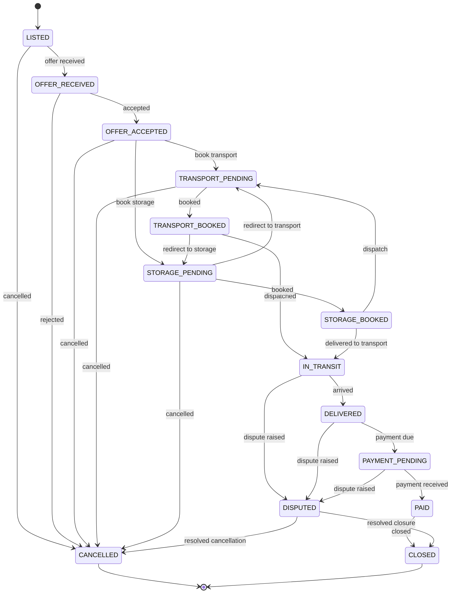
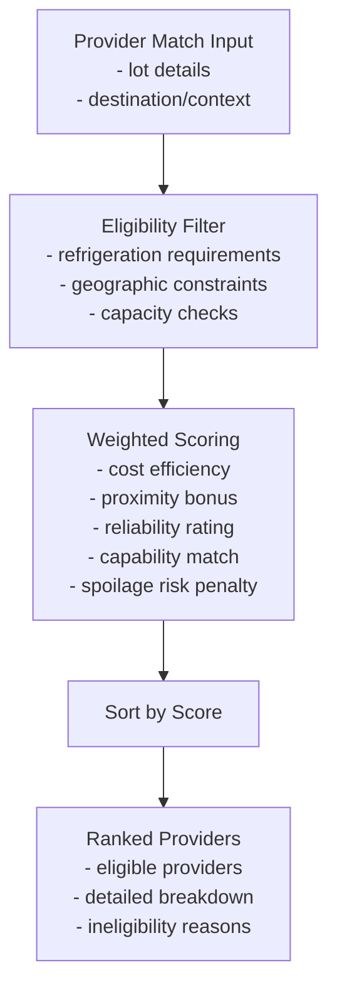
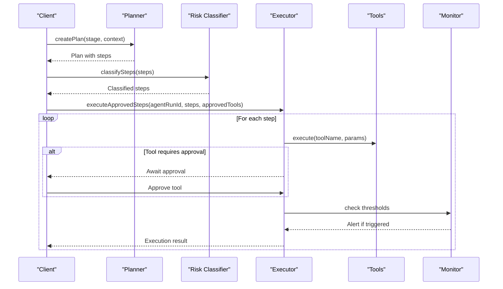
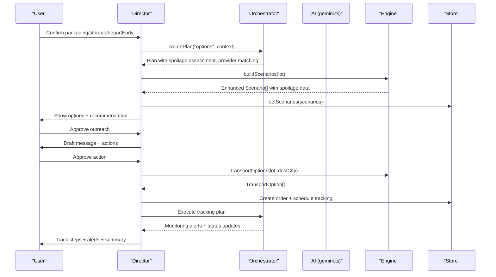
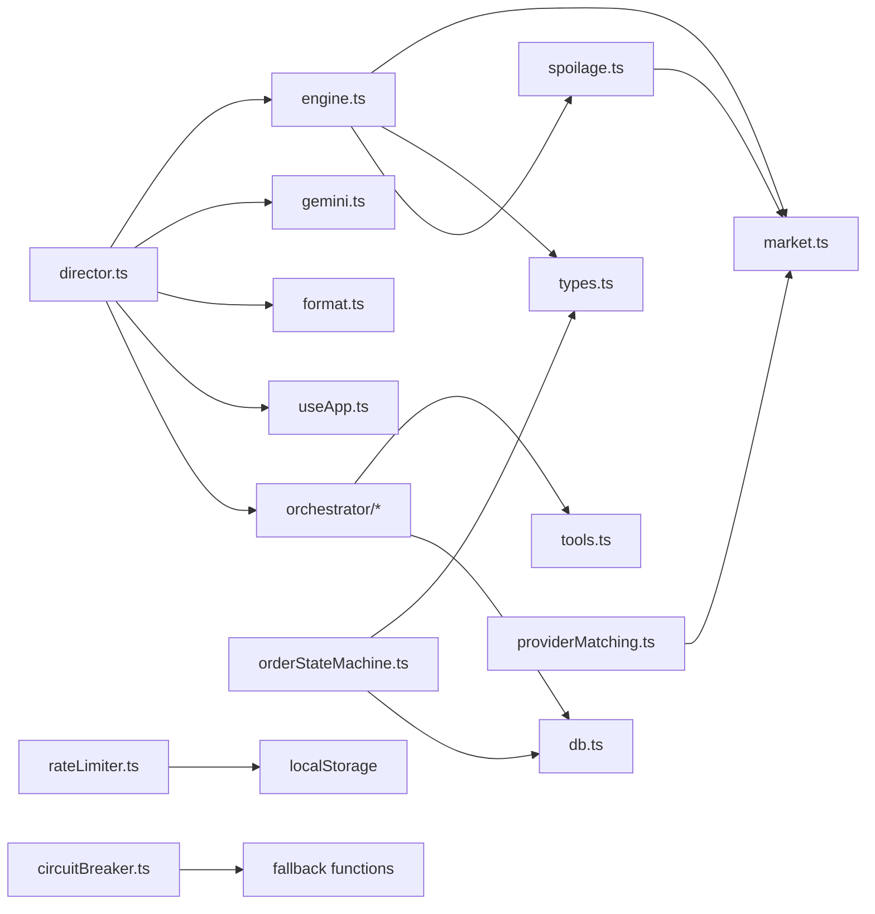

# Business Logic Layer

<cite>
**Referenced Files in This Document**
- [engine.ts](file://freshroute/src/lib/engine.ts)
- [market.ts](file://freshroute/src/data/market.ts)
- [format.ts](file://freshroute/src/lib/format.ts)
- [types.ts](file://freshroute/src/types.ts)
- [director.ts](file://freshroute/src/store/director.ts)
- [useApp.ts](file://freshroute/src/store/useApp.ts)
- [gemini.ts](file://freshroute/src/lib/gemini.ts)
- [spoilage.ts](file://freshroute/src/lib/spoilage.ts)
- [orderStateMachine.ts](file://freshroute/src/lib/orderStateMachine.ts)
- [rateLimiter.ts](file://freshroute/src/lib/rateLimiter.ts)
- [circuitBreaker.ts](file://freshroute/src/lib/circuitBreaker.ts)
- [providerMatching.ts](file://freshroute/src/lib/providerMatching.ts)
- [executor.ts](file://freshroute/src/lib/orchestrator/executor.ts)
- [monitor.ts](file://freshroute/src/lib/orchestrator/monitor.ts)
- [planner.ts](file://freshroute/src/lib/orchestrator/planner.ts)
- [riskClassifier.ts](file://freshroute/src/lib/orchestrator/riskClassifier.ts)
- [tools.ts](file://freshroute/src/lib/orchestrator/tools.ts)
</cite>

## Update Summary
**Changes Made**
- Added comprehensive spoilage risk calculation engine with exponential decay modeling
- Implemented order lifecycle state machine with audit trail capabilities
- Integrated API rate limiting for agent interactions and order actions
- Added circuit breaker pattern for service resilience
- Enhanced provider matching algorithms for transport and storage selection
- Introduced complete orchestrator system with executor, monitor, planner, and risk classification
- Updated supply chain calculations to integrate new spoilage models

## Table of Contents
1. Introduction
2. Project Structure
3. Core Components
4. Architecture Overview
5. Detailed Component Analysis
6. Dependency Analysis
7. Performance Considerations
8. Troubleshooting Guide
9. Conclusion
10. Appendices

## Introduction
This document explains FreshRoute's enhanced business logic layer with focus on the supply chain calculation engine, market analysis algorithms, data formatting utilities, and new orchestration capabilities. It clarifies how business rules are separated from data processing and presentation logic, and it provides examples of scenario generation, cost calculations, market intelligence processing, and advanced operational features like spoilage risk assessment, order lifecycle management, and resilient service patterns. Finally, it outlines extensibility points for adding new business rules, market data sources, and operational capabilities.

## Project Structure
The business logic is organized into clear layers with enhanced operational capabilities:
- Data layer: market constants, prices, buyers, transporters, storage facilities, distances, weather, and price ticker helpers.
- Engine layer: rule-based supply chain calculations (scenarios, spoilage, pricing factors, transport options).
- Spoilage Risk Engine: exponential decay model for perishability assessment with temperature and handling multipliers.
- Order Management: formal state machine with audit trail for order lifecycle tracking.
- Rate Limiting: client-side token bucket limiter for API protection.
- Service Resilience: circuit breaker pattern for fault tolerance.
- Provider Matching: intelligent scoring algorithms for transport and storage selection.
- Orchestrator System: comprehensive workflow management with planning, execution, monitoring, and risk classification.
- Formatting layer: currency, time, unit conversions, and unique IDs used across the app.
- Orchestration layer: director that drives user flows, integrates AI extraction/vision/chat, and updates application state.
- State layer: Zustand store holding messages, lot, scenarios, audit logs, and UI state.
- Types layer: shared TypeScript interfaces for all domain objects.

**Diagram sources**
- [engine.ts:1-294](file://freshroute/src/lib/engine.ts#L1-L294)
- [spoilage.ts:1-102](file://freshroute/src/lib/spoilage.ts#L1-L102)
- [providerMatching.ts:1-71](file://freshroute/src/lib/providerMatching.ts#L1-L71)
- [orderStateMachine.ts:1-55](file://freshroute/src/lib/orderStateMachine.ts#L1-L55)
- [rateLimiter.ts:1-72](file://freshroute/src/lib/rateLimiter.ts#L1-L72)
- [circuitBreaker.ts:1-88](file://freshroute/src/lib/circuitBreaker.ts#L1-L88)
- [planner.ts:1-70](file://freshroute/src/lib/orchestrator/planner.ts#L1-L70)
- [executor.ts:1-79](file://freshroute/src/lib/orchestrator/executor.ts#L1-L79)
- [monitor.ts:1-67](file://freshroute/src/lib/orchestrator/monitor.ts#L1-L67)
- [riskClassifier.ts:1-27](file://freshroute/src/lib/orchestrator/riskClassifier.ts#L1-L27)
- [tools.ts:1-163](file://freshroute/src/lib/orchestrator/tools.ts#L1-L163)

**Section sources**
- [engine.ts:1-294](file://freshroute/src/lib/engine.ts#L1-L294)
- [market.ts:1-241](file://freshroute/src/data/market.ts#L1-L241)
- [format.ts:1-21](file://freshroute/src/lib/format.ts#L1-L21)
- [director.ts:1-750](file://freshroute/src/store/director.ts#L1-L750)
- [useApp.ts:1-129](file://freshroute/src/store/useApp.ts#L1-L129)
- [types.ts:1-229](file://freshroute/src/types.ts#L1-L229)
- [gemini.ts:1-200](file://freshroute/src/lib/gemini.ts#L1-L200)

## Core Components
- Supply chain scenario engine: builds multiple sale scenarios (local mandi, direct buyer, cold storage then sell, premium buyer), computes gross/net revenue, deductions, spoilage, risk, and ranks them using a weighted scoring function.
- **Enhanced Spoilage Risk Engine**: exponential decay model with temperature, handling, and transport multipliers for accurate perishability assessment.
- **Order Lifecycle Management**: formal state machine with valid transitions and comprehensive audit trail logging.
- **Intelligent Provider Matching**: weighted scoring algorithms for transport and storage provider selection based on cost, proximity, reliability, and capability.
- **API Rate Limiting**: client-side token bucket limiter protecting against excessive API usage with per-user and per-order limits.
- **Service Resilience**: circuit breaker pattern ensuring graceful degradation when external services fail.
- **Orchestrator System**: comprehensive workflow management with planning, execution, monitoring, and risk classification capabilities.
- Market analysis: uses crop prices by city, volatility/perishability, buyer constraints (grade, quantity range, acceptance/rejection rates), transport costs, and platform fees to evaluate options.
- Transport modeling: calculates transport cost per km, ETA, and recommendations based on refrigeration needs and value vs. safety trade-offs.
- Data formatting: PKR currency formatting, clock time formatting, maund conversion, and unique ID generation.
- Orchestration and state: director manages conversation flow, integrates AI extraction/vision/chat, applies business rules, and persists results in the Zustand store.

Key responsibilities and separation of concerns:
- Business rules live in engine.ts (pricing factors, spoilage model, scoring, scenario construction).
- **Spoilage modeling** lives in spoilage.ts (exponential decay calculations with environmental factors).
- **Order lifecycle** lives in orderStateMachine.ts (state transitions and audit logging).
- **Provider matching** lives in providerMatching.ts (intelligent scoring algorithms).
- **Rate limiting** lives in rateLimiter.ts (API protection mechanisms).
- **Service resilience** lives in circuitBreaker.ts (fault tolerance patterns).
- **Orchestration** lives in orchestrator/ directory (workflow management).
- Market data lives in market.ts (prices, buyers, transporters, distances, weather, aliases).
- Formatting utilities live in format.ts (no business decisions).
- Orchestration lives in director.ts (user flow, approvals, messaging, AI integration).
- State lives in useApp.ts (messages, scenarios, audit log, UI flags).
- Types define contracts between components.

**Section sources**
- [engine.ts:10-294](file://freshroute/src/lib/engine.ts#L10-L294)
- [spoilage.ts:11-102](file://freshroute/src/lib/spoilage.ts#L11-L102)
- [orderStateMachine.ts:9-55](file://freshroute/src/lib/orderStateMachine.ts#L9-L55)
- [providerMatching.ts:9-71](file://freshroute/src/lib/providerMatching.ts#L9-L71)
- [rateLimiter.ts:11-72](file://freshroute/src/lib/rateLimiter.ts#L11-L72)
- [circuitBreaker.ts:9-88](file://freshroute/src/lib/circuitBreaker.ts#L9-L88)
- [planner.ts:8-70](file://freshroute/src/lib/orchestrator/planner.ts#L8-L70)
- [executor.ts:9-79](file://freshroute/src/lib/orchestrator/executor.ts#L9-L79)
- [monitor.ts:8-67](file://freshroute/src/lib/orchestrator/monitor.ts#L8-L67)
- [riskClassifier.ts:7-27](file://freshroute/src/lib/orchestrator/riskClassifier.ts#L7-L27)
- [tools.ts:22-163](file://freshroute/src/lib/orchestrator/tools.ts#L22-L163)

## Architecture Overview
FreshRoute's enhanced business logic follows a layered architecture with comprehensive operational capabilities:
- Input: user text/voice/photos processed via AI or fallback parsers to extract lot details.
- Processing: engine constructs scenarios using market data and business rules; orchestrator manages complex workflows with planning, execution, and monitoring; director coordinates steps and handles approvals.
- **Operational Enhancements**: spoilage risk assessment, order lifecycle management, rate limiting, circuit breaking, and intelligent provider matching.
- Output: formatted messages, scenarios, orders, and tracking updates presented through the UI state.

**Diagram sources**
- [director.ts:110-217](file://freshroute/src/store/director.ts#L110-L217)
- [planner.ts:25-70](file://freshroute/src/lib/orchestrator/planner.ts#L25-L70)
- [executor.ts:17-79](file://freshroute/src/lib/orchestrator/executor.ts#L17-L79)
- [monitor.ts:15-67](file://freshroute/src/lib/orchestrator/monitor.ts#L15-L67)
- [spoilage.ts:50-102](file://freshroute/src/lib/spoilage.ts#L50-L102)
- [engine.ts:72-294](file://freshroute/src/lib/engine.ts#L72-L294)
- [market.ts:13-241](file://freshroute/src/data/market.ts#L13-L241)
- [useApp.ts:75-80](file://freshroute/src/store/useApp.ts#L75-L80)

## Detailed Component Analysis

### Enhanced Supply Chain Calculation Engine
The engine implements transparent, explainable rules for produce supply chains with integrated spoilage risk assessment:
- Grade price factor: adjusts base mandi price by grade (A/B/C).
- Packaging factor: crates/sacks/loose influence spoilage exposure.
- **Enhanced Spoilage Model**: exponential decay formula incorporating temperature, handling events, transport mode, and crop-specific perishability profiles.
- Scenarios:
  - Local mandi sale today: includes mandi commission and local cartage.
  - Direct wholesale buyer in nearby city: considers distance, transit days, transport cost, rejection rate, and grade-adjusted price.
  - Cold storage one day then sell: adds storage cost and reduced spoilage; evaluates best direct buyer path.
  - Premium buyer: higher price but stricter grade requirements and refrigerated transport; accounts for rejection risk.
- Ranking: weighted score combines net revenue, acceptance rate, and risk penalty; top scenario marked recommended.
- **Confidence Scoring**: metadata based on data completeness including verified buyers, transport availability, and price data.

**Diagram sources**
- [engine.ts:17-47](file://freshroute/src/lib/engine.ts#L17-L47)
- [engine.ts:72-294](file://freshroute/src/lib/engine.ts#L72-L294)
- [spoilage.ts:50-102](file://freshroute/src/lib/spoilage.ts#L50-L102)

**Section sources**
- [engine.ts:17-47](file://freshroute/src/lib/engine.ts#L17-L47)
- [engine.ts:72-294](file://freshroute/src/lib/engine.ts#L72-L294)
- [spoilage.ts:50-102](file://freshroute/src/lib/spoilage.ts#L50-L102)

### Advanced Spoilage Risk Engine
The spoilage engine implements sophisticated exponential decay modeling for perishability assessment:
- **Exponential Decay Formula**: lossPct = 1 - exp(-base_decay_rate * hours * temp_multiplier * handling_multiplier * transport_multiplier)
- **Temperature Multiplier**: each degree outside ideal range adds 5% decay rate
- **Handling Multiplier**: each transfer/handling event adds ~3% damage risk exponentially
- **Transport Mode Factors**: refrigerated (1.0), ambient (1.4), none (1.8)
- **Crop-Specific Profiles**: per-crop decay rates and ideal temperature/humidity ranges
- **Volatility Adjustment**: crop volatility affects final loss percentage
- **Risk Classification**: Low (<8%), Medium (8-18%), High (>18%)
- **Action Window Calculation**: hours until loss crosses 10% threshold

**Diagram sources**
- [spoilage.ts:50-102](file://freshroute/src/lib/spoilage.ts#L50-L102)
- [market.ts:200-218](file://freshroute/src/data/market.ts#L200-L218)

**Section sources**
- [spoilage.ts:11-102](file://freshroute/src/lib/spoilage.ts#L11-L102)
- [market.ts:200-218](file://freshroute/src/data/market.ts#L200-L218)

### Order Lifecycle Management
The order state machine provides formal lifecycle management with comprehensive audit trails:
- **Valid Transitions**: predefined state transitions preventing invalid order states
- **Audit Trail**: every transition logged with timestamp, payload, and source information
- **Terminal States**: DELIVERED, PAID, CLOSED, CANCELLED with no further transitions
- **Dispute Handling**: DISPUTED state allowing resolution paths back to normal flow
- **Database Integration**: automatic status updates and event logging

**Diagram sources**
- [orderStateMachine.ts:9-24](file://freshroute/src/lib/orderStateMachine.ts#L9-L24)

**Section sources**
- [orderStateMachine.ts:9-55](file://freshroute/src/lib/orderStateMachine.ts#L9-L55)

### Intelligent Provider Matching Algorithms
Advanced scoring algorithms for transport and storage provider selection:
- **Transport Provider Scoring**: weighted combination of cost efficiency, proximity, reliability rating, capability match, and spoilage risk
- **Storage Provider Scoring**: similar weighted approach optimized for storage-specific factors like temperature control and verification status
- **Eligibility Filtering**: hard constraints like refrigeration requirements for soft produce over long distances
- **Dynamic Weighting**: configurable weights for different business priorities
- **Soft Produce Detection**: automatic identification of high-risk crops requiring special handling

**Diagram sources**
- [providerMatching.ts:28-71](file://freshroute/src/lib/providerMatching.ts#L28-L71)

**Section sources**
- [providerMatching.ts:9-71](file://freshroute/src/lib/providerMatching.ts#L9-L71)
- [market.ts:231-241](file://freshroute/src/data/market.ts#L231-L241)

### API Rate Limiting and Service Resilience
Comprehensive protection mechanisms for reliable operation:
- **Token Bucket Algorithm**: smooth rate limiting with configurable refill rates
- **Per-User Limits**: maximum 30 agent interactions per hour
- **Per-Order Limits**: maximum 5 outbound actions per order
- **Circuit Breaker Pattern**: automatic fallback after consecutive failures
- **Graceful Degradation**: returns safe defaults instead of failing completely
- **Monitoring Integration**: circuit state tracking for debugging and alerting

**Section sources**
- [rateLimiter.ts:11-72](file://freshroute/src/lib/rateLimiter.ts#L11-L72)
- [circuitBreaker.ts:9-88](file://freshroute/src/lib/circuitBreaker.ts#L9-L88)

### Orchestrator System
Comprehensive workflow management system with four core components:

#### Planner
Rule-based stage-to-tool mapping with domain validation:
- **Stage-Based Planning**: intake, options, outreach-approval, outreach, booking, tracking
- **Domain Validation**: prevents unauthorized operations through allowed domains list
- **Tool Registry Integration**: maps stages to specific tool executions

#### Executor
Iterative step execution with approval and idempotency:
- **Approval Workflow**: write operations require explicit user approval
- **Idempotency Keys**: prevents duplicate operations using composite keys
- **Error Handling**: comprehensive error logging and recovery
- **Audit Trail**: all actions logged with input/output for traceability

#### Monitor
Background health checking and threshold monitoring:
- **Spoilage Thresholds**: automated alerts when spoilage risk exceeds limits
- **Stuck Order Detection**: identifies orders stuck in non-terminal states
- **Provider Timeout Monitoring**: tracks response times from external providers

#### Risk Classifier
Automatic classification of tool operations:
- **Read vs Write Classification**: read-only tools auto-execute, write tools require approval
- **Security Boundary**: prevents unauthorized data modifications
- **Tool Registry Integration**: dynamic classification based on tool definitions

**Diagram sources**
- [planner.ts:25-70](file://freshroute/src/lib/orchestrator/planner.ts#L25-L70)
- [riskClassifier.ts:12-27](file://freshroute/src/lib/orchestrator/riskClassifier.ts#L12-L27)
- [executor.ts:17-79](file://freshroute/src/lib/orchestrator/executor.ts#L17-L79)
- [monitor.ts:15-67](file://freshroute/src/lib/orchestrator/monitor.ts#L15-L67)

**Section sources**
- [planner.ts:8-70](file://freshroute/src/lib/orchestrator/planner.ts#L8-L70)
- [executor.ts:9-79](file://freshroute/src/lib/orchestrator/executor.ts#L9-L79)
- [monitor.ts:8-67](file://freshroute/src/lib/orchestrator/monitor.ts#L8-L67)
- [riskClassifier.ts:7-27](file://freshroute/src/lib/orchestrator/riskClassifier.ts#L7-L27)
- [tools.ts:22-163](file://freshroute/src/lib/orchestrator/tools.ts#L22-L163)

### Market Analysis Algorithms
Market analysis leverages structured data with enhanced capabilities:
- Crop prices by city: base revenue depends on destination city and grade adjustments.
- Buyer constraints: minimum/maximum quantities, grade acceptance, historical acceptance rate, rejection percentage, payment terms, response time.
- Transporters: vehicle type, refrigeration, cost per km, on-time reliability.
- Distances: route distances inform transit time and spoilage assumptions.
- Weather: contextual info for temperature and conditions affecting logistics.
- Price ticker: generates enriched price points with trend, freshness window, and confidence.
- **Enhanced Perishability Profiles**: crop-specific decay rates and optimal storage conditions.
- **Provider Matching Weights**: configurable scoring criteria for transport and storage selection.

Extensibility:
- Add new crops/cities to CROP_PRICES and CROP_VOLATILITY.
- Register new buyers with constraints and performance metrics.
- Introduce additional transporters with cost and reliability profiles.
- Extend STORAGES for multi-city cold storage options.
- **Add perishability profiles** for new crops with decay rates and optimal conditions.
- **Configure provider matching weights** for different business priorities.

**Section sources**
- [market.ts:13-241](file://freshroute/src/data/market.ts#L13-L241)

### Data Formatting Utilities
Formatting utilities ensure consistent presentation:
- Currency: PKR formatting with locale-aware thousands separators and short form for large amounts.
- Time: human-readable clock formatting with AM/PM.
- Units: conversion from kilograms to maund for local context.
- IDs: deterministic random IDs for messages and audit entries.

These utilities are pure functions with no side effects and are reused across orchestration and UI layers.

**Section sources**
- [format.ts:1-21](file://freshroute/src/lib/format.ts#L1-L21)

### Orchestration and Flow Control
The director coordinates the end-to-end flow with enhanced orchestration capabilities:
- Boot sequence introduces the agent and prompts for intake.
- Intake flow extracts lot details via AI or fallback parser, validates supported crops, and requests photos.
- Photo analysis produces a vision result (grade, ripeness, defect rate, notes, confidence).
- Clarification collects packaging, storage availability, and departure timing.
- **Enhanced Scenario Generation**: runs the orchestrator system with spoilage assessment, provider matching, and risk classification.
- Outreach approval drafts messages to buyers/commission agents; user must approve before sending.
- Offers flow computes expected net after transport, platform fee, mandi commission, storage, and loading.
- Final approval books transport and creates an order with tracking steps.
- Tracking simulation advances order steps, injects alerts for delays, and finalizes with a summary comparing actual vs. estimated outcomes.
- **Operational Monitoring**: background checks for spoilage thresholds, stuck orders, and provider timeouts.

**Diagram sources**
- [director.ts:258-497](file://freshroute/src/store/director.ts#L258-L497)
- [engine.ts:274-294](file://freshroute/src/lib/engine.ts#L274-L294)
- [useApp.ts:91-118](file://freshroute/src/store/useApp.ts#L91-L118)

**Section sources**
- [director.ts:84-156](file://freshroute/src/store/director.ts#L84-L156)
- [director.ts:175-254](file://freshroute/src/store/director.ts#L175-L254)
- [director.ts:258-497](file://freshroute/src/store/director.ts#L258-L497)
- [director.ts:499-597](file://freshroute/src/store/director.ts#L499-L597)

### AI Integration Points
- Extraction: AI proxy attempts to parse natural language into structured lot data; falls back to deterministic parser if unavailable or malformed.
- Vision: image analysis estimates grade, ripeness, defect rate, and confidence; fallback returns a safe demo estimate when needed.
- Chat: conversational responses incorporate lot summary, scenarios summary, and prices summary; fallback answers handle common questions about markets and recommendations.
- Error surfacing: last AI error is captured and surfaced once to the user, ensuring transparency when offline/demo mode is used.
- **Orchestrator Integration**: AI-powered planning and tool selection within the orchestrator system.

**Section sources**
- [gemini.ts:28-42](file://freshroute/src/lib/gemini.ts#L28-L42)
- [gemini.ts:55-116](file://freshroute/src/lib/gemini.ts#L55-L116)
- [gemini.ts:118-161](file://freshroute/src/lib/gemini.ts#L118-L161)
- [gemini.ts:169-200](file://freshroute/src/lib/gemini.ts#L169-L200)

## Dependency Analysis
Coupling and cohesion:
- Engine depends on market data, types, and spoilage engine; it encapsulates business rules and is cohesive around scenario computation.
- **Spoilage engine** depends on market data for perishability profiles and crop volatility.
- **Order state machine** depends on types and database operations for state persistence.
- **Provider matching** depends on market data and types for scoring algorithms.
- **Rate limiter** and **circuit breaker** provide cross-cutting concerns for reliability.
- **Orchestrator system** depends on tools registry and provides workflow coordination.
- Director depends on engine, gemini, format, store, and orchestrator; it orchestrates flows and maintains low coupling to specific implementations via typed interfaces.
- Store holds state and exposes actions; it is decoupled from business logic and only updates state based on director calls.
- Types provide a stable contract across modules, reducing coupling risks.

Potential circular dependencies:
- None observed; imports are directional: director → engine/gemini/format/store/orchestrator; engine → market/types/spoilage; orchestrator → tools/db; spoilage → market; provider matching → market/types.

External integrations:
- Supabase Edge Function proxy for Gemini API calls ensures secrets remain server-side.
- WhatsApp delivery is simulated via messaging; real integration would be added at the outreach step.
- **Database integration** for order state persistence and audit logging.
- **localStorage** for rate limiting state persistence.

**Diagram sources**
- [director.ts:1-22](file://freshroute/src/store/director.ts#L1-L22)
- [engine.ts:1-10](file://freshroute/src/lib/engine.ts#L1-L10)
- [spoilage.ts:9-10](file://freshroute/src/lib/spoilage.ts#L9-L10)
- [providerMatching.ts:6-7](file://freshroute/src/lib/providerMatching.ts#L6-L7)
- [orderStateMachine.ts:6-7](file://freshroute/src/lib/orderStateMachine.ts#L6-L7)
- [rateLimiter.ts:1-72](file://freshroute/src/lib/rateLimiter.ts#L1-L72)
- [circuitBreaker.ts:1-88](file://freshroute/src/lib/circuitBreaker.ts#L1-L88)
- [executor.ts:5-7](file://freshroute/src/lib/orchestrator/executor.ts#L5-L7)

**Section sources**
- [director.ts:1-22](file://freshroute/src/store/director.ts#L1-L22)
- [engine.ts:1-10](file://freshroute/src/lib/engine.ts#L1-L10)
- [spoilage.ts:9-10](file://freshroute/src/lib/spoilage.ts#L9-L10)
- [providerMatching.ts:6-7](file://freshroute/src/lib/providerMatching.ts#L6-L7)
- [orderStateMachine.ts:6-7](file://freshroute/src/lib/orderStateMachine.ts#L6-L7)
- [rateLimiter.ts:1-72](file://freshroute/src/lib/rateLimiter.ts#L1-L72)
- [circuitBreaker.ts:1-88](file://freshroute/src/lib/circuitBreaker.ts#L1-L88)
- [executor.ts:5-7](file://freshroute/src/lib/orchestrator/executor.ts#L5-L7)

## Performance Considerations
- Scenario generation is O(n) over buyers and transporters; acceptable for small datasets. For scaling, consider caching buyer filters and precomputing distance matrices.
- **Spoilage calculations** use exponential functions which are computationally efficient; avoid unnecessary recomputation by memoizing inputs where appropriate.
- **Provider matching** involves weighted scoring calculations; consider caching results for repeated queries.
- **Order state transitions** involve database operations; batch updates where possible.
- **Rate limiting** uses localStorage for MVP; consider Redis for production scaling.
- **Circuit breaker** state is in-memory; implement persistent state for distributed deployments.
- **Orchestrator execution** processes steps sequentially; consider parallel execution for independent tools.
- Transport options map over transporters; negligible overhead.
- AI calls are asynchronous and may fail; fallbacks prevent blocking the UI. Batch or debounce repeated calls if needed.
- Store updates are minimal and targeted; keep actions focused to avoid re-renders.

## Troubleshooting Guide
Common issues and resolutions:
- AI proxy unreachable: director surfaces an error message and switches to offline demo mode for the affected step; check network and Supabase Edge Function status.
- Malformed AI responses: fallbacks return safe defaults (e.g., VISION_FALLBACK); inspect logs and refine prompts or parsing.
- Unsupported crop: intake flow prompts to use a supported crop; extend CROP_PRICES and CROP_ALIASES to support new crops.
- No photos provided: lower confidence estimates are used; encourage photo capture for better grading accuracy.
- Scenario mismatch: verify buyer constraints (grade, min/max kg), distances, and transport costs; adjust market data or business rules accordingly.
- **Spoilage calculation errors**: verify perishability profiles exist for crops; check temperature and handling inputs.
- **Order state transition failures**: validate current order status and target state compatibility; check database connectivity.
- **Rate limiting issues**: monitor localStorage quota; implement proper cleanup of expired tokens.
- **Circuit breaker activation**: investigate external service health; adjust failure thresholds if needed.
- **Orchestrator execution failures**: review tool registry configuration; check approval workflows for write operations.

Operational tips:
- Use audit entries to trace decisions and system actions.
- Leverage "Show all numbers" to validate deductions and net calculations.
- Monitor tracking alerts for delays and confirm counterparty notifications.
- **Monitor circuit breaker states** for service health assessment.
- **Review rate limit usage** to optimize API consumption patterns.
- **Track order state transitions** for compliance and debugging purposes.

**Section sources**
- [gemini.ts:28-42](file://freshroute/src/lib/gemini.ts#L28-L42)
- [gemini.ts:118-161](file://freshroute/src/lib/gemini.ts#L118-L161)
- [director.ts:62-74](file://freshroute/src/store/director.ts#L62-L74)
- [director.ts:118-143](file://freshroute/src/store/director.ts#L118-L143)
- [director.ts:643-653](file://freshroute/src/store/director.ts#L643-L653)
- [spoilage.ts:50-102](file://freshroute/src/lib/spoilage.ts#L50-L102)
- [orderStateMachine.ts:34-55](file://freshroute/src/lib/orderStateMachine.ts#L34-L55)
- [rateLimiter.ts:50-72](file://freshroute/src/lib/rateLimiter.ts#L50-L72)
- [circuitBreaker.ts:37-88](file://freshroute/src/lib/circuitBreaker.ts#L37-L88)

## Conclusion
FreshRoute's enhanced business logic layer cleanly separates concerns with comprehensive operational capabilities:
- Business rules reside in the engine, providing transparent, explainable calculations for supply chain scenarios.
- **Enhanced spoilage modeling** provides sophisticated perishability assessment with exponential decay calculations.
- **Order lifecycle management** ensures data integrity through formal state machines with audit trails.
- **Intelligent provider matching** optimizes transport and storage selection through weighted scoring algorithms.
- **API protection mechanisms** safeguard against excessive usage and service failures.
- **Orchestrator system** coordinates complex workflows with planning, execution, monitoring, and risk classification.
- Market data is centralized and extensible, enabling easy addition of new crops, buyers, transporters, and storage facilities.
- Formatting utilities ensure consistent presentation without influencing business decisions.
- The director orchestrates user flows, integrates AI robustly with fallbacks, and updates state immutably.
- Extensibility points include expanding market data, adding new scenario types, integrating external services (e.g., WhatsApp, GPS tracking), implementing new spoilage models, configuring provider matching weights, and extending orchestrator tools while preserving separation of concerns.

## Appendices

### Example: Enhanced Scenario Generation
- Inputs: lot details (crop, quantity, location, packaging, storage availability, departure timing), market prices, buyer constraints, transporters, distances.
- Process: engine computes spoilage using exponential decay model, gross revenue, deductions (commission, transport, platform fee, storage, loading), accepted quantity, risk, and scores each scenario.
- **Enhanced Features**: spoilage risk assessment with temperature and handling factors, confidence scoring based on data completeness, provider matching for optimal transport/storage selection.
- Output: ranked scenarios with recommended flag, explanatory reasons, spoilage risk classification, and confidence metadata.

**Section sources**
- [engine.ts:72-294](file://freshroute/src/lib/engine.ts#L72-L294)
- [spoilage.ts:50-102](file://freshroute/src/lib/spoilage.ts#L50-L102)

### Example: Cost Calculations
- Local mandi: mandi commission and local cartage applied to gross; same-day payment terms.
- Direct buyer: transport cost based on distance and transporter; platform fee applied; grade-adjusted price; rejection reduces accepted quantity.
- Cold storage: storage cost per kg per day; reduced spoilage; evaluate against potential price uplift.
- Premium buyer: refrigerated transport required; higher price but stricter grade and rejection risk.
- **Enhanced Spoilage Costs**: exponential decay calculations incorporating temperature, handling events, and transport mode factors.

**Section sources**
- [engine.ts:78-249](file://freshroute/src/lib/engine.ts#L78-L249)
- [spoilage.ts:50-102](file://freshroute/src/lib/spoilage.ts#L50-L102)

### Example: Market Intelligence Processing
- Price ticker: generates enriched price points with trend, freshness window, and confidence.
- Weather: contextual temperature and condition info for logistics planning.
- Aliases: normalize crop names across languages and variants.
- **Enhanced Perishability Profiles**: crop-specific decay rates and optimal storage conditions for spoilage calculations.
- **Provider Matching Weights**: configurable scoring criteria for transport and storage selection optimization.

**Section sources**
- [market.ts:173-241](file://freshroute/src/data/market.ts#L173-L241)

### Example: Order Lifecycle Management
- **State Transitions**: formal validation prevents invalid order states with comprehensive audit trail logging.
- **Audit Logging**: every transition recorded with timestamp, payload, and source information for compliance and debugging.
- **Terminal States**: proper handling of completed orders with no further modifications allowed.
- **Dispute Resolution**: structured process for handling disagreements with clear resolution paths.

**Section sources**
- [orderStateMachine.ts:9-55](file://freshroute/src/lib/orderStateMachine.ts#L9-L55)

### Example: API Protection Patterns
- **Rate Limiting**: token bucket algorithm prevents API abuse with per-user and per-order limits.
- **Circuit Breaking**: automatic fallback mechanisms protect against cascading failures.
- **Graceful Degradation**: system continues operating with reduced functionality during outages.
- **Monitoring Integration**: comprehensive logging and alerting for operational visibility.

**Section sources**
- [rateLimiter.ts:11-72](file://freshroute/src/lib/rateLimiter.ts#L11-L72)
- [circuitBreaker.ts:9-88](file://freshroute/src/lib/circuitBreaker.ts#L9-L88)

### Example: Orchestrator Workflow
- **Planning**: rule-based stage-to-tool mapping with domain validation and security boundaries.
- **Execution**: iterative step processing with approval workflows and idempotency protection.
- **Monitoring**: background health checks for spoilage thresholds, stuck orders, and provider timeouts.
- **Risk Classification**: automatic classification of operations as read-only or write with appropriate security controls.

**Section sources**
- [planner.ts:25-70](file://freshroute/src/lib/orchestrator/planner.ts#L25-L70)
- [executor.ts:17-79](file://freshroute/src/lib/orchestrator/executor.ts#L17-L79)
- [monitor.ts:15-67](file://freshroute/src/lib/orchestrator/monitor.ts#L15-L67)
- [riskClassifier.ts:12-27](file://freshroute/src/lib/orchestrator/riskClassifier.ts#L12-L27)

### Extensibility Points
- Add new crops: update CROP_PRICES, CROP_VOLATILITY, and CROP_ALIASES.
- Add new buyers: register with grade, quantity ranges, acceptance/rejection metrics, payment terms, and response times.
- Add new transporters: specify vehicle type, refrigeration, cost per km, and on-time reliability.
- Add storage facilities: include city, temperature, per-kg-per-day cost, and verification status.
- New scenario types: implement additional branches in buildScenarios following existing patterns (compute spoilage, deductions, risk, score).
- **Add perishability profiles**: define decay rates and optimal conditions for new crops in PERISHABILITY_PROFILES.
- **Configure provider matching**: adjust weights in PROVIDER_MATCH_WEIGHTS for different business priorities.
- **Extend order states**: add new states and transitions in VALID_TRANSITIONS with appropriate audit logging.
- **Implement new tools**: add tools to TOOL_REGISTRY with appropriate classification and execution logic.
- **Customize rate limits**: modify token bucket configurations for different usage patterns.
- **Tune circuit breakers**: adjust failure thresholds and recovery times for different service characteristics.

**Section sources**
- [market.ts:13-241](file://freshroute/src/data/market.ts#L13-L241)
- [engine.ts:72-294](file://freshroute/src/lib/engine.ts#L72-L294)
- [spoilage.ts:50-102](file://freshroute/src/lib/spoilage.ts#L50-L102)
- [orderStateMachine.ts:9-55](file://freshroute/src/lib/orderStateMachine.ts#L9-L55)
- [providerMatching.ts:28-71](file://freshroute/src/lib/providerMatching.ts#L28-L71)
- [rateLimiter.ts:50-72](file://freshroute/src/lib/rateLimiter.ts#L50-L72)
- [circuitBreaker.ts:37-88](file://freshroute/src/lib/circuitBreaker.ts#L37-L88)
- [tools.ts:43-163](file://freshroute/src/lib/orchestrator/tools.ts#L43-L163)