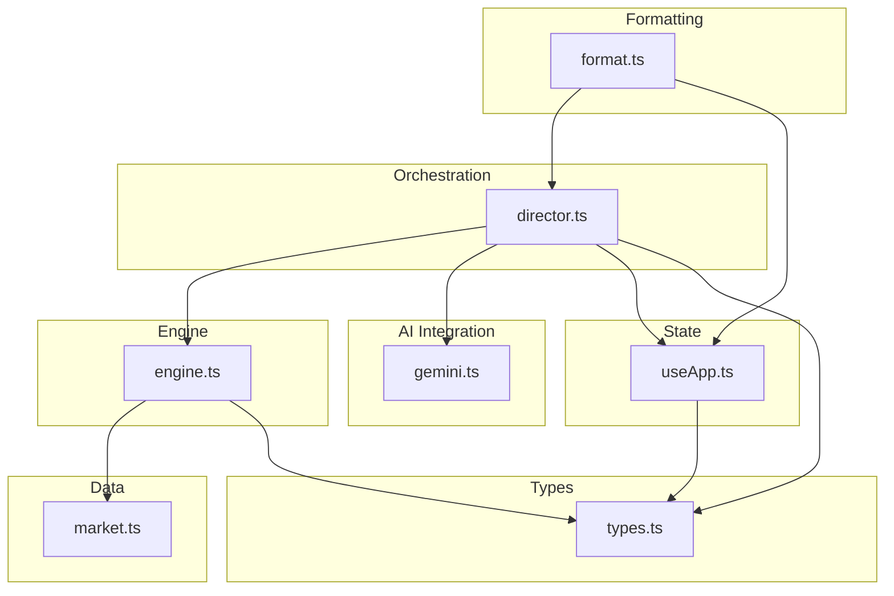
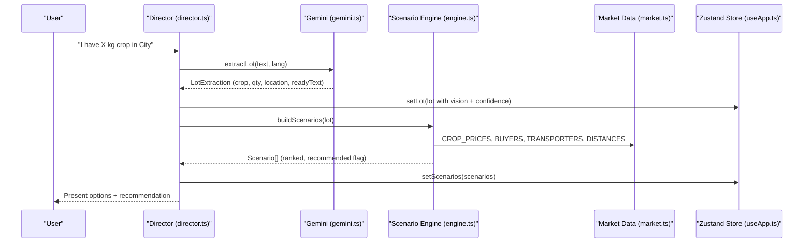
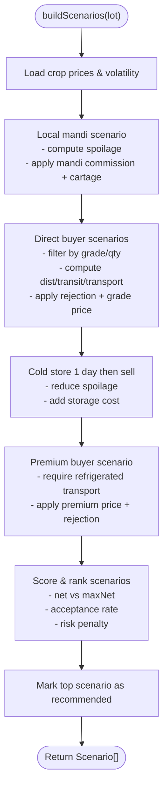
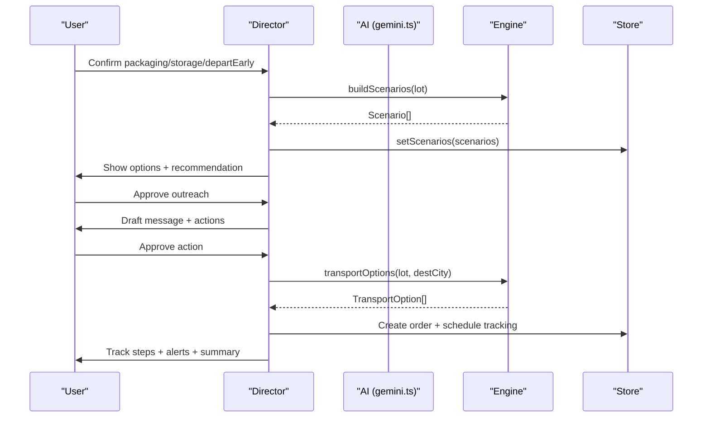
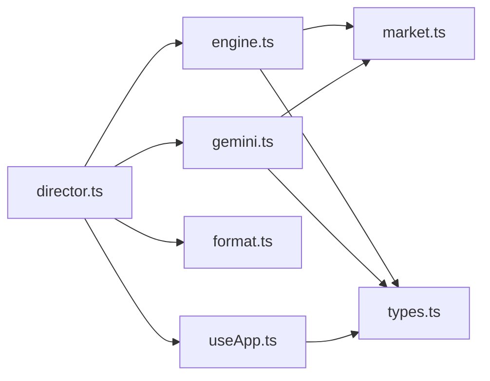

# Business Logic Layer

<cite>
**Referenced Files in This Document**
- [engine.ts](file://freshroute/src/lib/engine.ts)
- [market.ts](file://freshroute/src/data/market.ts)
- [format.ts](file://freshroute/src/lib/format.ts)
- [types.ts](file://freshroute/src/types.ts)
- [director.ts](file://freshroute/src/store/director.ts)
- [useApp.ts](file://freshroute/src/store/useApp.ts)
- [gemini.ts](file://freshroute/src/lib/gemini.ts)
</cite>

## Table of Contents
1. Introduction
2. Project Structure
3. Core Components
4. Architecture Overview
5. Detailed Component Analysis
6. Dependency Analysis
7. Performance Considerations
8. Troubleshooting Guide
9. Conclusion
10. Appendices

## Introduction
This document explains FreshRoute’s business logic layer with a focus on the supply chain calculation engine, market analysis algorithms, and data formatting utilities. It clarifies how business rules are separated from data processing and presentation logic, and it provides examples of scenario generation, cost calculations, and market intelligence processing. Finally, it outlines extensibility points for adding new business rules and market data sources.

## Project Structure
The business logic is organized into clear layers:
- Data layer: market constants, prices, buyers, transporters, storage facilities, distances, weather, and price ticker helpers.
- Engine layer: rule-based supply chain calculations (scenarios, spoilage, pricing factors, transport options).
- Formatting layer: currency, time, unit conversions, and unique IDs used across the app.
- Orchestration layer: director that drives user flows, integrates AI extraction/vision/chat, and updates application state.
- State layer: Zustand store holding messages, lot, scenarios, audit logs, and UI state.
- Types layer: shared TypeScript interfaces for all domain objects.

**Diagram sources**
- [engine.ts:1-258](file://freshroute/src/lib/engine.ts#L1-L258)
- [market.ts:1-189](file://freshroute/src/data/market.ts#L1-L189)
- [format.ts:1-21](file://freshroute/src/lib/format.ts#L1-L21)
- [director.ts:1-750](file://freshroute/src/store/director.ts#L1-L750)
- [useApp.ts:1-129](file://freshroute/src/store/useApp.ts#L1-L129)
- [types.ts:1-229](file://freshroute/src/types.ts#L1-L229)
- [gemini.ts:1-200](file://freshroute/src/lib/gemini.ts#L1-L200)

**Section sources**
- [engine.ts:1-258](file://freshroute/src/lib/engine.ts#L1-L258)
- [market.ts:1-189](file://freshroute/src/data/market.ts#L1-L189)
- [format.ts:1-21](file://freshroute/src/lib/format.ts#L1-L21)
- [director.ts:1-750](file://freshroute/src/store/director.ts#L1-L750)
- [useApp.ts:1-129](file://freshroute/src/store/useApp.ts#L1-L129)
- [types.ts:1-229](file://freshroute/src/types.ts#L1-L229)
- [gemini.ts:1-200](file://freshroute/src/lib/gemini.ts#L1-L200)

## Core Components
- Supply chain scenario engine: builds multiple sale scenarios (local mandi, direct buyer, cold storage then sell, premium buyer), computes gross/net revenue, deductions, spoilage, risk, and ranks them using a weighted scoring function.
- Market analysis: uses crop prices by city, volatility/perishability, buyer constraints (grade, quantity range, acceptance/rejection rates), transport costs, and platform fees to evaluate options.
- Transport modeling: calculates transport cost per km, ETA, and recommendations based on refrigeration needs and value vs. safety trade-offs.
- Data formatting: PKR currency formatting, clock time formatting, maund conversion, and unique ID generation.
- Orchestration and state: director manages conversation flow, integrates AI extraction/vision/chat, applies business rules, and persists results in the Zustand store.

Key responsibilities and separation of concerns:
- Business rules live in engine.ts (pricing factors, spoilage model, scoring, scenario construction).
- Market data lives in market.ts (prices, buyers, transporters, distances, weather, aliases).
- Formatting utilities live in format.ts (no business decisions).
- Orchestration lives in director.ts (user flow, approvals, messaging, AI integration).
- State lives in useApp.ts (messages, scenarios, audit log, UI flags).
- Types define contracts between components.

**Section sources**
- [engine.ts:10-235](file://freshroute/src/lib/engine.ts#L10-L235)
- [market.ts:13-189](file://freshroute/src/data/market.ts#L13-L189)
- [format.ts:1-21](file://freshroute/src/lib/format.ts#L1-L21)
- [director.ts:258-497](file://freshroute/src/store/director.ts#L258-L497)
- [useApp.ts:20-118](file://freshroute/src/store/useApp.ts#L20-L118)
- [types.ts:34-137](file://freshroute/src/types.ts#L34-L137)

## Architecture Overview
FreshRoute’s business logic follows a layered architecture:
- Input: user text/voice/photos processed via AI or fallback parsers to extract lot details.
- Processing: engine constructs scenarios using market data and business rules; director orchestrates steps and handles approvals.
- Output: formatted messages, scenarios, orders, and tracking updates presented through the UI state.

**Diagram sources**
- [director.ts:110-217](file://freshroute/src/store/director.ts#L110-L217)
- [gemini.ts:91-116](file://freshroute/src/lib/gemini.ts#L91-L116)
- [engine.ts:47-235](file://freshroute/src/lib/engine.ts#L47-L235)
- [market.ts:13-189](file://freshroute/src/data/market.ts#L13-L189)
- [useApp.ts:75-80](file://freshroute/src/store/useApp.ts#L75-L80)

## Detailed Component Analysis

### Supply Chain Calculation Engine
The engine implements transparent, explainable rules for produce supply chains:
- Grade price factor: adjusts base mandi price by grade (A/B/C).
- Packaging factor: crates/sacks/loose influence spoilage exposure.
- Spoilage model: daily exposure multiplied by crop volatility and packaging factor; refrigeration reduces spoilage; capped at a maximum loss.
- Scenarios:
  - Local mandi sale today: includes mandi commission and local cartage.
  - Direct wholesale buyer in nearby city: considers distance, transit days, transport cost, rejection rate, and grade-adjusted price.
  - Cold storage one day then sell: adds storage cost and reduced spoilage; evaluates best direct buyer path.
  - Premium buyer: higher price but stricter grade requirements and refrigerated transport; accounts for rejection risk.
- Ranking: weighted score combines net revenue, acceptance rate, and risk penalty; top scenario marked recommended.

**Diagram sources**
- [engine.ts:17-45](file://freshroute/src/lib/engine.ts#L17-L45)
- [engine.ts:47-235](file://freshroute/src/lib/engine.ts#L47-L235)

**Section sources**
- [engine.ts:17-45](file://freshroute/src/lib/engine.ts#L17-L45)
- [engine.ts:47-235](file://freshroute/src/lib/engine.ts#L47-L235)

### Market Analysis Algorithms
Market analysis leverages structured data:
- Crop prices by city: base revenue depends on destination city and grade adjustments.
- Buyer constraints: minimum/maximum quantities, grade acceptance, historical acceptance rate, rejection percentage, payment terms, response time.
- Transporters: vehicle type, refrigeration, cost per km, on-time reliability.
- Distances: route distances inform transit time and spoilage assumptions.
- Weather: contextual info for temperature and conditions affecting logistics.
- Price ticker: generates enriched price points with trend, freshness window, and confidence.

Extensibility:
- Add new crops/cities to CROP_PRICES and CROP_VOLATILITY.
- Register new buyers with constraints and performance metrics.
- Introduce additional transporters with cost and reliability profiles.
- Extend STORAGES for multi-city cold storage options.

**Section sources**
- [market.ts:13-189](file://freshroute/src/data/market.ts#L13-L189)

### Data Formatting Utilities
Formatting utilities ensure consistent presentation:
- Currency: PKR formatting with locale-aware thousands separators and short form for large amounts.
- Time: human-readable clock formatting with AM/PM.
- Units: conversion from kilograms to maund for local context.
- IDs: deterministic random IDs for messages and audit entries.

These utilities are pure functions with no side effects and are reused across orchestration and UI layers.

**Section sources**
- [format.ts:1-21](file://freshroute/src/lib/format.ts#L1-L21)

### Orchestration and Flow Control
The director coordinates the end-to-end flow:
- Boot sequence introduces the agent and prompts for intake.
- Intake flow extracts lot details via AI or fallback parser, validates supported crops, and requests photos.
- Photo analysis produces a vision result (grade, ripeness, defect rate, notes, confidence).
- Clarification collects packaging, storage availability, and departure timing.
- Scenario generation runs the engine and presents ranked options with recommendation rationale.
- Outreach approval drafts messages to buyers/commission agents; user must approve before sending.
- Offers flow computes expected net after transport, platform fee, mandi commission, storage, and loading.
- Final approval books transport and creates an order with tracking steps.
- Tracking simulation advances order steps, injects alerts for delays, and finalizes with a summary comparing actual vs. estimated outcomes.

**Diagram sources**
- [director.ts:258-497](file://freshroute/src/store/director.ts#L258-L497)
- [engine.ts:238-257](file://freshroute/src/lib/engine.ts#L238-L257)
- [useApp.ts:91-118](file://freshroute/src/store/useApp.ts#L91-L118)

**Section sources**
- [director.ts:84-156](file://freshroute/src/store/director.ts#L84-L156)
- [director.ts:175-254](file://freshroute/src/store/director.ts#L175-L254)
- [director.ts:258-497](file://freshroute/src/store/director.ts#L258-L497)
- [director.ts:499-597](file://freshroute/src/store/director.ts#L499-L597)

### AI Integration Points
- Extraction: AI proxy attempts to parse natural language into structured lot data; falls back to deterministic parser if unavailable or malformed.
- Vision: image analysis estimates grade, ripeness, defect rate, and confidence; fallback returns a safe demo estimate when needed.
- Chat: conversational responses incorporate lot summary, scenarios summary, and prices summary; fallback answers handle common questions about markets and recommendations.
- Error surfacing: last AI error is captured and surfaced once to the user, ensuring transparency when offline/demo mode is used.

**Section sources**
- [gemini.ts:28-42](file://freshroute/src/lib/gemini.ts#L28-L42)
- [gemini.ts:55-116](file://freshroute/src/lib/gemini.ts#L55-L116)
- [gemini.ts:118-161](file://freshroute/src/lib/gemini.ts#L118-L161)
- [gemini.ts:169-200](file://freshroute/src/lib/gemini.ts#L169-L200)

## Dependency Analysis
Coupling and cohesion:
- Engine depends on market data and types; it encapsulates business rules and is cohesive around scenario computation.
- Director depends on engine, gemini, format, and store; it orchestrates flows and maintains low coupling to specific implementations via typed interfaces.
- Store holds state and exposes actions; it is decoupled from business logic and only updates state based on director calls.
- Types provide a stable contract across modules, reducing coupling risks.

Potential circular dependencies:
- None observed; imports are directional: director → engine/gemini/format/store; engine → market/types; gemini → market/supabase/types.

External integrations:
- Supabase Edge Function proxy for Gemini API calls ensures secrets remain server-side.
- WhatsApp delivery is simulated via messaging; real integration would be added at the outreach step.

**Diagram sources**
- [director.ts:1-22](file://freshroute/src/store/director.ts#L1-L22)
- [engine.ts:1-8](file://freshroute/src/lib/engine.ts#L1-L8)
- [gemini.ts:1-3](file://freshroute/src/lib/gemini.ts#L1-L3)
- [useApp.ts:1-18](file://freshroute/src/store/useApp.ts#L1-L18)

**Section sources**
- [director.ts:1-22](file://freshroute/src/store/director.ts#L1-L22)
- [engine.ts:1-8](file://freshroute/src/lib/engine.ts#L1-L8)
- [gemini.ts:1-3](file://freshroute/src/lib/gemini.ts#L1-L3)
- [useApp.ts:1-18](file://freshroute/src/store/useApp.ts#L1-L18)

## Performance Considerations
- Scenario generation is O(n) over buyers and transporters; acceptable for small datasets. For scaling, consider caching buyer filters and precomputing distance matrices.
- Spoilage model uses simple arithmetic; avoid unnecessary recomputation by memoizing inputs where appropriate.
- Transport options map over transporters; negligible overhead.
- AI calls are asynchronous and may fail; fallbacks prevent blocking the UI. Batch or debounce repeated calls if needed.
- Store updates are minimal and targeted; keep actions focused to avoid re-renders.

[No sources needed since this section provides general guidance]

## Troubleshooting Guide
Common issues and resolutions:
- AI proxy unreachable: director surfaces an error message and switches to offline demo mode for the affected step; check network and Supabase Edge Function status.
- Malformed AI responses: fallbacks return safe defaults (e.g., VISION_FALLBACK); inspect logs and refine prompts or parsing.
- Unsupported crop: intake flow prompts to use a supported crop; extend CROP_PRICES and CROP_ALIASES to support new crops.
- No photos provided: lower confidence estimates are used; encourage photo capture for better grading accuracy.
- Scenario mismatch: verify buyer constraints (grade, min/max kg), distances, and transport costs; adjust market data or business rules accordingly.

Operational tips:
- Use audit entries to trace decisions and system actions.
- Leverage “Show all numbers” to validate deductions and net calculations.
- Monitor tracking alerts for delays and confirm counterparty notifications.

**Section sources**
- [gemini.ts:28-42](file://freshroute/src/lib/gemini.ts#L28-L42)
- [gemini.ts:118-161](file://freshroute/src/lib/gemini.ts#L118-L161)
- [director.ts:62-74](file://freshroute/src/store/director.ts#L62-L74)
- [director.ts:118-143](file://freshroute/src/store/director.ts#L118-L143)
- [director.ts:643-653](file://freshroute/src/store/director.ts#L643-L653)

## Conclusion
FreshRoute’s business logic layer cleanly separates concerns:
- Business rules reside in the engine, providing transparent, explainable calculations for supply chain scenarios.
- Market data is centralized and extensible, enabling easy addition of new crops, buyers, transporters, and storage facilities.
- Formatting utilities ensure consistent presentation without influencing business decisions.
- The director orchestrates user flows, integrates AI robustly with fallbacks, and updates state immutably.
- Extensibility points include expanding market data, adding new scenario types, and integrating external services (e.g., WhatsApp, GPS tracking) while preserving separation of concerns.

[No sources needed since this section summarizes without analyzing specific files]

## Appendices

### Example: Scenario Generation
- Inputs: lot details (crop, quantity, location, packaging, storage availability, departure timing), market prices, buyer constraints, transporters, distances.
- Process: engine computes spoilage, gross revenue, deductions (commission, transport, platform fee, storage, loading), accepted quantity, risk, and scores each scenario.
- Output: ranked scenarios with recommended flag and explanatory reasons.

**Section sources**
- [engine.ts:47-235](file://freshroute/src/lib/engine.ts#L47-L235)

### Example: Cost Calculations
- Local mandi: mandi commission and local cartage applied to gross; same-day payment terms.
- Direct buyer: transport cost based on distance and transporter; platform fee applied; grade-adjusted price; rejection reduces accepted quantity.
- Cold storage: storage cost per kg per day; reduced spoilage; evaluate against potential price uplift.
- Premium buyer: refrigerated transport required; higher price but stricter grade and rejection risk.

**Section sources**
- [engine.ts:52-224](file://freshroute/src/lib/engine.ts#L52-L224)

### Example: Market Intelligence Processing
- Price ticker: generates enriched price points with trend, freshness window, and confidence.
- Weather: contextual temperature and condition info for logistics planning.
- Aliases: normalize crop names across languages and variants.

**Section sources**
- [market.ts:174-189](file://freshroute/src/data/market.ts#L174-L189)
- [market.ts:26-58](file://freshroute/src/data/market.ts#L26-L58)

### Extensibility Points
- Add new crops: update CROP_PRICES, CROP_VOLATILITY, and CROP_ALIASES.
- Add new buyers: register with grade, quantity ranges, acceptance/rejection metrics, payment terms, and response times.
- Add new transporters: specify vehicle type, refrigeration, cost per km, and on-time reliability.
- Add storage facilities: include city, temperature, per-kg-per-day cost, and verification status.
- New scenario types: implement additional branches in buildScenarios following existing patterns (compute spoilage, deductions, risk, score).

**Section sources**
- [market.ts:13-189](file://freshroute/src/data/market.ts#L13-L189)
- [engine.ts:47-235](file://freshroute/src/lib/engine.ts#L47-L235)