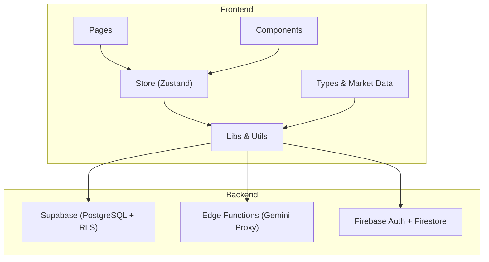
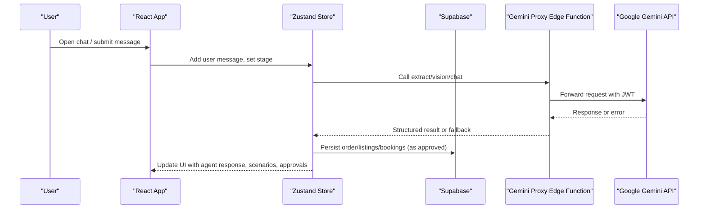
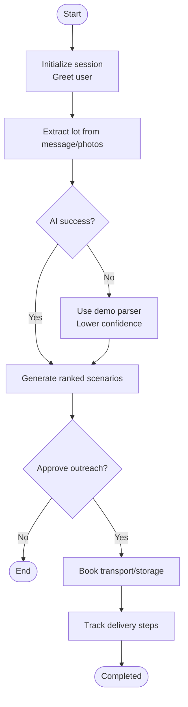
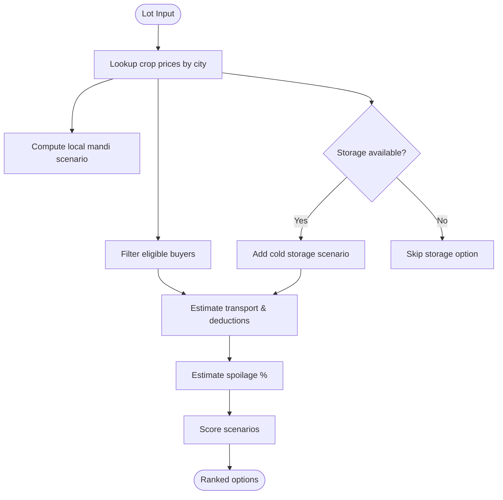
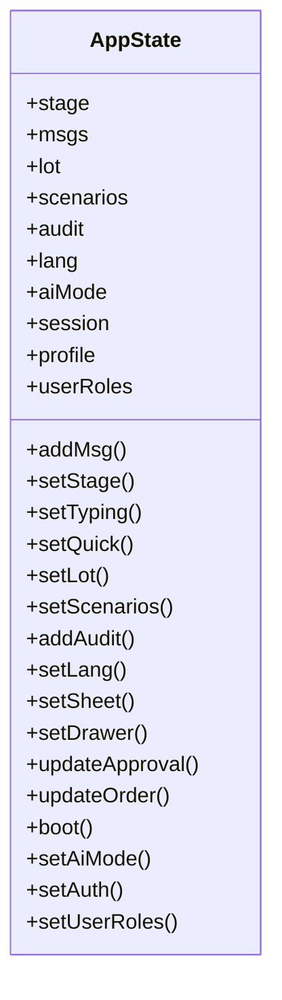
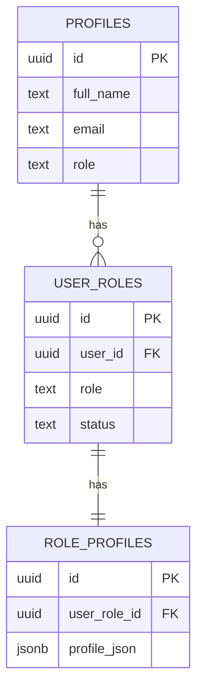
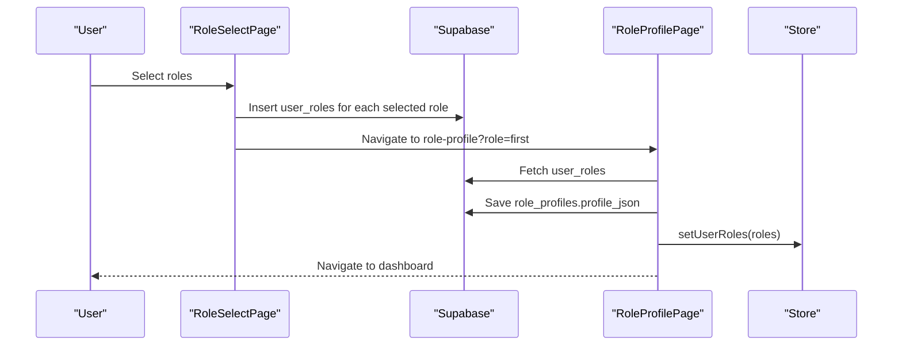
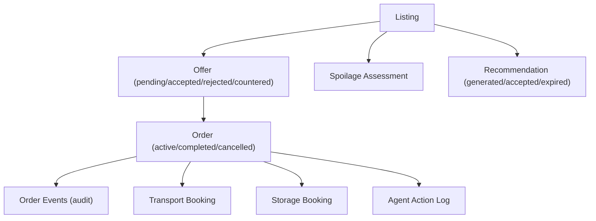
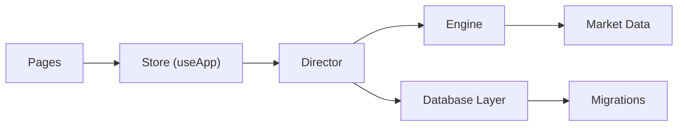

# Multi-Role Marketplace System

<cite>
**Referenced Files in This Document**
- [README.md](file://README.md)
- [package.json](file://freshroute/package.json)
- [App.tsx](file://freshroute/src/App.tsx)
- [main.tsx](file://freshroute/src/main.tsx)
- [types.ts](file://freshroute/src/types.ts)
- [director.ts](file://freshroute/src/store/director.ts)
- [useApp.ts](file://freshroute/src/store/useApp.ts)
- [engine.ts](file://freshroute/src/lib/engine.ts)
- [market.ts](file://freshroute/src/data/market.ts)
- [0003_multi_role.sql](file://freshroute/supabase/migrations/0003_multi_role.sql)
- [0005_marketplace_tables.sql](file://freshroute/supabase/migrations/0005_marketplace_tables.sql)
- [db.ts](file://freshroute/src/lib/db.ts)
- [RoleSelectPage.tsx](file://freshroute/src/pages/RoleSelectPage.tsx)
- [RoleProfilePage.tsx](file://freshroute/src/pages/RoleProfilePage.tsx)
</cite>

## Table of Contents
1. Introduction
2. Project Structure
3. Core Components
4. Architecture Overview
5. Detailed Component Analysis
6. Dependency Analysis
7. Performance Considerations
8. Troubleshooting Guide
9. Conclusion

## Introduction
This document explains the Multi-Role Marketplace System built as part of FreshRoute Agent. It is an AI-powered produce trading platform that supports multiple marketplace roles (farmer, buyer, transporter, storage provider, admin) and orchestrates end-to-end workflows from intake to payment with explicit user approvals at every financial step. The system combines a React frontend, Supabase backend, Firebase Auth/Firestore for telemetry, and a Gemini proxy Edge Function for AI capabilities.

Key highlights:
- Multi-role marketplace with per-role profiles stored as JSONB
- Conversation-driven workflow orchestrated by a state machine
- Deterministic scenario generation with spoilage modeling and transport cost optimization
- Approval-first design with audit trails
- Admin portal for system oversight and analytics

**Section sources**
- [README.md:48-141](file://README.md#L48-L141)
- [README.md:181-227](file://README.md#L181-L227)

## Project Structure
The application follows a feature-oriented structure:
- Frontend pages under src/pages
- Reusable UI components under src/components
- Business logic and utilities under src/lib
- Data models and market constants under src/data and src/types
- State management via Zustand store in src/store
- Backend schema and migrations under supabase/migrations
- Edge functions under supabase/functions

**Diagram sources**
- [main.tsx:50-99](file://freshroute/src/main.tsx#L50-L99)
- [App.tsx:14-33](file://freshroute/src/App.tsx#L14-L33)
- [useApp.ts:21-58](file://freshroute/src/store/useApp.ts#L21-L58)
- [engine.ts:1-18](file://freshroute/src/lib/engine.ts#L1-L18)
- [market.ts:1-24](file://freshroute/src/data/market.ts#L1-L24)
- [0003_multi_role.sql:1-14](file://freshroute/supabase/migrations/0003_multi_role.sql#L1-L14)

**Section sources**
- [README.md:337-444](file://README.md#L337-L444)
- [package.json:12-56](file://freshroute/package.json#L12-L56)

## Core Components
- Conversation Director: Orchestrates multi-step workflows (intake → analyze → scenarios → outreach → approval → booking → tracking).
- Calculation Engine: Generates market scenarios, estimates spoilage, scores options, and computes transport costs.
- Global Store: Centralized state for messages, stage, lot, scenarios, audit log, language, auth session, and roles.
- Role Management: Multi-role support with per-role profile data and migration-backed schema.
- Database Layer: CRUD operations for orders, listings, offers, bookings, and role-related entities.

**Section sources**
- [director.ts:100-200](file://freshroute/src/store/director.ts#L100-L200)
- [engine.ts:76-200](file://freshroute/src/lib/engine.ts#L76-L200)
- [useApp.ts:21-124](file://freshroute/src/store/useApp.ts#L21-L124)
- [0003_multi_role.sql:7-47](file://freshroute/supabase/migrations/0003_multi_role.sql#L7-L47)
- [db.ts:76-114](file://freshroute/src/lib/db.ts#L76-L114)

## Architecture Overview
The system integrates frontend flows with backend services and AI capabilities:
- React app routes protect user/admin areas and lazy-load pages
- Zustand store drives UI state and conversation flow
- Supabase provides secure data access with Row Level Security
- Gemini proxy Edge Function validates JWT and proxies AI calls server-side
- Firebase Auth handles sign-in; Firestore logs AI usage for admin monitoring

**Diagram sources**
- [main.tsx:50-99](file://freshroute/src/main.tsx#L50-L99)
- [director.ts:100-200](file://freshroute/src/store/director.ts#L100-L200)
- [engine.ts:76-200](file://freshroute/src/lib/engine.ts#L76-L200)
- [db.ts:76-114](file://freshroute/src/lib/db.ts#L76-L114)

## Detailed Component Analysis

### Conversation Director (State Machine)
The director manages the lifecycle of a trade conversation:
- Boot sequence initializes session and prompts user
- Intake flow extracts structured lot data using AI or fallback parsing
- Scenario generation uses engine to compare local mandi vs direct buyers vs cold storage
- Approval gates ensure no financial action without explicit consent
- Tracking simulates delivery progress and updates order steps

**Diagram sources**
- [director.ts:100-200](file://freshroute/src/store/director.ts#L100-L200)
- [engine.ts:76-200](file://freshroute/src/lib/engine.ts#L76-L200)

**Section sources**
- [director.ts:100-200](file://freshroute/src/store/director.ts#L100-L200)

### Calculation Engine (Scenarios, Spoilage, Transport)
The engine builds deterministic sell-options:
- Local mandi sale with commission and loading costs
- Direct wholesale buyers filtered by grade, quantity, and city distance
- Cold storage option when available, adding storage cost and reduced spoilage
- Spoilage model blends exponential decay with simple rules and weather factors
- Scoring balances net revenue, acceptance rate, and risk penalties

**Diagram sources**
- [engine.ts:76-200](file://freshroute/src/lib/engine.ts#L76-L200)
- [market.ts:13-24](file://freshroute/src/data/market.ts#L13-L24)

**Section sources**
- [engine.ts:76-200](file://freshroute/src/lib/engine.ts#L76-L200)
- [market.ts:13-24](file://freshroute/src/data/market.ts#L13-L24)

### Global Store (Zustand)
Centralized state includes:
- Stage, messages, typing indicators, quick replies
- Current lot, generated scenarios, audit entries
- Language, sheets, drawer visibility
- AI mode and errors
- Auth session and profile
- Active user roles for multi-role UX

**Diagram sources**
- [useApp.ts:21-124](file://freshroute/src/store/useApp.ts#L21-L124)

**Section sources**
- [useApp.ts:21-124](file://freshroute/src/store/useApp.ts#L21-L124)

### Multi-Role Schema and Profiles
Multi-role support enables users to act as farmer, buyer, transporter, or storage provider:
- user_roles table links users to roles with status
- role_profiles stores per-role extended attributes as JSONB
- Triggers keep backward compatibility by syncing primary role to profiles.role
- Auto-assign farmer role on signup

**Diagram sources**
- [0003_multi_role.sql:7-47](file://freshroute/supabase/migrations/0003_multi_role.sql#L7-L47)
- [0003_multi_role.sql:86-148](file://freshroute/supabase/migrations/0003_multi_role.sql#L86-L148)

**Section sources**
- [0003_multi_role.sql:7-47](file://freshroute/supabase/migrations/0003_multi_role.sql#L7-L47)
- [0003_multi_role.sql:86-148](file://freshroute/supabase/migrations/0003_multi_role.sql#L86-L148)
- [types.ts:5-57](file://freshroute/src/types.ts#L5-L57)

### Role Selection and Profile Setup Flow
Users select one or more roles and complete per-role profiles:
- Role selection page allows toggling roles and saving them
- Redirects to role-specific profile form
- Fetches user roles and saves JSONB profile data
- Updates store with active roles and navigates to dashboard

**Diagram sources**
- [RoleSelectPage.tsx:57-80](file://freshroute/src/pages/RoleSelectPage.tsx#L57-L80)
- [RoleProfilePage.tsx:24-43](file://freshroute/src/pages/RoleProfilePage.tsx#L24-L43)
- [0003_multi_role.sql:7-47](file://freshroute/supabase/migrations/0003_multi_role.sql#L7-L47)

**Section sources**
- [RoleSelectPage.tsx:57-80](file://freshroute/src/pages/RoleSelectPage.tsx#L57-L80)
- [RoleProfilePage.tsx:24-43](file://freshroute/src/pages/RoleProfilePage.tsx#L24-L43)

### Orders and Marketplace Tables
Marketplace tables consolidate offers, events, bookings, spoilage assessments, recommendations, and agent action logs:
- Offers linked to listings with status transitions
- Order events provide audit trail for order lifecycle
- Transport and storage bookings track logistics
- Recommendations persist generated options and chosen paths
- Agent action log records AI-driven actions with approval flags

**Diagram sources**
- [0005_marketplace_tables.sql:5-134](file://freshroute/supabase/migrations/0005_marketplace_tables.sql#L5-L134)

**Section sources**
- [0005_marketplace_tables.sql:5-134](file://freshroute/supabase/migrations/0005_marketplace_tables.sql#L5-L134)
- [db.ts:76-114](file://freshroute/src/lib/db.ts#L76-L114)

## Dependency Analysis
Key dependencies and relationships:
- Pages depend on Zustand store for state and routing guards
- Store depends on director for workflow orchestration
- Director depends on engine for scenario computation and gemini client for AI
- Engine depends on market data constants and spoilage utilities
- Database layer abstracts Supabase queries for orders, listings, and roles
- Migrations define schema constraints and policies ensuring security

**Diagram sources**
- [main.tsx:50-99](file://freshroute/src/main.tsx#L50-L99)
- [useApp.ts:21-124](file://freshroute/src/store/useApp.ts#L21-L124)
- [director.ts:100-200](file://freshroute/src/store/director.ts#L100-L200)
- [engine.ts:76-200](file://freshroute/src/lib/engine.ts#L76-L200)
- [market.ts:13-24](file://freshroute/src/data/market.ts#L13-L24)
- [0003_multi_role.sql:7-47](file://freshroute/supabase/migrations/0003_multi_role.sql#L7-L47)

**Section sources**
- [main.tsx:50-99](file://freshroute/src/main.tsx#L50-L99)
- [useApp.ts:21-124](file://freshroute/src/store/useApp.ts#L21-L124)
- [director.ts:100-200](file://freshroute/src/store/director.ts#L100-L200)
- [engine.ts:76-200](file://freshroute/src/lib/engine.ts#L76-L200)
- [market.ts:13-24](file://freshroute/src/data/market.ts#L13-L24)
- [0003_multi_role.sql:7-47](file://freshroute/supabase/migrations/0003_multi_role.sql#L7-L47)

## Performance Considerations
- Lazy-loading pages reduces initial bundle size and improves load times
- Zustand store minimizes re-renders by selective selectors
- Deterministic scenario generation avoids heavy AI calls where possible
- Fallback modes ensure responsiveness when AI services are unavailable
- Indexed database queries and RLS policies optimize read/write performance and security

[No sources needed since this section provides general guidance]

## Troubleshooting Guide
Common issues and resolutions:
- Missing environment variables cause backend connection failures; add Supabase URL and anon key
- Authentication provider misconfiguration leads to sign-in errors; enable Email/Password and Google providers in Firebase
- Firestore permission denied indicates missing security rules; deploy appropriate rules
- AI badge shows ERROR if Edge Function not deployed or secret missing; deploy function and set secrets
- Empty dashboard after signup may require seed data; run seed migration or create first lot via chat

**Section sources**
- [README.md:692-704](file://README.md#L692-L704)

## Conclusion
The Multi-Role Marketplace System provides a robust foundation for produce trading with clear separation of concerns, secure data handling, and AI-enhanced decision support. Its multi-role architecture enables diverse participants to collaborate effectively, while approval-first workflows and audit trails maintain transparency and trust. The modular design supports future enhancements such as expanded market integrations, advanced matching algorithms, and richer analytics.

[No sources needed since this section summarizes without analyzing specific files]