# Frontend Architecture

<cite>
**Referenced Files in This Document**
- [App.tsx](file://freshroute/src/App.tsx)
- [PhoneFrame.tsx](file://freshroute/src/components/PhoneFrame.tsx)
- [ChatHeader.tsx](file://freshroute/src/components/ChatHeader.tsx)
- [ChatBody.tsx](file://freshroute/src/components/ChatBody.tsx)
- [ChatInput.tsx](file://freshroute/src/components/ChatInput.tsx)
- [PhotoSheet.tsx](file://freshroute/src/components/PhotoSheet.tsx)
- [SettingsSheet.tsx](file://freshroute/src/components/SettingsSheet.tsx)
- [AuditDrawer.tsx](file://freshroute/src/components/AuditDrawer.tsx)
- [QuickReplies.tsx](file://freshroute/src/components/QuickReplies.tsx)
- [PriceTicker.tsx](file://freshroute/src/components/PriceTicker.tsx)
- [useApp.ts](file://freshroute/src/store/useApp.ts)
- [director.ts](file://freshroute/src/store/director.ts)
- [types.ts](file://freshroute/src/types.ts)
</cite>

## Table of Contents
1. [Introduction](#introduction)
2. [Project Structure](#project-structure)
3. [Core Components](#core-components)
4. [Architecture Overview](#architecture-overview)
5. [Detailed Component Analysis](#detailed-component-analysis)
6. [Dependency Analysis](#dependency-analysis)
7. [Performance Considerations](#performance-considerations)
8. [Troubleshooting Guide](#troubleshooting-guide)
9. [Conclusion](#conclusion)

## Introduction
This document explains the frontend architecture of FreshRoute’s React-based chat interface. The app is organized around a mobile-first phone frame that hosts a conversational UI with state-driven rendering. App orchestrates child components and conditionally renders sheets based on global sheet state. Chat interactions are driven by a central store and director flow, which updates messages, stages, and UI overlays such as PhotoSheet, SettingsSheet, and AuditDrawer.

## Project Structure
The application follows a component-based structure:
- App is the root container that composes PhoneFrame and all visible UI parts.
- PhoneFrame provides the responsive phone-shaped viewport and background.
- ChatHeader, ChatBody, QuickReplies, and ChatInput form the core conversation surface.
- PhotoSheet and SettingsSheet are overlay panels controlled by global sheet state.
- AuditDrawer is an always-present side panel toggled via global drawer state.
- useApp (Zustand store) holds UI state; director contains business flows and actions that mutate state.

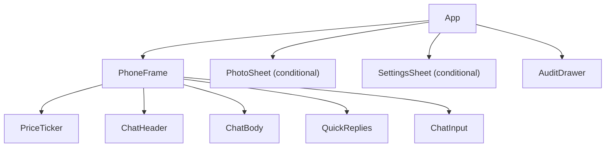

**Diagram sources**
- [App.tsx:21-32](file://freshroute/src/App.tsx#L21-L32)
- [PhoneFrame.tsx:3-55](file://freshroute/src/components/PhoneFrame.tsx#L3-L55)

**Section sources**
- [App.tsx:1-37](file://freshroute/src/App.tsx#L1-L37)
- [PhoneFrame.tsx:1-56](file://freshroute/src/components/PhoneFrame.tsx#L1-L56)

## Core Components
- PhoneFrame: Wraps children in a responsive phone-like container with backdrop and desktop sidebar content. It ensures the chat UI fits within a centered, rounded device frame on larger screens while filling the viewport on mobile.
- ChatHeader: Displays branding, language toggle, audit log trigger, and settings trigger. Updates global store for language and opens drawers/sheets.
- ChatBody: Renders message history from the store, including text, voice, photos, lot details, scenarios, approvals, offers, orders, alerts, and summaries. Auto-scrolls to the latest message. Shows a typing indicator when the agent is processing.
- ChatInput: Provides text input, photo attachment button, and voice note simulation. Sends user text or triggers voice flow via director.
- PhotoSheet: Overlay to select sample or uploaded images and submit them for analysis. Closes via setSheet("none").
- SettingsSheet: Overlay showing AI mode status, backend configuration notice, and reset action. Can refresh AI mode status.
- AuditDrawer: Side panel listing timestamped actions by Agent, You, and System. Toggleable via header button.
- QuickReplies: Horizontal chips rendered when available; clicking triggers director actions.
- PriceTicker: Scrolling ticker of market prices sourced from store data.

**Section sources**
- [ChatHeader.tsx:1-59](file://freshroute/src/components/ChatHeader.tsx#L1-L59)
- [ChatBody.tsx:1-85](file://freshroute/src/components/ChatBody.tsx#L1-L85)
- [ChatInput.tsx:1-87](file://freshroute/src/components/ChatInput.tsx#L1-L87)
- [PhotoSheet.tsx:1-106](file://freshroute/src/components/PhotoSheet.tsx#L1-L106)
- [SettingsSheet.tsx:1-166](file://freshroute/src/components/SettingsSheet.tsx#L1-L166)
- [AuditDrawer.tsx:1-95](file://freshroute/src/components/AuditDrawer.tsx#L1-L95)
- [QuickReplies.tsx:1-30](file://freshroute/src/components/QuickReplies.tsx#L1-L30)
- [PriceTicker.tsx:1-35](file://freshroute/src/components/PriceTicker.tsx#L1-L35)

## Architecture Overview
At runtime, App mounts PhoneFrame and composes the chat UI. Global state in useApp drives conditional rendering of PhotoSheet and SettingsSheet based on sheet value. Director functions handle user actions and orchestrate multi-step flows, updating messages, stages, and UI overlays. ChatBody reacts to store changes to render the appropriate message card types.

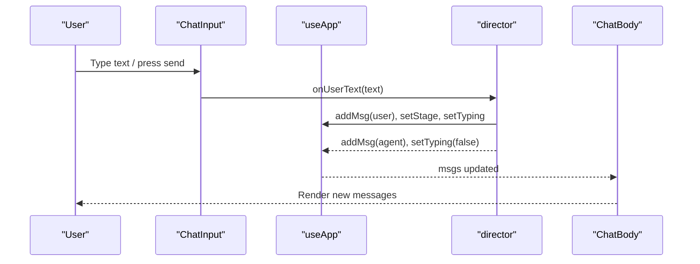

**Diagram sources**
- [ChatInput.tsx:13-18](file://freshroute/src/components/ChatInput.tsx#L13-L18)
- [director.ts:145-156](file://freshroute/src/store/director.ts#L145-L156)
- [useApp.ts:75-77](file://freshroute/src/store/useApp.ts#L75-L77)
- [ChatBody.tsx:32-84](file://freshroute/src/components/ChatBody.tsx#L32-L84)

## Detailed Component Analysis

### App Orchestrator
- Composes PhoneFrame and all child components.
- Uses global sheet state to conditionally render PhotoSheet and SettingsSheet.
- Boots the session on mount via director.boot().

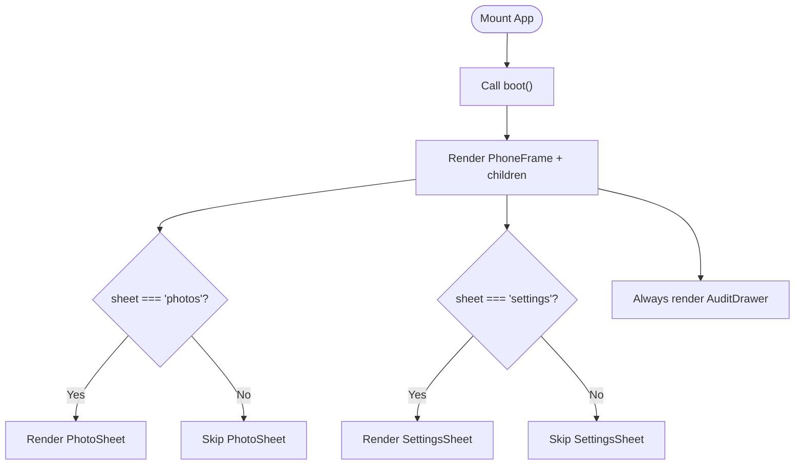

**Diagram sources**
- [App.tsx:14-32](file://freshroute/src/App.tsx#L14-L32)

**Section sources**
- [App.tsx:1-37](file://freshroute/src/App.tsx#L1-L37)

### PhoneFrame Container
- Provides a full-viewport background and centers a phone-shaped container on larger screens.
- On mobile, fills the screen; on desktop, shows a descriptive sidebar alongside the phone.

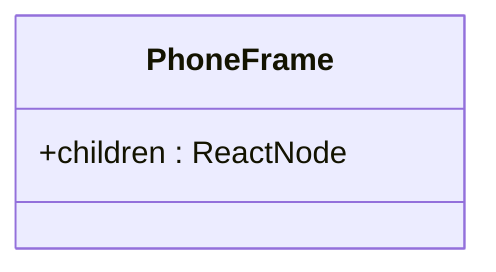

**Diagram sources**
- [PhoneFrame.tsx:3-55](file://freshroute/src/components/PhoneFrame.tsx#L3-L55)

**Section sources**
- [PhoneFrame.tsx:1-56](file://freshroute/src/components/PhoneFrame.tsx#L1-L56)

### ChatHeader
- Displays branding, online status, and current AI mode badge.
- Toggles language between English and Urdu via store.
- Opens AuditDrawer and SettingsSheet via store setters.

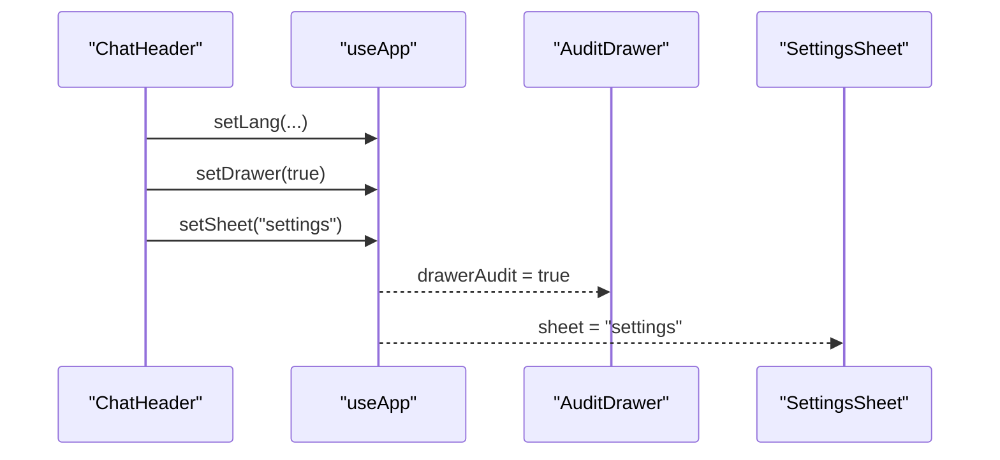

**Diagram sources**
- [ChatHeader.tsx:6-55](file://freshroute/src/components/ChatHeader.tsx#L6-L55)

**Section sources**
- [ChatHeader.tsx:1-59](file://freshroute/src/components/ChatHeader.tsx#L1-L59)

### ChatBody Rendering Logic
- Reads messages and typing state from store.
- Switches on message kind to render specialized cards (text, voice, photos, lot, clarify, scenarios, approval, offers, order, alert, summary).
- Auto-scrolls to bottom on message or typing changes.

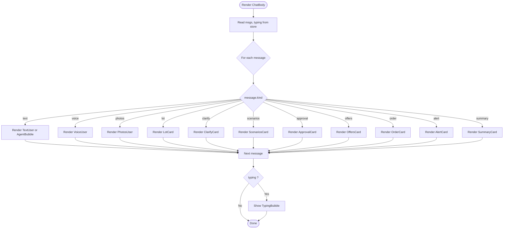

**Diagram sources**
- [ChatBody.tsx:32-84](file://freshroute/src/components/ChatBody.tsx#L32-L84)

**Section sources**
- [ChatBody.tsx:1-85](file://freshroute/src/components/ChatBody.tsx#L1-L85)

### ChatInput Interactions
- Local state manages input value and recording state.
- Send triggers onUserText via director; clears input.
- Voice note simulates recording and calls onVoiceNote.
- Photo attachment opens PhotoSheet via setSheet("photos").

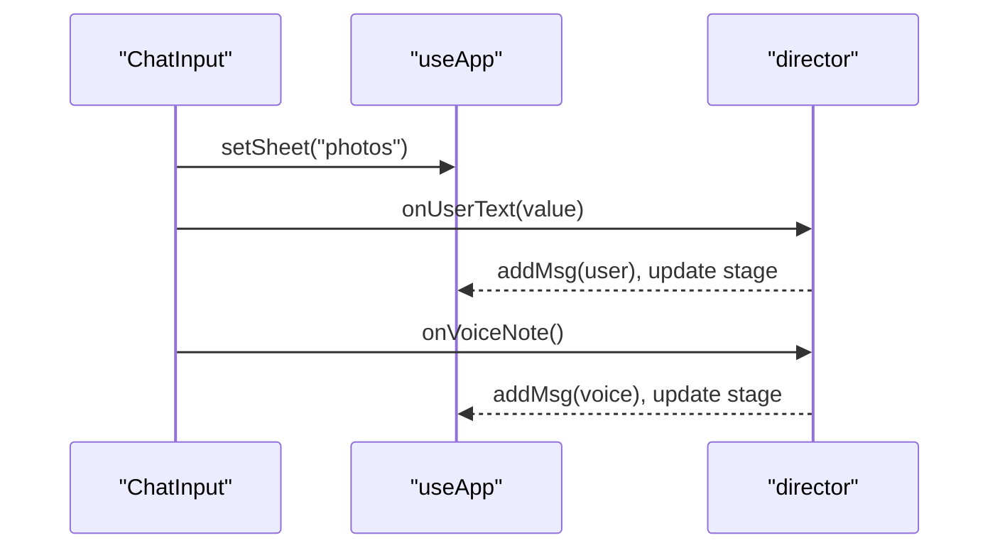

**Diagram sources**
- [ChatInput.tsx:13-26](file://freshroute/src/components/ChatInput.tsx#L13-L26)
- [director.ts:145-171](file://freshroute/src/store/director.ts#L145-L171)

**Section sources**
- [ChatInput.tsx:1-87](file://freshroute/src/components/ChatInput.tsx#L1-L87)

### PhotoSheet
- Allows selecting up to three sample or uploaded images.
- Submits selected photos via onPhotosChosen, then closes itself by setting sheet to "none".

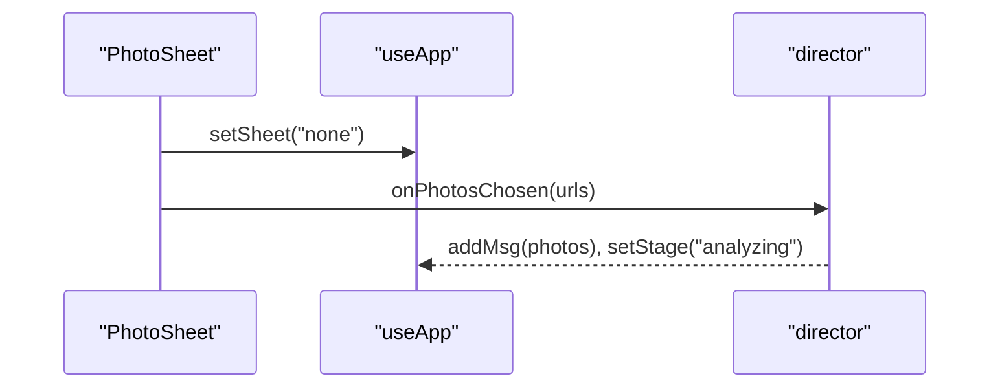

**Diagram sources**
- [PhotoSheet.tsx:15-33](file://freshroute/src/components/PhotoSheet.tsx#L15-L33)
- [PhotoSheet.tsx:89-101](file://freshroute/src/components/PhotoSheet.tsx#L89-L101)
- [director.ts:175-217](file://freshroute/src/store/director.ts#L175-L217)

**Section sources**
- [PhotoSheet.tsx:1-106](file://freshroute/src/components/PhotoSheet.tsx#L1-L106)

### SettingsSheet
- Displays AI engine mode and error info.
- Refreshes AI mode by calling refreshAiMode.
- Shows backend configuration warning if not configured.

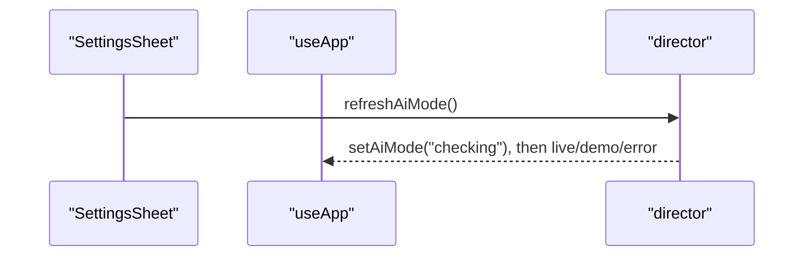

**Diagram sources**
- [SettingsSheet.tsx:14-18](file://freshroute/src/components/SettingsSheet.tsx#L14-L18)
- [director.ts:745-749](file://freshroute/src/store/director.ts#L745-L749)

**Section sources**
- [SettingsSheet.tsx:1-166](file://freshroute/src/components/SettingsSheet.tsx#L1-L166)

### AuditDrawer
- Slides in/out based on drawerAudit flag.
- Lists timestamped actions with actor labels and optional approval indicators.
- Closes via setDrawer(false).

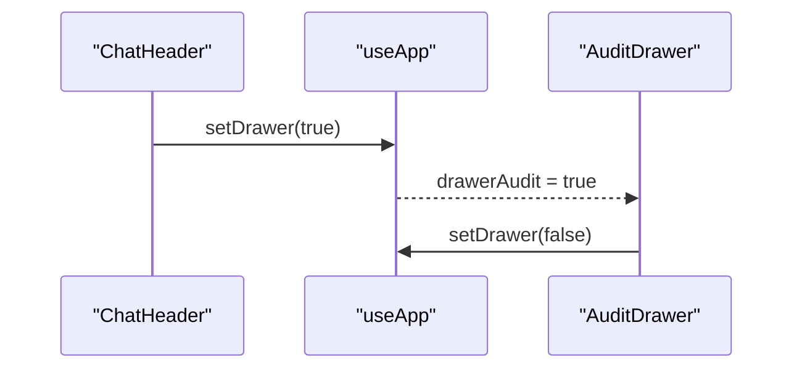

**Diagram sources**
- [ChatHeader.tsx:42-48](file://freshroute/src/components/ChatHeader.tsx#L42-L48)
- [AuditDrawer.tsx:6-34](file://freshroute/src/components/AuditDrawer.tsx#L6-L34)

**Section sources**
- [AuditDrawer.tsx:1-95](file://freshroute/src/components/AuditDrawer.tsx#L1-L95)

### QuickReplies and PriceTicker
- QuickReplies renders actionable chips when available; hides during typing.
- PriceTicker displays scrolling market prices from store.

**Section sources**
- [QuickReplies.tsx:1-30](file://freshroute/src/components/QuickReplies.tsx#L1-L30)
- [PriceTicker.tsx:1-35](file://freshroute/src/components/PriceTicker.tsx#L1-L35)

## Dependency Analysis
- App depends on PhoneFrame and all chat components; conditionally includes PhotoSheet and SettingsSheet based on store.sheet.
- ChatHeader, ChatInput, PhotoSheet, SettingsSheet, and AuditDrawer depend on useApp for state and setters.
- ChatBody depends on useApp for messages and typing state.
- director coordinates flows and mutates store; components call director functions to drive state transitions.
- types define shared structures used across components and store.

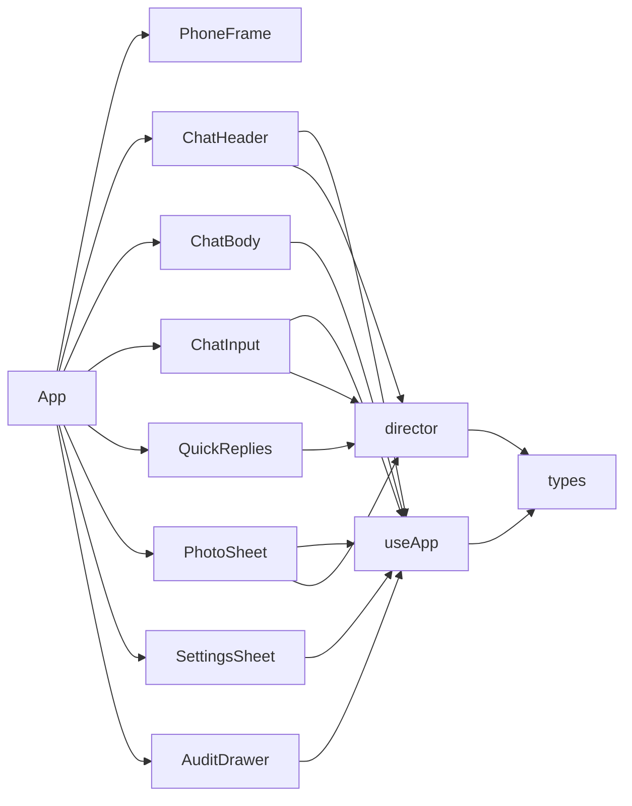

**Diagram sources**
- [App.tsx:1-32](file://freshroute/src/App.tsx#L1-L32)
- [useApp.ts:20-54](file://freshroute/src/store/useApp.ts#L20-L54)
- [director.ts:1-22](file://freshroute/src/store/director.ts#L1-L22)
- [types.ts:187-229](file://freshroute/src/types.ts#L187-L229)

**Section sources**
- [useApp.ts:1-129](file://freshroute/src/store/useApp.ts#L1-L129)
- [director.ts:1-750](file://freshroute/src/store/director.ts#L1-L750)
- [types.ts:1-229](file://freshroute/src/types.ts#L1-L229)

## Performance Considerations
- Message list rendering: ChatBody maps over messages; ensure keys are stable (ids) to minimize re-renders.
- Auto-scroll: ChatBody scrolls into view on message changes; consider debouncing rapid updates if needed.
- Overlays: PhotoSheet and SettingsSheet are conditionally rendered; keep logic simple to avoid unnecessary layout shifts.
- Ticker: PriceTicker duplicates items for seamless marquee; ensure data size remains small.
- State granularity: useApp selectors subscribe only to needed fields to limit re-renders.

[No sources needed since this section provides general guidance]

## Troubleshooting Guide
- Sheets not closing: Ensure setSheet("none") is called after submission or close actions in PhotoSheet and SettingsSheet.
- AuditDrawer not opening: Verify ChatHeader sets drawerAudit to true and that AuditDrawer reads drawerAudit correctly.
- Messages not appearing: Confirm director adds messages via addMsg and that ChatBody subscribes to msgs.
- AI mode stale: Use SettingsSheet’s refresh action to call refreshAiMode and update mode badge.

**Section sources**
- [PhotoSheet.tsx:40-49](file://freshroute/src/components/PhotoSheet.tsx#L40-L49)
- [SettingsSheet.tsx:21-31](file://freshroute/src/components/SettingsSheet.tsx#L21-L31)
- [ChatHeader.tsx:42-55](file://freshroute/src/components/ChatHeader.tsx#L42-L55)
- [ChatBody.tsx:32-84](file://freshroute/src/components/ChatBody.tsx#L32-L84)
- [director.ts:745-749](file://freshroute/src/store/director.ts#L745-L749)

## Conclusion
FreshRoute’s frontend uses a clear, component-based architecture centered on a phone-frame container and a state-driven chat interface. App orchestrates composition and conditional overlays, while useApp and director manage state and flows. The design supports mobile-first responsiveness, modular composition, and robust UI updates tied to user actions and agent responses.