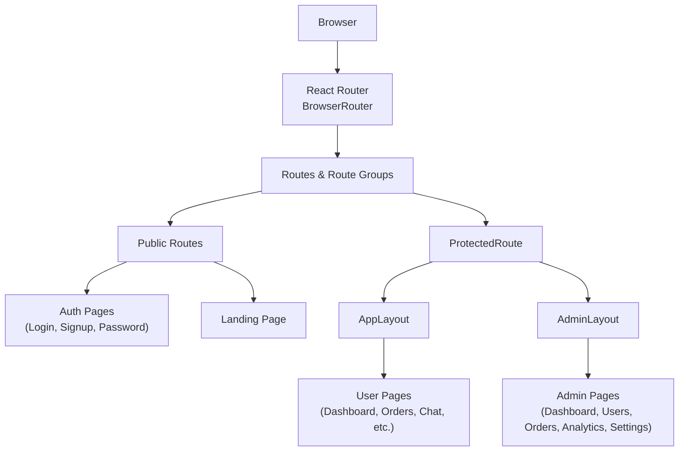
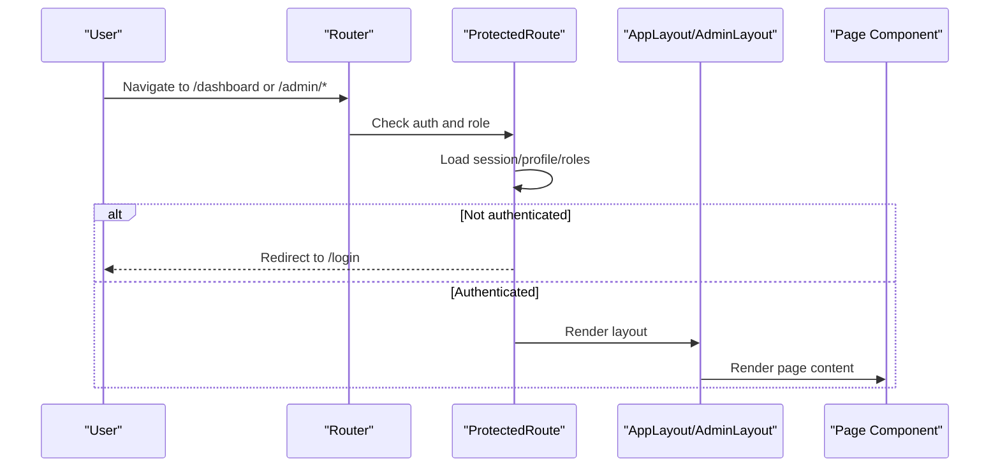
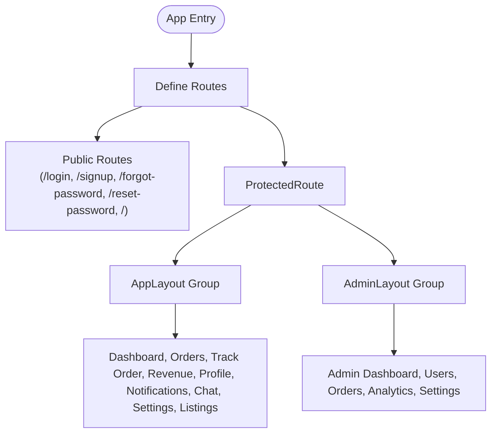
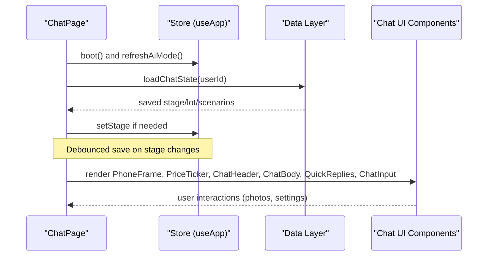
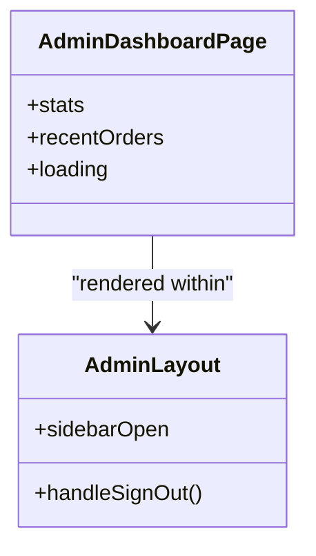
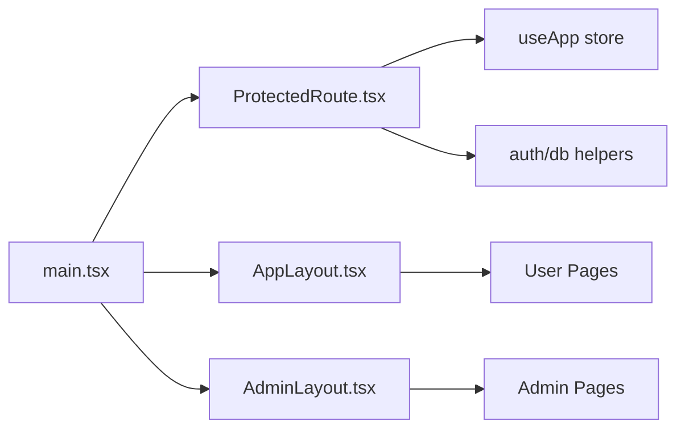

# Application Pages

<cite>
**Referenced Files in This Document**
- [main.tsx](file://freshroute/src/main.tsx)
- [App.tsx](file://freshroute/src/App.tsx)
- [ProtectedRoute.tsx](file://freshroute/src/components/auth/ProtectedRoute.tsx)
- [AppLayout.tsx](file://freshroute/src/components/layout/AppLayout.tsx)
- [AdminLayout.tsx](file://freshroute/src/components/layout/AdminLayout.tsx)
- [LandingPage.tsx](file://freshroute/src/pages/LandingPage.tsx)
- [DashboardPage.tsx](file://freshroute/src/pages/DashboardPage.tsx)
- [ChatPage.tsx](file://freshroute/src/pages/ChatPage.tsx)
- [OrdersPage.tsx](file://freshroute/src/pages/OrdersPage.tsx)
- [TrackOrderPage.tsx](file://freshroute/src/pages/TrackOrderPage.tsx)
- [RevenuePage.tsx](file://freshroute/src/pages/RevenuePage.tsx)
- [ProfilePage.tsx](file://freshroute/src/pages/ProfilePage.tsx)
- [NotificationsPage.tsx](file://freshroute/src/pages/NotificationsPage.tsx)
- [SettingsPage.tsx](file://freshroute/src/pages/SettingsPage.tsx)
- [RoleSelectPage.tsx](file://freshroute/src/pages/RoleSelectPage.tsx)
- [RoleProfilePage.tsx](file://freshroute/src/pages/RoleProfilePage.tsx)
- [CreateListingPage.tsx](file://freshroute/src/pages/CreateListingPage.tsx)
- [BrowseListingsPage.tsx](file://freshroute/src/pages/BrowseListingsPage.tsx)
- [AdminDashboardPage.tsx](file://freshroute/src/pages/admin/AdminDashboardPage.tsx)
- [AdminUsersPage.tsx](file://freshroute/src/pages/admin/AdminUsersPage.tsx)
- [AdminOrdersPage.tsx](file://freshroute/src/pages/admin/AdminOrdersPage.tsx)
- [AdminAnalyticsPage.tsx](file://freshroute/src/pages/admin/AdminAnalyticsPage.tsx)
- [AdminSettingsPage.tsx](file://freshroute/src/pages/admin/AdminSettingsPage.tsx)
</cite>

## Table of Contents
1. Introduction
2. Project Structure
3. Core Components
4. Architecture Overview
5. Detailed Component Analysis
6. Dependency Analysis
7. Performance Considerations
8. Troubleshooting Guide
9. Conclusion

## Introduction
This document explains the application pages of FreshRoute, a React-based web app that provides:
- A public landing experience
- User-facing features for produce trading (dashboard, orders, chat with AI assistant, revenue, profile, notifications, settings)
- An admin portal for system management and oversight

The routing is centralized, with protected routes enforcing authentication and role-based access, and lazy-loaded page components to optimize performance.

## Project Structure
FreshRoute uses React Router v7 with nested routes and layouts:
- Public routes: login, signup, password recovery, and landing page
- Protected user routes: dashboard, orders, tracking, revenue, profile, notifications, chat, settings, listings
- Protected admin routes: admin dashboard, users, orders, analytics, settings

**Diagram sources**
- [main.tsx:50-101](file://freshroute/src/main.tsx#L50-L101)
- [AppLayout.tsx:31-168](file://freshroute/src/components/layout/AppLayout.tsx#L31-L168)
- [AdminLayout.tsx:27-155](file://freshroute/src/components/layout/AdminLayout.tsx#L27-L155)
- [ProtectedRoute.tsx:8-77](file://freshroute/src/components/auth/ProtectedRoute.tsx#L8-L77)

**Section sources**
- [main.tsx:1-101](file://freshroute/src/main.tsx#L1-L101)

## Core Components
Key building blocks used across pages:
- PhoneFrame, PriceTicker, ChatHeader, ChatBody, QuickReplies, ChatInput, PhotoSheet, SettingsSheet, AuditDrawer: compose the mobile-style chat interface used by the AI Assistant flow
- AppLayout and AdminLayout: provide navigation, branding, sign-out, and responsive sidebars for user and admin areas
- ProtectedRoute: enforces authentication and optional admin-only access; loads user profile and roles on auth changes

These components are reused by ChatPage and other flows to deliver consistent UX.

**Section sources**
- [App.tsx:1-37](file://freshroute/src/App.tsx#L1-L37)
- [ChatPage.tsx:1-89](file://freshroute/src/pages/ChatPage.tsx#L1-L89)
- [AppLayout.tsx:1-168](file://freshroute/src/components/layout/AppLayout.tsx#L1-L168)
- [AdminLayout.tsx:1-155](file://freshroute/src/components/layout/AdminLayout.tsx#L1-L155)
- [ProtectedRoute.tsx:1-78](file://freshroute/src/components/auth/ProtectedRoute.tsx#L1-L78)

## Architecture Overview
Routing and protection strategy:
- All routes are defined in the root entry file
- Public routes include authentication screens and the landing page
- Protected routes wrap user and admin sections with layout shells
- Admin routes require an admin role; non-admins are redirected

**Diagram sources**
- [main.tsx:50-101](file://freshroute/src/main.tsx#L50-L101)
- [ProtectedRoute.tsx:8-77](file://freshroute/src/components/auth/ProtectedRoute.tsx#L8-L77)
- [AppLayout.tsx:31-168](file://freshroute/src/components/layout/AppLayout.tsx#L31-L168)
- [AdminLayout.tsx:27-155](file://freshroute/src/components/layout/AdminLayout.tsx#L27-L155)

## Detailed Component Analysis

### Routing and Layouts
- Root router defines all routes with Suspense and lazy loading for code splitting
- User routes are grouped under AppLayout; admin routes under AdminLayout
- ProtectedRoute ensures only authenticated users can access protected routes and restricts admin routes to admins

**Diagram sources**
- [main.tsx:50-101](file://freshroute/src/main.tsx#L50-L101)
- [ProtectedRoute.tsx:8-77](file://freshroute/src/components/auth/ProtectedRoute.tsx#L8-L77)

**Section sources**
- [main.tsx:1-101](file://freshroute/src/main.tsx#L1-L101)
- [AppLayout.tsx:1-168](file://freshroute/src/components/layout/AppLayout.tsx#L1-L168)
- [AdminLayout.tsx:1-155](file://freshroute/src/components/layout/AdminLayout.tsx#L1-L155)
- [ProtectedRoute.tsx:1-78](file://freshroute/src/components/auth/ProtectedRoute.tsx#L1-L78)

### Public Landing Page
- Provides marketing content, feature highlights, pricing, and calls-to-action
- Links to authentication and app entry points
- Uses reusable landing components for phone mockups, stories, testimonials, and pricing

**Section sources**
- [LandingPage.tsx:1-640](file://freshroute/src/pages/LandingPage.tsx#L1-L640)

### Authentication Pages
- Login, Signup, Forgot Password, Reset Password
- Accessible without authentication; redirect to appropriate flows after success

**Section sources**
- [main.tsx:55-59](file://freshroute/src/main.tsx#L55-L59)

### Onboarding Pages
- Role selection and role profile setup for new users before entering the main app

**Section sources**
- [main.tsx:63-65](file://freshroute/src/main.tsx#L63-L65)

### User Dashboard
- Displays key metrics: total orders, earned amount, customer score, active orders
- Shows quick actions to start a new lot via chat
- Lists active and recent orders with status and net values

**Section sources**
- [DashboardPage.tsx:1-210](file://freshroute/src/pages/DashboardPage.tsx#L1-L210)

### Orders and Tracking
- Orders list and detail view for individual order tracking
- Status indicators and links to detailed tracking

**Section sources**
- [OrdersPage.tsx](file://freshroute/src/pages/OrdersPage.tsx)
- [TrackOrderPage.tsx](file://freshroute/src/pages/TrackOrderPage.tsx)

### Revenue, Profile, Notifications, Settings
- Revenue overview and insights
- Profile management
- Notification center
- Application settings

**Section sources**
- [RevenuePage.tsx](file://freshroute/src/pages/RevenuePage.tsx)
- [ProfilePage.tsx](file://freshroute/src/pages/ProfilePage.tsx)
- [NotificationsPage.tsx](file://freshroute/src/pages/NotificationsPage.tsx)
- [SettingsPage.tsx](file://freshroute/src/pages/SettingsPage.tsx)

### AI Assistant Chat Flow
- ChatPage composes the mobile-style chat UI using shared components
- Initializes AI mode and persists chat state across sessions
- Supports photo uploads and settings via sheets/drawer

**Diagram sources**
- [ChatPage.tsx:1-89](file://freshroute/src/pages/ChatPage.tsx#L1-L89)
- [App.tsx:1-37](file://freshroute/src/App.tsx#L1-L37)

**Section sources**
- [ChatPage.tsx:1-89](file://freshroute/src/pages/ChatPage.tsx#L1-L89)
- [App.tsx:1-37](file://freshroute/src/App.tsx#L1-L37)

### Listings Management
- Create listing and browse existing listings for marketplace functionality

**Section sources**
- [CreateListingPage.tsx](file://freshroute/src/pages/CreateListingPage.tsx)
- [BrowseListingsPage.tsx](file://freshroute/src/pages/BrowseListingsPage.tsx)

### Admin Portal
- AdminDashboardPage shows system-wide stats and quick links to manage users, orders, and analytics
- AdminLayout provides navigation and sign-out specific to admin context

**Diagram sources**
- [AdminDashboardPage.tsx:1-113](file://freshroute/src/pages/admin/AdminDashboardPage.tsx#L1-L113)
- [AdminLayout.tsx:1-155](file://freshroute/src/components/layout/AdminLayout.tsx#L1-L155)

**Section sources**
- [AdminDashboardPage.tsx:1-113](file://freshroute/src/pages/admin/AdminDashboardPage.tsx#L1-L113)
- [AdminUsersPage.tsx](file://freshroute/src/pages/admin/AdminUsersPage.tsx)
- [AdminOrdersPage.tsx](file://freshroute/src/pages/admin/AdminOrdersPage.tsx)
- [AdminAnalyticsPage.tsx](file://freshroute/src/pages/admin/AdminAnalyticsPage.tsx)
- [AdminSettingsPage.tsx](file://freshroute/src/pages/admin/AdminSettingsPage.tsx)
- [AdminLayout.tsx:1-155](file://freshroute/src/components/layout/AdminLayout.tsx#L1-L155)

## Dependency Analysis
- Routing depends on react-router-dom for navigation and route guards
- ProtectedRoute depends on authentication utilities and database functions to fetch profiles and roles
- Layouts depend on store (useApp) for profile data and sign-out actions
- Pages depend on data layer functions to fetch orders, metrics, and system stats

**Diagram sources**
- [main.tsx:50-101](file://freshroute/src/main.tsx#L50-L101)
- [ProtectedRoute.tsx:8-77](file://freshroute/src/components/auth/ProtectedRoute.tsx#L8-L77)
- [AppLayout.tsx:31-168](file://freshroute/src/components/layout/AppLayout.tsx#L31-L168)
- [AdminLayout.tsx:27-155](file://freshroute/src/components/layout/AdminLayout.tsx#L27-L155)

**Section sources**
- [main.tsx:1-101](file://freshroute/src/main.tsx#L1-L101)
- [ProtectedRoute.tsx:1-78](file://freshroute/src/components/auth/ProtectedRoute.tsx#L1-L78)

## Performance Considerations
- Lazy loading: Most user and admin pages are imported lazily to reduce initial bundle size
- Suspense fallback: A spinner is shown while pages load
- State persistence: Chat state is debounced and persisted to avoid excessive writes
- Responsive layouts: Sidebars collapse on mobile to improve usability

[No sources needed since this section provides general guidance]

## Troubleshooting Guide
Common issues and checks:
- Authentication loop or redirects: Ensure ProtectedRoute correctly loads session and profile; verify Firebase auth listeners and error handling
- Admin access denied: Confirm user role is set to admin; check role fetching logic and fallback behavior
- Chat state not restoring: Verify user ID availability and successful load/save operations; ensure visibility change handlers refresh AI mode when needed
- Navigation errors: Validate route paths and nested route groups; confirm layouts render child routes via Outlet

**Section sources**
- [ProtectedRoute.tsx:15-77](file://freshroute/src/components/auth/ProtectedRoute.tsx#L15-L77)
- [ChatPage.tsx:18-69](file://freshroute/src/pages/ChatPage.tsx#L18-L69)
- [main.tsx:50-101](file://freshroute/src/main.tsx#L50-L101)

## Conclusion
FreshRoute’s application pages are organized around a clear routing structure with protected routes and dedicated layouts for user and admin experiences. The AI Assistant chat flow is central to the user journey, while dashboards and admin tools provide operational visibility. Lazy loading and responsive design enhance performance and usability across devices.