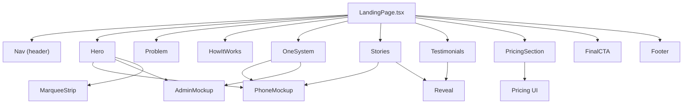
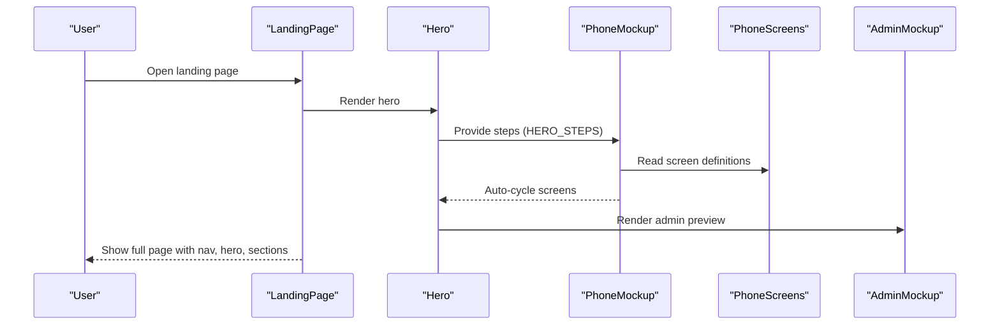
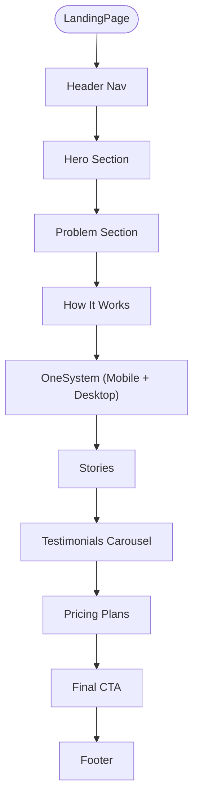
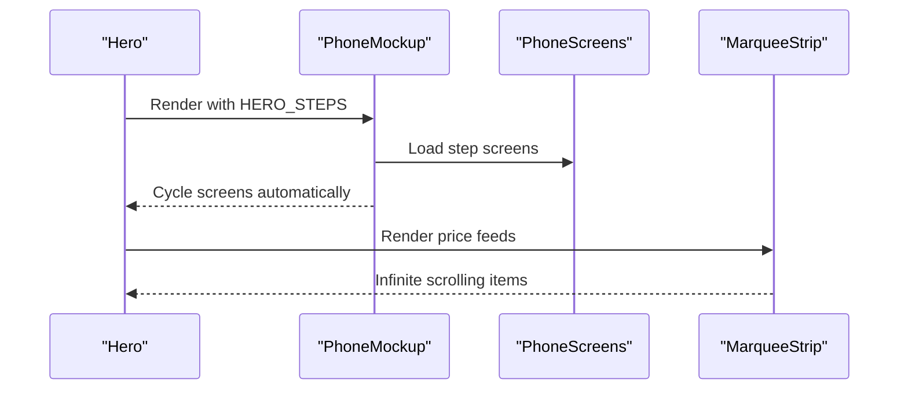
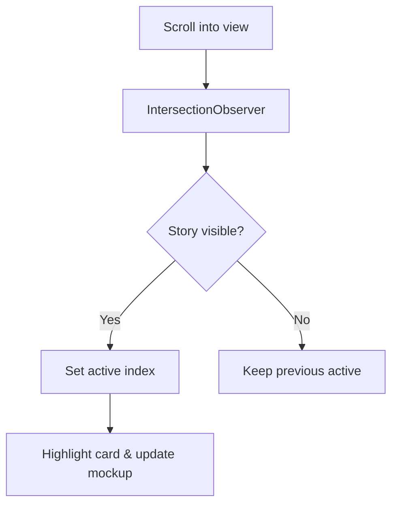
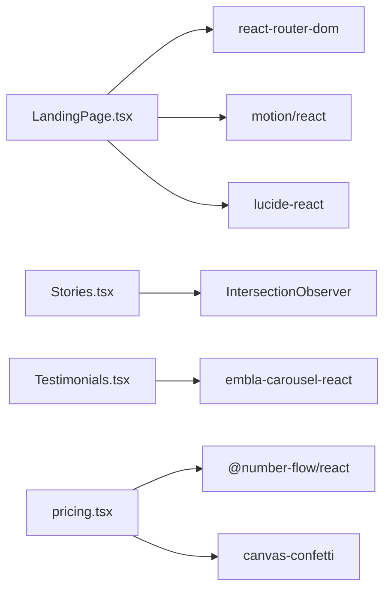

# Landing Page

<cite>
**Referenced Files in This Document**
- [LandingPage.tsx](file://freshroute/src/pages/LandingPage.tsx)
- [PhoneMockup.tsx](file://freshroute/src/components/landing/PhoneMockup.tsx)
- [AdminMockup.tsx](file://freshroute/src/components/landing/AdminMockup.tsx)
- [Logo.tsx](file://freshroute/src/components/landing/Logo.tsx)
- [MarqueeStrip.tsx](file://freshroute/src/components/landing/MarqueeStrip.tsx)
- [Stories.tsx](file://freshroute/src/components/landing/Stories.tsx)
- [Testimonials.tsx](file://freshroute/src/components/landing/Testimonials.tsx)
- [Reveal.tsx](file://freshroute/src/components/landing/Reveal.tsx)
- [PhoneScreens.tsx](file://freshroute/src/components/landing/PhoneScreens.tsx)
- [pricing.tsx](file://freshroute/src/components/ui/pricing.tsx)
- [package.json](file://freshroute/package.json)
</cite>

## Table of Contents
1. [Introduction](#introduction)
2. [Project Structure](#project-structure)
3. [Core Components](#core-components)
4. [Architecture Overview](#architecture-overview)
5. [Detailed Component Analysis](#detailed-component-analysis)
6. [Dependency Analysis](#dependency-analysis)
7. [Performance Considerations](#performance-considerations)
8. [Troubleshooting Guide](#troubleshooting-guide)
9. [Conclusion](#conclusion)

## Introduction
This document explains the FreshRoute Landing Page, a marketing and conversion-focused React page that introduces the product to prospective users. It highlights the problem FreshRoute solves, demonstrates how the AI agent works through interactive phone mockups, showcases operator dashboards, presents real pilot stories, testimonials, pricing, and clear calls to action. The page is built with modern UI primitives, motion-based animations, and responsive layouts optimized for both mobile and desktop.

## Project Structure
The landing page is implemented as a single-page layout composed of reusable components:
- Page shell and navigation
- Hero section with animated phone mockup and floating cards
- Problem statement section
- How it Works walkthrough
- Unified system overview (mobile grower vs desktop operator)
- Stories and Testimonials sections
- Pricing section
- Final call-to-action and footer

**Diagram sources**
- [LandingPage.tsx:44-88](file://freshroute/src/pages/LandingPage.tsx#L44-L88)
- [LandingPage.tsx:133-299](file://freshroute/src/pages/LandingPage.tsx#L133-L299)
- [LandingPage.tsx:322-378](file://freshroute/src/pages/LandingPage.tsx#L322-L378)
- [LandingPage.tsx:395-434](file://freshroute/src/pages/LandingPage.tsx#L395-L434)
- [LandingPage.tsx:436-517](file://freshroute/src/pages/LandingPage.tsx#L436-L517)
- [LandingPage.tsx:573-587](file://freshroute/src/pages/LandingPage.tsx#L573-L587)
- [LandingPage.tsx:590-635](file://freshroute/src/pages/LandingPage.tsx#L590-L635)
- [LandingPage.tsx:637-684](file://freshroute/src/pages/LandingPage.tsx#L637-L684)
- [PhoneMockup.tsx:56-161](file://freshroute/src/components/landing/PhoneMockup.tsx#L56-L161)
- [AdminMockup.tsx:61-166](file://freshroute/src/components/landing/AdminMockup.tsx#L61-L166)
- [MarqueeStrip.tsx:90-113](file://freshroute/src/components/landing/MarqueeStrip.tsx#L90-L113)
- [Stories.tsx:181-312](file://freshroute/src/components/landing/Stories.tsx#L181-L312)
- [Testimonials.tsx:51-141](file://freshroute/src/components/landing/Testimonials.tsx#L51-L141)
- [pricing.tsx:41-209](file://freshroute/src/components/ui/pricing.tsx#L41-L209)

**Section sources**
- [LandingPage.tsx:686-704](file://freshroute/src/pages/LandingPage.tsx#L686-L704)

## Core Components
- Navigation header with logo wordmark and quick links to key sections, plus login/signup CTAs.
- Hero with background imagery, gradient overlays, headline, description, bilingual text, and an auto-playing phone mockup showcasing the end-to-end flow.
- Floating informational cards around the phone mockup to highlight market price, grading, transport booking, and payout outcomes.
- Live Mandi marquee feed showing prices across major hubs.
- Problem section articulating pain points with supporting statistics.
- How it Works section explaining differentiators and process.
- OneSystem section comparing grower mobile experience and operator desktop console.
- Stories section with scroll-driven active state and embedded visualizations.
- Testimonials carousel with autoplay and navigation dots.
- Pricing section with monthly/seasonal toggle and plan cards.
- Final CTA and footer with navigation and disclosures.

**Section sources**
- [LandingPage.tsx:44-88](file://freshroute/src/pages/LandingPage.tsx#L44-L88)
- [LandingPage.tsx:133-299](file://freshroute/src/pages/LandingPage.tsx#L133-L299)
- [LandingPage.tsx:322-378](file://freshroute/src/pages/LandingPage.tsx#L322-L378)
- [LandingPage.tsx:395-434](file://freshroute/src/pages/LandingPage.tsx#L395-L434)
- [LandingPage.tsx:436-517](file://freshroute/src/pages/LandingPage.tsx#L436-L517)
- [LandingPage.tsx:573-587](file://freshroute/src/pages/LandingPage.tsx#L573-L587)
- [LandingPage.tsx:590-635](file://freshroute/src/pages/LandingPage.tsx#L590-L635)
- [LandingPage.tsx:637-684](file://freshroute/src/pages/LandingPage.tsx#L637-L684)

## Architecture Overview
The landing page composes multiple subcomponents to deliver a cohesive narrative. Data flows from static content arrays into render functions, while interactive elements manage local state for animations, auto-play cycles, and scroll-based visibility.

**Diagram sources**
- [LandingPage.tsx:133-299](file://freshroute/src/pages/LandingPage.tsx#L133-L299)
- [PhoneMockup.tsx:56-161](file://freshroute/src/components/landing/PhoneMockup.tsx#L56-L161)
- [PhoneScreens.tsx:409-416](file://freshroute/src/components/landing/PhoneScreens.tsx#L409-L416)
- [AdminMockup.tsx:61-166](file://freshroute/src/components/landing/AdminMockup.tsx#L61-L166)

## Detailed Component Analysis

### LandingPage Shell and Sections
- Composes all sections in a logical order for conversion: hero, problem, how it works, system overview, stories, testimonials, pricing, final CTA, and footer.
- Uses consistent typography, spacing, and reveal animations to guide attention.
- Provides anchor navigation for quick jumps between sections.

**Diagram sources**
- [LandingPage.tsx:686-704](file://freshroute/src/pages/LandingPage.tsx#L686-L704)

**Section sources**
- [LandingPage.tsx:686-704](file://freshroute/src/pages/LandingPage.tsx#L686-L704)

### Hero Section
- Displays headline, value proposition, bilingual messaging, and two primary CTAs.
- Integrates a phone mockup that auto-cycles through the end-to-end agent flow using predefined steps.
- Includes floating cards that emphasize key benefits like top mandi price, AI grading, booked transport, and banked profit.
- Features a live marquee strip of mandi prices across cities.

**Diagram sources**
- [LandingPage.tsx:133-299](file://freshroute/src/pages/LandingPage.tsx#L133-L299)
- [PhoneMockup.tsx:56-161](file://freshroute/src/components/landing/PhoneMockup.tsx#L56-L161)
- [PhoneScreens.tsx:409-416](file://freshroute/src/components/landing/PhoneScreens.tsx#L409-L416)
- [MarqueeStrip.tsx:90-113](file://freshroute/src/components/landing/MarqueeStrip.tsx#L90-L113)

**Section sources**
- [LandingPage.tsx:133-299](file://freshroute/src/pages/LandingPage.tsx#L133-L299)

### Problem Section
- Articulates core challenges: late price discovery, middlemen layers, and perishability risks.
- Presents supporting statistics to quantify impact.
- Uses card layout with icons and Urdu titles for cultural resonance.

**Section sources**
- [LandingPage.tsx:301-378](file://freshroute/src/pages/LandingPage.tsx#L301-L378)

### How It Works Section
- Highlights differentiators: net profit focus, approval-first workflow, and transparent data confidence.
- Pairs textual explanation with a phone mockup demonstrating the same flow shown in the hero.

**Section sources**
- [LandingPage.tsx:380-434](file://freshroute/src/pages/LandingPage.tsx#L380-L434)

### OneSystem Section (Grower Mobile + Operator Desk)
- Contrasts the grower’s mobile chat interface with the operator’s desktop console.
- Lists capabilities for each role and embeds corresponding mockups.

**Section sources**
- [LandingPage.tsx:436-517](file://freshroute/src/pages/LandingPage.tsx#L436-L517)
- [AdminMockup.tsx:61-166](file://freshroute/src/components/landing/AdminMockup.tsx#L61-L166)

### Stories Section
- Scroll-aware active story selection via IntersectionObserver.
- Each story includes a quote, actions taken by the agent, and a visualization artifact (comparison bars, route trade-offs, lot splitting).
- Embedded phone mockup highlights the relevant step for each story.

**Diagram sources**
- [Stories.tsx:181-312](file://freshroute/src/components/landing/Stories.tsx#L181-L312)

**Section sources**
- [Stories.tsx:181-312](file://freshroute/src/components/landing/Stories.tsx#L181-L312)

### Testimonials Section
- Carousel with autoplay and manual navigation dots.
- Displays quotes, names, roles, and star ratings.

**Section sources**
- [Testimonials.tsx:51-141](file://freshroute/src/components/landing/Testimonials.tsx#L51-L141)

### Pricing Section
- Offers three plans with monthly or seasonal billing toggle.
- Animated number transitions and confetti on toggle interaction.
- Clear feature lists and CTAs per plan.

**Section sources**
- [LandingPage.tsx:519-587](file://freshroute/src/pages/LandingPage.tsx#L519-L587)
- [pricing.tsx:41-209](file://freshroute/src/components/ui/pricing.tsx#L41-L209)

### Final CTA and Footer
- Strong closing message with bilingual emphasis and dual CTAs.
- Footer includes navigation links and transparency disclosures.

**Section sources**
- [LandingPage.tsx:590-684](file://freshroute/src/pages/LandingPage.tsx#L590-L684)

## Dependency Analysis
Key dependencies powering the landing page:
- React Router for navigation links
- Motion for animations and scroll reveals
- Lucide icons for consistent iconography
- Embla Carousel for testimonial carousel
- NumberFlow for animated pricing numbers
- Canvas Confetti for celebratory interactions
- Tailwind CSS utilities for styling

**Diagram sources**
- [LandingPage.tsx:1-28](file://freshroute/src/pages/LandingPage.tsx#L1-L28)
- [Stories.tsx:181-312](file://freshroute/src/components/landing/Stories.tsx#L181-L312)
- [Testimonials.tsx:51-141](file://freshroute/src/components/landing/Testimonials.tsx#L51-L141)
- [pricing.tsx:41-209](file://freshroute/src/components/ui/pricing.tsx#L41-L209)
- [package.json:12-56](file://freshroute/package.json#L12-L56)

**Section sources**
- [package.json:12-56](file://freshroute/package.json#L12-L56)

## Performance Considerations
- Use intersection observers judiciously; ensure cleanup to avoid memory leaks.
- Prefer reduced-motion media queries to respect user preferences.
- Debounce or throttle expensive re-renders when handling scroll events.
- Optimize images and assets; consider lazy loading off-screen visuals.
- Avoid excessive animation loops on low-power devices; pause auto-play when not visible.

[No sources needed since this section provides general guidance]

## Troubleshooting Guide
Common issues and resolutions:
- Animations not triggering: verify viewport thresholds and element visibility; check reduced-motion settings.
- Carousel not autoplaying: confirm embla API initialization and event listeners are attached correctly.
- NumberFlow not animating: ensure container has stable dimensions and values change only on user interaction.
- Marquee stuttering: ensure duplicated content width is measured accurately and motion controls are stopped on unmount.
- Accessibility concerns: ensure aria labels and roles are present for interactive elements like carousels and tabs.

**Section sources**
- [Reveal.tsx:27-50](file://freshroute/src/components/landing/Reveal.tsx#L27-L50)
- [Testimonials.tsx:51-141](file://freshroute/src/components/landing/Testimonials.tsx#L51-L141)
- [pricing.tsx:41-209](file://freshroute/src/components/ui/pricing.tsx#L41-L209)
- [MarqueeStrip.tsx:16-88](file://freshroute/src/components/landing/MarqueeStrip.tsx#L16-L88)

## Conclusion
The FreshRoute Landing Page effectively communicates the product’s value through a structured narrative, interactive demonstrations, and clear calls to action. Its modular component design enables maintainability and scalability, while thoughtful animations and accessibility considerations enhance user experience. The integration of real-world scenarios and transparent pricing supports trust and conversion.

[No sources needed since this section summarizes without analyzing specific files]