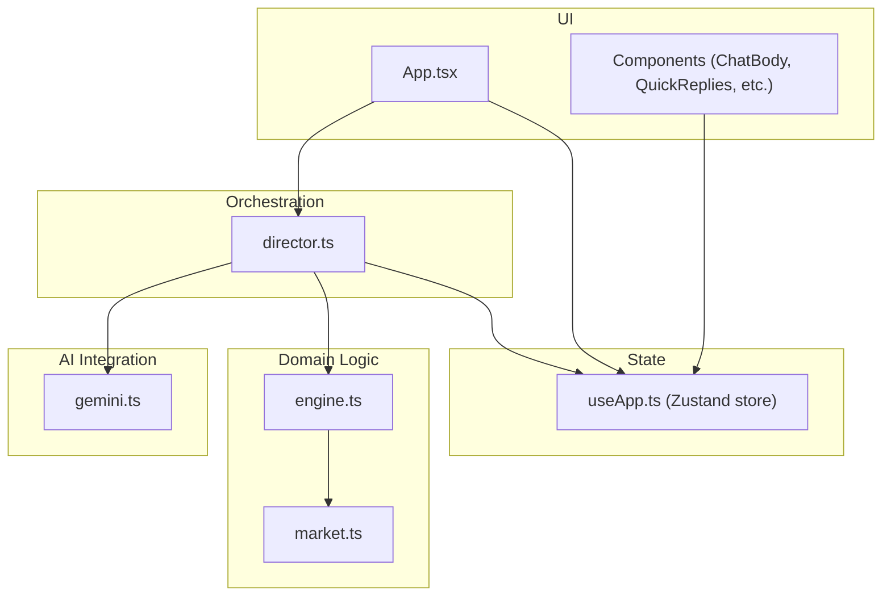
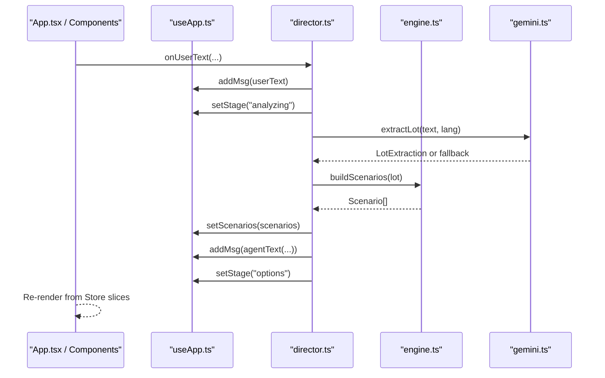
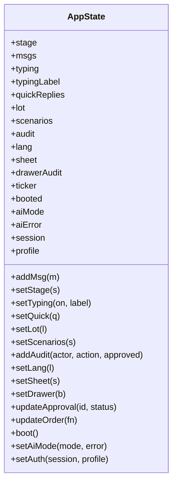
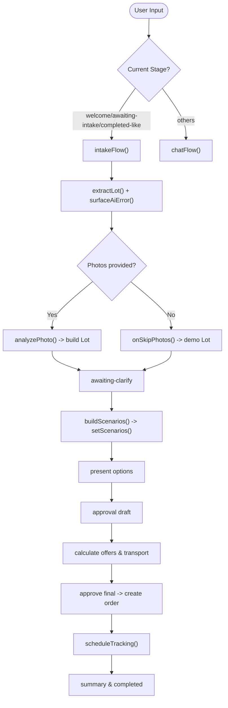
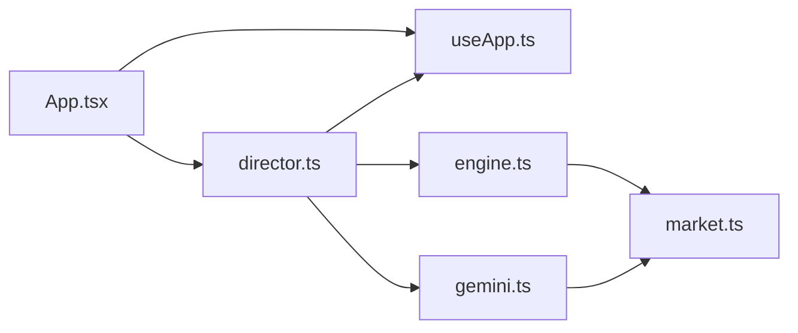

# State Management

<cite>
**Referenced Files in This Document**
- [useApp.ts](file://freshroute/src/store/useApp.ts)
- [director.ts](file://freshroute/src/store/director.ts)
- [types.ts](file://freshroute/src/types.ts)
- [engine.ts](file://freshroute/src/lib/engine.ts)
- [gemini.ts](file://freshroute/src/lib/gemini.ts)
- [market.ts](file://freshroute/src/data/market.ts)
- [App.tsx](file://freshroute/src/App.tsx)
</cite>

## Table of Contents
1. [Introduction](#introduction)
2. [Project Structure](#project-structure)
3. [Core Components](#core-components)
4. [Architecture Overview](#architecture-overview)
5. [Detailed Component Analysis](#detailed-component-analysis)
6. [Dependency Analysis](#dependency-analysis)
7. [Performance Considerations](#performance-considerations)
8. [Troubleshooting Guide](#troubleshooting-guide)
9. [Conclusion](#conclusion)

## Introduction
This document explains FreshRoute’s Zustand-based state management system. It covers the centralized store, action creators, and state transitions orchestrated by a director pattern. It also documents TypeScript type safety, AI integration points, and how global state drives component re-renders with performance considerations. Finally, it provides debugging strategies for the workflow and AI flows.

## Project Structure
FreshRoute organizes state around a single store hook and a director module that orchestrates user workflows:
- Store: Centralized state and actions in useApp.ts
- Director: Workflow orchestration and side effects in director.ts
- Types: Shared TypeScript interfaces in types.ts
- Engine: Scenario generation and pricing logic in engine.ts
- Gemini: AI proxy client and fallbacks in gemini.ts
- Market data: Prices, buyers, transporters in market.ts
- App shell: Bootstraps the workflow in App.tsx

**Diagram sources**
- [App.tsx:14-33](file://freshroute/src/App.tsx#L14-L33)
- [useApp.ts:20-118](file://freshroute/src/store/useApp.ts#L20-L118)
- [director.ts:86-106](file://freshroute/src/store/director.ts#L86-L106)
- [engine.ts:47-235](file://freshroute/src/lib/engine.ts#L47-L235)
- [gemini.ts:91-182](file://freshroute/src/lib/gemini.ts#L91-L182)
- [market.ts:14-24](file://freshroute/src/data/market.ts#L14-L24)

**Section sources**
- [App.tsx:14-33](file://freshroute/src/App.tsx#L14-L33)
- [useApp.ts:20-118](file://freshroute/src/store/useApp.ts#L20-L118)
- [director.ts:86-106](file://freshroute/src/store/director.ts#L86-L106)

## Core Components
- Centralized store (useApp.ts): Defines AppState interface and exposes a Zustand store with typed state fields and action creators. Actions update messages, stage, lot, scenarios, audit log, UI toggles, and auth/session.
- Director (director.ts): Implements the director pattern to manage multi-step workflows (boot, intake, photos, clarify, options, outreach approval, offers, final approval, tracking, completion). It reads/writes store via useApp.getState() and setState(), and coordinates AI calls and timers.
- Types (types.ts): Strongly-typed domain models for messages, stages, lots, scenarios, orders, approvals, transport options, and more. Ensures compile-time safety across store and director.
- Engine (engine.ts): Pure functions to build scenarios, calculate costs, spoilage, and ranking. Consumed by the director when generating sale options.
- Gemini (gemini.ts): Client to call a Supabase Edge Function proxy for AI features (text extraction, vision analysis, chat). Includes robust fallbacks and error surfacing.
- Market (market.ts): Static datasets for prices, buyers, transporters, distances, and volatility used by engine and director.

Key responsibilities:
- Store owns immutable state snapshots and exposes granular actions.
- Director encapsulates complex asynchronous workflows and side effects.
- Engine computes business rules deterministically.
- Gemini integrates external AI with safe fallbacks.

**Section sources**
- [useApp.ts:20-118](file://freshroute/src/store/useApp.ts#L20-L118)
- [director.ts:86-750](file://freshroute/src/store/director.ts#L86-L750)
- [types.ts:1-229](file://freshroute/src/types.ts#L1-L229)
- [engine.ts:47-235](file://freshroute/src/lib/engine.ts#L47-L235)
- [gemini.ts:91-182](file://freshroute/src/lib/gemini.ts#L91-L182)
- [market.ts:14-24](file://freshroute/src/data/market.ts#L14-L24)

## Architecture Overview
The application follows a unidirectional data flow:
- UI components subscribe to selected slices of the Zustand store.
- User interactions trigger director methods.
- The director updates the store through typed actions and performs side effects (AI calls, timers).
- Engine and market data provide deterministic business logic.
- Gemini integrates AI with fallbacks; errors are surfaced into messages and audit logs.

**Diagram sources**
- [director.ts:145-156](file://freshroute/src/store/director.ts#L145-L156)
- [director.ts:110-143](file://freshroute/src/store/director.ts#L110-L143)
- [director.ts:258-290](file://freshroute/src/store/director.ts#L258-L290)
- [engine.ts:47-235](file://freshroute/src/lib/engine.ts#L47-L235)
- [gemini.ts:91-116](file://freshroute/src/lib/gemini.ts#L91-L116)
- [useApp.ts:75-80](file://freshroute/src/store/useApp.ts#L75-L80)

## Detailed Component Analysis

### Centralized Store (useApp.ts)
- State shape: stage, messages, typing indicators, quick replies, lot, scenarios, audit log, language, UI sheets/drawer, ticker, boot flag, AI mode/error, session/profile.
- Actions:
  - Message handling: addMsg, setTyping, setQuick
  - Domain updates: setLot, setScenarios, updateApproval, updateOrder
  - UI controls: setLang, setSheet, setDrawer
  - Lifecycle: boot, setAiMode, setAuth
- Patterns:
  - Immutable updates using functional set((s) => ...) to avoid stale closures.
  - Narrow selectors in components to minimize re-renders.
  - Audit logging for traceability.

**Diagram sources**
- [useApp.ts:20-118](file://freshroute/src/store/useApp.ts#L20-L118)

**Section sources**
- [useApp.ts:20-118](file://freshroute/src/store/useApp.ts#L20-L118)

### Director Pattern (director.ts)
- Orchestrates end-to-end workflows:
  - Boot: initializes session, records consent, sets initial stage and quick replies.
  - Intake: extracts lot info via AI or fallback, shows prices, prompts for photos.
  - Photos/Vision: analyzes images, builds lot with confidence and grade, clarifies packaging/storage/departure.
  - Scenarios: builds ranked options using engine, recommends best option.
  - Outreach Approval: drafts message, awaits user approval, simulates delivery and response.
  - Offers: calculates transport, fees, storage, expected net, presents options.
  - Final Approval: books transport, creates order, schedules tracking timeline.
  - Tracking: updates steps over time, emits alerts, completes sale with summary.
  - Freeform chat: composes context from store and calls AI chat with fallbacks.
- Error handling:
  - surfaceAiError surfaces last AI error once per step and logs audit entries.
  - Fallbacks ensure continuity if AI is unavailable or returns malformed data.

**Diagram sources**
- [director.ts:86-106](file://freshroute/src/store/director.ts#L86-L106)
- [director.ts:110-143](file://freshroute/src/store/director.ts#L110-L143)
- [director.ts:175-217](file://freshroute/src/store/director.ts#L175-L217)
- [director.ts:258-290](file://freshroute/src/store/director.ts#L258-L290)
- [director.ts:299-343](file://freshroute/src/store/director.ts#L299-L343)
- [director.ts:376-438](file://freshroute/src/store/director.ts#L376-L438)
- [director.ts:440-497](file://freshroute/src/store/director.ts#L440-L497)
- [director.ts:499-597](file://freshroute/src/store/director.ts#L499-L597)
- [director.ts:601-625](file://freshroute/src/store/director.ts#L601-L625)

**Section sources**
- [director.ts:86-750](file://freshroute/src/store/director.ts#L86-L750)

### Type Safety (types.ts)
- Enforces strict contracts for messages, stages, lots, scenarios, orders, approvals, transport options, and more.
- Union types for Msg kind ensure exhaustive handling in UI and director logic.
- Enums-like string unions for Stage, Packaging, Grade, and AiMode improve developer experience and reduce runtime errors.

**Section sources**
- [types.ts:1-229](file://freshroute/src/types.ts#L1-L229)

### Business Logic (engine.ts)
- Generates multiple scenarios: local mandi sale, direct buyer, cold storage then sell, premium buyer.
- Calculates gross, deductions (transport, platform fee, loading, storage), net, spoilage, risk, and scores.
- Provides transportOptions based on distance and vehicle characteristics.

**Section sources**
- [engine.ts:47-235](file://freshroute/src/lib/engine.ts#L47-L235)
- [engine.ts:238-257](file://freshroute/src/lib/engine.ts#L238-L257)

### AI Integration (gemini.ts)
- Proxy-based calls to Supabase Edge Function for extraction, vision, and chat.
- Robust fallbacks:
  - extractLotFallback for text parsing without AI.
  - VISION_FALLBACK for image analysis when unavailable.
  - chatFallback for conversational responses when AI fails.
- Error surfacing via consumeAiError ensures failures are visible to users and audited.

**Section sources**
- [gemini.ts:91-182](file://freshroute/src/lib/gemini.ts#L91-L182)
- [gemini.ts:18-24](file://freshroute/src/lib/gemini.ts#L18-L24)

### Data Sources (market.ts)
- Provides CROP_PRICES, BUYERS, TRANSPORTERS, CITY_DISTANCES_KM, CROP_VOLATILITY, and helper tickerPrices.
- Used by engine and director to compute realistic scenarios and present market context.

**Section sources**
- [market.ts:14-24](file://freshroute/src/data/market.ts#L14-L24)
- [market.ts:73-161](file://freshroute/src/data/market.ts#L73-L161)
- [market.ts:174-183](file://freshroute/src/data/market.ts#L174-L183)

## Dependency Analysis
- App.tsx boots the workflow and renders UI bound to store slices.
- Director depends on:
  - useApp for reading/writing state
  - engine for scenario computation
  - gemini for AI capabilities
  - market for static data
- Engine depends on market data.
- Gemini depends on Supabase functions and market aliases.

**Diagram sources**
- [App.tsx:14-33](file://freshroute/src/App.tsx#L14-L33)
- [director.ts:86-106](file://freshroute/src/store/director.ts#L86-L106)
- [engine.ts:47-235](file://freshroute/src/lib/engine.ts#L47-L235)
- [gemini.ts:91-182](file://freshroute/src/lib/gemini.ts#L91-L182)
- [market.ts:14-24](file://freshroute/src/data/market.ts#L14-L24)

**Section sources**
- [App.tsx:14-33](file://freshroute/src/App.tsx#L14-L33)
- [director.ts:86-106](file://freshroute/src/store/director.ts#L86-L106)

## Performance Considerations
- Selective subscriptions: Components should select only the state slices they need (e.g., sheet, msgs, stage) to avoid unnecessary re-renders.
- Immutable updates: Use functional set((s) => ...) to prevent accidental mutations and enable efficient change detection.
- Batched updates: Group related state changes within a single set call where possible to reduce render cycles.
- Memoization: Consider memoizing derived data in components (e.g., filtered messages) to optimize rendering.
- Avoid heavy computations in render paths: Offload scenario building and calculations to the director/engine.
- Debounce rapid inputs: For freeform chat or frequent updates, debounce to limit AI calls and store updates.
- Lazy initialization: Defer non-critical work until after boot to keep initial load fast.

[No sources needed since this section provides general guidance]

## Troubleshooting Guide
- AI failures:
  - Check aiMode and aiError in store to diagnose connectivity or configuration issues.
  - Use consumeAiError to retrieve the last error and surface it in messages.
  - Verify Supabase Edge Function availability and keys.
- Stuck states:
  - Inspect current stage and quickReplies to understand where the flow halted.
  - Review audit log for actor/system actions leading up to the issue.
- Incorrect scenarios:
  - Validate input lot details (crop, quantity, location, packaging, storage, departure).
  - Confirm market data and crop aliases are correct.
- Tracking anomalies:
  - Ensure scheduleTracking guards against stage changes to prevent out-of-order updates.
  - Check timers and guard conditions in tracking flow.

**Section sources**
- [gemini.ts:18-24](file://freshroute/src/lib/gemini.ts#L18-L24)
- [director.ts:62-74](file://freshroute/src/store/director.ts#L62-L74)
- [useApp.ts:111-117](file://freshroute/src/store/useApp.ts#L111-L117)
- [director.ts:499-597](file://freshroute/src/store/director.ts#L499-L597)

## Conclusion
FreshRoute’s state management combines a clean Zustand store with a director-driven workflow to deliver a robust, type-safe, and maintainable system. The separation of concerns—store for state, director for orchestration, engine for business logic, and gemini for AI—enables clear debugging, predictable re-renders, and scalable growth. With strong TypeScript contracts, careful error handling, and performance-conscious patterns, the system supports complex multi-step processes while keeping the UI responsive and intuitive.