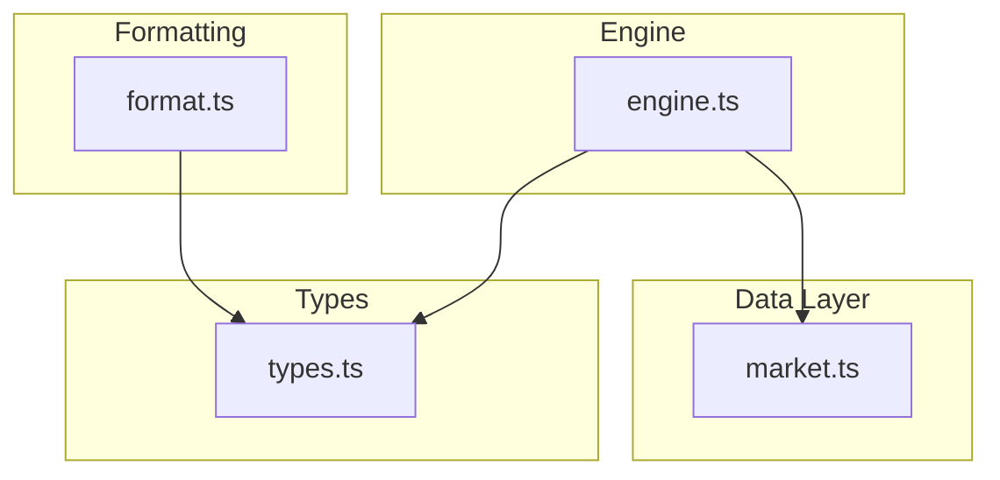
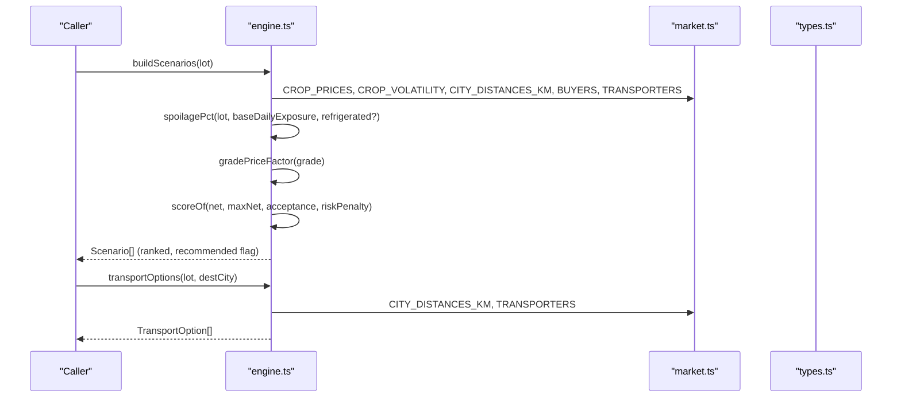
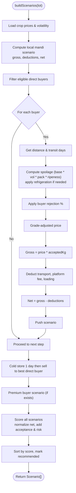
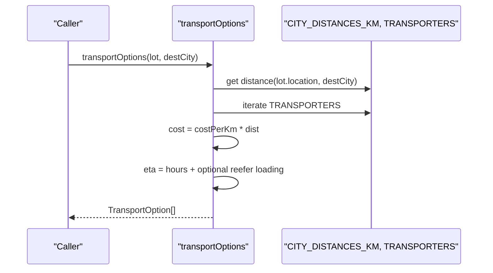
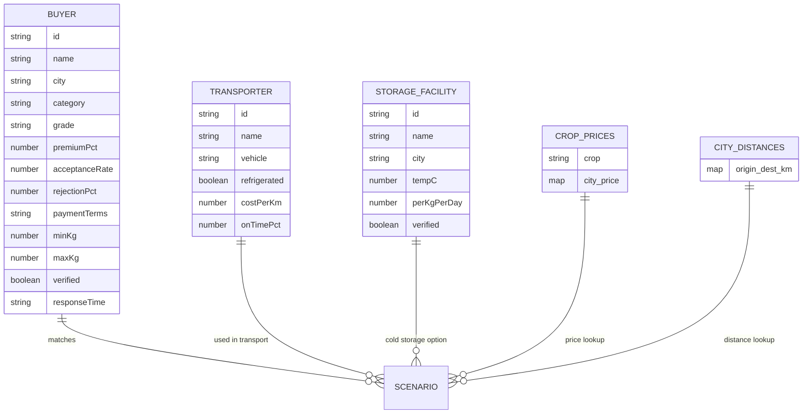
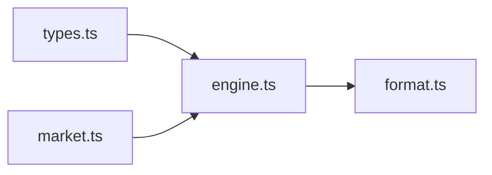

# Business Logic Engine

<cite>
**Referenced Files in This Document**
- [engine.ts](file://freshroute/src/lib/engine.ts)
- [market.ts](file://freshroute/src/data/market.ts)
- [format.ts](file://freshroute/src/lib/format.ts)
- [types.ts](file://freshroute/src/types.ts)
</cite>

## Table of Contents
1. [Introduction](#introduction)
2. [Project Structure](#project-structure)
3. [Core Components](#core-components)
4. [Architecture Overview](#architecture-overview)
5. [Detailed Component Analysis](#detailed-component-analysis)
6. [Dependency Analysis](#dependency-analysis)
7. [Performance Considerations](#performance-considerations)
8. [Troubleshooting Guide](#troubleshooting-guide)
9. [Conclusion](#conclusion)
10. [Appendices](#appendices)

## Introduction
This document explains FreshRoute’s business logic engine that powers supply chain calculations and market analysis for perishable produce. It focuses on the engine module that generates transport cost estimates, spoilage predictions, net profit projections, and scenario recommendations across different markets and buyers. It also documents the market data structures (pricing, distances, transporter networks, buyer profiles), format utilities for presenting results, and the mathematical models used for financial projections, risk assessment, and optimization. Examples of scenario generation outputs and decision support are included to help users understand how the system evaluates options and recommends actions.

## Project Structure
The business logic is implemented as a small set of focused modules:
- Market data definitions: pricing, distances, crop volatility, buyers, transporters, storage facilities, weather, and price ticker helpers.
- Engine logic: scenario generation, scoring, transport option calculation, spoilage modeling, and grade-based pricing adjustments.
- Format utilities: currency formatting, time formatting, unit conversion, and unique ID generation.
- Shared types: domain models for lots, buyers, transporters, scenarios, orders, messages, and more.

**Diagram sources**
- [engine.ts:1-15](file://freshroute/src/lib/engine.ts#L1-L15)
- [market.ts:1-20](file://freshroute/src/data/market.ts#L1-L20)
- [format.ts:1-21](file://freshroute/src/lib/format.ts#L1-L21)
- [types.ts:34-137](file://freshroute/src/types.ts#L34-L137)

**Section sources**
- [engine.ts:1-258](file://freshroute/src/lib/engine.ts#L1-L258)
- [market.ts:1-189](file://freshroute/src/data/market.ts#L1-L189)
- [format.ts:1-21](file://freshroute/src/lib/format.ts#L1-L21)
- [types.ts:1-229](file://freshroute/src/types.ts#L1-L229)

## Core Components
- Scenario generation: builds multiple sell pathways (local mandi, direct wholesale buyers, cold storage then sell, premium buyer) with deductions, spoilage, and net profit.
- Spoilage model: rule-based daily exposure adjusted by crop volatility, packaging type, ripeness, and refrigeration.
- Scoring and ranking: weighted function combining normalized net profit, acceptance rate, and risk penalty; selects recommended scenario.
- Transport options: calculates costs and ETAs per transporter, marks recommended based on value and protection.
- Market data: city-to-city distances, crop prices per city, crop volatility, buyer profiles, transporter profiles, storage facilities, weather, and price ticker generator.
- Formatting: PKR currency formatting, short-form currency, clock formatting, unique IDs, and maund conversion.

**Section sources**
- [engine.ts:16-258](file://freshroute/src/lib/engine.ts#L16-L258)
- [market.ts:5-189](file://freshroute/src/data/market.ts#L5-L189)
- [format.ts:1-21](file://freshroute/src/lib/format.ts#L1-L21)
- [types.ts:34-137](file://freshroute/src/types.ts#L34-L137)

## Architecture Overview
The engine composes market data and types to compute scenarios and transport options. The flow starts from a Lot input, uses market tables for prices and distances, applies spoilage and grading rules, computes gross revenue minus deductions, and scores each scenario to recommend the best option. Transport options are derived independently using distance and transporter rates.

**Diagram sources**
- [engine.ts:47-235](file://freshroute/src/lib/engine.ts#L47-L235)
- [engine.ts:238-257](file://freshroute/src/lib/engine.ts#L238-L257)
- [market.ts:5-189](file://freshroute/src/data/market.ts#L5-L189)
- [types.ts:34-137](file://freshroute/src/types.ts#L34-L137)

## Detailed Component Analysis

### Engine Module: Scenario Generation and Scoring
- Inputs: a Lot object including crop, quantityKg, location, packaging, vision (grade, ripeness), and flags like storageAvailable or departEarly.
- Outputs: an array of Scenario objects representing distinct selling strategies, each with gross revenue, accepted kg after spoilage/rejection, itemized deductions, net profit, spoilage percentage, risk level, payment terms, rationale, recommendation flag, and a computed score.

Key behaviors:
- Local mandi sale: same-day cash, local price, mandi commission, loading and cartage costs.
- Direct wholesale buyers: filters buyers by city, grade compatibility, lot size range, and zero premium; computes transport cost, transit days, spoilage, rejection, grade-adjusted price, platform fee, loading cost, and net profit.
- Cold storage strategy: one-day cold storage reduces spoilage at a per-kg-per-day cost; then sells to the best direct buyer identified earlier.
- Premium buyer strategy: targets higher-paying retail buyers requiring Grade A and refrigerated transport; includes rejection risk when lot grade is lower than required.
- Scoring: combines normalized net profit, acceptance rate, and risk penalty to rank scenarios; marks the highest-scoring scenario as recommended.

Mathematical notes:
- Spoilage percentage: base daily exposure multiplied by crop volatility, packaging factor, and ripeness multiplier; capped at a maximum; refrigeration significantly reduces spoilage.
- Grade price factor: A-grade at full price, B-grade discounted, C-grade further discounted.
- Score formula: weighted sum of normalized net profit, acceptance rate, baseline acceptance benefit, and risk penalty.

**Diagram sources**
- [engine.ts:47-235](file://freshroute/src/lib/engine.ts#L47-L235)

**Section sources**
- [engine.ts:16-235](file://freshroute/src/lib/engine.ts#L16-L235)
- [types.ts:34-137](file://freshroute/src/types.ts#L34-L137)

### Engine Module: Transport Options
- Computes transport cost per transporter using distance and per-km rate.
- Estimates ETA based on distance and vehicle type; adds extra loading time for refrigerated vehicles.
- Marks a recommended option based on value and protection characteristics.

**Diagram sources**
- [engine.ts:238-257](file://freshroute/src/lib/engine.ts#L238-L257)
- [market.ts:5-161](file://freshroute/src/data/market.ts#L5-L161)

**Section sources**
- [engine.ts:238-257](file://freshroute/src/lib/engine.ts#L238-L257)

### Market Data Structures
- City distances: matrix of distances between major cities used to estimate transport time and cost.
- Crop prices: wholesale price per kilogram by crop and city; used to compute gross revenue.
- Crop volatility: relative perishability factors driving spoilage estimates.
- Buyers: profiles including city, grade requirements, premium percentages, acceptance and rejection rates, payment terms, and lot size constraints.
- Transporters: vehicle types, refrigeration status, per-km cost, and on-time performance.
- Storage facilities: cold storage locations with temperature and per-kg-per-day cost.
- Weather: city-level temperature and conditions influencing handling decisions.
- Price ticker helper: transforms price tables into point objects with trend, freshness window, and confidence.

**Diagram sources**
- [market.ts:5-189](file://freshroute/src/data/market.ts#L5-L189)
- [types.ts:47-79](file://freshroute/src/types.ts#L47-L79)

**Section sources**
- [market.ts:5-189](file://freshroute/src/data/market.ts#L5-L189)
- [types.ts:47-79](file://freshroute/src/types.ts#L47-L79)

### Format Utilities
- Currency formatting: standard and short forms for PKR amounts.
- Time formatting: converts timestamps to human-readable clock strings.
- Unit conversion: kilograms to maunds using a fixed conversion factor.
- Unique ID generation: simple random ID for UI state or records.

These utilities ensure consistent presentation of financial figures, times, and units across the application.

**Section sources**
- [format.ts:1-21](file://freshroute/src/lib/format.ts#L1-L21)
- [types.ts:1-229](file://freshroute/src/types.ts#L1-L229)

## Dependency Analysis
The engine depends on market data for pricing, distances, buyer and transporter profiles, and on shared types for structured inputs and outputs. Format utilities are independent but consume types for consistent output.

**Diagram sources**
- [engine.ts:1-15](file://freshroute/src/lib/engine.ts#L1-L15)
- [market.ts:1-20](file://freshroute/src/data/market.ts#L1-L20)
- [format.ts:1-21](file://freshroute/src/lib/format.ts#L1-L21)
- [types.ts:1-20](file://freshroute/src/types.ts#L1-L20)

**Section sources**
- [engine.ts:1-258](file://freshroute/src/lib/engine.ts#L1-L258)
- [market.ts:1-189](file://freshroute/src/data/market.ts#L1-L189)
- [format.ts:1-21](file://freshroute/src/lib/format.ts#L1-L21)
- [types.ts:1-229](file://freshroute/src/types.ts#L1-L229)

## Performance Considerations
- Scenario generation is linear in the number of eligible buyers and constant-time computations per scenario; it remains efficient for typical dataset sizes.
- Distance lookups use in-memory maps; avoid repeated recalculations by caching results if called frequently.
- Spoilage and scoring functions are pure and fast; consider memoization only if invoked repeatedly with identical inputs.
- Transport options computation scales with the number of transporters; keep transporter lists concise for optimal performance.

[No sources needed since this section provides general guidance]

## Troubleshooting Guide
Common issues and resolutions:
- Missing city distance: fallback values are used; verify CITY_DISTANCES_KM entries for new routes.
- Buyer mismatch: ensure lot grade and quantity fall within buyer constraints; adjust filters or update buyer profiles.
- Unexpected spoilage: check crop volatility, packaging type, ripeness flags, and refrigeration settings; validate base daily exposure assumptions.
- Incorrect pricing: confirm CROP_PRICES contains the intended crop and city; use aliases mapping if necessary.
- Transport ETA anomalies: verify distance and vehicle type; refrigerated vehicles include additional loading time.

**Section sources**
- [engine.ts:47-235](file://freshroute/src/lib/engine.ts#L47-L235)
- [market.ts:5-189](file://freshroute/src/data/market.ts#L5-L189)

## Conclusion
FreshRoute’s business logic engine provides transparent, explainable calculations for supply chain decisions involving perishable goods. It integrates market pricing, distances, buyer profiles, and transporter options to generate ranked scenarios with clear rationales. The rule-based spoilage model and grade-adjusted pricing enable realistic financial projections and risk-aware recommendations. Format utilities ensure consistent presentation of results for stakeholders.

[No sources needed since this section summarizes without analyzing specific files]

## Appendices

### Mathematical Formulas Summary
- Spoilage percentage: base daily exposure × crop volatility × packaging factor × ripeness multiplier; refrigeration multiplies by a reduction factor; result capped at a maximum threshold.
- Grade price factor: A-grade at full price; B-grade discounted; C-grade further discounted.
- Gross revenue: price per kilogram × accepted kilograms (after spoilage and rejection).
- Net profit: gross revenue minus deductions (transport, platform fees, loading, cold storage).
- Scenario score: weighted combination of normalized net profit, acceptance rate, baseline acceptance benefit, and risk penalty.

[No sources needed since this section aggregates formulas already explained above]

### Example Scenario Outputs
- Local mandi sale: immediate cash, local price, mandi commission, loading and cartage costs; low risk; suitable for quick turnover.
- Direct wholesale buyer: higher price in another city; transport cost and transit days considered; moderate risk; payment terms vary by buyer.
- Cold storage strategy: one-day storage reduces spoilage at a per-kg-per-day cost; worth it if expecting price increases; moderate risk.
- Premium buyer: higher-paying retail buyer requiring Grade A and refrigerated transport; higher rejection risk if lot grade is insufficient; medium-high risk.

Decision support outputs include:
- Recommended scenario flagged by highest score.
- Rationale explaining price differences, acceptance likelihood, transport considerations, and risk factors.
- Transport options with cost, ETA, and notes on protection and value.

[No sources needed since this section describes conceptual outputs]