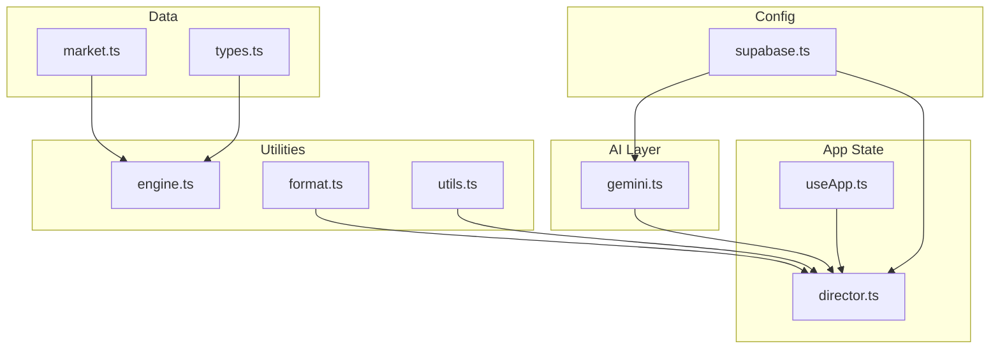
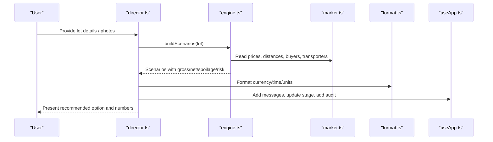
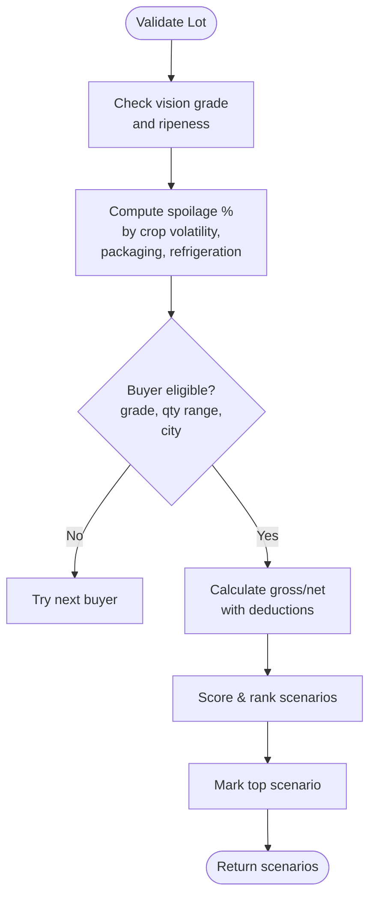
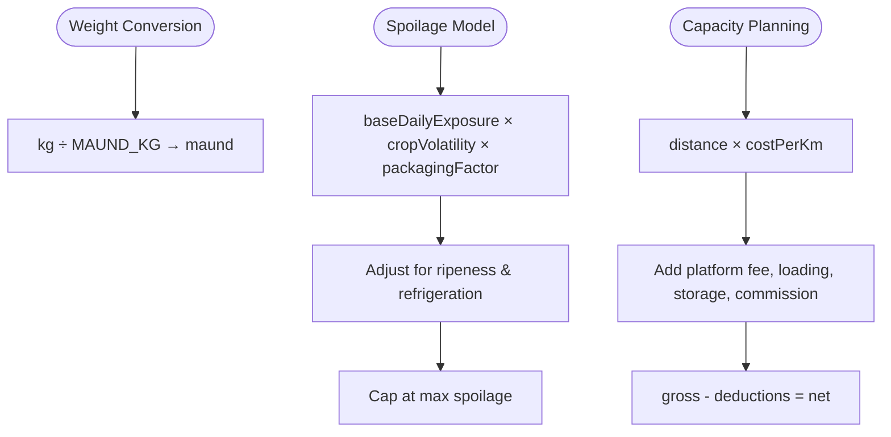
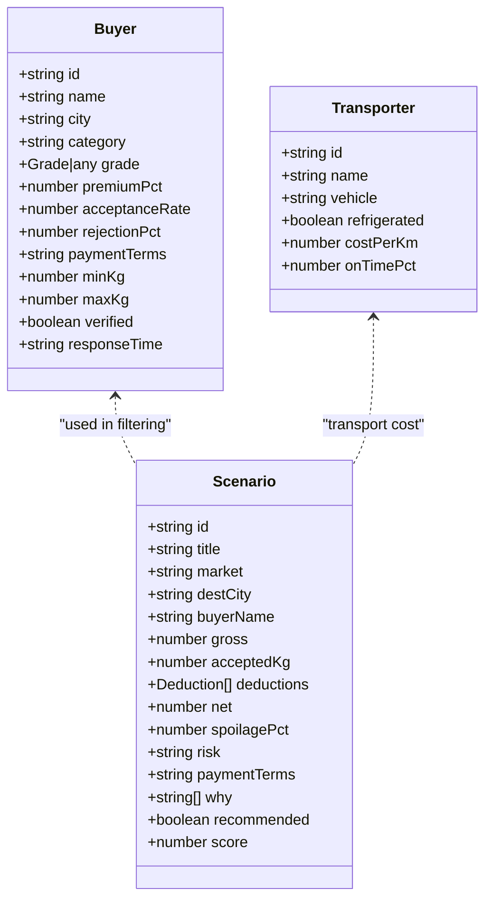
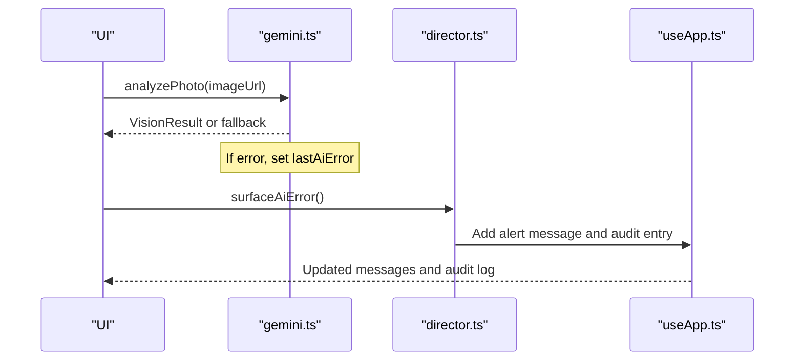
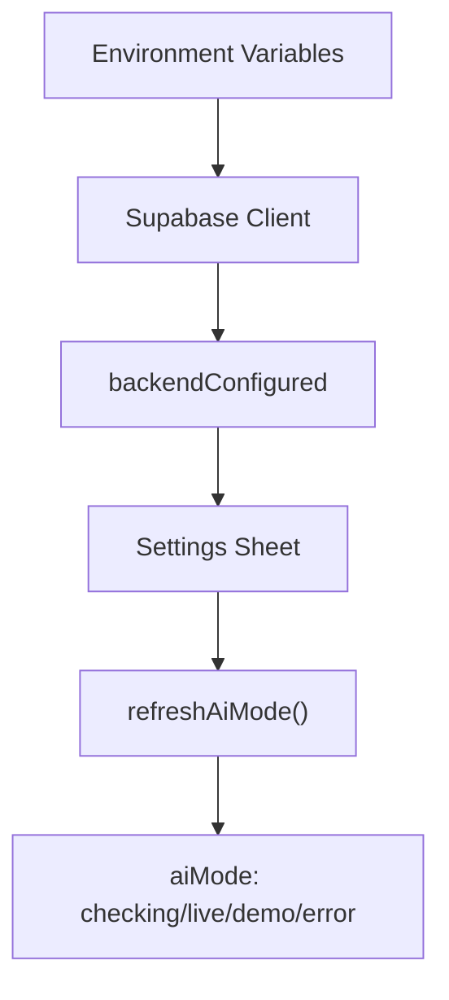
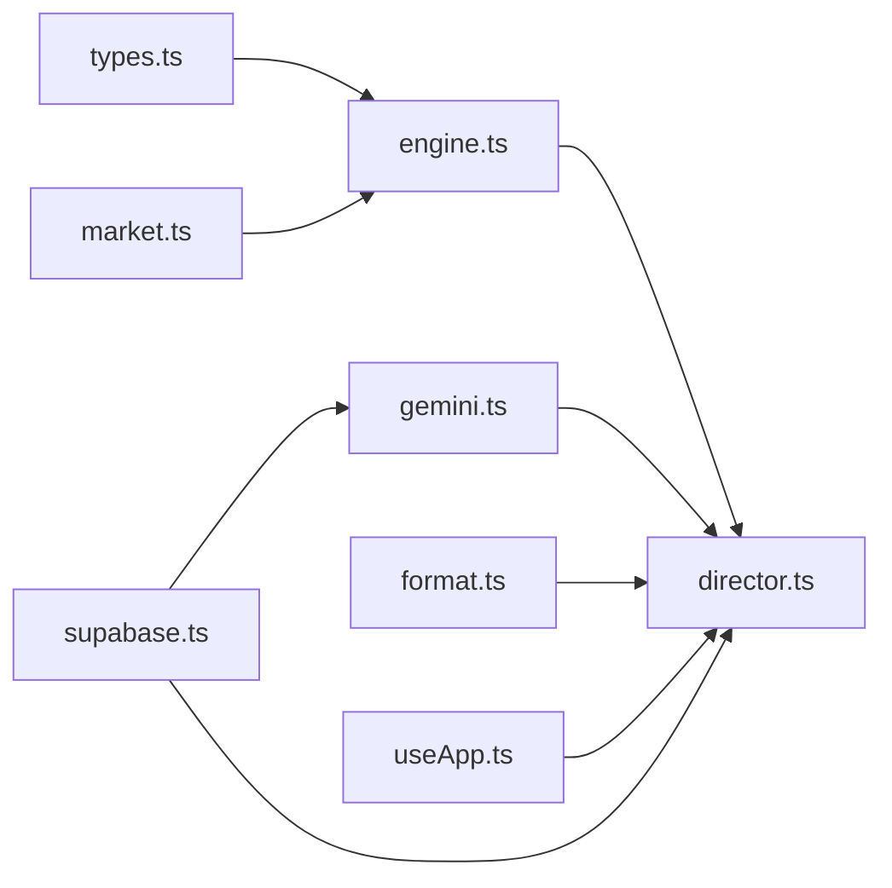

# Business Utilities

<cite>
**Referenced Files in This Document**
- [engine.ts](file://freshroute/src/lib/engine.ts)
- [format.ts](file://freshroute/src/lib/format.ts)
- [market.ts](file://freshroute/src/data/market.ts)
- [gemini.ts](file://freshroute/src/lib/gemini.ts)
- [useApp.ts](file://freshroute/src/store/useApp.ts)
- [director.ts](file://freshroute/src/store/director.ts)
- [supabase.ts](file://freshroute/src/lib/supabase.ts)
- [types.ts](file://freshroute/src/types.ts)
</cite>

## Table of Contents
1. Introduction
2. Project Structure
3. Core Components
4. Architecture Overview
5. Detailed Component Analysis
6. Dependency Analysis
7. Performance Considerations
8. Troubleshooting Guide
9. Conclusion

## Introduction
This document explains FreshRoute’s business utility functions that power common operations across the application: validation for lot quality assessment, buyer eligibility checks, and order status verification; calculation helpers for weight conversions, volume/spoilage modeling, and capacity planning; data filtering, sorting, and aggregation utilities; error handling, logging, and debugging helpers; and configuration management for environment-specific settings and feature flags. It shows how these utilities support core business logic while keeping code reusable and testable.

## Project Structure
FreshRoute organizes business utilities into focused modules:
- Market data and constants (prices, distances, buyers, transporters)
- Engine with scenario building, spoilage modeling, scoring, and transport options
- Formatting utilities for currency, time, IDs, and unit conversion
- AI integration layer with fallbacks and error capture
- Application store for state and message helpers
- Director orchestrating flows and using utilities
- Supabase client and environment configuration

**Diagram sources**
- [market.ts:1-189](file://freshroute/src/data/market.ts#L1-L189)
- [types.ts:1-229](file://freshroute/src/types.ts#L1-L229)
- [engine.ts:1-258](file://freshroute/src/lib/engine.ts#L1-L258)
- [format.ts:1-21](file://freshroute/src/lib/format.ts#L1-L21)
- [gemini.ts:1-200](file://freshroute/src/lib/gemini.ts#L1-L200)
- [useApp.ts:1-129](file://freshroute/src/store/useApp.ts#L1-L129)
- [director.ts:1-750](file://freshroute/src/store/director.ts#L1-L750)
- [supabase.ts:1-19](file://freshroute/src/lib/supabase.ts#L1-L19)

**Section sources**
- [market.ts:1-189](file://freshroute/src/data/market.ts#L1-L189)
- [engine.ts:1-258](file://freshroute/src/lib/engine.ts#L1-L258)
- [format.ts:1-21](file://freshroute/src/lib/format.ts#L1-L21)
- [gemini.ts:1-200](file://freshroute/src/lib/gemini.ts#L1-L200)
- [useApp.ts:1-129](file://freshroute/src/store/useApp.ts#L1-L129)
- [director.ts:1-750](file://freshroute/src/store/director.ts#L1-L750)
- [supabase.ts:1-19](file://freshroute/src/lib/supabase.ts#L1-L19)
- [types.ts:1-229](file://freshroute/src/types.ts#L1-L229)

## Core Components
- Scenario engine: builds market scenarios, estimates spoilage, calculates net revenue, ranks options, and selects recommendations.
- Buyer eligibility and pricing: filters buyers by grade, quantity ranges, and premium rules; applies grade-based price factors.
- Transport options: computes costs, ETAs, and recommendations based on distance and refrigeration needs.
- Formatting and units: currency formatting, time formatting, unique ID generation, and maund-to-kilogram conversion.
- AI extraction and vision: robust extraction with deterministic fallbacks and error surfacing.
- Store and messaging: centralized state, audit logging, and message creation helpers.
- Configuration: environment-driven backend setup and feature mode detection.

**Section sources**
- [engine.ts:10-258](file://freshroute/src/lib/engine.ts#L10-L258)
- [market.ts:73-189](file://freshroute/src/data/market.ts#L73-L189)
- [format.ts:1-21](file://freshroute/src/lib/format.ts#L1-L21)
- [gemini.ts:55-116](file://freshroute/src/lib/gemini.ts#L55-L116)
- [useApp.ts:56-129](file://freshroute/src/store/useApp.ts#L56-L129)
- [supabase.ts:1-19](file://freshroute/src/lib/supabase.ts#L1-L19)

## Architecture Overview
The business flow uses utilities to validate inputs, compute financial outcomes, and present actionable options. The director coordinates user interactions, calls the engine for scenario generation, formats outputs, and logs audits.

**Diagram sources**
- [director.ts:258-290](file://freshroute/src/store/director.ts#L258-L290)
- [engine.ts:47-236](file://freshroute/src/lib/engine.ts#L47-L236)
- [market.ts:1-189](file://freshroute/src/data/market.ts#L1-L189)
- [format.ts:1-21](file://freshroute/src/lib/format.ts#L1-L21)
- [useApp.ts:75-118](file://freshroute/src/store/useApp.ts#L75-L118)

## Detailed Component Analysis

### Validation Functions
- Lot quality assessment:
  - Vision result provides grade, ripeness, defect rate, and confidence. Spoilage model adjusts daily exposure by crop volatility, packaging type, ripeness, and refrigeration.
  - Grade price factor maps grades to direct-buyer price multipliers.
- Buyer eligibility checks:
  - Filters buyers by city, grade compatibility, quantity range, and premium constraints.
  - Applies rejection percentages to accepted quantity.
- Order status verification:
  - Tracking steps transition through pickup, transit, delivery, and payment states; alerts are injected for delays; final summary validates acceptance rates and computes uplift vs local mandi.

**Diagram sources**
- [engine.ts:17-45](file://freshroute/src/lib/engine.ts#L17-L45)
- [engine.ts:47-236](file://freshroute/src/lib/engine.ts#L47-L236)
- [market.ts:73-189](file://freshroute/src/data/market.ts#L73-L189)

**Section sources**
- [engine.ts:17-45](file://freshroute/src/lib/engine.ts#L17-L45)
- [engine.ts:47-236](file://freshroute/src/lib/engine.ts#L47-L236)
- [market.ts:73-189](file://freshroute/src/data/market.ts#L73-L189)
- [director.ts:499-597](file://freshroute/src/store/director.ts#L499-L597)

### Calculation Helpers
- Weight conversions:
  - Maund-to-kilogram conversion constant and helper function.
- Volume/spoilage calculations:
  - Rule-based spoilage model considering crop volatility, packaging, ripeness, and refrigeration.
- Capacity planning:
  - Transport cost per kilometer multiplied by distance; cold storage cost per kg per day; loading and cartage fees; platform fee percentage; mandi commission percentage.

**Diagram sources**
- [market.ts:3](file://freshroute/src/data/market.ts#L3)
- [format.ts:20](file://freshroute/src/lib/format.ts#L20)
- [engine.ts:23-36](file://freshroute/src/lib/engine.ts#L23-L36)
- [engine.ts:100-156](file://freshroute/src/lib/engine.ts#L100-L156)

**Section sources**
- [market.ts:3](file://freshroute/src/data/market.ts#L3)
- [format.ts:20](file://freshroute/src/lib/format.ts#L20)
- [engine.ts:23-36](file://freshroute/src/lib/engine.ts#L23-L36)
- [engine.ts:100-156](file://freshroute/src/lib/engine.ts#L100-L156)

### Data Filtering, Sorting, and Aggregation
- Filtering:
  - Buyers filtered by city, grade compatibility, quantity bounds, and premium constraints.
  - Transporters mapped to options with recommended flags.
- Sorting:
  - Scenarios sorted by computed score; top scenario marked recommended.
- Aggregation:
  - Deductions aggregated to compute net revenue; acceptance rates used in scoring; final summaries aggregate accepted quantities and uplift.

**Diagram sources**
- [types.ts:47-79](file://freshroute/src/types.ts#L47-L79)
- [types.ts:94-112](file://freshroute/src/types.ts#L94-L112)
- [engine.ts:87-134](file://freshroute/src/lib/engine.ts#L87-L134)
- [engine.ts:238-257](file://freshroute/src/lib/engine.ts#L238-L257)

**Section sources**
- [engine.ts:87-134](file://freshroute/src/lib/engine.ts#L87-L134)
- [engine.ts:226-236](file://freshroute/src/lib/engine.ts#L226-L236)
- [engine.ts:238-257](file://freshroute/src/lib/engine.ts#L238-L257)
- [director.ts:376-438](file://freshroute/src/store/director.ts#L376-L438)

### Error Handling, Logging, and Debugging
- Error handling:
  - AI proxy failures captured and surfaced once via a consume helper; fallbacks ensure demo mode is never disguised as live AI.
  - Image analysis validates input format and returns safe defaults when missing or malformed.
- Logging:
  - Audit entries record actions by actor (System, Agent, You), including approvals, rejections, and completion events.
- Debugging:
  - AI mode detection and refresh allow toggling between live, demo, and error modes; settings sheet exposes backend configuration status.

**Diagram sources**
- [gemini.ts:18-24](file://freshroute/src/lib/gemini.ts#L18-L24)
- [gemini.ts:131-161](file://freshroute/src/lib/gemini.ts#L131-L161)
- [director.ts:62-74](file://freshroute/src/store/director.ts#L62-L74)
- [useApp.ts:82-85](file://freshroute/src/store/useApp.ts#L82-L85)

**Section sources**
- [gemini.ts:18-24](file://freshroute/src/lib/gemini.ts#L18-L24)
- [gemini.ts:131-161](file://freshroute/src/lib/gemini.ts#L131-L161)
- [director.ts:62-74](file://freshroute/src/store/director.ts#L62-L74)
- [useApp.ts:82-85](file://freshroute/src/store/useApp.ts#L82-L85)
- [supabase.ts:1-19](file://freshroute/src/lib/supabase.ts#L1-L19)

### Configuration Management
- Environment-specific settings:
  - Supabase URL and anon key loaded from environment variables; boolean flag indicates whether backend is configured.
- Feature flags:
  - AI mode (checking/live/demo/error) controls behavior; refresh function updates mode based on server status.
  - Settings sheet displays backend configuration status and allows resetting demo state.

**Diagram sources**
- [supabase.ts:1-19](file://freshroute/src/lib/supabase.ts#L1-L19)
- [director.ts:740-750](file://freshroute/src/store/director.ts#L740-L750)

**Section sources**
- [supabase.ts:1-19](file://freshroute/src/lib/supabase.ts#L1-L19)
- [director.ts:740-750](file://freshroute/src/store/director.ts#L740-L750)

## Dependency Analysis
- Engine depends on market data for prices, distances, buyers, transporters, and volatility.
- Director composes utilities from engine, gemini, format, and useApp to orchestrate flows.
- Gemini layer depends on Supabase client and market aliases for normalization.
- Types define shared contracts ensuring consistency across modules.

**Diagram sources**
- [types.ts:1-229](file://freshroute/src/types.ts#L1-L229)
- [market.ts:1-189](file://freshroute/src/data/market.ts#L1-L189)
- [engine.ts:1-258](file://freshroute/src/lib/engine.ts#L1-L258)
- [gemini.ts:1-200](file://freshroute/src/lib/gemini.ts#L1-L200)
- [format.ts:1-21](file://freshroute/src/lib/format.ts#L1-L21)
- [useApp.ts:1-129](file://freshroute/src/store/useApp.ts#L1-L129)
- [supabase.ts:1-19](file://freshroute/src/lib/supabase.ts#L1-L19)
- [director.ts:1-750](file://freshroute/src/store/director.ts#L1-L750)

**Section sources**
- [engine.ts:1-258](file://freshroute/src/lib/engine.ts#L1-L258)
- [director.ts:1-750](file://freshroute/src/store/director.ts#L1-L750)
- [gemini.ts:1-200](file://freshroute/src/lib/gemini.ts#L1-L200)
- [market.ts:1-189](file://freshroute/src/data/market.ts#L1-L189)
- [types.ts:1-229](file://freshroute/src/types.ts#L1-L229)
- [supabase.ts:1-19](file://freshroute/src/lib/supabase.ts#L1-L19)

## Performance Considerations
- Scenario computation is O(n) over buyers and transporters; keep datasets small and indexed by city/crop keys.
- Spoilage model uses simple arithmetic; avoid heavy loops inside hot paths.
- AI calls are asynchronous with fallbacks; batch requests where possible and cache results like ticker prices.
- Audit logging appends arrays; consider pagination or truncation for long sessions to reduce memory usage.

[No sources needed since this section provides general guidance]

## Troubleshooting Guide
- AI proxy unreachable:
  - Check backend configuration and network connectivity; refresh AI mode to detect errors.
- Malformed AI responses:
  - Fallbacks provide safe defaults; inspect last AI error via consume helper and surface to user.
- Missing environment variables:
  - Ensure Supabase URL and anon key are set; settings sheet will warn if not configured.
- Incorrect lot intake:
  - Validate crop names against supported list; use aliases to normalize input.

**Section sources**
- [gemini.ts:28-42](file://freshroute/src/lib/gemini.ts#L28-L42)
- [gemini.ts:91-116](file://freshroute/src/lib/gemini.ts#L91-L116)
- [supabase.ts:1-19](file://freshroute/src/lib/supabase.ts#L1-L19)
- [director.ts:118-126](file://freshroute/src/store/director.ts#L118-L126)

## Conclusion
FreshRoute’s business utilities encapsulate validation, calculation, filtering, sorting, aggregation, error handling, logging, and configuration management. They enable robust scenario generation, transparent reasoning, and resilient operation even when external services fail. By centralizing these utilities, the application maintains reusability, testability, and clarity across its core business logic.

[No sources needed since this section summarizes without analyzing specific files]