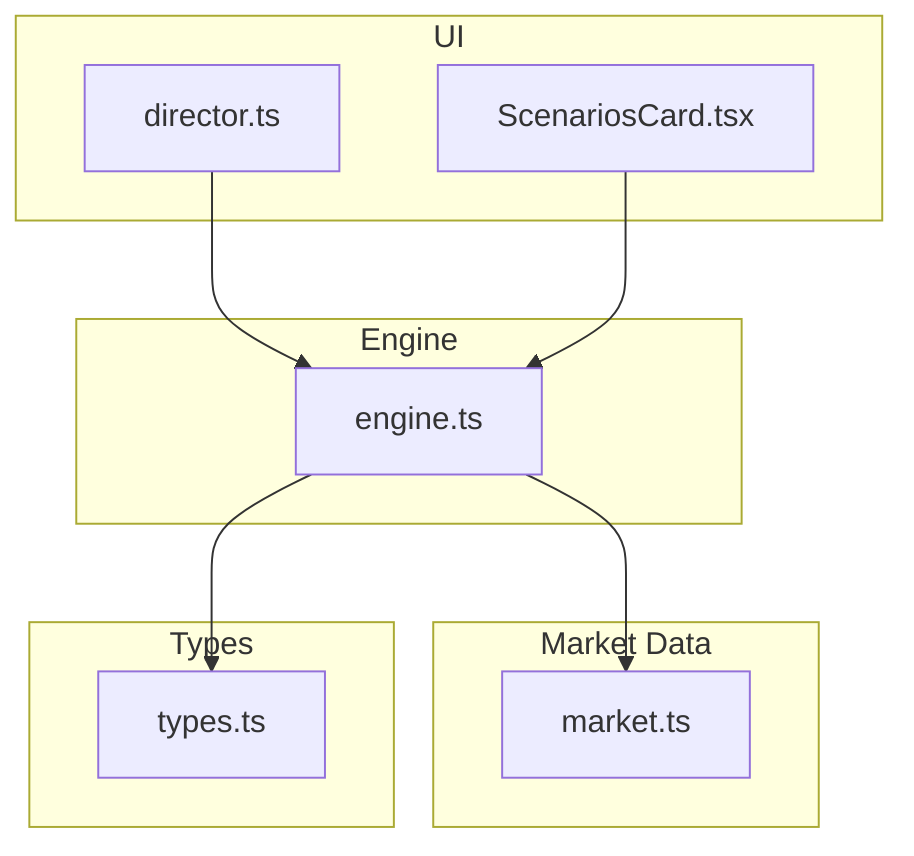
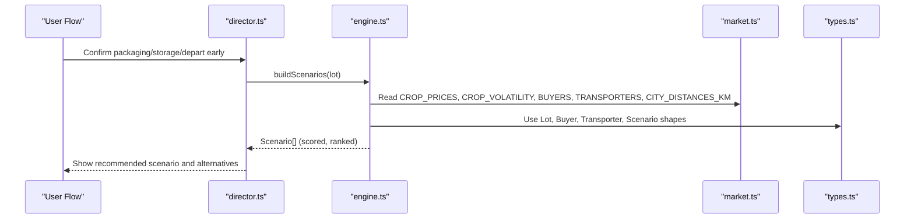
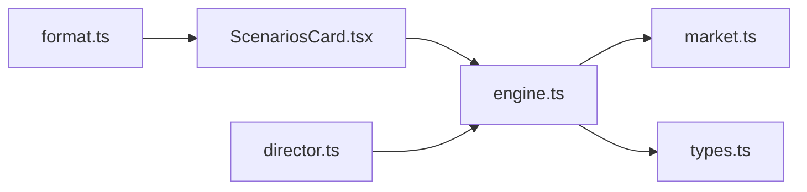

# Core Calculation Engine

<cite>
**Referenced Files in This Document**
- [engine.ts](file://freshroute/src/lib/engine.ts)
- [market.ts](file://freshroute/src/data/market.ts)
- [types.ts](file://freshroute/src/types.ts)
- [format.ts](file://freshroute/src/lib/format.ts)
- [ScenariosCard.tsx](file://freshroute/src/components/cards/ScenariosCard.tsx)
- [director.ts](file://freshroute/src/store/director.ts)
</cite>

## Table of Contents
1. Introduction
2. Project Structure
3. Core Components
4. Architecture Overview
5. Detailed Component Analysis
6. Dependency Analysis
7. Performance Considerations
8. Troubleshooting Guide
9. Conclusion
10. Appendices

## Introduction
This document explains FreshRoute’s core calculation engine that generates supply chain financial projections and optimizes scenarios for selling agricultural produce. It focuses on the buildScenarios function, spoilage modeling, transport cost algorithms, scoring and ranking, and all key constants used to compute net profit and risk-adjusted recommendations.

## Project Structure
The calculation engine is implemented as a small, focused module with clear separation between:
- Business rules and constants (engine.ts)
- Market data and reference tables (market.ts)
- Shared types (types.ts)
- Formatting utilities (format.ts)
- UI integration points (ScenariosCard.tsx, director.ts)

**Diagram sources**
- [engine.ts:1-258](file://freshroute/src/lib/engine.ts#L1-L258)
- [market.ts:1-189](file://freshroute/src/data/market.ts#L1-L189)
- [types.ts:1-229](file://freshroute/src/types.ts#L1-L229)
- [ScenariosCard.tsx:1-171](file://freshroute/src/components/cards/ScenariosCard.tsx#L1-L171)
- [director.ts:258-290](file://freshroute/src/store/director.ts#L258-L290)

**Section sources**
- [engine.ts:1-258](file://freshroute/src/lib/engine.ts#L1-L258)
- [market.ts:1-189](file://freshroute/src/data/market.ts#L1-L189)
- [types.ts:1-229](file://freshroute/src/types.ts#L1-L229)

## Core Components
- Scenario builder: buildScenarios(lot) produces multiple sell options (local mandi, direct buyers, cold storage + sell, premium buyer), computes gross/net, deductions, spoilage, risk, and scores them.
- Spoilage model: rule-based function using crop volatility, packaging, ripeness, and refrigeration effects.
- Transport cost model: distance-based pricing with vehicle type selection and transit time estimation.
- Scoring system: weighted function combining normalized net profit, buyer acceptance rate, and risk penalty; selects recommended scenario.
- Constants: market commission, platform fee, loading/cartage costs, and cold storage cost per kg-day.

**Section sources**
- [engine.ts:10-45](file://freshroute/src/lib/engine.ts#L10-L45)
- [engine.ts:47-235](file://freshroute/src/lib/engine.ts#L47-L235)
- [engine.ts:238-257](file://freshroute/src/lib/engine.ts#L238-L257)
- [market.ts:60-71](file://freshroute/src/data/market.ts#L60-L71)
- [market.ts:136-161](file://freshroute/src/data/market.ts#L136-L161)
- [types.ts:94-112](file://freshroute/src/types.ts#L94-L112)

## Architecture Overview
The engine orchestrates data from market tables and user lot inputs to generate ranked scenarios. The flow below maps to actual functions and data structures.

**Diagram sources**
- [director.ts:258-290](file://freshroute/src/store/director.ts#L258-L290)
- [engine.ts:47-235](file://freshroute/src/lib/engine.ts#L47-L235)
- [market.ts:1-189](file://freshroute/src/data/market.ts#L1-L189)
- [types.ts:34-112](file://freshroute/src/types.ts#L34-L112)

## Detailed Component Analysis

### buildScenarios: Local Mandi Sales
- Computes local price from CROP_PRICES based on lot location.
- Applies spoilagePct with base daily exposure for same-day sale.
- Deductions include mandi commission and local cartage.
- Net revenue = gross minus total deductions.
- Risk set to Low; payment terms same day.

Key behaviors:
- Uses gradePriceFactor only when applicable to non-local channels.
- Accepts quantity after spoilage loss.

**Section sources**
- [engine.ts:47-84](file://freshroute/src/lib/engine.ts#L47-L84)
- [market.ts:13-24](file://freshroute/src/data/market.ts#L13-L24)

### buildScenarios: Direct Buyer Matching
- Filters BUYERS by city, grade compatibility, quantity range, and no premium.
- For each matching buyer:
  - Distance lookup via CITY_DISTANCES_KM.
  - Transit hours estimated from distance.
  - Transit days determined by distance threshold.
  - Transport cost uses first transporter (open truck).
  - Spoilage depends on transit days.
  - Rejection percentage applied to acceptedKg.
  - Price adjusted by gradePriceFactor.
  - Deductions include transport, platform fee, and loading.

Why this matters:
- Ensures realistic logistics constraints and buyer acceptance rates are reflected in projected net.

**Section sources**
- [engine.ts:86-134](file://freshroute/src/lib/engine.ts#L86-L134)
- [market.ts:73-134](file://freshroute/src/data/market.ts#L73-L134)
- [market.ts:5-11](file://freshroute/src/data/market.ts#L5-L11)

### buildScenarios: Cold Storage Strategy
- Identifies best direct buyer scenario by net.
- Simulates storing lot for one day at cold storage cost per kg-day.
- Recomputes spoilage with lower base exposure due to refrigeration.
- Applies buyer rejection and grade-adjusted price.
- Deductions include transport, storage, platform fee, and loading.

Business rationale:
- Cold storage reduces spoilage but adds cost; only beneficial if expected price uplift or reduced loss outweighs storage cost.

**Section sources**
- [engine.ts:136-179](file://freshroute/src/lib/engine.ts#L136-L179)
- [market.ts:163-172](file://freshroute/src/data/market.ts#L163-L172)

### buildScenarios: Premium Buyer Scenarios
- Finds premium buyer requiring higher grade and offering price premium.
- Uses refrigerated transport option.
- Spoilage computed with refrigeration effect.
- Applies buyer rejection and premium price uplift.
- Deductions include refrigerated transport, platform fee, and loading.

Risk considerations:
- Higher rejection risk if lot grade does not meet buyer requirement.
- Refrigerated transport increases cost but protects quality.

**Section sources**
- [engine.ts:181-224](file://freshroute/src/lib/engine.ts#L181-L224)
- [market.ts:73-134](file://freshroute/src/data/market.ts#L73-L134)
- [market.ts:136-161](file://freshroute/src/data/market.ts#L136-L161)

### Spoilage Rate Calculations
- Base daily exposure varies by channel (same-day vs transit days).
- Multiplied by crop volatility factor from CROP_VOLATILITY.
- Packaging factor adjusts for crates/sacks/loose handling.
- Ripeness multiplier increases spoilage for high ripeness.
- Refrigeration reduces spoilage significantly.
- Cap prevents unrealistic losses.

Mathematical summary:
- spoilagePct = clamp(baseDailyExposure × cropVolatility × packagingFactor × ripenessMultiplier × refrigerationFactor, max 0.45)

Where:
- packagingFactor: crates=1.0, sacks=1.5, loose=2.2
- ripenessMultiplier: 1.15 if high ripeness detected
- refrigerationFactor: 0.45 if refrigerated

**Section sources**
- [engine.ts:23-36](file://freshroute/src/lib/engine.ts#L23-L36)
- [market.ts:60-71](file://freshroute/src/data/market.ts#L60-L71)

### Transport Cost Algorithms
- Distance-based pricing: costPerKm × distance.
- Vehicle type selection:
  - Direct buyers use open truck by default in scenario generation.
  - Premium buyers require refrigerated transport.
- Transit time estimation:
  - Hours ≈ 2 + distance / 60 (base formula).
  - Additional loading time for refrigerated vehicles.

Recommendation logic:
- Non-refrigerated “Rana” is marked as best value due to balance of cost and protection.

**Section sources**
- [engine.ts:238-257](file://freshroute/src/lib/engine.ts#L238-L257)
- [market.ts:136-161](file://freshroute/src/data/market.ts#L136-L161)

### Scoring System
- Weighted score combines:
  - Normalized net profit relative to maximum net across scenarios.
  - Buyer acceptance rate contribution.
  - Baseline factor.
  - Risk penalty subtracted based on scenario risk level.

Formula:
- score = 0.4 × (net / maxNet) + 0.15 × (acceptanceRate / 100) + 0.15 × 0.9 − riskPenalty

Risk penalties:
- Medium: 0.08
- Medium-High: 0.18
- Low: 0

Ranking:
- Scenarios sorted by descending score.
- Top scenario marked recommended.

**Section sources**
- [engine.ts:38-45](file://freshroute/src/lib/engine.ts#L38-L45)
- [engine.ts:226-235](file://freshroute/src/lib/engine.ts#L226-L235)

### Grade Price Factors and Deduction Logic
- Grade price factor:
  - A-grade: 1.0
  - B-grade: 0.875
  - C-grade: 0.75
- Deductions include:
  - Mandi commission (percentage of gross).
  - Platform fee (percentage of gross).
  - Loading and local cartage (fixed amounts).
  - Transport (distance-based).
  - Cold storage (per kg per day).

Business rationale:
- Reflects typical market discounts for lower grades and standard fees/costs in supply chain.

**Section sources**
- [engine.ts:16-27](file://freshroute/src/lib/engine.ts#L16-L27)
- [engine.ts:52-62](file://freshroute/src/lib/engine.ts#L52-L62)
- [engine.ts:106-111](file://freshroute/src/lib/engine.ts#L106-L111)
- [engine.ts:150-156](file://freshroute/src/lib/engine.ts#L150-L156)
- [engine.ts:193-198](file://freshroute/src/lib/engine.ts#L193-L198)

### Constants and Business Rationale
- MANDI_COMMISSION_RATE: Percentage charged by local mandi agents; reflects typical market practice.
- PLATFORM_FEE_RATE: Platform service fee percentage on gross sales.
- LOADING_COST: Fixed cost for loading/unloading operations.
- LOCAL_CARTAGE: Local transport cost within origin city.
- COLD_STORAGE_PER_KG_DAY: Daily cost to store produce under refrigeration per kilogram.

These constants ensure consistent financial modeling across scenarios and enable transparent explanations to users.

**Section sources**
- [engine.ts:10-14](file://freshroute/src/lib/engine.ts#L10-L14)

## Dependency Analysis
The engine depends on market data for prices, distances, buyers, transporters, and crop volatility. Types define contracts for input/output structures. UI components consume generated scenarios and display them with formatting helpers.

**Diagram sources**
- [engine.ts:1-258](file://freshroute/src/lib/engine.ts#L1-L258)
- [market.ts:1-189](file://freshroute/src/data/market.ts#L1-L189)
- [types.ts:1-229](file://freshroute/src/types.ts#L1-L229)
- [ScenariosCard.tsx:1-171](file://freshroute/src/components/cards/ScenariosCard.tsx#L1-L171)
- [director.ts:258-290](file://freshroute/src/store/director.ts#L258-L290)
- [format.ts:1-21](file://freshroute/src/lib/format.ts#L1-L21)

**Section sources**
- [engine.ts:1-258](file://freshroute/src/lib/engine.ts#L1-L258)
- [market.ts:1-189](file://freshroute/src/data/market.ts#L1-L189)
- [types.ts:1-229](file://freshroute/src/types.ts#L1-L229)
- [ScenariosCard.tsx:1-171](file://freshroute/src/components/cards/ScenariosCard.tsx#L1-L171)
- [director.ts:258-290](file://freshroute/src/store/director.ts#L258-L290)
- [format.ts:1-21](file://freshroute/src/lib/format.ts#L1-L21)

## Performance Considerations
- Scenario generation is lightweight and deterministic; complexity scales linearly with number of buyers and transporters.
- Distance lookups and price table accesses are constant-time dictionary operations.
- Spoilage calculations involve simple arithmetic and conditionals; negligible overhead.
- Sorting scenarios is O(n log n) where n is small (typically ≤ 5).

Optimization opportunities:
- Cache repeated distance and price lookups if batch processing many lots.
- Precompute grade factors and packaging factors if frequently reused.

[No sources needed since this section provides general guidance]

## Troubleshooting Guide
Common issues and diagnostics:
- Unexpected low net profit:
  - Verify buyer grade compatibility and rejection percentages.
  - Check transport cost assumptions and distance values.
  - Review spoilage inputs (ripeness, packaging, refrigeration).
- Mis-ranked recommendation:
  - Inspect risk penalties and acceptance rates influencing score.
  - Ensure maxNet normalization is correct across scenarios.
- UI display anomalies:
  - Confirm format helpers render PKR correctly.
  - Validate scenario fields match types expectations.

Debugging tips:
- Log intermediate values for gross, acceptedKg, deductions, and spoilagePct per scenario.
- Cross-check CITY_DISTANCES_KM entries for origin/destination pairs.
- Validate BUYER filters (grade, min/max kg, premium flags).

**Section sources**
- [engine.ts:47-235](file://freshroute/src/lib/engine.ts#L47-L235)
- [market.ts:5-11](file://freshroute/src/data/market.ts#L5-L11)
- [market.ts:73-134](file://freshroute/src/data/market.ts#L73-L134)
- [format.ts:1-21](file://freshroute/src/lib/format.ts#L1-L21)

## Conclusion
FreshRoute’s core calculation engine provides transparent, rule-based financial projections for agricultural supply chains. It models spoilage, transport costs, buyer acceptance, and risk to generate ranked scenarios with clear recommendations. The design emphasizes explainability through explicit formulas, constants, and structured outputs consumed by the UI.

[No sources needed since this section summarizes without analyzing specific files]

## Appendices

### Mathematical Formulas Summary
- Grade price factor:
  - A: 1.0
  - B: 0.875
  - C: 0.75
- Spoilage percent:
  - spoilagePct = clamp(baseDailyExposure × cropVolatility × packagingFactor × ripenessMultiplier × refrigerationFactor, max 0.45)
- Gross revenue:
  - gross = pricePerKg × acceptedKg
- Accepted quantity:
  - acceptedKg = quantityKg × (1 − spoilagePct − rejectionPct)
- Net revenue:
  - net = gross − sum(deductions)
- Score:
  - score = 0.4 × (net / maxNet) + 0.15 × (acceptanceRate / 100) + 0.15 × 0.9 − riskPenalty

**Section sources**
- [engine.ts:16-45](file://freshroute/src/lib/engine.ts#L16-L45)
- [engine.ts:47-235](file://freshroute/src/lib/engine.ts#L47-L235)

### Data Models Reference
Core types used by the engine:
- Lot: crop, quantityKg, location, packaging, vision (grade, ripeness), etc.
- Buyer: name, city, grade, premiumPct, acceptanceRate, rejectionPct, paymentTerms, min/max kg.
- Transporter: vehicle, refrigerated flag, costPerKm, onTimePct.
- Scenario: id, title, market, destCity, buyerName, gross, acceptedKg, deductions, net, spoilagePct, risk, paymentTerms, why, recommended, score.

**Section sources**
- [types.ts:34-112](file://freshroute/src/types.ts#L34-L112)

### UI Integration Notes
- Scenarios are displayed with formatted currency and spoilage/risk chips.
- Recommended scenario highlighted with net bar visualization.
- Director triggers scenario generation upon lot confirmation.

**Section sources**
- [ScenariosCard.tsx:1-171](file://freshroute/src/components/cards/ScenariosCard.tsx#L1-L171)
- [director.ts:258-290](file://freshroute/src/store/director.ts#L258-L290)