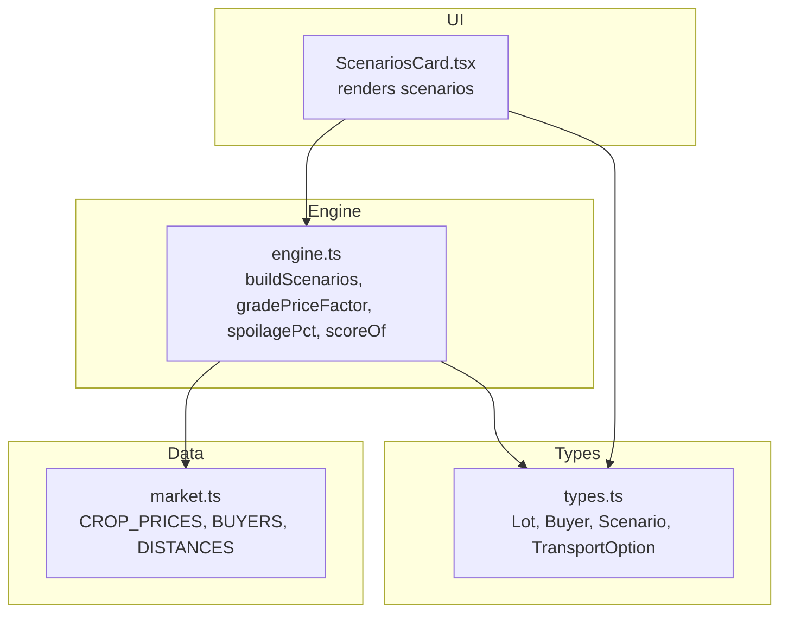
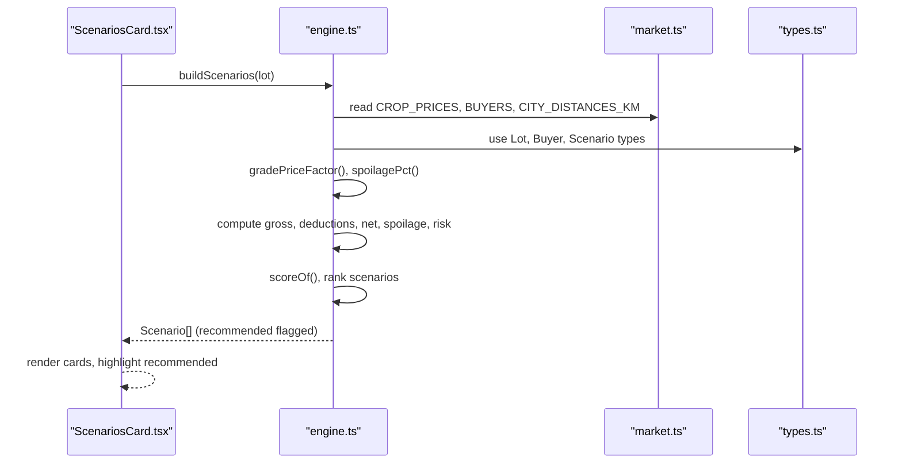
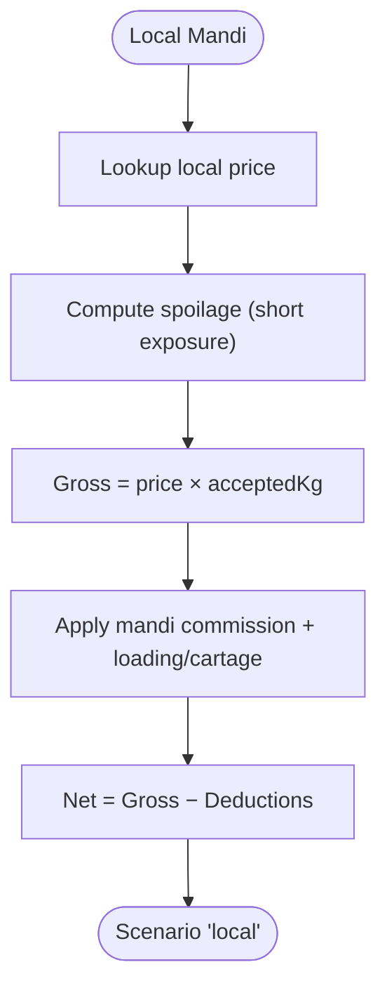
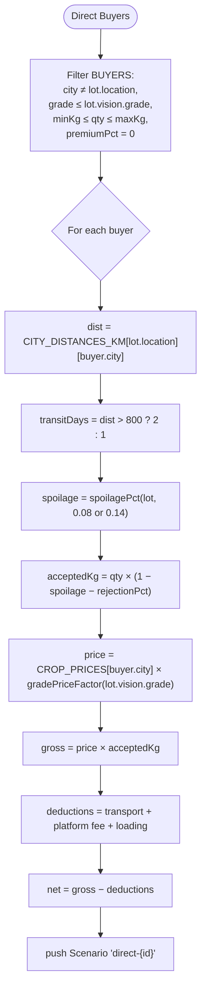
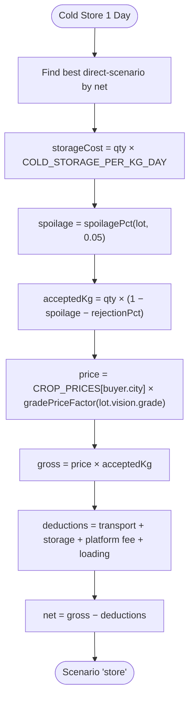
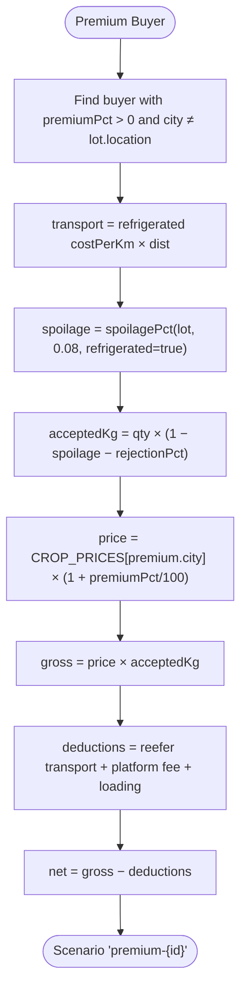
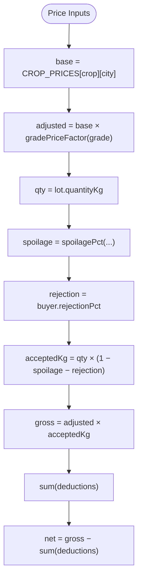
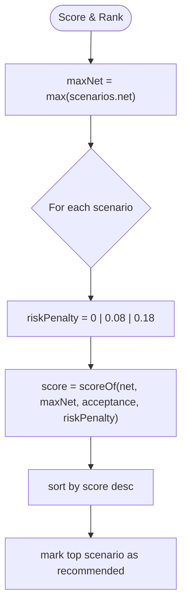
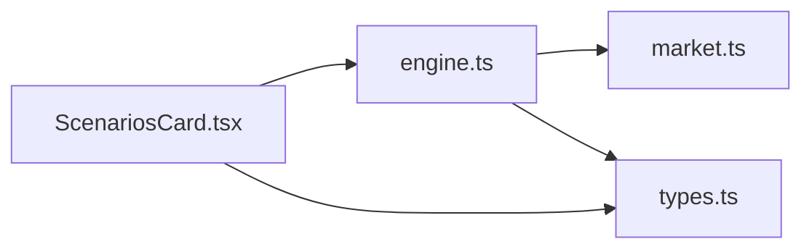
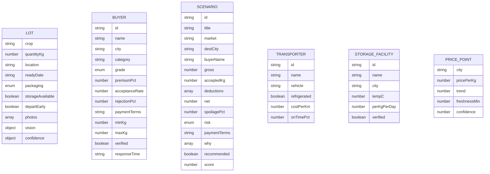

# Market Scenario Generation

<cite>
**Referenced Files in This Document**
- [engine.ts](file://freshroute/src/lib/engine.ts)
- [market.ts](file://freshroute/src/data/market.ts)
- [types.ts](file://freshroute/src/types.ts)
- [ScenariosCard.tsx](file://freshroute/src/components/cards/ScenariosCard.tsx)
</cite>

## Table of Contents
1. [Introduction](#introduction)
2. [Project Structure](#project-structure)
3. [Core Components](#core-components)
4. [Architecture Overview](#architecture-overview)
5. [Detailed Component Analysis](#detailed-component-analysis)
6. [Dependency Analysis](#dependency-analysis)
7. [Performance Considerations](#performance-considerations)
8. [Troubleshooting Guide](#troubleshooting-guide)
9. [Conclusion](#conclusion)
10. [Appendices](#appendices)

## Introduction
This document explains FreshRoute’s market scenario generation system that produces multiple selling strategies for each crop lot. The core engine builds four strategy types:
- Local mandi sale with commission agent deductions
- Direct wholesale buyer matching with grade filtering and quantity validation
- One-day cold storage followed by sale to the best direct buyer
- Premium buyer scenarios for high-grade produce

It also documents the buyer matching algorithm, price calculation logic using CROP_PRICES with gradePriceFactor adjustments, rejection rate handling, accepted weight calculations, scoring, and ranking. Examples illustrate how different lot characteristics generate distinct scenario sets with varying risk profiles and profit projections.

## Project Structure
The scenario generation spans a small set of focused modules:
- Data layer: market prices, distances, buyers, transporters, storages
- Engine: buildScenarios and helper functions (gradePriceFactor, spoilagePct, scoring)
- Types: shared interfaces for Lot, Buyer, Scenario, etc.
- UI: ScenariosCard renders generated scenarios and highlights the recommended option

**Diagram sources**
- [engine.ts:1-258](file://freshroute/src/lib/engine.ts#L1-L258)
- [market.ts:1-189](file://freshroute/src/data/market.ts#L1-L189)
- [types.ts:1-229](file://freshroute/src/types.ts#L1-L229)
- [ScenariosCard.tsx:1-172](file://freshroute/src/components/cards/ScenariosCard.tsx#L1-L172)

**Section sources**
- [engine.ts:1-258](file://freshroute/src/lib/engine.ts#L1-L258)
- [market.ts:1-189](file://freshroute/src/data/market.ts#L1-L189)
- [types.ts:1-229](file://freshroute/src/types.ts#L1-L229)
- [ScenariosCard.tsx:1-172](file://freshroute/src/components/cards/ScenariosCard.tsx#L1-L172)

## Core Components
- buildScenarios(lot): Generates four strategy branches per lot, computes gross/net, deductions, spoilage, risk, payment terms, and reasons; then scores and ranks them.
- gradePriceFactor(grade): Adjusts base mandi price based on grade (A=1, B≈−12.5%, C≈−25%).
- spoilagePct(lot, baseDailyExposure, refrigerated): Rule-based spoilage model influenced by crop volatility, packaging, ripeness, and refrigeration.
- scoreOf(net, maxNet, acceptance, riskPenalty): Weighted scoring combining net profit, buyer acceptance, baseline factor, and risk penalty.

Key constants:
- Mandi commission rate, platform fee rate, loading cost, local cartage, cold storage cost per kg per day.

**Section sources**
- [engine.ts:10-45](file://freshroute/src/lib/engine.ts#L10-L45)
- [engine.ts:47-235](file://freshroute/src/lib/engine.ts#L47-L235)

## Architecture Overview
The system transforms a Lot into a ranked list of Scenario options. It uses market data to compute realistic financial outcomes under different selling paths and risk assumptions.

**Diagram sources**
- [engine.ts:47-235](file://freshroute/src/lib/engine.ts#L47-L235)
- [market.ts:13-134](file://freshroute/src/data/market.ts#L13-L134)
- [types.ts:34-112](file://freshroute/src/types.ts#L34-L112)
- [ScenariosCard.tsx:89-171](file://freshroute/src/components/cards/ScenariosCard.tsx#L89-L171)

## Detailed Component Analysis

### buildScenarios: Strategy A — Local Mandi Sale
- Price source: local mandi price from CROP_PRICES[lot.location]
- Spoilage: short exposure (same day), minimal transit risk
- Deductions: mandi commission and loading/local cartage
- Net: gross minus deductions
- Risk: Low (immediate sale, no transport dependency)
- Payment: same day

**Diagram sources**
- [engine.ts:52-84](file://freshroute/src/lib/engine.ts#L52-L84)

**Section sources**
- [engine.ts:52-84](file://freshroute/src/lib/engine.ts#L52-L84)

### buildScenarios: Strategy B — Direct Wholesale Buyers
Buyer matching algorithm filters BUYERS by:
- City: not equal to lot location
- Grade requirement: buyer.grade is "any" or less than or equal to lot.vision.grade
- Quantity range: lot.quantityKg within buyer.minKg..maxKg
- Premium status: buyer.premiumPct must be 0 (non-premium wholesale)

For each matched buyer:
- Distance and transit time derived from CITY_DISTANCES_KM
- Transport cost uses first transporter (open truck)
- Spoilage depends on transit days (1 vs 2)
- Rejection applied via buyer.rejectionPct
- Price uses destination city price adjusted by gradePriceFactor(lot.vision.grade)
- Deductions include transport, platform fee, loading
- Risk: Medium (depends on transit length)

**Diagram sources**
- [engine.ts:86-134](file://freshroute/src/lib/engine.ts#L86-L134)
- [market.ts:73-134](file://freshroute/src/data/market.ts#L73-L134)

**Section sources**
- [engine.ts:86-134](file://freshroute/src/lib/engine.ts#L86-L134)
- [market.ts:73-134](file://freshroute/src/data/market.ts#L73-L134)

### buildScenarios: Strategy C — Cold Storage One Day, Then Sell
- Identifies the best direct buyer scenario by highest net among direct options
- Adds one-day cold storage cost per kg per day
- Uses open truck transport to the selected buyer’s city
- Applies spoilage reduction for refrigerated holding and buyer rejection
- Price remains based on destination mandi price adjusted by grade factor
- Deductions include transport, storage, platform fee, loading

**Diagram sources**
- [engine.ts:136-179](file://freshroute/src/lib/engine.ts#L136-L179)

**Section sources**
- [engine.ts:136-179](file://freshroute/src/lib/engine.ts#L136-L179)

### buildScenarios: Strategy D — Premium Buyer Scenario
- Selects a premium buyer (premiumPct > 0) outside lot location
- Requires refrigerated transport
- Spoilage reduced due to refrigeration
- Applies buyer rejection rate
- Price includes premium percentage over mandi price in buyer’s city
- Deductions include refrigerated transport, platform fee, loading
- Risk: Medium-High due to strict quality inspection and higher costs

**Diagram sources**
- [engine.ts:181-224](file://freshroute/src/lib/engine.ts#L181-L224)

**Section sources**
- [engine.ts:181-224](file://freshroute/src/lib/engine.ts#L181-L224)

### Pricing, Rejection, and Accepted Weight Logic
- Base price: CROP_PRICES[crop][city]
- Grade adjustment: gradePriceFactor(lot.vision.grade)
- Rejection: buyer.rejectionPct reduces accepted weight
- Accepted weight: qty × (1 − spoilage − rejection)
- Deductions vary by strategy (mandi commission, transport, platform fee, loading, storage)
- Net: gross minus total deductions

**Diagram sources**
- [engine.ts:16-21](file://freshroute/src/lib/engine.ts#L16-L21)
- [engine.ts:29-36](file://freshroute/src/lib/engine.ts#L29-L36)
- [engine.ts:95-111](file://freshroute/src/lib/engine.ts#L95-L111)
- [engine.ts:144-156](file://freshroute/src/lib/engine.ts#L144-L156)
- [engine.ts:188-198](file://freshroute/src/lib/engine.ts#L188-L198)

**Section sources**
- [engine.ts:16-21](file://freshroute/src/lib/engine.ts#L16-L21)
- [engine.ts:29-36](file://freshroute/src/lib/engine.ts#L29-L36)
- [engine.ts:95-111](file://freshroute/src/lib/engine.ts#L95-L111)
- [engine.ts:144-156](file://freshroute/src/lib/engine.ts#L144-L156)
- [engine.ts:188-198](file://freshroute/src/lib/engine.ts#L188-L198)

### Scoring and Ranking
- Score combines normalized net profit, buyer acceptance rate, baseline factor, and risk penalty
- Scenarios are sorted by score descending
- Highest-scored scenario marked as recommended

**Diagram sources**
- [engine.ts:38-45](file://freshroute/src/lib/engine.ts#L38-L45)
- [engine.ts:226-235](file://freshroute/src/lib/engine.ts#L226-L235)

**Section sources**
- [engine.ts:38-45](file://freshroute/src/lib/engine.ts#L38-L45)
- [engine.ts:226-235](file://freshroute/src/lib/engine.ts#L226-L235)

### Example Scenarios by Lot Characteristics
Below are conceptual examples showing how different lots produce different scenario sets. These illustrate typical outcomes without quoting code.

- High-value, high-grade, medium quantity in Multan destined for Lahore:
  - Local mandi: low net due to lower local price and commission
  - Direct buyer: matches non-premium wholesale buyer in Lahore if grade and quantity fit; moderate transport cost; net often higher than local
  - Cold storage: adds storage cost but may reduce spoilage; net depends on buyer rejection and transport
  - Premium buyer: only if lot meets strict grade; refrigerated transport increases cost; potential premium uplift may offset costs

- Low-grade, large quantity in Faisalabad:
  - Local mandi: immediate cash, low risk, but lower price
  - Direct buyer: may match any-grade buyer in Karachi with large capacity; transport cost significant; net can still exceed local
  - Cold storage: limited benefit for low-grade; storage cost may outweigh spoilage reduction
  - Premium buyer: unlikely due to grade mismatch; rejected or not offered

- Perishable leafy vegetables in crates, ready early morning:
  - Local mandi: minimal spoilage, quick sale
  - Direct buyer: short transit preferred; refrigeration optional if dispatched early
  - Cold storage: beneficial for highly perishable crops; storage cost justified if price expected to rise
  - Premium buyer: possible if grade meets requirements; refrigeration mandatory

These examples reflect how crop type, location, grade, quantity, packaging, and timing influence which strategies are viable and their relative profitability and risk.

[No sources needed since this section provides conceptual examples grounded in the documented logic]

## Dependency Analysis
- engine.ts depends on market.ts for prices, distances, buyers, transporters, storages
- engine.ts uses types.ts for Lot, Buyer, Scenario, TransportOption
- ScenariosCard.tsx consumes Scenario[] and displays results

**Diagram sources**
- [engine.ts:1-8](file://freshroute/src/lib/engine.ts#L1-L8)
- [market.ts:1-189](file://freshroute/src/data/market.ts#L1-L189)
- [types.ts:1-229](file://freshroute/src/types.ts#L1-L229)
- [ScenariosCard.tsx:1-172](file://freshroute/src/components/cards/ScenariosCard.tsx#L1-L172)

**Section sources**
- [engine.ts:1-8](file://freshroute/src/lib/engine.ts#L1-L8)
- [market.ts:1-189](file://freshroute/src/data/market.ts#L1-L189)
- [types.ts:1-229](file://freshroute/src/types.ts#L1-L229)
- [ScenariosCard.tsx:1-172](file://freshroute/src/components/cards/ScenariosCard.tsx#L1-L172)

## Performance Considerations
- Filtering buyers is O(n) per lot; acceptable given small buyer lists
- Sorting scenarios is O(m log m); negligible for small m
- Spoilage and pricing computations are constant-time per scenario
- Overall complexity per lot is dominated by linear passes through buyers and scenarios

[No sources needed since this section provides general guidance]

## Troubleshooting Guide
- No direct buyers match:
  - Check grade constraints and quantity ranges; adjust lot vision or consider local mandi
- Unexpectedly low net:
  - Verify transport distance and mode; ensure correct city mapping
  - Confirm gradePriceFactor applied correctly for non-A grades
- Premium scenarios not offered:
  - Ensure lot grade meets premium buyer requirements; otherwise risk of rejection is high
- Cold storage not beneficial:
  - Evaluate spoilage reduction versus storage cost; may not justify added expense for low-perishability crops

[No sources needed since this section provides general guidance]

## Conclusion
FreshRoute’s scenario generation system provides a transparent, rule-based comparison of selling strategies per lot. It balances profitability, risk, and logistics to recommend the most suitable path while offering alternatives for different priorities (speed vs. yield vs. premium markets). The modular design keeps pricing, spoilage, and matching logic clear and maintainable.

[No sources needed since this section summarizes without analyzing specific files]

## Appendices

### Data Models Used by the System

**Diagram sources**
- [types.ts:34-112](file://freshroute/src/types.ts#L34-L112)
- [types.ts:130-185](file://freshroute/src/types.ts#L130-L185)
- [market.ts:13-183](file://freshroute/src/data/market.ts#L13-L183)