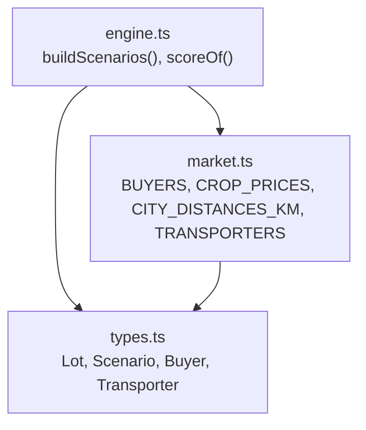
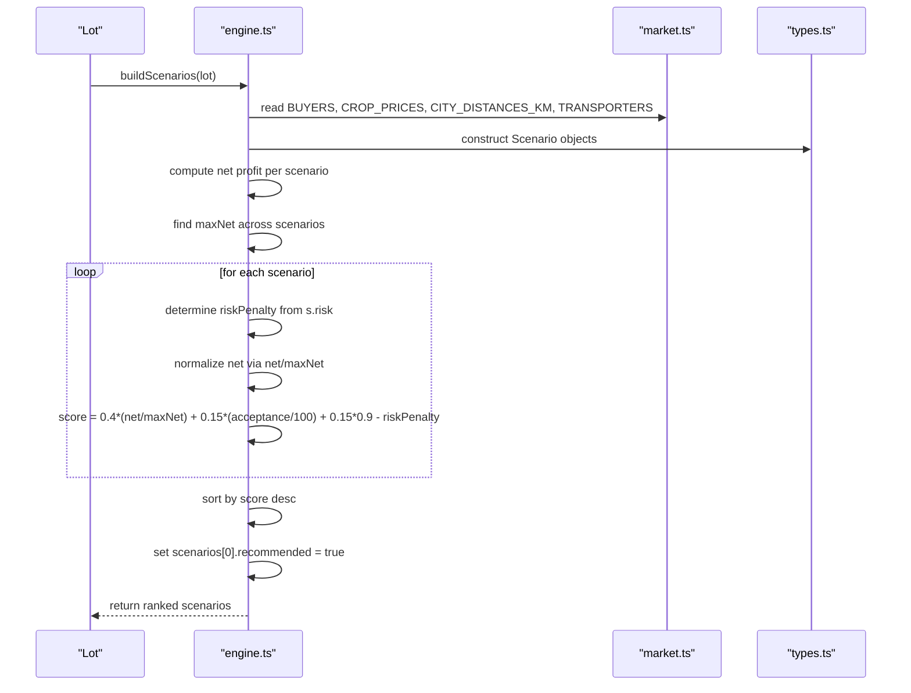
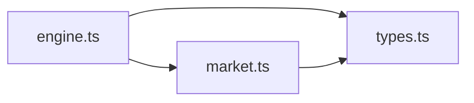
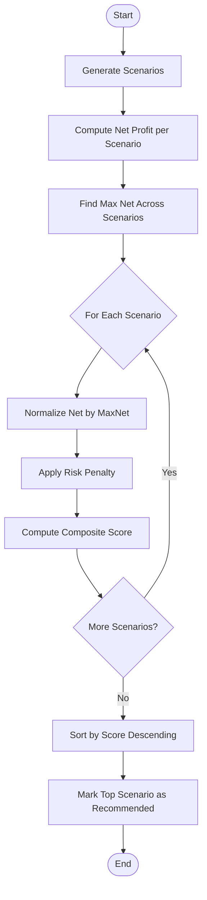

# Scenario Scoring & Ranking

<cite>
**Referenced Files in This Document**
- [engine.ts](file://freshroute/src/lib/engine.ts)
- [market.ts](file://freshroute/src/data/market.ts)
- [types.ts](file://freshroute/src/types.ts)
</cite>

## Table of Contents
1. [Introduction](#introduction)
2. [Project Structure](#project-structure)
3. [Core Components](#core-components)
4. [Architecture Overview](#architecture-overview)
5. [Detailed Component Analysis](#detailed-component-analysis)
6. [Dependency Analysis](#dependency-analysis)
7. [Performance Considerations](#performance-considerations)
8. [Troubleshooting Guide](#troubleshooting-guide)
9. [Conclusion](#conclusion)
10. [Appendices](#appendices)

## Introduction
This document explains FreshRoute’s scenario scoring and ranking system that evaluates and prioritizes different selling strategies for a lot of produce. It focuses on the scoreOf function, the weighted scoring formula (net profit weighting, buyer acceptance rate, baseline performance, and risk penalty deductions), the normalization process that scales net profits against the maximum available net profit across all scenarios, and the recommendation algorithm that automatically marks the highest-scoring scenario as recommended. It also provides mathematical examples to illustrate how transport costs, spoilage rates, buyer acceptance probabilities, and risk assessments impact final rankings.

## Project Structure
The scoring and ranking logic is implemented in the engine module, which constructs candidate scenarios from market data and types, then scores and ranks them. Market parameters such as prices, distances, buyers, and transporters are defined in the market data file. Type definitions describe the structures used throughout the system.

**Diagram sources**
- [engine.ts:38-45](file://freshroute/src/lib/engine.ts#L38-L45)
- [engine.ts:47-235](file://freshroute/src/lib/engine.ts#L47-L235)
- [market.ts:5-24](file://freshroute/src/data/market.ts#L5-L24)
- [market.ts:61-71](file://freshroute/src/data/market.ts#L61-L71)
- [market.ts:73-134](file://freshroute/src/data/market.ts#L73-L134)
- [market.ts:136-161](file://freshroute/src/data/market.ts#L136-L161)
- [types.ts:94-112](file://freshroute/src/types.ts#L94-L112)

**Section sources**
- [engine.ts:38-45](file://freshroute/src/lib/engine.ts#L38-L45)
- [engine.ts:47-235](file://freshroute/src/lib/engine.ts#L47-L235)
- [market.ts:5-24](file://freshroute/src/data/market.ts#L5-L24)
- [market.ts:61-71](file://freshroute/src/data/market.ts#L61-L71)
- [market.ts:73-134](file://freshroute/src/data/market.ts#L73-L134)
- [market.ts:136-161](file://freshroute/src/data/market.ts#L136-L161)
- [types.ts:94-112](file://freshroute/src/types.ts#L94-L112)

## Core Components
- Score function: Computes a composite score per scenario using normalized net profit, buyer acceptance rate, baseline performance, and risk penalty.
- Scenario builder: Generates multiple candidate strategies (local mandi sale, direct wholesale buyers, cold storage option, premium buyer option).
- Risk penalty mapping: Applies penalties based on scenario risk levels.
- Normalization: Scales each scenario’s net profit by the maximum net profit among all scenarios before weighting.
- Recommendation: Sorts scenarios by score and marks the top one as recommended.

Key implementation references:
- scoreOf function definition and formula
- buildScenarios function that creates scenarios and applies scoring/ranking
- Market data providing buyer acceptance rates and other parameters
- Types defining Scenario fields including risk, score, and recommended flag

**Section sources**
- [engine.ts:38-45](file://freshroute/src/lib/engine.ts#L38-L45)
- [engine.ts:47-235](file://freshroute/src/lib/engine.ts#L47-L235)
- [market.ts:73-134](file://freshroute/src/data/market.ts#L73-L134)
- [types.ts:94-112](file://freshroute/src/types.ts#L94-L112)

## Architecture Overview
The scoring pipeline operates as follows:
1. Generate candidate scenarios with gross revenue, deductions, accepted quantity, spoilage, and risk level.
2. Compute max net profit across all scenarios.
3. For each scenario, compute risk penalty based on risk level.
4. Normalize net profit by dividing by max net profit.
5. Apply weighted scoring formula to get a composite score.
6. Sort scenarios by descending score and mark the top scenario as recommended.

**Diagram sources**
- [engine.ts:47-235](file://freshroute/src/lib/engine.ts#L47-L235)
- [market.ts:73-134](file://freshroute/src/data/market.ts#L73-L134)
- [types.ts:94-112](file://freshroute/src/types.ts#L94-L112)

## Detailed Component Analysis

### Weighted Scoring Formula (scoreOf)
The scoreOf function computes a composite score using:
- Net profit weighting: 40% of normalized net profit (net / maxNet)
- Buyer acceptance rate: 15% of acceptance percentage divided by 100
- Baseline performance: constant term 0.15 * 0.9
- Risk penalty deduction: subtracts a fixed penalty based on scenario risk

Formula:
- score = 0.4 × (net / maxNet) + 0.15 × (acceptance / 100) + 0.15 × 0.9 − riskPenalty

Normalization:
- Each scenario’s net profit is scaled by the maximum net profit across all scenarios to ensure comparability.

Risk penalty mapping:
- Medium: 8% penalty
- Medium-High: 18% penalty
- Low: 0% penalty

References:
- scoreOf function and formula
- Risk penalty assignment within scenario scoring loop
- Normalization via maxNet

**Section sources**
- [engine.ts:38-45](file://freshroute/src/lib/engine.ts#L38-L45)
- [engine.ts:226-235](file://freshroute/src/lib/engine.ts#L226-L235)

### Scenario Generation and Inputs
The system generates four categories of scenarios:
- Local mandi sale today: immediate cash, local price, minimal transport risk
- Direct wholesale buyers: nearby city buyers with transport cost, platform fee, loading cost; spoilage depends on transit time
- Cold storage option: store for one day then sell to best direct buyer; includes storage cost and reduced spoilage
- Premium buyer option: higher price but stricter grade requirements and refrigerated transport

Inputs influencing outcomes:
- Crop prices by city
- Distances between cities
- Spoilage model influenced by crop volatility, packaging, ripeness, and refrigeration
- Buyer acceptance and rejection rates
- Transport costs and vehicle type
- Platform fees and loading/cartage costs

References:
- Scenario construction blocks for each strategy
- Spoilage calculation factors
- Deductions applied per scenario
- Risk assignment per scenario

**Section sources**
- [engine.ts:52-84](file://freshroute/src/lib/engine.ts#L52-L84)
- [engine.ts:86-134](file://freshroute/src/lib/engine.ts#L86-L134)
- [engine.ts:136-179](file://freshroute/src/lib/engine.ts#L136-L179)
- [engine.ts:181-224](file://freshroute/src/lib/engine.ts#L181-L224)
- [market.ts:5-24](file://freshroute/src/data/market.ts#L5-L24)
- [market.ts:61-71](file://freshroute/src/data/market.ts#L61-L71)
- [market.ts:73-134](file://freshroute/src/data/market.ts#L73-L134)
- [market.ts:136-161](file://freshroute/src/data/market.ts#L136-L161)

### Recommendation Algorithm
After scoring:
- Scenarios are sorted by descending score
- The first scenario (highest score) is marked as recommended

This ensures the most favorable strategy according to the weighted formula is highlighted for decision-making.

**Section sources**
- [engine.ts:226-235](file://freshroute/src/lib/engine.ts#L226-L235)

### Mathematical Examples
Below are step-by-step examples demonstrating how different factors influence final scores and rankings. All calculations follow the same formula and normalization approach.

Example 1: Local mandi vs direct buyer
- Assume two scenarios:
  - Local mandi: net = 100, acceptance = 95%, risk = Low
  - Direct buyer: net = 120, acceptance = 82%, risk = Medium
- Max net = 120
- Normalized nets:
  - Local: 100 / 120 ≈ 0.833
  - Direct: 120 / 120 = 1.0
- Risk penalties:
  - Local: 0
  - Direct: 0.08
- Scores:
  - Local: 0.4×0.833 + 0.15×(95/100) + 0.15×0.9 − 0 = 0.333 + 0.1425 + 0.135 = 0.6105
  - Direct: 0.4×1.0 + 0.15×(82/100) + 0.15×0.9 − 0.08 = 0.4 + 0.123 + 0.135 − 0.08 = 0.578
- Ranking: Local mandi scores higher due to lower risk penalty despite lower normalized net profit.

Example 2: Impact of transport costs and spoilage
- Two direct-buyer scenarios to different cities:
  - City A: transport cost high, spoilage moderate, acceptance 80%, risk Medium
  - City B: transport cost low, spoilage low, acceptance 85%, risk Medium
- Higher transport cost reduces net profit; higher spoilage reduces accepted quantity and thus gross and net.
- Even if City A has higher base price, increased deductions and spoilage can reduce its normalized net enough that City B may rank higher after applying risk penalty.

Example 3: Premium buyer with strict grade
- Premium buyer offers higher price but higher rejection probability and requires refrigerated transport.
- If the lot’s estimated grade does not match premium requirements, expected accepted quantity drops significantly due to rejectionPct.
- Combined with higher transport cost and potential risk level Medium-High (penalty 0.18), the premium scenario often scores lower unless price premium and acceptance justify it.

Example 4: Cold storage trade-off
- Storing for one day reduces spoilage but adds storage cost per kg per day.
- If price increase is uncertain, the added storage cost may outweigh spoilage reduction, lowering net profit and thus normalized net.
- With risk Medium (penalty 0.08), cold storage scenario may rank below direct or local options unless conditions favor significant spoilage reduction.

These examples show how transport costs, spoilage rates, buyer acceptance probabilities, and risk assessments collectively determine final rankings.

**Section sources**
- [engine.ts:38-45](file://freshroute/src/lib/engine.ts#L38-L45)
- [engine.ts:86-134](file://freshroute/src/lib/engine.ts#L86-L134)
- [engine.ts:136-179](file://freshroute/src/lib/engine.ts#L136-L179)
- [engine.ts:181-224](file://freshroute/src/lib/engine.ts#L181-L224)
- [market.ts:73-134](file://freshroute/src/data/market.ts#L73-L134)

## Dependency Analysis
The scoring system depends on:
- Market data for prices, distances, buyers, and transporters
- Type definitions for consistent structure across components
- Engine logic to generate scenarios, compute net profits, apply risk penalties, and rank

**Diagram sources**
- [engine.ts:1-8](file://freshroute/src/lib/engine.ts#L1-L8)
- [market.ts:1-2](file://freshroute/src/data/market.ts#L1-L2)
- [types.ts:1-12](file://freshroute/src/types.ts#L1-L12)

**Section sources**
- [engine.ts:1-8](file://freshroute/src/lib/engine.ts#L1-L8)
- [market.ts:1-2](file://freshroute/src/data/market.ts#L1-L2)
- [types.ts:1-12](file://freshroute/src/types.ts#L1-L12)

## Performance Considerations
- Complexity: Scenario generation and scoring are linear in the number of scenarios; sorting is O(n log n). Given small n (typically 4–6 scenarios), performance is negligible.
- Numerical stability: Normalization by maxNet avoids scale issues and keeps weights comparable.
- Data freshness: Prices and distances are static in this codebase; updates would require refreshing market data.

[No sources needed since this section provides general guidance]

## Troubleshooting Guide
Common issues and checks:
- Zero or negative maxNet: Ensure at least one scenario yields positive net profit; otherwise normalization becomes undefined or misleading.
- Incorrect risk assignment: Verify risk values align with scenario characteristics (e.g., longer transit times or premium buyers may be Medium or Medium-High).
- Acceptance rate mismatch: Confirm buyer acceptanceRate matches the intended buyer; defaults may apply if lookup fails.
- Deduction errors: Validate transport cost calculations, platform fees, loading/cartage, and storage costs are correctly applied per scenario.

**Section sources**
- [engine.ts:226-235](file://freshroute/src/lib/engine.ts#L226-L235)
- [engine.ts:86-134](file://freshroute/src/lib/engine.ts#L86-L134)
- [engine.ts:136-179](file://freshroute/src/lib/engine.ts#L136-L179)
- [engine.ts:181-224](file://freshroute/src/lib/engine.ts#L181-L224)

## Conclusion
FreshRoute’s scenario scoring and ranking system provides a transparent, rule-based method to evaluate and prioritize selling strategies. By normalizing net profits, incorporating buyer acceptance rates, maintaining a baseline performance term, and penalizing risk appropriately, the system identifies the most favorable option and marks it as recommended. The examples demonstrate how transport costs, spoilage, acceptance probabilities, and risk assessments interact to shape final rankings, enabling informed decision-making for farmers and agents.

[No sources needed since this section summarizes without analyzing specific files]

## Appendices

### Scoring Flowchart

**Diagram sources**
- [engine.ts:47-235](file://freshroute/src/lib/engine.ts#L47-L235)