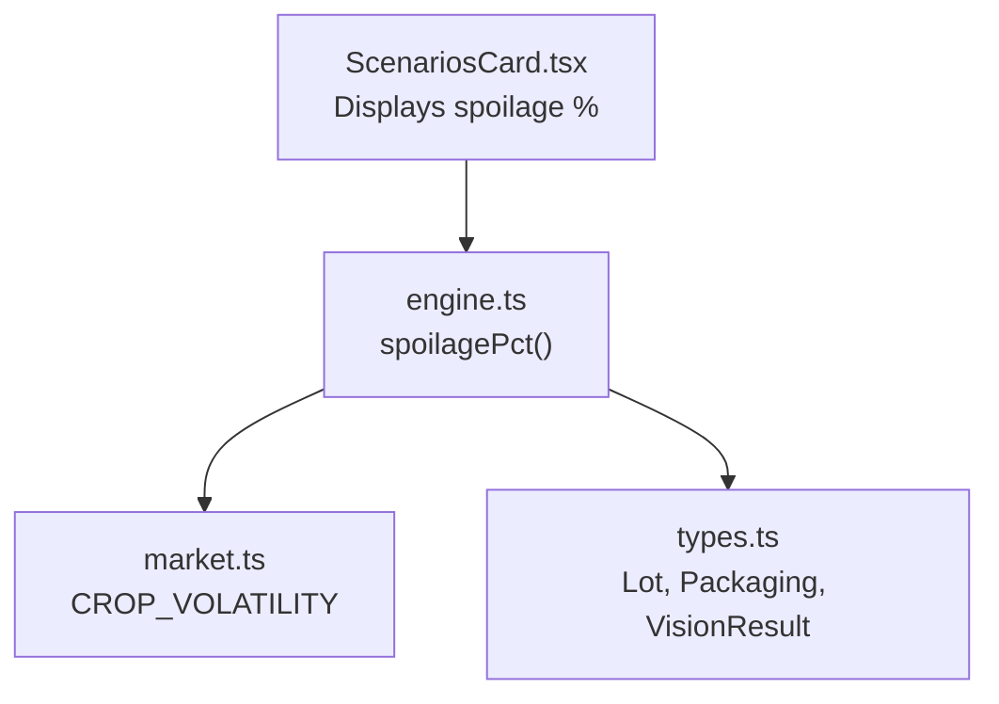
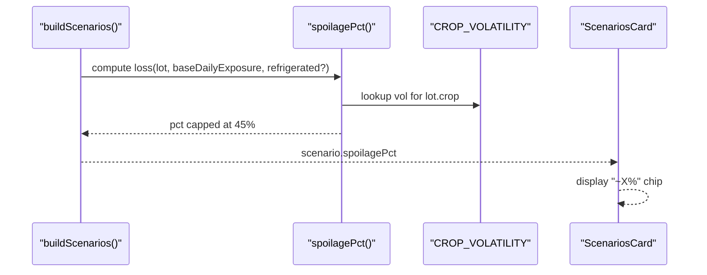
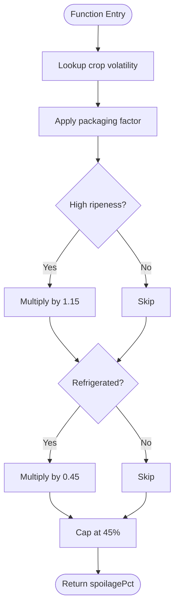
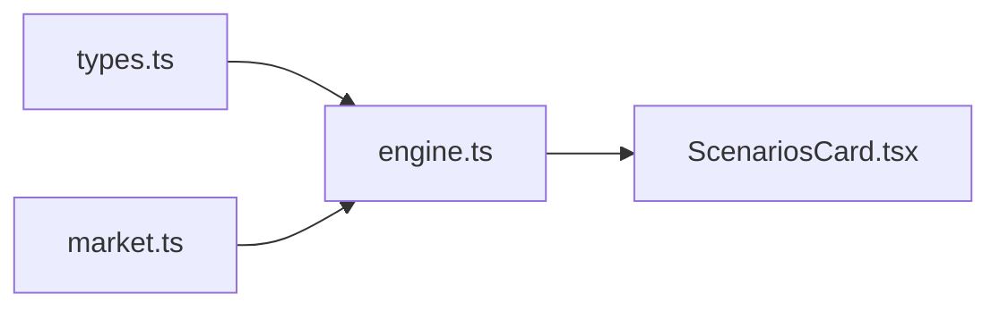

# Spoilage Modeling System

<cite>
**Referenced Files in This Document**
- [engine.ts](file://freshroute/src/lib/engine.ts)
- [market.ts](file://freshroute/src/data/market.ts)
- [types.ts](file://freshroute/src/types.ts)
- [ScenariosCard.tsx](file://freshroute/src/components/cards/ScenariosCard.tsx)
- [FreshRoute_Agent_PRD.md](file://FreshRoute_Agent_PRD.md)
</cite>

## Table of Contents
1. [Introduction](#introduction)
2. [Project Structure](#project-structure)
3. [Core Components](#core-components)
4. [Architecture Overview](#architecture-overview)
5. [Detailed Component Analysis](#detailed-component-analysis)
6. [Dependency Analysis](#dependency-analysis)
7. [Performance Considerations](#performance-considerations)
8. [Troubleshooting Guide](#troubleshooting-guide)
9. [Conclusion](#conclusion)
10. [Appendices](#appendices)

## Introduction
This document explains FreshRoute’s spoilage modeling system used to estimate crop loss rates across different selling and transport scenarios. The core function spoilagePct computes a percentage loss per exposure period by combining:
- Base daily exposure rate (varies by scenario)
- Crop volatility multiplier from CROP_VOLATILITY
- Packaging factor adjustment (crates vs sacks vs loose)
- Ripeness impact (high ripeness increases risk)
- Refrigeration effect (cold chain reduces spoilage)
- A hard cap that limits maximum spoilage to 45%

The model is rule-based, transparent, and designed for explainability in farmer-facing recommendations.

## Project Structure
Spoilage calculations are implemented in the engine module and use market data constants for crop volatility and pricing. UI components display the computed spoilage percentages as part of scenario cards.

**Diagram sources**
- [engine.ts:23-36](file://freshroute/src/lib/engine.ts#L23-L36)
- [market.ts:60-71](file://freshroute/src/data/market.ts#L60-L71)
- [types.ts:15-45](file://freshroute/src/types.ts#L15-L45)
- [ScenariosCard.tsx:54-54](file://freshroute/src/components/cards/ScenariosCard.tsx#L54-L54)

**Section sources**
- [engine.ts:23-36](file://freshroute/src/lib/engine.ts#L23-L36)
- [market.ts:60-71](file://freshroute/src/data/market.ts#L60-L71)
- [types.ts:15-45](file://freshroute/src/types.ts#L15-L45)
- [ScenariosCard.tsx:54-54](file://freshroute/src/components/cards/ScenariosCard.tsx#L54-L54)

## Core Components
- spoilagePct: Computes the estimated spoilage percentage for a lot given base exposure, crop type, packaging, ripeness, and refrigeration.
- packagingFactor: Adjusts spoilage based on packaging type (crates best, sacks moderate, loose worst).
- CROP_VOLATILITY: Per-crop multipliers reflecting relative perishability compared to tomato.
- Scenario builders: Use spoilagePct with scenario-specific baseDailyExposure values to estimate losses for local mandi sales, direct transport, cold storage, and premium buyer routes.

Key responsibilities:
- Translate business rules into a simple, auditable formula.
- Provide consistent spoilage estimates across scenarios.
- Surface results to the UI for farmer decision-making.

**Section sources**
- [engine.ts:23-36](file://freshroute/src/lib/engine.ts#L23-L36)
- [market.ts:60-71](file://freshroute/src/data/market.ts#L60-L71)
- [engine.ts:47-235](file://freshroute/src/lib/engine.ts#L47-L235)

## Architecture Overview
The spoilage model is embedded within the scenario builder. Each scenario sets an appropriate baseDailyExposure value representing typical daily exposure under that route or storage condition. The model then applies crop volatility, packaging adjustments, ripeness modifiers, and refrigeration effects before capping the result at 45%.

**Diagram sources**
- [engine.ts:47-235](file://freshroute/src/lib/engine.ts#L47-L235)
- [engine.ts:29-36](file://freshroute/src/lib/engine.ts#L29-L36)
- [market.ts:60-71](file://freshroute/src/data/market.ts#L60-L71)
- [ScenariosCard.tsx:54-54](file://freshroute/src/components/cards/ScenariosCard.tsx#L54-L54)

## Detailed Component Analysis

### Mathematical Model
The spoilage calculation follows this sequence:
1. Start with baseDailyExposure (scenario-specific daily exposure rate).
2. Multiply by crop volatility vol from CROP_VOLATILITY[lot.crop] (default fallback if unknown).
3. Multiply by packagingFactor(p):
   - crates: 1.0
   - sacks: 1.5
   - loose: 2.2
4. If vision.ripeness includes “high”, multiply by 1.15.
5. If refrigerated is true, multiply by 0.45.
6. Cap the final percentage at 0.45 (45%).

Formal expression:
- Let B = baseDailyExposure
- Let V = CROP_VOLATILITY[lot.crop] (default 0.8 if missing)
- Let P = packagingFactor(lot.packaging)
- Let R = 1.15 if high ripeness else 1.0
- Let F = 0.45 if refrigerated else 1.0
- Then spoilagePct = min(0.45, B × V × P × R × F)

Business rationale for the 45% cap:
- Prevents extreme loss projections that could distort scenario comparisons.
- Reflects practical upper bounds observed in field conditions where even poor handling rarely destroys more than ~45% of a lot due to partial salvageability and market acceptance thresholds.
- Keeps scoring and ranking stable by avoiding outlier spoilage values.

**Section sources**
- [engine.ts:23-36](file://freshroute/src/lib/engine.ts#L23-L36)
- [market.ts:60-71](file://freshroute/src/data/market.ts#L60-L71)
- [types.ts:25-45](file://freshroute/src/types.ts#L25-L45)

### Packaging Factor Adjustments
- Crates (ventilated): baseline multiplier 1.0 — best airflow and least bruising.
- Sacks: multiplier 1.5 — higher heat retention and compression damage.
- Loose: multiplier 2.2 — highest risk of bruising and heat buildup.

These factors scale the base exposure proportionally to reflect real-world handling differences.

**Section sources**
- [engine.ts:23-27](file://freshroute/src/lib/engine.ts#L23-L27)
- [types.ts:15-15](file://freshroute/src/types.ts#L15-L15)

### Ripeness Impact
- High ripeness increases spoilage by 15% via a multiplicative factor of 1.15.
- Captures accelerated degradation when produce is near peak maturity.

**Section sources**
- [engine.ts:33-33](file://freshroute/src/lib/engine.ts#L33-L33)
- [types.ts:25-32](file://freshroute/src/types.ts#L25-L32)

### Refrigeration Effects
- Refrigerated transport or storage reduces spoilage to 45% of the non-refrigerated estimate (multiplier 0.45).
- Used for premium buyer routes that require cold chain logistics.

**Section sources**
- [engine.ts:34-34](file://freshroute/src/lib/engine.ts#L34-L34)
- [market.ts:153-160](file://freshroute/src/data/market.ts#L153-L160)

### Scenario-Specific Base Daily Exposure
- Local mandi sale: baseDailyExposure = 0.03 (3% daily exposure).
- Direct transport:
  - Short transit (1 day): baseDailyExposure = 0.08 (8%).
  - Long transit (2 days): baseDailyExposure = 0.14 (14%).
- Cold storage (1 day): baseDailyExposure = 0.05 (5%) plus cost consideration.
- Premium buyer with refrigerated transport: baseDailyExposure = 0.08 with refrigeration applied.

These values represent typical daily exposure rates under each scenario and are multiplied by volatility, packaging, ripeness, and refrigeration effects.

**Section sources**
- [engine.ts:55-55](file://freshroute/src/lib/engine.ts#L55-L55)
- [engine.ts:101-101](file://freshroute/src/lib/engine.ts#L101-L101)
- [engine.ts:144-144](file://freshroute/src/lib/engine.ts#L144-L144)
- [engine.ts:188-188](file://freshroute/src/lib/engine.ts#L188-L188)

### Example Calculations
Note: These examples illustrate how the formula is applied using repository-defined parameters. They do not include code content; see referenced lines for implementation details.

- Local mandi sale (tomato, crates, not refrigerated):
  - Inputs: B=0.03, V=1.0 (Tomato), P=1.0 (crates), R=1.0 (not high ripeness), F=1.0
  - Result: min(0.45, 0.03 × 1.0 × 1.0 × 1.0 × 1.0) = 3%
  - Reference: [engine.ts:55-55](file://freshroute/src/lib/engine.ts#L55-L55), [market.ts:61-62](file://freshroute/src/data/market.ts#L61-L62)

- Direct transport (banana, sacks, 1-day transit, not refrigerated):
  - Inputs: B=0.08, V=1.1 (Banana), P=1.5 (sacks), R=1.0, F=1.0
  - Result: min(0.45, 0.08 × 1.1 × 1.5 × 1.0 × 1.0) = min(0.45, 0.132) = 13.2%
  - Reference: [engine.ts:101-101](file://freshroute/src/lib/engine.ts#L101-L101), [market.ts:67-67](file://freshroute/src/data/market.ts#L67-L67)

- Direct transport (leafy vegetables, loose, 2-day transit, not refrigerated):
  - Inputs: B=0.14, V=1.6 (Leafy Vegetables), P=2.2 (loose), R=1.0, F=1.0
  - Result: min(0.45, 0.14 × 1.6 × 2.2 × 1.0 × 1.0) = min(0.45, 0.4928) = 45% (capped)
  - Reference: [engine.ts:101-101](file://freshroute/src/lib/engine.ts#L101-L101), [market.ts:70-70](file://freshroute/src/data/market.ts#L70-L70)

- Cold storage (tomato, crates, 1-day storage, not refrigerated during transport):
  - Inputs: B=0.05, V=1.0, P=1.0, R=1.0, F=1.0
  - Result: min(0.45, 0.05 × 1.0 × 1.0 × 1.0 × 1.0) = 5%
  - Reference: [engine.ts:144-144](file://freshroute/src/lib/engine.ts#L144-L144), [market.ts:61-62](file://freshroute/src/data/market.ts#L61-L62)

- Premium buyer (tomato, crates, 1-day transit, refrigerated):
  - Inputs: B=0.08, V=1.0, P=1.0, R=1.0, F=0.45
  - Result: min(0.45, 0.08 × 1.0 × 1.0 × 1.0 × 0.45) = min(0.45, 0.036) = 3.6%
  - Reference: [engine.ts:188-188](file://freshroute/src/lib/engine.ts#L188-L188), [market.ts:61-62](file://freshroute/src/data/market.ts#L61-L62)

### Cap Mechanism and Thresholds
- Hard cap at 45% ensures no single scenario projects catastrophic loss beyond realistic bounds.
- Protects downstream scoring and recommendation logic from skewing due to extreme inputs.
- Aligns with field experience where partial salvage and buyer flexibility limit effective maximum loss.

**Section sources**
- [engine.ts:35-35](file://freshroute/src/lib/engine.ts#L35-L35)

### Flowchart of spoilagePct Logic

**Diagram sources**
- [engine.ts:29-36](file://freshroute/src/lib/engine.ts#L29-L36)

## Dependency Analysis
- engine.ts depends on market.ts for CROP_VOLATILITY and other market constants.
- engine.ts uses types.ts for Lot structure including packaging and vision.ripeness.
- ScenariosCard.tsx consumes computed spoilagePct values to display risk chips.

**Diagram sources**
- [engine.ts:1-8](file://freshroute/src/lib/engine.ts#L1-L8)
- [market.ts:60-71](file://freshroute/src/data/market.ts#L60-L71)
- [types.ts:15-45](file://freshroute/src/types.ts#L15-L45)
- [ScenariosCard.tsx:54-54](file://freshroute/src/components/cards/ScenariosCard.tsx#L54-L54)

**Section sources**
- [engine.ts:1-8](file://freshroute/src/lib/engine.ts#L1-L8)
- [market.ts:60-71](file://freshroute/src/data/market.ts#L60-L71)
- [types.ts:15-45](file://freshroute/src/types.ts#L15-L45)
- [ScenariosCard.tsx:54-54](file://freshroute/src/components/cards/ScenariosCard.tsx#L54-L54)

## Performance Considerations
- The spoilagePct function performs constant-time arithmetic and lookups; negligible computational overhead.
- Using a small, fixed set of multipliers keeps calculations fast and deterministic.
- Avoid unnecessary recomputation by caching lot-level volatility and packaging factors if called repeatedly in hot paths.

[No sources needed since this section provides general guidance]

## Troubleshooting Guide
Common issues and checks:
- Unknown crop volatility:
  - If lot.crop is not found in CROP_VOLATILITY, the model defaults to 0.8. Verify crop naming normalization and aliases.
  - Reference: [market.ts:60-71](file://freshroute/src/data/market.ts#L60-L71)
- Unexpectedly high spoilage:
  - Check packaging type (loose can double/triple risk).
  - Confirm whether high ripeness flag is set.
  - Ensure refrigeration is correctly passed for cold-chain scenarios.
  - References: [engine.ts:23-27](file://freshroute/src/lib/engine.ts#L23-L27), [engine.ts:33-34](file://freshroute/src/lib/engine.ts#L33-L34)
- Cap reached too often:
  - Review baseDailyExposure selection for long transits and loose packaging.
  - Consider improving packaging or using refrigerated transport to reduce effective loss.
  - Reference: [engine.ts:35-35](file://freshroute/src/lib/engine.ts#L35-L35)

**Section sources**
- [market.ts:60-71](file://freshroute/src/data/market.ts#L60-L71)
- [engine.ts:23-36](file://freshroute/src/lib/engine.ts#L23-L36)

## Conclusion
FreshRoute’s spoilage modeling system provides a transparent, rule-based approach to estimating crop loss across multiple selling and transport scenarios. By combining base daily exposure with crop volatility, packaging adjustments, ripeness impacts, and refrigeration effects—and capping results at 45%—the model delivers consistent, explainable estimates that guide farmer decisions toward optimal outcomes.

[No sources needed since this section summarizes without analyzing specific files]

## Appendices

### PRD Alignment
- The MVP uses crop-specific rules validated with agricultural experts, including packaging and storage considerations.
- Reference: [FreshRoute_Agent_PRD.md:1445-1464](file://FreshRoute_Agent_PRD.md#L1445-L1464)

**Section sources**
- [FreshRoute_Agent_PRD.md:1445-1464](file://FreshRoute_Agent_PRD.md#L1445-L1464)