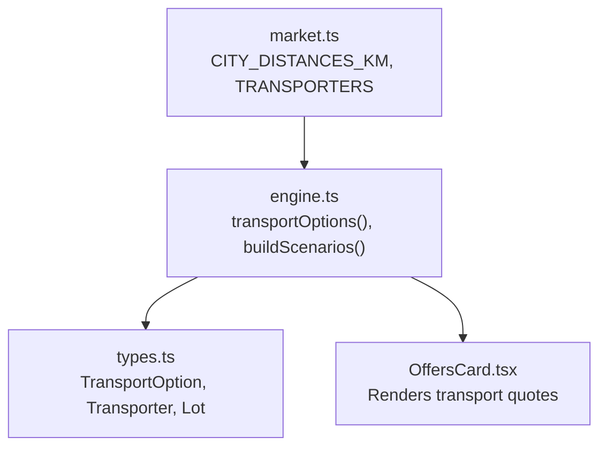
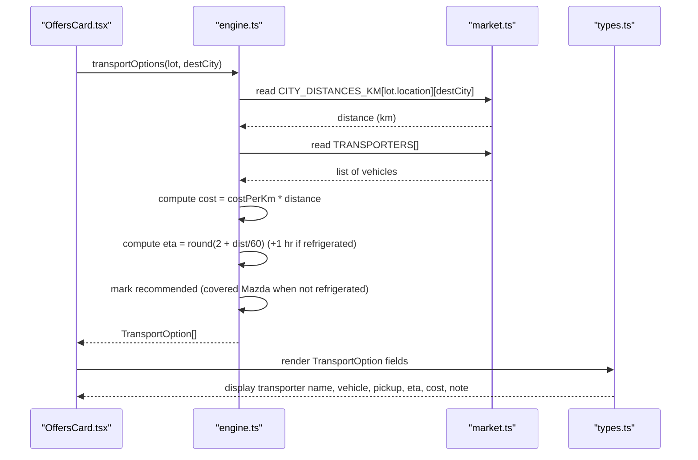
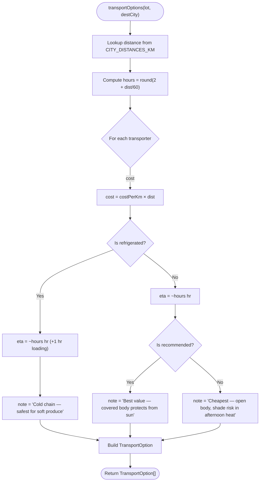
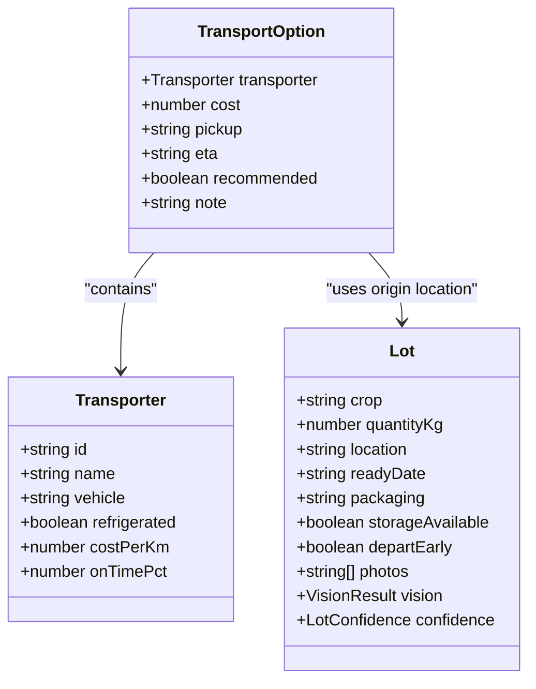
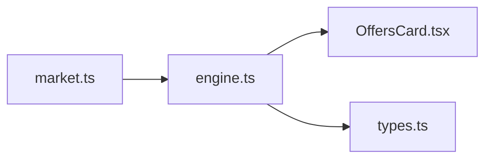

# Transport Cost Optimization

<cite>
**Referenced Files in This Document**
- [engine.ts](file://freshroute/src/lib/engine.ts)
- [market.ts](file://freshroute/src/data/market.ts)
- [types.ts](file://freshroute/src/types.ts)
- [OffersCard.tsx](file://freshroute/src/components/cards/OffersCard.tsx)
</cite>

## Table of Contents
1. [Introduction](#introduction)
2. [Project Structure](#project-structure)
3. [Core Components](#core-components)
4. [Architecture Overview](#architecture-overview)
5. [Detailed Component Analysis](#detailed-component-analysis)
6. [Dependency Analysis](#dependency-analysis)
7. [Performance Considerations](#performance-considerations)
8. [Troubleshooting Guide](#troubleshooting-guide)
9. [Conclusion](#conclusion)
10. [Appendices](#appendices)

## Introduction
This document explains FreshRoute’s transport optimization system that calculates shipping costs and logistics options for moving perishable produce between cities. It focuses on the transportOptions function, which computes distance-based pricing using CITY_DISTANCES_KM, selects vehicle types from the TRANSPORTERS array, applies costPerKm multipliers to estimate transport costs, and estimates arrival times based on distance and vehicle type. It also documents the recommended transporter selection logic: covered body trucks are highlighted as best value for general produce, while refrigerated vehicles are emphasized for soft or highly perishable produce. The guide includes detailed breakdowns of transport cost components, transit time calculations (2 + dist/60 hours), loading time considerations for refrigerated vehicles, and practical scenarios across different routes and cargo types.

## Project Structure
The transport optimization logic is implemented in a small set of focused modules:
- Data definitions for distances, transporters, buyers, prices, and storage facilities live in market data.
- The core calculation engine lives in the engine module, including scenario generation and transport option computation.
- Type definitions describe the shapes of inputs and outputs used by the engine and UI.
- The UI renders transport quotes and highlights the recommended option.

**Diagram sources**
- [market.ts:5-11](file://freshroute/src/data/market.ts#L5-L11)
- [market.ts:136-161](file://freshroute/src/data/market.ts#L136-L161)
- [engine.ts:238-257](file://freshroute/src/lib/engine.ts#L238-L257)
- [types.ts:63-70](file://freshroute/src/types.ts#L63-L70)
- [types.ts:130-137](file://freshroute/src/types.ts#L130-L137)
- [OffersCard.tsx:50-99](file://freshroute/src/components/cards/OffersCard.tsx#L50-L99)

**Section sources**
- [market.ts:5-11](file://freshroute/src/data/market.ts#L5-L11)
- [market.ts:136-161](file://freshroute/src/data/market.ts#L136-L161)
- [engine.ts:238-257](file://freshroute/src/lib/engine.ts#L238-L257)
- [types.ts:63-70](file://freshroute/src/types.ts#L63-L70)
- [types.ts:130-137](file://freshroute/src/types.ts#L130-L137)
- [OffersCard.tsx:50-99](file://freshroute/src/components/cards/OffersCard.tsx#L50-L99)

## Core Components
- Distance table: CITY_DISTANCES_KM provides symmetric city-to-city distances used to compute transport costs and ETAs.
- Transporter catalog: TRANSPORTERS defines available vehicles with attributes like refrigeration status, cost per kilometer, and on-time reliability.
- Engine functions:
  - transportOptions(lot, destCity): Computes transport quotes for all available vehicles for a given route.
  - buildScenarios(lot): Generates end-to-end selling scenarios that include transport costs and spoilage assumptions; uses transporters for specific scenarios (e.g., premium buyer requires refrigerated transport).
- Types: Transporter and TransportOption define the data contracts for input and output of transport calculations.

Key responsibilities:
- Calculate transport cost = costPerKm × distance.
- Estimate ETA = base hours + distance factor, with additional loading time for refrigerated vehicles.
- Mark recommended transporter based on value vs. protection trade-offs.

**Section sources**
- [market.ts:5-11](file://freshroute/src/data/market.ts#L5-L11)
- [market.ts:136-161](file://freshroute/src/data/market.ts#L136-L161)
- [engine.ts:238-257](file://freshroute/src/lib/engine.ts#L238-L257)
- [types.ts:63-70](file://freshroute/src/types.ts#L63-L70)
- [types.ts:130-137](file://freshroute/src/types.ts#L130-L137)

## Architecture Overview
The transport optimization flow integrates data and logic to present actionable transport choices to users.

**Diagram sources**
- [engine.ts:238-257](file://freshroute/src/lib/engine.ts#L238-L257)
- [market.ts:5-11](file://freshroute/src/data/market.ts#L5-L11)
- [market.ts:136-161](file://freshroute/src/data/market.ts#L136-L161)
- [types.ts:130-137](file://freshroute/src/types.ts#L130-L137)
- [OffersCard.tsx:50-99](file://freshroute/src/components/cards/OffersCard.tsx#L50-L99)

## Detailed Component Analysis

### transportOptions Function
Purpose:
- Generate transport quotes for a specified origin lot location and destination city.
- Compute cost and ETA for each transporter.
- Identify the recommended option based on value and protection needs.

Inputs:
- lot: contains origin location and other context (used to resolve distance).
- destCity: target city for delivery.

Processing steps:
1. Resolve distance:
   - Look up distance from CITY_DISTANCES_KM[lot.location][destCity].
   - Fallback to a default distance if lookup fails.
2. Compute ETA:
   - Base ETA formula: round(2 + dist / 60) hours.
   - Refrigerated vehicles add an extra hour for loading/cold chain prep.
3. Compute cost:
   - For each transporter t: cost = t.costPerKm × dist.
4. Determine recommendation:
   - Non-refrigerated covered body truck (Rana Goods Carrier) is marked as recommended for best value when not requiring cold chain.
5. Build TransportOption objects:
   - Include transporter details, computed cost, fixed pickup time, ETA string, recommendation flag, and contextual note.

Output:
- Array of TransportOption entries, one per transporter, ready for UI rendering.

**Diagram sources**
- [engine.ts:238-257](file://freshroute/src/lib/engine.ts#L238-L257)

**Section sources**
- [engine.ts:238-257](file://freshroute/src/lib/engine.ts#L238-L257)

### Recommended Transporter Selection Algorithm
- Covered body trucks (non-refrigerated) are prioritized as “best value” when cold chain is not required. In this codebase, the covered Mazda (Rana Goods Carrier) is explicitly flagged as recommended among non-refrigerated options.
- Refrigerated vehicles are recommended for soft or highly perishable produce due to temperature control benefits, even though they cost more per kilometer.

Why this works:
- Value vs. protection trade-off: covered bodies protect against sun exposure at a lower cost than refrigeration, suitable for many produce types.
- Cold chain necessity: for soft produce or high volatility crops, refrigeration reduces spoilage risk significantly, justifying higher transport costs.

**Section sources**
- [engine.ts:238-257](file://freshroute/src/lib/engine.ts#L238-L257)
- [market.ts:136-161](file://freshroute/src/data/market.ts#L136-L161)

### Transport Cost Components
- Transport cost:
  - Calculated as costPerKm × distance for each transporter.
  - Differentiates between open, covered, and refrigerated vehicles via their respective costPerKm values.
- Additional deductions in broader scenarios:
  - Loading cost and platform fees appear in scenario calculations, but transportOptions focuses purely on transport cost per route.
- Notes and recommendations:
  - Each option includes a note explaining protection level and value rationale.

**Section sources**
- [engine.ts:238-257](file://freshroute/src/lib/engine.ts#L238-L257)
- [market.ts:136-161](file://freshroute/src/data/market.ts#L136-L161)

### Transit Time and Loading Time
- Transit time:
  - ETA = round(2 + dist / 60) hours.
  - This models a base overhead plus average speed approximation over distance.
- Loading time:
  - Refrigerated vehicles add an extra hour for loading and cold chain preparation.
- Pickup time:
  - Fixed at 7:00 AM for all options in transportOptions.

**Section sources**
- [engine.ts:238-257](file://freshroute/src/lib/engine.ts#L238-L257)

### Scenario Integration and Spoilage Context
While transportOptions computes standalone transport quotes, the broader scenario builder uses transporters to model end-to-end economics:
- Direct wholesale scenarios use open trucks for baseline transport cost.
- Premium buyer scenarios require refrigerated transport and factor in reduced spoilage due to cold chain.
- Spoilage modeling considers crop volatility, packaging, ripeness, and refrigeration effects.

This integration ensures transport cost and protection level influence net profitability and risk assessments.

**Section sources**
- [engine.ts:86-134](file://freshroute/src/lib/engine.ts#L86-L134)
- [engine.ts:181-224](file://freshroute/src/lib/engine.ts#L181-L224)
- [engine.ts:29-36](file://freshroute/src/lib/engine.ts#L29-L36)

### Data Models and Relationships

**Diagram sources**
- [types.ts:63-70](file://freshroute/src/types.ts#L63-L70)
- [types.ts:130-137](file://freshroute/src/types.ts#L130-L137)
- [types.ts:34-45](file://freshroute/src/types.ts#L34-L45)

**Section sources**
- [types.ts:63-70](file://freshroute/src/types.ts#L63-L70)
- [types.ts:130-137](file://freshroute/src/types.ts#L130-L137)
- [types.ts:34-45](file://freshroute/src/types.ts#L34-L45)

### Example Scenarios
Below are illustrative scenarios derived from the data and logic. They demonstrate how transport options vary by route and cargo type.

- Multan to Lahore (tomatoes, crates):
  - Distance lookup yields a moderate route length.
  - Open truck: lowest cost, no cold chain; suitable if dispatched early and packed in crates.
  - Covered truck: recommended best value; protects from sun without full refrigeration cost.
  - Refrigerated truck: adds loading time and higher cost; beneficial if tomatoes are very ripe or weather is hot.

- Multan to Karachi (leafy vegetables, loose):
  - Longer distance increases both cost and transit time.
  - Leafy vegetables have high volatility; refrigerated transport is essential to reduce spoilage.
  - Even though refrigerated is most expensive, it often yields better net outcomes due to reduced loss.

- Faisalabad to Islamabad (mangoes, crates):
  - Medium distance; mangoes are moderately volatile.
  - Covered truck may be sufficient if crates are used and dispatch is early.
  - Refrigerated transport can be justified if mangoes are near peak ripeness or if delays are expected.

- Lahore to Multan (onions, sacks):
  - Shorter route; onions are low volatility.
  - Open truck may be acceptable; however, sacks increase spoilage factor compared to crates.
  - Covered truck offers a good balance of cost and protection.

These examples align with the algorithm’s emphasis on covered trucks for value and refrigerated trucks for soft/high-volatility produce.

**Section sources**
- [market.ts:5-11](file://freshroute/src/data/market.ts#L5-L11)
- [market.ts:136-161](file://freshroute/src/data/market.ts#L136-L161)
- [engine.ts:238-257](file://freshroute/src/lib/engine.ts#L238-L257)

## Dependency Analysis
The transport optimization depends on stable data and clear interfaces:
- market.ts provides CITY_DISTANCES_KM and TRANSPORTERS, which are consumed by engine.ts.
- engine.ts implements transportOptions and builds scenarios using these datasets.
- types.ts defines Transporter and TransportOption, ensuring consistent structure across modules.
- OffersCard.tsx consumes TransportOption arrays to render quotes and highlight recommended options.

Potential coupling risks:
- Hardcoded fallback distances in engine.ts could mask missing data; ensure CITY_DISTANCES_KM is complete.
- Recommendation logic currently favors covered trucks; updates should consider crop-specific rules if needed.

**Diagram sources**
- [market.ts:5-11](file://freshroute/src/data/market.ts#L5-L11)
- [market.ts:136-161](file://freshroute/src/data/market.ts#L136-L161)
- [engine.ts:238-257](file://freshroute/src/lib/engine.ts#L238-L257)
- [types.ts:130-137](file://freshroute/src/types.ts#L130-L137)
- [OffersCard.tsx:50-99](file://freshroute/src/components/cards/OffersCard.tsx#L50-L99)

**Section sources**
- [market.ts:5-11](file://freshroute/src/data/market.ts#L5-L11)
- [market.ts:136-161](file://freshroute/src/data/market.ts#L136-L161)
- [engine.ts:238-257](file://freshroute/src/lib/engine.ts#L238-L257)
- [types.ts:130-137](file://freshroute/src/types.ts#L130-L137)
- [OffersCard.tsx:50-99](file://freshroute/src/components/cards/OffersCard.tsx#L50-L99)

## Performance Considerations
- Distance lookups are constant-time dictionary accesses; performance is dominated by mapping over the small TRANSPORTERS array.
- ETA and cost computations are simple arithmetic operations with negligible overhead.
- UI rendering iterates over a small set of options; responsiveness remains high.

Recommendations:
- Keep CITY_DISTANCES_KM updated to avoid fallback defaults that could skew results.
- If adding new transporters or dynamic pricing, consider caching or memoization for large-scale scenarios.

[No sources needed since this section provides general guidance]

## Troubleshooting Guide
Common issues and resolutions:
- Missing distance entry:
  - Symptom: Unexpected default distance used in transportOptions.
  - Resolution: Ensure CITY_DISTANCES_KM includes the origin-destination pair; otherwise, the function falls back to a default distance.
- Incorrect recommendation:
  - Symptom: Covered truck not marked as recommended.
  - Resolution: Verify transporter IDs and refrigerated flags; recommendation logic targets the covered Mazda specifically.
- ETA mismatch:
  - Symptom: ETA does not reflect expected travel time.
  - Resolution: Confirm distance values and understand that refrigerated vehicles add an extra hour for loading.

**Section sources**
- [engine.ts:238-257](file://freshroute/src/lib/engine.ts#L238-L257)
- [market.ts:5-11](file://freshroute/src/data/market.ts#L5-L11)

## Conclusion
FreshRoute’s transport optimization provides clear, data-driven transport quotes by combining distance-based pricing, vehicle type characteristics, and sensible ETA estimation. The recommended transporter selection balances cost and protection: covered body trucks offer best value for general produce, while refrigerated vehicles are essential for soft or highly perishable goods. The system’s modular design—separating data, logic, and types—ensures maintainability and clarity for future enhancements.

[No sources needed since this section summarizes without analyzing specific files]

## Appendices

### Appendix A: Key Constants and Data
- CITY_DISTANCES_KM: City-to-city distances used for cost and ETA calculations.
- TRANSPORTERS: Available vehicles with refrigeration status, costPerKm, and on-time reliability.
- LOADING_COST and LOCAL_CARTAGE: Used in broader scenario calculations beyond transportOptions.

**Section sources**
- [market.ts:5-11](file://freshroute/src/data/market.ts#L5-L11)
- [market.ts:136-161](file://freshroute/src/data/market.ts#L136-L161)
- [engine.ts:10-14](file://freshroute/src/lib/engine.ts#L10-L14)

### Appendix B: UI Rendering of Transport Options
- OffersCard displays transporter name, vehicle type, pickup time, ETA, on-time percentage, note, and cost.
- Recommended options are visually highlighted for quick decision-making.

**Section sources**
- [OffersCard.tsx:50-99](file://freshroute/src/components/cards/OffersCard.tsx#L50-L99)