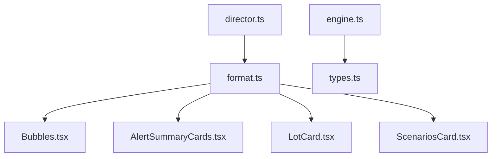
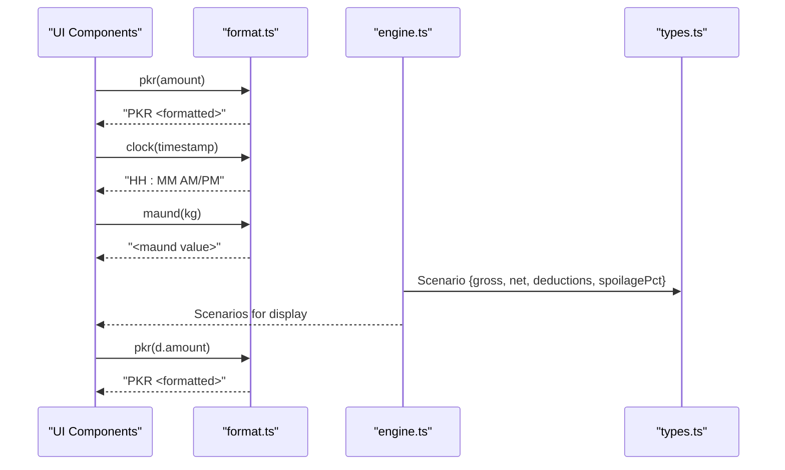
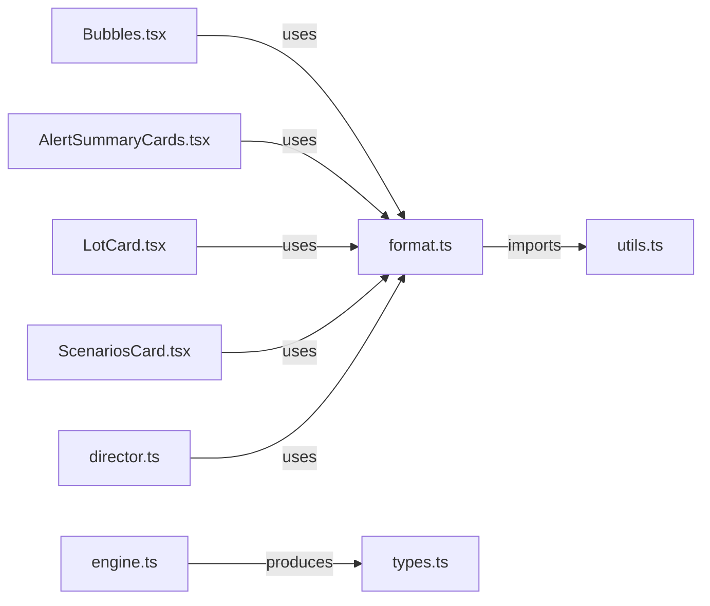

# Formatting Utilities

<cite>
**Referenced Files in This Document**
- [format.ts](file://freshroute/src/lib/format.ts)
- [utils.ts](file://freshroute/src/lib/utils.ts)
- [engine.ts](file://freshroute/src/lib/engine.ts)
- [types.ts](file://freshroute/src/types.ts)
- [Bubbles.tsx](file://freshroute/src/components/Bubbles.tsx)
- [AlertSummaryCards.tsx](file://freshroute/src/components/cards/AlertSummaryCards.tsx)
- [LotCard.tsx](file://freshroute/src/components/cards/LotCard.tsx)
- [ScenariosCard.tsx](file://freshroute/src/components/cards/ScenariosCard.tsx)
- [director.ts](file://freshroute/src/store/director.ts)
</cite>

## Table of Contents
1. Introduction
2. Project Structure
3. Core Components
4. Architecture Overview
5. Detailed Component Analysis
6. Dependency Analysis
7. Performance Considerations
8. Troubleshooting Guide
9. Conclusion

## Introduction
This document explains FreshRoute’s formatting utilities that standardize how data is transformed and presented across the application. It focuses on:
- Currency formatting for PKR amounts with localization and rounding
- Date/time formatting for timestamps and delivery schedules
- Percentage formatting for spoilage rates, commission percentages, and profit margins
- Text formatting patterns for status messages, error notifications, and user feedback
- Number formatting for quantities, distances, and financial calculations with consistent precision and rounding rules

These utilities ensure a consistent, readable, and localized presentation throughout the UI.

## Project Structure
Formatting logic is centralized in a small utility module and consumed by components and business logic where needed.

**Diagram sources**
- [format.ts:1-21](file://freshroute/src/lib/format.ts#L1-L21)
- [Bubbles.tsx:1-10](file://freshroute/src/components/Bubbles.tsx#L1-L10)
- [AlertSummaryCards.tsx:1-10](file://freshroute/src/components/cards/AlertSummaryCards.tsx#L1-L10)
- [LotCard.tsx:1-10](file://freshroute/src/components/cards/LotCard.tsx#L1-L10)
- [ScenariosCard.tsx:1-10](file://freshroute/src/components/cards/ScenariosCard.tsx#L1-L10)
- [engine.ts:1-15](file://freshroute/src/lib/engine.ts#L1-L15)
- [types.ts:94-112](file://freshroute/src/types.ts#L94-L112)
- [director.ts:643-653](file://freshroute/src/store/director.ts#L643-L653)

**Section sources**
- [format.ts:1-21](file://freshroute/src/lib/format.ts#L1-L21)
- [utils.ts:1-7](file://freshroute/src/lib/utils.ts#L1-L7)

## Core Components
The formatting utilities are defined in a single module and include:
- Currency formatters for PKR (localized grouping and short-form display)
- Time formatter for human-readable clock strings
- Unit converter for traditional weight units used in markets
- Unique ID generator for UI keys

Key responsibilities:
- Ensure consistent currency representation across cards and summaries
- Provide localized time strings for chat bubbles and audit logs
- Convert kilograms to maund for market-facing displays
- Generate stable IDs for list rendering

**Section sources**
- [format.ts:1-21](file://freshroute/src/lib/format.ts#L1-L21)

## Architecture Overview
Formatting utilities are pure functions imported wherever presentation is needed. They do not depend on state or side effects, making them safe to reuse across components and services.

**Diagram sources**
- [format.ts:1-21](file://freshroute/src/lib/format.ts#L1-L21)
- [engine.ts:47-83](file://freshroute/src/lib/engine.ts#L47-L83)
- [types.ts:94-112](file://freshroute/src/types.ts#L94-L112)
- [ScenariosCard.tsx:36-86](file://freshroute/src/components/cards/ScenariosCard.tsx#L36-L86)

## Detailed Component Analysis

### Currency Formatting (PKR)
- Purpose: Display monetary values consistently with PKR currency symbol and localized number grouping.
- Functions:
  - Standard PKR formatter: rounds to nearest integer and formats using locale-aware grouping for Pakistan.
  - Short-form PKR formatter: for large amounts, converts to “lac” units with one decimal place; otherwise falls back to standard formatting.
- Usage examples in UI:
  - Summary cards show net received amounts.
  - Scenario rows and deduction lines show costs and totals.
  - Director flow prints breakdowns using the same formatter.

Consistency guarantees:
- All monetary values are rounded before formatting to avoid fractional paisa display.
- Large amounts use a culturally familiar unit (“lac”) to improve readability.

**Section sources**
- [format.ts:1-7](file://freshroute/src/lib/format.ts#L1-L7)
- [AlertSummaryCards.tsx:21-40](file://freshroute/src/components/cards/AlertSummaryCards.tsx#L21-L40)
- [ScenariosCard.tsx:36-86](file://freshroute/src/components/cards/ScenariosCard.tsx#L36-L86)
- [director.ts:643-653](file://freshroute/src/store/director.ts#L643-L653)

### Date and Time Formatting
- Purpose: Present timestamps in a concise, user-friendly format suitable for chat bubbles and audit entries.
- Function:
  - Clock formatter: converts epoch milliseconds to a 12-hour time string with minutes and AM/PM indicator.
- Usage examples in UI:
  - Chat bubbles display message timestamps.
  - Audit drawer shows action timestamps.

Behavior notes:
- Uses local system timezone via Date APIs.
- Always includes leading zero for minutes and correct AM/PM handling.

**Section sources**
- [format.ts:9-16](file://freshroute/src/lib/format.ts#L9-L16)
- [Bubbles.tsx:1-8](file://freshroute/src/components/Bubbles.tsx#L1-L8)
- [AuditDrawer.tsx:1-10](file://freshroute/src/components/AuditDrawer.tsx#L1-L10)

### Percentage Formatting
- Purpose: Show spoilage risk, commission rates, and other percentages consistently.
- Implementation approach:
  - Spoilage percentage is computed in the scenario engine and displayed by multiplying by 100 and rounding to the nearest integer in the UI.
  - Commission and platform fee percentages are derived from constants and embedded into labels when constructing scenarios.
- Where it appears:
  - Spoilage chips in scenario cards show approximate spoilage percentages.
  - Deduction labels include commission and fee percentages.

Precision and rounding:
- Percentages shown to the UI are rounded to whole numbers for clarity.
- Underlying calculations retain full precision until display.

**Section sources**
- [engine.ts:10-14](file://freshroute/src/lib/engine.ts#L10-L14)
- [engine.ts:52-83](file://freshroute/src/lib/engine.ts#L52-L83)
- [ScenariosCard.tsx:51-57](file://freshroute/src/components/cards/ScenariosCard.tsx#L51-L57)

### Text Formatting Patterns
- Purpose: Provide consistent styling and messaging for status indicators, alerts, and feedback.
- Patterns observed:
  - Status badges use compact, high-contrast labels for modes like checking, live, demo, and error states.
  - Alerts and summaries use clear titles and body text with contextual icons.
  - User feedback uses concise, friendly language with actionable cues.

Best practices:
- Keep labels short and scannable.
- Use consistent tone and hierarchy for titles vs. details.
- Pair icons with text to reinforce meaning.

**Section sources**
- [SettingsSheet.tsx:106-165](file://freshroute/src/components/SettingsSheet.tsx#L106-L165)
- [AlertSummaryCards.tsx:5-19](file://freshroute/src/components/cards/AlertSummaryCards.tsx#L5-L19)

### Number Formatting for Quantities and Distances
- Purpose: Present quantities, distances, and derived metrics with appropriate precision.
- Examples:
  - Quantities are formatted with localized thousands separators for readability.
  - Traditional weight units (maund) are converted from kilograms for market context.
  - Distances appear in labels and notes for transport options.

Rules applied:
- Use localized number formatting for large integers.
- Round conversions to one decimal place for traditional units.
- Avoid unnecessary decimals in financial contexts; rely on currency formatter for money.

**Section sources**
- [format.ts:20-21](file://freshroute/src/lib/format.ts#L20-L21)
- [LotCard.tsx:57-72](file://freshroute/src/components/cards/LotCard.tsx#L57-L72)
- [engine.ts:181-224](file://freshroute/src/lib/engine.ts#L181-L224)

### Utility Helpers
- Class name merging helper:
  - Combines multiple class inputs deterministically to produce final CSS classes for UI elements.
- Unique ID generator:
  - Produces short random identifiers for list keys and temporary objects.

**Section sources**
- [utils.ts:1-7](file://freshroute/src/lib/utils.ts#L1-L7)
- [format.ts:18-18](file://freshroute/src/lib/format.ts#L18-L18)

## Dependency Analysis
Formatting utilities are low-coupling and widely reused:
- Components import only what they need (e.g., pkr, clock, maund).
- Business logic computes raw values; formatting happens at the presentation layer.
- Types define the shape of data being formatted (e.g., Scenario fields for gross, net, deductions, spoilagePct).

**Diagram sources**
- [format.ts:1-21](file://freshroute/src/lib/format.ts#L1-L21)
- [utils.ts:1-7](file://freshroute/src/lib/utils.ts#L1-L7)
- [Bubbles.tsx:1-10](file://freshroute/src/components/Bubbles.tsx#L1-L10)
- [AlertSummaryCards.tsx:1-10](file://freshroute/src/components/cards/AlertSummaryCards.tsx#L1-L10)
- [LotCard.tsx:1-10](file://freshroute/src/components/cards/LotCard.tsx#L1-L10)
- [ScenariosCard.tsx:1-10](file://freshroute/src/components/cards/ScenariosCard.tsx#L1-L10)
- [engine.ts:1-15](file://freshroute/src/lib/engine.ts#L1-L15)
- [types.ts:94-112](file://freshroute/src/types.ts#L94-L112)
- [director.ts:643-653](file://freshroute/src/store/director.ts#L643-L653)

**Section sources**
- [types.ts:94-112](file://freshroute/src/types.ts#L94-L112)

## Performance Considerations
- Formatting functions are lightweight and synchronous, minimizing render overhead.
- Rounding occurs before formatting to reduce string length and improve readability.
- Using localized number formatting ensures efficient grouping without manual math.
- For large lists, consider memoizing formatted values if re-renders are frequent.

[No sources needed since this section provides general guidance]

## Troubleshooting Guide
Common issues and resolutions:
- Incorrect time display:
  - Ensure timestamps are provided as epoch milliseconds.
  - Verify that the client device timezone is set correctly.
- Inconsistent currency formatting:
  - Always pass numeric values to the currency formatter; avoid pre-formatting elsewhere.
  - For very large amounts, prefer the short-form formatter to keep labels concise.
- Misleading percentages:
  - Confirm that percentages are multiplied by 100 and rounded before display.
  - Check that underlying calculations maintain full precision until formatting.

Validation tips:
- Cross-check summary totals against scenario breakdowns.
- Validate that deduction labels reflect the correct rates and amounts.

**Section sources**
- [format.ts:1-21](file://freshroute/src/lib/format.ts#L1-L21)
- [ScenariosCard.tsx:51-86](file://freshroute/src/components/cards/ScenariosCard.tsx#L51-L86)
- [AlertSummaryCards.tsx:21-40](file://freshroute/src/components/cards/AlertSummaryCards.tsx#L21-L40)

## Conclusion
FreshRoute’s formatting utilities provide a focused, reusable foundation for consistent presentation of currency, time, percentages, and numbers. By centralizing these concerns, the application maintains a uniform look and feel while keeping business logic clean and testable. Extending the module with additional formatters (e.g., date ranges, pluralization helpers) can further enhance consistency as the product grows.

[No sources needed since this section summarizes without analyzing specific files]