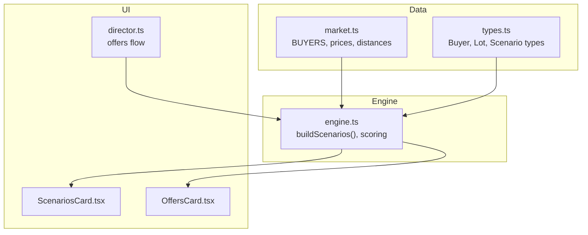
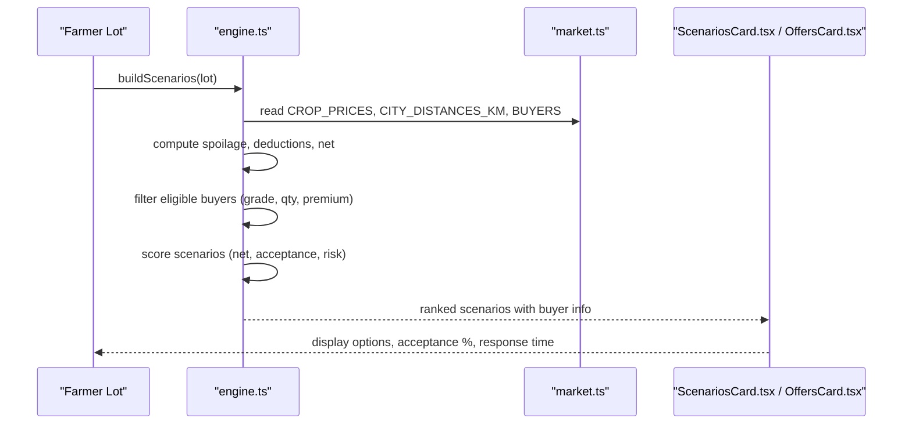
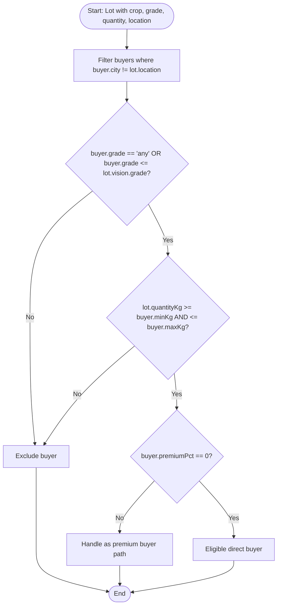
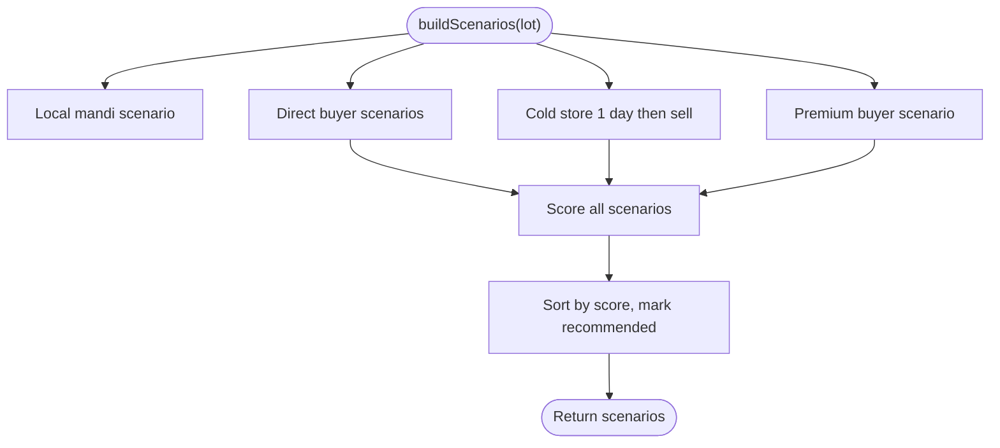
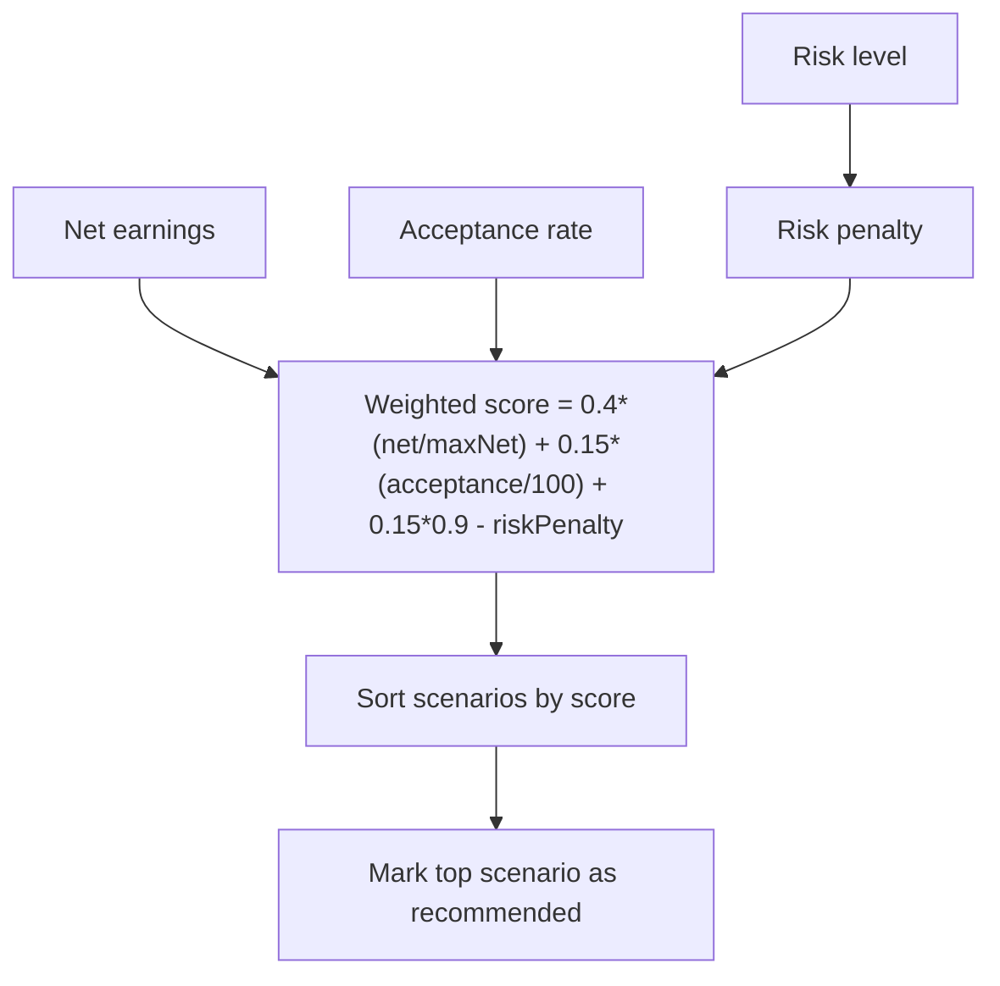
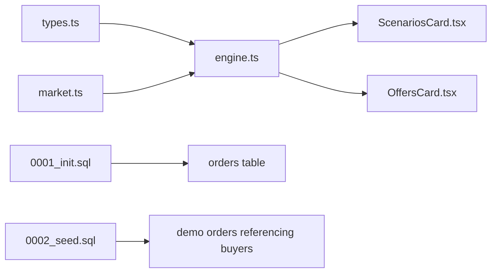

# Buyer Marketplace

<cite>
**Referenced Files in This Document**
- [market.ts](file://freshroute/src/data/market.ts)
- [engine.ts](file://freshroute/src/lib/engine.ts)
- [types.ts](file://freshroute/src/types.ts)
- [0001_init.sql](file://freshroute/supabase/migrations/0001_init.sql)
- [0002_seed.sql](file://freshroute/supabase/migrations/0002_seed.sql)
- [ScenariosCard.tsx](file://freshroute/src/components/cards/ScenariosCard.tsx)
- [OffersCard.tsx](file://freshroute/src/components/cards/OffersCard.tsx)
- [director.ts](file://freshroute/src/store/director.ts)
</cite>

## Table of Contents
1. Introduction
2. Project Structure
3. Core Components
4. Architecture Overview
5. Detailed Component Analysis
6. Dependency Analysis
7. Performance Considerations
8. Troubleshooting Guide
9. Conclusion

## Introduction
This document explains FreshRoute’s verified buyer marketplace network and how it matches farmers’ lots to wholesale buyers. It focuses on the BUYERS dataset, buyer attributes, matching logic based on crop grade, quantity ranges, and geographic proximity, and how acceptance rates influence scenario generation for farmers. The goal is to make the system understandable for both technical and non-technical readers.

## Project Structure
The buyer marketplace is implemented as a combination of:
- A static dataset of verified buyers, transporters, storage facilities, prices, and distances
- A scenario engine that builds market options (local mandi, direct buyers, cold storage + sell later, premium buyer)
- UI components that present scenarios and offers with buyer acceptance and response time signals
- Database schema and seed data that persist orders and reviews

**Diagram sources**
- [market.ts:73-134](file://freshroute/src/data/market.ts#L73-L134)
- [engine.ts:47-235](file://freshroute/src/lib/engine.ts#L47-L235)
- [types.ts:47-112](file://freshroute/src/types.ts#L47-L112)
- [ScenariosCard.tsx:128-171](file://freshroute/src/components/cards/ScenariosCard.tsx#L128-L171)
- [OffersCard.tsx:27-48](file://freshroute/src/components/cards/OffersCard.tsx#L27-L48)
- [director.ts:376-438](file://freshroute/src/store/director.ts#L376-L438)

**Section sources**
- [market.ts:73-134](file://freshroute/src/data/market.ts#L73-L134)
- [engine.ts:47-235](file://freshroute/src/lib/engine.ts#L47-L235)
- [types.ts:47-112](file://freshroute/src/types.ts#L47-L112)

## Core Components
- Verified Buyers: Four wholesale buyers are defined with attributes including city, category, grade requirement, premium percentage, acceptance rate, rejection percentage, payment terms, min/max kg, verification status, and response time.
- Engine: Generates scenarios per lot, calculates net earnings, applies spoilage and rejection, and ranks options using a weighted score that includes acceptance rate and risk.
- UI: Displays scenarios and offers, highlighting buyer acceptance and response time to help farmers choose.

Key buyer attributes used by the system:
- Grade requirement: A, B, or any; determines eligibility against the lot’s estimated grade
- Premium percentage: Extra price uplift for specific buyers (e.g., retail-grade A)
- Acceptance rate: Historical offer acceptance percentage; influences scoring
- Rejection percentage: Estimated inspection rejection at delivery; reduces accepted quantity
- Payment terms: Cash timing (same day, days after delivery, on delivery)
- Quantity range: minKg and maxKg define acceptable lot sizes
- Verification status: Indicates trusted buyers in the marketplace
- Response time: Typical buyer reply speed shown to farmers

**Section sources**
- [market.ts:73-134](file://freshroute/src/data/market.ts#L73-L134)
- [types.ts:47-61](file://freshroute/src/types.ts#L47-L61)
- [engine.ts:38-45](file://freshroute/src/lib/engine.ts#L38-L45)
- [ScenariosCard.tsx:128-171](file://freshroute/src/components/cards/ScenariosCard.tsx#L128-L171)
- [OffersCard.tsx:27-48](file://freshroute/src/components/cards/OffersCard.tsx#L27-L48)

## Architecture Overview
FreshRoute computes market scenarios for each farmer lot by combining:
- Crop-specific mandi prices across cities
- Distances between cities to estimate transit time and spoilage
- Buyer constraints (grade, quantity, premium)
- Transport costs and refrigeration needs
- Spoilage model based on crop volatility, packaging, ripeness, and refrigeration
- Scoring that balances net earnings, acceptance likelihood, and risk

**Diagram sources**
- [engine.ts:47-235](file://freshroute/src/lib/engine.ts#L47-L235)
- [market.ts:73-134](file://freshroute/src/data/market.ts#L73-L134)
- [ScenariosCard.tsx:128-171](file://freshroute/src/components/cards/ScenariosCard.tsx#L128-L171)
- [OffersCard.tsx:27-48](file://freshroute/src/components/cards/OffersCard.tsx#L27-L48)

## Detailed Component Analysis

### BUYERS Dataset
Four verified wholesale buyers are defined:
- Al-Karam Wholesale Co. (Lahore): Grade B, no premium, 82% acceptance, 4% rejection, 2–3 days payment, 200–5000 kg, verified, responds usually under 1 hour
- Metro Fresh Retail (Lahore): Grade A only, 20% premium, 65% acceptance, 18% rejection, 7 days payment, 300–3000 kg, verified, same-day response
- Chenab Traders (Faisalabad): Grade B, no premium, 78% acceptance, 5% rejection, 3–4 days payment, 150–4000 kg, verified, responds usually under 2 hours
- Empress Market Dealer (Karachi): Any grade, no premium, 80% acceptance, 4% rejection, on delivery payment, 500–10000 kg, verified, responds 1–2 hours

These buyers drive scenario generation and scoring through their attributes.

**Section sources**
- [market.ts:73-134](file://freshroute/src/data/market.ts#L73-L134)
- [types.ts:47-61](file://freshroute/src/types.ts#L47-L61)

### Buyer Matching Algorithm
Eligibility filters applied when generating direct-buyer scenarios:
- Geographic proximity: buyer city must differ from lot location; distance lookup via CITY_DISTANCES_KM
- Grade compatibility: buyer.grade must be "any" or less than or equal to the lot’s estimated grade
- Quantity fit: lot.quantityKg must fall within buyer.minKg and buyer.maxKg
- Premium constraint: direct wholesale scenarios exclude buyers with premiumPct > 0; premium buyers are handled separately

Distance affects transit time and spoilage assumptions; longer routes increase transit days and thus spoilage estimates.

**Diagram sources**
- [engine.ts:86-94](file://freshroute/src/lib/engine.ts#L86-L94)

**Section sources**
- [engine.ts:86-94](file://freshroute/src/lib/engine.ts#L86-L94)

### Scenario Generation Logic
For each lot, the engine generates multiple scenarios:
- Local mandi sale today: uses local mandi price, applies commission and cartage, minimal transport risk
- Direct wholesale buyer: selects eligible buyers, calculates transport cost, platform fee, loading cost, spoilage, and rejection; derives net earnings
- Cold store one day then sell: adds storage cost and reduced spoilage; evaluates best direct buyer afterward
- Premium buyer: targets retail-grade A buyers with higher price but stricter inspection and refrigerated transport

Net earnings are computed by subtracting deductions (transport, platform fee, loading, storage, mandi commission). Spoilage and rejection reduce accepted quantity. Risk levels are assigned based on transit duration and refrigeration needs.

**Diagram sources**
- [engine.ts:47-235](file://freshroute/src/lib/engine.ts#L47-L235)

**Section sources**
- [engine.ts:47-235](file://freshroute/src/lib/engine.ts#L47-L235)

### Scoring and Ranking
Scenarios are scored using a weighted function:
- Net earnings relative to maximum net
- Buyer acceptance rate
- Baseline factor
- Risk penalty (higher for medium/high-risk scenarios)

Acceptance rate directly improves a scenario’s score, making historically reliable buyers more likely to be recommended even if net earnings are slightly lower.

**Diagram sources**
- [engine.ts:38-45](file://freshroute/src/lib/engine.ts#L38-L45)
- [engine.ts:226-235](file://freshroute/src/lib/engine.ts#L226-L235)

**Section sources**
- [engine.ts:38-45](file://freshroute/src/lib/engine.ts#L38-L45)
- [engine.ts:226-235](file://freshroute/src/lib/engine.ts#L226-L235)

### UI Presentation of Buyer Attributes
The UI surfaces buyer acceptance and response time to help farmers understand reliability:
- Acceptance percentage displayed alongside buyer name
- Response time label indicates typical reply speed
- Scenario cards show spoilage estimates, risk level, and payment terms

This transparency supports informed decisions about which buyer to pursue.

**Section sources**
- [ScenariosCard.tsx:128-171](file://freshroute/src/components/cards/ScenariosCard.tsx#L128-L171)
- [OffersCard.tsx:27-48](file://freshroute/src/components/cards/OffersCard.tsx#L27-L48)

### Example Selection Logic
Examples of how buyer selection works:
- If a lot is Grade B and 600 kg, Al-Karam Wholesale Co. (Grade B, 200–5000 kg) is eligible for a direct scenario; Metro Fresh Retail (Grade A only) is excluded from direct scenarios but considered in the premium path
- If a lot is Grade A and 250 kg, Metro Fresh Retail may appear in the premium path with a 20% price uplift and refrigerated transport; its higher rejection rate reduces expected accepted quantity
- Empress Market Dealer accepts any grade and larger quantities, suitable for big lots bound for Karachi; distance increases transit time and spoilage assumptions

These examples illustrate how grade, quantity, and geography determine eligibility and expected outcomes.

**Section sources**
- [market.ts:73-134](file://freshroute/src/data/market.ts#L73-L134)
- [engine.ts:86-94](file://freshroute/src/lib/engine.ts#L86-L94)
- [engine.ts:181-223](file://freshroute/src/lib/engine.ts#L181-L223)

### Influence of Acceptance Rates on Scenario Generation
Acceptance rates affect:
- Expected accepted quantity indirectly via rejection percentages
- Scenario scoring, improving recommendations for buyers with higher historical acceptance
- Offer messaging, where acceptance and response time are shown to farmers

Higher acceptance rates can make a buyer more attractive even if net earnings are comparable to alternatives.

**Section sources**
- [engine.ts:38-45](file://freshroute/src/lib/engine.ts#L38-L45)
- [engine.ts:102-103](file://freshroute/src/lib/engine.ts#L102-L103)
- [OffersCard.tsx:27-48](file://freshroute/src/components/cards/OffersCard.tsx#L27-L48)

## Dependency Analysis
The marketplace depends on:
- Static market data (prices, distances, buyers, transporters, storage)
- Type definitions ensuring consistent structures across engine and UI
- Database schema for orders, reviews, and chat state persistence
- Seed data populating demo customers and orders referencing buyers

**Diagram sources**
- [types.ts:47-112](file://freshroute/src/types.ts#L47-L112)
- [engine.ts:1-8](file://freshroute/src/lib/engine.ts#L1-L8)
- [market.ts:73-134](file://freshroute/src/data/market.ts#L73-L134)
- [0001_init.sql:75-95](file://freshroute/supabase/migrations/0001_init.sql#L75-L95)
- [0002_seed.sql:74-80](file://freshroute/supabase/migrations/0002_seed.sql#L74-L80)

**Section sources**
- [0001_init.sql:75-95](file://freshroute/supabase/migrations/0001_init.sql#L75-L95)
- [0002_seed.sql:74-80](file://freshroute/supabase/migrations/0002_seed.sql#L74-L80)

## Performance Considerations
- Filtering buyers by grade and quantity is O(n) over the small fixed buyer set; negligible performance impact
- Distance lookups use constant-time map access; overall scenario generation remains fast
- Spoilage calculations are simple arithmetic operations; no heavy computation
- Scoring and sorting operate over a small number of scenarios; efficient ranking

[No sources needed since this section provides general guidance]

## Troubleshooting Guide
Common issues and mitigations:
- AI proxy failures: The system surfaces errors and falls back to offline demo mode for steps relying on external services
- Inaccurate market prices: Display source, timestamp, confidence, and freshness; allow manual validation
- Low user trust: Explain recommendations with clear breakdowns; use local partners and human support
- Buyer cancellation risk: Track reliability scores and enable rapid rematching workflows

Operational notes:
- When AI requests fail, messages inform users and audit logs record fallback usage
- Scenario outputs include explanations (“why”) to clarify trade-offs

**Section sources**
- [director.ts:62-74](file://freshroute/src/store/director.ts#L62-L74)
- [ScenariosCard.tsx:166-168](file://freshroute/src/components/cards/ScenariosCard.tsx#L166-L168)

## Conclusion
FreshRoute’s verified buyer marketplace connects farmers to four wholesale buyers using transparent rules:
- Buyer eligibility is determined by grade requirements, quantity ranges, and geographic proximity
- Scenario generation accounts for transport costs, spoilage, rejection, and payment terms
- Scoring incorporates acceptance rates and risk to recommend the most reliable and profitable option
- UI presentation highlights acceptance and response times to aid decision-making

This approach balances profitability with reliability, helping farmers maximize returns while minimizing risk.

[No sources needed since this section summarizes without analyzing specific files]