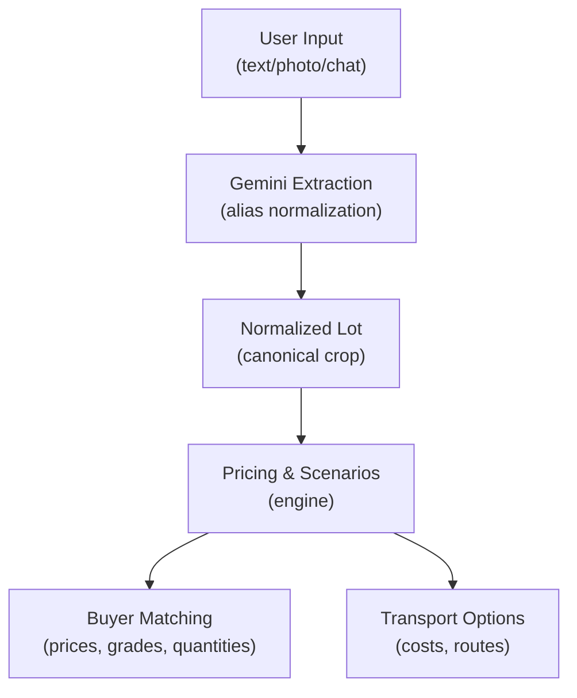
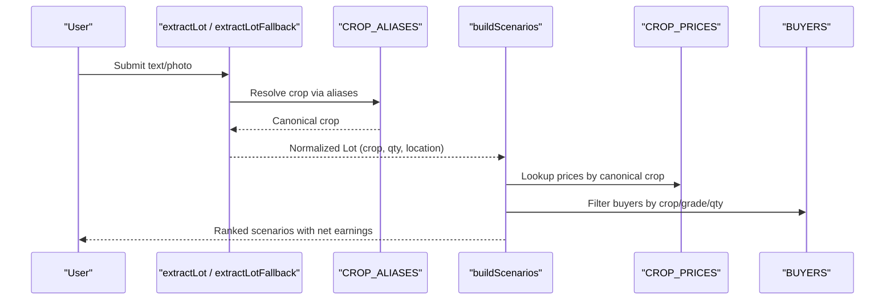
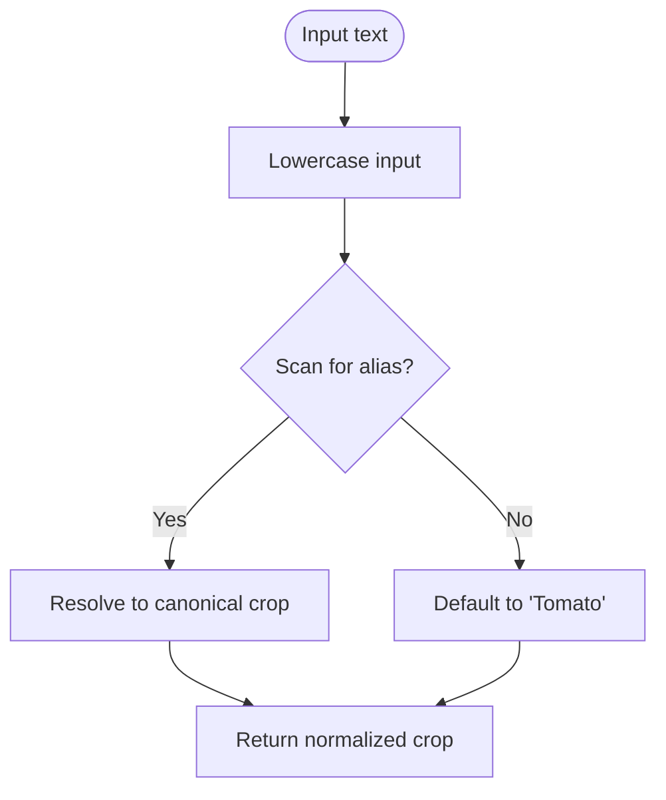
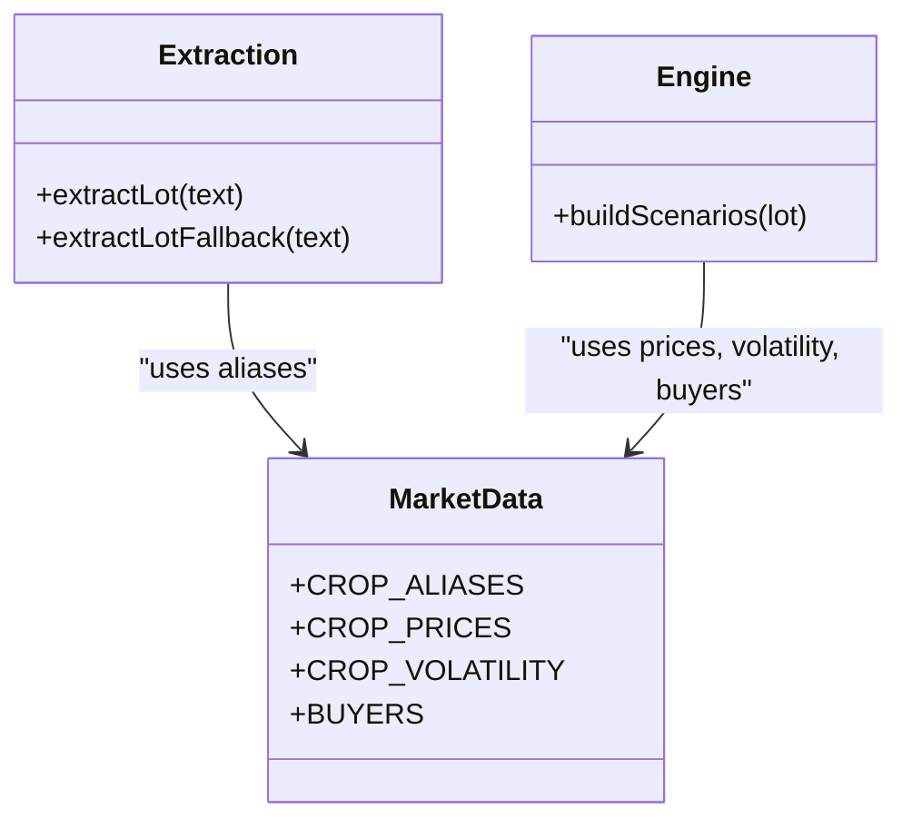
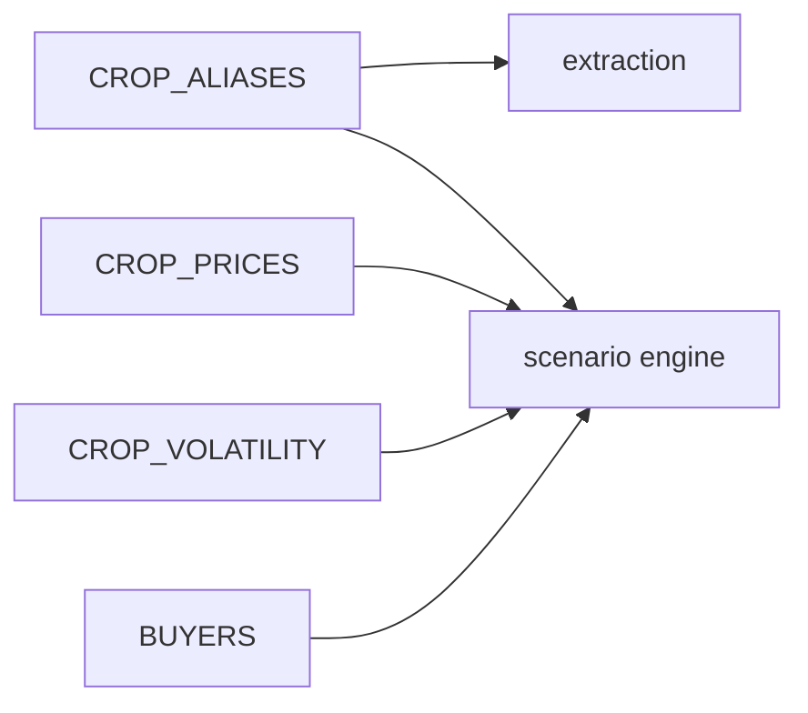

# Crop Alias System

<cite>
**Referenced Files in This Document**
- [market.ts](file://freshroute/src/data/market.ts)
- [gemini.ts](file://freshroute/src/lib/gemini.ts)
- [engine.ts](file://freshroute/src/lib/engine.ts)
- [types.ts](file://freshroute/src/types.ts)
</cite>

## Table of Contents
1. [Introduction](#introduction)
2. [Project Structure](#project-structure)
3. [Core Components](#core-components)
4. [Architecture Overview](#architecture-overview)
5. [Detailed Component Analysis](#detailed-component-analysis)
6. [Dependency Analysis](#dependency-analysis)
7. [Performance Considerations](#performance-considerations)
8. [Troubleshooting Guide](#troubleshooting-guide)
9. [Conclusion](#conclusion)

## Introduction
This document explains FreshRoute’s crop alias system that normalizes diverse user inputs into canonical crop names used across pricing, buyer matching, and scenario generation. The CROP_ALIASES mapping supports English plurals, regional names in Urdu script (ٹماٹر, آلو, پیاز, آم, بھنڈی), and common variations such as tomato/tomatoes or chili/chilli. By resolving all these variants to a single canonical name, the system ensures consistent market data retrieval and accurate recommendations regardless of how users describe their produce.

## Project Structure
The alias system is defined centrally and consumed by extraction and recommendation modules:
- Canonical aliases and market data are defined in the market module.
- Text-based lot extraction uses the alias map to normalize crop names from user input.
- Scenario building and pricing use the normalized crop name to fetch prices and build options.

**Diagram sources**
- [gemini.ts:56-116](file://freshroute/src/lib/gemini.ts#L56-L116)
- [engine.ts:47-235](file://freshroute/src/lib/engine.ts#L47-L235)
- [market.ts:14-58](file://freshroute/src/data/market.ts#L14-L58)

**Section sources**
- [market.ts:14-58](file://freshroute/src/data/market.ts#L14-L58)
- [gemini.ts:56-116](file://freshroute/src/lib/gemini.ts#L56-L116)
- [engine.ts:47-235](file://freshroute/src/lib/engine.ts#L47-L235)

## Core Components
- CROP_ALIASES: Central mapping from many input forms to canonical crop keys used by pricing and scenarios.
- extractLotFallback: Deterministic fallback extractor that scans text for any alias and resolves it to a canonical crop.
- extractLot: AI-assisted extractor that also normalizes the crop using the same alias map before returning a structured lot.
- buildScenarios: Uses the normalized crop to look up prices, volatility, and generate market options with buyer matching.

Key responsibilities:
- Normalize user language and regional terms into canonical crops.
- Ensure downstream systems always see consistent crop identifiers.
- Provide robust behavior when AI extraction fails by falling back to deterministic alias scanning.

**Section sources**
- [market.ts:26-58](file://freshroute/src/data/market.ts#L26-L58)
- [gemini.ts:56-116](file://freshroute/src/lib/gemini.ts#L56-L116)
- [engine.ts:47-235](file://freshroute/src/lib/engine.ts#L47-L235)

## Architecture Overview
The alias system sits at the boundary between unstructured user input and structured market data. It guarantees that every downstream lookup—price tables, buyer filters, transport cost calculations—uses the same canonical crop key.

**Diagram sources**
- [gemini.ts:56-116](file://freshroute/src/lib/gemini.ts#L56-L116)
- [market.ts:14-58](file://freshroute/src/data/market.ts#L14-L58)
- [engine.ts:47-235](file://freshroute/src/lib/engine.ts#L47-L235)

## Detailed Component Analysis

### CROP_ALIASES Mapping
- Purpose: Normalize multiple naming conventions to canonical crop keys used throughout the app.
- Coverage includes:
  - English plurals and singulars (e.g., tomato/tomatoes).
  - Regional names in Urdu script (ٹماٹر, آلو, پیاز, آم, بھنڈی).
  - Common variations (chili/chilli, green chili/green chilli).
  - Local names (tamatar, aloo, pyaaz, aam, mirch, bhindi, palak).
- Canonical keys align with price table keys and scenario logic (e.g., Tomato, Potato, Onion, Mango, Green Chili, Okra, Leafy Vegetables).

Impact:
- Ensures consistent crop identification across all modules.
- Prevents mismatches in pricing and buyer matching due to spelling or language differences.

**Section sources**
- [market.ts:26-58](file://freshroute/src/data/market.ts#L26-L58)

### Alias Resolution in Extraction
Two paths resolve aliases:
- Deterministic fallback: Scans lowercased input for any alias substring; first match wins. Default crop is Tomato if none found.
- AI-assisted path: Parses AI output and normalizes the crop field through the same alias map; falls back to deterministic method on errors.

Normalization details:
- Case-insensitive matching.
- Substring search allows phrases like “green chili” to be detected within longer messages.
- If AI returns an unknown crop, the fallback still attempts to find an alias in the text.

**Diagram sources**
- [gemini.ts:56-89](file://freshroute/src/lib/gemini.ts#L56-L89)
- [gemini.ts:91-116](file://freshroute/src/lib/gemini.ts#L91-L116)

**Section sources**
- [gemini.ts:56-116](file://freshroute/src/lib/gemini.ts#L56-L116)

### Integration with Pricing and Buyer Matching
- Pricing: The normalized crop key indexes into CROP_PRICES to retrieve city-specific wholesale rates.
- Buyer matching: Scenarios filter BUYERS based on crop eligibility indirectly via grade and quantity constraints, while prices drive revenue estimates per destination city.
- Spoilage and risk: CROP_VOLATILITY uses canonical crop keys to estimate spoilage, affecting accepted quantity and net earnings.

**Diagram sources**
- [market.ts:14-71](file://freshroute/src/data/market.ts#L14-L71)
- [gemini.ts:56-116](file://freshroute/src/lib/gemini.ts#L56-L116)
- [engine.ts:47-235](file://freshroute/src/lib/engine.ts#L47-L235)

**Section sources**
- [engine.ts:47-235](file://freshroute/src/lib/engine.ts#L47-L235)
- [market.ts:14-71](file://freshroute/src/data/market.ts#L14-L71)

### Example Alias Resolutions
Below are representative examples showing how various inputs map to canonical crops used by pricing and scenarios:
- “tomato”, “tomatoes”, “tamatar”, “ٹماٹر” → Tomato
- “potato”, “potatoes”, “aloo”, “آلو” → Potato
- “onion”, “onions”, “pyaaz”, “پیاز” → Onion
- “mango”, “mangoes”, “aam”, “آم” → Mango
- “chili”, “chilli”, “mirch”, “green chili”, “green chilli” → Green Chili
- “okra”, “bhindi”, “بھنڈی” → Okra
- “leafy”, “spinach”, “palak” → Leafy Vegetables

These canonical names are then used to:
- Retrieve city-specific wholesale prices.
- Estimate spoilage via volatility.
- Generate and score scenarios for local sale, direct buyers, cold storage, and premium buyers.

**Section sources**
- [market.ts:26-58](file://freshroute/src/data/market.ts#L26-L58)
- [engine.ts:47-235](file://freshroute/src/lib/engine.ts#L47-L235)

## Dependency Analysis
Alias usage spans three layers:
- Data layer: CROP_ALIASES defines mappings aligned with CROP_PRICES and CROP_VOLATILITY keys.
- Extraction layer: Both AI and fallback extractors normalize crop names using the alias map.
- Engine layer: Scenario building depends on normalized crop keys to compute prices, spoilage, and buyer matches.

Potential coupling risks:
- Any change to canonical crop keys must be synchronized across aliases, prices, and volatility tables.
- Fallback substring matching may match unintended substrings; ensure alias ordering and specificity where necessary.

**Diagram sources**
- [market.ts:14-71](file://freshroute/src/data/market.ts#L14-L71)
- [gemini.ts:56-116](file://freshroute/src/lib/gemini.ts#L56-L116)
- [engine.ts:47-235](file://freshroute/src/lib/engine.ts#L47-L235)

**Section sources**
- [market.ts:14-71](file://freshroute/src/data/market.ts#L14-L71)
- [gemini.ts:56-116](file://freshroute/src/lib/gemini.ts#L56-L116)
- [engine.ts:47-235](file://freshroute/src/lib/engine.ts#L47-L235)

## Performance Considerations
- Alias lookup is O(n) over the number of aliases per input; acceptable given the small dataset size.
- Substring matching in fallback can scan entire text; consider tokenization or phrase prioritization if alias set grows significantly.
- Using canonical keys avoids repeated string transformations in hot paths (pricing and scoring loops).

[No sources needed since this section provides general guidance]

## Troubleshooting Guide
Common issues and resolutions:
- Unknown crop returned by AI: The system falls back to deterministic alias scanning; verify that the crop has an alias entry if expected.
- Unexpected default crop: If no alias matches, the fallback defaults to Tomato; check input text for typos or missing keywords.
- Price mismatch: Ensure the resolved canonical crop exists in CROP_PRICES; otherwise, the engine uses a safe default.
- Buyer matching not triggered: Confirm that the normalized crop leads to correct price and that buyer criteria (grade, min/max kg) are satisfied.

Operational checks:
- Validate alias coverage for new regional terms.
- Confirm canonical keys remain consistent across aliases, prices, and volatility.
- Monitor fallback usage rate to detect gaps in AI extraction or alias coverage.

**Section sources**
- [gemini.ts:56-116](file://freshroute/src/lib/gemini.ts#L56-L116)
- [engine.ts:47-235](file://freshroute/src/lib/engine.ts#L47-L235)
- [market.ts:14-71](file://freshroute/src/data/market.ts#L14-L71)

## Conclusion
FreshRoute’s crop alias system centralizes normalization of diverse crop names into canonical keys, enabling reliable pricing, buyer matching, and scenario generation. By supporting English plurals, regional Urdu names, and common variations, it ensures consistent market data access regardless of user input format. The dual-path extraction (AI plus deterministic fallback) provides resilience, while integration with pricing and engine modules guarantees accurate, actionable recommendations for farmers.