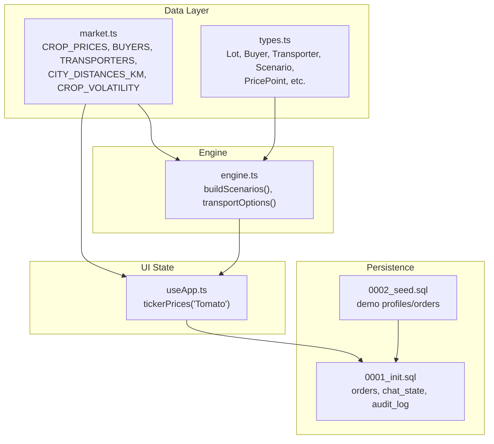
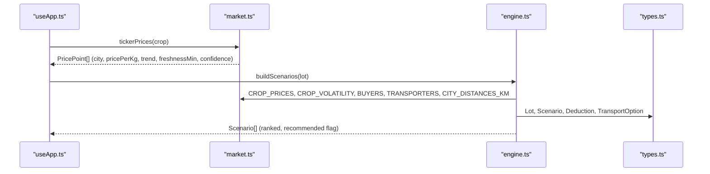
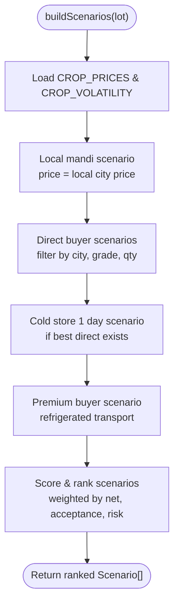
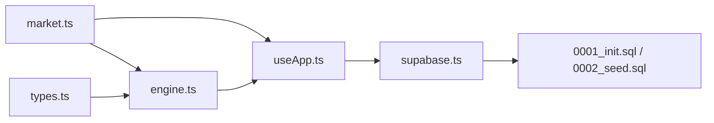

# Market Data Processing

<cite>
**Referenced Files in This Document**
- [market.ts](file://freshroute/src/data/market.ts)
- [engine.ts](file://freshroute/src/lib/engine.ts)
- [types.ts](file://freshroute/src/types.ts)
- [useApp.ts](file://freshroute/src/store/useApp.ts)
- [supabase.ts](file://freshroute/src/lib/supabase.ts)
- [0001_init.sql](file://freshroute/supabase/migrations/0001_init.sql)
- [0002_seed.sql](file://freshroute/supabase/migrations/0002_seed.sql)
</cite>

## Table of Contents
1. [Introduction](#introduction)
2. [Project Structure](#project-structure)
3. [Core Components](#core-components)
4. [Architecture Overview](#architecture-overview)
5. [Detailed Component Analysis](#detailed-component-analysis)
6. [Dependency Analysis](#dependency-analysis)
7. [Performance Considerations](#performance-considerations)
8. [Troubleshooting Guide](#troubleshooting-guide)
9. [Conclusion](#conclusion)
10. [Appendices](#appendices)

## Introduction
This document explains FreshRoute’s market data processing system that powers pricing, buyer matching, and transporter logistics for perishable produce. It focuses on:
- CROP_PRICES multi-city pricing matrices and volatility indices
- BUYERS database of verified wholesale buyers with grade requirements, quantity ranges, payment terms, and acceptance rates
- TRANSPORTERS network including vehicle types, cost structures, refrigeration capabilities, and service coverage via distances
- CITY_DISTANCES_KM matrix used for route optimization and transport cost calculations
- Data validation rules, fallback mechanisms for missing data, and real-time price update strategies
- How market data integrates with the calculation engine to generate optimal selling scenarios

## Project Structure
The market data layer is defined as static datasets and utilities in a dedicated module, consumed by a rule-based calculation engine that generates scenarios and transport options. Types define the contracts between modules. The UI state store initializes live price tickers from market data. Database migrations provide persistence for orders, chat state, and audit logs.

**Diagram sources**
- [market.ts:5-24](file://freshroute/src/data/market.ts#L5-L24)
- [engine.ts:1-14](file://freshroute/src/lib/engine.ts#L1-L14)
- [types.ts:34-112](file://freshroute/src/types.ts#L34-L112)
- [useApp.ts:3-4](file://freshroute/src/store/useApp.ts#L3-L4)
- [0001_init.sql:73-224](file://freshroute/supabase/migrations/0001_init.sql#L73-L224)
- [0002_seed.sql:10-28](file://freshroute/supabase/migrations/0002_seed.sql#L10-L28)

**Section sources**
- [market.ts:5-24](file://freshroute/src/data/market.ts#L5-L24)
- [engine.ts:1-14](file://freshroute/src/lib/engine.ts#L1-L14)
- [types.ts:34-112](file://freshroute/src/types.ts#L34-L112)
- [useApp.ts:3-4](file://freshroute/src/store/useApp.ts#L3-L4)
- [0001_init.sql:73-224](file://freshroute/supabase/migrations/0001_init.sql#L73-L224)
- [0002_seed.sql:10-28](file://freshroute/supabase/migrations/0002_seed.sql#L10-L28)

## Core Components
- Multi-city pricing matrix (CROP_PRICES) provides wholesale PKR/kg per crop across cities.
- Volatility index (CROP_VOLATILITY) drives spoilage estimates relative to a baseline crop.
- Buyers (BUYERS) include grade constraints, premium/discount behavior, acceptance/rejection rates, payment terms, and min/max lot sizes.
- Transporters (TRANSPORTERS) list vehicles, refrigeration capability, cost per km, and on-time reliability.
- Distances (CITY_DISTANCES_KM) support route planning and transport cost estimation.
- Engine (engine.ts) computes scenarios: local mandi sale, direct wholesale buyer, cold storage + sell, and premium buyer paths; it scores and ranks them.
- Types (types.ts) define Lot, Buyer, Transporter, Scenario, PricePoint, and related structures used throughout.

**Section sources**
- [market.ts:13-71](file://freshroute/src/data/market.ts#L13-L71)
- [market.ts:73-172](file://freshroute/src/data/market.ts#L73-L172)
- [engine.ts:16-45](file://freshroute/src/lib/engine.ts#L16-L45)
- [types.ts:47-112](file://freshroute/src/types.ts#L47-L112)

## Architecture Overview
FreshRoute’s market data pipeline combines static market reference data with a deterministic scoring engine to propose optimal selling routes. The UI maintains a live ticker of prices derived from the market dataset.

**Diagram sources**
- [useApp.ts:3-4](file://freshroute/src/store/useApp.ts#L3-L4)
- [market.ts:174-183](file://freshroute/src/data/market.ts#L174-L183)
- [engine.ts:47-235](file://freshroute/src/lib/engine.ts#L47-L235)
- [types.ts:34-112](file://freshroute/src/types.ts#L34-L112)

## Detailed Component Analysis

### CROP_PRICES: Multi-City Pricing Matrix
- Purpose: Wholesale PKR/kg per crop across key cities (e.g., Multan, Lahore, Faisalabad, Islamabad, Karachi).
- Usage: Base price selection for scenario generation; fallback to default city if missing.
- Real-time updates: tickerPrices maps each city entry into a PricePoint with trend, freshness window, and confidence to simulate live mandi feed.

Key behaviors:
- If a crop or city is missing, defaults are applied (e.g., Tomato base).
- Trends vary by city to reflect short-term movement.
- FreshnessMin and confidence enable risk-aware recommendations.

**Section sources**
- [market.ts:13-24](file://freshroute/src/data/market.ts#L13-L24)
- [market.ts:174-183](file://freshroute/src/data/market.ts#L174-L183)

### CROP_VOLATILITY: Regional Price Variability and Spoilage Driver
- Purpose: Relative perishability vs tomato (=1.0), used to scale spoilage estimates.
- Usage: Combined with packaging factor and exposure time to estimate loss percentage per scenario.
- Impact: Higher volatility increases spoilage penalty, influencing scenario ranking.

**Section sources**
- [market.ts:60-71](file://freshroute/src/data/market.ts#L60-L71)
- [engine.ts:29-36](file://freshroute/src/lib/engine.ts#L29-L36)

### BUYERS: Verified Wholesale Buyers
- Fields: id, name, city, category, grade (A/B/C/any), premiumPct, acceptanceRate, rejectionPct, paymentTerms, minKg, maxKg, verified, responseTime.
- Filtering: Scenarios consider only buyers not in the same city as the lot, compatible grades, and within quantity range.
- Financials: Premium buyers may add percentage uplift; rejection rate reduces accepted quantity.

Examples of integration:
- Direct wholesale buyer scenario uses distance, transport cost, transit days, spoilage, and rejection to compute net revenue.
- Premium buyer scenario enforces refrigerated transport and stricter quality checks.

**Section sources**
- [market.ts:73-134](file://freshroute/src/data/market.ts#L73-L134)
- [engine.ts:86-134](file://freshroute/src/lib/engine.ts#L86-L134)
- [engine.ts:181-224](file://freshroute/src/lib/engine.ts#L181-L224)
- [types.ts:47-61](file://freshroute/src/types.ts#L47-L61)

### TRANSPORTERS: Vehicle Network and Cost Structures
- Fields: id, name, vehicle description, refrigerated boolean, costPerKm, onTimePct.
- Coverage: Service area inferred via CITY_DISTANCES_KM; costs computed as costPerKm × distance.
- Recommendations: Non-refrigerated covered trucks can be best value for certain routes; refrigerated recommended for soft produce.

Integration points:
- Used to calculate transport cost for direct and premium buyer scenarios.
- transportOptions returns multiple choices with ETA, pickup time, and notes.

**Section sources**
- [market.ts:136-161](file://freshroute/src/data/market.ts#L136-L161)
- [engine.ts:238-257](file://freshroute/src/lib/engine.ts#L238-L257)
- [types.ts:63-70](file://freshroute/src/types.ts#L63-L70)

### CITY_DISTANCES_KM: Route Optimization Matrix
- Purpose: Provides distances between cities to estimate transit time and transport cost.
- Behavior: If a specific pair is missing, a default distance is used to ensure robustness.
- Use cases: Transit day calculation, transport cost computation, ETA estimation.

**Section sources**
- [market.ts:5-11](file://freshroute/src/data/market.ts#L5-L11)
- [engine.ts:96-101](file://freshroute/src/lib/engine.ts#L96-L101)
- [engine.ts:238-241](file://freshroute/src/lib/engine.ts#L238-L241)

### Engine: Scenario Generation and Ranking
- Inputs: Lot details (crop, quantity, location, packaging, vision grade/ripeness).
- Outputs: Ranked scenarios with gross, deductions, net, spoilage, risk, payment terms, and rationale.
- Scenarios:
  - Local mandi sale today
  - Direct wholesale buyer in another city
  - Cold storage one day then sell
  - Premium Grade-A buyer with refrigerated transport
- Scoring: Weighted function considers net revenue, buyer acceptance rate, and risk penalties; top scenario marked recommended.

**Diagram sources**
- [engine.ts:47-235](file://freshroute/src/lib/engine.ts#L47-L235)

**Section sources**
- [engine.ts:16-45](file://freshroute/src/lib/engine.ts#L16-L45)
- [engine.ts:47-235](file://freshroute/src/lib/engine.ts#L47-L235)

### Data Models and Contracts
- Lot: Crop, quantity, location, packaging, storage availability, departure preferences, photos, vision results, confidence.
- Buyer: Constraints and financial terms for wholesale purchases.
- Transporter: Vehicle type, refrigeration, cost model, reliability.
- Scenario: Market destination, gross/net, deductions, spoilage, risk, payment terms, rationale, recommendation flag, score.
- PricePoint: City-level price with trend, freshness window, and confidence.

**Section sources**
- [types.ts:34-112](file://freshroute/src/types.ts#L34-L112)

### Persistence and Seed Data
- Orders: Persist final decisions with buyer, destination, quantities, pricing, steps, and status.
- Chat state: Stores conversation stage, lot, scenarios, quick replies.
- Audit log: Tracks actions and approvals for transparency.
- Demo seed: Populates profiles and orders for demonstration purposes.

**Section sources**
- [0001_init.sql:73-224](file://freshroute/supabase/migrations/0001_init.sql#L73-L224)
- [0002_seed.sql:10-28](file://freshroute/supabase/migrations/0002_seed.sql#L10-L28)

## Dependency Analysis
- market.ts exports constants and arrays consumed by engine.ts and useApp.ts.
- engine.ts depends on market.ts for pricing, buyers, transporters, distances, and volatility; uses types.ts for structured inputs/outputs.
- useApp.ts initializes price tickers from market.ts and holds scenarios generated by engine.ts.
- supabase.ts configures client for backend connectivity; migrations define schema for persistence.

**Diagram sources**
- [market.ts:1-24](file://freshroute/src/data/market.ts#L1-L24)
- [engine.ts:1-14](file://freshroute/src/lib/engine.ts#L1-L14)
- [useApp.ts:3-4](file://freshroute/src/store/useApp.ts#L3-L4)
- [supabase.ts:1-20](file://freshroute/src/lib/supabase.ts#L1-L20)
- [0001_init.sql:73-224](file://freshroute/supabase/migrations/0001_init.sql#L73-L224)
- [0002_seed.sql:10-28](file://freshroute/supabase/migrations/0002_seed.sql#L10-L28)

**Section sources**
- [market.ts:1-24](file://freshroute/src/data/market.ts#L1-L24)
- [engine.ts:1-14](file://freshroute/src/lib/engine.ts#L1-L14)
- [useApp.ts:3-4](file://freshroute/src/store/useApp.ts#L3-L4)
- [supabase.ts:1-20](file://freshroute/src/lib/supabase.ts#L1-L20)
- [0001_init.sql:73-224](file://freshroute/supabase/migrations/0001_init.sql#L73-L224)
- [0002_seed.sql:10-28](file://freshroute/supabase/migrations/0002_seed.sql#L10-L28)

## Performance Considerations
- Deterministic calculations: Scenario building is O(n) over buyers and transporters; efficient for small datasets.
- Fallbacks: Missing crop/city entries default to known values to avoid runtime errors.
- Spoilage caps: Maximum spoilage capped to prevent unrealistic losses.
- Transport ETA: Simple linear approximation based on distance; suitable for quick estimates.

[No sources needed since this section provides general guidance]

## Troubleshooting Guide
Common issues and mitigations:
- Missing crop or city in pricing: Defaults to Tomato or a known city to keep calculations running.
- Missing distance: Uses a default distance to compute transport cost and ETA.
- Buyer mismatch: Filters out incompatible grades or quantities; ensures only viable buyers are considered.
- Refrigeration needs: Premium scenarios enforce refrigerated transport to reduce spoilage risk.
- Backend configuration: Ensure Supabase URL and anon key are set; otherwise placeholder client is used.

**Section sources**
- [engine.ts:47-50](file://freshroute/src/lib/engine.ts#L47-L50)
- [engine.ts:96-101](file://freshroute/src/lib/engine.ts#L96-L101)
- [engine.ts:181-224](file://freshroute/src/lib/engine.ts#L181-L224)
- [supabase.ts:3-7](file://freshroute/src/lib/supabase.ts#L3-L7)

## Conclusion
FreshRoute’s market data processing system combines robust reference data with a transparent, rule-based engine to generate financially grounded selling scenarios. By integrating multi-city pricing, buyer constraints, transporter networks, and distance matrices, it produces actionable recommendations that balance revenue, risk, and logistics. Real-time price tickers and clear fallbacks ensure resilience, while persistence layers capture outcomes and audit trails for accountability.

[No sources needed since this section summarizes without analyzing specific files]

## Appendices

### Example: Generating Optimal Selling Scenarios
- Input: A lot of tomatoes in Multan, 800 kg, packed in crates, estimated Grade B.
- Steps:
  - Load prices for tomatoes across cities and volatility for spoilage.
  - Generate local mandi sale scenario with commission and cartage.
  - Filter direct buyers in other cities compatible with Grade B and quantity range.
  - Compute transport costs using CITY_DISTANCES_KM and TRANSPORTERS costPerKm.
  - Estimate spoilage based on transit days and packaging; apply rejection rates.
  - Consider cold storage option for one day to reduce spoilage at added cost.
  - Evaluate premium buyer requiring Grade A and refrigerated transport.
  - Score scenarios using weighted function; mark highest-scoring as recommended.
- Output: Ranked scenarios with detailed deductions, risk levels, and rationale.

**Section sources**
- [engine.ts:47-235](file://freshroute/src/lib/engine.ts#L47-L235)
- [market.ts:13-71](file://freshroute/src/data/market.ts#L13-L71)
- [types.ts:34-112](file://freshroute/src/types.ts#L34-L112)