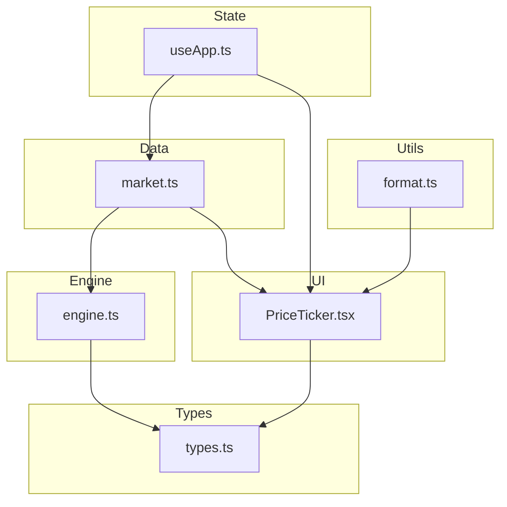
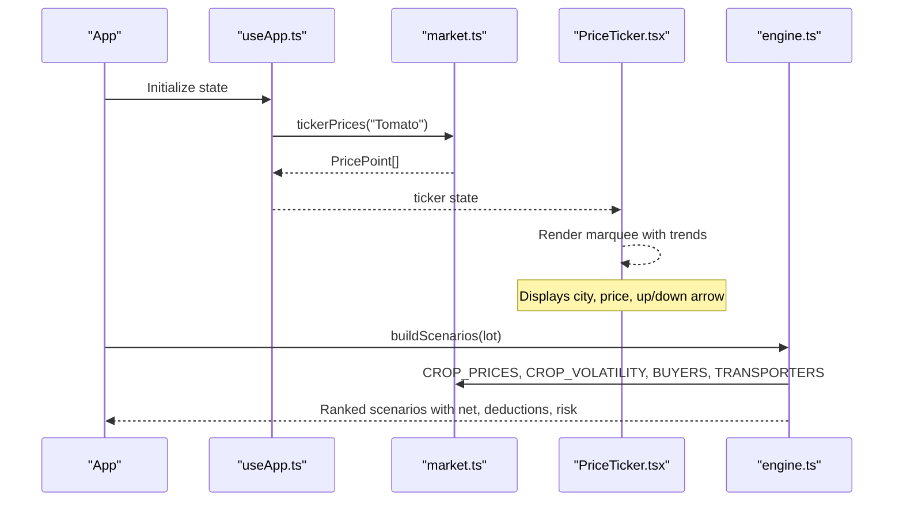
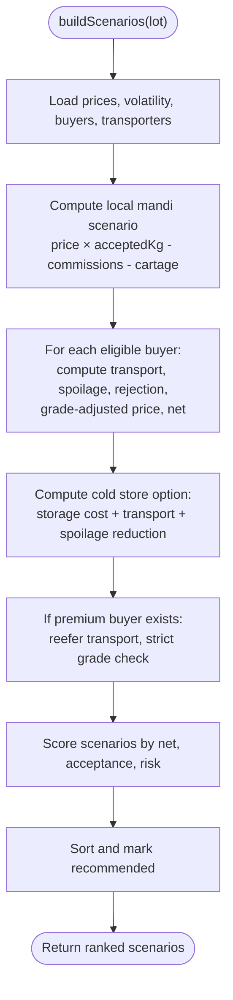
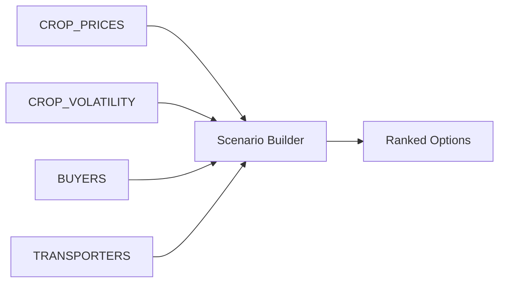
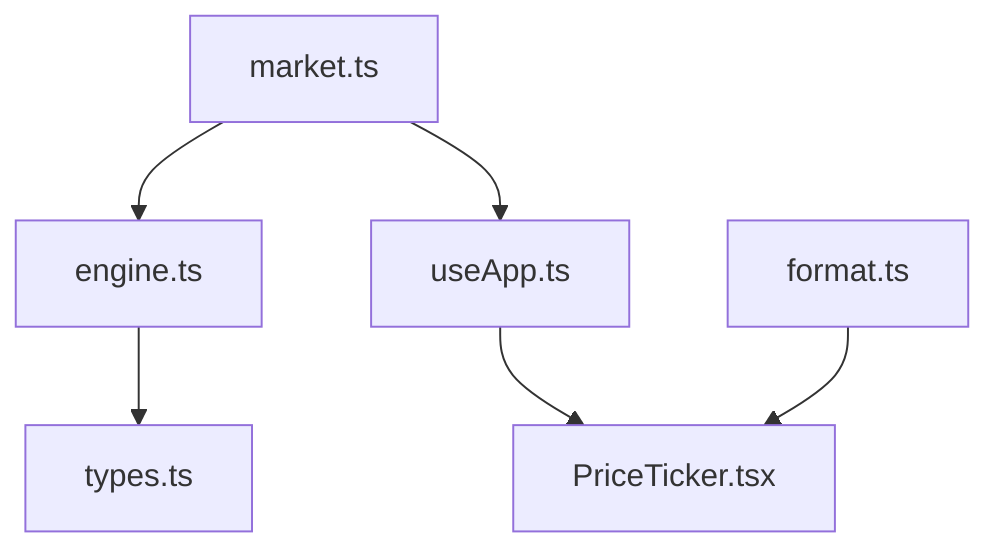

# Pricing Intelligence

<cite>
**Referenced Files in This Document**
- [market.ts](file://freshroute/src/data/market.ts)
- [engine.ts](file://freshroute/src/lib/engine.ts)
- [types.ts](file://freshroute/src/types.ts)
- [PriceTicker.tsx](file://freshroute/src/components/PriceTicker.tsx)
- [useApp.ts](file://freshroute/src/store/useApp.ts)
- [format.ts](file://freshroute/src/lib/format.ts)
</cite>

## Table of Contents
1. [Introduction](#introduction)
2. [Project Structure](#project-structure)
3. [Core Components](#core-components)
4. [Architecture Overview](#architecture-overview)
5. [Detailed Component Analysis](#detailed-component-analysis)
6. [Dependency Analysis](#dependency-analysis)
7. [Performance Considerations](#performance-considerations)
8. [Troubleshooting Guide](#troubleshooting-guide)
9. [Conclusion](#conclusion)

## Introduction
This document explains FreshRoute’s pricing intelligence system that powers multi-city crop pricing matrices, spoilage and volatility modeling, and real-time price ticker generation. It focuses on:
- The CROP_PRICES matrix for wholesale PKR/kg across five major Pakistani cities for nine crops.
- The CROP_VOLATILITY indices used to estimate spoilage relative to a tomato baseline of 1.0.
- The tickerPrices function that generates PricePoint arrays with trend indicators, freshness estimates, and confidence scores.
- How these data structures integrate with supply chain calculations to recommend optimal selling locations and timing strategies.

## Project Structure
The pricing intelligence spans data definitions, calculation logic, UI rendering, and application state:
- Data layer: market.ts defines prices, distances, buyers, transporters, storage, weather, aliases, and the ticker generator.
- Engine layer: engine.ts implements scenario building, spoilage modeling, scoring, and transport options.
- Types: types.ts defines shared interfaces such as PricePoint, Scenario, Lot, Buyer, Transporter, StorageFacility.
- UI layer: PriceTicker.tsx renders live mandi rates using the store’s ticker.
- State: useApp.ts initializes and exposes the ticker via Zustand.
- Formatting: format.ts provides currency and unit helpers.

**Diagram sources**
- [market.ts:1-189](file://freshroute/src/data/market.ts#L1-L189)
- [engine.ts:1-258](file://freshroute/src/lib/engine.ts#L1-L258)
- [types.ts:1-229](file://freshroute/src/types.ts#L1-L229)
- [PriceTicker.tsx:1-35](file://freshroute/src/components/PriceTicker.tsx#L1-L35)
- [useApp.ts:1-129](file://freshroute/src/store/useApp.ts#L1-L129)
- [format.ts:1-21](file://freshroute/src/lib/format.ts#L1-L21)

**Section sources**
- [market.ts:1-189](file://freshroute/src/data/market.ts#L1-L189)
- [engine.ts:1-258](file://freshroute/src/lib/engine.ts#L1-L258)
- [types.ts:1-229](file://freshroute/src/types.ts#L1-L229)
- [PriceTicker.tsx:1-35](file://freshroute/src/components/PriceTicker.tsx#L1-L35)
- [useApp.ts:1-129](file://freshroute/src/store/useApp.ts#L1-L129)
- [format.ts:1-21](file://freshroute/src/lib/format.ts#L1-L21)

## Core Components
- CROP_PRICES: A two-dimensional map of crop to city to wholesale price (PKR/kg). Covers Tomato, Potato, Onion, Mango, Kinnow, Banana, Green Chili, Okra, and Leafy Vegetables across Multan, Lahore, Faisalabad, Islamabad, and Karachi.
- CROP_VOLATILITY: Relative perishability index per crop versus Tomato (baseline 1.0). Used by the spoilage model to adjust expected loss based on exposure time and packaging.
- tickerPrices(crop): Generates an array of PricePoint objects per city with pricePerKg, trend direction, freshnessMin, and confidence. Used by the UI ticker.
- buildScenarios(lot): Computes multiple sell scenarios (local mandi, direct buyer, cold storage, premium buyer), applying transport costs, spoilage, commissions, platform fees, and grading adjustments to derive net revenue and risk.
- transportOptions(lot, destCity): Produces transport alternatives with cost, ETA, and notes.

Key responsibilities:
- Data integrity: consistent city keys and crop names; fallbacks to defaults when missing.
- Explainable modeling: spoilage and scoring are rule-based and transparent.
- Real-time display: tickerPrices feeds a scrolling price banner.

**Section sources**
- [market.ts:13-71](file://freshroute/src/data/market.ts#L13-L71)
- [market.ts:174-183](file://freshroute/src/data/market.ts#L174-L183)
- [engine.ts:16-45](file://freshroute/src/lib/engine.ts#L16-L45)
- [engine.ts:47-235](file://freshroute/src/lib/engine.ts#L47-L235)
- [engine.ts:238-257](file://freshroute/src/lib/engine.ts#L238-L257)
- [types.ts:81-112](file://freshroute/src/types.ts#L81-L112)

## Architecture Overview
The pricing intelligence flows from static market data through calculation engines into UI components and app state.

**Diagram sources**
- [useApp.ts:56-69](file://freshroute/src/store/useApp.ts#L56-L69)
- [market.ts:174-183](file://freshroute/src/data/market.ts#L174-L183)
- [PriceTicker.tsx:4-33](file://freshroute/src/components/PriceTicker.tsx#L4-L33)
- [engine.ts:47-235](file://freshroute/src/lib/engine.ts#L47-L235)

## Detailed Component Analysis

### Multi-City Crop Pricing Matrix (CROP_PRICES)
- Purpose: Provides wholesale PKR/kg prices for nine crops across five cities.
- Usage:
  - Local mandi pricing uses lot.location to fetch base price.
  - Direct-buyer pricing uses destination city to compute uplift vs local.
  - Scenarios compare markets to identify best net revenue after costs.
- Data shape: Record<string, Record<string, number>> keyed by crop then city.

Example integration points:
- Local mandi scenario reads prices[lot.location] to compute gross before commission and cartage.
- Direct buyer scenario reads prices[b.city] and applies grade factor to reflect quality-based pricing.

**Section sources**
- [market.ts:13-24](file://freshroute/src/data/market.ts#L13-L24)
- [engine.ts:47-84](file://freshroute/src/lib/engine.ts#L47-L84)
- [engine.ts:95-133](file://freshroute/src/lib/engine.ts#L95-L133)

### Volatility and Spoilage Model (CROP_VOLATILITY)
- Baseline: Tomato = 1.0. Other crops scale relative to this baseline.
- Spoilage formula factors:
  - Base daily exposure rate depends on transit duration or holding time.
  - Packaging multiplier increases loss for sacks and loose packing.
  - Ripeness modifier increases loss for high ripeness.
  - Refrigeration reduces loss significantly.
  - Cap at maximum loss to prevent unrealistic outcomes.
- Risk classification:
  - Higher volatility influences perceived risk and can affect scenario ranking indirectly via penalties.

Practical implications:
- Leafy Vegetables have higher volatility, increasing expected loss under identical conditions.
- Refrigerated transport is recommended for high-volatility crops or long transit times.

**Section sources**
- [market.ts:60-71](file://freshroute/src/data/market.ts#L60-L71)
- [engine.ts:23-36](file://freshroute/src/lib/engine.ts#L23-L36)
- [engine.ts:136-178](file://freshroute/src/lib/engine.ts#L136-L178)
- [engine.ts:181-223](file://freshroute/src/lib/engine.ts#L181-L223)

### Real-Time Price Ticker (tickerPrices)
- Input: crop name.
- Output: Array of PricePoint per city with:
  - city: string
  - pricePerKg: number
  - trend: number (positive/negative indicator)
  - freshnessMin: number (estimated minutes until peak freshness window closes)
  - confidence: number (0–1 likelihood of current price being accurate)
- Behavior:
  - Uses CROP_PRICES[crop] with fallback to Tomato if unknown.
  - Assigns deterministic trend per city for demo purposes.
  - Adds randomized freshness and confidence to simulate live variability.

Integration:
- Initialized in app state with default crop "Tomato".
- Rendered in PriceTicker component showing city, price, and trend arrows.

**Section sources**
- [market.ts:174-183](file://freshroute/src/data/market.ts#L174-L183)
- [useApp.ts:68-68](file://freshroute/src/store/useApp.ts#L68-L68)
- [PriceTicker.tsx:4-33](file://freshroute/src/components/PriceTicker.tsx#L4-L33)
- [types.ts:81-87](file://freshroute/src/types.ts#L81-L87)

### Scenario Builder and Supply Chain Calculations
- Inputs: Lot details (crop, quantity, location, packaging, vision results).
- Outputs: Ranked scenarios including:
  - Local mandi sale today
  - Direct wholesale buyer in nearby city
  - Cold storage one day then sell
  - Premium Grade-A buyer (if applicable)
- Cost model includes:
  - Mandi commission and loading/cartage for local sales
  - Transport cost based on distance and transporter type
  - Platform fee percentage
  - Cold storage cost per kg per day
  - Rejection and spoilage adjustments
- Scoring:
  - Weighted score considers net revenue, acceptance rate, and risk penalty
  - Top-scoring scenario marked as recommended

**Diagram sources**
- [engine.ts:47-235](file://freshroute/src/lib/engine.ts#L47-L235)

**Section sources**
- [engine.ts:47-235](file://freshroute/src/lib/engine.ts#L47-L235)

### Transport Options
- Calculates cost and ETA for each transporter between origin and destination.
- Notes differentiate refrigerated vs non-refrigerated vehicles and value recommendations.

Usage:
- Presented alongside scenarios to help choose logistics aligned with crop volatility and urgency.

**Section sources**
- [engine.ts:238-257](file://freshroute/src/lib/engine.ts#L238-L257)

### Conceptual Overview
The pricing intelligence combines market data, spoilage modeling, and logistics to produce actionable recommendations:
- Compare local vs distant markets considering price uplift and transport costs.
- Adjust for crop volatility and packaging to estimate realistic losses.
- Factor in buyer acceptance and payment terms to balance speed vs margin.
- Use cold storage strategically when expected price rise outweighs storage and delay costs.

[No sources needed since this diagram shows conceptual workflow, not actual code structure]

## Dependency Analysis
- market.ts is foundational: supplies prices, volatility, distances, buyers, transporters, storage, weather, and ticker generator.
- engine.ts depends on market.ts for all domain constants and data, and on types.ts for interface contracts.
- useApp.ts imports tickerPrices from market.ts to initialize UI ticker state.
- PriceTicker.tsx consumes ticker state from useApp.ts and renders PricePoint fields.
- format.ts provides currency formatting used elsewhere in the app.

**Diagram sources**
- [market.ts:1-189](file://freshroute/src/data/market.ts#L1-L189)
- [engine.ts:1-258](file://freshroute/src/lib/engine.ts#L1-L258)
- [types.ts:1-229](file://freshroute/src/types.ts#L1-L229)
- [useApp.ts:1-129](file://freshroute/src/store/useApp.ts#L1-L129)
- [PriceTicker.tsx:1-35](file://freshroute/src/components/PriceTicker.tsx#L1-L35)
- [format.ts:1-21](file://freshroute/src/lib/format.ts#L1-L21)

**Section sources**
- [market.ts:1-189](file://freshroute/src/data/market.ts#L1-L189)
- [engine.ts:1-258](file://freshroute/src/lib/engine.ts#L1-L258)
- [useApp.ts:1-129](file://freshroute/src/store/useApp.ts#L1-L129)
- [PriceTicker.tsx:1-35](file://freshroute/src/components/PriceTicker.tsx#L1-L35)
- [format.ts:1-21](file://freshroute/src/lib/format.ts#L1-L21)

## Performance Considerations
- Data lookups: CROP_PRICES and CROP_VOLATILITY are constant maps; access is O(1).
- Scenario generation: Iterates over buyers and computes costs; complexity proportional to number of buyers and transporters. For MVP scales well.
- Ticker generation: Creates PricePoint arrays per call; consider memoization if called frequently in tight loops.
- UI rendering: Marquee duplication doubles items for smooth animation; ensure minimal re-renders by keeping ticker stable.

[No sources needed since this section provides general guidance]

## Troubleshooting Guide
- Missing crop mapping:
  - If a crop key is absent in CROP_PRICES, engine and ticker fall back to Tomato. Verify crop naming consistency and aliases.
- Unexpected spoilage:
  - Check packaging type and ripeness flags; sacks and loose increase loss. High ripeness adds a multiplier.
  - Ensure refrigeration flag is set appropriately for high-volatility crops.
- Incorrect trends or freshness:
  - tickerPrices assigns deterministic trends per city and random freshness/confidence. If you need deterministic behavior, replace randomness with fixed values or seeded inputs.
- Transport cost anomalies:
  - Confirm CITY_DISTANCES_KM contains correct distances for origin-destination pairs. Defaults are applied if missing.

**Section sources**
- [market.ts:13-24](file://freshroute/src/data/market.ts#L13-L24)
- [market.ts:26-58](file://freshroute/src/data/market.ts#L26-L58)
- [market.ts:174-183](file://freshroute/src/data/market.ts#L174-L183)
- [engine.ts:23-36](file://freshroute/src/lib/engine.ts#L23-L36)
- [engine.ts:95-133](file://freshroute/src/lib/engine.ts#L95-L133)

## Conclusion
FreshRoute’s pricing intelligence integrates multi-city wholesale prices, crop-specific volatility, and logistics to generate explainable, ranked selling scenarios. The CROP_PRICES matrix anchors revenue projections, while CROP_VOLATILITY drives realistic spoilage estimates. The tickerPrices function provides a live-feeling price banner that informs users of market conditions. Together, these components enable farmers and traders to choose optimal destinations, timing, and transport modes to maximize net revenue while managing risk.