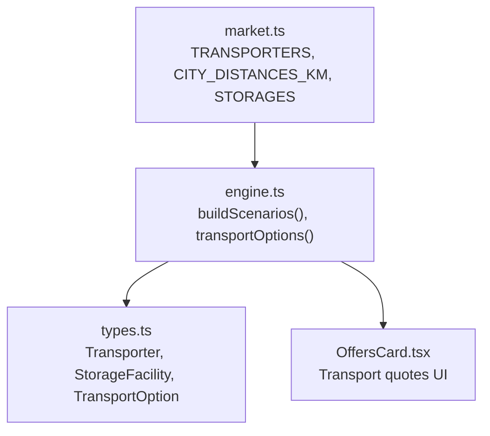
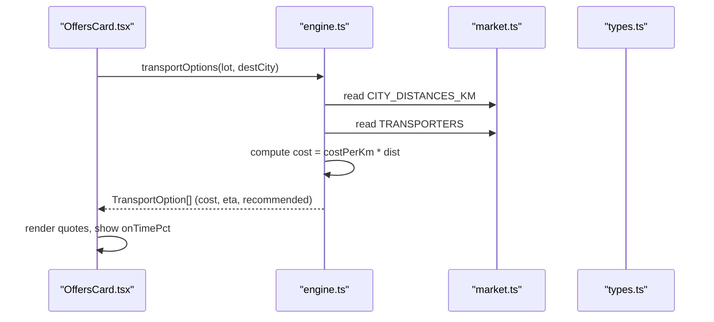
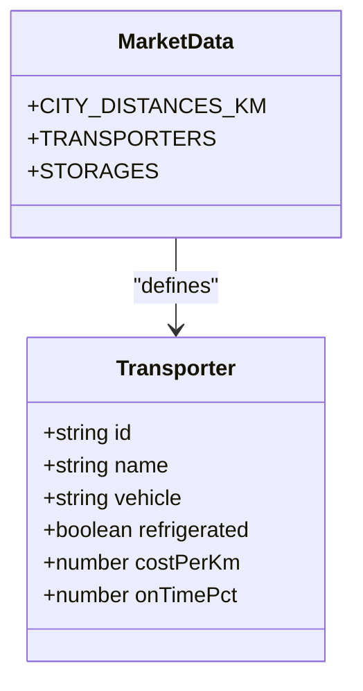
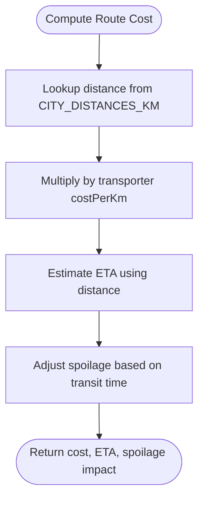
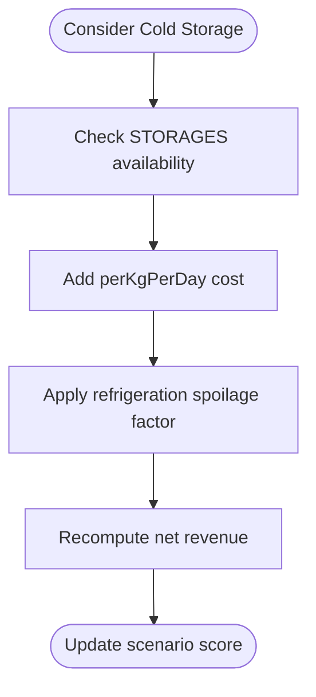
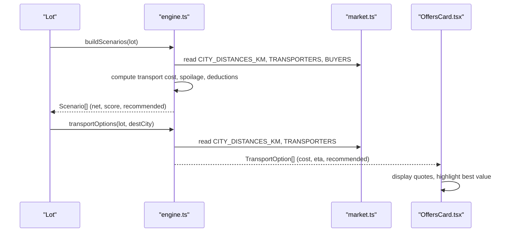
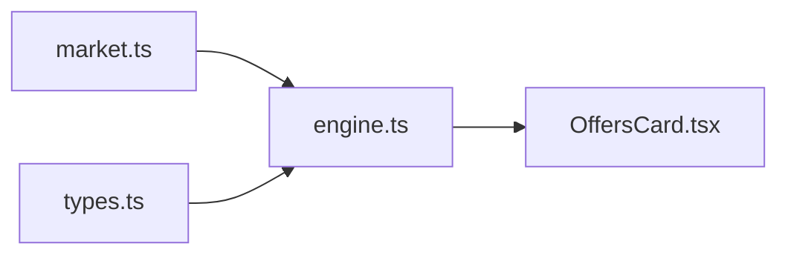

# Transportation Logistics

<cite>
**Referenced Files in This Document**
- [market.ts](file://freshroute/src/data/market.ts)
- [engine.ts](file://freshroute/src/lib/engine.ts)
- [types.ts](file://freshroute/src/types.ts)
- [OffersCard.tsx](file://freshroute/src/components/cards/OffersCard.tsx)
</cite>

## Table of Contents
1. Introduction
2. Project Structure
3. Core Components
4. Architecture Overview
5. Detailed Component Analysis
6. Dependency Analysis
7. Performance Considerations
8. Troubleshooting Guide
9. Conclusion
10. Appendices

## Introduction
This document explains FreshRoute’s transportation logistics system that manages transport costs and delivery optimization for perishable produce. It focuses on the TRANSPORTERS network, vehicle specifications (including refrigeration), cost per kilometer, and on-time delivery performance. It also documents the CITY_DISTANCES_KM matrix used for route optimization, storage facilities from STORAGES with temperature control and daily costs, and how these data sources influence optimal routing decisions and transport cost calculations.

## Project Structure
The transportation logic is implemented across a small set of focused modules:
- Data definitions and constants live in market.ts (transporters, distances, prices, buyers, storages).
- The scoring and scenario engine lives in engine.ts (buildScenarios, transportOptions).
- Type contracts are defined in types.ts (Transporter, StorageFacility, TransportOption, etc.).
- The UI renders transport quotes and selections in OffersCard.tsx.

**Diagram sources**
- [market.ts:5-11](file://freshroute/src/data/market.ts#L5-L11)
- [market.ts:136-172](file://freshroute/src/data/market.ts#L136-L172)
- [engine.ts:47-235](file://freshroute/src/lib/engine.ts#L47-L235)
- [engine.ts:238-257](file://freshroute/src/lib/engine.ts#L238-L257)
- [types.ts:63-79](file://freshroute/src/types.ts#L63-L79)
- [types.ts:130-137](file://freshroute/src/types.ts#L130-L137)
- [OffersCard.tsx:50-99](file://freshroute/src/components/cards/OffersCard.tsx#L50-L99)

**Section sources**
- [market.ts:5-11](file://freshroute/src/data/market.ts#L5-L11)
- [market.ts:136-172](file://freshroute/src/data/market.ts#L136-L172)
- [engine.ts:47-235](file://freshroute/src/lib/engine.ts#L47-L235)
- [engine.ts:238-257](file://freshroute/src/lib/engine.ts#L238-L257)
- [types.ts:63-79](file://freshroute/src/types.ts#L63-L79)
- [types.ts:130-137](file://freshroute/src/types.ts#L130-L137)
- [OffersCard.tsx:50-99](file://freshroute/src/components/cards/OffersCard.tsx#L50-L99)

## Core Components
- TRANSPORTERS network: Three service providers with distinct vehicles, refrigeration capability, cost per kilometer, and on-time delivery percentages.
- CITY_DISTANCES_KM matrix: Distance between city pairs used to compute transit time and transport cost.
- STORAGES array: Cold storage facilities with temperature control and per-kilogram-per-day storage cost.
- Engine functions: buildScenarios computes net revenue scenarios including transport and spoilage; transportOptions generates transport quotes per destination.

Key responsibilities:
- Data layer (market.ts): Defines transporters, distances, storages, and market prices.
- Logic layer (engine.ts): Calculates transport costs, spoilage, and scores scenarios; produces transport options.
- UI layer (OffersCard.tsx): Presents transport quotes, highlights recommended option, and shows on-time percentage.

**Section sources**
- [market.ts:136-172](file://freshroute/src/data/market.ts#L136-L172)
- [engine.ts:47-235](file://freshroute/src/lib/engine.ts#L47-L235)
- [engine.ts:238-257](file://freshroute/src/lib/engine.ts#L238-L257)
- [OffersCard.tsx:50-99](file://freshroute/src/components/cards/OffersCard.tsx#L50-L99)

## Architecture Overview
The system uses a data-driven approach:
- market.ts provides static datasets for transporters, distances, storages, and prices.
- engine.ts consumes these datasets to generate optimized scenarios and transport options.
- OffersCard.tsx displays transport quotes derived from engine outputs.

**Diagram sources**
- [engine.ts:238-257](file://freshroute/src/lib/engine.ts#L238-L257)
- [market.ts:5-11](file://freshroute/src/data/market.ts#L5-L11)
- [market.ts:136-172](file://freshroute/src/data/market.ts#L136-L172)
- [OffersCard.tsx:50-99](file://freshroute/src/components/cards/OffersCard.tsx#L50-L99)
- [types.ts:130-137](file://freshroute/src/types.ts#L130-L137)

## Detailed Component Analysis

### TRANSPORTERS Network
Three service providers are modeled:
- Malik Transport: Open Mazda 1.5t, non-refrigerated, PKR 26/km, 78% on-time.
- Rana Goods Carrier: Covered Mazda 2t, non-refrigerated, PKR 31/km, 85% on-time.
- RapidCold Logistics: Refrigerated Shehzore 1t, refrigerated, PKR 47/km, 92% on-time.

These values drive transport cost calculation and influence recommendations based on cargo type and route length.

**Diagram sources**
- [types.ts:63-70](file://freshroute/src/types.ts#L63-L70)
- [market.ts:136-172](file://freshroute/src/data/market.ts#L136-L172)

**Section sources**
- [market.ts:136-161](file://freshroute/src/data/market.ts#L136-L161)
- [types.ts:63-70](file://freshroute/src/types.ts#L63-L70)

### CITY_DISTANCES_KM Matrix
A distance matrix between five cities (Multan, Lahore, Faisalabad, Islamabad, Karachi) is used to:
- Compute transport cost: costPerKm × distance.
- Estimate transit hours: base hours plus distance-based travel time.
- Determine spoilage exposure: longer routes increase days/hours of exposure.

Example usage patterns:
- Direct buyer scenarios use distance to calculate transport cost and transit time.
- Premium buyer scenarios may require refrigerated transport due to higher value or stricter quality requirements.

**Diagram sources**
- [engine.ts:95-103](file://freshroute/src/lib/engine.ts#L95-L103)
- [engine.ts:238-257](file://freshroute/src/lib/engine.ts#L238-L257)
- [market.ts:5-11](file://freshroute/src/data/market.ts#L5-L11)

**Section sources**
- [market.ts:5-11](file://freshroute/src/data/market.ts#L5-L11)
- [engine.ts:95-103](file://freshroute/src/lib/engine.ts#L95-L103)
- [engine.ts:238-257](file://freshroute/src/lib/engine.ts#L238-L257)

### STORAGES Array
Storage facilities include:
- Multan Cold Hub: Temperature-controlled at 4°C, PKR 3.5/kg/day, verified.

Storage impacts:
- Reduces spoilage when cold chain is applied.
- Adds per-kilogram-per-day cost to scenarios.
- Used in “store one day” scenarios to balance spoilage reduction against storage cost.

**Diagram sources**
- [market.ts:163-172](file://freshroute/src/data/market.ts#L163-L172)
- [engine.ts:136-178](file://freshroute/src/lib/engine.ts#L136-L178)
- [engine.ts:29-36](file://freshroute/src/lib/engine.ts#L29-L36)

**Section sources**
- [market.ts:163-172](file://freshroute/src/data/market.ts#L163-L172)
- [engine.ts:29-36](file://freshroute/src/lib/engine.ts#L29-L36)
- [engine.ts:136-178](file://freshroute/src/lib/engine.ts#L136-L178)

### Transport Cost Calculation and Optimization
Core calculation:
- Transport cost = transporter.costPerKm × distance (from CITY_DISTANCES_KM).
- ETA estimation includes base hours plus distance-based travel time; refrigerated trucks add loading time.
- Spoilage model adjusts loss based on crop volatility, packaging, ripeness, and refrigeration status.

Optimization logic:
- buildScenarios evaluates multiple strategies (local mandi, direct buyer, cold store, premium buyer).
- Each scenario includes deductions (transport, platform fee, loading, storage) and estimated spoilage.
- Scenarios are scored using net revenue, acceptance rate, and risk penalties; top-scoring scenario is marked recommended.

**Diagram sources**
- [engine.ts:47-235](file://freshroute/src/lib/engine.ts#L47-L235)
- [engine.ts:238-257](file://freshroute/src/lib/engine.ts#L238-L257)
- [market.ts:5-11](file://freshroute/src/data/market.ts#L5-L11)
- [market.ts:136-172](file://freshroute/src/data/market.ts#L136-L172)
- [OffersCard.tsx:50-99](file://freshroute/src/components/cards/OffersCard.tsx#L50-L99)

**Section sources**
- [engine.ts:47-235](file://freshroute/src/lib/engine.ts#L47-L235)
- [engine.ts:238-257](file://freshroute/src/lib/engine.ts#L238-L257)
- [market.ts:5-11](file://freshroute/src/data/market.ts#L5-L11)
- [market.ts:136-172](file://freshroute/src/data/market.ts#L136-L172)
- [OffersCard.tsx:50-99](file://freshroute/src/components/cards/OffersCard.tsx#L50-L99)

## Dependency Analysis
- engine.ts depends on market.ts for TRANSPORTERS, CITY_DISTANCES_KM, CROP_PRICES, CROP_VOLATILITY, and BUYERS.
- OffersCard.tsx depends on engine.ts outputs (TransportOption[]) and types.ts interfaces.
- Types define contracts ensuring consistent data shapes across modules.

**Diagram sources**
- [engine.ts:1-8](file://freshroute/src/lib/engine.ts#L1-L8)
- [market.ts:1-2](file://freshroute/src/data/market.ts#L1-L2)
- [types.ts:63-79](file://freshroute/src/types.ts#L63-L79)
- [OffersCard.tsx:1-7](file://freshroute/src/components/cards/OffersCard.tsx#L1-L7)

**Section sources**
- [engine.ts:1-8](file://freshroute/src/lib/engine.ts#L1-L8)
- [market.ts:1-2](file://freshroute/src/data/market.ts#L1-L2)
- [types.ts:63-79](file://freshroute/src/types.ts#L63-L79)
- [OffersCard.tsx:1-7](file://freshroute/src/components/cards/OffersCard.tsx#L1-L7)

## Performance Considerations
- Distance lookups are constant-time dictionary accesses; overall complexity scales linearly with number of transporters and buyers evaluated per scenario.
- Spoilage computation is lightweight and deterministic; refrigeration reduces spoilage significantly for sensitive crops.
- UI rendering of transport quotes is efficient; selection updates expected net dynamically without re-computation.

[No sources needed since this section provides general guidance]

## Troubleshooting Guide
Common issues and checks:
- Incorrect distance: Ensure CITY_DISTANCES_KM contains the origin and destination pair; fallbacks exist but may skew ETA and cost.
- Refrigeration mismatch: For high-value or highly perishable goods, prefer refrigerated transporters to reduce spoilage despite higher cost.
- On-time reliability: Use onTimePct to weigh risk; lower on-time percentages increase delay risk and potential spoilage.
- Storage availability: Verify STORAGES entries match operational locations; ensure perKgPerDay cost aligns with actual facility pricing.

**Section sources**
- [market.ts:5-11](file://freshroute/src/data/market.ts#L5-L11)
- [market.ts:136-172](file://freshroute/src/data/market.ts#L136-L172)
- [engine.ts:29-36](file://freshroute/src/lib/engine.ts#L29-L36)
- [engine.ts:238-257](file://freshroute/src/lib/engine.ts#L238-L257)

## Conclusion
FreshRoute’s transportation logistics system integrates a clear dataset of transporters, distances, and storage facilities with a robust scoring engine to optimize routing and cost. By leveraging CITY_DISTANCES_KM and TRANSPORTERS, it calculates accurate transport costs and ETAs while accounting for spoilage and refrigeration needs. STORAGES provide an additional lever to reduce spoilage at a known cost. The result is a transparent, explainable recommendation engine that balances net revenue, risk, and reliability to guide optimal delivery decisions.

[No sources needed since this section summarizes without analyzing specific files]

## Appendices

### Example Transport Cost Calculations
- Base formula: transport cost = transporter.costPerKm × distance (km).
- ETA estimate: base hours plus distance-based travel time; refrigerated trucks add loading time.
- Spoilage adjustment: influenced by crop volatility, packaging, ripeness, and refrigeration.

Examples grounded in code behavior:
- Direct buyer scenario computes transport cost using open truck costPerKm and distance, then applies spoilage and deductions to derive net revenue.
- Premium buyer scenario selects refrigerated transporter when required, increasing cost but reducing spoilage.
- Store-one-day scenario adds cold storage cost per kg per day and recalculates net revenue after reduced spoilage.

**Section sources**
- [engine.ts:95-103](file://freshroute/src/lib/engine.ts#L95-L103)
- [engine.ts:136-178](file://freshroute/src/lib/engine.ts#L136-L178)
- [engine.ts:181-223](file://freshroute/src/lib/engine.ts#L181-L223)
- [engine.ts:238-257](file://freshroute/src/lib/engine.ts#L238-L257)