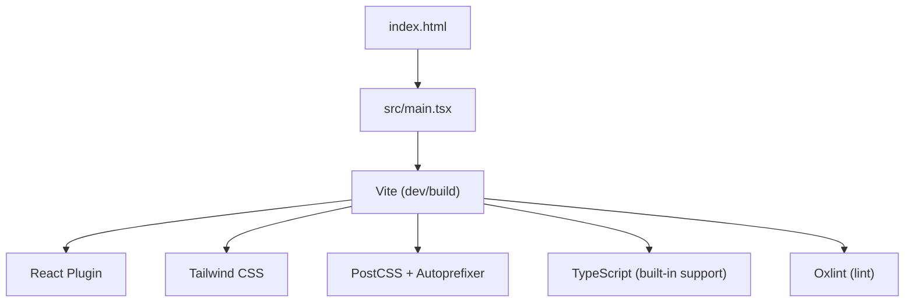
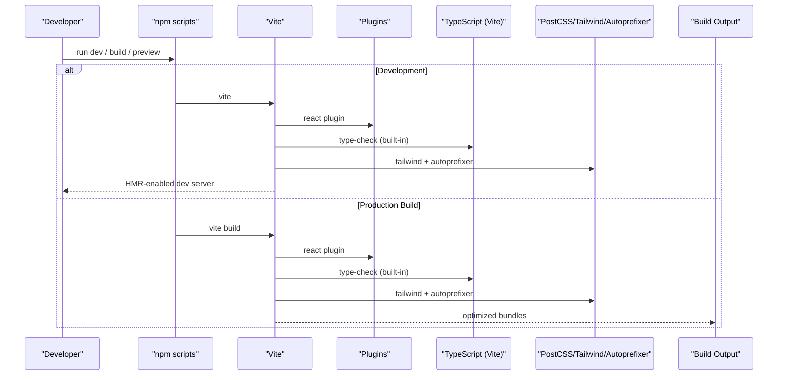
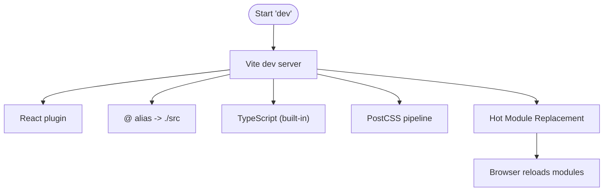
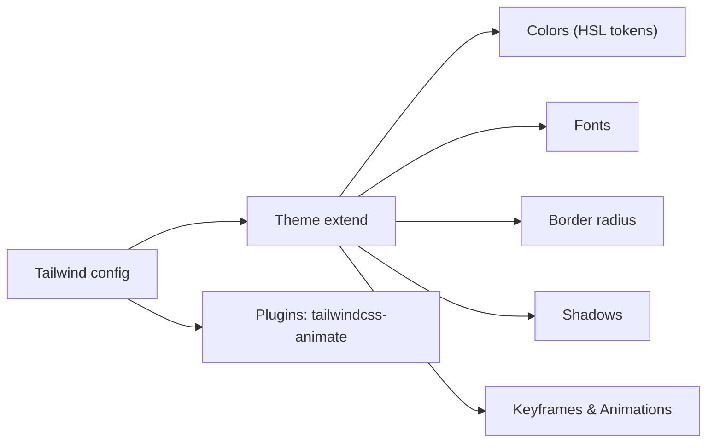
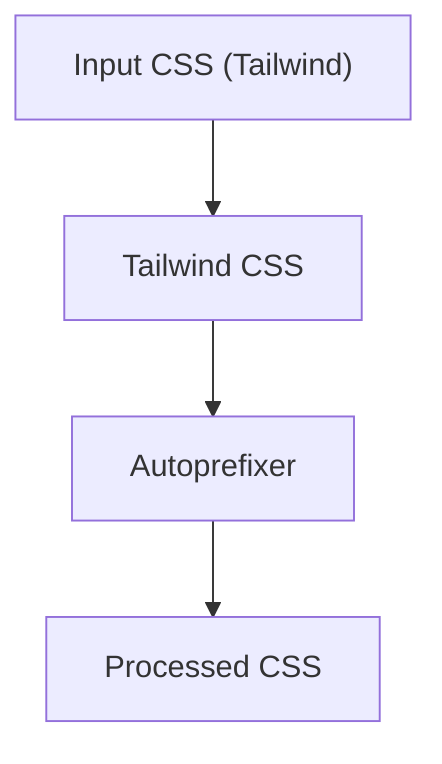
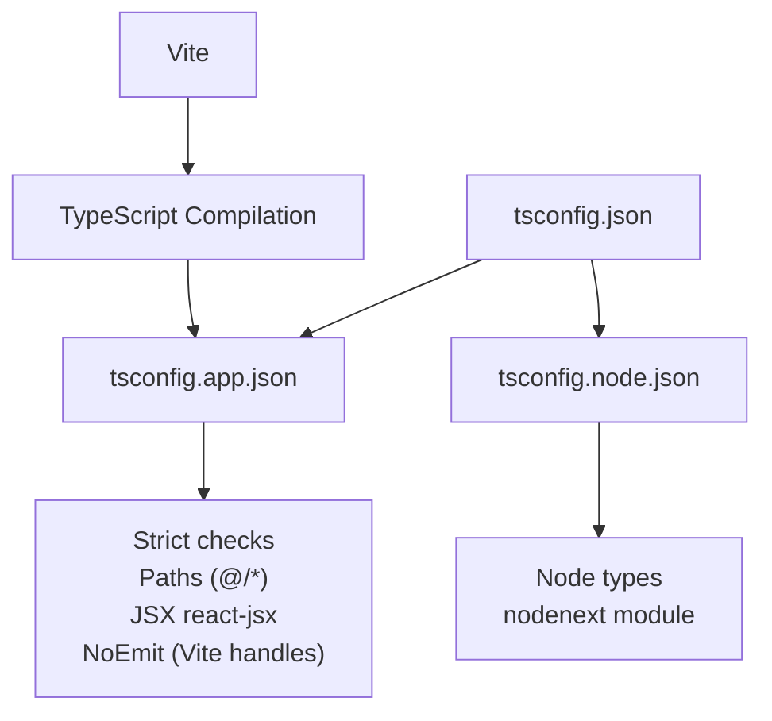
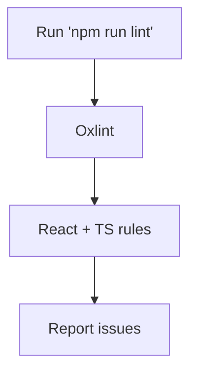
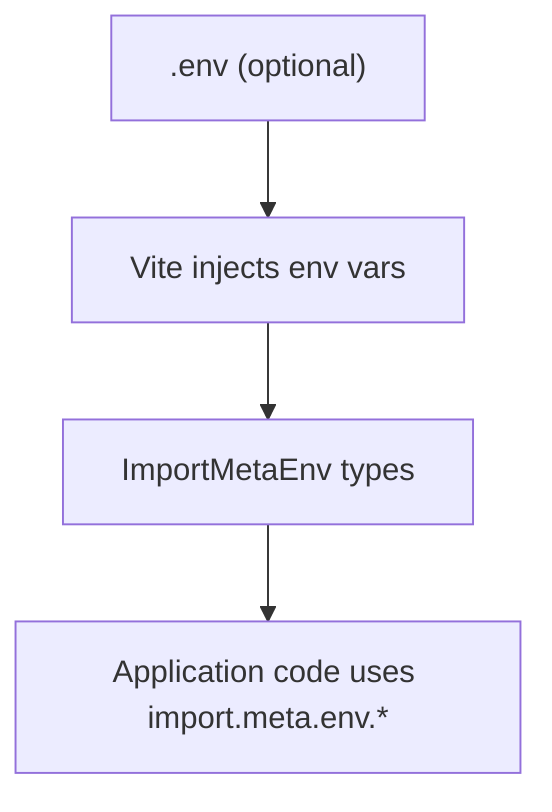
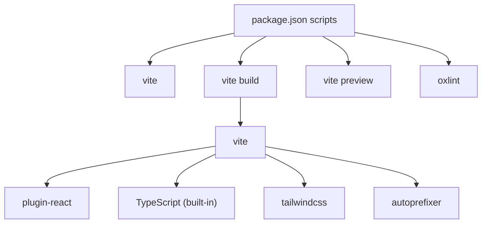

# Configuration & Build System

<cite>
**Referenced Files in This Document**
- [vite.config.ts](file://freshroute/vite.config.ts)
- [tailwind.config.ts](file://freshroute/tailwind.config.ts)
- [postcss.config.js](file://freshroute/postcss.config.js)
- [tsconfig.json](file://freshroute/tsconfig.json)
- [tsconfig.app.json](file://freshroute/tsconfig.app.json)
- [tsconfig.node.json](file://freshroute/tsconfig.node.json)
- [.oxlintrc.json](file://freshroute/.oxlintrc.json)
- [package.json](file://freshroute/package.json)
- [index.html](file://freshroute/index.html)
- [src/main.tsx](file://freshroute/src/main.tsx)
- [src/vite-env.d.ts](file://freshroute/src/vite-env.d.ts)
</cite>

## Update Summary
**Changes Made**
- Updated build process documentation to reflect simplified TypeScript handling
- Removed references to separate `tsc -b` compilation step
- Updated diagrams and flowcharts to show Vite's integrated TypeScript support
- Revised performance considerations for the streamlined build pipeline

## Table of Contents
1. [Introduction](#introduction)
2. [Project Structure](#project-structure)
3. [Core Components](#core-components)
4. [Architecture Overview](#architecture-overview)
5. [Detailed Component Analysis](#detailed-component-analysis)
6. [Dependency Analysis](#dependency-analysis)
7. [Performance Considerations](#performance-considerations)
8. [Troubleshooting Guide](#troubleshooting-guide)
9. [Conclusion](#conclusion)
10. [Appendices](#appendices)

## Introduction
This document explains FreshRoute's build system and configuration setup with a focus on Vite, Tailwind CSS, PostCSS, TypeScript, and Oxlint. It covers development server behavior, build optimizations, plugin configurations, environment variable handling, theme customization, responsive breakpoints, custom utilities, CSS processing pipeline, strict TypeScript settings, path mappings, code quality enforcement, and guidance for extending the build process and optimizing production builds.

**Updated** The build process now relies solely on Vite's built-in TypeScript support, eliminating the need for a separate TypeScript compilation step.

## Project Structure
FreshRoute is a Vite + React application using Tailwind CSS and PostCSS for styling, TypeScript for type safety, and Oxlint for fast linting. The build scripts are defined in package.json and orchestrated by Vite. The HTML entrypoint loads the React app from src/main.tsx.

**Diagram sources**
- [package.json:6-10](file://freshroute/package.json#L6-L10)
- [vite.config.ts:1-12](file://freshroute/vite.config.ts#L1-L12)
- [postcss.config.js:1-7](file://freshroute/postcss.config.js#L1-L7)
- [tsconfig.json:1-8](file://freshroute/tsconfig.json#L1-L8)
- [index.html:20-23](file://freshroute/index.html#L20-L23)
- [src/main.tsx:1-11](file://freshroute/src/main.tsx#L1-L11)

**Section sources**
- [package.json:6-10](file://freshroute/package.json#L6-L10)
- [index.html:20-23](file://freshroute/index.html#L20-L23)
- [src/main.tsx:1-11](file://freshroute/src/main.tsx#L1-L11)

## Core Components
- Vite configuration: minimal setup with React plugin and an alias for the source directory.
- Tailwind CSS: theme extension, color tokens, animations, and content scanning.
- PostCSS: Tailwind and Autoprefixer pipeline.
- TypeScript: project references, modern targets, strict checks, and path aliases handled by Vite.
- Oxlint: React and TypeScript rules for code quality.
- Environment variables: typed client-side env via ImportMetaEnv.

**Section sources**
- [vite.config.ts:1-12](file://freshroute/vite.config.ts#L1-L12)
- [tailwind.config.ts:1-138](file://freshroute/tailwind.config.ts#L1-L138)
- [postcss.config.js:1-7](file://freshroute/postcss.config.js#L1-L7)
- [tsconfig.json:1-8](file://freshroute/tsconfig.json#L1-L8)
- [tsconfig.app.json:1-35](file://freshroute/tsconfig.app.json#L1-L35)
- [tsconfig.node.json:1-24](file://freshroute/tsconfig.node.json#L1-L24)
- [.oxlintrc.json:1-9](file://freshroute/.oxlintrc.json#L1-L9)
- [src/vite-env.d.ts:1-11](file://freshroute/src/vite-env.d.ts#L1-L11)

## Architecture Overview
The build pipeline integrates multiple tools to provide a fast developer experience and optimized production output. **Updated** The TypeScript compilation is now handled directly by Vite, simplifying the build process.

**Diagram sources**
- [package.json:6-10](file://freshroute/package.json#L6-L10)
- [vite.config.ts:1-12](file://freshroute/vite.config.ts#L1-L12)
- [postcss.config.js:1-7](file://freshroute/postcss.config.js#L1-L7)
- [tsconfig.json:1-8](file://freshroute/tsconfig.json#L1-L8)

## Detailed Component Analysis

### Vite Configuration and Development Server
- Plugins: React plugin is enabled for JSX/TSX support and React-specific optimizations.
- Path alias: @ maps to the src directory for cleaner imports.
- Entry point: index.html loads src/main.tsx which mounts the React app into #root.
- Scripts:
  - dev: starts the Vite dev server with hot module replacement.
  - build: runs Vite build with integrated TypeScript support.
  - preview: serves the built assets locally.

**Updated** The build command now uses `vite build` directly, leveraging Vite's built-in TypeScript compilation capabilities.

**Diagram sources**
- [vite.config.ts:1-12](file://freshroute/vite.config.ts#L1-L12)
- [package.json:6-10](file://freshroute/package.json#L6-L10)
- [index.html:20-23](file://freshroute/index.html#L20-L23)

**Section sources**
- [vite.config.ts:1-12](file://freshroute/vite.config.ts#L1-L12)
- [package.json:6-10](file://freshroute/package.json#L6-L10)
- [index.html:20-23](file://freshroute/index.html#L20-L23)
- [src/main.tsx:1-11](file://freshroute/src/main.tsx#L1-L11)

### Tailwind CSS Customization
- Dark mode: class-based dark mode toggle.
- Content scanning: scans index.html and all TS/TSX files under src for class usage.
- Theme extensions:
  - Fonts: sans and urdu font families.
  - Colors: design tokens using CSS variables for border, input, ring, background, foreground, primary, secondary, muted, accent, popover, card, good, warn, risk, bubble user, tick. Primary includes a full scale palette.
  - Border radius: tokens including bubble shape.
  - Shadows: reusable shadows for cards, hover states, glow, ticker, and sheet.
  - Animations and keyframes: message entrance, fade-up, typing, marquee, pulse-dot, shimmer, bar-grow, pop-in.
- Plugins: tailwindcss-animate is included for animation utilities.

**Diagram sources**
- [tailwind.config.ts:1-138](file://freshroute/tailwind.config.ts#L1-L138)

**Section sources**
- [tailwind.config.ts:1-138](file://freshroute/tailwind.config.ts#L1-L138)

### PostCSS Processing Pipeline
- Tailwind CSS processes utility classes and theme tokens.
- Autoprefixer adds vendor prefixes based on target browsers.
- Integrated with Vite so CSS is processed during both dev and build.

**Diagram sources**
- [postcss.config.js:1-7](file://freshroute/postcss.config.js#L1-L7)

**Section sources**
- [postcss.config.js:1-7](file://freshroute/postcss.config.js#L1-L7)

### TypeScript Configuration
- Project references: tsconfig.json aggregates app and node configs.
- App config:
  - Target: ES2023; Lib: ES2023 + DOM.
  - Module: esnext with bundler resolution.
  - JSX: react-jsx.
  - Strictness: noUnusedLocals, noUnusedParameters, noFallthroughCasesInSwitch, verbatimModuleSyntax, moduleDetection force, erasableSyntaxOnly.
  - Paths: @/* maps to ./src/*.
  - Types: includes vite/client for Vite-specific types.
  - NoEmit: true (handled by Vite).
- Node config:
  - Target: ES2023; Lib: ES2023; Types: node.
  - Module: nodenext for Node tooling.
  - Same strict flags as app config.
- **Updated** Build integration: npm build runs Vite directly, which handles TypeScript compilation internally without requiring a separate tsc step.

**Diagram sources**
- [tsconfig.json:1-8](file://freshroute/tsconfig.json#L1-L8)
- [tsconfig.app.json:1-35](file://freshroute/tsconfig.app.json#L1-L35)
- [tsconfig.node.json:1-24](file://freshroute/tsconfig.node.json#L1-L24)
- [package.json:6-10](file://freshroute/package.json#L6-L10)

**Section sources**
- [tsconfig.json:1-8](file://freshroute/tsconfig.json#L1-L8)
- [tsconfig.app.json:1-35](file://freshroute/tsconfig.app.json#L1-L35)
- [tsconfig.node.json:1-24](file://freshroute/tsconfig.node.json#L1-L24)
- [package.json:6-10](file://freshroute/package.json#L6-L10)

### Oxlint Configuration
- Plugins: react, typescript, oxc.
- Rules:
  - Enforce React hooks rules.
  - Warn on non-constant exports unless allowed.

**Diagram sources**
- [.oxlintrc.json:1-9](file://freshroute/.oxlintrc.json#L1-L9)
- [package.json:6-10](file://freshroute/package.json#L6-L10)

**Section sources**
- [.oxlintrc.json:1-9](file://freshroute/.oxlintrc.json#L1-L9)
- [package.json:6-10](file://freshroute/package.json#L6-L10)

### Environment Variables Handling
- Client-side environment variables are typed via ImportMetaEnv in src/vite-env.d.ts.
- Current typed variables include Supabase URL and anon key prefixed with VITE_.
- Access pattern: import.meta.env.VITE_SUPABASE_URL, etc.
- No .env file was found in the repository; create one at the project root if needed.

**Diagram sources**
- [src/vite-env.d.ts:1-11](file://freshroute/src/vite-env.d.ts#L1-L11)

**Section sources**
- [src/vite-env.d.ts:1-11](file://freshroute/src/vite-env.d.ts#L1-L11)

## Dependency Analysis
The following diagram shows how the build scripts orchestrate dependencies and tools. **Updated** Simplified dependency chain with Vite handling TypeScript compilation directly.

**Diagram sources**
- [package.json:6-10](file://freshroute/package.json#L6-L10)
- [vite.config.ts:1-12](file://freshroute/vite.config.ts#L1-L12)
- [postcss.config.js:1-7](file://freshroute/postcss.config.js#L1-L7)

**Section sources**
- [package.json:6-10](file://freshroute/package.json#L6-L10)
- [vite.config.ts:1-12](file://freshroute/vite.config.ts#L1-L12)
- [postcss.config.js:1-7](file://freshroute/postcss.config.js#L1-L7)

## Performance Considerations
- Development:
  - Use the default Vite dev server for fast HMR; keep plugins minimal.
  - Avoid heavy synchronous operations in components to maintain responsiveness.
- Production build:
  - **Updated** Type checking is performed directly by Vite during the build process, eliminating the separate TypeScript compilation step for improved build speed.
  - Tailwind purges unused styles automatically based on configured content paths.
  - Autoprefixer ensures compatibility without manual prefix maintenance.
- Extending the build:
  - Add new Vite plugins in vite.config.ts where appropriate.
  - Extend Tailwind theme or add custom utilities in tailwind.config.ts.
  - If adding PostCSS features beyond Tailwind and Autoprefixer, update postcss.config.js.
  - For stricter TypeScript checks, enable additional compilerOptions in tsconfig.app.json and tsconfig.node.json.
  - For advanced linting, expand .oxlintrc.json rules or integrate ESLint alongside Oxlint if needed.

## Troubleshooting Guide
- Build fails due to type errors:
  - **Updated** Run `npm run build` to see detailed diagnostics from Vite's integrated TypeScript compilation.
- Tailwind classes not applied:
  - Ensure your files are covered by the content globs in tailwind.config.ts.
  - Verify that CSS is imported in the app entry point.
- Environment variables undefined:
  - Confirm variables are prefixed with VITE_ and declared in ImportMetaEnv.
  - Restart the dev server after adding or changing .env files.
- Linting warnings/errors:
  - Review Oxlint rules in .oxlintrc.json and adjust severity or allowlist as needed.

**Section sources**
- [package.json:6-10](file://freshroute/package.json#L6-L10)
- [tailwind.config.ts:1-138](file://freshroute/tailwind.config.ts#L1-L138)
- [src/vite-env.d.ts:1-11](file://freshroute/src/vite-env.d.ts#L1-L11)
- [.oxlintrc.json:1-9](file://freshroute/.oxlintrc.json#L1-L9)

## Conclusion
FreshRoute's build system combines Vite, React, Tailwind CSS, PostCSS, TypeScript, and Oxlint to deliver a fast development experience and optimized production output. **Updated** The build process has been simplified by removing the separate TypeScript compilation step, now relying entirely on Vite's built-in TypeScript support for faster builds while maintaining strict type checking. The configuration is intentionally minimal yet extensible, allowing you to add plugins, customize themes, enforce strict type and lint rules, and manage environment variables safely. Follow the guidance above to extend the build process and optimize production builds while maintaining code quality.

## Appendices

### Quick Commands Reference
- Start development server: npm run dev
- **Updated** Type-check and build: npm run build (now uses Vite's integrated TypeScript support)
- Preview production build: npm run preview
- Lint code: npm run lint

**Section sources**
- [package.json:6-10](file://freshroute/package.json#L6-L10)