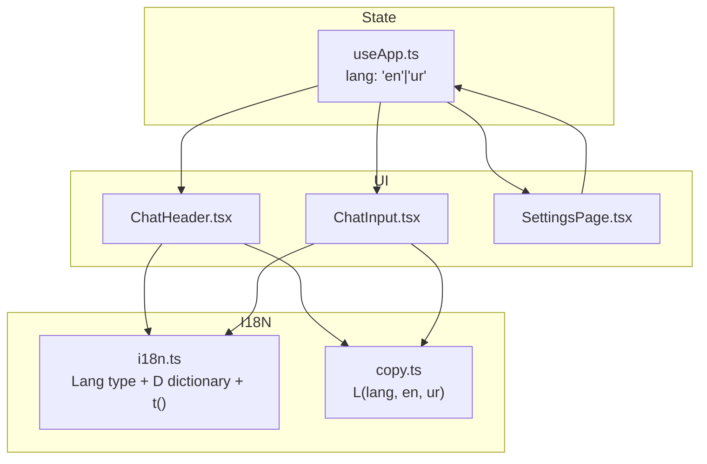
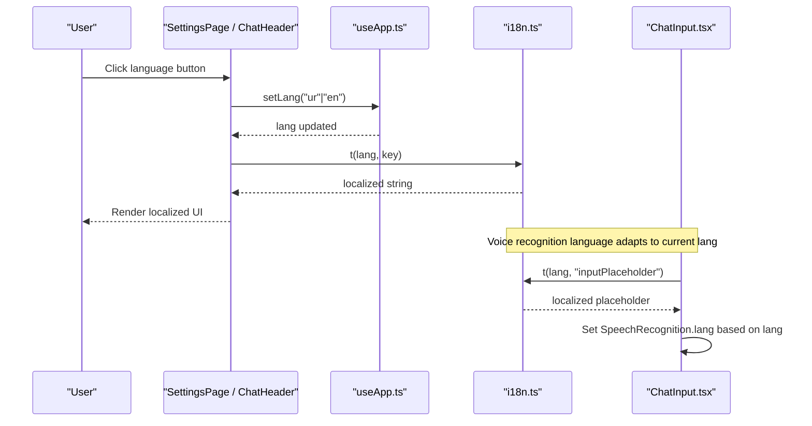
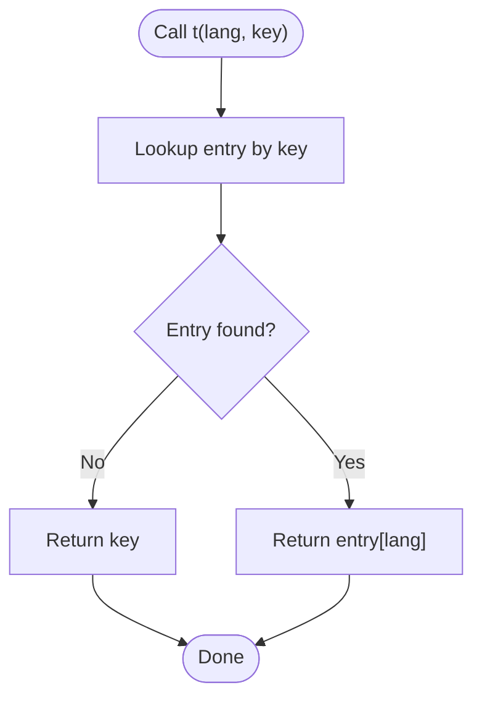
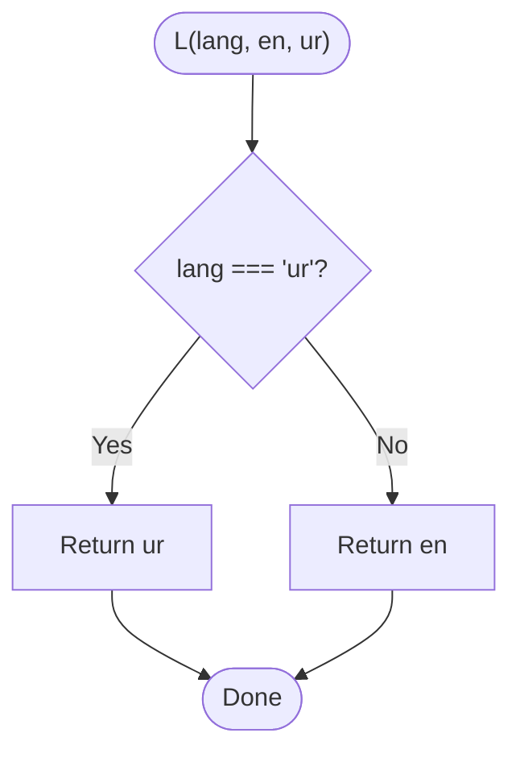
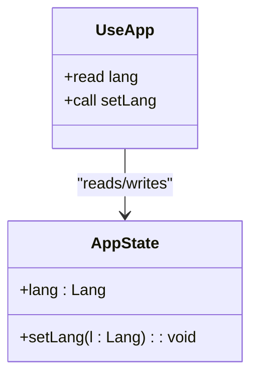
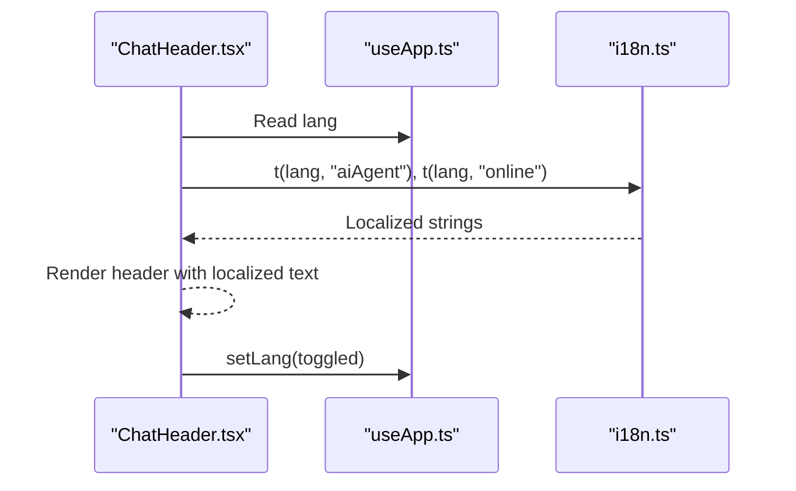
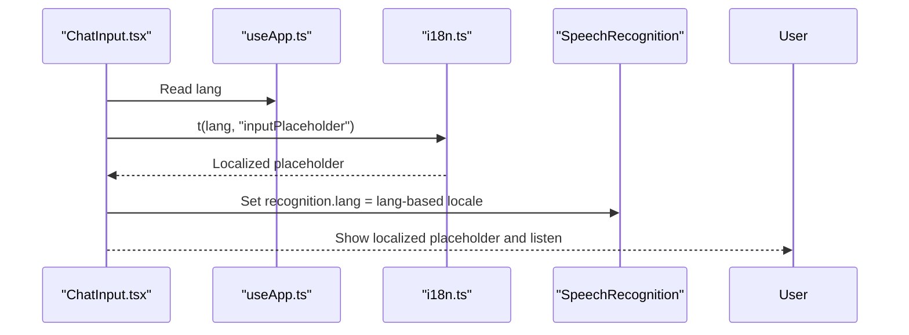
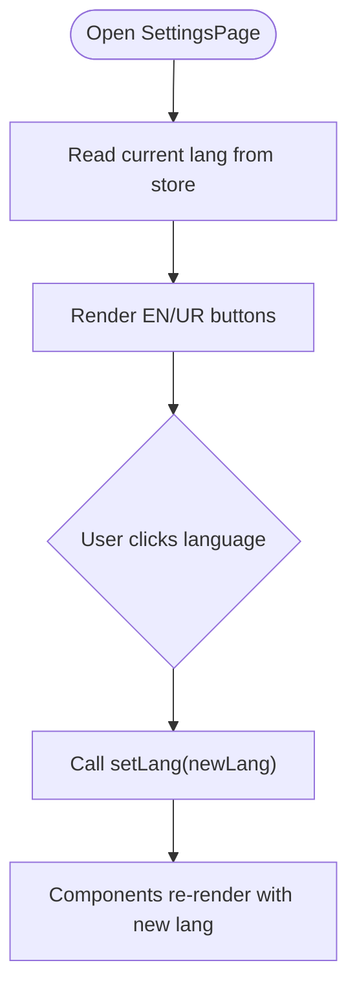
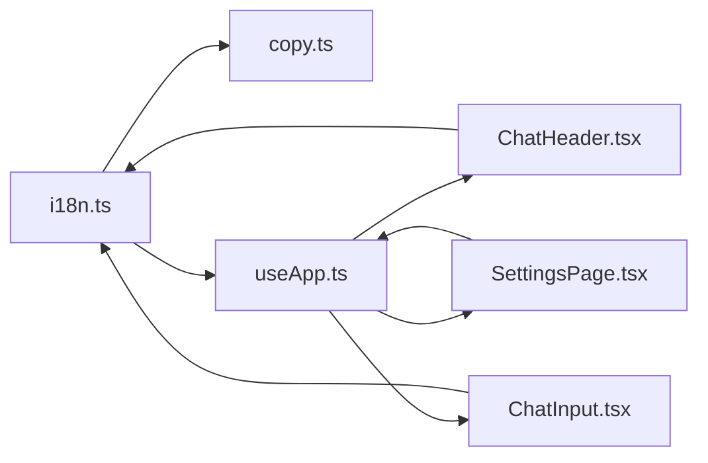

# Internationalization

<cite>
**Referenced Files in This Document**
- [i18n.ts](file://freshroute/src/i18n.ts)
- [copy.ts](file://freshroute/src/lib/copy.ts)
- [useApp.ts](file://freshroute/src/store/useApp.ts)
- [ChatHeader.tsx](file://freshroute/src/components/ChatHeader.tsx)
- [ChatInput.tsx](file://freshroute/src/components/ChatInput.tsx)
- [SettingsPage.tsx](file://freshroute/src/pages/SettingsPage.tsx)
</cite>

## Table of Contents
1. Introduction
2. Project Structure
3. Core Components
4. Architecture Overview
5. Detailed Component Analysis
6. Dependency Analysis
7. Performance Considerations
8. Troubleshooting Guide
9. Conclusion

## Introduction
This document explains the internationalization (i18n) implementation in the FreshRoute application. The app supports two languages: English and Urdu. It uses a simple, centralized dictionary with a typed language selector and exposes utilities to retrieve localized strings at runtime based on the current user language stored in the global state. UI components read the active language from the store and render localized labels, placeholders, and messages. A settings page allows users to switch languages, and voice input adapts its recognition language accordingly.

## Project Structure
The i18n system is implemented as a small, focused module that defines supported languages and a translation lookup function. Other modules import this module to localize text. Language preference is persisted in the application store and surfaced via a settings page.

**Diagram sources**
- [i18n.ts:1-49](file://freshroute/src/i18n.ts#L1-L49)
- [copy.ts:1-7](file://freshroute/src/lib/copy.ts#L1-L7)
- [useApp.ts:17-92](file://freshroute/src/store/useApp.ts#L17-L92)
- [ChatHeader.tsx:1-59](file://freshroute/src/components/ChatHeader.tsx#L1-L59)
- [ChatInput.tsx:1-199](file://freshroute/src/components/ChatInput.tsx#L1-L199)
- [SettingsPage.tsx:1-111](file://freshroute/src/pages/SettingsPage.tsx#L1-L111)

**Section sources**
- [i18n.ts:1-49](file://freshroute/src/i18n.ts#L1-L49)
- [useApp.ts:17-92](file://freshroute/src/store/useApp.ts#L17-L92)
- [ChatHeader.tsx:1-59](file://freshroute/src/components/ChatHeader.tsx#L1-L59)
- [ChatInput.tsx:1-199](file://freshroute/src/components/ChatInput.tsx#L1-L199)
- [SettingsPage.tsx:1-111](file://freshroute/src/pages/SettingsPage.tsx#L1-L111)

## Core Components
- Language model and dictionary: Defines the supported languages and provides a typed translation function that returns the appropriate string for the given key and language. If a key is missing, it falls back to returning the key itself.
- Scripted dialogue helper: Provides a convenience function to choose between English and Urdu variants for dynamic or scripted messages where interpolation is handled outside the i18n layer.
- Global state integration: The application store holds the current language and exposes a setter used by UI controls to change the language.
- UI integration points:
  - Chat header displays localized status text and offers a quick language toggle.
  - Chat input localizes placeholder text and sets the speech recognition language based on the current locale.
  - Settings page renders language selection buttons bound to the store’s language setter.

**Section sources**
- [i18n.ts:1-49](file://freshroute/src/i18n.ts#L1-L49)
- [copy.ts:1-7](file://freshroute/src/lib/copy.ts#L1-L7)
- [useApp.ts:17-92](file://freshroute/src/store/useApp.ts#L17-L92)
- [ChatHeader.tsx:1-59](file://freshroute/src/components/ChatHeader.tsx#L1-L59)
- [ChatInput.tsx:1-199](file://freshroute/src/components/ChatInput.tsx#L1-L199)
- [SettingsPage.tsx:1-111](file://freshroute/src/pages/SettingsPage.tsx#L1-L111)

## Architecture Overview
The i18n architecture follows a unidirectional data flow:
- The store maintains the current language.
- UI components read the language from the store and call the translation function to get localized strings.
- Users can change the language via UI controls, which update the store and trigger re-renders with new localized content.

**Diagram sources**
- [useApp.ts:17-92](file://freshroute/src/store/useApp.ts#L17-L92)
- [i18n.ts:1-49](file://freshroute/src/i18n.ts#L1-L49)
- [ChatHeader.tsx:1-59](file://freshroute/src/components/ChatHeader.tsx#L1-L59)
- [ChatInput.tsx:1-199](file://freshroute/src/components/ChatInput.tsx#L1-L199)
- [SettingsPage.tsx:1-111](file://freshroute/src/pages/SettingsPage.tsx#L1-L111)

## Detailed Component Analysis

### Translation Dictionary and API
- Language type: A union type enumerates supported locales.
- Dictionary: A record mapping keys to bilingual entries.
- Lookup function: Returns the localized string for the provided language; if a key is missing, it returns the key itself to avoid blank UI.

**Diagram sources**
- [i18n.ts:1-49](file://freshroute/src/i18n.ts#L1-L49)

**Section sources**
- [i18n.ts:1-49](file://freshroute/src/i18n.ts#L1-L49)

### Scripted Dialogue Helper
- Purpose: Choose between English and Urdu variants for dynamic messages where values are interpolated elsewhere.
- Behavior: Returns the Urdu variant when the language is Urdu; otherwise returns the English variant.

**Diagram sources**
- [copy.ts:1-7](file://freshroute/src/lib/copy.ts#L1-L7)

**Section sources**
- [copy.ts:1-7](file://freshroute/src/lib/copy.ts#L1-L7)

### Store Integration (Language State)
- Holds the current language and exposes a setter.
- Components subscribe to the language value and react to changes.

**Diagram sources**
- [useApp.ts:17-92](file://freshroute/src/store/useApp.ts#L17-L92)

**Section sources**
- [useApp.ts:17-92](file://freshroute/src/store/useApp.ts#L17-L92)

### Chat Header Localization
- Displays localized agent status and online indicator using the translation function.
- Provides a quick toggle button to switch between English and Urdu.

**Diagram sources**
- [ChatHeader.tsx:1-59](file://freshroute/src/components/ChatHeader.tsx#L1-L59)
- [useApp.ts:17-92](file://freshroute/src/store/useApp.ts#L17-L92)
- [i18n.ts:1-49](file://freshroute/src/i18n.ts#L1-L49)

**Section sources**
- [ChatHeader.tsx:1-59](file://freshroute/src/components/ChatHeader.tsx#L1-L59)

### Chat Input Localization and Voice Recognition
- Localizes the input placeholder using the translation function.
- Adapts the Web Speech API recognition language based on the current app language.

**Diagram sources**
- [ChatInput.tsx:1-199](file://freshroute/src/components/ChatInput.tsx#L1-L199)
- [useApp.ts:17-92](file://freshroute/src/store/useApp.ts#L17-L92)
- [i18n.ts:1-49](file://freshroute/src/i18n.ts#L1-L49)

**Section sources**
- [ChatInput.tsx:1-199](file://freshroute/src/components/ChatInput.tsx#L1-L199)

### Settings Page Language Switcher
- Renders language options and binds them to the store’s language setter.
- Allows users to explicitly select their preferred language.

**Diagram sources**
- [SettingsPage.tsx:1-111](file://freshroute/src/pages/SettingsPage.tsx#L1-L111)
- [useApp.ts:17-92](file://freshroute/src/store/useApp.ts#L17-L92)

**Section sources**
- [SettingsPage.tsx:1-111](file://freshroute/src/pages/SettingsPage.tsx#L1-L111)

## Dependency Analysis
- i18n.ts is a leaf module with no internal dependencies beyond TypeScript types.
- copy.ts depends on the Lang type from i18n.ts.
- useApp.ts imports the Lang type to type the language field and setter.
- UI components depend on both the store (for lang) and i18n.ts (for translations).

**Diagram sources**
- [i18n.ts:1-49](file://freshroute/src/i18n.ts#L1-L49)
- [copy.ts:1-7](file://freshroute/src/lib/copy.ts#L1-L7)
- [useApp.ts:17-92](file://freshroute/src/store/useApp.ts#L17-L92)
- [ChatHeader.tsx:1-59](file://freshroute/src/components/ChatHeader.tsx#L1-L59)
- [ChatInput.tsx:1-199](file://freshroute/src/components/ChatInput.tsx#L1-L199)
- [SettingsPage.tsx:1-111](file://freshroute/src/pages/SettingsPage.tsx#L1-L111)

**Section sources**
- [i18n.ts:1-49](file://freshroute/src/i18n.ts#L1-L49)
- [copy.ts:1-7](file://freshroute/src/lib/copy.ts#L1-L7)
- [useApp.ts:17-92](file://freshroute/src/store/useApp.ts#L17-L92)
- [ChatHeader.tsx:1-59](file://freshroute/src/components/ChatHeader.tsx#L1-L59)
- [ChatInput.tsx:1-199](file://freshroute/src/components/ChatInput.tsx#L1-L199)
- [SettingsPage.tsx:1-111](file://freshroute/src/pages/SettingsPage.tsx#L1-L111)

## Performance Considerations
- The translation lookup is O(1) per call and operates on a small in-memory dictionary, so performance impact is negligible.
- Avoid repeated lookups in tight loops; cache results if necessary for very large lists.
- Keep the dictionary organized and grouped by feature area to simplify maintenance and reduce bundle size growth.

## Troubleshooting Guide
- Missing translation keys: The lookup function returns the key itself when a key is not found. Search for untranslated keys in the UI by looking for raw keys rendered as text.
- Incorrect language display: Ensure the store’s lang value is updated via the setter and that components are subscribed to the store’s language field.
- Voice recognition language mismatch: Confirm that the recognition language is set based on the current app language before starting recording.

**Section sources**
- [i18n.ts:45-49](file://freshroute/src/i18n.ts#L45-L49)
- [useApp.ts:17-92](file://freshroute/src/store/useApp.ts#L17-L92)
- [ChatInput.tsx:50-56](file://freshroute/src/components/ChatInput.tsx#L50-L56)

## Conclusion
FreshRoute’s internationalization is intentionally lightweight: a typed language enum, a central dictionary, and a simple lookup function integrated with a global store. This design keeps the codebase easy to understand and extend while providing consistent localization across the UI and voice features. Adding new languages requires extending the language type, adding dictionary entries, and updating any language-specific logic such as voice recognition locales.