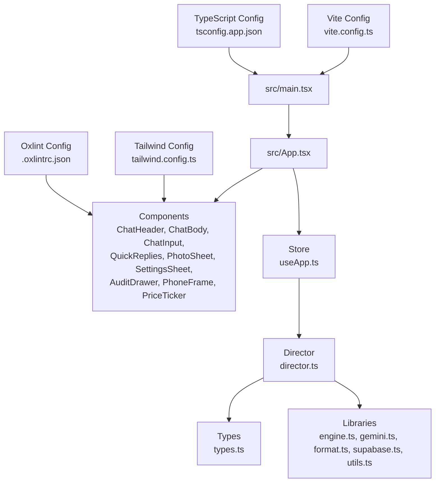
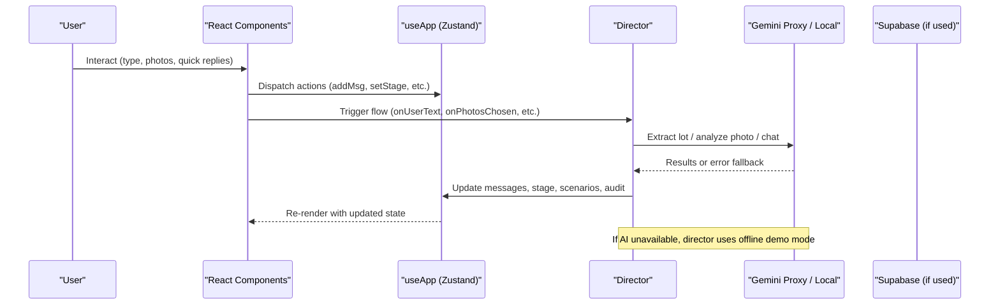
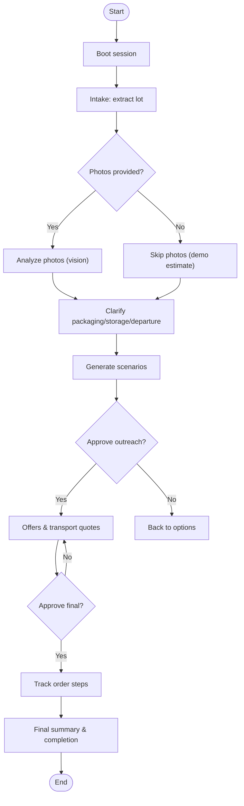
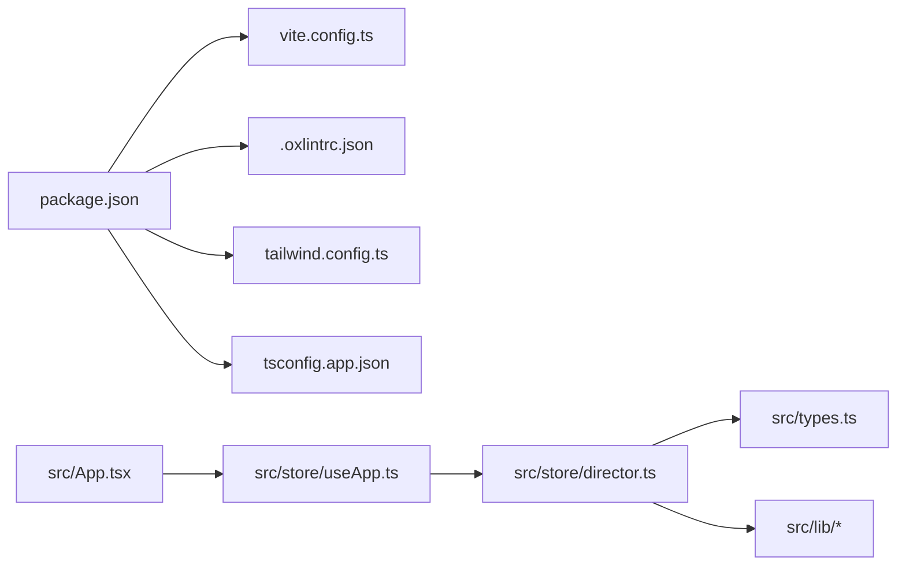

# Contributing Guide

<cite>
**Referenced Files in This Document**
- [package.json](file://freshroute/package.json)
- [.oxlintrc.json](file://freshroute/.oxlintrc.json)
- [README.md](file://freshroute/README.md)
- [tsconfig.app.json](file://freshroute/tsconfig.app.json)
- [vite.config.ts](file://freshroute/vite.config.ts)
- [tailwind.config.ts](file://freshroute/tailwind.config.ts)
- [src/App.tsx](file://freshroute/src/App.tsx)
- [src/main.tsx](file://freshroute/src/main.tsx)
- [src/types.ts](file://freshroute/src/types.ts)
- [src/store/useApp.ts](file://freshroute/src/store/useApp.ts)
- [src/store/director.ts](file://freshroute/src/store/director.ts)
- [src/components/ui/button.tsx](file://freshroute/src/components/ui/button.tsx)
- [.gitignore](file://freshroute/.gitignore)
</cite>

## Table of Contents
1. Introduction
2. Project Structure
3. Core Components
4. Architecture Overview
5. Detailed Component Analysis
6. Dependency Analysis
7. Performance Considerations
8. Troubleshooting Guide
9. Conclusion
10. Appendices

## Introduction
This guide explains how to contribute to FreshRoute: setting up your development environment, following code standards enforced by Oxlint and TypeScript conventions, using React component patterns, running the local server, writing tests (where applicable), updating documentation, and submitting changes via pull requests. It also outlines community guidelines for issues and feature requests.

## Project Structure
FreshRoute is a React + TypeScript application built with Vite. The source lives under src/, with components organized by feature and shared UI primitives under src/components/ui/. State management uses Zustand, and configuration files define build, linting, styling, and type behavior.

Key directories and files:
- src/: Application code (components, store, types, utilities)
- freshroute/package.json: Scripts, dependencies, devDependencies
- freshroute/.oxlintrc.json: Linting rules for React and TypeScript
- freshroute/tsconfig.app.json: TypeScript compiler options and path aliases
- freshroute/vite.config.ts: Vite plugin and alias configuration
- freshroute/tailwind.config.ts: Tailwind CSS theme and animations
- .gitignore: Excluded files and folders

**Diagram sources**
- [src/main.tsx:1-11](file://freshroute/src/main.tsx#L1-L11)
- [src/App.tsx:1-37](file://freshroute/src/App.tsx#L1-L37)
- [src/store/useApp.ts:1-129](file://freshroute/src/store/useApp.ts#L1-L129)
- [src/store/director.ts:1-750](file://freshroute/src/store/director.ts#L1-L750)
- [src/types.ts:1-229](file://freshroute/src/types.ts#L1-L229)
- [vite.config.ts:1-13](file://freshroute/vite.config.ts#L1-L13)
- [tailwind.config.ts:1-138](file://freshroute/tailwind.config.ts#L1-L138)
- [.oxlintrc.json:1-9](file://freshroute/.oxlintrc.json#L1-L9)
- [tsconfig.app.json:1-35](file://freshroute/tsconfig.app.json#L1-L35)

**Section sources**
- [package.json:1-38](file://freshroute/package.json#L1-L38)
- [README.md:1-33](file://freshroute/README.md#L1-L33)
- [vite.config.ts:1-13](file://freshroute/vite.config.ts#L1-L13)
- [tailwind.config.ts:1-138](file://freshroute/tailwind.config.ts#L1-L138)
- [tsconfig.app.json:1-35](file://freshroute/tsconfig.app.json#L1-L35)
- [.oxlintrc.json:1-9](file://freshroute/.oxlintrc.json#L1-L9)

## Core Components
- App shell: Mounts core UI pieces and conditionally renders sheets/drawers based on state.
- Store (Zustand): Centralized state for messages, stages, lot details, scenarios, audit log, language, UI panels, AI mode, session, and profile. Provides actions to update state and helpers to create message objects.
- Director: Orchestrates user flows from intake through scenario generation, outreach approval, offers, booking, tracking, and completion. Integrates with Gemini-based AI where available and falls back to demo data when needed.
- Types: Strongly typed domain models for profiles, lots, buyers, transporters, scenarios, orders, messages, and more.
- UI primitives: Reusable components like Button follow consistent patterns with variants and sizes.

Development workflow highlights:
- Use npm scripts defined in package.json to run dev, build, lint, and preview.
- Path aliases are configured so imports can use @/* to reference src/ paths.
- Tailwind provides design tokens and animations; ensure new styles use existing tokens or extend thoughtfully.

**Section sources**
- [src/App.tsx:1-37](file://freshroute/src/App.tsx#L1-L37)
- [src/store/useApp.ts:1-129](file://freshroute/src/store/useApp.ts#L1-L129)
- [src/store/director.ts:1-750](file://freshroute/src/store/director.ts#L1-L750)
- [src/types.ts:1-229](file://freshroute/src/types.ts#L1-L229)
- [src/components/ui/button.tsx:1-49](file://freshroute/src/components/ui/button.tsx#L1-L49)
- [vite.config.ts:1-13](file://freshroute/vite.config.ts#L1-L13)
- [tailwind.config.ts:1-138](file://freshroute/tailwind.config.ts#L1-L138)

## Architecture Overview
The app follows a unidirectional data flow:
- UI components dispatch actions to the Zustand store.
- The director coordinates multi-step workflows, calling AI services and updating the store.
- Types enforce consistency across messages, states, and domain entities.
- Vite compiles and serves the app with React support and path aliases.

**Diagram sources**
- [src/store/director.ts:86-106](file://freshroute/src/store/director.ts#L86-L106)
- [src/store/director.ts:145-156](file://freshroute/src/store/director.ts#L145-L156)
- [src/store/director.ts:175-217](file://freshroute/src/store/director.ts#L175-L217)
- [src/store/director.ts:601-625](file://freshroute/src/store/director.ts#L601-L625)
- [src/store/useApp.ts:56-118](file://freshroute/src/store/useApp.ts#L56-L118)

## Detailed Component Analysis

### Development Environment Setup
- Node.js and npm are required. Install dependencies and start the dev server using the scripts in package.json.
- Vite runs the development server with hot module replacement.
- Path alias @ resolves to src/ for cleaner imports.
- Tailwind is configured with custom theme tokens and animations.

Steps:
1. Install dependencies using the project’s package manager.
2. Start the development server with the provided script.
3. Open the local URL shown by Vite.
4. Build the production bundle using the build script.
5. Preview the production build locally using the preview script.

**Section sources**
- [package.json:6-11](file://freshroute/package.json#L6-L11)
- [vite.config.ts:5-12](file://freshroute/vite.config.ts#L5-L12)
- [tailwind.config.ts:3-6](file://freshroute/tailwind.config.ts#L3-L6)

### Code Standards and Linting (Oxlint)
- Oxlint plugins enabled: react, typescript, oxc.
- Rules enforced:
  - React hooks must follow the rules of hooks.
  - Only export components (with allowance for constant exports).
- Recommendations:
  - Enable type-aware linting for stricter checks if desired.
  - Keep components exported explicitly to satisfy only-export-components.

Run linting with the provided script before committing changes.

**Section sources**
- [.oxlintrc.json:1-9](file://freshroute/.oxlintrc.json#L1-L9)
- [README.md:14-32](file://freshroute/README.md#L14-L32)
- [package.json:9](file://freshroute/package.json#L9)

### TypeScript Conventions
- Target ES2023 with DOM lib.
- Module resolution set to bundler; strict settings include noUnusedLocals and noUnusedParameters.
- JSX transform set to react-jsx.
- Path alias @ maps to src/ for imports.
- Strict flags help catch unused variables and enforce better typing practices.

Ensure all new code adheres to these compiler options and leverages the provided types.

**Section sources**
- [tsconfig.app.json:1-35](file://freshroute/tsconfig.app.json#L1-L35)

### React Component Patterns
- Functional components with hooks.
- Reusable UI primitives use class-variance-authority for variants and sizes.
- Composition pattern: App composes smaller components (header, body, input, quick replies, sheets, drawer).
- State-driven rendering: Conditional rendering based on store state (e.g., sheet visibility).

When creating new components:
- Follow the Button pattern for variants and sizes.
- Keep components small and focused.
- Use store actions to update global state.
- Avoid inline styles; prefer Tailwind classes and theme tokens.

**Section sources**
- [src/components/ui/button.tsx:1-49](file://freshroute/src/components/ui/button.tsx#L1-L49)
- [src/App.tsx:14-33](file://freshroute/src/App.tsx#L14-L33)

### State Management and Flows (Zustand + Director)
- Store defines state shape and actions for messages, stages, lot, scenarios, audit, language, UI panels, AI mode, session, and profile.
- Director orchestrates flows:
  - Boot sequence initializes session and prompts.
  - Intake flow extracts lot info and asks for photos.
  - Vision analysis creates a lot with grade and confidence.
  - Scenario engine generates options and recommends best net outcome.
  - Outreach approval drafts messages and awaits user consent.
  - Offers flow calculates costs and presents transport options.
  - Tracking simulates pickup, transit, delivery, and final summary.

**Diagram sources**
- [src/store/director.ts:86-106](file://freshroute/src/store/director.ts#L86-L106)
- [src/store/director.ts:110-143](file://freshroute/src/store/director.ts#L110-L143)
- [src/store/director.ts:175-217](file://freshroute/src/store/director.ts#L175-L217)
- [src/store/director.ts:258-290](file://freshroute/src/store/director.ts#L258-L290)
- [src/store/director.ts:299-343](file://freshroute/src/store/director.ts#L299-L343)
- [src/store/director.ts:376-438](file://freshroute/src/store/director.ts#L376-L438)
- [src/store/director.ts:440-597](file://freshroute/src/store/director.ts#L440-L597)

**Section sources**
- [src/store/useApp.ts:20-54](file://freshroute/src/store/useApp.ts#L20-L54)
- [src/store/useApp.ts:56-118](file://freshroute/src/store/useApp.ts#L56-L118)
- [src/store/director.ts:86-106](file://freshroute/src/store/director.ts#L86-L106)
- [src/store/director.ts:145-156](file://freshroute/src/store/director.ts#L145-L156)
- [src/store/director.ts:175-217](file://freshroute/src/store/director.ts#L175-L217)
- [src/store/director.ts:258-290](file://freshroute/src/store/director.ts#L258-L290)
- [src/store/director.ts:299-343](file://freshroute/src/store/director.ts#L299-L343)
- [src/store/director.ts:376-438](file://freshroute/src/store/director.ts#L376-L438)
- [src/store/director.ts:440-597](file://freshroute/src/store/director.ts#L440-L597)

### Data Models and Types
- Domain types include Profile, Lot, Buyer, Transporter, StorageFacility, Scenario, Order, Msg, AuditEntry, Stage, QuickReply, and more.
- These types ensure consistency across components and flows.
- When adding features, extend types rather than introducing ad-hoc structures.

**Section sources**
- [src/types.ts:1-229](file://freshroute/src/types.ts#L1-L229)

### UI Primitives and Styling
- Button component demonstrates variant and size patterns using class-variance-authority.
- Tailwind config defines color tokens, fonts, radii, shadows, keyframes, and animations.
- New UI should reuse existing tokens and patterns to maintain visual consistency.

**Section sources**
- [src/components/ui/button.tsx:1-49](file://freshroute/src/components/ui/button.tsx#L1-L49)
- [tailwind.config.ts:3-138](file://freshroute/tailwind.config.ts#L3-L138)

## Dependency Analysis
- Build toolchain: Vite with React plugin.
- Linting: Oxlint with React and TypeScript plugins.
- Styling: Tailwind CSS with animate plugin.
- State: Zustand.
- Networking: Supabase client and Gemini proxy integration.
- Utilities: Format helpers, engine logic, and shared utils.

**Diagram sources**
- [package.json:12-36](file://freshroute/package.json#L12-L36)
- [vite.config.ts:1-13](file://freshroute/vite.config.ts#L1-L13)
- [.oxlintrc.json:1-9](file://freshroute/.oxlintrc.json#L1-L9)
- [tailwind.config.ts:1-138](file://freshroute/tailwind.config.ts#L1-L138)
- [tsconfig.app.json:1-35](file://freshroute/tsconfig.app.json#L1-L35)
- [src/App.tsx:1-37](file://freshroute/src/App.tsx#L1-L37)
- [src/store/useApp.ts:1-129](file://freshroute/src/store/useApp.ts#L1-L129)
- [src/store/director.ts:1-750](file://freshroute/src/store/director.ts#L1-L750)
- [src/types.ts:1-229](file://freshroute/src/types.ts#L1-L229)

**Section sources**
- [package.json:12-36](file://freshroute/package.json#L12-L36)

## Performance Considerations
- Prefer functional components and memoization where appropriate to avoid unnecessary re-renders.
- Keep store updates minimal and targeted; batch related changes when possible.
- Use Tailwind utility classes to reduce custom CSS overhead.
- Avoid heavy synchronous operations in render paths; offload to effects or background tasks.
- Leverage Vite’s fast refresh during development for quicker iteration.

[No sources needed since this section provides general guidance]

## Troubleshooting Guide
Common issues and resolutions:
- Lint errors: Run the lint script and fix violations per Oxlint rules (hooks and exports).
- TypeScript errors: Ensure types are imported and used consistently; check tsconfig options.
- Dev server not starting: Verify dependencies are installed and Node version compatibility.
- AI fallback behavior: If AI proxy fails, director surfaces an error and continues with demo data; check logs and network connectivity.

Check excluded files in .gitignore to avoid committing generated artifacts or local configs.

**Section sources**
- [.gitignore:1-25](file://freshroute/.gitignore#L1-L25)
- [src/store/director.ts:62-74](file://freshroute/src/store/director.ts#L62-L74)

## Contribution Workflow

### Branch Naming
- Use descriptive branch names that reflect the feature or fix, e.g., feature/add-photo-analysis, fix/lint-rules, chore/update-deps.

### Commit Messages
- Write clear, concise commit messages describing what changed and why.
- Reference related issues or tickets when applicable.

### Pull Requests
- Ensure the code passes linting and builds successfully.
- Include a description of changes, rationale, and any relevant screenshots or notes.
- Request reviews from maintainers or peers.
- Address review feedback promptly.

### Testing Requirements
- While no test framework is currently configured, add unit or integration tests for critical flows when feasible.
- Validate state transitions and message sequences in complex flows (e.g., intake → vision → scenarios → offers → tracking).

### Documentation Updates
- Update README or inline comments when introducing new features or changing behaviors.
- Keep configuration files (Tailwind, Oxlint, TypeScript) aligned with team standards.

### Release Processes
- Use the build script to generate production assets.
- Review changelog and version tags as per repository policy.
- Ensure environment variables and external integrations (Supabase, Gemini proxy) are correctly configured for staging and production.

[No sources needed since this section provides general guidance]

## Community Guidelines
- Be respectful and inclusive in discussions and code reviews.
- Provide constructive feedback and ask clarifying questions.
- Follow issue templates and provide reproducible steps for bugs.
- For feature requests, describe the problem, proposed solution, and potential impact.

[No sources needed since this section provides general guidance]

## Issue Reporting Procedures
- Search existing issues to avoid duplicates.
- Include environment details (Node version, OS), steps to reproduce, expected vs actual behavior, and logs if applicable.
- Label issues appropriately (bug, enhancement, question).

[No sources needed since this section provides general guidance]

## Feature Request Submission Processes
- Describe the use case and benefits.
- Propose implementation approach and any breaking changes.
- Discuss trade-offs and alternatives.

[No sources needed since this section provides general guidance]

## Conclusion
Follow the development setup, coding standards, and contribution workflow outlined here to collaborate effectively on FreshRoute. Maintain strong typing, adhere to Oxlint rules, use consistent React patterns, and keep documentation current. Engage respectfully with the community and use issues and pull requests to drive improvements.

[No sources needed since this section summarizes without analyzing specific files]

## Appendices

### Quick Commands
- Start development server
- Build production bundle
- Run linter
- Preview production build

**Section sources**
- [package.json:6-11](file://freshroute/package.json#L6-L11)