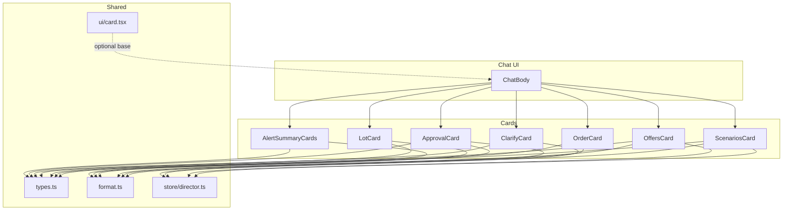
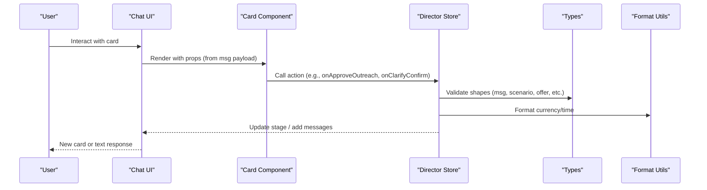
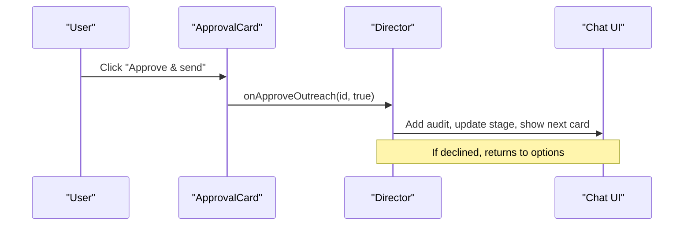
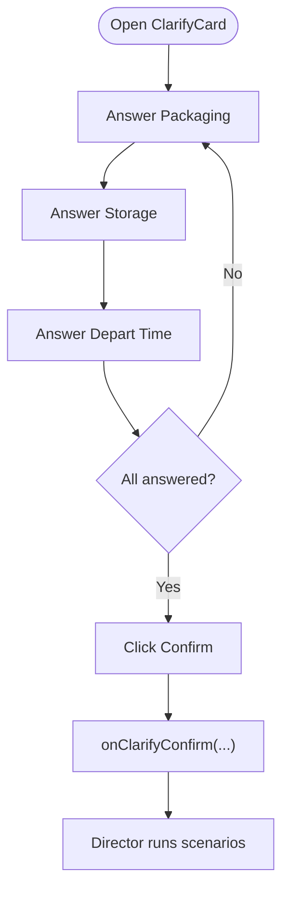
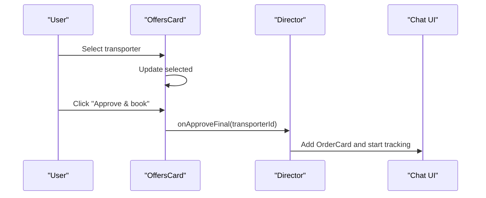
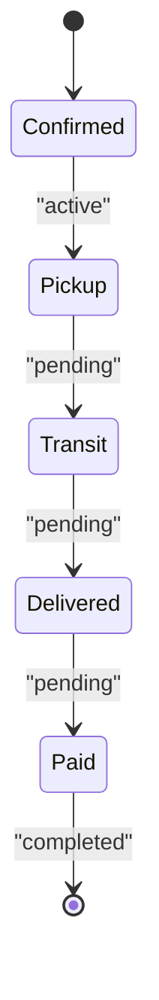
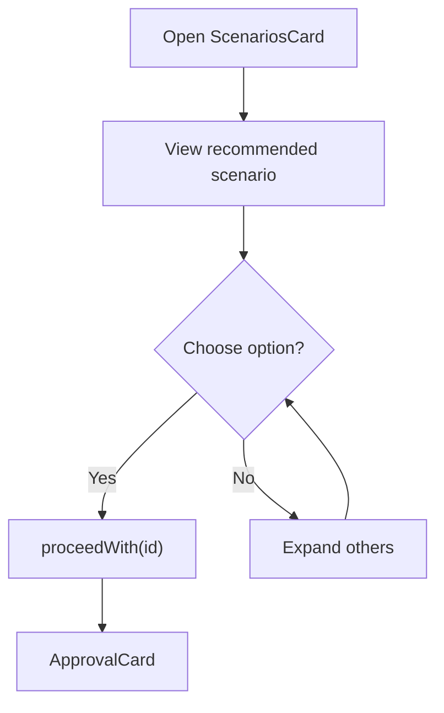
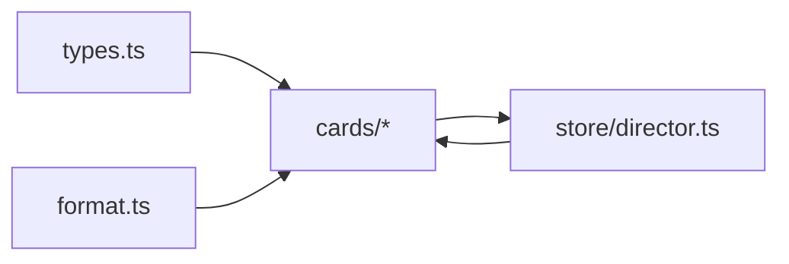

# Card Components

<cite>
**Referenced Files in This Document**
- [AlertSummaryCards.tsx](file://freshroute/src/components/cards/AlertSummaryCards.tsx)
- [ApprovalCard.tsx](file://freshroute/src/components/cards/ApprovalCard.tsx)
- [ClarifyCard.tsx](file://freshroute/src/components/cards/ClarifyCard.tsx)
- [LotCard.tsx](file://freshroute/src/components/cards/LotCard.tsx)
- [OffersCard.tsx](file://freshroute/src/components/cards/OffersCard.tsx)
- [OrderCard.tsx](file://freshroute/src/components/cards/OrderCard.tsx)
- [ScenariosCard.tsx](file://freshroute/src/components/cards/ScenariosCard.tsx)
- [types.ts](file://freshroute/src/types.ts)
- [director.ts](file://freshroute/src/store/director.ts)
- [format.ts](file://freshroute/src/lib/format.ts)
- [card.tsx](file://freshroute/src/components/ui/card.tsx)
</cite>

## Table of Contents
1. Introduction
2. Project Structure
3. Core Components
4. Architecture Overview
5. Detailed Component Analysis
6. Dependency Analysis
7. Performance Considerations
8. Troubleshooting Guide
9. Conclusion

## Introduction
This document explains FreshRoute’s card components that present structured information within the conversational chat interface. Each card is a reusable UI pattern designed to display financial summaries, approvals, clarifications, lot details, offers, orders, and market scenarios. For each component, we describe props, events, styling customization, and how it integrates with the chat flow and state management.

## Project Structure
The card components live under src/components/cards and are consumed by the chat UI. They rely on shared types, formatting utilities, and the director store for actions and state updates.

**Diagram sources**
- [AlertSummaryCards.tsx:1-61](file://freshroute/src/components/cards/AlertSummaryCards.tsx#L1-L61)
- [ApprovalCard.tsx:1-94](file://freshroute/src/components/cards/ApprovalCard.tsx#L1-L94)
- [ClarifyCard.tsx:1-110](file://freshroute/src/components/cards/ClarifyCard.tsx#L1-L110)
- [LotCard.tsx:1-116](file://freshroute/src/components/cards/LotCard.tsx#L1-L116)
- [OffersCard.tsx:1-137](file://freshroute/src/components/cards/OffersCard.tsx#L1-L137)
- [OrderCard.tsx:1-120](file://freshroute/src/components/cards/OrderCard.tsx#L1-L120)
- [ScenariosCard.tsx:1-172](file://freshroute/src/components/cards/ScenariosCard.tsx#L1-L172)
- [types.ts:1-229](file://freshroute/src/types.ts#L1-L229)
- [director.ts:1-750](file://freshroute/src/store/director.ts#L1-L750)
- [format.ts:1-21](file://freshroute/src/lib/format.ts#L1-L21)
- [card.tsx:1-47](file://freshroute/src/components/ui/card.tsx#L1-L47)

**Section sources**
- [types.ts:1-229](file://freshroute/src/types.ts#L1-L229)
- [director.ts:1-750](file://freshroute/src/store/director.ts#L1-L750)
- [format.ts:1-21](file://freshroute/src/lib/format.ts#L1-L21)
- [card.tsx:1-47](file://freshroute/src/components/ui/card.tsx#L1-L47)

## Core Components
- AlertSummaryCards: Displays alert messages and sale summary cards with net received and uplift vs local.
- ApprovalCard: Presents outreach approval requests with draft message and approve/decline actions.
- ClarifyCard: Collects quick questions about packaging, storage, and departure time to refine pricing.
- LotCard: Shows AI-estimated produce lot details including grade, quantity, location, and confidence.
- OffersCard: Compares buyer offers and transport quotes; calculates expected net and final booking.
- OrderCard: Tracks order lifecycle with timeline steps and financial summary.
- ScenariosCard: Compares multiple market scenarios, highlights recommended option, and allows selection.

Each card renders inside the chat as an agent message and triggers state changes via the director when users interact.

**Section sources**
- [AlertSummaryCards.tsx:1-61](file://freshroute/src/components/cards/AlertSummaryCards.tsx#L1-L61)
- [ApprovalCard.tsx:1-94](file://freshroute/src/components/cards/ApprovalCard.tsx#L1-L94)
- [ClarifyCard.tsx:1-110](file://freshroute/src/components/cards/ClarifyCard.tsx#L1-L110)
- [LotCard.tsx:1-116](file://freshroute/src/components/cards/LotCard.tsx#L1-L116)
- [OffersCard.tsx:1-137](file://freshroute/src/components/cards/OffersCard.tsx#L1-L137)
- [OrderCard.tsx:1-120](file://freshroute/src/components/cards/OrderCard.tsx#L1-L120)
- [ScenariosCard.tsx:1-172](file://freshroute/src/components/cards/ScenariosCard.tsx#L1-L172)

## Architecture Overview
The cards integrate tightly with the chat engine and state manager:
- Cards receive data via props typed in types.ts.
- User interactions call functions exported from director.ts (e.g., onApproveOutreach, onClarifyConfirm, onApproveFinal, proceedWith).
- Formatting helpers in format.ts render currency and timestamps consistently.
- The chat layer dispatches messages of specific kinds (lot, clarify, scenarios, approval, offers, order, alert, summary) which map to these cards.

**Diagram sources**
- [director.ts:258-343](file://freshroute/src/store/director.ts#L258-L343)
- [director.ts:345-438](file://freshroute/src/store/director.ts#L345-L438)
- [director.ts:440-597](file://freshroute/src/store/director.ts#L440-L597)
- [types.ts:187-200](file://freshroute/src/types.ts#L187-L200)
- [format.ts:1-21](file://freshroute/src/lib/format.ts#L1-L21)

## Detailed Component Analysis

### AlertSummaryCards
Purpose:
- AlertCard shows warnings or important notices with an icon, title, and body.
- SummaryCard displays post-sale summary including net received, uplift vs local, and bullet points.

Props:
- AlertCard.alert: AlertInfo (kind, title, body)
- SummaryCard.summary: SummaryInfo (title, gross, net, upliftVsLocal, upliftNote, acceptedPct, lines)

Events:
- None directly; typically rendered as part of agent messages.

Styling:
- Uses Tailwind classes for rounded containers, gradients, badges, and typography.
- Colors encode status (warn, good, primary).

Integration:
- Rendered when director adds messages with kind "alert" or "summary".
- Uses pkr formatter for currency.

Usage example in flow:
- After order completion, director emits a summary card showing final net and uplift vs local.

**Section sources**
- [AlertSummaryCards.tsx:5-19](file://freshroute/src/components/cards/AlertSummaryCards.tsx#L5-L19)
- [AlertSummaryCards.tsx:21-61](file://freshroute/src/components/cards/AlertSummaryCards.tsx#L21-L61)
- [types.ts:171-185](file://freshroute/src/types.ts#L171-L185)
- [format.ts:1-21](file://freshroute/src/lib/format.ts#L1-L21)
- [director.ts:556-597](file://freshroute/src/store/director.ts#L556-L597)

### ApprovalCard
Purpose:
- Presents outreach approval requests with a draft message and recipient info.
- Allows user to approve or decline before anything is sent.

Props:
- approval: ApprovalRequest (id, title, subtitle, actions, messageDraft, recipient, status, decidedAt)

Events:
- Approve button calls onApproveOutreach(approval.id, true)
- Decline button calls onApproveOutreach(approval.id, false)

Styling:
- Header color changes based on decision state (approved, declined, pending).
- Action list items use consistent secondary backgrounds.

Integration:
- Emitted by director during outreach preparation; after approval, director proceeds to offers flow.

Usage example in flow:
- After selecting a scenario, director builds an approval request with a WhatsApp draft and waits for user confirmation.

**Diagram sources**
- [ApprovalCard.tsx:64-85](file://freshroute/src/components/cards/ApprovalCard.tsx#L64-L85)
- [director.ts:345-374](file://freshroute/src/store/director.ts#L345-L374)

**Section sources**
- [ApprovalCard.tsx:8-89](file://freshroute/src/components/cards/ApprovalCard.tsx#L8-L89)
- [types.ts:114-128](file://freshroute/src/types.ts#L114-L128)
- [director.ts:299-343](file://freshroute/src/store/director.ts#L299-L343)
- [director.ts:345-374](file://freshroute/src/store/director.ts#L345-L374)

### ClarifyCard
Purpose:
- Gathers critical details affecting price: packaging type, overnight storage availability, and early departure feasibility.

Props:
- None (internal state holds answers).

Events:
- Selecting options updates internal answers.
- Confirm button calls onClarifyConfirm(packaging, storageAvailable, departEarly).

Styling:
- Option buttons toggle selected state with primary colors and glow effects.
- Disabled confirm until all questions answered.

Integration:
- Triggered after lot intake/photos; after confirmation, director runs scenario engine and presents ScenariosCard.

Usage example in flow:
- After photos are analyzed, director asks quick questions; once confirmed, it generates scenarios and recommends the best option.

**Diagram sources**
- [ClarifyCard.tsx:46-109](file://freshroute/src/components/cards/ClarifyCard.tsx#L46-L109)
- [director.ts:258-290](file://freshroute/src/store/director.ts#L258-L290)

**Section sources**
- [ClarifyCard.tsx:1-110](file://freshroute/src/components/cards/ClarifyCard.tsx#L1-L110)
- [types.ts:15-16](file://freshroute/src/types.ts#L15-L16)
- [director.ts:258-290](file://freshroute/src/store/director.ts#L258-L290)

### LotCard
Purpose:
- Displays AI-estimated lot details: crop, quantity, location, ready date, packaging, estimated value, quality grade, notes, and confidence.

Props:
- lot: Lot (crop, quantityKg, location, readyDate, packaging, storageAvailable, departEarly, photos, vision, confidence)

Events:
- None directly; informational card.

Styling:
- Grid layout for fields, photo strip, quality estimate section with grade badge and confidence bar.

Integration:
- Rendered when director emits a message with kind "lot" after photo analysis or skip.

Usage example in flow:
- After intake and photo processing, director creates a Lot object and posts LotCard to chat.

**Section sources**
- [LotCard.tsx:6-33](file://freshroute/src/components/cards/LotCard.tsx#L6-L33)
- [LotCard.tsx:35-116](file://freshroute/src/components/cards/LotCard.tsx#L35-L116)
- [types.ts:18-45](file://freshroute/src/types.ts#L18-L45)
- [director.ts:175-217](file://freshroute/src/store/director.ts#L175-L217)
- [director.ts:219-254](file://freshroute/src/store/director.ts#L219-L254)

### OffersCard
Purpose:
- Compares buyer offer and transport quotes; computes expected net; enables final booking approval.

Props:
- offers: OfferSet (buyerName, buyerLine, acceptedPricePerKg, acceptedKg, transport[], expectedNet, netNote, buyerAcceptance, buyerResponse)

Events:
- Select transport option updates selection.
- Final approval button calls onApproveFinal(selectedTransporterId).

Styling:
- Buyer block with acceptance badge and response time.
- Transport options with radio-like selection and recommended tag.
- Net summary panel with calculation note.

Integration:
- Emitted by director after outreach approval; after final approval, director creates OrderCard and begins tracking.

Usage example in flow:
- Director constructs OfferSet with transporter quotes and expected net; user selects transport and approves booking.

**Diagram sources**
- [OffersCard.tsx:8-137](file://freshroute/src/components/cards/OffersCard.tsx#L8-L137)
- [director.ts:376-438](file://freshroute/src/store/director.ts#L376-L438)
- [director.ts:440-497](file://freshroute/src/store/director.ts#L440-L497)

**Section sources**
- [OffersCard.tsx:1-137](file://freshroute/src/components/cards/OffersCard.tsx#L1-L137)
- [types.ts:130-149](file://freshroute/src/types.ts#L130-L149)
- [director.ts:376-438](file://freshroute/src/store/director.ts#L376-L438)
- [director.ts:440-497](file://freshroute/src/store/director.ts#L440-L497)

### OrderCard
Purpose:
- Tracks order lifecycle with step-by-step timeline and financial summary.

Props:
- order: Order (id, buyerName, transporterName, vehicle, destination, quantityKg, pricePerKg, gross, net, steps[])

Events:
- None directly; timeline updates via director scheduling.

Styling:
- Header indicates completed or live status.
- Timeline uses icons per step state (done, active, alert, pending).
- Summary panel shows agreed gross and net to seller.

Integration:
- Emitted by director after final approval; director schedules step updates and alerts.

Usage example in flow:
- After booking, director posts OrderCard and simulates pickup, transit, delivery, and payment milestones.

**Diagram sources**
- [OrderCard.tsx:6-30](file://freshroute/src/components/cards/OrderCard.tsx#L6-L30)
- [OrderCard.tsx:32-120](file://freshroute/src/components/cards/OrderCard.tsx#L32-L120)
- [director.ts:459-554](file://freshroute/src/store/director.ts#L459-L554)

**Section sources**
- [OrderCard.tsx:1-120](file://freshroute/src/components/cards/OrderCard.tsx#L1-L120)
- [types.ts:151-169](file://freshroute/src/types.ts#L151-L169)
- [director.ts:459-554](file://freshroute/src/store/director.ts#L459-L554)

### ScenariosCard
Purpose:
- Compares multiple market scenarios, highlights recommended option, and allows user to choose another.

Props:
- scenarios: Scenario[] (id, title, market, destCity, buyerName?, gross, acceptedKg, deductions, net, spoilagePct, risk, paymentTerms, why[], recommended, score)
- recommendedId: string (id of recommended scenario)

Events:
- Choose option calls proceedWith(scenarioId) to move to outreach approval.

Styling:
- Recommended card with award badge and uplift vs local.
- Expandable rows for other scenarios with chips for spoilage, risk, payment terms.
- Net bars visualize relative net values.

Integration:
- Emitted by director after clarify confirmation; user can select recommendation or alternative.

Usage example in flow:
- Director builds scenarios using engine and posts ScenariosCard; user chooses option to proceed.

**Diagram sources**
- [ScenariosCard.tsx:8-34](file://freshroute/src/components/cards/ScenariosCard.tsx#L8-L34)
- [ScenariosCard.tsx:36-87](file://freshroute/src/components/cards/ScenariosCard.tsx#L36-L87)
- [ScenariosCard.tsx:89-172](file://freshroute/src/components/cards/ScenariosCard.tsx#L89-L172)
- [director.ts:258-290](file://freshroute/src/store/director.ts#L258-L290)
- [director.ts:299-343](file://freshroute/src/store/director.ts#L299-L343)

**Section sources**
- [ScenariosCard.tsx:1-172](file://freshroute/src/components/cards/ScenariosCard.tsx#L1-L172)
- [types.ts:89-112](file://freshroute/src/types.ts#L89-L112)
- [director.ts:258-290](file://freshroute/src/store/director.ts#L258-L290)
- [director.ts:299-343](file://freshroute/src/store/director.ts#L299-L343)

## Dependency Analysis
- Shared types define the contracts between cards and director: Lot, Scenario, OfferSet, Order, ApprovalRequest, AlertInfo, SummaryInfo.
- Formatting utilities standardize currency and time across cards.
- Director orchestrates flows: intake → photos → clarify → scenarios → approval → offers → order → summary.
- Optional base card primitives exist in ui/card.tsx but custom cards primarily use inline Tailwind styles.

**Diagram sources**
- [types.ts:1-229](file://freshroute/src/types.ts#L1-229)
- [format.ts:1-21](file://freshroute/src/lib/format.ts#L1-21)
- [director.ts:1-750](file://freshroute/src/store/director.ts#L1-750)

**Section sources**
- [types.ts:1-229](file://freshroute/src/types.ts#L1-229)
- [format.ts:1-21](file://freshroute/src/lib/format.ts#L1-21)
- [director.ts:1-750](file://freshroute/src/store/director.ts#L1-750)

## Performance Considerations
- Keep card payloads minimal; avoid large image arrays in props unless necessary.
- Use lazy loading for images in LotCard to reduce initial render cost.
- Prefer memoization for expensive computations if cards are re-rendered frequently.
- Avoid heavy synchronous operations in event handlers; delegate to async director functions.

[No sources needed since this section provides general guidance]

## Troubleshooting Guide
Common issues and resolutions:
- Approval not proceeding: Ensure approval status is "pending" before calling onApproveOutreach; check that approval id matches existing message.
- Offers not booking: Verify selected transporter exists in offers.transport; ensure onApproveFinal receives correct transporter id.
- Scenarios not updating: Confirm recommendedId corresponds to an existing scenario id; verify proceedWith is called with valid id.
- Order timeline stuck: Check director scheduling functions and guard conditions; ensure stage remains "tracking".

**Section sources**
- [director.ts:345-374](file://freshroute/src/store/director.ts#L345-L374)
- [director.ts:440-497](file://freshroute/src/store/director.ts#L440-L497)
- [director.ts:499-597](file://freshroute/src/store/director.ts#L499-L597)

## Conclusion
FreshRoute’s card components provide a cohesive, reusable set of UI patterns for presenting structured information within the chat interface. Each card encapsulates its own interaction model while integrating seamlessly with the director-driven workflow. By adhering to shared types and formatting utilities, the system maintains consistency and reliability across financial summaries, approvals, clarifications, lot details, offers, orders, and market scenarios.

[No sources needed since this section summarizes without analyzing specific files]