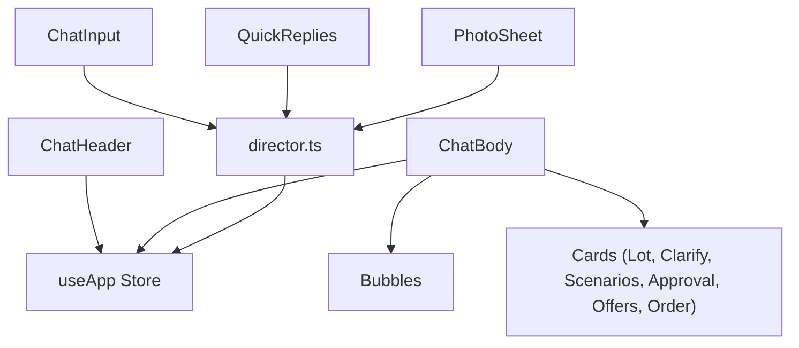
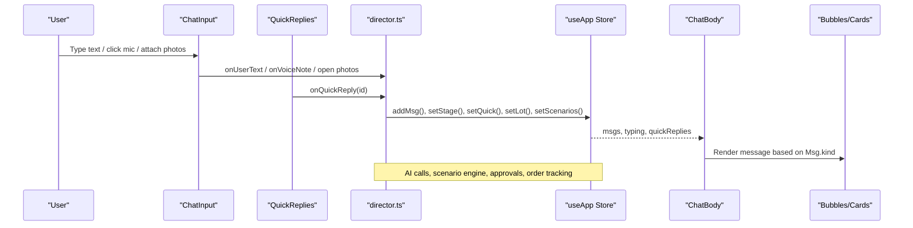
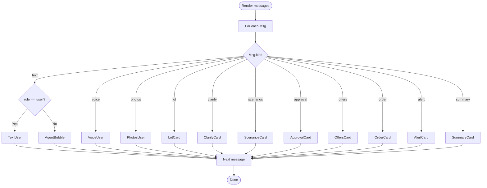
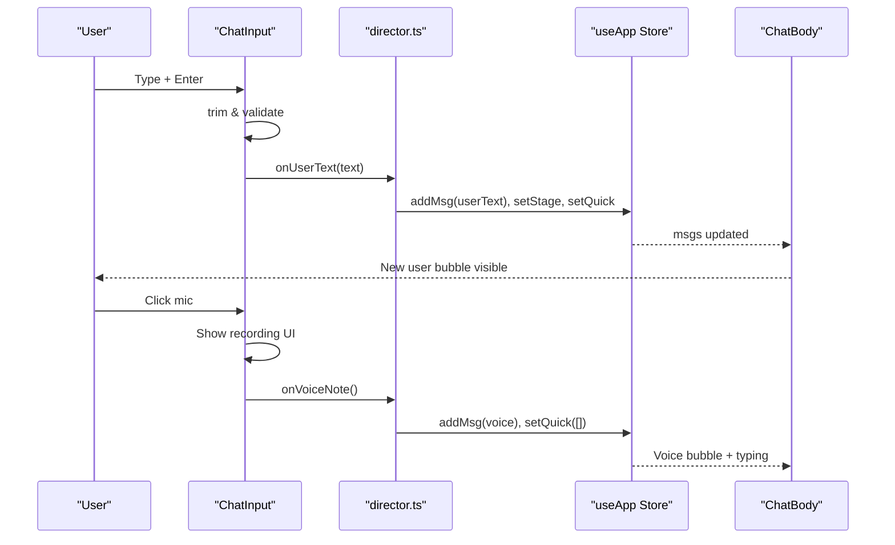
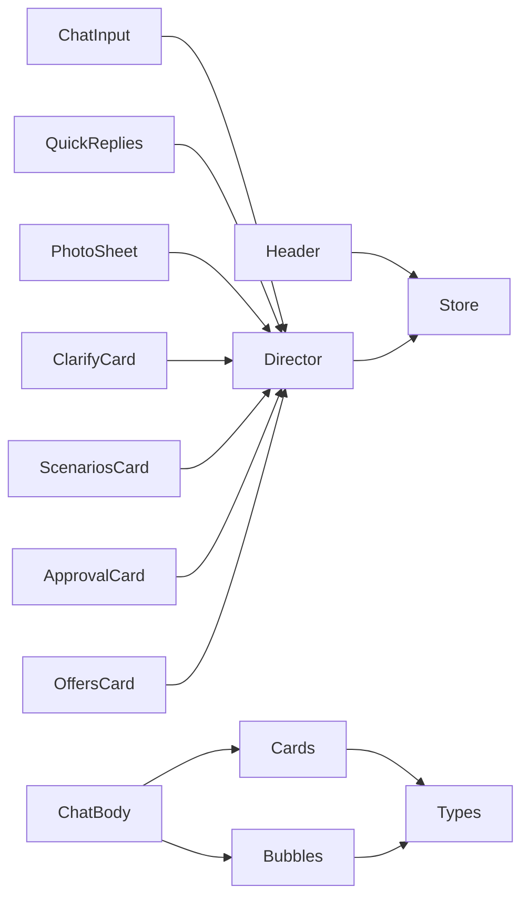

# Chat Interface Components

<cite>
**Referenced Files in This Document**
- [ChatBody.tsx](file://src/components/ChatBody.tsx)
- [ChatInput.tsx](file://src/components/ChatInput.tsx)
- [QuickReplies.tsx](file://src/components/QuickReplies.tsx)
- [ChatHeader.tsx](file://src/components/ChatHeader.tsx)
- [Bubbles.tsx](file://src/components/Bubbles.tsx)
- [PhotoSheet.tsx](file://src/components/PhotoSheet.tsx)
- [LotCard.tsx](file://src/components/cards/LotCard.tsx)
- [ClarifyCard.tsx](file://src/components/cards/ClarifyCard.tsx)
- [ScenariosCard.tsx](file://src/components/cards/ScenariosCard.tsx)
- [ApprovalCard.tsx](file://src/components/cards/ApprovalCard.tsx)
- [OffersCard.tsx](file://src/components/cards/OffersCard.tsx)
- [OrderCard.tsx](file://src/components/cards/OrderCard.tsx)
- [useApp.ts](file://src/store/useApp.ts)
- [director.ts](file://src/store/director.ts)
- [types.ts](file://src/types.ts)
</cite>

## Table of Contents
1. Introduction
2. Project Structure
3. Core Components
4. Architecture Overview
5. Detailed Component Analysis
6. Dependency Analysis
7. Performance Considerations
8. Troubleshooting Guide
9. Conclusion

## Introduction
This document explains the chat interface components that power FreshRoute’s conversational user experience for agricultural supply chain workflows. It covers how messages are rendered, how users input text and media, how quick replies guide flows, and how the header provides context and navigation. It also documents props, event handlers, styling customization points, and integration with the state management system to help you extend or customize the chat UI confidently.

## Project Structure
The chat UI is composed of a small set of focused React components:
- ChatBody renders the message list and typing indicator
- ChatInput handles text entry, voice note simulation, and photo attachment
- QuickReplies displays suggested actions at the bottom of the chat
- ChatHeader shows agent identity, language toggle, audit log, and settings
- Bubbles provide consistent user and agent message bubbles
- PhotoSheet enables selecting or uploading photos for analysis
- Card components render structured content (lot details, scenarios, approvals, offers, orders)
- State and flow logic live in useApp store and director orchestrator

**Diagram sources**
- [ChatHeader.tsx:1-59](file://src/components/ChatHeader.tsx#L1-L59)
- [ChatBody.tsx:1-85](file://src/components/ChatBody.tsx#L1-L85)
- [ChatInput.tsx:1-87](file://src/components/ChatInput.tsx#L1-L87)
- [QuickReplies.tsx:1-30](file://src/components/QuickReplies.tsx#L1-L30)
- [PhotoSheet.tsx:1-106](file://src/components/PhotoSheet.tsx#L1-L106)
- [useApp.ts:1-129](file://src/store/useApp.ts#L1-L129)
- [director.ts:1-750](file://src/store/director.ts#L1-L750)

**Section sources**
- [ChatBody.tsx:1-85](file://src/components/ChatBody.tsx#L1-L85)
- [ChatInput.tsx:1-87](file://src/components/ChatInput.tsx#L1-L87)
- [QuickReplies.tsx:1-30](file://src/components/QuickReplies.tsx#L1-L30)
- [ChatHeader.tsx:1-59](file://src/components/ChatHeader.tsx#L1-L59)
- [useApp.ts:1-129](file://src/store/useApp.ts#L1-L129)
- [director.ts:1-750](file://src/store/director.ts#L1-L750)

## Core Components
- ChatBody: Renders all message types and a typing indicator; auto-scrolls to latest; integrates with cards for rich content.
- ChatInput: Text input with Enter-to-send, microphone button for simulated voice notes, and photo attachment via sheet.
- QuickReplies: Horizontal scrollable chips driven by store state; hidden while typing; triggers workflow steps.
- ChatHeader: Shows agent branding, online status, mode badge, language toggle, audit log drawer trigger, and settings sheet trigger.

Key integration points:
- All components read/write shared state via useApp
- User actions dispatch to director functions which orchestrate AI calls, scenario generation, approvals, and order tracking
- Message rendering uses discriminated union Msg type to switch on kind and role

**Section sources**
- [ChatBody.tsx:32-84](file://src/components/ChatBody.tsx#L32-L84)
- [ChatInput.tsx:7-86](file://src/components/ChatInput.tsx#L7-L86)
- [QuickReplies.tsx:5-29](file://src/components/QuickReplies.tsx#L5-L29)
- [ChatHeader.tsx:6-58](file://src/components/ChatHeader.tsx#L6-L58)
- [types.ts:187-199](file://src/types.ts#L187-L199)
- [useApp.ts:20-54](file://src/store/useApp.ts#L20-L54)

## Architecture Overview
The chat follows a unidirectional data flow:
- User interactions in ChatInput and QuickReplies call director functions
- Director updates store (messages, stage, quick replies, lot/scenarios, audit)
- ChatBody re-renders based on store changes and delegates to Bubbles and card components
- Header exposes global controls (language, audit, settings)

**Diagram sources**
- [ChatInput.tsx:13-26](file://src/components/ChatInput.tsx#L13-L26)
- [QuickReplies.tsx:12-16](file://src/components/QuickReplies.tsx#L12-L16)
- [director.ts:145-171](file://src/store/director.ts#L145-L171)
- [director.ts:702-738](file://src/store/director.ts#L702-L738)
- [useApp.ts:75-89](file://src/store/useApp.ts#L75-L89)
- [ChatBody.tsx:47-79](file://src/components/ChatBody.tsx#L47-L79)

## Detailed Component Analysis

### ChatBody
Responsibilities:
- Reads messages and typing state from store
- Renders day divider and encryption note
- Switches on message kind to render appropriate bubble or card
- Auto-scrolls to bottom when messages or typing change

Props and data:
- Consumes store selectors: msgs, typing, typingLabel
- Uses Bubbles for text/voice/photos and cards for structured content

Event handling:
- No direct user events; reacts to store updates

Styling customization:
- Container uses chat pattern background and scrollable area
- Messages animate in; typing indicator uses animation classes

Integration patterns:
- Dispatch-free; purely presentational
- Relies on director to mutate store elsewhere

Common pitfalls:
- Ensure new messages have unique ids for stable keys
- Keep typing state short-lived to avoid stale indicators

**Section sources**
- [ChatBody.tsx:12-84](file://src/components/ChatBody.tsx#L12-L84)
- [Bubbles.tsx:10-107](file://src/components/Bubbles.tsx#L10-L107)
- [types.ts:187-199](file://src/types.ts#L187-L199)

#### Message Rendering Flow

**Diagram sources**
- [ChatBody.tsx:47-79](file://src/components/ChatBody.tsx#L47-L79)

### ChatInput
Responsibilities:
- Local state for input value and recording indicator
- Send text on Enter or send button
- Simulate voice note recording with visual feedback
- Open photo sheet via store setter

Props and data:
- Reads lang from store for placeholder localization
- Uses i18n helper for placeholder text

Event handlers:
- send(): trims input, clears field, calls onUserText
- mic(): toggates recording UI briefly then calls onVoiceNote
- Attach button opens photo sheet

Validation:
- Prevents sending empty strings
- Recording UI prevents normal input during capture

Styling customization:
- Rounded input and buttons with focus rings
- Recording state uses risk color palette and animated bars

Integration patterns:
- Calls director functions for user actions
- Opens sheets via store setters

**Section sources**
- [ChatInput.tsx:7-86](file://src/components/ChatInput.tsx#L7-L86)
- [director.ts:145-171](file://src/store/director.ts#L145-L171)

#### Text and Voice Submission Sequence

**Diagram sources**
- [ChatInput.tsx:13-26](file://src/components/ChatInput.tsx#L13-L26)
- [director.ts:145-171](file://src/store/director.ts#L145-L171)

### QuickReplies
Responsibilities:
- Displays horizontal chips from store.quickReplies
- Hides when no quick replies or when agent is typing
- Triggers workflow steps via onQuickReply

Props and data:
- Reads quickReplies and typing from store
- Supports primary vs secondary styling per item

Event handlers:
- onClick calls onQuickReply(q.id)

Styling customization:
- Pill-shaped buttons with border and hover states
- Primary items highlighted with brand colors

Integration patterns:
- Purely presentational; relies on director for side effects

**Section sources**
- [QuickReplies.tsx:5-29](file://src/components/QuickReplies.tsx#L5-L29)
- [director.ts:702-738](file://src/store/director.ts#L702-L738)

### ChatHeader
Responsibilities:
- Displays agent branding, online status, and AI mode badge
- Toggles language between English and Urdu
- Opens audit log drawer and settings sheet

Props and data:
- Reads lang, aiMode from store
- Uses i18n labels for accessibility

Event handlers:
- Language toggle calls setLang
- Audit button sets drawer visibility
- Settings button opens settings sheet

Styling customization:
- Gradient header with white text and subtle icons
- ModeBadge reflects current AI mode

Integration patterns:
- Updates store state directly; no network calls here

**Section sources**
- [ChatHeader.tsx:6-58](file://src/components/ChatHeader.tsx#L6-L58)

### Bubbles and Media
Responsibilities:
- Consistent user and agent bubbles with timestamps
- Voice note visualization with waveform-like bars
- Photo grid for up to two preview images
- Day dividers and encryption note

Props and data:
- TimeMeta formats timestamps
- AgentBubble supports optional wide layout and children
- UserBubble wraps any user content with time and check icon

Styling customization:
- Tailwind utility classes for rounded corners, shadows, and gradients
- Accessible aria-labels where applicable

**Section sources**
- [Bubbles.tsx:6-125](file://src/components/Bubbles.tsx#L6-L125)

### PhotoSheet
Responsibilities:
- Presents sample produce images and allows uploads
- Limits selection to three images
- Converts files to data URLs for preview
- Submits selected photos to director for analysis

Props and data:
- Uses store setter to close sheet after submission

Event handlers:
- File input reads multiple images into memory
- Submit calls onPhotosChosen with selected URLs

Validation:
- Disabled submit until at least one photo is selected

Integration patterns:
- Bridges UI selection to director flow for vision analysis

**Section sources**
- [PhotoSheet.tsx:9-105](file://src/components/PhotoSheet.tsx#L9-L105)
- [director.ts:175-217](file://src/store/director.ts#L175-L217)

### Card Components
- LotCard: Displays extracted lot details, quality estimate, confidence, and photos
- ClarifyCard: Guides user through packaging, storage, and departure timing questions
- ScenariosCard: Compares market options with recommended highlight and detailed breakdown
- ApprovalCard: Presents draft outreach and requires explicit approval before sending
- OffersCard: Shows buyer offer and transport quotes; final booking requires approval
- OrderCard: Tracks order lifecycle with timeline and alerts

Props and data:
- Each card consumes typed data from types.ts (Lot, Scenario, ApprovalRequest, OfferSet, Order)
- Some cards call director functions to advance flows

Styling customization:
- Consistent card containers with shadows and rounded corners
- Status badges and color-coded chips for risk and performance

Integration patterns:
- Trigger director functions to move stages and update messages

**Section sources**
- [LotCard.tsx:35-115](file://src/components/cards/LotCard.tsx#L35-L115)
- [ClarifyCard.tsx:46-109](file://src/components/cards/ClarifyCard.tsx#L46-L109)
- [ScenariosCard.tsx:89-171](file://src/components/cards/ScenariosCard.tsx#L89-L171)
- [ApprovalCard.tsx:8-89](file://src/components/cards/ApprovalCard.tsx#L8-L89)
- [OffersCard.tsx:8-136](file://src/components/cards/OffersCard.tsx#L8-L136)
- [OrderCard.tsx:32-119](file://src/components/cards/OrderCard.tsx#L32-L119)

## Dependency Analysis
Component relationships and coupling:
- ChatBody depends on Bubbles and card components for rendering
- ChatInput and QuickReplies depend on director for side effects
- PhotoSheet depends on director for photo analysis
- Header depends on store for UI state only
- Cards may call director to progress flows
- Store centralizes state; director coordinates business logic and AI integration

**Diagram sources**
- [ChatInput.tsx:13-26](file://src/components/ChatInput.tsx#L13-L26)
- [QuickReplies.tsx:12-16](file://src/components/QuickReplies.tsx#L12-L16)
- [PhotoSheet.tsx:89-101](file://src/components/PhotoSheet.tsx#L89-L101)
- [ClarifyCard.tsx:91-106](file://src/components/cards/ClarifyCard.tsx#L91-L106)
- [ScenariosCard.tsx:77-82](file://src/components/cards/ScenariosCard.tsx#L77-L82)
- [ApprovalCard.tsx:64-80](file://src/components/cards/ApprovalCard.tsx#L64-L80)
- [OffersCard.tsx:115-128](file://src/components/cards/OffersCard.tsx#L115-L128)
- [ChatBody.tsx:47-79](file://src/components/ChatBody.tsx#L47-L79)
- [types.ts:187-199](file://src/types.ts#L187-L199)

**Section sources**
- [useApp.ts:20-54](file://src/store/useApp.ts#L20-L54)
- [director.ts:1-750](file://src/store/director.ts#L1-L750)
- [types.ts:187-199](file://src/types.ts#L187-L199)

## Performance Considerations
- Message list rendering: Use unique ids for stable keys; avoid unnecessary re-renders by keeping store slices minimal
- Typing indicator: Reset promptly after adding agent messages to prevent lingering animations
- Photo handling: Limit previews to two images in bubbles; cap selections to three in PhotoSheet to reduce memory usage
- Long-running flows: Director uses sleep-based delays for UX; ensure timeouts do not block UI threads
- Scroll behavior: Smooth scroll to end on message changes; consider debouncing if many messages arrive rapidly

[No sources needed since this section provides general guidance]

## Troubleshooting Guide
Common issues and resolutions:
- Empty messages sent: Validate input in ChatInput; ensure trimming and non-empty checks
- Stuck typing indicator: Verify director sets typing false after adding agent messages
- Photos not submitting: Confirm selection count > 0 and file reading completes before calling onPhotosChosen
- QuickReplies not appearing: Ensure director sets quickReplies array and stage is not blocking
- Language toggle not updating: Check setLang action and i18n key availability

Error handling highlights:
- AI errors surfaced as agent messages with fallback demo mode
- Audit entries recorded for failures and decisions
- Approvals require explicit user consent before any external action

**Section sources**
- [director.ts:62-74](file://src/store/director.ts#L62-L74)
- [ApprovalCard.tsx:64-80](file://src/components/cards/ApprovalCard.tsx#L64-L80)
- [PhotoSheet.tsx:89-101](file://src/components/PhotoSheet.tsx#L89-L101)
- [ChatInput.tsx:13-18](file://src/components/ChatInput.tsx#L13-L18)

## Conclusion
FreshRoute’s chat interface combines simple, accessible components with a robust state and flow layer. ChatBody renders diverse message types consistently, ChatInput captures user intent through text and media, QuickReplies guides users efficiently, and ChatHeader provides context and controls. The director orchestrates AI-driven insights, scenario comparisons, approvals, and order tracking, while the store ensures reactive UI updates. By following the documented integration patterns and customization points, you can extend the chat experience for additional crops, markets, or workflows while maintaining clarity and reliability.