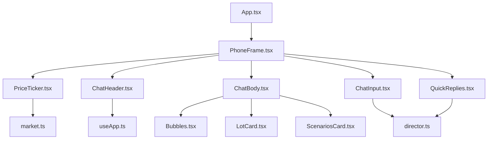
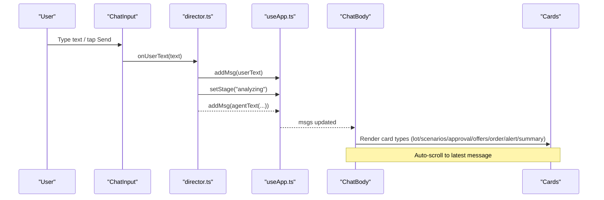
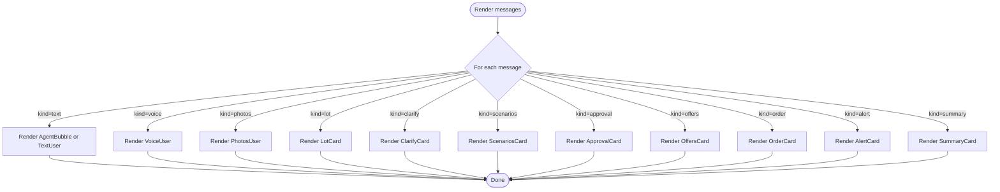
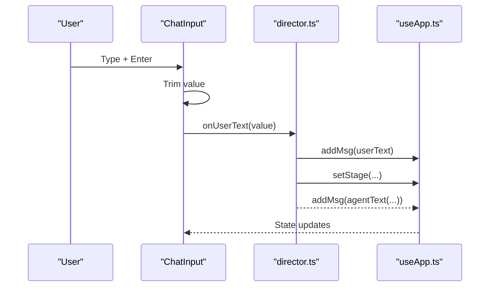
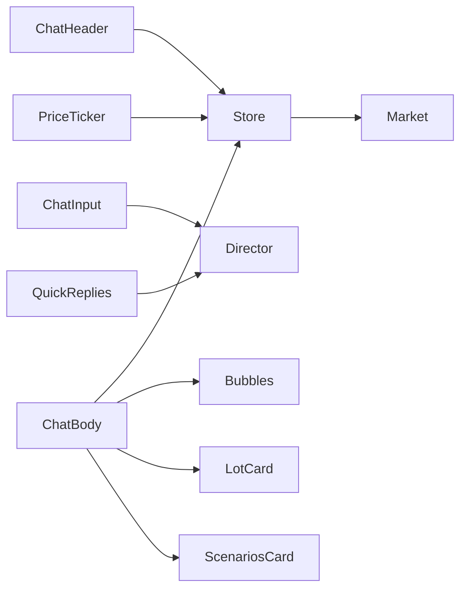

# Core Components

<cite>
**Referenced Files in This Document**
- [App.tsx](file://freshroute/src/App.tsx)
- [PhoneFrame.tsx](file://freshroute/src/components/PhoneFrame.tsx)
- [ChatHeader.tsx](file://freshroute/src/components/ChatHeader.tsx)
- [ChatBody.tsx](file://freshroute/src/components/ChatBody.tsx)
- [ChatInput.tsx](file://freshroute/src/components/ChatInput.tsx)
- [QuickReplies.tsx](file://freshroute/src/components/QuickReplies.tsx)
- [PriceTicker.tsx](file://freshroute/src/components/PriceTicker.tsx)
- [Bubbles.tsx](file://freshroute/src/components/Bubbles.tsx)
- [LotCard.tsx](file://freshroute/src/components/cards/LotCard.tsx)
- [ScenariosCard.tsx](file://freshroute/src/components/cards/ScenariosCard.tsx)
- [useApp.ts](file://freshroute/src/store/useApp.ts)
- [director.ts](file://freshroute/src/store/director.ts)
- [market.ts](file://freshroute/src/data/market.ts)
- [types.ts](file://freshroute/src/types.ts)
</cite>

## Table of Contents
1. Introduction
2. Project Structure
3. Core Components
4. Architecture Overview
5. Detailed Component Analysis
6. Dependency Analysis
7. Performance Considerations
8. Troubleshooting Guide
9. Conclusion
10. Appendices

## Introduction
This document provides detailed documentation for FreshRoute’s core UI components that power the conversational user interface. It covers ChatBody (message rendering), ChatInput (user interactions), QuickReplies (suggested responses), ChatHeader (conversation context), PhoneFrame (mobile device simulation), and PriceTicker (real-time market data display). For each component, you will find props, events, styling options, integration patterns, usage examples, responsive design considerations, and accessibility features.

## Project Structure
The chat application is composed of a small set of focused React components orchestrated by a global store and a stateful director that drives conversation flows. The root App composes the phone frame and chat shell, while specialized cards render rich agent messages.

**Diagram sources**
- [App.tsx:21-32](file://freshroute/src/App.tsx#L21-L32)
- [PhoneFrame.tsx:3-55](file://freshroute/src/components/PhoneFrame.tsx#L3-L55)
- [ChatBody.tsx:32-84](file://freshroute/src/components/ChatBody.tsx#L32-L84)
- [ChatInput.tsx:7-86](file://freshroute/src/components/ChatInput.tsx#L7-L86)
- [QuickReplies.tsx:5-29](file://freshroute/src/components/QuickReplies.tsx#L5-L29)
- [PriceTicker.tsx:4-34](file://freshroute/src/components/PriceTicker.tsx#L4-L34)
- [Bubbles.tsx:10-125](file://freshroute/src/components/Bubbles.tsx#L10-L125)
- [LotCard.tsx:35-116](file://freshroute/src/components/cards/LotCard.tsx#L35-L116)
- [ScenariosCard.tsx:89-172](file://freshroute/src/components/cards/ScenariosCard.tsx#L89-L172)
- [useApp.ts:56-118](file://freshroute/src/store/useApp.ts#L56-L118)
- [director.ts:86-106](file://freshroute/src/store/director.ts#L86-L106)
- [market.ts:174-183](file://freshroute/src/data/market.ts#L174-L183)

**Section sources**
- [App.tsx:14-32](file://freshroute/src/App.tsx#L14-L32)
- [PhoneFrame.tsx:3-55](file://freshroute/src/components/PhoneFrame.tsx#L3-L55)

## Core Components
- ChatBody: Renders the message list with auto-scrolling, supports text, voice, photos, and rich cards like lot details, scenarios, approvals, offers, orders, alerts, and summaries.
- ChatInput: Provides text input, photo attachment, and voice note capture; dispatches actions to the conversation director.
- QuickReplies: Displays suggested action chips based on current conversation stage; hides during typing or when empty.
- ChatHeader: Shows app branding, online status, language toggle, audit log access, and settings.
- PhoneFrame: Wraps the app in a mobile device frame with a branded backdrop and feature callouts on larger screens.
- PriceTicker: A scrolling ticker showing mandi prices with trend indicators sourced from market data.

**Section sources**
- [ChatBody.tsx:32-84](file://freshroute/src/components/ChatBody.tsx#L32-L84)
- [ChatInput.tsx:7-86](file://freshroute/src/components/ChatInput.tsx#L7-L86)
- [QuickReplies.tsx:5-29](file://freshroute/src/components/QuickReplies.tsx#L5-L29)
- [ChatHeader.tsx:6-58](file://freshroute/src/components/ChatHeader.tsx#L6-L58)
- [PhoneFrame.tsx:3-55](file://freshroute/src/components/PhoneFrame.tsx#L3-L55)
- [PriceTicker.tsx:4-34](file://freshroute/src/components/PriceTicker.tsx#L4-L34)

## Architecture Overview
The UI is driven by a global Zustand store and a director module that manages conversation stages and side effects. Components are mostly presentational and subscribe to store slices via selectors.

**Diagram sources**
- [ChatInput.tsx:13-18](file://freshroute/src/components/ChatInput.tsx#L13-L18)
- [director.ts:145-156](file://freshroute/src/store/director.ts#L145-L156)
- [useApp.ts:75-78](file://freshroute/src/store/useApp.ts#L75-L78)
- [ChatBody.tsx:47-79](file://freshroute/src/components/ChatBody.tsx#L47-L79)

## Detailed Component Analysis

### ChatBody
Purpose:
- Renders all message types and rich cards.
- Auto-scrolls to the bottom when new messages arrive or typing indicator changes.
- Displays a typing bubble when the agent is processing.

Props and internal state:
- Reads messages and typing state from the global store.
- Uses a ref to scroll into view smoothly.

Events:
- None directly; reacts to store updates.

Styling:
- Scrollable container with subtle pattern background.
- Message bubbles use consistent spacing and rounded corners.
- Typing indicator uses animated dots.

Integration:
- Consumes message kinds to render specific cards (text, voice, photos, lot, clarify, scenarios, approval, offers, order, alert, summary).

Accessibility:
- Uses semantic main element for content region.
- Time metadata is included per message bubble.

Usage example:
- Composed inside PhoneFrame alongside header, quick replies, and input. See composition in App.

**Section sources**
- [ChatBody.tsx:32-84](file://freshroute/src/components/ChatBody.tsx#L32-L84)
- [Bubbles.tsx:10-125](file://freshroute/src/components/Bubbles.tsx#L10-L125)
- [App.tsx:21-32](file://freshroute/src/App.tsx#L21-L32)

#### Message Rendering Flow

**Diagram sources**
- [ChatBody.tsx:47-79](file://freshroute/src/components/ChatBody.tsx#L47-L79)

### ChatInput
Purpose:
- Captures user text, triggers sending, and simulates voice note recording.
- Opens photo sheet via store control.

Props:
- None (reads from store and i18n).

Events:
- Sends text via onUserText when Enter is pressed or Send button is clicked.
- Simulates voice note capture via onVoiceNote.
- Opens photo sheet via setSheet("photos").

Styling:
- Responsive input bar with safe area padding for mobile.
- Visual feedback for recording state with waveform animation.

Accessibility:
- Buttons have aria-labels for screen readers.
- Placeholder text is localized.

Integration:
- Dispatches to director functions for conversation flow.

Usage example:
- Placed at the bottom of the chat shell; works with QuickReplies and ChatBody.

**Section sources**
- [ChatInput.tsx:7-86](file://freshroute/src/components/ChatInput.tsx#L7-L86)
- [director.ts:145-171](file://freshroute/src/store/director.ts#L145-L171)

#### Sending Flow

**Diagram sources**
- [ChatInput.tsx:13-18](file://freshroute/src/components/ChatInput.tsx#L13-L18)
- [director.ts:145-156](file://freshroute/src/store/director.ts#L145-L156)
- [useApp.ts:75-78](file://freshroute/src/store/useApp.ts#L75-L78)

### QuickReplies
Purpose:
- Displays contextual suggestion chips to guide users through the conversation.

Props:
- None (reads from store).

Events:
- Each chip calls onQuickReply with its id to trigger a specific flow.

Styling:
- Horizontal scrollable row with primary and secondary styles.
- Hidden when no quick replies exist or when agent is typing.

Accessibility:
- Buttons are keyboard accessible and visually distinct.

Integration:
- Works with ChatBody and ChatInput to provide guided navigation.

Usage example:
- Appears above ChatInput; disappears during typing to avoid distraction.

**Section sources**
- [QuickReplies.tsx:5-29](file://freshroute/src/components/QuickReplies.tsx#L5-L29)
- [director.ts:702-738](file://freshroute/src/store/director.ts#L702-L738)

### ChatHeader
Purpose:
- Displays branding, online status, AI mode badge, language toggle, audit log, and settings.

Props:
- None (reads from store and i18n).

Events:
- Toggles language between English and Urdu.
- Opens audit drawer and settings sheet.

Styling:
- Gradient header with clear typography and icons.

Accessibility:
- All buttons include aria-labels; status text is descriptive.

Integration:
- Controls global UI state via store setters.

Usage example:
- Fixed at the top of the chat shell.

**Section sources**
- [ChatHeader.tsx:6-58](file://freshroute/src/components/ChatHeader.tsx#L6-L58)

### PhoneFrame
Purpose:
- Provides a mobile device simulation container with a branded backdrop and marketing panel on larger screens.

Props:
- children: ReactNode to be rendered inside the phone frame.

Styling:
- Full-screen background image with overlay blur.
- Centered phone-like container with rounded corners and border.
- Feature callout panel visible on large screens.

Responsive behavior:
- On small screens, only the phone frame is shown.
- On xl screens, a left-side promotional panel appears.

Accessibility:
- Decorative background image has alt="" to avoid noise for screen readers.

Integration:
- Wraps the entire chat UI in App.

**Section sources**
- [PhoneFrame.tsx:3-55](file://freshroute/src/components/PhoneFrame.tsx#L3-L55)
- [App.tsx:21-32](file://freshroute/src/App.tsx#L21-L32)

### PriceTicker
Purpose:
- Shows a continuously scrolling ticker of mandi prices with trend arrows.

Props:
- None (reads from store).

Data source:
- Initializes from market data function that generates price points with trends.

Styling:
- Dark header with gradient fade edges to mask marquee overflow.
- Trend indicators use color-coded icons.

Performance:
- Uses duplicated items to create seamless infinite scroll effect.

Integration:
- Positioned at the top of the phone frame.

**Section sources**
- [PriceTicker.tsx:4-34](file://freshroute/src/components/PriceTicker.tsx#L4-L34)
- [market.ts:174-183](file://freshroute/src/data/market.ts#L174-L183)

### Supporting Components and Cards
- Bubbles: Shared message bubble components for agent and user, including time metadata and visual variants for text, voice, and photos.
- LotCard: Displays extracted lot details, quality estimate, confidence meter, and notes.
- ScenariosCard: Presents recommended and alternative market scenarios with net values, deductions, risk, and payment terms.

**Section sources**
- [Bubbles.tsx:10-125](file://freshroute/src/components/Bubbles.tsx#L10-L125)
- [LotCard.tsx:35-116](file://freshroute/src/components/cards/LotCard.tsx#L35-L116)
- [ScenariosCard.tsx:89-172](file://freshroute/src/components/cards/ScenariosCard.tsx#L89-L172)

## Dependency Analysis
Components depend on:
- Global store (Zustand) for state and actions.
- Director for conversation orchestration and side effects.
- Market data for price ticker and pricing logic.
- Utility libraries for formatting and class merging.

**Diagram sources**
- [ChatBody.tsx:32-84](file://freshroute/src/components/ChatBody.tsx#L32-L84)
- [ChatInput.tsx:7-86](file://freshroute/src/components/ChatInput.tsx#L7-L86)
- [QuickReplies.tsx:5-29](file://freshroute/src/components/QuickReplies.tsx#L5-L29)
- [ChatHeader.tsx:6-58](file://freshroute/src/components/ChatHeader.tsx#L6-L58)
- [PriceTicker.tsx:4-34](file://freshroute/src/components/PriceTicker.tsx#L4-L34)
- [useApp.ts:56-118](file://freshroute/src/store/useApp.ts#L56-L118)
- [market.ts:174-183](file://freshroute/src/data/market.ts#L174-L183)

**Section sources**
- [useApp.ts:20-54](file://freshroute/src/store/useApp.ts#L20-L54)
- [director.ts:1-22](file://freshroute/src/store/director.ts#L1-L22)
- [market.ts:1-24](file://freshroute/src/data/market.ts#L1-L24)

## Performance Considerations
- ChatBody auto-scrolls using smooth behavior; ensure message lists remain manageable in size for long sessions.
- PriceTicker duplicates items to simulate infinite scrolling; keep dataset small to avoid layout thrashing.
- Avoid heavy computations in render paths; delegate to director and store where possible.
- Use lazy loading for images in photo bubbles and lot cards to improve initial load performance.

[No sources needed since this section provides general guidance]

## Troubleshooting Guide
Common issues and resolutions:
- Messages not appearing: Ensure store.addMsg is called and ChatBody subscribes to msgs. Check that director adds both user and agent messages.
- QuickReplies not showing: Verify setQuick is invoked and typing is false; QuickReplies hide when typing or when array is empty.
- PriceTicker static: Confirm market data function returns an array and store.ticker is initialized; check that PriceTicker reads from store.
- Language toggle not working: Ensure setLang updates store.lang and ChatHeader re-renders localized strings.

**Section sources**
- [ChatBody.tsx:32-84](file://freshroute/src/components/ChatBody.tsx#L32-L84)
- [QuickReplies.tsx:5-29](file://freshroute/src/components/QuickReplies.tsx#L5-L29)
- [PriceTicker.tsx:4-34](file://freshroute/src/components/PriceTicker.tsx#L4-L34)
- [ChatHeader.tsx:6-58](file://freshroute/src/components/ChatHeader.tsx#L6-L58)
- [useApp.ts:56-118](file://freshroute/src/store/useApp.ts#L56-L118)

## Conclusion
FreshRoute’s core UI components form a cohesive conversational interface built around a simple, robust architecture. ChatBody renders diverse message types, ChatInput captures user intent, QuickReplies guides users, ChatHeader provides context and controls, PhoneFrame frames the experience, and PriceTicker delivers live market insights. Together, they enable an intuitive, accessible, and responsive chat-driven workflow for agricultural sales and logistics.

[No sources needed since this section summarizes without analyzing specific files]

## Appendices

### Integration Patterns
- Compose components in App to build the chat shell within PhoneFrame.
- Use director functions to drive conversation flows triggered by ChatInput and QuickReplies.
- Subscribe to store slices in components via selectors for reactive updates.

**Section sources**
- [App.tsx:14-32](file://freshroute/src/App.tsx#L14-L32)
- [director.ts:86-106](file://freshroute/src/store/director.ts#L86-L106)
- [useApp.ts:56-118](file://freshroute/src/store/useApp.ts#L56-L118)

### Responsive Design Considerations
- PhoneFrame adapts to screen size; promotional panel shows on large screens.
- ChatInput includes safe-area padding for mobile devices.
- PriceTicker uses horizontal overflow with masked edges for seamless scrolling.

**Section sources**
- [PhoneFrame.tsx:13-51](file://freshroute/src/components/PhoneFrame.tsx#L13-L51)
- [ChatInput.tsx:29-83](file://freshroute/src/components/ChatInput.tsx#L29-L83)
- [PriceTicker.tsx:8-32](file://freshroute/src/components/PriceTicker.tsx#L8-L32)

### Accessibility Features
- Buttons include aria-labels for clarity.
- Semantic elements (header, main, footer) structure the chat shell.
- Time metadata and status indicators aid understanding for assistive technologies.

**Section sources**
- [ChatInput.tsx:31-80](file://freshroute/src/components/ChatInput.tsx#L31-L80)
- [ChatHeader.tsx:13-56](file://freshroute/src/components/ChatHeader.tsx#L13-L56)
- [Bubbles.tsx:6-8](file://freshroute/src/components/Bubbles.tsx#L6-L8)