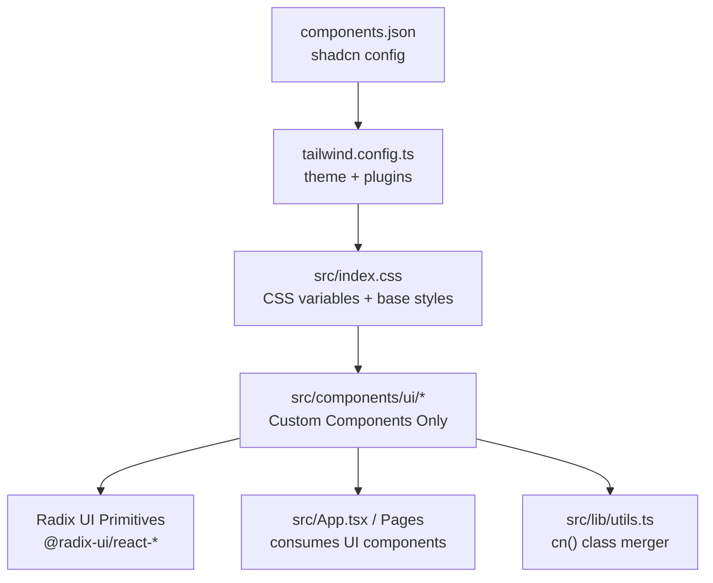
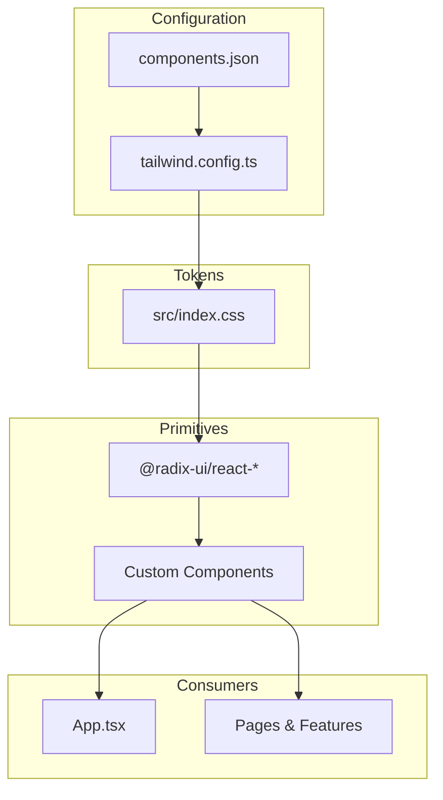
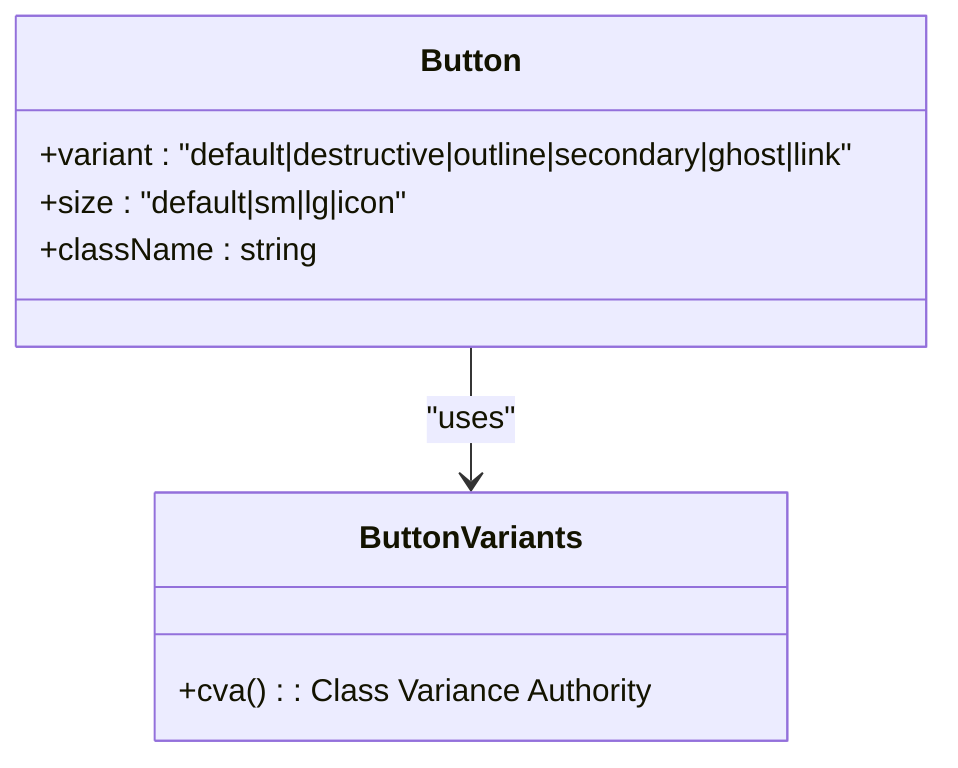
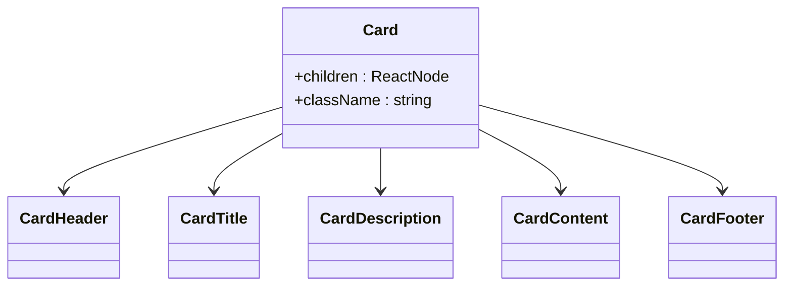
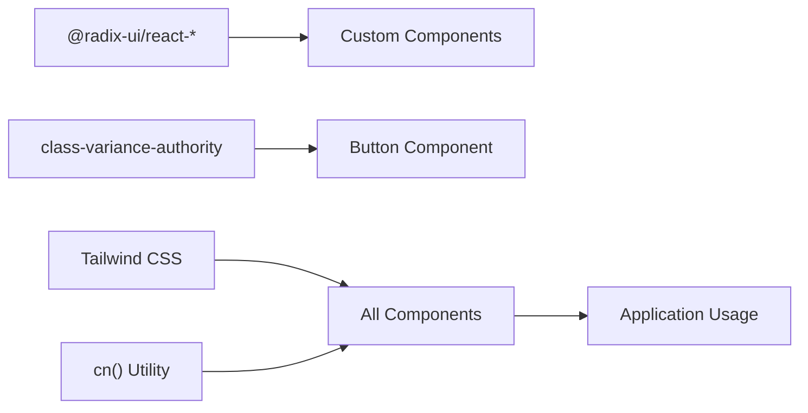

# Shadcn UI Component Library

<cite>
**Referenced Files in This Document**
- [components.json](file://freshroute/components.json)
- [tailwind.config.ts](file://freshroute/tailwind.config.ts)
- [index.css](file://freshroute/src/index.css)
- [utils.ts](file://freshroute/src/lib/utils.ts)
- [button.tsx](file://freshroute/src/components/ui/button.tsx)
- [card.tsx](file://freshroute/src/components/ui/card.tsx)
- [label.tsx](file://freshroute/src/components/ui/label.tsx)
- [switch.tsx](file://freshroute/src/components/ui/switch.tsx)
- [skeleton.tsx](file://freshroute/src/components/ui/skeleton.tsx)
- [pricing.tsx](file://freshroute/src/components/ui/pricing.tsx)
- [package.json](file://freshroute/package.json)
</cite>

## Update Summary
**Changes Made**
- Updated to reflect the complete removal of 25 shadcn UI components from the freshroute/@/components/ui/ directory
- Revised component inventory to document only the remaining custom components (button, card, label, switch, skeleton, pricing)
- Updated architecture diagrams to reflect the current component structure
- Added migration guidance for replacing removed components with alternative implementations
- Updated dependency analysis to reflect current Radix UI and custom component usage

## Table of Contents
1. [Introduction](#introduction)
2. [Project Structure](#project-structure)
3. [Core Components](#core-components)
4. [Architecture Overview](#architecture-overview)
5. [Detailed Component Analysis](#detailed-component-analysis)
6. [Dependency Analysis](#dependency-analysis)
7. [Migration Guide](#migration-guide)
8. [Performance Considerations](#performance-considerations)
9. [Troubleshooting Guide](#troubleshooting-guide)
10. [Conclusion](#conclusion)

## Introduction
This document explains the current state of the UI component library in the FreshRoute application following the removal of all standard shadcn UI components. The application now uses a minimal set of custom-built components alongside Radix UI primitives, providing essential UI functionality while maintaining design consistency through Tailwind CSS and custom styling.

**Updated** This section has been revised to reflect the significant architectural change where all 25 standard shadcn components have been removed, leaving only custom implementations for core UI elements.

## Project Structure
The UI layer now consists of a streamlined set of custom components under src/components/ui/, built on top of Radix UI primitives and styled with Tailwind CSS. The configuration remains consistent with shadcn patterns but focuses on essential components only.

**Diagram sources**
- [components.json:1-28](file://freshroute/components.json#L1-L28)
- [tailwind.config.ts:1-162](file://freshroute/tailwind.config.ts#L1-L162)
- [index.css:1-158](file://freshroute/src/index.css#L1-L158)
- [utils.ts:1-7](file://freshroute/src/lib/utils.ts#L1-L7)
- [button.tsx:1-49](file://freshroute/src/components/ui/button.tsx#L1-L49)
- [card.tsx:1-47](file://freshroute/src/components/ui/card.tsx#L1-L47)
- [label.tsx:1-25](file://freshroute/src/components/ui/label.tsx#L1-L25)
- [switch.tsx:1-28](file://freshroute/src/components/ui/switch.tsx#L1-L28)
- [skeleton.tsx:1-14](file://freshroute/src/components/ui/skeleton.tsx#L1-L14)

**Section sources**
- [components.json:1-28](file://freshroute/components.json#L1-L28)
- [tailwind.config.ts:1-162](file://freshroute/tailwind.config.ts#L1-L162)
- [index.css:1-158](file://freshroute/src/index.css#L1-L158)
- [utils.ts:1-7](file://freshroute/src/lib/utils.ts#L1-L7)

## Core Components
The application now maintains a focused set of custom UI components that provide essential functionality while leveraging Radix UI primitives for accessibility and interaction behaviors.

### Available Components
- **Button**: Custom implementation with variant and size system using class-variance-authority
- **Card**: Content container with header, title, description, content, and footer slots
- **Label**: Accessible form labels built on @radix-ui/react-label
- **Switch**: Toggle control built on @radix-ui/react-switch
- **Skeleton**: Loading placeholder component with animation
- **Pricing**: Complex pricing component demonstrating composition of multiple primitives

**Updated** The component inventory has been significantly reduced from 25+ components to 6 core components, each carefully crafted for specific use cases.

**Section sources**
- [button.tsx:1-49](file://freshroute/src/components/ui/button.tsx#L1-L49)
- [card.tsx:1-47](file://freshroute/src/components/ui/card.tsx#L1-L47)
- [label.tsx:1-25](file://freshroute/src/components/ui/label.tsx#L1-L25)
- [switch.tsx:1-28](file://freshroute/src/components/ui/switch.tsx#L1-L28)
- [skeleton.tsx:1-14](file://freshroute/src/components/ui/skeleton.tsx#L1-L14)
- [pricing.tsx:1-209](file://freshroute/src/components/ui/pricing.tsx#L1-L209)

## Architecture Overview
The new architecture combines custom React components with Radix UI primitives, providing accessible, composable UI elements while maintaining full control over styling and behavior.

**Diagram sources**
- [components.json:1-28](file://freshroute/components.json#L1-L28)
- [tailwind.config.ts:1-162](file://freshroute/tailwind.config.ts#L1-L162)
- [index.css:1-158](file://freshroute/src/index.css#L1-L158)
- [button.tsx:1-49](file://freshroute/src/components/ui/button.tsx#L1-L49)
- [card.tsx:1-47](file://freshroute/src/components/ui/card.tsx#L1-L47)
- [label.tsx:1-25](file://freshroute/src/components/ui/label.tsx#L1-L25)
- [switch.tsx:1-28](file://freshroute/src/components/ui/switch.tsx#L1-L28)

## Detailed Component Analysis

### Button Component
- **Purpose**: Primary interactive element with comprehensive variant and size system
- **Implementation**: Uses class-variance-authority for dynamic styling based on props
- **Features**: Supports default, destructive, outline, secondary, ghost, and link variants; multiple sizes including icon variants
- **Accessibility**: Proper focus management, disabled states, and keyboard navigation

**Diagram sources**
- [button.tsx:1-49](file://freshroute/src/components/ui/button.tsx#L1-L49)

**Section sources**
- [button.tsx:1-49](file://freshroute/src/components/ui/button.tsx#L1-L49)
- [utils.ts:1-7](file://freshroute/src/lib/utils.ts#L1-L7)

### Card Component
- **Purpose**: Flexible content container with structured layout slots
- **Composition**: Provides Card, CardHeader, CardTitle, CardDescription, CardContent, and CardFooter components
- **Styling**: Responsive design with consistent spacing and visual hierarchy
- **Usage**: Widely used throughout the application for content organization

**Diagram sources**
- [card.tsx:1-47](file://freshroute/src/components/ui/card.tsx#L1-L47)

**Section sources**
- [card.tsx:1-47](file://freshroute/src/components/ui/card.tsx#L1-L47)

### Form Components (Label & Switch)
- **Label**: Accessible form labels built on @radix-ui/react-label with consistent typography
- **Switch**: Toggle control built on @radix-ui/react-switch with proper ARIA attributes
- **Integration**: Both components follow shadcn patterns while providing full accessibility support

**Section sources**
- [label.tsx:1-25](file://freshroute/src/components/ui/label.tsx#L1-L25)
- [switch.tsx:1-28](file://freshroute/src/components/ui/switch.tsx#L1-L28)

### Skeleton Component
- **Purpose**: Loading placeholder with pulse animation
- **Usage**: Provides visual feedback during data loading states
- **Styling**: Uses Tailwind's animate-pulse utility for smooth loading indication

**Section sources**
- [skeleton.tsx:1-14](file://freshroute/src/components/ui/skeleton.tsx#L1-L14)

### Pricing Component
- **Purpose**: Complex pricing display component demonstrating advanced composition
- **Features**: Interactive billing toggle, animated transitions, responsive layout
- **Dependencies**: Integrates multiple primitives (Button, Label, Switch) with motion animations

**Section sources**
- [pricing.tsx:1-209](file://freshroute/src/components/ui/pricing.tsx#L1-L209)

## Dependency Analysis
The current component architecture relies on a minimal set of dependencies focused on accessibility and styling:

- **Radix UI**: Provides accessible primitives for form controls and interactive elements
- **Class Variance Authority**: Enables dynamic component styling based on props
- **Tailwind CSS**: Powers all styling with custom theme tokens
- **React**: Core framework for component composition

**Diagram sources**
- [package.json:18-20](file://freshroute/package.json#L18-L20)
- [button.tsx:1-49](file://freshroute/src/components/ui/button.tsx#L1-L49)
- [label.tsx:1-25](file://freshroute/src/components/ui/label.tsx#L1-L25)
- [switch.tsx:1-28](file://freshroute/src/components/ui/switch.tsx#L1-L28)

**Section sources**
- [package.json:12-56](file://freshroute/package.json#L12-L56)
- [button.tsx:1-49](file://freshroute/src/components/ui/button.tsx#L1-L49)
- [utils.ts:1-7](file://freshroute/src/lib/utils.ts#L1-L7)

## Migration Guide
With the removal of 25 shadcn UI components, developers need to migrate existing code to use available alternatives or implement custom solutions.

### Removed Components and Alternatives
- **Input, Textarea, Select**: Use native HTML inputs with custom styling or build custom components
- **Dialog, Popover, Dropdown Menu**: Implement using Radix UI primitives directly
- **Badge, Alert, Avatar**: Create simple custom components following existing patterns
- **Tabs, Accordion, Collapsible**: Build custom accordion-style components
- **Progress, Spinner**: Use CSS animations or SVG-based loaders
- **Carousel, Scroll Area**: Implement using embla-carousel or custom scroll logic
- **Command, Hover Card**: Create lightweight custom implementations

### Migration Strategy
1. **Assess Usage**: Identify which removed components are currently used in the application
2. **Choose Approach**: Decide between using Radix UI primitives directly or building custom components
3. **Implement Solutions**: Create replacements following existing component patterns
4. **Update Imports**: Replace old import paths with new implementations
5. **Test Thoroughly**: Ensure accessibility and functionality are maintained

**Updated** This section provides guidance for handling the significant reduction in available UI components.

## Performance Considerations
- **Reduced Bundle Size**: Removing 25 components significantly reduces the application bundle size
- **Selective Dependencies**: Only essential dependencies are included, improving load performance
- **Custom Optimization**: Each component can be optimized specifically for its use case
- **Tree Shaking**: Unused components are automatically excluded from production builds

**Updated** Performance benefits from the component reduction include smaller bundles and more targeted optimizations.

## Troubleshooting Guide
- **Missing Components**: If you encounter imports for removed components, replace them with available alternatives or custom implementations
- **Styling Issues**: Ensure Tailwind classes are properly configured and CSS variables are defined
- **Accessibility Concerns**: When building custom components, ensure proper ARIA attributes and keyboard navigation
- **Import Errors**: Verify that component paths are correct and components exist in the ui directory

**Updated** Troubleshooting guidance addresses issues specific to the reduced component set.

## Conclusion
The transition to a minimal set of custom UI components represents a strategic decision to maintain full control over the application's user interface while reducing external dependencies. This approach provides better performance, more predictable behavior, and greater flexibility for customization. The remaining components demonstrate best practices for building accessible, well-styled UI elements that can serve as templates for future development.

Developers should leverage the existing component patterns when creating new UI elements, ensuring consistency across the application while taking advantage of the simplified architecture. The focus on essential components allows for more efficient development and maintenance while preserving the quality and accessibility standards established by the original shadcn-based implementation.

**Updated** This conclusion reflects the successful transition to a streamlined component architecture that balances simplicity with functionality.