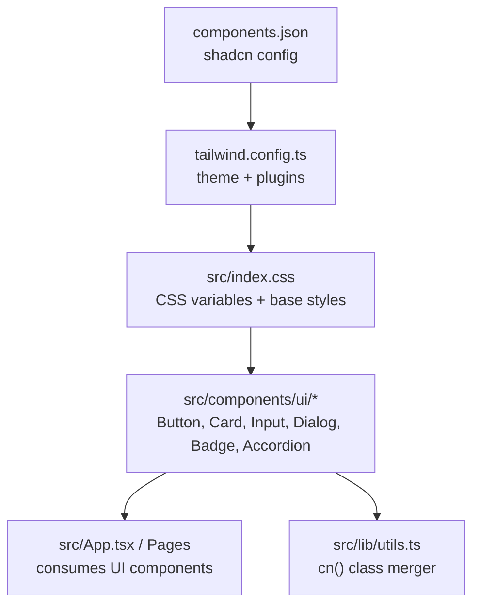
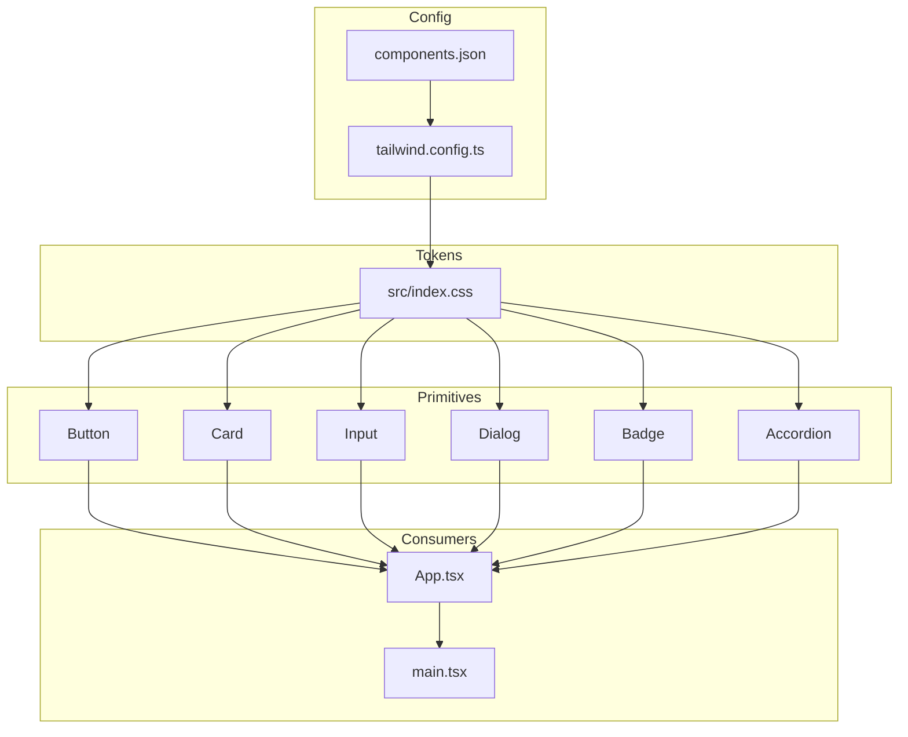
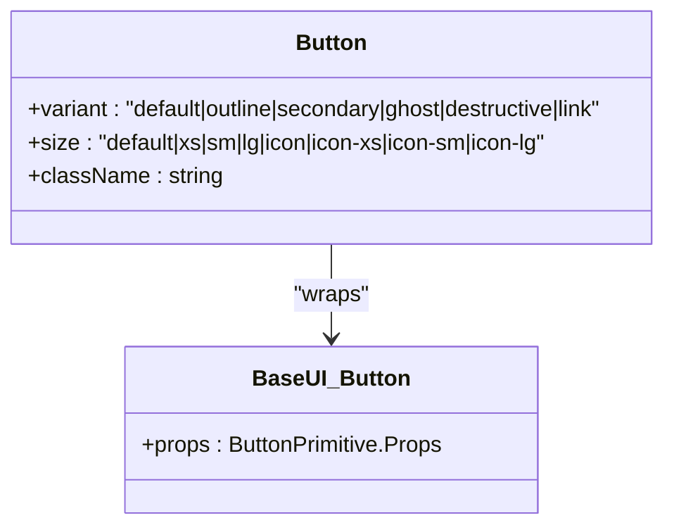
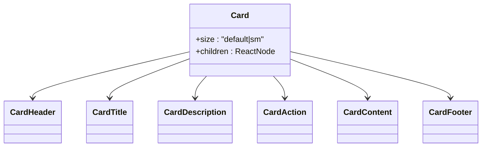
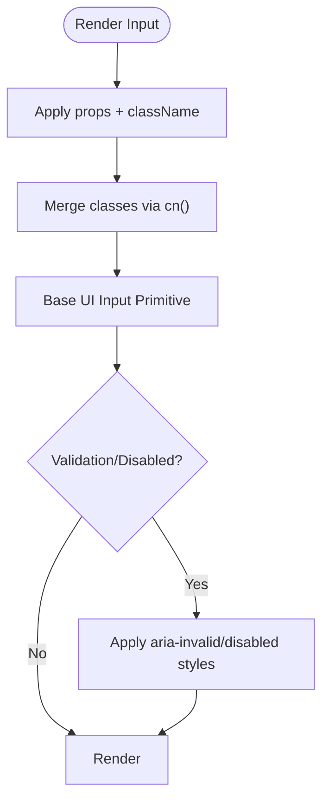
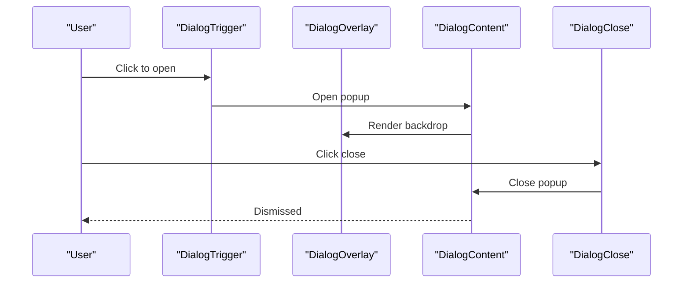
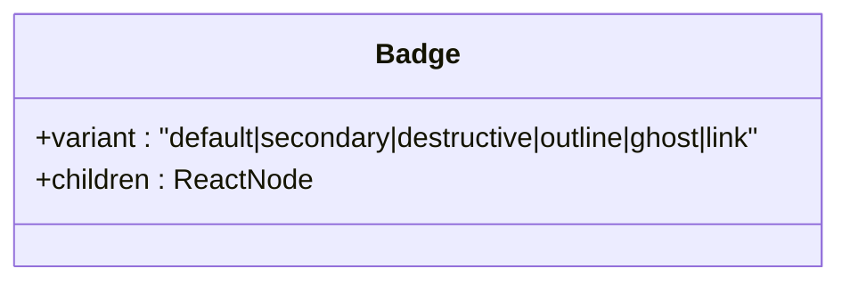
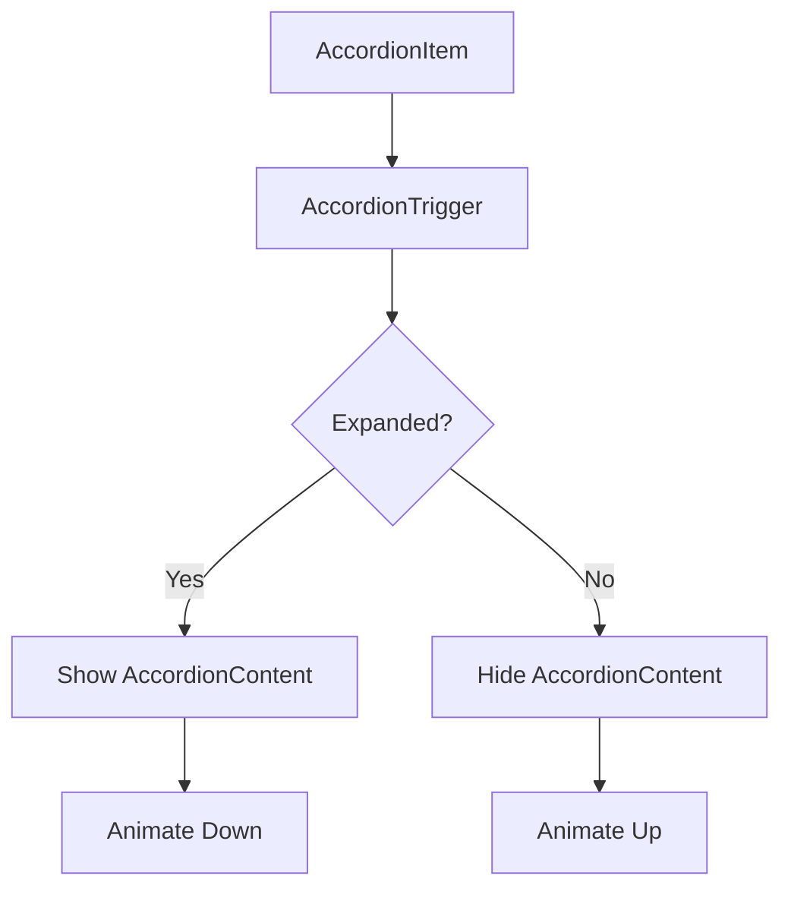
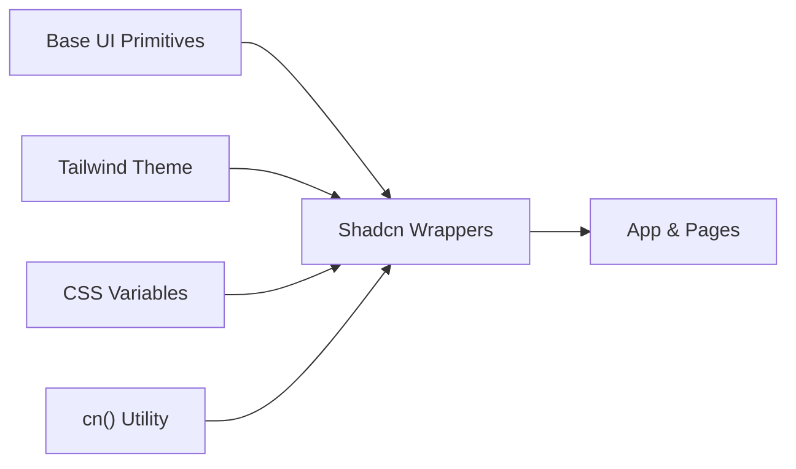

# Shadcn UI Component Library

<cite>
**Referenced Files in This Document**
- [components.json](file://freshroute/components.json)
- [tailwind.config.ts](file://freshroute/tailwind.config.ts)
- [index.css](file://freshroute/src/index.css)
- [utils.ts](file://freshroute/src/lib/utils.ts)
- [button.tsx](file://freshroute/src/components/ui/button.tsx)
- [card.tsx](file://freshroute/src/components/ui/card.tsx)
- [input.tsx](file://freshroute/src/components/ui/input.tsx)
- [dialog.tsx](file://freshroute/src/components/ui/dialog.tsx)
- [badge.tsx](file://freshroute/src/components/ui/badge.tsx)
- [accordion.tsx](file://freshroute/src/components/ui/accordion.tsx)
- [App.tsx](file://freshroute/src/App.tsx)
- [main.tsx](file://freshroute/src/main.tsx)
</cite>

## Table of Contents
1. [Introduction](#introduction)
2. [Project Structure](#project-structure)
3. [Core Components](#core-components)
4. [Architecture Overview](#architecture-overview)
5. [Detailed Component Analysis](#detailed-component-analysis)
6. [Dependency Analysis](#dependency-analysis)
7. [Performance Considerations](#performance-considerations)
8. [Troubleshooting Guide](#troubleshooting-guide)
9. [Conclusion](#conclusion)

## Introduction
This document explains the Shadcn-based UI component library used in the FreshRoute application. It covers how components are configured, styled, and composed; how they integrate with Tailwind CSS and Base UI primitives; and how they are consumed by pages and layouts. The goal is to help developers understand the system’s design, extend or customize components safely, and troubleshoot common issues.

## Project Structure
The Shadcn UI layer lives under src/components/ui and is configured via a central shadcn configuration file and Tailwind theme. Global CSS variables define the brand palette and tokens that components consume. Utilities merge class names deterministically for predictable styling.

**Diagram sources**
- [components.json:1-28](file://freshroute/components.json#L1-L28)
- [tailwind.config.ts:1-162](file://freshroute/tailwind.config.ts#L1-L162)
- [index.css:1-158](file://freshroute/src/index.css#L1-L158)
- [utils.ts:1-7](file://freshroute/src/lib/utils.ts#L1-L7)
- [button.tsx:1-59](file://freshroute/src/components/ui/button.tsx#L1-L59)
- [card.tsx:1-104](file://freshroute/src/components/ui/card.tsx#L1-L104)
- [input.tsx:1-21](file://freshroute/src/components/ui/input.tsx#L1-L21)
- [dialog.tsx:1-161](file://freshroute/src/components/ui/dialog.tsx#L1-L161)
- [badge.tsx:1-53](file://freshroute/src/components/ui/badge.tsx#L1-L53)
- [accordion.tsx:1-73](file://freshroute/src/components/ui/accordion.tsx#L1-L73)

**Section sources**
- [components.json:1-28](file://freshroute/components.json#L1-L28)
- [tailwind.config.ts:1-162](file://freshroute/tailwind.config.ts#L1-L162)
- [index.css:1-158](file://freshroute/src/index.css#L1-L158)
- [utils.ts:1-7](file://freshroute/src/lib/utils.ts#L1-L7)

## Core Components
The library provides accessible, composable primitives built on Base UI and styled with Tailwind. Each component exposes a consistent API, uses data-slot attributes for testing and styling hooks, and supports variants and sizes where applicable.

- Button: variant and size system, focus and disabled states, icon support.
- Card: header/content/footer composition with responsive sizing.
- Input: form input with validation states and accessibility attributes.
- Dialog: overlay, portal, close behavior, header/footer composition.
- Badge: status labels with semantic variants.
- Accordion: expandable sections with animated content panels.

These components are consumed throughout the app (e.g., chat interface, settings sheets, dialogs) and compose into higher-level UI patterns.

**Section sources**
- [button.tsx:1-59](file://freshroute/src/components/ui/button.tsx#L1-L59)
- [card.tsx:1-104](file://freshroute/src/components/ui/card.tsx#L1-L104)
- [input.tsx:1-21](file://freshroute/src/components/ui/input.tsx#L1-L21)
- [dialog.tsx:1-161](file://freshroute/src/components/ui/dialog.tsx#L1-L161)
- [badge.tsx:1-53](file://freshroute/src/components/ui/badge.tsx#L1-L53)
- [accordion.tsx:1-73](file://freshroute/src/components/ui/accordion.tsx#L1-L73)

## Architecture Overview
The UI architecture layers are:
- Configuration: shadcn config defines aliases, style, and integrations.
- Theme: Tailwind theme extends colors, fonts, animations, and shadows.
- Tokens: CSS custom properties in index.css provide brand tokens.
- Primitives: Base UI primitives wrapped in shadcn-style components.
- Composition: App and pages compose primitives into screens.

**Diagram sources**
- [components.json:1-28](file://freshroute/components.json#L1-L28)
- [tailwind.config.ts:1-162](file://freshroute/tailwind.config.ts#L1-L162)
- [index.css:1-158](file://freshroute/src/index.css#L1-L158)
- [button.tsx:1-59](file://freshroute/src/components/ui/button.tsx#L1-L59)
- [card.tsx:1-104](file://freshroute/src/components/ui/card.tsx#L1-L104)
- [input.tsx:1-21](file://freshroute/src/components/ui/input.tsx#L1-L21)
- [dialog.tsx:1-161](file://freshroute/src/components/ui/dialog.tsx#L1-L161)
- [badge.tsx:1-53](file://freshroute/src/components/ui/badge.tsx#L1-L53)
- [accordion.tsx:1-73](file://freshroute/src/components/ui/accordion.tsx#L1-L73)
- [App.tsx:1-37](file://freshroute/src/App.tsx#L1-L37)
- [main.tsx:1-102](file://freshroute/src/main.tsx#L1-L102)

## Detailed Component Analysis

### Button
- Purpose: Primary interactive element with variants (default, outline, secondary, ghost, destructive, link) and sizes (default, xs, sm, lg, icon variants).
- Styling: Uses class-variance-authority for variant/size rules; merges classes via cn(); integrates with Base UI button primitive for semantics and keyboard behavior.
- Accessibility: Focus rings, aria-invalid handling, disabled state, icon sizing.
- Usage: Consumed across dialogs, forms, and action bars.

**Diagram sources**
- [button.tsx:1-59](file://freshroute/src/components/ui/button.tsx#L1-L59)

**Section sources**
- [button.tsx:1-59](file://freshroute/src/components/ui/button.tsx#L1-L59)
- [utils.ts:1-7](file://freshroute/src/lib/utils.ts#L1-L7)

### Card
- Purpose: Content container with header, title, description, action, content, and footer slots.
- Styling: Responsive padding, image rounding, size variants (default/sm), ring and background tokens from CSS variables.
- Composition: Encourages structured content layout with clear visual hierarchy.

**Diagram sources**
- [card.tsx:1-104](file://freshroute/src/components/ui/card.tsx#L1-L104)

**Section sources**
- [card.tsx:1-104](file://freshroute/src/components/ui/card.tsx#L1-L104)

### Input
- Purpose: Accessible text input with placeholder, disabled state, and validation feedback.
- Styling: Consistent height, border, focus ring, and dark mode support; integrates with Base UI input primitive.
- Integration: Used in forms and settings panels.

**Diagram sources**
- [input.tsx:1-21](file://freshroute/src/components/ui/input.tsx#L1-L21)
- [utils.ts:1-7](file://freshroute/src/lib/utils.ts#L1-L7)

**Section sources**
- [input.tsx:1-21](file://freshroute/src/components/ui/input.tsx#L1-L21)

### Dialog
- Purpose: Modal dialog with overlay, portal, close behavior, and optional header/footer.
- Behavior: Portal ensures correct z-indexing; overlay handles backdrop; close button integrated with Button primitive.
- Accessibility: Proper focus management and keyboard navigation via Base UI dialog primitives.

**Diagram sources**
- [dialog.tsx:1-161](file://freshroute/src/components/ui/dialog.tsx#L1-L161)
- [button.tsx:1-59](file://freshroute/src/components/ui/button.tsx#L1-L59)

**Section sources**
- [dialog.tsx:1-161](file://freshroute/src/components/ui/dialog.tsx#L1-L161)

### Badge
- Purpose: Compact status or label indicator with semantic variants.
- Styling: Variants include default, secondary, destructive, outline, ghost, link; small footprint with icons support.

**Diagram sources**
- [badge.tsx:1-53](file://freshroute/src/components/ui/badge.tsx#L1-L53)

**Section sources**
- [badge.tsx:1-53](file://freshroute/src/components/ui/badge.tsx#L1-L53)

### Accordion
- Purpose: Expandable sections with animated content panels and chevron indicators.
- Behavior: Triggers toggle content visibility; content animates open/close using Tailwind keyframes.

**Diagram sources**
- [accordion.tsx:1-73](file://freshroute/src/components/ui/accordion.tsx#L1-L73)

**Section sources**
- [accordion.tsx:1-73](file://freshroute/src/components/ui/accordion.tsx#L1-L73)

## Dependency Analysis
- Base UI primitives provide accessibility and interaction behaviors; shadcn wrappers add consistent styling and slotting.
- Tailwind theme and CSS variables drive color, typography, spacing, and animation tokens.
- Class merging utility ensures deterministic style resolution when multiple class inputs are provided.

**Diagram sources**
- [button.tsx:1-59](file://freshroute/src/components/ui/button.tsx#L1-L59)
- [card.tsx:1-104](file://freshroute/src/components/ui/card.tsx#L1-L104)
- [input.tsx:1-21](file://freshroute/src/components/ui/input.tsx#L1-L21)
- [dialog.tsx:1-161](file://freshroute/src/components/ui/dialog.tsx#L1-L161)
- [badge.tsx:1-53](file://freshroute/src/components/ui/badge.tsx#L1-L53)
- [accordion.tsx:1-73](file://freshroute/src/components/ui/accordion.tsx#L1-L73)
- [utils.ts:1-7](file://freshroute/src/lib/utils.ts#L1-L7)
- [tailwind.config.ts:1-162](file://freshroute/tailwind.config.ts#L1-L162)
- [index.css:1-158](file://freshroute/src/index.css#L1-L158)

**Section sources**
- [utils.ts:1-7](file://freshroute/src/lib/utils.ts#L1-L7)
- [tailwind.config.ts:1-162](file://freshroute/tailwind.config.ts#L1-L162)
- [index.css:1-158](file://freshroute/src/index.css#L1-L158)

## Performance Considerations
- Prefer minimal re-renders by composing stable component trees and avoiding unnecessary prop changes.
- Use lazy loading at page boundaries (already applied in routing) to reduce initial bundle size.
- Keep animations lightweight; rely on Tailwind utilities and hardware-accelerated transforms.
- Avoid excessive nested class strings; leverage the cn utility to keep class lists clean and optimized.

[No sources needed since this section provides general guidance]

## Troubleshooting Guide
- Styles not applying: Ensure index.css is imported and Tailwind directives are present; verify CSS variables are defined and referenced correctly.
- Variant or size not working: Confirm the component receives the expected variant/size props and that class merging via cn() is used.
- Dialog not closing: Verify DialogClose is rendered within DialogContent or properly wired to trigger close behavior.
- Form validation visuals: Check that aria-invalid is set appropriately on inputs to trigger destructive styles.

**Section sources**
- [index.css:1-158](file://freshroute/src/index.css#L1-L158)
- [input.tsx:1-21](file://freshroute/src/components/ui/input.tsx#L1-L21)
- [dialog.tsx:1-161](file://freshroute/src/components/ui/dialog.tsx#L1-L161)
- [button.tsx:1-59](file://freshroute/src/components/ui/button.tsx#L1-L59)

## Conclusion
The Shadcn UI layer in FreshRoute combines Base UI primitives with Tailwind-driven theming to deliver accessible, customizable components. With a clear configuration, consistent tokens, and well-structured primitives, teams can build complex interfaces efficiently while maintaining consistency and performance. Extend components by adding new variants or compositions, always leveraging the existing token system and class merging utility.

[No sources needed since this section summarizes without analyzing specific files]