# UI Component Library

<cite>
**Referenced Files in This Document**
- [README.md](file://README.md)
- [package.json](file://freshroute/package.json)
- [components.json](file://freshroute/components.json)
- [App.tsx](file://freshroute/src/App.tsx)
- [utils.ts](file://freshroute/src/lib/utils.ts)
- [tailwind.config.ts](file://freshroute/tailwind.config.ts)
- [button.tsx](file://freshroute/@\components\ui\button.tsx)
- [card.tsx](file://freshroute/@\components\ui\card.tsx)
- [input.tsx](file://freshroute/@\components\ui\input.tsx)
- [dialog.tsx](file://freshroute/@\components\ui\dialog.tsx)
- [badge.tsx](file://freshroute/@\components\ui\badge.tsx)
- [tabs.tsx](file://freshroute/@\components\ui\tabs.tsx)
- [select.tsx](file://freshroute/@\components\ui\select.tsx)
- [progress.tsx](file://freshroute/@\components\ui\progress.tsx)
</cite>

## Table of Contents
1. Introduction
2. Project Structure
3. Core Components
4. Architecture Overview
5. Detailed Component Analysis
6. Dependency Analysis
7. Performance Considerations
8. Troubleshooting Guide
9. Conclusion

## Introduction
This document describes the UI component library used by the FreshRoute application. It focuses on the shared, reusable components under @/components/ui, their design patterns, styling system, and how they integrate with the app shell and theme configuration. The goal is to help developers understand, extend, and consistently use these primitives across the codebase.

## Project Structure
The UI library is organized as a set of small, focused components that wrap accessible primitives from @base-ui/react and style them with Tailwind CSS utilities. A central utility merges class names deterministically, and the theme defines tokens for colors, radii, shadows, and animations.

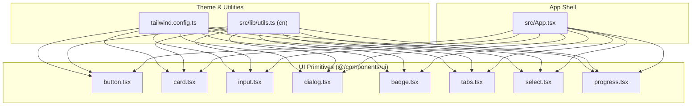

**Diagram sources**
- [tailwind.config.ts:1-162](file://freshroute/tailwind.config.ts#L1-L162)
- [utils.ts:1-7](file://freshroute/src/lib/utils.ts#L1-L7)
- [button.tsx:1-59](file://freshroute/@\components\ui\button.tsx#L1-L59)
- [card.tsx:1-104](file://freshroute/@\components\ui\card.tsx#L1-L104)
- [input.tsx:1-21](file://freshroute/@\components\ui\input.tsx#L1-L21)
- [dialog.tsx:1-161](file://freshroute/@\components\ui\dialog.tsx#L1-L161)
- [badge.tsx:1-53](file://freshroute/@\components\ui\badge.tsx#L1-L53)
- [tabs.tsx:1-83](file://freshroute/@\components\ui\tabs.tsx#L1-L83)
- [select.tsx:1-200](file://freshroute/@\components\ui\select.tsx#L1-L200)
- [progress.tsx:1-82](file://freshroute/@\components\ui\progress.tsx#L1-L82)
- [App.tsx:1-37](file://freshroute/src/App.tsx#L1-L37)

**Section sources**
- [README.md:144-178](file://README.md#L144-L178)
- [package.json:12-55](file://freshroute/package.json#L12-L55)
- [components.json:1-28](file://freshroute/components.json#L1-L28)

## Core Components
- Button: Accessible button with variants and sizes via class-variance-authority; styled with Tailwind tokens.
- Card: Composed card with header, title, description, content, action, and footer slots.
- Input: Styled text input with focus rings, disabled states, and validation visuals.
- Dialog: Full dialog system including overlay, portal, header/footer, title, description, and close behavior.
- Badge: Small status or label element with multiple visual variants.
- Tabs: Tabbed interface with list, trigger, and content panels supporting horizontal/vertical orientation.
- Select: Accessible select with grouped items, labels, separators, and scrollable popup.
- Progress: Linear progress bar with track, indicator, label, and value.

These components share consistent data-slot attributes for testing and styling hooks, and rely on the cn utility for deterministic class merging.

**Section sources**
- [button.tsx:1-59](file://freshroute/@\components\ui\button.tsx#L1-L59)
- [card.tsx:1-104](file://freshroute/@\components\ui\card.tsx#L1-L104)
- [input.tsx:1-21](file://freshroute/@\components\ui\input.tsx#L1-L21)
- [dialog.tsx:1-161](file://freshroute/@\components\ui\dialog.tsx#L1-L161)
- [badge.tsx:1-53](file://freshroute/@\components\ui\badge.tsx#L1-L53)
- [tabs.tsx:1-83](file://freshroute/@\components\ui\tabs.tsx#L1-L83)
- [select.tsx:1-200](file://freshroute/@\components\ui\select.tsx#L1-L200)
- [progress.tsx:1-82](file://freshroute/@\components\ui\progress.tsx#L1-L82)

## Architecture Overview
The UI layer composes accessible primitives into themed, reusable components. Theme tokens are centralized in Tailwind configuration, while class name resolution uses a shared utility. The app shell imports and orchestrates these components to build screens.

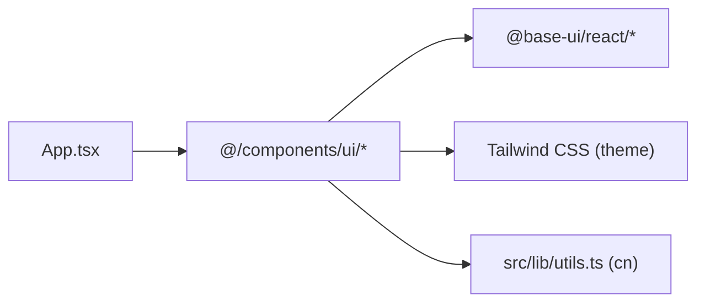

**Diagram sources**
- [App.tsx:1-37](file://freshroute/src/App.tsx#L1-L37)
- [tailwind.config.ts:1-162](file://freshroute/tailwind.config.ts#L1-L162)
- [utils.ts:1-7](file://freshroute/src/lib/utils.ts#L1-L7)

## Detailed Component Analysis

### Button
- Purpose: Primary interactive control with variant-driven styles and size options.
- Key behaviors: Focus rings, disabled state, icon sizing, and accessibility attributes via primitive props.
- Styling: Variants defined with class-variance-authority; merged with cn for predictable output.

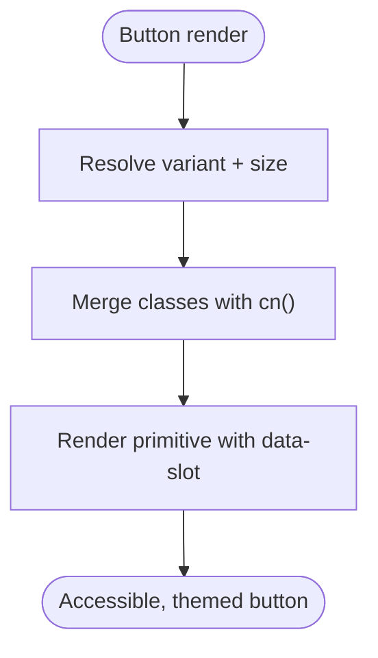

**Diagram sources**
- [button.tsx:1-59](file://freshroute/@\components\ui\button.tsx#L1-L59)
- [utils.ts:1-7](file://freshroute/src/lib/utils.ts#L1-L7)

**Section sources**
- [button.tsx:1-59](file://freshroute/@\components\ui\button.tsx#L1-L59)

### Card
- Purpose: Content container with semantic sections (header, title, description, content, action, footer).
- Key behaviors: Responsive spacing via CSS variables; image-first layout adjustments; slot-based composition.
- Styling: Consistent border, background, and shadow tokens from theme.

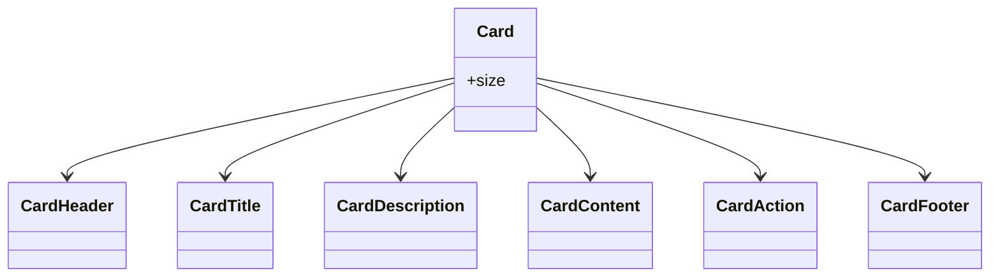

**Diagram sources**
- [card.tsx:1-104](file://freshroute/@\components\ui\card.tsx#L1-L104)

**Section sources**
- [card.tsx:1-104](file://freshroute/@\components\ui\card.tsx#L1-L104)

### Input
- Purpose: Text input with consistent focus ring, placeholder, disabled, and validation states.
- Key behaviors: Delegates focus management and semantics to the primitive; applies theme-aware borders and backgrounds.

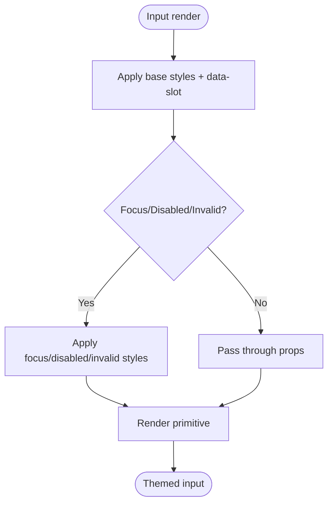

**Diagram sources**
- [input.tsx:1-21](file://freshroute/@\components\ui\input.tsx#L1-L21)

**Section sources**
- [input.tsx:1-21](file://freshroute/@\components\ui\input.tsx#L1-L21)

### Dialog
- Purpose: Modal-like overlay with keyboard navigation, focus trapping, and accessible announcements.
- Key behaviors: Portal rendering, backdrop overlay, optional close button, header/footer scaffolding.

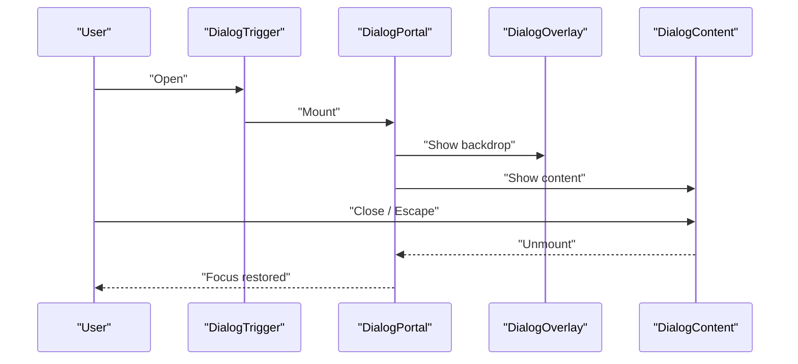

**Diagram sources**
- [dialog.tsx:1-161](file://freshroute/@\components\ui\dialog.tsx#L1-L161)

**Section sources**
- [dialog.tsx:1-161](file://freshroute/@\components\ui\dialog.tsx#L1-L161)

### Badge
- Purpose: Compact status or label indicator with multiple visual variants.
- Key behaviors: Uses a render helper to support custom tag and slot metadata; integrates with focus and invalid states.

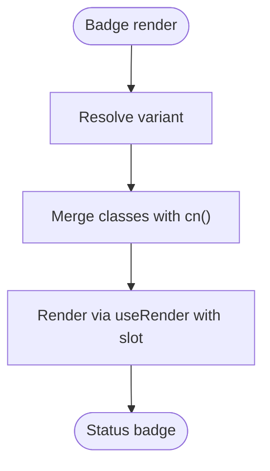

**Diagram sources**
- [badge.tsx:1-53](file://freshroute/@\components\ui\badge.tsx#L1-L53)
- [utils.ts:1-7](file://freshroute/src/lib/utils.ts#L1-L7)

**Section sources**
- [badge.tsx:1-53](file://freshroute/@\components\ui\badge.tsx#L1-L53)

### Tabs
- Purpose: Tabbed navigation with list, triggers, and content panels.
- Key behaviors: Supports horizontal/vertical orientation; active state indicators; keyboard navigation via primitive.

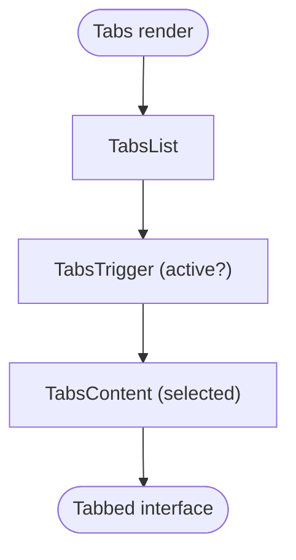

**Diagram sources**
- [tabs.tsx:1-83](file://freshroute/@\components\ui\tabs.tsx#L1-L83)

**Section sources**
- [tabs.tsx:1-83](file://freshroute/@\components\ui\tabs.tsx#L1-L83)

### Select
- Purpose: Accessible dropdown selection with grouping, labels, separators, and scrolling.
- Key behaviors: Popup positioning, item indicators, and scroll arrows for long lists.

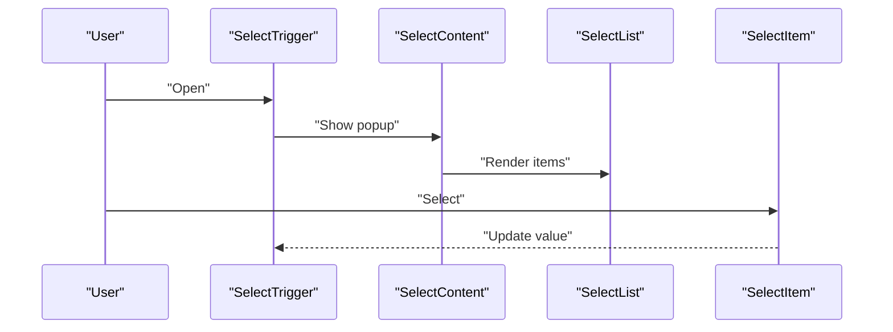

**Diagram sources**
- [select.tsx:1-200](file://freshroute/@\components\ui\select.tsx#L1-L200)

**Section sources**
- [select.tsx:1-200](file://freshroute/@\components\ui\select.tsx#L1-L200)

### Progress
- Purpose: Linear progress indicator with track, indicator, label, and value.
- Key behaviors: Controlled value updates; accessible labeling via primitive.

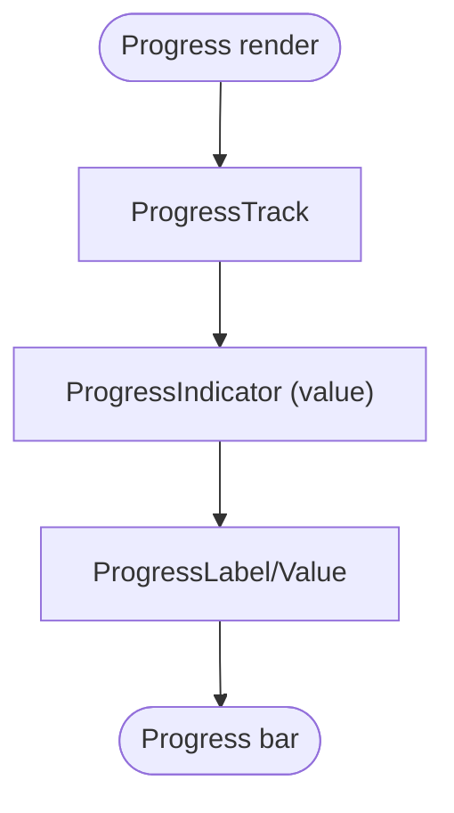

**Diagram sources**
- [progress.tsx:1-82](file://freshroute/@\components\ui\progress.tsx#L1-L82)

**Section sources**
- [progress.tsx:1-82](file://freshroute/@\components\ui\progress.tsx#L1-L82)

## Dependency Analysis
- Base primitives: All components wrap @base-ui/react primitives for accessibility and behavior.
- Styling: Tailwind CSS theme provides tokens; class merging via src/lib/utils.ts ensures deterministic output.
- App integration: App.tsx composes higher-level UI pieces that may consume these primitives.

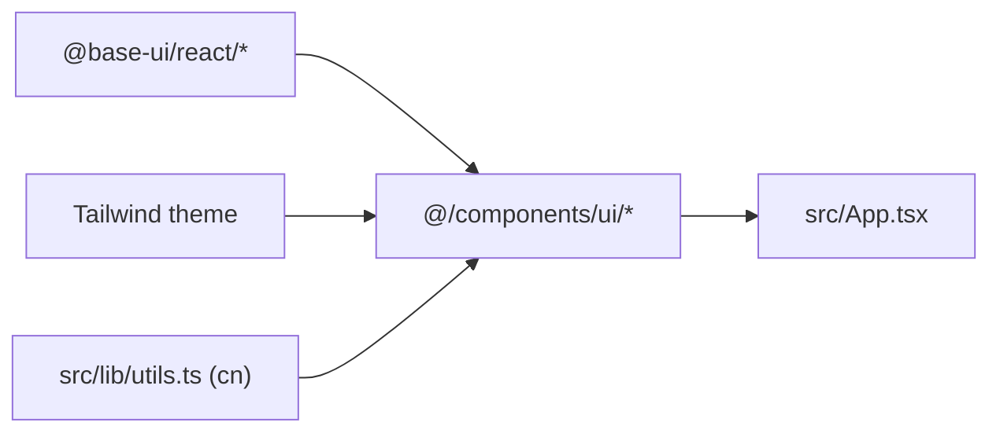

**Diagram sources**
- [package.json:12-55](file://freshroute/package.json#L12-L55)
- [tailwind.config.ts:1-162](file://freshroute/tailwind.config.ts#L1-L162)
- [utils.ts:1-7](file://freshroute/src/lib/utils.ts#L1-L7)
- [App.tsx:1-37](file://freshroute/src/App.tsx#L1-L37)

**Section sources**
- [package.json:12-55](file://freshroute/package.json#L12-L55)
- [components.json:1-28](file://freshroute/components.json#L1-L28)

## Performance Considerations
- Prefer controlled usage of dialogs and selects to avoid unnecessary re-renders.
- Use variant and size props to leverage precomputed class sets rather than ad-hoc overrides.
- Keep large lists inside select/popover virtualized if needed (outside current scope).
- Avoid excessive nested dialogs; prefer modal stacking strategies at the app level.

## Troubleshooting Guide
- Styles not applying: Ensure cn utility is used and Tailwind config includes the correct content paths.
- Focus issues: Verify that primitives receive focusable elements and that overlays do not trap focus unexpectedly.
- Dark mode mismatches: Confirm theme tokens are defined and dark mode is enabled in Tailwind config.
- Accessibility warnings: Check that aria attributes and roles are preserved from primitives and not overridden.

[No sources needed since this section provides general guidance]

## Conclusion
The UI component library provides a cohesive, accessible, and theme-driven foundation for building FreshRoute’s interfaces. By composing @base-ui/react primitives with Tailwind tokens and a robust class merging utility, it enables consistent, maintainable UI development across the application.

[No sources needed since this section summarizes without analyzing specific files]