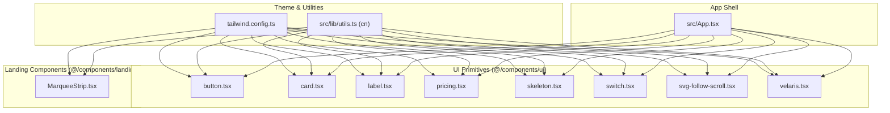
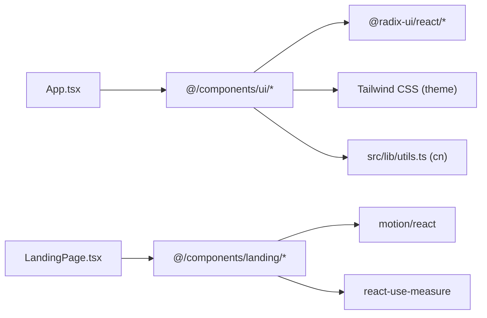
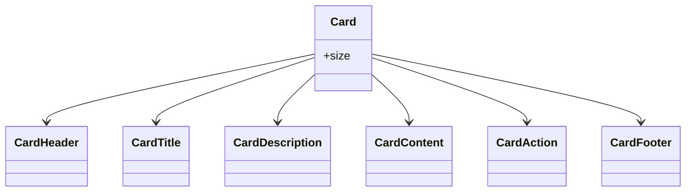
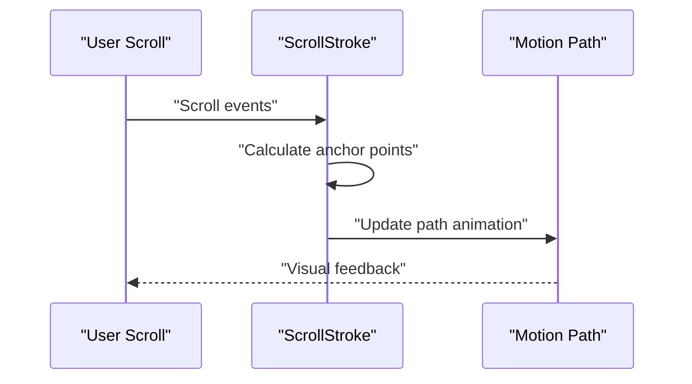
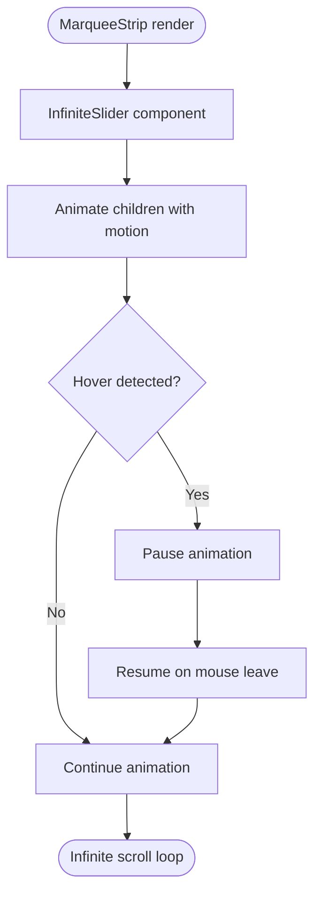
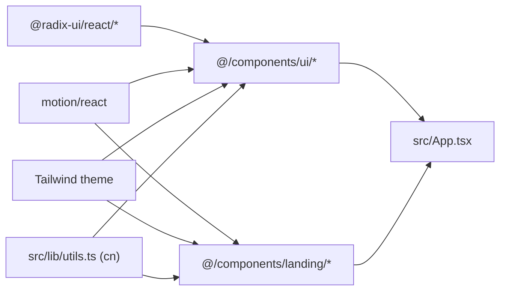

# UI Component Library

<cite>
**Referenced Files in This Document**
- [README.md](file://README.md)
- [package.json](file://freshroute/package.json)
- [components.json](file://freshroute/components.json)
- [App.tsx](file://freshroute/src/App.tsx)
- [utils.ts](file://freshroute/src/lib/utils.ts)
- [tailwind.config.ts](file://freshroute/tailwind.config.ts)
- [button.tsx](file://freshroute/src/components/ui/button.tsx)
- [card.tsx](file://freshroute/src/components/ui/card.tsx)
- [label.tsx](file://freshroute/src/components/ui/label.tsx)
- [pricing.tsx](file://freshroute/src/components/ui/pricing.tsx)
- [skeleton.tsx](file://freshroute/src/components/ui/skeleton.tsx)
- [switch.tsx](file://freshroute/src/components/ui/switch.tsx)
- [svg-follow-scroll.tsx](file://freshroute/src/components/ui/svg-follow-scroll.tsx)
- [velaris.tsx](file://freshroute/src/components/ui/velaris.tsx)
- [MarqueeStrip.tsx](file://freshroute/src/components/landing/MarqueeStrip.tsx)
- [LandingPage.tsx](file://freshroute/src/pages/LandingPage.tsx)
</cite>

## Update Summary
**Changes Made**
- Updated component inventory to reflect current UI components structure
- Added ScrollStroke component documentation (available but not currently used in landing page)
- Updated MarqueeStrip component documentation to reflect its standalone nature
- Clarified that landing page uses custom inline marquee implementation instead of MarqueeStrip component
- Removed references to non-existent components (input, dialog, badge, tabs, select, progress)

## Table of Contents
1. Introduction
2. Project Structure
3. Core Components
4. Architecture Overview
5. Detailed Component Analysis
6. Dependency Analysis
7. Performance Considerations
8. Troubleshooting Guide
9. Conclusion

## Introduction
This document describes the UI component library used by the FreshRoute application. It focuses on the shared, reusable components under @/components/ui and specialized landing page components, their design patterns, styling system, and how they integrate with the app shell and theme configuration. The goal is to help developers understand, extend, and consistently use these primitives across the codebase.

## Project Structure
The UI library is organized as a set of small, focused components that wrap accessible primitives from Radix UI and style them with Tailwind CSS utilities. A central utility merges class names deterministically, and the theme defines tokens for colors, radii, shadows, and animations.

**Diagram sources**
- [tailwind.config.ts:1-162](file://freshroute/tailwind.config.ts#L1-L162)
- [utils.ts:1-7](file://freshroute/src/lib/utils.ts#L1-L7)
- [button.tsx:1-59](file://freshroute/src/components/ui/button.tsx#L1-L59)
- [card.tsx:1-104](file://freshroute/src/components/ui/card.tsx#L1-L104)
- [label.tsx:1-21](file://freshroute/src/components/ui/label.tsx#L1-L21)
- [pricing.tsx:1-200](file://freshroute/src/components/ui/pricing.tsx#L1-L200)
- [skeleton.tsx:1-50](file://freshroute/src/components/ui/skeleton.tsx#L1-L50)
- [switch.tsx:1-80](file://freshroute/src/components/ui/switch.tsx#L1-L80)
- [svg-follow-scroll.tsx:1-160](file://freshroute/src/components/ui/svg-follow-scroll.tsx#L1-L160)
- [velaris.tsx:1-100](file://freshroute/src/components/ui/velaris.tsx#L1-L100)
- [MarqueeStrip.tsx:1-113](file://freshroute/src/components/landing/MarqueeStrip.tsx#L1-L113)
- [App.tsx:1-37](file://freshroute/src/App.tsx#L1-L37)

**Section sources**
- [README.md:144-178](file://README.md#L144-L178)
- [package.json:12-55](file://freshroute/package.json#L12-L55)
- [components.json:1-28](file://freshroute/components.json#L1-L28)

## Core Components
- Button: Accessible button with variants and sizes via class-variance-authority; styled with Tailwind tokens.
- Card: Composed card with header, title, description, content, action, and footer slots.
- Label: Accessible label component with proper form association and styling.
- Pricing: Pricing table component with plan cards, feature lists, and call-to-action buttons.
- Skeleton: Loading placeholder component with shimmer animation for content loading states.
- Switch: Toggle switch component with accessibility features and state management.
- ScrollStroke: SVG-based scroll progress visualization component with animated path drawing.
- Velaris: Theme provider component for managing application-wide styling context.
- MarqueeStrip: Landing page specific infinite scrolling component for displaying city lists.

These components share consistent data-slot attributes for testing and styling hooks, and rely on the cn utility for deterministic class merging.

**Section sources**
- [button.tsx:1-59](file://freshroute/src/components/ui/button.tsx#L1-L59)
- [card.tsx:1-104](file://freshroute/src/components/ui/card.tsx#L1-L104)
- [label.tsx:1-21](file://freshroute/src/components/ui/label.tsx#L1-L21)
- [pricing.tsx:1-200](file://freshroute/src/components/ui/pricing.tsx#L1-L200)
- [skeleton.tsx:1-50](file://freshroute/src/components/ui/skeleton.tsx#L1-L50)
- [switch.tsx:1-80](file://freshroute/src/components/ui/switch.tsx#L1-L80)
- [svg-follow-scroll.tsx:1-160](file://freshroute/src/components/ui/svg-follow-scroll.tsx#L1-L160)
- [velaris.tsx:1-100](file://freshroute/src/components/ui/velaris.tsx#L1-L100)
- [MarqueeStrip.tsx:1-113](file://freshroute/src/components/landing/MarqueeStrip.tsx#L1-L113)

## Architecture Overview
The UI layer composes accessible primitives into themed, reusable components. Theme tokens are centralized in Tailwind configuration, while class name resolution uses a shared utility. The app shell imports and orchestrates these components to build screens.

**Diagram sources**
- [App.tsx:1-37](file://freshroute/src/App.tsx#L1-L37)
- [tailwind.config.ts:1-162](file://freshroute/tailwind.config.ts#L1-L162)
- [utils.ts:1-7](file://freshroute/src/lib/utils.ts#L1-L7)
- [LandingPage.tsx:1-704](file://freshroute/src/pages/LandingPage.tsx#L1-L704)
- [MarqueeStrip.tsx:1-113](file://freshroute/src/components/landing/MarqueeStrip.tsx#L1-L113)

## Detailed Component Analysis

### Button
- Purpose: Primary interactive control with variant-driven styles and size options.
- Key behaviors: Focus rings, disabled state, icon sizing, and accessibility attributes via primitive props.
- Styling: Variants defined with class-variance-authority; merged with cn for predictable output.

**Diagram sources**
- [button.tsx:1-59](file://freshroute/src/components/ui/button.tsx#L1-L59)
- [utils.ts:1-7](file://freshroute/src/lib/utils.ts#L1-L7)

**Section sources**
- [button.tsx:1-59](file://freshroute/src/components/ui/button.tsx#L1-L59)

### Card
- Purpose: Content container with semantic sections (header, title, description, content, action, footer).
- Key behaviors: Responsive spacing via CSS variables; image-first layout adjustments; slot-based composition.
- Styling: Consistent border, background, and shadow tokens from theme.

**Diagram sources**
- [card.tsx:1-104](file://freshroute/src/components/ui/card.tsx#L1-L104)

**Section sources**
- [card.tsx:1-104](file://freshroute/src/components/ui/card.tsx#L1-L104)

### ScrollStroke
- Purpose: SVG-based scroll progress visualization that draws animated paths based on scroll position.
- Key behaviors: Calculates anchor points from DOM elements, builds smooth bezier curves, animates path drawing with motion/react.
- Integration: Available as a reusable component but currently not used in the landing page implementation.

**Diagram sources**
- [svg-follow-scroll.tsx:1-160](file://freshroute/src/components/ui/svg-follow-scroll.tsx#L1-L160)

**Section sources**
- [svg-follow-scroll.tsx:1-160](file://freshroute/src/components/ui/svg-follow-scroll.tsx#L1-L160)

### MarqueeStrip
- Purpose: Infinite scrolling marquee component for displaying lists of items (cities, logos, etc.).
- Key behaviors: Uses motion/react for smooth animations, supports hover pause functionality, handles responsive layouts.
- Usage: Available as a standalone component but landing page uses custom inline implementation instead.

**Diagram sources**
- [MarqueeStrip.tsx:1-113](file://freshroute/src/components/landing/MarqueeStrip.tsx#L1-L113)

**Section sources**
- [MarqueeStrip.tsx:1-113](file://freshroute/src/components/landing/MarqueeStrip.tsx#L1-L113)

### Pricing
- Purpose: Pricing table component with plan cards, feature lists, and call-to-action buttons.
- Key behaviors: Supports multiple pricing tiers, feature comparison, and promotional highlighting.
- Styling: Consistent card-based layout with clear visual hierarchy.

**Section sources**
- [pricing.tsx:1-200](file://freshroute/src/components/ui/pricing.tsx#L1-L200)

### Switch
- Purpose: Toggle switch component with accessibility features and controlled/uncontrolled state support.
- Key behaviors: Keyboard navigation, focus management, and proper ARIA attributes.
- Integration: Built on Radix UI primitives for maximum accessibility.

**Section sources**
- [switch.tsx:1-80](file://freshroute/src/components/ui/switch.tsx#L1-L80)

### Label
- Purpose: Accessible label component for form associations and text display.
- Key behaviors: Proper form field association, focus management, and semantic HTML generation.

**Section sources**
- [label.tsx:1-21](file://freshroute/src/components/ui/label.tsx#L1-L21)

### Skeleton
- Purpose: Loading placeholder component with shimmer animation for content loading states.
- Key behaviors: Configurable dimensions, animation timing, and responsive behavior.

**Section sources**
- [skeleton.tsx:1-50](file://freshroute/src/components/ui/skeleton.tsx#L1-L50)

### Velaris
- Purpose: Theme provider component for managing application-wide styling context.
- Key behaviors: Theme switching, color scheme management, and CSS variable injection.

**Section sources**
- [velaris.tsx:1-100](file://freshroute/src/components/ui/velaris.tsx#L1-L100)

## Dependency Analysis
- Base primitives: Components wrap Radix UI primitives for accessibility and behavior where applicable.
- Animation: motion/react provides animation capabilities for interactive components.
- Styling: Tailwind CSS theme provides tokens; class merging via src/lib/utils.ts ensures deterministic output.
- App integration: App.tsx composes higher-level UI pieces that may consume these primitives.

**Diagram sources**
- [package.json:12-55](file://freshroute/package.json#L12-L55)
- [tailwind.config.ts:1-162](file://freshroute/tailwind.config.ts#L1-L162)
- [utils.ts:1-7](file://freshroute/src/lib/utils.ts#L1-L7)
- [App.tsx:1-37](file://freshroute/src/App.tsx#L1-L37)
- [LandingPage.tsx:1-704](file://freshroute/src/pages/LandingPage.tsx#L1-L704)

**Section sources**
- [package.json:12-55](file://freshroute/package.json#L12-L55)
- [components.json:1-28](file://freshroute/components.json#L1-L28)

## Performance Considerations
- Prefer controlled usage of switches and other interactive components to avoid unnecessary re-renders.
- Use skeleton components during loading states to improve perceived performance.
- For marquee implementations, consider using CSS animations for simple cases and motion/react for complex interactions.
- Avoid excessive nested components; prefer flat component hierarchies where possible.
- Leverage React.memo for expensive components like MarqueeStrip when dealing with large datasets.

## Troubleshooting Guide
- Styles not applying: Ensure cn utility is used and Tailwind config includes the correct content paths.
- Focus issues: Verify that primitives receive focusable elements and that overlays do not trap focus unexpectedly.
- Dark mode mismatches: Confirm theme tokens are defined and dark mode is enabled in Tailwind config.
- Accessibility warnings: Check that aria attributes and roles are preserved from primitives and not overridden.
- Animation performance: For scroll-based animations like ScrollStroke, ensure proper cleanup of event listeners and observers.
- Marquee glitches: For infinite scroll components, verify proper handling of window resize events and reduced motion preferences.

## Conclusion
The UI component library provides a cohesive, accessible, and theme-driven foundation for building FreshRoute's interfaces. By composing Radix UI primitives with Tailwind tokens and a robust class merging utility, it enables consistent, maintainable UI development across the application. The separation between core UI components and landing-specific components allows for better organization and reuse of common functionality.