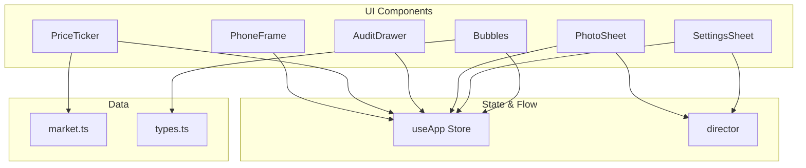
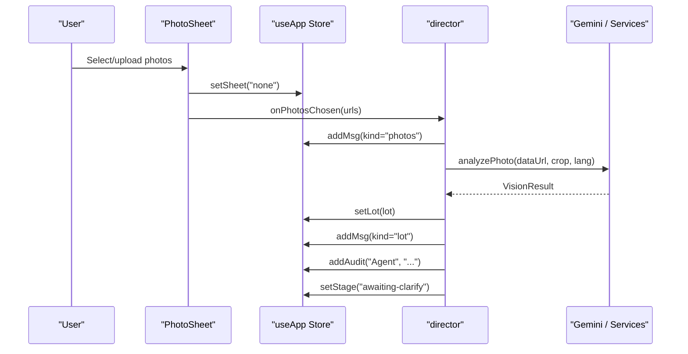
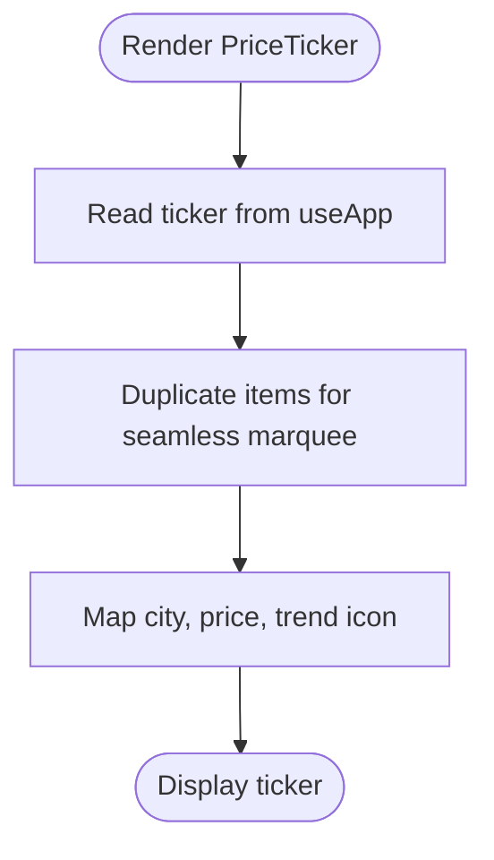
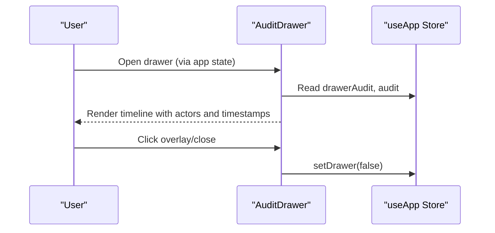
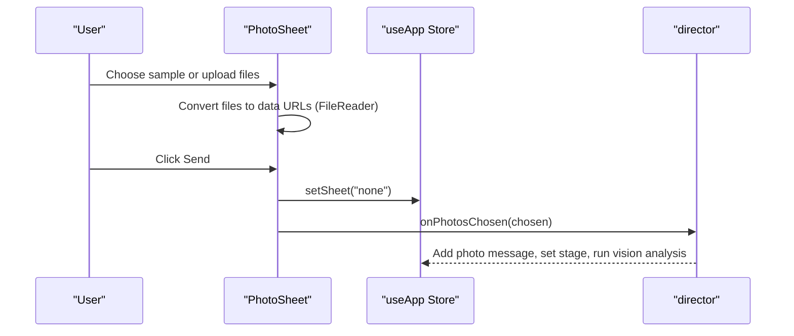
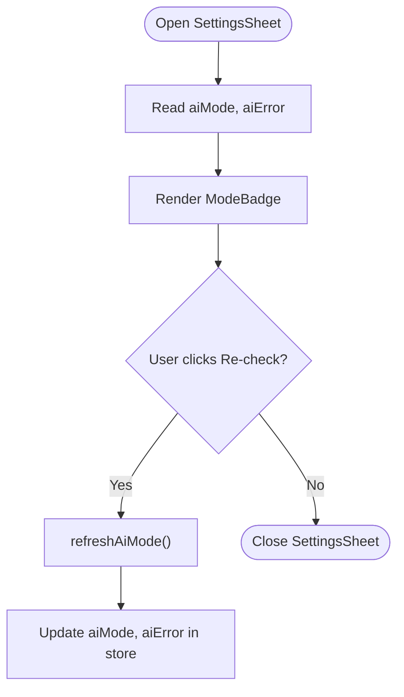
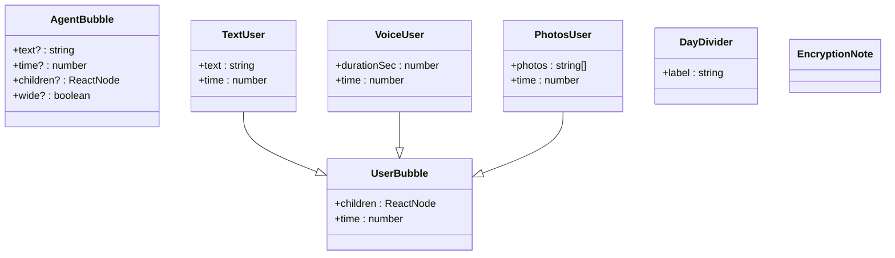
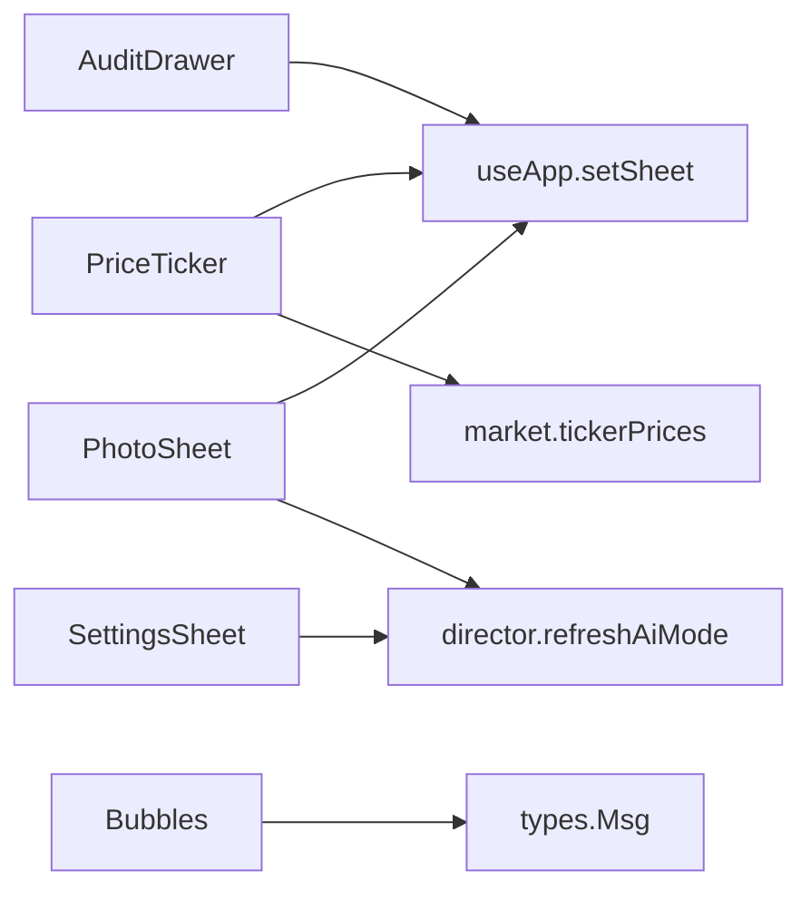

# Utility Components

<cite>
**Referenced Files in This Document**
- [PhoneFrame.tsx](file://freshroute/src/components/PhoneFrame.tsx)
- [PriceTicker.tsx](file://freshroute/src/components/PriceTicker.tsx)
- [AuditDrawer.tsx](file://freshroute/src/components/AuditDrawer.tsx)
- [PhotoSheet.tsx](file://freshroute/src/components/PhotoSheet.tsx)
- [SettingsSheet.tsx](file://freshroute/src/components/SettingsSheet.tsx)
- [Bubbles.tsx](file://freshroute/src/components/Bubbles.tsx)
- [useApp.ts](file://freshroute/src/store/useApp.ts)
- [director.ts](file://freshroute/src/store/director.ts)
- [types.ts](file://freshroute/src/types.ts)
- [market.ts](file://freshroute/src/data/market.ts)
</cite>

## Table of Contents
1. [Introduction](#introduction)
2. [Project Structure](#project-structure)
3. [Core Components](#core-components)
4. [Architecture Overview](#architecture-overview)
5. [Detailed Component Analysis](#detailed-component-analysis)
6. [Dependency Analysis](#dependency-analysis)
7. [Performance Considerations](#performance-considerations)
8. [Troubleshooting Guide](#troubleshooting-guide)
9. [Conclusion](#conclusion)

## Introduction
This document provides detailed, code-backed documentation for FreshRoute’s utility components that power the application’s UI and supporting flows: PhoneFrame (mobile device container), PriceTicker (real-time mandi price ticker), AuditDrawer (action log and audit trail), PhotoSheet (image upload and selection), SettingsSheet (application configuration and AI mode status), and Bubbles (message bubble components and chat visual effects). For each component, we describe props, events, styling options, usage patterns, and how they integrate with the main app state and business flow via Zustand store and director orchestration.

## Project Structure
The utility components live under src/components and interact with shared state in src/store, data in src/data, and types in src/types. The central store useApp exposes UI flags (sheet visibility, drawer visibility, ticker data, audit entries, etc.) and actions to update them. The director module orchestrates user flows and updates messages, scenarios, orders, and audit logs.

**Diagram sources**
- [PhoneFrame.tsx:1-56](file://freshroute/src/components/PhoneFrame.tsx#L1-L56)
- [PriceTicker.tsx:1-35](file://freshroute/src/components/PriceTicker.tsx#L1-L35)
- [AuditDrawer.tsx:1-95](file://freshroute/src/components/AuditDrawer.tsx#L1-L95)
- [PhotoSheet.tsx:1-106](file://freshroute/src/components/PhotoSheet.tsx#L1-L106)
- [SettingsSheet.tsx:1-166](file://freshroute/src/components/SettingsSheet.tsx#L1-L166)
- [Bubbles.tsx:1-130](file://freshroute/src/components/Bubbles.tsx#L1-L130)
- [useApp.ts:1-129](file://freshroute/src/store/useApp.ts#L1-L129)
- [director.ts:1-750](file://freshroute/src/store/director.ts#L1-L750)
- [market.ts:1-189](file://freshroute/src/data/market.ts#L1-L189)
- [types.ts:1-229](file://freshroute/src/types.ts#L1-L229)

**Section sources**
- [useApp.ts:20-54](file://freshroute/src/store/useApp.ts#L20-L54)
- [director.ts:86-106](file://freshroute/src/store/director.ts#L86-L106)
- [market.ts:174-183](file://freshroute/src/data/market.ts#L174-L183)

## Core Components
- PhoneFrame: Wraps the app content inside a mobile device frame with branding and feature highlights on larger screens.
- PriceTicker: Displays a scrolling ticker of mandi prices with trend indicators sourced from market data and updated via store state.
- AuditDrawer: Slides in an action log panel showing timestamped agent/user/system actions with approval badges.
- PhotoSheet: Bottom sheet for selecting or uploading up to three photos; integrates with the intake flow to trigger vision analysis.
- SettingsSheet: Shows AI engine status (checking/live/demo/error), backend configuration warnings, and demo reset controls.
- Bubbles: Reusable message bubbles for agent and user messages, including text, voice notes, photos, day dividers, and encryption notes.

**Section sources**
- [PhoneFrame.tsx:3-55](file://freshroute/src/components/PhoneFrame.tsx#L3-L55)
- [PriceTicker.tsx:4-34](file://freshroute/src/components/PriceTicker.tsx#L4-L34)
- [AuditDrawer.tsx:6-94](file://freshroute/src/components/AuditDrawer.tsx#L6-L94)
- [PhotoSheet.tsx:9-105](file://freshroute/src/components/PhotoSheet.tsx#L9-L105)
- [SettingsSheet.tsx:8-104](file://freshroute/src/components/SettingsSheet.tsx#L8-L104)
- [Bubbles.tsx:6-129](file://freshroute/src/components/Bubbles.tsx#L6-L129)

## Architecture Overview
The utility components are thin UI layers over a centralized Zustand store. They read state (e.g., sheet visibility, drawer visibility, ticker data, audit entries) and dispatch actions (e.g., setSheet, setDrawer, addAudit). The director module drives multi-step flows, updating messages, scenarios, orders, and audit logs while coordinating with external services (Gemini proxy) and local logic.

**Diagram sources**
- [PhotoSheet.tsx:18-34](file://freshroute/src/components/PhotoSheet.tsx#L18-L34)
- [PhotoSheet.tsx:89-101](file://freshroute/src/components/PhotoSheet.tsx#L89-L101)
- [director.ts:175-217](file://freshroute/src/store/director.ts#L175-L217)
- [useApp.ts:75-89](file://freshroute/src/store/useApp.ts#L75-L89)

## Detailed Component Analysis

### PhoneFrame
Purpose:
- Provides a mobile device container with background image, overlay, and side panel branding on large screens.
- Renders children inside a rounded phone-like frame with shadow and border.

Props:
- children: React.ReactNode — content rendered inside the phone frame.

Styling:
- Uses Tailwind classes for layout, backdrop blur, shadows, and responsive panels.
- On xl screens, shows a left-side info panel with icons and feature bullets.

Usage pattern:
- Wrap the entire app or chat interface to simulate a mobile experience.

Integration:
- No direct store dependency; purely presentational.

**Section sources**
- [PhoneFrame.tsx:3-55](file://freshroute/src/components/PhoneFrame.tsx#L3-L55)

### PriceTicker
Purpose:
- Displays real-time mandi rates with a marquee animation and trend arrows.

Props:
- None (reads ticker from store).

Events:
- None directly; reads ticker array from store.

Styling:
- Background color, gradient fade edges, animated marquee, and small pulse dot indicator.

Data source:
- Reads ticker from useApp store, which initializes with market.ts tickerPrices for a crop.

Integration:
- Ticker data is initialized in store with market data; can be refreshed by updating store.ticker elsewhere.

**Diagram sources**
- [PriceTicker.tsx:4-34](file://freshroute/src/components/PriceTicker.tsx#L4-L34)
- [useApp.ts:68-68](file://freshroute/src/store/useApp.ts#L68-L68)
- [market.ts:174-183](file://freshroute/src/data/market.ts#L174-L183)

**Section sources**
- [PriceTicker.tsx:4-34](file://freshroute/src/components/PriceTicker.tsx#L4-L34)
- [useApp.ts:68-68](file://freshroute/src/store/useApp.ts#L68-L68)
- [market.ts:174-183](file://freshroute/src/data/market.ts#L174-L183)

### AuditDrawer
Purpose:
- Slides in from the right to show an action log with timestamps, actor labels, and approval badges.

Props:
- None (reads drawer state and audit list from store).

Events:
- Clicking overlay or close button calls setDrawer(false).

Styling:
- Backdrop blur overlay, slide-in transform, timeline dots, and conditional colors based on actor type.

Integration:
- Reads drawerAudit flag and audit list from useApp store; uses clock formatter for time display.

**Diagram sources**
- [AuditDrawer.tsx:6-94](file://freshroute/src/components/AuditDrawer.tsx#L6-L94)
- [useApp.ts:88-89](file://freshroute/src/store/useApp.ts#L88-L89)

**Section sources**
- [AuditDrawer.tsx:6-94](file://freshroute/src/components/AuditDrawer.tsx#L6-L94)
- [useApp.ts:88-89](file://freshroute/src/store/useApp.ts#L88-L89)

### PhotoSheet
Purpose:
- Bottom sheet for selecting sample images or uploading new ones (up to 3), then sending chosen photos into the intake flow.

Props:
- None (reads sheet visibility from store; controlled by setSheet).

Events:
- Toggle selection of sample images.
- File input change triggers FileReader to convert files to data URLs.
- Submit button calls onPhotosChosen(chosen) to proceed with analysis.

Styling:
- Rounded top sheet, grid of selectable images, dashed upload area, and disabled submit when no photos selected.

Integration:
- Calls director.onPhotosChosen(urls) to continue the flow; closes sheet via setSheet("none").

**Diagram sources**
- [PhotoSheet.tsx:18-34](file://freshroute/src/components/PhotoSheet.tsx#L18-L34)
- [PhotoSheet.tsx:89-101](file://freshroute/src/components/PhotoSheet.tsx#L89-L101)
- [director.ts:175-217](file://freshroute/src/store/director.ts#L175-L217)

**Section sources**
- [PhotoSheet.tsx:9-105](file://freshroute/src/components/PhotoSheet.tsx#L9-L105)
- [director.ts:175-217](file://freshroute/src/store/director.ts#L175-L217)

### SettingsSheet
Purpose:
- Displays AI engine status (checking/live/demo/error), backend configuration warnings, and allows re-checking AI mode or resetting demo.

Props:
- None (reads aiMode, aiError, backendConfigured from store/lib).

Events:
- Re-check status calls refreshAiMode() to update AI mode badge.
- Reset demo reloads the page.

Styling:
- Conditional badges and warning boxes based on AI mode and backend configuration.

Integration:
- Uses refreshAiMode from director to query server status; displays backendConfigured from lib/supabase.

**Diagram sources**
- [SettingsSheet.tsx:14-18](file://freshroute/src/components/SettingsSheet.tsx#L14-L18)
- [SettingsSheet.tsx:34-72](file://freshroute/src/components/SettingsSheet.tsx#L34-L72)
- [director.ts:745-749](file://freshroute/src/store/director.ts#L745-L749)

**Section sources**
- [SettingsSheet.tsx:8-104](file://freshroute/src/components/SettingsSheet.tsx#L8-L104)
- [director.ts:745-749](file://freshroute/src/store/director.ts#L745-L749)

### Bubbles
Purpose:
- Provides reusable message bubble components for agent and user interactions, including text, voice notes, photos, day dividers, and encryption notes.

Props:
- AgentBubble: text?, time?, children?, wide?
- UserBubble: children, time
- TextUser: text, time
- VoiceUser: durationSec, time
- PhotosUser: photos, time
- DayDivider: label
- EncryptionNote: none

Events:
- None directly; purely presentational.

Styling:
- Bubble shapes with tails, animations, and consistent typography; includes checkmarks and timestamps.

Integration:
- Uses clock formatter for timestamps; relies on types.ts Msg union for message structures.

**Diagram sources**
- [Bubbles.tsx:10-129](file://freshroute/src/components/Bubbles.tsx#L10-L129)
- [types.ts:187-199](file://freshroute/src/types.ts#L187-L199)

**Section sources**
- [Bubbles.tsx:6-129](file://freshroute/src/components/Bubbles.tsx#L6-L129)
- [types.ts:187-199](file://freshroute/src/types.ts#L187-L199)

## Dependency Analysis
- PhoneFrame: Independent presentational component.
- PriceTicker: Depends on useApp.store.ticker and market.ts tickerPrices initialization.
- AuditDrawer: Depends on useApp.store.drawerAudit, audit, and setDrawer.
- PhotoSheet: Depends on useApp.store.setSheet and director.onPhotosChosen.
- SettingsSheet: Depends on director.refreshAiMode and lib/supabase backendConfigured.
- Bubbles: Depends on types.ts Msg union and lib/format clock.

**Diagram sources**
- [PriceTicker.tsx:4-34](file://freshroute/src/components/PriceTicker.tsx#L4-L34)
- [market.ts:174-183](file://freshroute/src/data/market.ts#L174-L183)
- [AuditDrawer.tsx:6-94](file://freshroute/src/components/AuditDrawer.tsx#L6-L94)
- [PhotoSheet.tsx:9-105](file://freshroute/src/components/PhotoSheet.tsx#L9-L105)
- [SettingsSheet.tsx:8-104](file://freshroute/src/components/SettingsSheet.tsx#L8-L104)
- [Bubbles.tsx:6-129](file://freshroute/src/components/Bubbles.tsx#L6-L129)
- [types.ts:187-199](file://freshroute/src/types.ts#L187-L199)

**Section sources**
- [useApp.ts:20-54](file://freshroute/src/store/useApp.ts#L20-L54)
- [director.ts:175-217](file://freshroute/src/store/director.ts#L175-L217)
- [market.ts:174-183](file://freshroute/src/data/market.ts#L174-L183)

## Performance Considerations
- PriceTicker duplicates ticker items for seamless marquee; ensure ticker size remains reasonable to avoid heavy DOM updates.
- PhotoSheet uses FileReader to create data URLs; limit to 3 files to control memory usage.
- AuditDrawer renders a scrollable list; consider virtualization if audit grows large.
- Bubbles render multiple message types; reuse keys and avoid unnecessary re-renders by memoizing where appropriate.

[No sources needed since this section provides general guidance]

## Troubleshooting Guide
- PhotoSheet not submitting: Ensure at least one photo is selected; submit button is disabled otherwise.
- SettingsSheet shows “Backend not configured”: Add required environment variables for Supabase to enable accounts, orders, and AI features.
- AI mode stuck in “checking”: Use “Re-check status” to call refreshAiMode; verify server secrets and network connectivity.
- AuditDrawer not opening: Confirm drawerAudit state is toggled via setDrawer(true) from parent UI.

**Section sources**
- [PhotoSheet.tsx:89-101](file://freshroute/src/components/PhotoSheet.tsx#L89-L101)
- [SettingsSheet.tsx:74-83](file://freshroute/src/components/SettingsSheet.tsx#L74-L83)
- [SettingsSheet.tsx:64-72](file://freshroute/src/components/SettingsSheet.tsx#L64-L72)
- [AuditDrawer.tsx:13-24](file://freshroute/src/components/AuditDrawer.tsx#L13-L24)

## Conclusion
FreshRoute’s utility components provide a cohesive, state-driven UI layer that supports mobile simulation, real-time market data visualization, auditability, image intake, and configuration management. They integrate tightly with the Zustand store and director orchestration to maintain a consistent user experience across the application’s workflows.

[No sources needed since this section summarizes without analyzing specific files]