# Database Schema & Migrations

<cite>
**Referenced Files in This Document**
- [0001_init.sql](file://freshroute/supabase/migrations/0001_init.sql)
- [0002_seed.sql](file://freshroute/supabase/migrations/0002_seed.sql)
- [supabase.ts](file://freshroute/src/lib/supabase.ts)
- [types.ts](file://freshroute/src/types.ts)
- [market.ts](file://freshroute/src/data/market.ts)
- [engine.ts](file://freshroute/src/lib/engine.ts)
- [OrderCard.tsx](file://freshroute/src/components/cards/OrderCard.tsx)
- [LotCard.tsx](file://freshroute/src/components/cards/LotCard.tsx)
</cite>

## Table of Contents
1. [Introduction](#introduction)
2. [Project Structure](#project-structure)
3. [Core Components](#core-components)
4. [Architecture Overview](#architecture-overview)
5. [Detailed Component Analysis](#detailed-component-analysis)
6. [Dependency Analysis](#dependency-analysis)
7. [Performance Considerations](#performance-considerations)
8. [Troubleshooting Guide](#troubleshooting-guide)
9. [Conclusion](#conclusion)
10. [Appendices](#appendices)

## Introduction
This document describes FreshRoute’s Supabase PostgreSQL database schema and migration strategy, focusing on the entities that persist core supply chain data: users (profiles), orders, reviews, notifications, audit logs, chat messages/state, image analyses, AI usage, and a customer metrics view. It also clarifies how application-side concepts like lots, buyers, transporters, storage facilities, and scenarios are modeled at runtime versus persisted to the database. The goal is to provide clear entity relationships, field definitions, constraints, indexes, validation rules, referential integrity policies, seed data structure, and practical query patterns for agricultural supply chain operations.

## Project Structure
The database schema is defined via SQL migrations under the Supabase project directory. Seed data is provided separately to populate demo records. The frontend uses TypeScript types to model domain objects; some of these are transient (e.g., Lot, Scenario) while others map closely to persisted tables (e.g., Order, Profile).

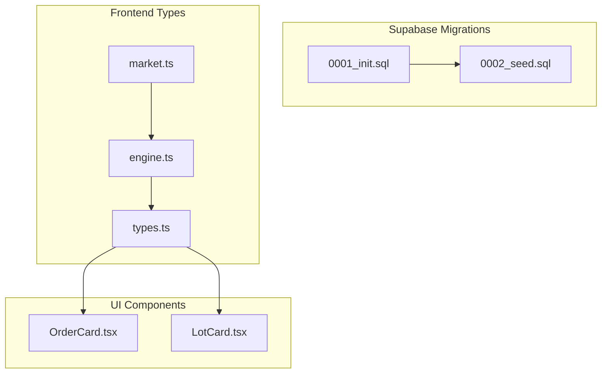

**Diagram sources**
- [0001_init.sql:1-321](file://freshroute/supabase/migrations/0001_init.sql#L1-L321)
- [0002_seed.sql:1-157](file://freshroute/supabase/migrations/0002_seed.sql#L1-L157)
- [types.ts:1-229](file://freshroute/src/types.ts#L1-L229)
- [market.ts:1-189](file://freshroute/src/data/market.ts#L1-L189)
- [engine.ts:1-258](file://freshroute/src/lib/engine.ts#L1-L258)
- [OrderCard.tsx:1-120](file://freshroute/src/components/cards/OrderCard.tsx#L1-L120)
- [LotCard.tsx:1-116](file://freshroute/src/components/cards/LotCard.tsx#L1-L116)

**Section sources**
- [0001_init.sql:1-321](file://freshroute/supabase/migrations/0001_init.sql#L1-L321)
- [0002_seed.sql:1-157](file://freshroute/supabase/migrations/0002_seed.sql#L1-L157)
- [types.ts:1-229](file://freshroute/src/types.ts#L1-L229)

## Core Components
This section summarizes the primary database entities, their fields, constraints, and indexes as defined in the initial migration.

- Profiles (users)
  - Purpose: Represents authenticated users with role-based access (farmer/admin). Mirrors auth.users but not a hard FK to allow seeding without auth rows.
  - Key fields: id (UUID PK), full_name, email, phone, city, address, role (enum-like check), customer_code (unique, generated), source (signup/seed), created_at.
  - RLS: Read own or admin; update own only.
  - Auto-provisioning: Trigger creates profile on user signup.

- Orders
  - Purpose: Captures sale transactions including crop details, quantities, pricing, status, payment state, and step tracking.
  - Key fields: id (text PK), user_id (FK to profiles), crop, quantity_kg, packaging, grade, buyer_name, destination, price_per_kg, gross, net, final_net, status (active/completed/cancelled), payment_status (pending/paid), payment_terms, steps (JSONB), source (agent/seed), created_at, completed_at.
  - Indexes: (user_id, created_at desc), status.
  - RLS: Read own or admin; insert own; update own or admin.

- Reviews
  - Purpose: Ratings and feedback tied to orders and users.
  - Key fields: id (UUID PK), user_id (FK to profiles), order_id (FK to orders), rating (1–5), feedback, created_at.
  - Index: user_id.
  - RLS: Read own or admin; insert own.

- Notifications
  - Purpose: User-specific alerts (delay, price, info, order).
  - Key fields: id (UUID PK), user_id (FK to profiles), title, body, kind (delay/price/info/order), read (boolean), created_at.
  - Index: (user_id, created_at desc).
  - RLS: Read/insert/update own.

- Audit Log
  - Purpose: Immutable record of actions by Agent, You, or System.
  - Key fields: id (UUID PK), user_id (FK to profiles), actor (Agent/You/System), action, approved (boolean), created_at.
  - Index: (user_id, created_at desc).
  - RLS: Read own or admin; insert own.

- Chat Messages and State
  - Chat messages: id (text PK), user_id (FK to profiles), msg (JSONB), created_at. Index on (user_id, created_at). RLS: all own; admin read.
  - Chat state: user_id (PK, FK to profiles), stage, lot (JSONB), scenarios (JSONB), quick_replies (JSONB), updated_at. RLS: all own.

- Image Analyses
  - Purpose: Stores results of vision analysis linked to orders when applicable.
  - Key fields: id (UUID PK), user_id (FK to profiles), order_id (FK to orders, set null on delete), image_path, crop_hint, grade, ripeness, defect_rate, notes (JSONB), confidence, model, source (gemini/fallback), created_at.
  - Index: (user_id, created_at desc).
  - RLS: Read own or admin; insert own.

- AI Usage
  - Purpose: Tracks AI calls made by edge functions or services.
  - Key fields: id (UUID PK), user_id, action, model, status (ok/error), error, latency_ms, created_at.
  - Index: created_at desc.
  - RLS: Read own or admin.

- Customer Metrics View
  - Purpose: Aggregated performance and earnings per user, including total orders, completed/cancelled/active counts, total earned, total sales value, average rating, review count, and a composite score.

- Storage Bucket
  - Purpose: Public bucket for lot photos with policies allowing public read and authenticated upload.

**Section sources**
- [0001_init.sql:23-321](file://freshroute/supabase/migrations/0001_init.sql#L23-L321)

## Architecture Overview
The database supports a secure, row-level isolated environment where each user can only access their own data unless they are an admin. Business logic flows through the frontend and serverless functions, while persistent state is stored in the above tables. The seed script populates demo customers and related orders/reviews to enable development and testing.

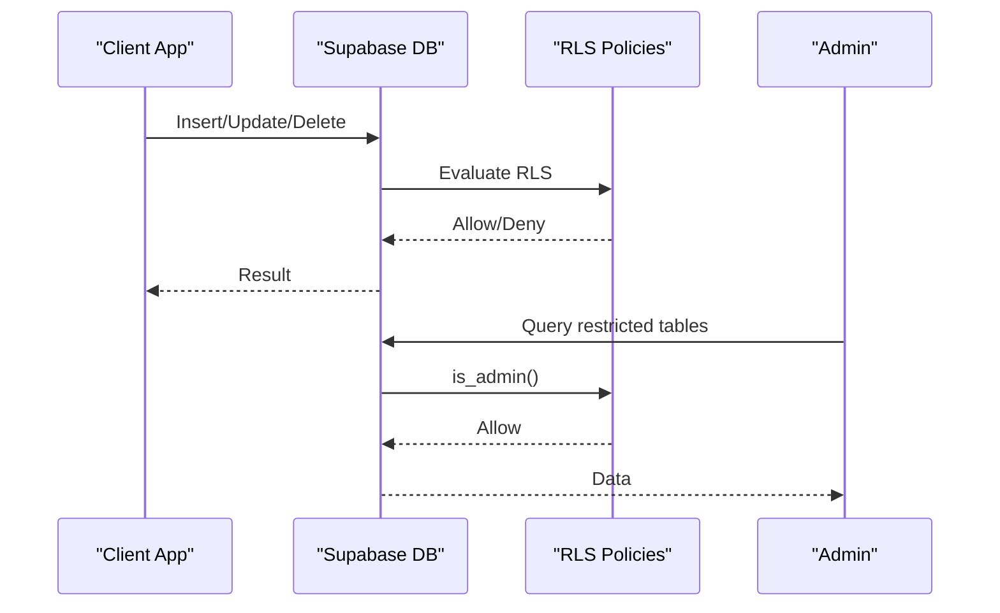

**Diagram sources**
- [0001_init.sql:10-21](file://freshroute/supabase/migrations/0001_init.sql#L10-L21)
- [0001_init.sql:39-48](file://freshroute/supabase/migrations/0001_init.sql#L39-L48)
- [0001_init.sql:100-112](file://freshroute/supabase/migrations/0001_init.sql#L100-L112)
- [0001_init.sql:178-186](file://freshroute/supabase/migrations/0001_init.sql#L178-L186)

## Detailed Component Analysis

### Users (Profiles)
- Fields and constraints:
  - id: UUID primary key, default gen_random_uuid().
  - full_name, email, phone, city, address: text, not null, defaults to empty string.
  - role: text with check constraint ('farmer', 'admin').
  - customer_code: text unique, generated using sequence and prefix.
  - source: text with check constraint ('signup', 'seed').
  - created_at: timestamptz default now().
- RLS policies:
  - Select: own or admin.
  - Update: own only, with role preservation check.
- Trigger:
  - On auth.users insert, create corresponding profile with name from metadata or email prefix.

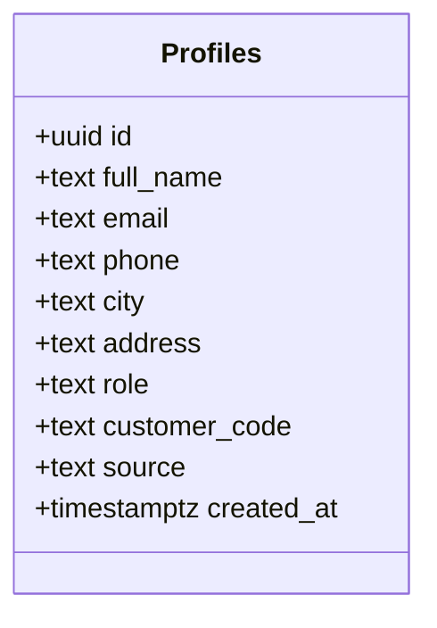

**Diagram sources**
- [0001_init.sql:23-48](file://freshroute/supabase/migrations/0001_init.sql#L23-L48)

**Section sources**
- [0001_init.sql:23-71](file://freshroute/supabase/migrations/0001_init.sql#L23-L71)

### Orders
- Fields and constraints:
  - id: text primary key.
  - user_id: uuid references profiles(id) on delete cascade.
  - crop: text not null.
  - quantity_kg: numeric not null.
  - packaging: text default 'crates'.
  - grade: text default 'B'.
  - buyer_name: text default ''.
  - destination: text default ''.
  - price_per_kg: numeric not null default 0.
  - gross: numeric not null default 0.
  - net: numeric not null default 0.
  - final_net: numeric nullable.
  - status: text check ('active', 'completed', 'cancelled') default 'active'.
  - payment_status: text check ('pending', 'paid') default 'pending'.
  - payment_terms: text default ''.
  - steps: jsonb not null default '[]'.
  - source: text check ('agent', 'seed') default 'agent'.
  - created_at: timestamptz default now().
  - completed_at: timestamptz nullable.
- Indexes:
  - (user_id, created_at desc) for efficient user timeline queries.
  - status for filtering by order lifecycle.
- RLS policies:
  - Select: own or admin.
  - Insert: own.
  - Update: own or admin.

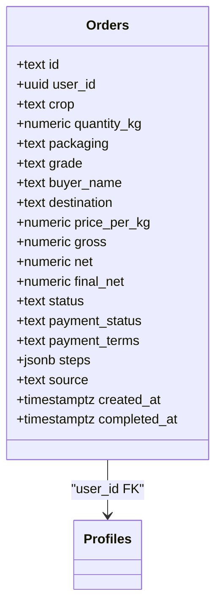

**Diagram sources**
- [0001_init.sql:73-112](file://freshroute/supabase/migrations/0001_init.sql#L73-L112)

**Section sources**
- [0001_init.sql:73-112](file://freshroute/supabase/migrations/0001_init.sql#L73-L112)

### Reviews
- Fields and constraints:
  - id: uuid PK.
  - user_id: uuid references profiles(id) on delete cascade.
  - order_id: text references orders(id) on delete cascade.
  - rating: int check between 1 and 5.
  - feedback: text default ''.
  - created_at: timestamptz default now().
- Index:
  - user_id for user-centric retrieval.
- RLS policies:
  - Select: own or admin.
  - Insert: own.

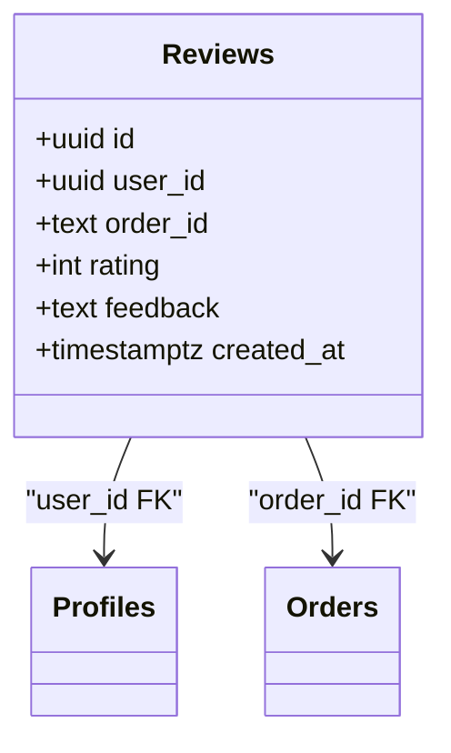

**Diagram sources**
- [0001_init.sql:114-135](file://freshroute/supabase/migrations/0001_init.sql#L114-L135)

**Section sources**
- [0001_init.sql:114-135](file://freshroute/supabase/migrations/0001_init.sql#L114-L135)

### Notifications
- Fields and constraints:
  - id: uuid PK.
  - user_id: uuid references profiles(id) on delete cascade.
  - title: text not null.
  - body: text default ''.
  - kind: text check ('delay', 'price', 'info', 'order') default 'info'.
  - read: boolean default false.
  - created_at: timestamptz default now().
- Index:
  - (user_id, created_at desc) for recent notifications.
- RLS policies:
  - Select/Insert/Update: own only.

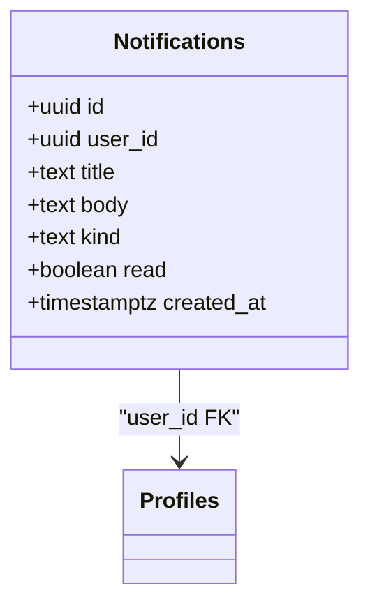

**Diagram sources**
- [0001_init.sql:137-163](file://freshroute/supabase/migrations/0001_init.sql#L137-L163)

**Section sources**
- [0001_init.sql:137-163](file://freshroute/supabase/migrations/0001_init.sql#L137-L163)

### Audit Log
- Fields and constraints:
  - id: uuid PK.
  - user_id: uuid references profiles(id) on delete cascade.
  - actor: text check ('Agent', 'You', 'System').
  - action: text not null.
  - approved: boolean nullable.
  - created_at: timestamptz default now().
- Index:
  - (user_id, created_at desc) for user timelines.
- RLS policies:
  - Select: own or admin.
  - Insert: own.

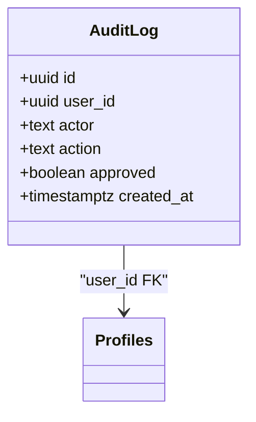

**Diagram sources**
- [0001_init.sql:165-186](file://freshroute/supabase/migrations/0001_init.sql#L165-L186)

**Section sources**
- [0001_init.sql:165-186](file://freshroute/supabase/migrations/0001_init.sql#L165-L186)

### Chat Messages and State
- Chat Messages:
  - id: text PK.
  - user_id: uuid references profiles(id) on delete cascade.
  - msg: jsonb not null.
  - created_at: timestamptz default now().
  - Index: (user_id, created_at).
  - RLS: all own; admin select.
- Chat State:
  - user_id: uuid PK references profiles(id) on delete cascade.
  - stage: text default 'welcome'.
  - lot: jsonb.
  - scenarios: jsonb.
  - quick_replies: jsonb default '[]'.
  - updated_at: timestamptz default now().
  - RLS: all own.

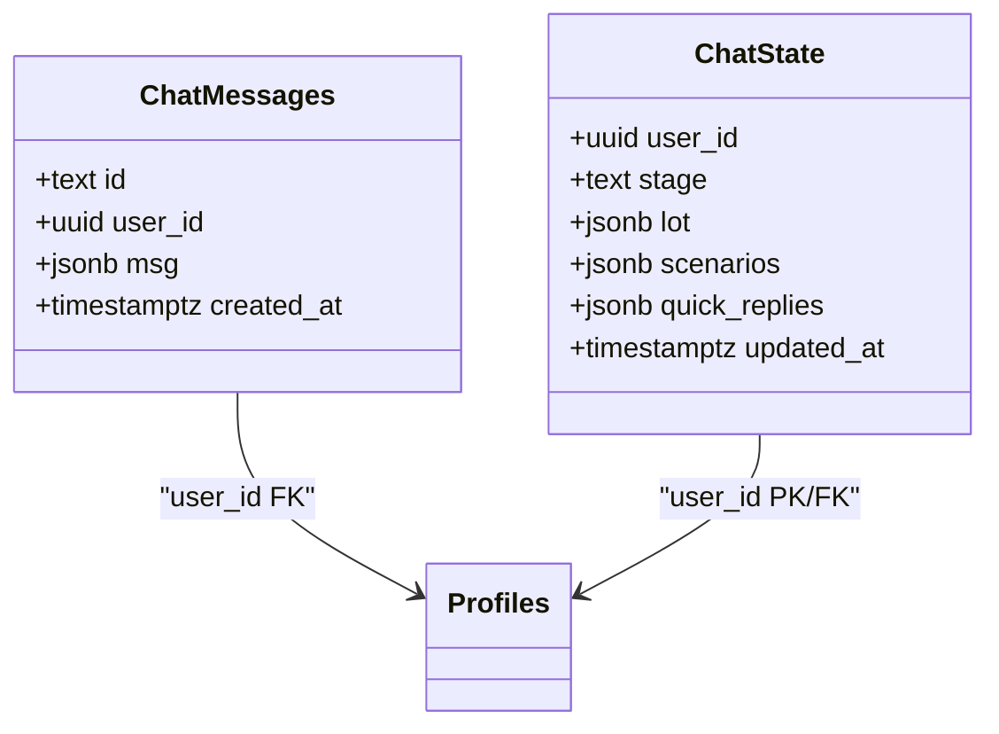

**Diagram sources**
- [0001_init.sql:188-224](file://freshroute/supabase/migrations/0001_init.sql#L188-L224)

**Section sources**
- [0001_init.sql:188-224](file://freshroute/supabase/migrations/0001_init.sql#L188-L224)

### Image Analyses
- Fields and constraints:
  - id: uuid PK.
  - user_id: uuid references profiles(id) on delete cascade.
  - order_id: text references orders(id) on delete set null.
  - image_path: text default ''.
  - crop_hint: text default ''.
  - grade: text default 'B'.
  - ripeness: text default ''.
  - defect_rate: numeric default 0.
  - notes: jsonb default '[]'.
  - confidence: numeric default 0.
  - model: text default ''.
  - source: text check ('gemini', 'fallback') default 'fallback'.
  - created_at: timestamptz default now().
- Index:
  - (user_id, created_at desc).
- RLS policies:
  - Select: own or admin.
  - Insert: own.

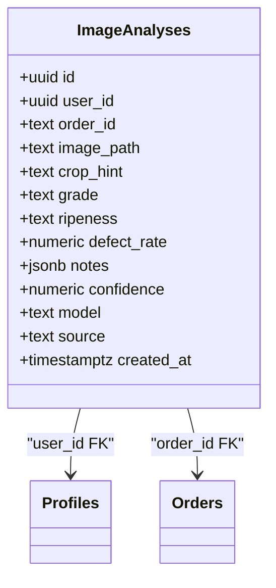

**Diagram sources**
- [0001_init.sql:226-254](file://freshroute/supabase/migrations/0001_init.sql#L226-L254)

**Section sources**
- [0001_init.sql:226-254](file://freshroute/supabase/migrations/0001_init.sql#L226-L254)

### AI Usage
- Fields and constraints:
  - id: uuid PK.
  - user_id: uuid nullable.
  - action: text not null.
  - model: text default ''.
  - status: text check ('ok', 'error') default 'ok'.
  - error: text nullable.
  - latency_ms: int.
  - created_at: timestamptz default now().
- Index:
  - created_at desc.
- RLS policies:
  - Select: own or admin.

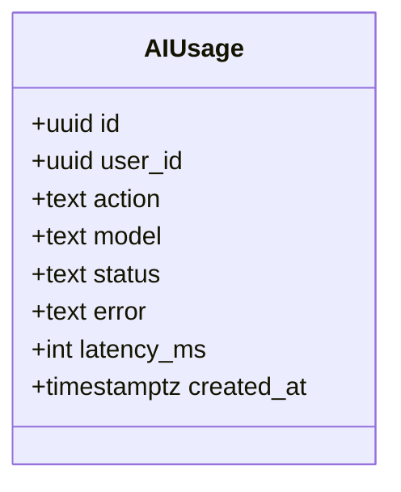

**Diagram sources**
- [0001_init.sql:256-275](file://freshroute/supabase/migrations/0001_init.sql#L256-L275)

**Section sources**
- [0001_init.sql:256-275](file://freshroute/supabase/migrations/0001_init.sql#L256-L275)

### Customer Metrics View
- Purpose: Provides aggregated metrics per user including order counts, earnings, ratings, and a composite score based on average rating, completion rate, and non-cancellation rate.

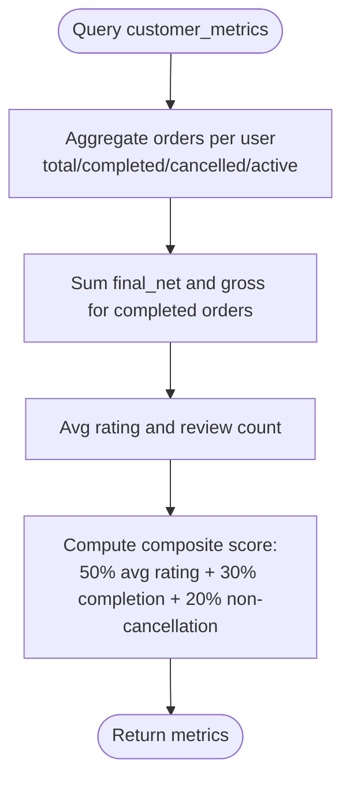

**Diagram sources**
- [0001_init.sql:277-306](file://freshroute/supabase/migrations/0001_init.sql#L277-L306)

**Section sources**
- [0001_init.sql:277-306](file://freshroute/supabase/migrations/0001_init.sql#L277-L306)

### Storage Bucket
- Purpose: Public bucket for lot photos with policies enabling public read and authenticated uploads.

**Section sources**
- [0001_init.sql:308-321](file://freshroute/supabase/migrations/0001_init.sql#L308-L321)

## Dependency Analysis
The following diagram shows key foreign key relationships and index usage across tables.

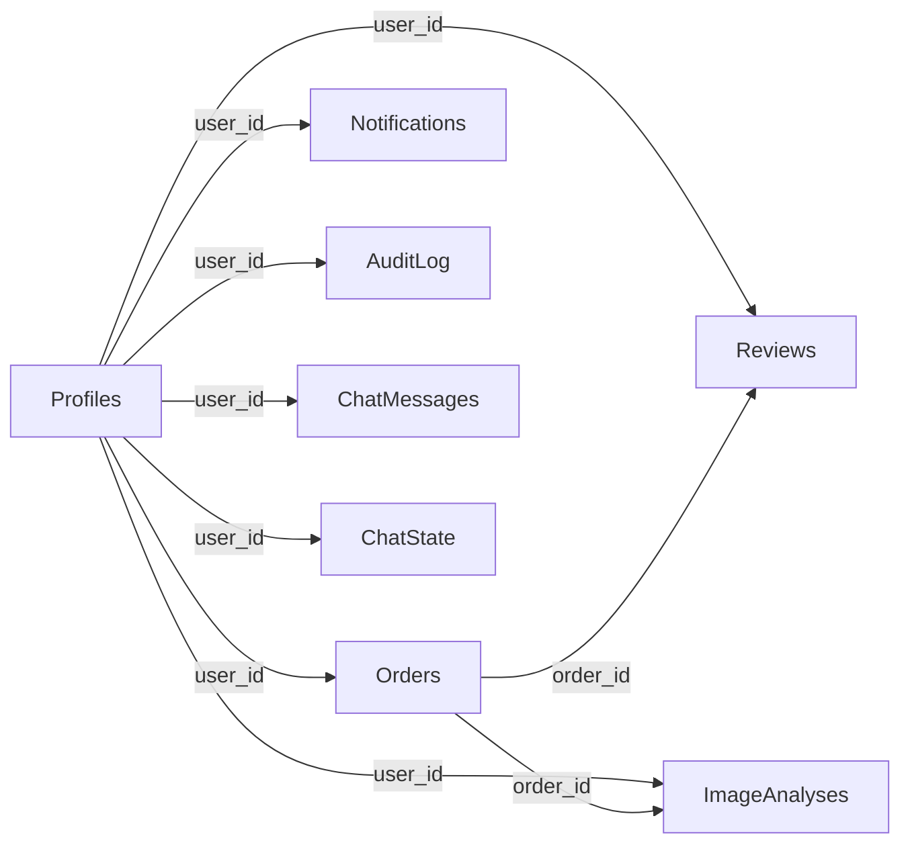

**Diagram sources**
- [0001_init.sql:73-112](file://freshroute/supabase/migrations/0001_init.sql#L73-L112)
- [0001_init.sql:114-135](file://freshroute/supabase/migrations/0001_init.sql#L114-L135)
- [0001_init.sql:137-163](file://freshroute/supabase/migrations/0001_init.sql#L137-L163)
- [0001_init.sql:165-186](file://freshroute/supabase/migrations/0001_init.sql#L165-L186)
- [0001_init.sql:188-224](file://freshroute/supabase/migrations/0001_init.sql#L188-L224)
- [0001_init.sql:226-254](file://freshroute/supabase/migrations/0001_init.sql#L226-L254)

**Section sources**
- [0001_init.sql:73-254](file://freshroute/supabase/migrations/0001_init.sql#L73-L254)

## Performance Considerations
- Indexes:
  - Orders: (user_id, created_at desc) optimizes user timelines and recent order queries; status index supports filtering by lifecycle.
  - Reviews: user_id index speeds up user-centric review retrieval.
  - Notifications: (user_id, created_at desc) improves recent notification lists.
  - Audit log: (user_id, created_at desc) enhances audit timeline queries.
  - Chat messages: (user_id, created_at) supports message history.
  - Image analyses: (user_id, created_at desc) aids recent analysis retrieval.
  - AI usage: created_at desc supports time-based analytics.
- JSONB fields:
  - Steps in orders and chat messages leverage JSONB for flexible structures; considerGIN indexes if querying nested keys frequently.
- Row Level Security:
  - RLS policies reduce overhead by enforcing access control at the query level; ensure queries include user context to avoid scanning entire tables.
- Views:
  - customer_metrics view aggregates data efficiently; consider materializing if used heavily in dashboards.

[No sources needed since this section provides general guidance]

## Troubleshooting Guide
- Authentication and RLS issues:
  - Ensure auth.uid() is available; verify policies allow intended operations.
  - Use is_admin() function to test admin access.
- Seed data conflicts:
  - Seed script inserts demo customers and orders; re-running may cause duplicates due to unique constraints (e.g., emails, customer codes).
- Foreign key violations:
  - Deleting profiles cascades to dependent tables; ensure referential integrity before deletes.
- JSONB updates:
  - Validate JSONB schemas in application code to prevent malformed data in steps, messages, or scenarios.

**Section sources**
- [0001_init.sql:10-21](file://freshroute/supabase/migrations/0001_init.sql#L10-L21)
- [0002_seed.sql:1-157](file://freshroute/supabase/migrations/0002_seed.sql#L1-L157)

## Conclusion
FreshRoute’s database schema provides a robust foundation for managing agricultural supply chain operations with strong security via RLS, comprehensive auditability, and flexible data modeling using JSONB. The migration strategy separates schema definition from seed data, enabling controlled evolution and reproducible environments. Application-side types and engines complement the database by modeling transient entities like lots, buyers, transporters, and scenarios, ensuring a cohesive system architecture.

[No sources needed since this section summarizes without analyzing specific files]

## Appendices

### Migration Strategy
- Versioned SQL migrations:
  - 0001_init.sql defines schema, RLS, triggers, and storage buckets.
  - 0002_seed.sql populates demo data after schema creation.
- Best practices:
  - Keep migrations idempotent where possible.
  - Use transactions for seed data to maintain consistency.
  - Document changes in migration comments for traceability.

**Section sources**
- [0001_init.sql:1-321](file://freshroute/supabase/migrations/0001_init.sql#L1-L321)
- [0002_seed.sql:1-157](file://freshroute/supabase/migrations/0002_seed.sql#L1-L157)

### Seed Data Structure
- Demo customers:
  - Profiles with source='seed' and realistic names, emails, phones, cities, addresses.
- Orders and reviews:
  - Randomized crops, quantities, prices, statuses, and payment terms.
  - Reviews attached to ~70% of completed orders with varied feedback.

**Section sources**
- [0002_seed.sql:8-157](file://freshroute/supabase/migrations/0002_seed.sql#L8-L157)

### Data Validation Rules and Business Constraints
- Enum-like checks:
  - Roles, statuses, payment statuses, actors, kinds, sources.
- Numeric ranges:
  - Ratings constrained between 1 and 5.
- Referential integrity:
  - Foreign keys enforce relationships between profiles, orders, reviews, and image analyses.
- Defaults:
  - Many fields have sensible defaults to support partial updates and seed data.

**Section sources**
- [0001_init.sql:23-321](file://freshroute/supabase/migrations/0001_init.sql#L23-L321)

### Common Queries and Access Patterns
- Recent orders for a user:
  - Use orders_user_created_idx for efficient retrieval.
- Active orders:
  - Filter by status using orders_status_idx.
- User notifications:
  - Retrieve unread notifications ordered by created_at.
- Audit trails:
  - Query audit_log by user_id and created_at for timelines.
- Customer metrics:
  - Use customer_metrics view for dashboard aggregations.

[No sources needed since this section provides general guidance]

### Frontend Integration Notes
- Supabase client configuration:
  - Environment variables for URL and anon key; session persistence enabled.
- Type mappings:
  - TypeScript interfaces align with database entities (e.g., Order, Profile) and runtime models (e.g., Lot, Scenario).
- UI components:
  - OrderCard and LotCard render persisted and computed data respectively.

**Section sources**
- [supabase.ts:1-20](file://freshroute/src/lib/supabase.ts#L1-L20)
- [types.ts:1-229](file://freshroute/src/types.ts#L1-L229)
- [OrderCard.tsx:1-120](file://freshroute/src/components/cards/OrderCard.tsx#L1-L120)
- [LotCard.tsx:1-116](file://freshroute/src/components/cards/LotCard.tsx#L1-L116)