# Database Schema & Migrations

<cite>
**Referenced Files in This Document**
- [0001_init.sql](file://freshroute/supabase/migrations/0001_init.sql)
- [0002_seed.sql](file://freshroute/supabase/migrations/0002_seed.sql)
- [0003_multi_role.sql](file://freshroute/supabase/migrations/0003_multi_role.sql)
- [0004_listings.sql](file://freshroute/supabase/migrations/0004_listings.sql)
- [0005_marketplace_tables.sql](file://freshroute/supabase/migrations/0005_marketplace_tables.sql)
- [0006_seed_marketplace.sql](file://freshroute/supabase/migrations/0006_seed_marketplace.sql)
- [supabase.ts](file://freshroute/src/lib/supabase.ts)
- [types.ts](file://freshroute/src/types.ts)
- [market.ts](file://freshroute/src/data/market.ts)
- [db.ts](file://freshroute/src/lib/db.ts)
- [BrowseListingsPage.tsx](file://freshroute/src/pages/BrowseListingsPage.tsx)
</cite>

## Update Summary
**Changes Made**
- Added comprehensive multi-role user support with user_roles and role_profiles tables
- Implemented unified listings model supporting multiple listing types (lot, storage_slot, transport_slot, buyer_request)
- Expanded marketplace data structures with offers, order_events, spoilage_assessments, recommendations, transport_bookings, and storage_bookings tables
- Added agent action logging for audit trail functionality
- Enhanced orders table with foreign key relationships to marketplace entities
- Integrated frontend components for marketplace browsing and listing management
- Updated seed data to populate marketplace demo scenarios

## Table of Contents
1. [Introduction](#introduction)
2. [Project Structure](#project-structure)
3. [Core Components](#core-components)
4. [Architecture Overview](#architecture-overview)
5. [Detailed Component Analysis](#detailed-component-analysis)
6. [Marketplace Ecosystem](#marketplace-ecosystem)
7. [Multi-Role User System](#multi-role-user-system)
8. [Dependency Analysis](#dependency-analysis)
9. [Performance Considerations](#performance-considerations)
10. [Troubleshooting Guide](#troubleshooting-guide)
11. [Conclusion](#conclusion)
12. [Appendices](#appendices)

## Introduction
This document describes FreshRoute's comprehensive Supabase PostgreSQL database schema and migration strategy, focusing on the complete agricultural supply chain ecosystem. The system now supports multi-role users, a unified marketplace with diverse listing types, comprehensive offer management, logistics coordination, and detailed audit trails. It encompasses core supply chain entities including users with multiple roles, orders, reviews, notifications, audit logs, chat messages/state, image analyses, AI usage, customer metrics, marketplace listings, offers, transport and storage bookings, spoilage assessments, and agent action logs.

## Project Structure
The database schema is defined via versioned SQL migrations under the Supabase project directory, with progressive enhancements from basic supply chain operations to a full marketplace ecosystem. Seed data provides comprehensive demo records for development and testing. The frontend uses TypeScript types to model domain objects, with some being transient while others map closely to persisted tables.

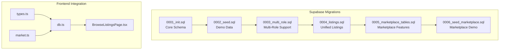

**Diagram sources**
- [0001_init.sql:1-321](file://freshroute/supabase/migrations/0001_init.sql#L1-L321)
- [0002_seed.sql:1-157](file://freshroute/supabase/migrations/0002_seed.sql#L1-L157)
- [0003_multi_role.sql:1-148](file://freshroute/supabase/migrations/0003_multi_role.sql#L1-L148)
- [0004_listings.sql:1-50](file://freshroute/supabase/migrations/0004_listings.sql#L1-L50)
- [0005_marketplace_tables.sql:1-134](file://freshroute/supabase/migrations/0005_marketplace_tables.sql#L1-L134)
- [0006_seed_marketplace.sql:1-61](file://freshroute/supabase/migrations/0006_seed_marketplace.sql#L1-L61)

**Section sources**
- [0001_init.sql:1-321](file://freshroute/supabase/migrations/0001_init.sql#L1-L321)
- [0002_seed.sql:1-157](file://freshroute/supabase/migrations/0002_seed.sql#L1-L157)
- [0003_multi_role.sql:1-148](file://freshroute/supabase/migrations/0003_multi_role.sql#L1-L148)
- [0004_listings.sql:1-50](file://freshroute/supabase/migrations/0004_listings.sql#L1-L50)
- [0005_marketplace_tables.sql:1-134](file://freshroute/supabase/migrations/0005_marketplace_tables.sql#L1-L134)
- [0006_seed_marketplace.sql:1-61](file://freshroute/supabase/migrations/0006_seed_marketplace.sql#L1-L61)

## Core Components
This section summarizes the primary database entities established in the initial migration, which form the foundation of the supply chain management system.

### Profiles (Users)
- Purpose: Represents authenticated users with role-based access control (farmer/admin). Mirrors auth.users but not a hard FK to allow seeding without auth rows.
- Key fields: id (UUID PK), full_name, email, phone, city, address, role (enum-like check), customer_code (unique, generated), source (signup/seed), created_at.
- RLS: Read own or admin; update own only.
- Auto-provisioning: Trigger creates profile on user signup.

### Orders
- Purpose: Captures sale transactions including crop details, quantities, pricing, status, payment state, and step tracking.
- Key fields: id (text PK), user_id (FK to profiles), crop, quantity_kg, packaging, grade, buyer_name, destination, price_per_kg, gross, net, final_net, status (active/completed/cancelled), payment_status (pending/paid), payment_terms, steps (JSONB), source (agent/seed), created_at, completed_at.
- Indexes: (user_id, created_at desc), status.
- RLS: Read own or admin; insert own; update own or admin.

### Reviews
- Purpose: Ratings and feedback tied to orders and users.
- Key fields: id (UUID PK), user_id (FK to profiles), order_id (FK to orders), rating (1–5), feedback, created_at.
- Index: user_id.
- RLS: Read own or admin; insert own.

### Notifications
- Purpose: User-specific alerts (delay, price, info, order).
- Key fields: id (UUID PK), user_id (FK to profiles), title, body, kind (delay/price/info/order), read (boolean), created_at.
- Index: (user_id, created_at desc).
- RLS: Read/insert/update own.

### Audit Log
- Purpose: Immutable record of actions by Agent, You, or System.
- Key fields: id (UUID PK), user_id (FK to profiles), actor (Agent/You/System), action, approved (boolean), created_at.
- Index: (user_id, created_at desc).
- RLS: Read own or admin; insert own.

### Chat Messages and State
- Chat messages: id (text PK), user_id (FK to profiles), msg (JSONB), created_at. Index on (user_id, created_at). RLS: all own; admin read.
- Chat state: user_id (PK, FK to profiles), stage, lot (JSONB), scenarios (JSONB), quick_replies (JSONB), updated_at. RLS: all own.

### Image Analyses
- Purpose: Stores results of vision analysis linked to orders when applicable.
- Key fields: id (UUID PK), user_id (FK to profiles), order_id (FK to orders, set null on delete), image_path, crop_hint, grade, ripeness, defect_rate, notes (JSONB), confidence, model, source (gemini/fallback), created_at.
- Index: (user_id, created_at desc).
- RLS: Read own or admin; insert own.

### AI Usage
- Purpose: Tracks AI calls made by edge functions or services.
- Key fields: id (UUID PK), user_id, action, model, status (ok/error), error, latency_ms, created_at.
- Index: created_at desc.
- RLS: Read own or admin.

### Customer Metrics View
- Purpose: Aggregated performance and earnings per user, including total orders, completed/cancelled/active counts, total earned, total sales value, average rating, review count, and a composite score.

### Storage Bucket
- Purpose: Public bucket for lot photos with policies allowing public read and authenticated upload.

**Section sources**
- [0001_init.sql:23-321](file://freshroute/supabase/migrations/0001_init.sql#L23-L321)

## Architecture Overview
The database supports a secure, row-level isolated environment where each user can only access their own data unless they are an admin. Business logic flows through the frontend and serverless functions, while persistent state is stored in the above tables. The seed script populates demo customers and related orders/reviews to enable development and testing.

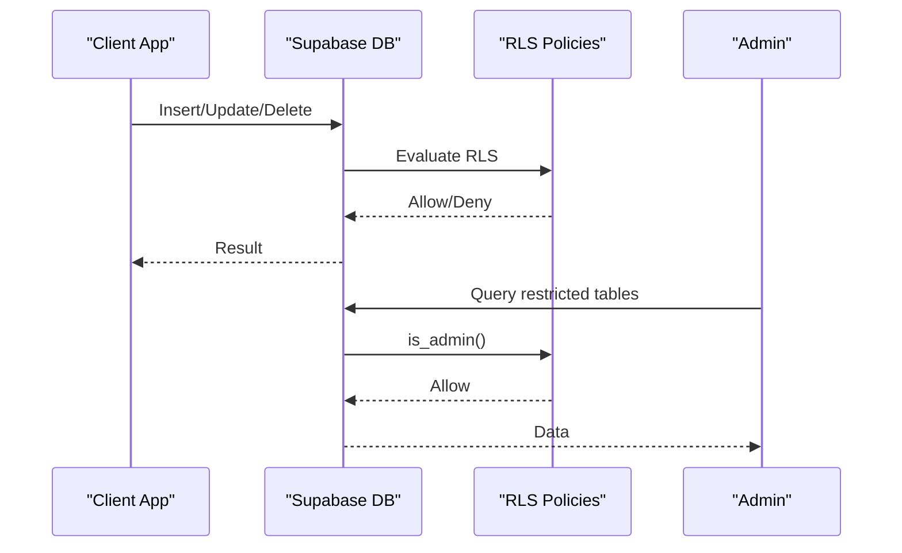

**Diagram sources**
- [0001_init.sql:10-21](file://freshroute/supabase/migrations/0001_init.sql#L10-L21)
- [0001_init.sql:39-48](file://freshroute/supabase/migrations/0001_init.sql#L39-L48)
- [0001_init.sql:100-112](file://freshroute/supabase/migrations/0001_init.sql#L100-L112)
- [0001_init.sql:178-186](file://freshroute/supabase/migrations/0001_init.sql#L178-L186)

## Detailed Component Analysis

### Users (Profiles)
- Fields and constraints:
  - id: UUID primary key, default gen_random_uuid().
  - full_name, email, phone, city, address: text, not null, defaults to empty string.
  - role: text with check constraint ('farmer', 'admin').
  - customer_code: text unique, generated using sequence and prefix.
  - source: text with check constraint ('signup', 'seed').
  - created_at: timestamptz default now().
- RLS policies:
  - Select: own or admin.
  - Update: own only, with role preservation check.
- Trigger:
  - On auth.users insert, create corresponding profile with name from metadata or email prefix.

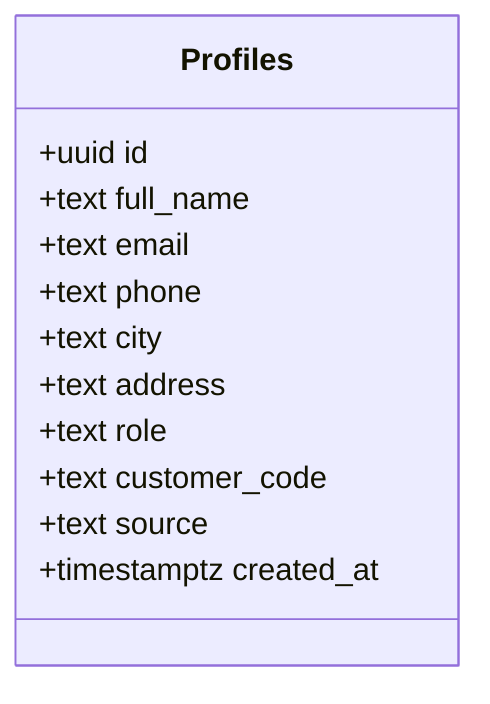

**Diagram sources**
- [0001_init.sql:23-48](file://freshroute/supabase/migrations/0001_init.sql#L23-L48)

**Section sources**
- [0001_init.sql:23-71](file://freshroute/supabase/migrations/0001_init.sql#L23-L71)

### Orders
- Fields and constraints:
  - id: text primary key.
  - user_id: uuid references profiles(id) on delete cascade.
  - crop: text not null.
  - quantity_kg: numeric not null.
  - packaging: text default 'crates'.
  - grade: text default 'B'.
  - buyer_name: text default ''.
  - destination: text default ''.
  - price_per_kg: numeric not null default 0.
  - gross: numeric not null default 0.
  - net: numeric not null default 0.
  - final_net: numeric nullable.
  - status: text check ('active', 'completed', 'cancelled') default 'active'.
  - payment_status: text check ('pending', 'paid') default 'pending'.
  - payment_terms: text default ''.
  - steps: jsonb not null default '[]'.
  - source: text check ('agent', 'seed') default 'agent'.
  - created_at: timestamptz default now().
  - completed_at: timestamptz nullable.
- Indexes:
  - (user_id, created_at desc) for efficient user timeline queries.
  - status for filtering by order lifecycle.
- RLS policies:
  - Select: own or admin.
  - Insert: own.
  - Update: own or admin.

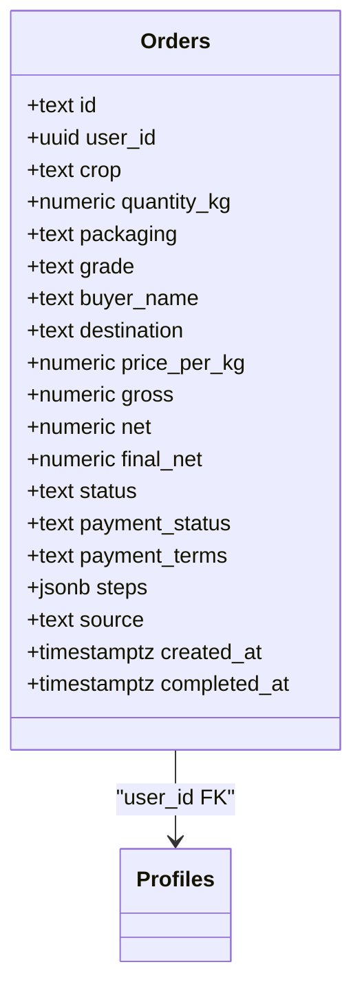

**Diagram sources**
- [0001_init.sql:73-112](file://freshroute/supabase/migrations/0001_init.sql#L73-L112)

**Section sources**
- [0001_init.sql:73-112](file://freshroute/supabase/migrations/0001_init.sql#L73-L112)

### Reviews
- Fields and constraints:
  - id: uuid PK.
  - user_id: uuid references profiles(id) on delete cascade.
  - order_id: text references orders(id) on delete cascade.
  - rating: int check between 1 and 5.
  - feedback: text default ''.
  - created_at: timestamptz default now().
- Index:
  - user_id for user-centric retrieval.
- RLS policies:
  - Select: own or admin.
  - Insert: own.

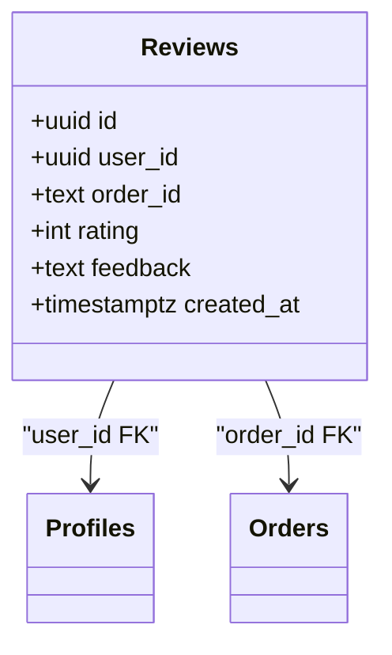

**Diagram sources**
- [0001_init.sql:114-135](file://freshroute/supabase/migrations/0001_init.sql#L114-L135)

**Section sources**
- [0001_init.sql:114-135](file://freshroute/supabase/migrations/0001_init.sql#L114-L135)

### Notifications
- Fields and constraints:
  - id: uuid PK.
  - user_id: uuid references profiles(id) on delete cascade.
  - title: text not null.
  - body: text default ''.
  - kind: text check ('delay', 'price', 'info', 'order') default 'info'.
  - read: boolean default false.
  - created_at: timestamptz default now().
- Index:
  - (user_id, created_at desc) for recent notifications.
- RLS policies:
  - Select/Insert/Update: own only.

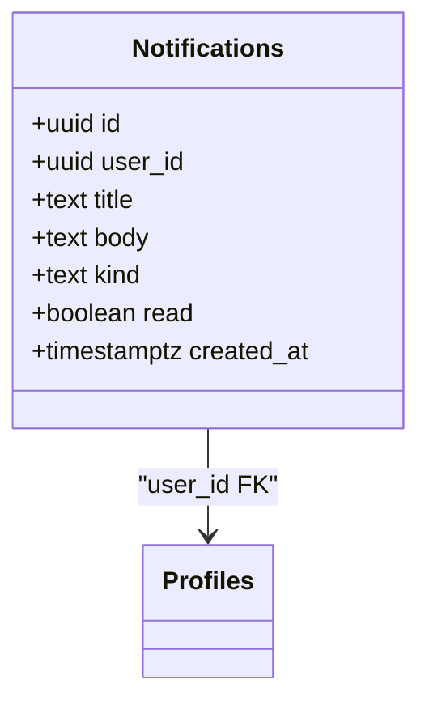

**Diagram sources**
- [0001_init.sql:137-163](file://freshroute/supabase/migrations/0001_init.sql#L137-L163)

**Section sources**
- [0001_init.sql:137-163](file://freshroute/supabase/migrations/0001_init.sql#L137-L163)

### Audit Log
- Fields and constraints:
  - id: uuid PK.
  - user_id: uuid references profiles(id) on delete cascade.
  - actor: text check ('Agent', 'You', 'System').
  - action: text not null.
  - approved: boolean nullable.
  - created_at: timestamptz default now().
- Index:
  - (user_id, created_at desc) for user timelines.
- RLS policies:
  - Select: own or admin.
  - Insert: own.

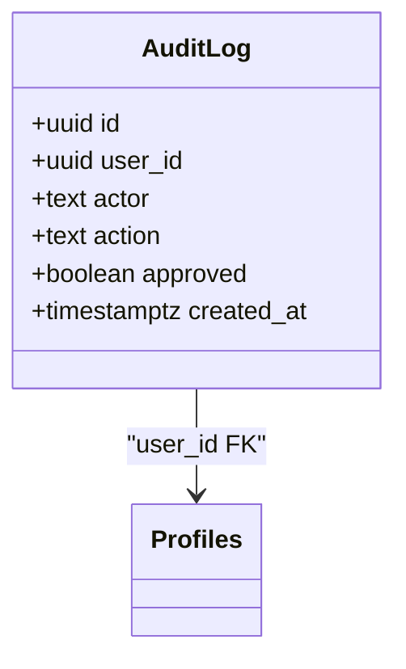

**Diagram sources**
- [0001_init.sql:165-186](file://freshroute/supabase/migrations/0001_init.sql#L165-L186)

**Section sources**
- [0001_init.sql:165-186](file://freshroute/supabase/migrations/0001_init.sql#L165-L186)

### Chat Messages and State
- Chat Messages:
  - id: text PK.
  - user_id: uuid references profiles(id) on delete cascade.
  - msg: jsonb not null.
  - created_at: timestamptz default now().
  - Index: (user_id, created_at).
  - RLS: all own; admin select.
- Chat State:
  - user_id: uuid PK references profiles(id) on delete cascade.
  - stage: text default 'welcome'.
  - lot: jsonb.
  - scenarios: jsonb.
  - quick_replies: jsonb default '[]'.
  - updated_at: timestamptz default now().
  - RLS: all own.

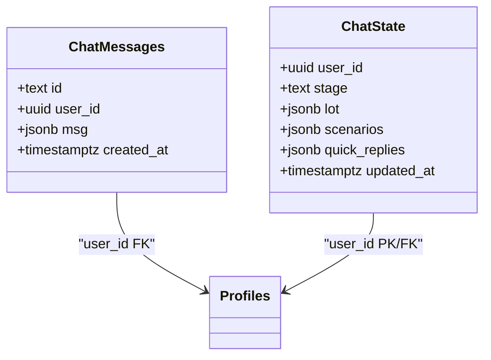

**Diagram sources**
- [0001_init.sql:188-224](file://freshroute/supabase/migrations/0001_init.sql#L188-L224)

**Section sources**
- [0001_init.sql:188-224](file://freshroute/supabase/migrations/0001_init.sql#L188-L224)

### Image Analyses
- Fields and constraints:
  - id: uuid PK.
  - user_id: uuid references profiles(id) on delete cascade.
  - order_id: text references orders(id) on delete set null.
  - image_path: text default ''.
  - crop_hint: text default ''.
  - grade: text default 'B'.
  - ripeness: text default ''.
  - defect_rate: numeric default 0.
  - notes: jsonb default '[]'.
  - confidence: numeric default 0.
  - model: text default ''.
  - source: text check ('gemini', 'fallback') default 'fallback'.
  - created_at: timestamptz default now().
- Index:
  - (user_id, created_at desc).
- RLS policies:
  - Select: own or admin.
  - Insert: own.

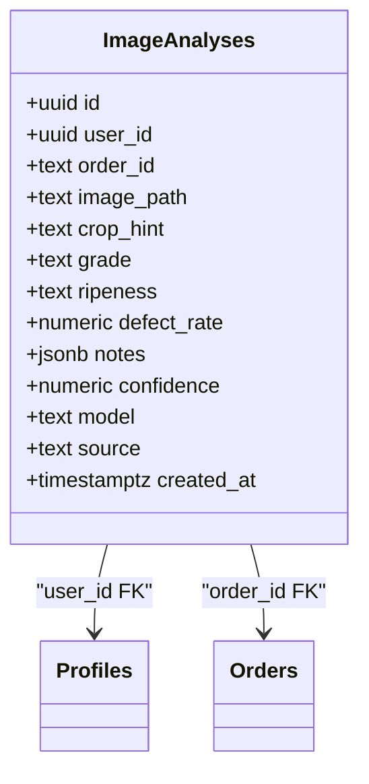

**Diagram sources**
- [0001_init.sql:226-254](file://freshroute/supabase/migrations/0001_init.sql#L226-L254)

**Section sources**
- [0001_init.sql:226-254](file://freshroute/supabase/migrations/0001_init.sql#L226-L254)

### AI Usage
- Fields and constraints:
  - id: uuid PK.
  - user_id: uuid nullable.
  - action: text not null.
  - model: text default ''.
  - status: text check ('ok', 'error') default 'ok'.
  - error: text nullable.
  - latency_ms: int.
  - created_at: timestamptz default now().
- Index:
  - created_at desc.
- RLS policies:
  - Select: own or admin.

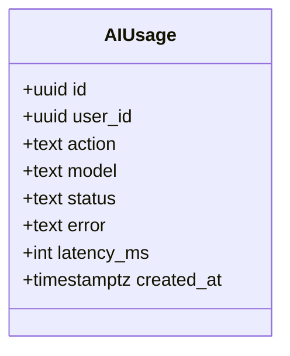

**Diagram sources**
- [0001_init.sql:256-275](file://freshroute/supabase/migrations/0001_init.sql#L256-L275)

**Section sources**
- [0001_init.sql:256-275](file://freshroute/supabase/migrations/0001_init.sql#L256-L275)

### Customer Metrics View
- Purpose: Provides aggregated metrics per user including order counts, earnings, ratings, and a composite score based on average rating, completion rate, and non-cancellation rate.

**Diagram sources**
- [0001_init.sql:277-306](file://freshroute/supabase/migrations/0001_init.sql#L277-L306)

**Section sources**
- [0001_init.sql:277-306](file://freshroute/supabase/migrations/0001_init.sql#L277-L306)

### Storage Bucket
- Purpose: Public bucket for lot photos with policies enabling public read and authenticated uploads.

**Section sources**
- [0001_init.sql:308-321](file://freshroute/supabase/migrations/0001_init.sql#L308-L321)

## Marketplace Ecosystem

### Unified Listings Model
The marketplace introduces a flexible, unified listings system that supports multiple listing types through a single table with type-specific attributes stored as JSONB.

#### Listings Table
- Purpose: Central marketplace entity supporting produce lots, storage slots, transport capacity, and buyer requests.
- Key fields: id (text PK), owner_user_id (FK to profiles), listing_type (lot/storage_slot/transport_slot/buyer_request), commodity, quantity, unit, location_geo, price, available_from/to, attributes (JSONB), status (active/sold/expired/cancelled), created_at.
- Indexes: Composite index on (listing_type, commodity, status), owner timeline index, status filter index.
- RLS: Public read of active listings; owner-only write operations; admin full access.

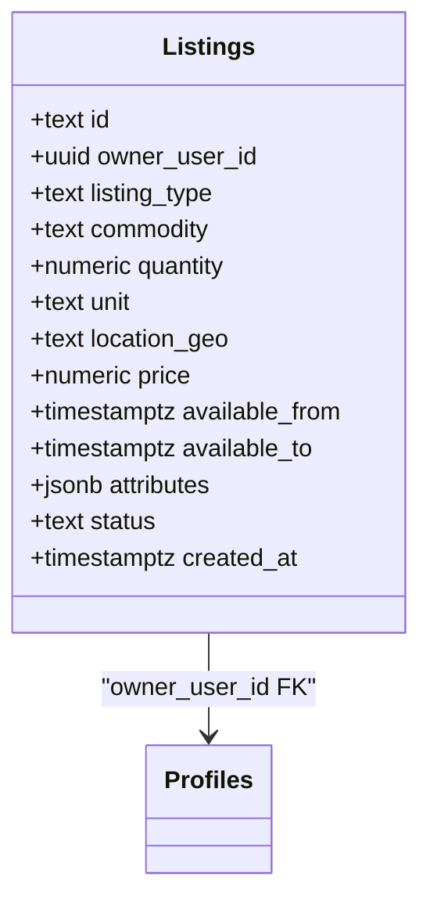

**Diagram sources**
- [0004_listings.sql:5-19](file://freshroute/supabase/migrations/0004_listings.sql#L5-L19)

**Section sources**
- [0004_listings.sql:1-50](file://freshroute/supabase/migrations/0004_listings.sql#L1-L50)

### Offers Management
- Purpose: Facilitates negotiation between buyers and sellers through structured offers.
- Key fields: id (text PK), listing_id (FK to listings), offering_user_id (FK to profiles), price, quantity, message, status (pending/accepted/rejected/countered), created_at.
- Index: (listing_id, created_at desc) for offer history.
- RLS: Listing owners and offer creators can view; users can create offers.

### Order Events (Audit Trail)
- Purpose: Comprehensive audit trail for order lifecycle events with structured payloads.
- Key fields: id (text PK), order_id (FK to orders), event_type, payload (JSONB), created_at.
- Index: (order_id, created_at) for event timelines.
- RLS: Order participants can view events; system can insert events.

### Spoilage Assessments
- Purpose: AI-powered quality assessment for perishable goods with risk scoring and factor analysis.
- Key fields: id (text PK), listing_id (FK to listings), computed_at, risk_score, est_loss_pct, factors (JSONB).
- Index: (listing_id, computed_at desc) for assessment history.
- RLS: Listing owners can manage assessments.

### Recommendations Engine
- Purpose: AI-generated optimization suggestions for listings with option tracking.
- Key fields: id (text PK), listing_id (FK to listings), generated_at, options (JSONB), chosen_option, status (generated/accepted/expired).
- Index: (listing_id, generated_at desc) for recommendation history.
- RLS: Listing owners can manage recommendations.

### Transport Bookings
- Purpose: Coordinates transportation logistics between orders and transport providers.
- Key fields: id (text PK), order_id (FK to orders), transporter_user_id (FK to profiles), pickup_window, dropoff_window, rate, status (pending/confirmed/in_transit/completed/cancelled), created_at.
- Index: order_id for booking lookup.
- RLS: Order participants and transporters can view; system can create bookings.

### Storage Bookings
- Purpose: Manages cold storage and warehousing reservations for agricultural products.
- Key fields: id (text PK), order_id_or_lot_id, storage_user_id (FK to profiles), start_date, end_date, rate, status (pending/confirmed/active/completed/cancelled), created_at.
- Index: storage_user_id for provider schedules.
- RLS: Storage providers can manage their bookings.

### Agent Action Log
- Purpose: Comprehensive audit trail for AI agent operations with approval workflows.
- Key fields: id (text PK), agent_run_id, action_type, input (JSONB), output (JSONB), requires_approval, approved_by, approved_at, executed_at, status (pending/executed/failed/skipped).
- Indexes: (agent_run_id, executed_at), status for filtering.
- RLS: Public read; system can insert actions.

### Enhanced Orders Table
- Purpose: Extended order management with marketplace integration.
- New fields: offer_id (FK to offers), transport_booking_id (FK to transport_bookings), storage_booking_id (FK to storage_bookings).
- Relationships: Links orders to marketplace entities for complete supply chain visibility.

**Section sources**
- [0005_marketplace_tables.sql:1-134](file://freshroute/supabase/migrations/0005_marketplace_tables.sql#L1-L134)

## Multi-Role User System

### User Roles (Many-to-Many Relationship)
- Purpose: Enables users to hold multiple roles simultaneously (e.g., farmer + buyer + transporter).
- Key fields: id (UUID PK), user_id (FK to profiles), role (farmer/buyer/transporter/storage_provider), status (active/pending/disabled), created_at.
- Constraints: Unique (user_id, role) prevents duplicate role assignments.
- Indexes: user_id and role for efficient role lookups.
- RLS: Users can manage their own roles; admins have full access.

### Role Profiles (Extended Profile Data)
- Purpose: Stores role-specific extended profile information as JSONB for flexibility.
- FarmerProfile: farm_location, primary_crops
- BuyerProfile: org_name, typical_commodities, delivery_regions, price_ceiling
- TransporterProfile: vehicle_type, capacity_kg, refrigerated, service_area
- StorageProviderProfile: facility_type, capacity_units, temp_range, certifications
- Key fields: id (UUID PK), user_role_id (FK to user_roles), profile_json (JSONB), updated_at.
- Constraints: Unique (user_role_id) ensures one profile per role.
- Index: user_role_id for profile lookup.
- RLS: Users can manage profiles for their own roles; admins have full access.

### Migration and Synchronization
- Automatic role migration: Existing profiles.role values copied to user_roles during migration.
- Primary role synchronization: Trigger maintains backward compatibility by updating profiles.role with the first active role.
- Auto-farmer assignment: New users automatically receive farmer role upon signup.

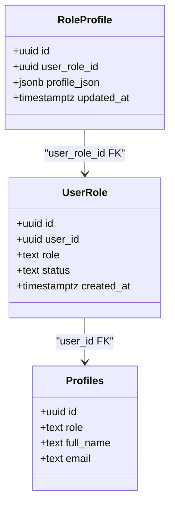

**Diagram sources**
- [0003_multi_role.sql:7-14](file://freshroute/supabase/migrations/0003_multi_role.sql#L7-L14)
- [0003_multi_role.sql:41-47](file://freshroute/supabase/migrations/0003_multi_role.sql#L41-L47)
- [0001_init.sql:26-37](file://freshroute/supabase/migrations/0001_init.sql#L26-L37)

**Section sources**
- [0003_multi_role.sql:1-148](file://freshroute/supabase/migrations/0003_multi_role.sql#L1-L148)

## Dependency Analysis
The following diagram shows the comprehensive relationship network across all database tables, highlighting the evolution from basic supply chain to full marketplace ecosystem.

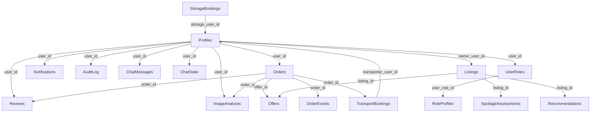

**Diagram sources**
- [0001_init.sql:73-254](file://freshroute/supabase/migrations/0001_init.sql#L73-L254)
- [0003_multi_role.sql:7-47](file://freshroute/supabase/migrations/0003_multi_role.sql#L7-L47)
- [0004_listings.sql:5-19](file://freshroute/supabase/migrations/0004_listings.sql#L5-L19)
- [0005_marketplace_tables.sql:5-134](file://freshroute/supabase/migrations/0005_marketplace_tables.sql#L5-L134)

**Section sources**
- [0001_init.sql:73-254](file://freshroute/supabase/migrations/0001_init.sql#L73-L254)
- [0003_multi_role.sql:7-47](file://freshroute/supabase/migrations/0003_multi_role.sql#L7-L47)
- [0004_listings.sql:5-19](file://freshroute/supabase/migrations/0004_listings.sql#L5-L19)
- [0005_marketplace_tables.sql:5-134](file://freshroute/supabase/migrations/0005_marketplace_tables.sql#L5-L134)

## Performance Considerations
- **Indexes**: 
  - Orders: (user_id, created_at desc) optimizes user timelines and recent order queries; status index supports filtering by lifecycle.
  - Reviews: user_id index speeds up user-centric review retrieval.
  - Notifications: (user_id, created_at desc) improves recent notification lists.
  - Audit log: (user_id, created_at desc) enhances audit timeline queries.
  - Chat messages: (user_id, created_at) supports message history.
  - Image analyses: (user_id, created_at desc) aids recent analysis retrieval.
  - AI usage: created_at desc supports time-based analytics.
  - **New indexes**: Listings composite index (listing_type, commodity, status) for marketplace queries; offer and booking indexes for marketplace operations.

- **JSONB fields**: 
  - Steps in orders and chat messages leverage JSONB for flexible structures; consider GIN indexes if querying nested keys frequently.
  - Role profiles use JSONB for extensible role-specific data without schema changes.
  - Marketplace attributes store listing-specific properties efficiently.

- **Row Level Security**: 
  - RLS policies reduce overhead by enforcing access control at the query level; ensure queries include user context to avoid scanning entire tables.
  - Marketplace RLS balances public visibility with ownership protection.

- **Views**: 
  - customer_metrics view aggregates data efficiently; consider materializing if used heavily in dashboards.

- **Migration Strategy**: 
  - Progressive schema evolution allows incremental feature deployment.
  - Backward compatibility maintained through triggers and denormalized columns.

[No sources needed since this section provides general guidance]

## Troubleshooting Guide
- **Authentication and RLS issues**:
  - Ensure auth.uid() is available; verify policies allow intended operations.
  - Use is_admin() function to test admin access.
  - Check multi-role permissions when users have multiple roles.

- **Seed data conflicts**:
  - Seed scripts insert demo customers and orders; re-running may cause duplicates due to unique constraints (e.g., emails, customer codes).
  - Marketplace seed data includes demo listings and offers; use ON CONFLICT clauses to prevent errors.

- **Foreign key violations**:
  - Deleting profiles cascades to dependent tables; ensure referential integrity before deletes.
  - Marketplace entities maintain strict relationships with orders and listings.

- **JSONB updates**:
  - Validate JSONB schemas in application code to prevent malformed data in steps, messages, scenarios, and role profiles.
  - Marketplace attributes require proper validation for different listing types.

- **Multi-role considerations**:
  - Users can have multiple roles; ensure business logic handles role combinations correctly.
  - Primary role synchronization maintains backward compatibility but may not reflect current role hierarchy.

**Section sources**
- [0001_init.sql:10-21](file://freshroute/supabase/migrations/0001_init.sql#L10-L21)
- [0002_seed.sql:1-157](file://freshroute/supabase/migrations/0002_seed.sql#L1-L157)
- [0003_multi_role.sql:83-118](file://freshroute/supabase/migrations/0003_multi_role.sql#L83-L118)
- [0006_seed_marketplace.sql:1-61](file://freshroute/supabase/migrations/0006_seed_marketplace.sql#L1-L61)

## Conclusion
FreshRoute's database schema has evolved into a comprehensive agricultural supply chain platform supporting multi-role users, a full marketplace ecosystem, and advanced logistics coordination. The migration strategy demonstrates progressive enhancement from basic supply chain operations to sophisticated marketplace functionality while maintaining backward compatibility and security through Row Level Security. The system now supports complex relationships between users, orders, listings, buyers, transporters, storage providers, and market data, enabling end-to-end agricultural commerce operations.

## Appendices

### Migration Strategy
- **Versioned SQL migrations**:
  - 0001_init.sql defines core schema, RLS, triggers, and storage buckets.
  - 0002_seed.sql populates demo data after schema creation.
  - 0003_multi_role.sql adds multi-role support with migration and sync triggers.
  - 0004_listings.sql introduces unified marketplace listings model.
  - 0005_marketplace_tables.sql expands marketplace with offers, bookings, and audit trails.
  - 0006_seed_marketplace.sql populates marketplace demo scenarios.
- **Best practices**:
  - Keep migrations idempotent where possible.
  - Use transactions for seed data to maintain consistency.
  - Document changes in migration comments for traceability.
  - Maintain backward compatibility through triggers and denormalized columns.

**Section sources**
- [0001_init.sql:1-321](file://freshroute/supabase/migrations/0001_init.sql#L1-L321)
- [0002_seed.sql:1-157](file://freshroute/supabase/migrations/0002_seed.sql#L1-L157)
- [0003_multi_role.sql:1-148](file://freshroute/supabase/migrations/0003_multi_role.sql#L1-L148)
- [0004_listings.sql:1-50](file://freshroute/supabase/migrations/0004_listings.sql#L1-L50)
- [0005_marketplace_tables.sql:1-134](file://freshroute/supabase/migrations/0005_marketplace_tables.sql#L1-L134)
- [0006_seed_marketplace.sql:1-61](file://freshroute/supabase/migrations/0006_seed_marketplace.sql#L1-L61)

### Seed Data Structure
- **Demo customers**:
  - Profiles with source='seed' and realistic names, emails, phones, cities, addresses.
- **Orders and reviews**:
  - Randomized crops, quantities, prices, statuses, and payment terms.
  - Reviews attached to ~70% of completed orders with varied feedback.
- **Marketplace demo data**:
  - Multi-role users with farmer, buyer, transporter, and storage provider roles.
  - Diverse listing types: produce lots, storage slots, transport capacity, buyer requests.
  - Sample offers and order events demonstrating marketplace interactions.

**Section sources**
- [0002_seed.sql:8-157](file://freshroute/supabase/migrations/0002_seed.sql#L8-L157)
- [0006_seed_marketplace.sql:4-61](file://freshroute/supabase/migrations/0006_seed_marketplace.sql#L4-L61)

### Data Validation Rules and Business Constraints
- **Enum-like checks**:
  - Roles, statuses, payment statuses, actors, kinds, sources, listing types.
- **Numeric ranges**:
  - Ratings constrained between 1 and 5.
  - Quantity and price validations for marketplace entities.
- **Referential integrity**:
  - Foreign keys enforce relationships between profiles, orders, reviews, image analyses, and marketplace entities.
  - Cascade deletions maintain data consistency.
- **Defaults**:
  - Many fields have sensible defaults to support partial updates and seed data.
  - Status defaults ensure consistent initial states.

**Section sources**
- [0001_init.sql:23-321](file://freshroute/supabase/migrations/0001_init.sql#L23-L321)
- [0003_multi_role.sql:7-47](file://freshroute/supabase/migrations/0003_multi_role.sql#L7-L47)
- [0004_listings.sql:5-19](file://freshroute/supabase/migrations/0004_listings.sql#L5-L19)
- [0005_marketplace_tables.sql:5-134](file://freshroute/supabase/migrations/0005_marketplace_tables.sql#L5-L134)

### Common Queries and Access Patterns
- **Recent orders for a user**:
  - Use orders_user_created_idx for efficient retrieval.
- **Active orders**:
  - Filter by status using orders_status_idx.
- **User notifications**:
  - Retrieve unread notifications ordered by created_at.
- **Audit trails**:
  - Query audit_log by user_id and created_at for timelines.
- **Customer metrics**:
  - Use customer_metrics view for dashboard aggregations.
- **Marketplace queries**:
  - Browse active listings by type and commodity.
  - Fetch offers for specific listings.
  - Retrieve transport and storage bookings by order.
- **Multi-role queries**:
  - Get all roles for a user with fetchUserRoles.
  - Access role-specific profile data through role_profiles.

**Section sources**
- [db.ts:47-151](file://freshroute/src/lib/db.ts#L47-L151)
- [db.ts:285-335](file://freshroute/src/lib/db.ts#L285-L335)
- [db.ts:339-422](file://freshroute/src/lib/db.ts#L339-L422)
- [db.ts:426-627](file://freshroute/src/lib/db.ts#L426-L627)

### Frontend Integration Notes
- **Supabase client configuration**:
  - Environment variables for URL and anon key; session persistence enabled.
- **Type mappings**:
  - TypeScript interfaces align with database entities (e.g., Order, Profile) and runtime models (e.g., Lot, Scenario).
  - New marketplace types: Listing, UserRole, RoleProfile, Offer, etc.
- **UI components**:
  - BrowseListingsPage renders marketplace listings with filtering capabilities.
  - Role-based UI hints guide users to appropriate listing types.
- **Database abstraction**:
  - db.ts provides typed methods for all database operations.
  - Consistent error handling and data transformation patterns.

**Section sources**
- [supabase.ts:1-20](file://freshroute/src/lib/supabase.ts#L1-L20)
- [types.ts:1-315](file://freshroute/src/types.ts#L1-L315)
- [db.ts:1-627](file://freshroute/src/lib/db.ts#L1-L627)
- [BrowseListingsPage.tsx:1-148](file://freshroute/src/pages/BrowseListingsPage.tsx#L1-L148)