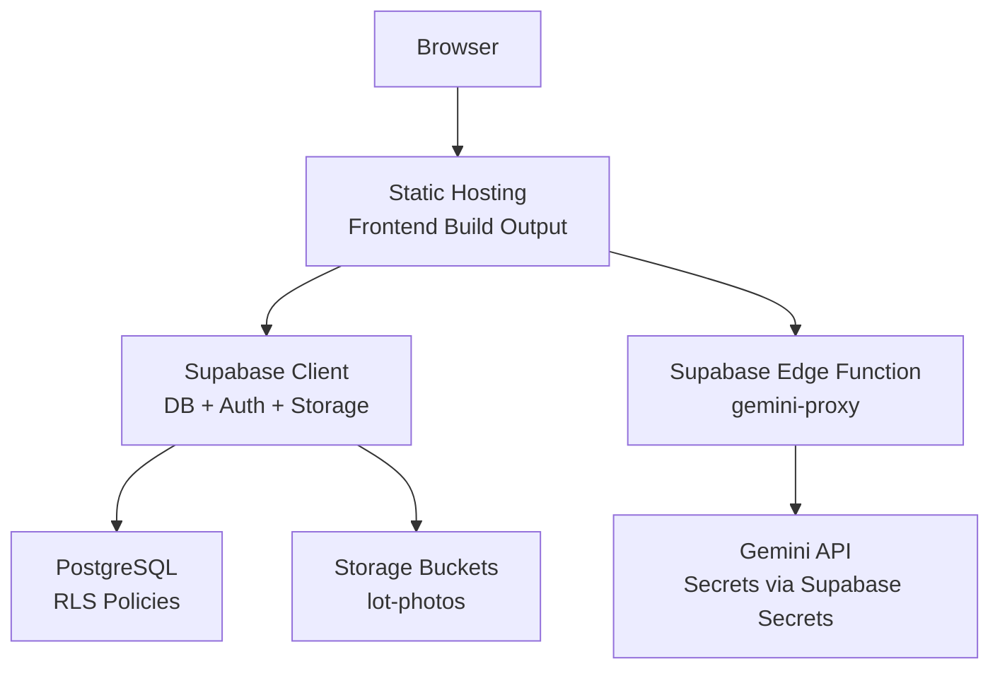
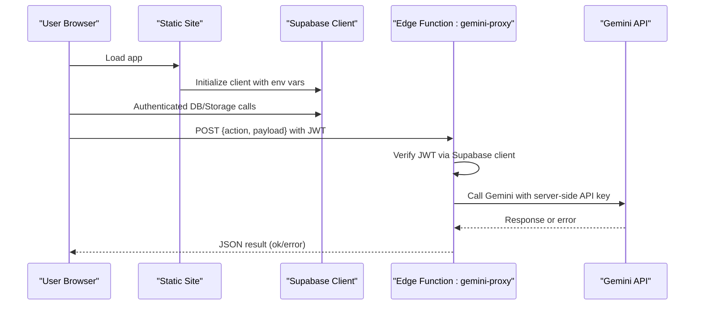
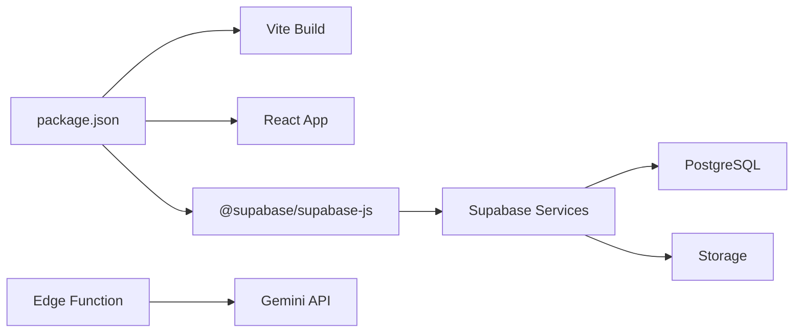

# Deployment & Production

<cite>
**Referenced Files in This Document**
- [package.json](file://freshroute/package.json)
- [vite.config.ts](file://freshroute/vite.config.ts)
- [tailwind.config.ts](file://freshroute/tailwind.config.ts)
- [postcss.config.js](file://freshroute/postcss.config.js)
- [supabase.ts](file://freshroute/src/lib/supabase.ts)
- [gemini-proxy/index.ts](file://freshroute/supabase/functions/gemini-proxy/index.ts)
- [0001_init.sql](file://freshroute/supabase/migrations/0001_init.sql)
- [README.md](file://freshroute/README.md)
- [.gitignore](file://freshroute/.gitignore)
</cite>

## Table of Contents
1. Introduction
2. Project Structure
3. Core Components
4. Architecture Overview
5. Detailed Component Analysis
6. Dependency Analysis
7. Performance Considerations
8. Troubleshooting Guide
9. Conclusion
10. Appendices

## Introduction
This document provides production deployment guidance for FreshRoute, covering build optimization, environment configuration, security, monitoring, performance, caching, scaling, and backup/recovery. The frontend is a React + TypeScript application built with Vite and intended for static hosting. The backend runs on Supabase (PostgreSQL database, Edge Functions, Storage), with an Edge Function proxying requests to the Gemini API while keeping secrets secure.

## Project Structure
FreshRoute consists of:
- Frontend: React app using Vite, Tailwind CSS, PostCSS, and Supabase client.
- Backend: Supabase project with migrations defining schema, Row Level Security policies, and storage buckets; an Edge Function that proxies calls to Gemini securely.

**Diagram sources**
- [vite.config.ts:5-12](file://freshroute/vite.config.ts#L5-L12)
- [supabase.ts:1-20](file://freshroute/src/lib/supabase.ts#L1-L20)
- [gemini-proxy/index.ts:1-16](file://freshroute/supabase/functions/gemini-proxy/index.ts#L1-L16)
- [0001_init.sql:26-37](file://freshroute/supabase/migrations/0001_init.sql#L26-L37)
- [0001_init.sql:308-321](file://freshroute/supabase/migrations/0001_init.sql#L308-L321)

**Section sources**
- [package.json:6-11](file://freshroute/package.json#L6-L11)
- [vite.config.ts:5-12](file://freshroute/vite.config.ts#L5-L12)
- [tailwind.config.ts:3-6](file://freshroute/tailwind.config.ts#L3-L6)
- [postcss.config.js:1-7](file://freshroute/postcss.config.js#L1-L7)

## Core Components
- Frontend build toolchain: Vite with React plugin, TypeScript, Tailwind, PostCSS.
- Supabase client initialization with environment variables for URL and anon key.
- Supabase Edge Function gemini-proxy that enforces authentication, reads secrets from environment, and proxies to Gemini.
- Database schema with RLS policies and storage bucket configuration.

Key responsibilities:
- Static site generation and asset optimization via Vite.
- Secure secret handling at runtime via Supabase Secrets.
- Data access governed by RLS policies defined in migrations.

**Section sources**
- [package.json:12-36](file://freshroute/package.json#L12-L36)
- [vite.config.ts:5-12](file://freshroute/vite.config.ts#L5-L12)
- [supabase.ts:1-20](file://freshroute/src/lib/supabase.ts#L1-L20)
- [gemini-proxy/index.ts:1-16](file://freshroute/supabase/functions/gemini-proxy/index.ts#L1-L16)
- [0001_init.sql:26-37](file://freshroute/supabase/migrations/0001_init.sql#L26-L37)
- [0001_init.sql:308-321](file://freshroute/supabase/migrations/0001_init.sql#L308-L321)

## Architecture Overview
The production architecture separates concerns:
- Frontend assets are served statically for fast delivery and caching.
- Supabase handles authentication, database, and storage with strict RLS.
- Sensitive AI integration is isolated in an Edge Function that never exposes API keys to the browser.

**Diagram sources**
- [supabase.ts:1-20](file://freshroute/src/lib/supabase.ts#L1-L20)
- [gemini-proxy/index.ts:61-75](file://freshroute/supabase/functions/gemini-proxy/index.ts#L61-L75)
- [gemini-proxy/index.ts:30-59](file://freshroute/supabase/functions/gemini-proxy/index.ts#L30-L59)

## Detailed Component Analysis

### Frontend Build Optimization (Vite)
- Use the provided build script to compile TypeScript and generate optimized static assets.
- Configure aliases for cleaner imports and maintainable code structure.
- Tailwind content scanning ensures only used styles are included in production builds.

Recommended production steps:
- Run the build command to produce minified, tree-shaken assets.
- Serve the output directory via a CDN-backed static host.
- Ensure environment variables for Supabase are injected at build time if needed.

Operational notes:
- Keep .env files out of version control.
- Validate environment variables before deploying to avoid runtime fallbacks.

**Section sources**
- [package.json:6-11](file://freshroute/package.json#L6-L11)
- [vite.config.ts:5-12](file://freshroute/vite.config.ts#L5-L12)
- [tailwind.config.ts:3-6](file://freshroute/tailwind.config.ts#L3-L6)
- [postcss.config.js:1-7](file://freshroute/postcss.config.js#L1-L7)

### Supabase Client Configuration
- The client reads Supabase URL and anon key from environment variables.
- Session persistence and token refresh are enabled for seamless auth flows.
- A feature flag indicates whether backend credentials are configured.

Production considerations:
- Provide valid Supabase URL and anon key in the deployment environment.
- Restrict CORS at the platform level to your domain where possible.
- Monitor session behavior and token refresh logs.

**Section sources**
- [supabase.ts:1-20](file://freshroute/src/lib/supabase.ts#L1-L20)

### Edge Function: gemini-proxy
- Enforces authenticated access by validating the caller’s JWT.
- Reads the Gemini API key from Supabase Secrets, never exposing it to clients.
- Provides endpoints for extraction, vision, chat, and status checks.
- Logs usage metrics to a dedicated table for observability.

Security and reliability:
- Only POST requests are accepted; OPTIONS preflight responses include CORS headers.
- Errors are returned as structured JSON with consistent ok/error fields.
- Usage logging supports monitoring and cost tracking.

Deployment checklist:
- Deploy the function to Supabase.
- Set required secrets (e.g., Gemini API key).
- Ensure the ai_usage table exists for logging.

**Section sources**
- [gemini-proxy/index.ts:1-16](file://freshroute/supabase/functions/gemini-proxy/index.ts#L1-L16)
- [gemini-proxy/index.ts:61-75](file://freshroute/supabase/functions/gemini-proxy/index.ts#L61-L75)
- [gemini-proxy/index.ts:30-59](file://freshroute/supabase/functions/gemini-proxy/index.ts#L30-L59)
- [gemini-proxy/index.ts:87-101](file://freshroute/supabase/functions/gemini-proxy/index.ts#L87-L101)

### Database Schema and Security (RLS)
- Defines core tables: profiles, orders, reviews, notifications, audit_log, chat_messages, chat_state, image_analyses, ai_usage.
- Enables Row Level Security across tables with policies restricting access to user-owned data or admins.
- Creates a storage bucket for lot photos with public read and authenticated upload policies.

Production implications:
- RLS protects against unauthorized data access even if client logic is bypassed.
- Admin helpers and functions enforce role-based privileges.
- Indexes improve query performance for common operations.

Backup and recovery:
- Use Supabase native backups and point-in-time restore capabilities.
- Export migrations for version-controlled schema changes.

**Section sources**
- [0001_init.sql:26-37](file://freshroute/supabase/migrations/0001_init.sql#L26-L37)
- [0001_init.sql:75-113](file://freshroute/supabase/migrations/0001_init.sql#L75-L113)
- [0001_init.sql:116-163](file://freshroute/supabase/migrations/0001_init.sql#L116-L163)
- [0001_init.sql:167-209](file://freshroute/supabase/migrations/0001_init.sql#L167-L209)
- [0001_init.sql:210-225](file://freshroute/supabase/migrations/0001_init.sql#L210-L225)
- [0001_init.sql:228-255](file://freshroute/supabase/migrations/0001_init.sql#L228-L255)
- [0001_init.sql:258-276](file://freshroute/supabase/migrations/0001_init.sql#L258-L276)
- [0001_init.sql:308-321](file://freshroute/supabase/migrations/0001_init.sql#L308-L321)

## Dependency Analysis
- Frontend depends on Vite, React, TypeScript, Tailwind, PostCSS, and Supabase client.
- Backend relies on Supabase services: Auth, Database, Storage, and Edge Functions.
- External dependency: Gemini API accessed exclusively through the Edge Function.

**Diagram sources**
- [package.json:12-36](file://freshroute/package.json#L12-L36)
- [gemini-proxy/index.ts:1-16](file://freshroute/supabase/functions/gemini-proxy/index.ts#L1-L16)

**Section sources**
- [package.json:12-36](file://freshroute/package.json#L12-L36)
- [gemini-proxy/index.ts:1-16](file://freshroute/supabase/functions/gemini-proxy/index.ts#L1-L16)

## Performance Considerations
- Build optimizations:
  - Use the provided build script to generate minified, tree-shaken assets.
  - Tailwind content scanning reduces CSS size by including only used classes.
  - Avoid unnecessary dependencies to keep bundle size small.
- Runtime performance:
  - Cache static assets via CDN with long-lived cache headers.
  - Leverage Supabase Edge Functions for low-latency serverless processing.
  - Monitor latency and errors via the ai_usage table and application logs.
- Scaling:
  - Horizontal scaling is inherent for static hosting and Supabase Edge Functions.
  - Database scaling benefits from indexes and efficient queries defined in migrations.

[No sources needed since this section provides general guidance]

## Troubleshooting Guide
Common issues and resolutions:
- Missing environment variables:
  - Ensure Supabase URL and anon key are set in the deployment environment for the frontend.
  - Confirm the Edge Function has required secrets configured.
- Authentication failures:
  - Verify JWT presence and validity when calling the Edge Function.
  - Check Supabase auth settings and session persistence options.
- CORS errors:
  - Confirm allowed origins and headers match your deployment domain.
  - Ensure preflight requests are handled correctly by the Edge Function.
- API key problems:
  - Validate the Gemini API key stored in Supabase Secrets.
  - Use the status endpoint to check key configuration and connectivity.
- Database access denied:
  - Review RLS policies to ensure users can access their own data.
  - Confirm roles and admin helpers are functioning as expected.

**Section sources**
- [supabase.ts:1-20](file://freshroute/src/lib/supabase.ts#L1-L20)
- [gemini-proxy/index.ts:61-75](file://freshroute/supabase/functions/gemini-proxy/index.ts#L61-L75)
- [gemini-proxy/index.ts:103-140](file://freshroute/supabase/functions/gemini-proxy/index.ts#L103-L140)
- [0001_init.sql:26-37](file://freshroute/supabase/migrations/0001_init.sql#L26-L37)
- [0001_init.sql:308-321](file://freshroute/supabase/migrations/0001_init.sql#L308-L321)

## Conclusion
FreshRoute’s production setup leverages a modern, secure, and scalable stack:
- Static frontend hosted efficiently with optimized builds.
- Supabase providing robust backend services with strong security via RLS.
- Edge Function isolating sensitive integrations and enforcing authentication.
Adhering to the deployment and operational guidelines in this document will help ensure reliable performance, security, and scalability in production.

[No sources needed since this section summarizes without analyzing specific files]

## Appendices

### Environment Configuration Management
- Frontend:
  - Provide VITE_SUPABASE_URL and VITE_SUPABASE_ANON_KEY at deploy time.
  - Do not commit environment files to version control.
- Backend:
  - Store GEMINI_API_KEY and other secrets in Supabase Secrets.
  - Use service role keys only within trusted server-side contexts (Edge Functions).

**Section sources**
- [supabase.ts:1-20](file://freshroute/src/lib/supabase.ts#L1-L20)
- [gemini-proxy/index.ts:1-16](file://freshroute/supabase/functions/gemini-proxy/index.ts#L1-L16)

### Security Considerations
- API key protection:
  - Never expose Gemini API keys to the browser; use Edge Functions.
  - Rotate keys regularly and limit access to necessary environments.
- CORS policies:
  - Restrict allowed origins to your production domain.
  - Limit exposed headers to only what is required.
- Authentication and authorization:
  - Enforce JWT validation on all protected endpoints.
  - Use RLS policies to restrict data access at the database layer.

**Section sources**
- [gemini-proxy/index.ts:61-75](file://freshroute/supabase/functions/gemini-proxy/index.ts#L61-L75)
- [0001_init.sql:26-37](file://freshroute/supabase/migrations/0001_init.sql#L26-L37)

### Monitoring Setup
- Application-level:
  - Track AI usage metrics via the ai_usage table for latency and error rates.
  - Instrument frontend errors and network failures for observability.
- Infrastructure-level:
  - Enable Supabase logs and alerts for Edge Functions and database performance.
  - Monitor CDN cache hit ratios and origin response times.

**Section sources**
- [gemini-proxy/index.ts:87-101](file://freshroute/supabase/functions/gemini-proxy/index.ts#L87-L101)
- [0001_init.sql:258-276](file://freshroute/supabase/migrations/0001_init.sql#L258-L276)

### Backup and Recovery Procedures
- Database:
  - Use Supabase native backups and point-in-time restore to recover from incidents.
  - Version-control migrations to reconstruct schema reliably.
- Storage:
  - Ensure bucket policies allow appropriate access for backups and restores.
  - Periodically verify integrity of critical assets.

**Section sources**
- [0001_init.sql:308-321](file://freshroute/supabase/migrations/0001_init.sql#L308-L321)