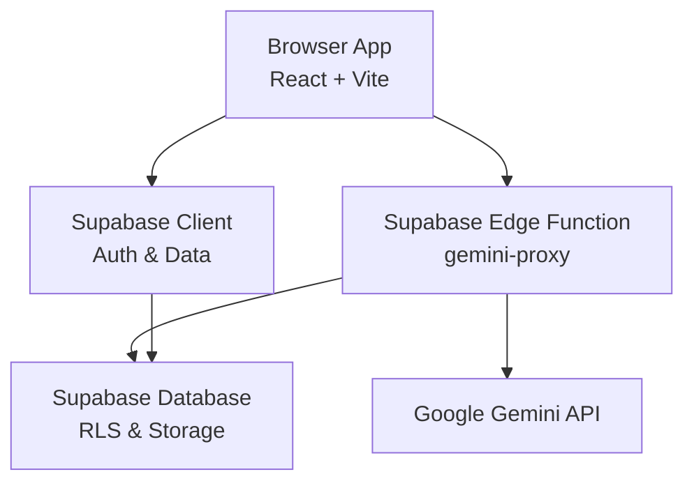
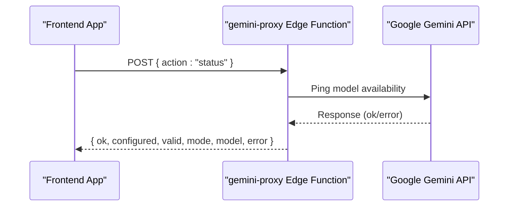
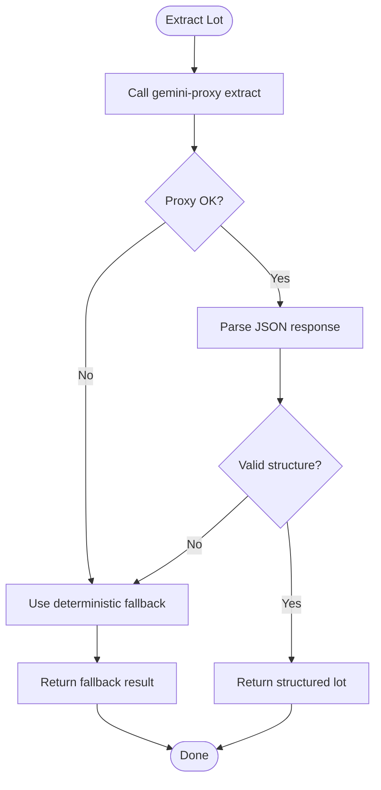

# Getting Started

<cite>
**Referenced Files in This Document**
- [package.json](file://freshroute/package.json)
- [vite.config.ts](file://freshroute/vite.config.ts)
- [README.md](file://freshroute/README.md)
- [supabase.ts](file://freshroute/src/lib/supabase.ts)
- [gemini.ts](file://freshroute/src/lib/gemini.ts)
- [index.ts (gemini-proxy)](file://freshroute/supabase/functions/gemini-proxy/index.ts)
- [0001_init.sql](file://freshroute/supabase/migrations/0001_init.sql)
- [0002_seed.sql](file://freshroute/supabase/migrations/0002_seed.sql)
- [App.tsx](file://freshroute/src/App.tsx)
- [main.tsx](file://freshroute/src/main.tsx)
</cite>

## Table of Contents
1. Introduction
2. Prerequisites
3. Installation
4. Environment Setup
5. Database and Edge Functions
6. Running the Development Server
7. Initial Configuration Checklist
8. Basic Testing Procedures
9. Troubleshooting Common Issues
10. Verification Steps
11. Architecture Overview
12. Conclusion

## Introduction
FreshRoute is a React + TypeScript + Vite application that integrates with Supabase for authentication, database, storage, and edge functions, and uses Google Gemini via a secure proxy to provide AI-powered features such as lot extraction, image analysis, and chat assistance. This guide walks you through prerequisites, installation, environment configuration, database migrations, edge function deployment, and initial testing to get FreshRoute running locally.

## Prerequisites
- Node.js: Use a recent LTS version compatible with Vite 8 and TypeScript ~6.0. The project uses modern ESM and Vite plugins; an up-to-date Node LTS is recommended.
- npm or yarn: Either package manager works. The scripts use npm by default.
- Supabase account and project: You will need your Project URL and anon key. For edge functions, you will also set secrets on the Supabase dashboard.
- Google Gemini API access: You must have a valid Gemini API key to enable live AI features. The key is stored only in Supabase Edge Function secrets.

Notes:
- The app reads Supabase credentials from environment variables at runtime.
- The app falls back to demo mode if the Gemini API key is not configured on the server.

**Section sources**
- [package.json:1-38](file://freshroute/package.json#L1-L38)
- [README.md:1-33](file://freshroute/README.md#L1-L33)

## Installation
1. Clone the repository into your workspace.
2. Navigate to the project directory:
   - cd freshroute
3. Install dependencies:
   - npm install
4. Verify the build tooling:
   - The project uses Vite for development and building, and TypeScript for type checking.

What this installs:
- React, React DOM, routing, state management, UI utilities, and Tailwind CSS.
- Supabase client library for browser-side data access.
- Google GenAI client dependency included in the project.

**Section sources**
- [package.json:12-36](file://freshroute/package.json#L12-L36)
- [vite.config.ts:1-13](file://freshroute/vite.config.ts#L1-L13)

## Environment Setup
Create a local environment file to configure Supabase and optional Gemini integration.

Required environment variables:
- VITE_SUPABASE_URL: Your Supabase project URL.
- VITE_SUPABASE_ANON_KEY: Your Supabase anon key.

Optional environment variable:
- VITE_GEMINI_API_KEY: If provided here, it can be used by client-side logic where applicable. However, the primary path for Gemini usage is through the Supabase Edge Function, which reads GEMINI_API_KEY from server secrets.

Where to put them:
- Create .env.local in the freshroute directory with the above variables.
- Do not commit secrets to version control; they are ignored by default.

How the app uses them:
- The Supabase client is created using VITE_SUPABASE_URL and VITE_SUPABASE_ANON_KEY.
- A backendConfigured flag indicates whether credentials are present.

Important:
- The Supabase Edge Function requires its own secrets set in the Supabase dashboard:
  - SUPABASE_URL
  - SUPABASE_ANON_KEY
  - SUPABASE_SERVICE_ROLE_KEY
  - GEMINI_API_KEY

These server secrets are read inside the Edge Function and never shipped to the browser.

**Section sources**
- [supabase.ts:1-20](file://freshroute/src/lib/supabase.ts#L1-L20)
- [index.ts (gemini-proxy):1-12](file://freshroute/supabase/functions/gemini-proxy/index.ts#L1-L12)

## Database and Edge Functions
Database schema and seed data:
- Run the initial migration to create tables, policies, views, and storage buckets.
- Optionally run the seed migration to populate demo data for profiles, orders, reviews, and related entities.

Edge function:
- Deploy the gemini-proxy function to your Supabase project.
- Set the required secrets on the Supabase dashboard so the function can call Gemini and write audit logs.

Why this matters:
- The frontend calls the Edge Function to perform AI tasks securely without exposing API keys.
- The Edge Function verifies user sessions and logs AI usage metrics.

**Section sources**
- [0001_init.sql:1-321](file://freshroute/supabase/migrations/0001_init.sql#L1-L321)
- [0002_seed.sql:1-157](file://freshroute/supabase/migrations/0002_seed.sql#L1-L157)
- [index.ts (gemini-proxy):1-12](file://freshroute/supabase/functions/gemini-proxy/index.ts#L1-L12)

## Running the Development Server
Start the development server:
- npm run dev

This launches Vite with Hot Module Replacement and serves the app locally.

Build for production:
- npm run build

Preview the production build:
- npm run preview

Linting:
- npm run lint

The app entry point renders the main component and initializes the application boot sequence.

**Section sources**
- [package.json:6-11](file://freshroute/package.json#L6-L11)
- [main.tsx:1-11](file://freshroute/src/main.tsx#L1-L11)
- [App.tsx:1-37](file://freshroute/src/App.tsx#L1-L37)

## Initial Configuration Checklist
- Ensure Node.js and npm/yarn are installed and up to date.
- Create .env.local with VITE_SUPABASE_URL and VITE_SUPABASE_ANON_KEY.
- In Supabase:
  - Apply migrations (0001_init.sql), then optionally apply seed data (0002_seed.sql).
  - Deploy the gemini-proxy Edge Function.
  - Set secrets: SUPABASE_URL, SUPABASE_ANON_KEY, SUPABASE_SERVICE_ROLE_KEY, GEMINI_API_KEY.
- Start the dev server and verify the app loads.
- Test authentication flows and AI features after setting up the Edge Function.

Verification tips:
- Confirm the Supabase client is configured by checking that backendConfigured evaluates to true when credentials are present.
- Check AI status via the app’s AI status check to determine if the Edge Function is reachable and the Gemini key is valid.

**Section sources**
- [supabase.ts:1-20](file://freshroute/src/lib/supabase.ts#L1-L20)
- [gemini.ts:36-42](file://freshroute/src/lib/gemini.ts#L36-L42)
- [index.ts (gemini-proxy):103-128](file://freshroute/supabase/functions/gemini-proxy/index.ts#L103-L128)

## Basic Testing Procedures
- Launch the dev server and open the app in your browser.
- Test basic UI interactions: navigation, chat input, quick replies, photo upload sheet, settings sheet, and audit drawer.
- Test AI features:
  - Lot extraction: send a message describing produce details.
  - Image analysis: upload a photo to get quality grading.
  - Chat assistant: ask questions about markets, pricing, and logistics.
- Validate fallback behavior:
  - If the Gemini key is missing or invalid, the app should operate in demo mode with deterministic fallbacks for extraction, vision, and chat responses.

Expected behaviors:
- Without a valid Gemini key, the app remains usable but in demo mode.
- With a valid key, AI features return real-time results and log usage.

**Section sources**
- [gemini.ts:55-116](file://freshroute/src/lib/gemini.ts#L55-L116)
- [gemini.ts:131-182](file://freshroute/src/lib/gemini.ts#L131-L182)
- [index.ts (gemini-proxy):130-140](file://freshroute/supabase/functions/gemini-proxy/index.ts#L130-L140)

## Troubleshooting Common Issues
- Missing or incorrect Supabase credentials:
  - Ensure VITE_SUPABASE_URL and VITE_SUPABASE_ANON_KEY are set in .env.local.
  - The app will fall back to placeholder values if not configured; confirm backendConfigured is true.
- Edge Function unreachable:
  - Verify the gemini-proxy function is deployed and accessible.
  - Check network errors and CORS headers in the function response.
- Invalid or missing Gemini API key:
  - Set GEMINI_API_KEY in Supabase secrets.
  - Use the status action to check if the key is valid and the model is available.
- Rate limits or model availability errors:
  - The function returns specific messages for rate limiting or model unavailability; retry later or adjust usage.
- Demo mode activation:
  - If no server key is configured, the function runs in demo mode; AI features will use deterministic fallbacks.

Diagnostics:
- Inspect AI status responses to identify configuration issues.
- Review error messages returned by the proxy for actionable guidance.

**Section sources**
- [supabase.ts:1-20](file://freshroute/src/lib/supabase.ts#L1-L20)
- [gemini.ts:36-42](file://freshroute/src/lib/gemini.ts#L36-L42)
- [index.ts (gemini-proxy):25-59](file://freshroute/supabase/functions/gemini-proxy/index.ts#L25-L59)
- [index.ts (gemini-proxy):103-140](file://freshroute/supabase/functions/gemini-proxy/index.ts#L103-L140)

## Verification Steps
- Confirm environment variables:
  - VITE_SUPABASE_URL and VITE_SUPABASE_ANON_KEY are present and correct.
- Confirm backend configuration:
  - backendConfigured should be true when credentials exist.
- Confirm Edge Function status:
  - Call the status action to verify the function is reachable and the Gemini key is valid.
- Confirm database schema:
  - Ensure migrations have been applied and tables exist.
- Confirm seed data (optional):
  - Run the seed migration to populate demo profiles and orders.

If all checks pass, the app should load successfully and AI features should work according to the configured mode (live or demo).

**Section sources**
- [supabase.ts:1-20](file://freshroute/src/lib/supabase.ts#L1-L20)
- [gemini.ts:36-42](file://freshroute/src/lib/gemini.ts#L36-L42)
- [0001_init.sql:1-321](file://freshroute/supabase/migrations/0001_init.sql#L1-L321)
- [0002_seed.sql:1-157](file://freshroute/supabase/migrations/0002_seed.sql#L1-L157)

## Architecture Overview
High-level flow:
- The React app runs in the browser and communicates with Supabase for auth and data.
- AI requests go through a Supabase Edge Function that holds the Gemini API key securely.
- The Edge Function validates user sessions, calls Gemini, and logs usage metrics.

**Diagram sources**
- [supabase.ts:1-20](file://freshroute/src/lib/supabase.ts#L1-L20)
- [gemini.ts:28-42](file://freshroute/src/lib/gemini.ts#L28-L42)
- [index.ts (gemini-proxy):61-128](file://freshroute/supabase/functions/gemini-proxy/index.ts#L61-L128)

### Sequence: AI Status Check

**Diagram sources**
- [gemini.ts:36-42](file://freshroute/src/lib/gemini.ts#L36-L42)
- [index.ts (gemini-proxy):103-128](file://freshroute/supabase/functions/gemini-proxy/index.ts#L103-L128)

### Flow: Lot Extraction with Fallback

**Diagram sources**
- [gemini.ts:91-116](file://freshroute/src/lib/gemini.ts#L91-L116)
- [gemini.ts:55-89](file://freshroute/src/lib/gemini.ts#L55-L89)
- [index.ts (gemini-proxy):142-188](file://freshroute/supabase/functions/gemini-proxy/index.ts#L142-L188)

## Performance Considerations
- Use demo mode during development if the Gemini key is not configured to avoid external API latency.
- Batch operations where possible and leverage Supabase RLS policies to minimize unnecessary queries.
- Monitor AI usage logs to identify slow endpoints or frequent errors.

[No sources needed since this section provides general guidance]

## Troubleshooting Guide
- Environment variables not loaded:
  - Ensure .env.local exists in the project root and contains the required variables.
- Supabase client not configured:
  - Verify backendConfigured is true; otherwise, check VITE_SUPABASE_URL and VITE_SUPABASE_ANON_KEY.
- Edge Function errors:
  - Check CORS and method restrictions; ensure POST is used.
  - Validate Authorization header format and session validity.
- Gemini API errors:
  - Inspect status responses for rate limiting or model availability issues.
  - Confirm GEMINI_API_KEY is set in Supabase secrets.

**Section sources**
- [supabase.ts:1-20](file://freshroute/src/lib/supabase.ts#L1-L20)
- [index.ts (gemini-proxy):25-59](file://freshroute/supabase/functions/gemini-proxy/index.ts#L25-L59)
- [gemini.ts:36-42](file://freshroute/src/lib/gemini.ts#L36-L42)

## Conclusion
You now have everything needed to set up FreshRoute locally, configure Supabase and Gemini, deploy the Edge Function, and validate the application. Follow the checklist and verification steps to ensure a smooth setup. If you encounter issues, refer to the troubleshooting section and inspect the AI status and error messages for actionable diagnostics.